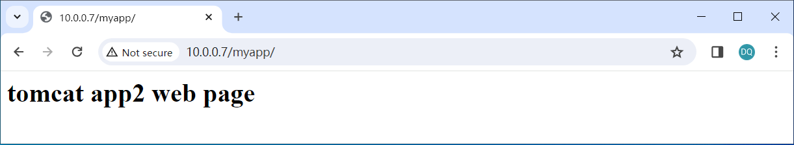

# 构建haproxy镜像

## 1. 准备生成haproxy镜像的配置目录

```sh
# 准备和haproxy相关的配置目录
[root@centos7 ~]# cd /opt/dockerfile/web
[root@centos7 web]# mkdir haproxy
[root@centos7 web]# pwd
/opt/dockerfile/web
[root@centos7 web]# cd haproxy
[root@centos7 haproxy]# pwd
/opt/dockerfile/web/haproxy

# 查看当前镜像
[root@centos7 haproxy]# docker images
REPOSITORY                                 TAG                   IMAGE ID       CREATED        SIZE
harbor.magedu.net/m43/tomcat-m43           app2                  941a5663c605   45 hours ago   1.09GB
harbor.magedu.net/m43/tomcat-m43           app1                  516e77afa80a   2 days ago     1.09GB
harbor.magedu.net/m43/centos-tomcat-base   v8.5.65               d1f528c8d25f   3 days ago     1.07GB
harbor.magedu.net/m43/centos-jdk-base      8u212                 1b3f65fa1faf   3 days ago     1.06GB
harbor.magedu.net/m43/centos-base          2024-01-11_11-21-39   7018ca607c04   3 days ago     652MB
harbor.magedu.net/m43/centos-base          7.8.2003              7018ca607c04   3 days ago     652MB
centos                                     7.8.2003              afb6fca791e0   3 years ago    203MB

```
## 2. 准备haproxy源码

```sh
[root@centos7 haproxy]# ls
haproxy-2.2.11.tar.gz
```

## 3. 准备Dockerfile，第一次

```sh
# 构建haproxy镜像的Dockerfile，第一次
# 说明：
# 1. 添加haproxy安装的依赖包
# 2. 解压haproxy包到/usr/local/src/下
# 3. 执行二进制包编译（编译时指定了haproxy的安装目录）
[root@centos7 haproxy]# vim Dockerfile 
#haproxy image
FROM harbor.magedu.net/m43/centos-base:7.8.2003
LABEL maintainer="Dawson 3240836@qq.com"
RUN yum -y install libtermcap-devel ncurses-devel libevent-devel readline-devel gcc gcc-c++ glibc glibc-devel pcre pcre-devel openssl openssl-devel systemd-devel net-tools vim iotop bc zip unzip zlib-devel lrzsz tree screen lsof tcpdump wget ntpdate
ADD haproxy-2.2.11.tar.gz /usr/local/src/
RUN cd /usr/local/src/haproxy-2.2.11 && make ARCH=x86_64 TARGET=linux-glibc USE_PCRE=1 USE_OPENSSL=1 USE_ZLIB=1 USE_SYSTEMD=1 USE_CPU_AFFINITY=1 PREFIX=/apps/haproxy && make install PREFIX=/apps/haproxy && cp haproxy /usr/sbin/
```
## 4. 执行构建，第一次

```sh
# 编写执行构建脚本
[root@centos7 haproxy]# vim build-command.sh 
#!/bin/bash
docker build -t harbor.magedu.net/m43/haproxy:v2.2.11 .

# 执行构建
[root@centos7 haproxy]# bash build-command.sh

# 查看构建的haproxy镜像
[root@centos7 haproxy]# docker images                                                                                   
REPOSITORY                                 TAG                   IMAGE ID       CREATED          SIZE                   
harbor.magedu.net/m43/haproxy              v2.2.11               610957687beb   32 seconds ago   1.05GB
harbor.magedu.net/m43/tomcat-m43           app2                  941a5663c605   46 hours ago     1.09GB
harbor.magedu.net/m43/tomcat-m43           app1                  516e77afa80a   2 days ago       1.09GB
harbor.magedu.net/m43/centos-tomcat-base   v8.5.65               d1f528c8d25f   3 days ago       1.07GB
harbor.magedu.net/m43/centos-jdk-base      8u212                 1b3f65fa1faf   3 days ago       1.06GB
harbor.magedu.net/m43/centos-base          2024-01-11_11-21-39   7018ca607c04   3 days ago       652MB
harbor.magedu.net/m43/centos-base          7.8.2003              7018ca607c04   3 days ago       652MB
centos                                     7.8.2003              afb6fca791e0   3 years ago      203MB
```
## 5. 从镜像启动容器，查看haproxy是否安装成功

```sh
[root@centos7 haproxy]# docker run -it --rm -p 8800:80 harbor.magedu.net/m43/haproxy:v2.2.11 bash
[root@dcecfb1abd6f /]# ll /apps/haproxy
total 0
drwxr-xr-x 3 root root 21 Jan 14 19:07 doc
drwxr-xr-x 2 root root 21 Jan 14 19:07 sbin
drwxr-xr-x 3 root root 17 Jan 14 19:07 share
[root@dcecfb1abd6f /]# /apps/haproxy/sbin/haproxy -v
HA-Proxy version 2.2.11-c58c4e4 2021/03/18 - https://haproxy.org/
Status: long-term supported branch - will stop receiving fixes around Q2 2025.
Known bugs: http://www.haproxy.org/bugs/bugs-2.2.11.html
Running on: Linux 3.10.0-1160.el7.x86_64 #1 SMP Mon Oct 19 16:18:59 UTC 2020 x86_64
[root@dcecfb1abd6f /]# 

# 说明：此时haproxy并没有启动，只是查看了haproxy安装后的脚本
```

## 6. 添加haproxy配置

```sh
# 撰写haproxy配置文件
[root@centos7 haproxy]# vim haproxy.cfg
global
chroot /apps/haproxy
#stats socket /var/lib/haproxy/haproxy.sock mode 600 level admin
uid 99
gid 99
daemon
nbproc 1
pidfile /apps/haproxy/run/haproxy.pid
log 127.0.0.1 local3 info

defaults
option http-keep-alive
option forwardfor
mode http
timeout connect 300000ms
timeout client  300000ms
timeout server  300000ms

listen stats
 mode http
 bind 0.0.0.0:9999
 stats enable
 log global
 stats uri    /haproxy-status
 stats auth   haadmin:123456

listen web_port
 bind 0.0.0.0:80
 mode http
 log global
 balance roundrobin
 server web1 10.0.0.7:8080 check inter 3000 fall 2 rise 5
 server web2 10.0.0.17:8080 check inter 3000 fall 2 rise 5
```
## 7. 添加启动haproxy脚本

```sh
# 编写启动haproxy脚本
[root@centos7 haproxy]# vim run_haproxy.sh 
#!/bin/bash
/apps/haproxy/sbin/haproxy -f /etc/haproxy/haproxy.cfg
tail -f /etc/hosts

# 添加文件执行权限
[root@centos7 haproxy]# chmod a+x run_haproxy.sh
```
## 8. 准备Dockerfile，第二次

```sh
# 构建haproxy镜像的Dockerfile，第二次
# 1. 增加haproxy配置和启动脚本
# 2. 创建运行脚本的目录
[root@centos7 haproxy]# vim Dockerfile 
#haproxy image
FROM harbor.magedu.net/m43/centos-base:7.8.2003
LABEL maintainer="Dawson 3240836@qq.com"
RUN yum -y install libtermcap-devel ncurses-devel libevent-devel readline-devel gcc gcc-c++ glibc glibc-devel pcre pcre-devel openssl openssl-devel systemd-devel net-tools vim iotop bc zip unzip zlib-devel lrzsz tree screen lsof tcpdump wget ntpdate
ADD haproxy-2.2.11.tar.gz /usr/local/src/
RUN cd /usr/local/src/haproxy-2.2.11 && make ARCH=x86_64 TARGET=linux-glibc USE_PCRE=1 USE_OPENSSL=1 USE_ZLIB=1 USE_SYSTEMD=1 USE_CPU_AFFINITY=1 PREFIX=/apps/haproxy && make install PREFIX=/apps/haproxy && cp haproxy /usr/sbin/ && mkdir /apps/haproxy/run -p
ADD run_haproxy.sh /apps/haproxy/bin/run_haproxy.sh
ADD haproxy.cfg /etc/haproxy/haproxy.cfg
EXPOSE 80 9999
CMD ["/apps/haproxy/bin/run_haproxy.sh"]
```
## 9. 执行构建，第二次

```sh
[root@centos7 haproxy]# bash build-command.sh

[root@centos7 haproxy]# docker images
REPOSITORY                                 TAG                   IMAGE ID       CREATED          SIZE
harbor.magedu.net/m43/haproxy              v2.2.11               96bbfa356445   5 seconds ago    1.05GB
<none>                                     <none>                452b343760c5   46 minutes ago   1.05GB
<none>                                     <none>                610957687beb   2 hours ago      1.05GB
harbor.magedu.net/m43/tomcat-m43           app2                  941a5663c605   47 hours ago     1.09GB
harbor.magedu.net/m43/tomcat-m43           app1                  516e77afa80a   2 days ago       1.09GB
harbor.magedu.net/m43/centos-tomcat-base   v8.5.65               d1f528c8d25f   3 days ago       1.07GB
harbor.magedu.net/m43/centos-jdk-base      8u212                 1b3f65fa1faf   3 days ago       1.06GB
harbor.magedu.net/m43/centos-base          2024-01-11_11-21-39   7018ca607c04   3 days ago       652MB
harbor.magedu.net/m43/centos-base          7.8.2003              7018ca607c04   3 days ago       652MB
centos                                     7.8.2003              afb6fca791e0   3 years ago      203MB
```

## 10. 从镜像启动容器，检查haproxy进程启动情况

```sh
[root@centos7 haproxy]# docker run -it -p 80:80 -p 9999:9999 harbor.magedu.net/m43/haproxy:v2.2.11
127.0.0.1	localhost
::1	localhost ip6-localhost ip6-loopback
fe00::0	ip6-localnet
ff00::0	ip6-mcastprefix
ff02::1	ip6-allnodes
ff02::2	ip6-allrouters
172.17.0.2	e7c780b2f5ed

[root@centos7 haproxy]# docker ps
CONTAINER ID   IMAGE                                   COMMAND                  CREATED          STATUS          PORTS                                                                          NAMES
e7c780b2f5ed   harbor.magedu.net/m43/haproxy:v2.2.11   "/apps/haproxy/bin/r…"   25 seconds ago   Up 25 seconds   0.0.0.0:80->80/tcp, :::80->80/tcp, 0.0.0.0:9999->9999/tcp, :::9999->9999/tcp   mystifying_black

# 进入到容器中，查看是否存在haproxy进程
[root@centos7 haproxy]# docker exec -it e7c780b2f5ed bash
[root@e7c780b2f5ed /]# ps -ef | grep haproxy
root          1      0  0 20:49 pts/0    00:00:00 /bin/bash /apps/haproxy/bin/run_haproxy.sh
nobody        9      1  0 20:49 ?        00:00:00 /apps/haproxy/sbin/haproxy -f /etc/haproxy/haproxy.cfg
root         31     14  0 20:51 pts/1    00:00:00 grep --color=auto haproxy
[root@e7c780b2f5ed /]# ss -ntl
State      Recv-Q Send-Q               Local Address:Port                              Peer Address:Port              
LISTEN     0      128                              *:9999                                         *:*                  
LISTEN     0      128                              *:80                                           *:*                  
[root@e7c780b2f5ed /]# 
```
## 11. 启动haproxy代理的后端服务器（以容器运行）

```sh
# 10.0.0.7
[root@centos7 ~]# docker run -it -d -p 8080:8080 harbor.magedu.net/m43/tomcat-m43:app1
e2da5af79fe981df4d7c8142fe74d4bcdc40df8fbc7728e5e7418046c4c99948

# 10.0.0.17
[root@centos7 ~]# docker run -it -d -p 8080:8080 harbor.magedu.net/m43/tomcat-m43:app2
4bd6f870428d7f2ace7b1d89937e08f1e91df21148fbad0d7c3d03c6cd4c1cc9
```

## 12. 访问haproxy控制端


## 13. web访问验证




说明：由于haproxy代理，容器地址都是10.0.0.7，代理到后端两个容器，这两个容器在10.0.0.7和10.0.0.17宿主机上分别运行。