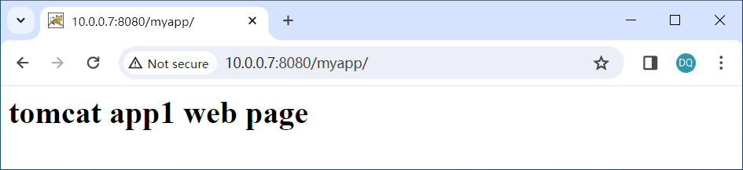
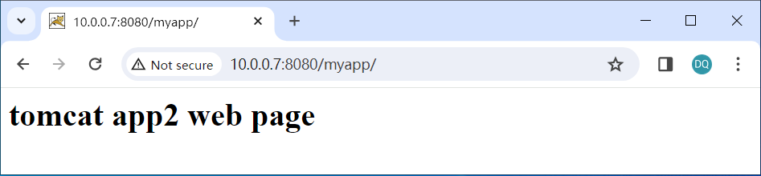

# 自定义 Tomcat 业务镜像

准备工作
+ 规划并创建Dockerfile文件存放目录
+ 下载 centos 镜像

```sh
# 规划并创建完整的Dockerfile文件存放目录
[root@centos7 ~]# cd /opt/
[root@centos7 opt]# mkdir dockerfile/{web/{nginx,tomcat,jdk,apache},system/{centos,ubuntu,redhat}} -pv

# 下载 centos:7.8.2003 镜像
[root@centos7 opt]# docker pull centos:7.8.2003

# 查看下载的 root base 镜像
[root@centos7 opt]# docker images
REPOSITORY   TAG        IMAGE ID       CREATED       SIZE
centos       7.8.2003   afb6fca791e0   3 years ago   203MB
```

## 1. 构建 JDK 镜像

### 1.1. 自定义 CentOS 基础镜像

+ 定义构建镜像的脚本文件

```sh
[root@centos7 opt]# cd dockerfile/system/centos/

# 创建 build-command.sh 脚本
[root@centos7 centos]# cat build-command.sh
#!/bin/bash
TAG=$1
docker build -t harbor.magedu.net/m43/centos-base:${TAG} .
```
+ 第一层构建

```sh
# 第一层构建：centos基础镜像
[root@centos7 centos]# vim Dockerfile
FROM centos:7.8.2003
LABEL maintainer="Dawson 3240836@qq.com"
RUN yum -y install epel-release && yum -y install vim wget tree lrzsz gcc gcc-c++ automake pcre pcre-devel zlib zlib-devel openssl openssl-devel iproute net-tools iotop && groupadd www -g 2022 && useradd www -u 2022 -g www

# 执行构建
[root@centos7 centos]# bash build-command.sh 7.8.2003

# 工作中通常会以时间来区分镜像不同版本
[root@centos7 centos]# bash build-command.sh 2024-01-11_11-21-39

# 查看创建的镜像
[root@centos7 centos]# docker images
REPOSITORY                          TAG                   IMAGE ID       CREATED          SIZE
harbor.magedu.net/m43/centos-base   2024-01-11_11-21-39   7018ca607c04   15 minutes ago   652MB
harbor.magedu.net/m43/centos-base   7.8.2003              7018ca607c04   15 minutes ago   652MB
centos                              7.8.2003              afb6fca791e0   3 years ago      203MB
```

### 1.2. 执行构建 JDK 镜像

+ 创建JDK镜像的准备工作

```sh
# 创建并进入构建JDK镜像的指定目录
[root@centos7 centos]# pwd
/opt/dockerfile/system/centos

[root@centos7 centos]# cd /opt/dockerfile/web/jdk
[root@centos7 jdk]# pwd
/opt/dockerfile/web/jdk

# 使用jdk-8u-212版本
[root@centos7 jdk]# mkdir jdk-8u-212
[root@centos7 jdk]# cd jdk-8u-212/
[root@centos7 jdk-8u-212]# pwd
/opt/dockerfile/web/jdk/jdk-8u-212
```

### 1.3. 上传JDK压缩包和profile文件

+ 上传JDK压缩包
+ 启动centos基础镜像的容器，拷贝profile文件，添加相关的环境变量

```sh
# 上传 jdk-8u212-linux-x64.tar.gz 到这个目录中
[root@centos7 jdk-8u-212]# ls
jdk-8u333-linux-x64.tar.gz

# 启动一个 centos-base 镜像的容器
[root@centos7 jdk-8u-212]# docker run -it harbor.magedu.net/m43/centos-base:7.8.2003 bash
[root@336c090d1173 /]# 
......

# 从该容器中拷贝profile文件到当前目录下
[root@centos7 jdk-8u-212]# docker cp 336c090d1173:/etc/profile .
Successfully copied 3.58kB to /opt/dockerfile/web/jdk/jdk-8u-212/.
[root@centos7 jdk-8u-212]# ls
jdk-8u212-linux-x64.tar.gz  profile

# 修改profile，添加如下环境变量到文件末尾
export JAVA_HOME=/usr/local/jdk
export TOMCAT_HOME=/apps/tomcat
export PATH=$JAVA_HOME/bin:$JAVA_HOME/jre/bin:$TOMCAT_HOME/bin:$PATH
export CLASSPATH=.$CLASSPATH:$JAVA_HOME/lib:$JAVA_HOME/jre/lib:$JAVA_HOME/lib/tools.jar

[root@centos7 jdk-8u-212]# echo "export JAVA_HOME=/usr/local/jdk" >> profile
[root@centos7 jdk-8u-212]# echo "export TOMCAT_HOME=/apps/tomcat" >> profile
[root@centos7 jdk-8u-212]# echo "export PATH=$JAVA_HOME/bin:$JAVA_HOME/jre/bin:$TOMCAT_HOME/bin:$PATH" >> profile
[root@centos7 jdk-8u-212]# echo "export CLASSPATH=.$CLASSPATH:$JAVA_HOME/lib:$JAVA_HOME/jre/lib:$JAVA_HOME/lib/tools.jar" >> profile
```

### 1.4. 执行构建自定义 JDK 基础镜像

#### 1.4.1. 通过脚本构建

+ 第二层构建

```sh
# 第二层构建
[root@centos7 jdk-8u-212]# vim Dockerfile
FROM harbor.magedu.net/m43/centos-base:7.8.2003
LABEL maintainer="Dawson 3240836@qq.com"
ADD jdk-8u212-linux-x64.tar.gz /usr/local/src
RUN ln -sv /usr/local/src/jdk1.8.0_212 /usr/local/jdk
ADD profile /etc/profile
ENV JAVA_HOME=/usr/local/jdk
ENV JRE_HOME $JAVA_HOME/jre
ENV CLASSPATH $JAVA_HOME/lib/:$JRE_HOME/lib/
ENV PATH $PATH:$JAVA_HOME/bin
RUN rm -rf /etc/localtime && ln -snf /usr/share/zoneinfo/America/Toronto /etc/localtime
```

#### 1.4.2. 执行构建

```sh
# 创建build-command.sh文件
[root@centos7 jdk-8u-212]# vim build-command.sh
#!/bin/bash
docker build -t harbor.magedu.net/m43/centos-jdk-base:8u212 .

# 执行构建
[root@centos7 jdk-8u-212]# bash build-command.sh
```

### 1.5. 验证镜像构建完成

```sh
# 查看构建好的镜像
[root@centos7 jdk-8u-212]# docker images
REPOSITORY                              TAG                   IMAGE ID       CREATED         SIZE
harbor.magedu.net/m43/centos-jdk-base   8u212                 1b3f65fa1faf   7 minutes ago   1.06GB
harbor.magedu.net/m43/centos-base       2024-01-11_11-21-39   7018ca607c04   3 hours ago     652MB
harbor.magedu.net/m43/centos-base       7.8.2003              7018ca607c04   3 hours ago     652MB
centos                                  7.8.2003              afb6fca791e0   3 years ago     203MB
```

### 1.6. 验证镜像 JDK 环境

```sh
# 用构建好的JDK镜像启动容器，并验证Java版本
[root@centos7 jdk-8u-212]# docker run -it --rm harbor.magedu.net/m43/centos-jdk-base:8u212 bash
[root@5a72c7c839dd /]# java -version
java version "1.8.0_212"
Java(TM) SE Runtime Environment (build 1.8.0_212-b10)
Java HotSpot(TM) 64-Bit Server VM (build 25.212-b10, mixed mode)
[root@5a72c7c839dd /]# date
Thu Jan 11 13:37:50 EST 2024
[root@5a72c7c839dd /]# 
```

## 2. 从 JDK 镜像构建 tomcat 8 Base 镜像

+ 创建TOMCAT镜像的准备工作

```sh
# 进入构建TOMCAT镜像的指定目录
[root@centos7 jdk-8u-212]# pwd
/opt/dockerfile/web/jdk/jdk-8u-212

[root@centos7 jdk-8u-212]# cd /opt/dockerfile/web/tomcat
[root@centos7 tomcat]# pwd
/opt/dockerfile/web/tomcat

# 创建tomcat指定版本的路径
[root@centos7 tomcat]# mkdir tomcat-base-8.5.65
[root@centos7 tomcat]# cd tomcat-base-8.5.65/
```
### 2.1. 编辑 Dockerfile

+ 第三层构建

```sh
# 第三层构建
[root@centos7 tomcat-base-8.5.65]# vim Dockerfile
#tomcat base image
FROM harbor.magedu.net/m43/centos-jdk-base:8u212
LABEL maintainer="Dawson 3240836@qq.com"
ADD apache-tomcat-8.5.65.tar.gz /apps
RUN ln -sv /apps/apache-tomcat-8.5.65 /apps/tomcat
```

### 2.2. 上传 tomcat 压缩包

```sh
[root@centos7 tomcat-base-8.5.65]# pwd
/opt/dockerfile/web/tomcat/tomcat-base-8.5.65

[root@centos7 tomcat-base-8.5.65]# ls
apache-tomcat-8.5.65.tar.gz  Dockerfile
```

### 2.3. 通过脚本构建 tomcat 基础镜像

```sh
# 创建build-command.sh文件
[root@centos7 tomcat-base-8.5.65]# vim build-command.sh
#!/bin/bash
docker build -t harbor.magedu.net/m43/centos-tomcat-base:v8.5.65 .

# 执行构建
[root@centos7 tomcat-base-8.5.65]# bash build-command.sh 
```

### 2.4. 验证镜像构建完成

```sh
# 查看创建的镜像
[root@centos7 tomcat-base-8.5.65]# docker images
REPOSITORY                                 TAG                   IMAGE ID       CREATED          SIZE
harbor.magedu.net/m43/centos-tomcat-base   v8.5.65               d1f528c8d25f   40 seconds ago   1.07GB
harbor.magedu.net/m43/centos-jdk-base      8u212                 1b3f65fa1faf   43 minutes ago   1.06GB
harbor.magedu.net/m43/centos-base          2024-01-11_11-21-39   7018ca607c04   3 hours ago      652MB
harbor.magedu.net/m43/centos-base          7.8.2003              7018ca607c04   3 hours ago      652MB
centos                                     7.8.2003              afb6fca791e0   3 years ago      203MB

# 启动一个基于该tomcat镜像的容器
[root@centos7 tomcat-base-8.5.65]# docker run -it -p 8080:8080 harbor.magedu.net/m43/centos-tomcat-base:v8.5.65 bash
[root@ad7e03fd4286 /]# chown www.www /apps/ -R
[root@ad7e03fd4286 /]# su - www -c "/apps/tomcat/bin/catalina.sh start"
Using CATALINA_BASE:   /apps/tomcat
Using CATALINA_HOME:   /apps/tomcat
Using CATALINA_TMPDIR: /apps/tomcat/temp
Using JRE_HOME:        /usr/local/jdk
Using CLASSPATH:       /apps/tomcat/bin/bootstrap.jar:/apps/tomcat/bin/tomcat-juli.jar
Using CATALINA_OPTS:   
Tomcat started.
[root@ad7e03fd4286 /]# ss -tnl
State      Recv-Q Send-Q               Local Address:Port                              Peer Address:Port              
LISTEN     0      1                        127.0.0.1:8005                                         *:*                  
LISTEN     0      100                              *:8080                                         *:*     

# 打开浏览器进行访问验证
显示tomcat首页
```

## 3. 构建业务镜像 app1

+ 工作中的静态数据通常是放到特定的存储中。在业务镜像中只需要放相应的程序文件。

### 3.1. 准备自定义应用程序 app1 页面
```sh
[root@centos7 tomcat]# pwd
/opt/dockerfile/web/tomcat

# 创建业务镜像myapp1的Dockerfile存储目录 tomcat-app1
[root@centos7 tomcat]# mkdir tomcat-app1

[root@centos7 tomcat]# cd tomcat-app1

[root@centos7 tomcat-app1]# pwd
/opt/dockerfile/web/tomcat/tomcat-app1

# 创建tomcat的业务应用myapp
[root@centos7 tomcat-app1]# mkdir myapp
[root@centos7 tomcat-app1]# echo "<h1>tomcat app1 web page</h1>" > myapp/index.jsp
[root@centos7 tomcat-app1]# cat myapp/index.jsp
<h1>tomcat app1 web page</h1>

# 打包该业务应用
[root@centos7 tomcat-app1]# tar czvf myapp.tar.gz myapp/
myapp/
myapp/index.jsp
```

### 3.2. 构建镜像前对业务应用 app1 进行相关文件配置

```sh
[root@centos7 ~]# docker images
REPOSITORY                                 TAG                   IMAGE ID       CREATED        SIZE
harbor.magedu.net/m43/centos-tomcat-base   v8.5.65               d1f528c8d25f   22 hours ago   1.07GB
harbor.magedu.net/m43/centos-jdk-base      8u212                 1b3f65fa1faf   23 hours ago   1.06GB
harbor.magedu.net/m43/centos-base          2024-01-11_11-21-39   7018ca607c04   25 hours ago   652MB
harbor.magedu.net/m43/centos-base          7.8.2003              7018ca607c04   25 hours ago   652MB
centos                                     7.8.2003              afb6fca791e0   3 years ago    203MB

# 启动一个tomcat镜像的容器
[root@centos7 tomcat]# docker run -it --rm harbor.magedu.net/m43/centos-tomcat-base:v8.5.65 bash

# 将tomcat的配置文件server.xml拷贝到当前目录下
[root@centos7 tomcat-app1]# docker cp 8eac011e1fb4:/apps/tomcat/conf/server.xml .

# 修改server.xml文件
[root@centos7 tomcat-app1]# vim server.xml
将 <Host name="localhost"  appBase="webapps" unpackWARs="true" autoDeploy="true">
改 <Host name="localhost"  appBase="/data/tomcat/webapps" unpackWARs="false" autoDeploy="false">
```

### 3.3. 准备容器中tomcat的启动执行脚本

```sh
# 编写tomcat运行脚本
[root@centos7 tomcat-app1]# vim run_tomcat.sh
#!/bin/bash
su - www -c "/apps/tomcat/bin/catalina.sh start"
tail -f /etc/hosts

# tomcat运行脚本添加可执行权限
[root@centos7 tomcat-app1]# chmod a+x run_tomcat.sh
```

### 3.4. 准备构建脚本

```sh
# 构建执行脚本
[root@centos7 tomcat-app1]# vim build_command.sh
#!/bin/bash
docker build -t harbor.magedu.net/m43/tomcat-m43:app1 .
```

### 3.5. 准备Dockerfile

```sh
# 第四层构建
[root@centos7 tomcat-app1]# vim Dockerfile
#tomcat app1
FROM harbor.magedu.net/m43/centos-tomcat-base:v8.5.65
LABEL maintainer="Dawson 3240836@qq.com"
ADD run_tomcat.sh /apps/tomcat/bin/run_tomcat.sh
ADD server.xml /apps/tomcat/conf/server.xml
ADD myapp.tar.gz /data/tomcat/webapps/
RUN chown www.www /data /apps -R
EXPOSE 8080 8443
CMD ["/apps/tomcat/bin/run_tomcat.sh"]
```

### 3.6. 执行构建

```sh
# 执行构建
[root@centos7 tomcat-app1]# bash build_command.sh

# 查看镜像
[root@centos7 tomcat-app1]# docker images
REPOSITORY                                 TAG                   IMAGE ID       CREATED          SIZE
harbor.magedu.net/m43/tomcat-m43           app1                  516e77afa80a   26 seconds ago   1.09GB
harbor.magedu.net/m43/centos-tomcat-base   v8.5.65               d1f528c8d25f   22 hours ago     1.07GB
harbor.magedu.net/m43/centos-jdk-base      8u212                 1b3f65fa1faf   23 hours ago     1.06GB
harbor.magedu.net/m43/centos-base          2024-01-11_11-21-39   7018ca607c04   26 hours ago     652MB
harbor.magedu.net/m43/centos-base          7.8.2003              7018ca607c04   26 hours ago     652MB
centos                                     7.8.2003              afb6fca791e0   3 years ago      203MB
```

### 3.7. 从镜像启动容器测试

```sh
# 测试tomcat容器
[root@centos7 tomcat-app1]# docker run -it --rm -p 8080:8080 harbor.magedu.net/m43/tomcat-m43:app1
Using CATALINA_BASE:   /apps/tomcat
Using CATALINA_HOME:   /apps/tomcat
Using CATALINA_TMPDIR: /apps/tomcat/temp
Using JRE_HOME:        /usr/local/jdk
Using CLASSPATH:       /apps/tomcat/bin/bootstrap.jar:/apps/tomcat/bin/tomcat-juli.jar
Using CATALINA_OPTS:   
Tomcat started.
127.0.0.1	localhost
::1	localhost ip6-localhost ip6-loopback
fe00::0	ip6-localnet
ff00::0	ip6-mcastprefix
ff02::1	ip6-allnodes
ff02::2	ip6-allrouters
172.17.0.2	a131509e3a61

tomcat已经运行
```

### 3.8. 访问测试

```sh
# 打开浏览器访问 10.0.0.7:8080/myapp
见下图
```



## 4. 构建业务镜像 app2

+ 构建另外一个tomcat业务应用app2

### 4.1. 准备自定义应用程序 app2 页面

```sh
# 构建另外一个tomcat业务应用app2的目录
[root@centos7 ~]# cd /opt/dockerfile/web/tomcat
[root@centos7 tomcat]# cp -r tomcat-app1 tomcat-app2
[root@centos7 tomcat]# ls
tomcat-app1  tomcat-app2  tomcat-base-8.5.65

# 
[root@centos7 tomcat]# cd tomcat-app2
[root@centos7 tomcat-app2]# ls
build_command.sh  Dockerfile  myapp  myapp.tar.gz  run_tomcat.sh  server.xml

# 修改myapp/index.jsp文件内容
[root@centos7 tomcat-app2]# vim myapp/index.jsp
<h1>tomcat app2 web page</h1>

# 将app2应用打包
[root@centos7 tomcat-app2]# mv myapp.tar.gz /tmp/
[root@centos7 tomcat-app2]# tar czvf myapp.tar.gz myapp/
myapp/
myapp/index.jsp
```

### 4.2. 构建镜像前对业务应用 app2 进行相关文件配置

+ 因为是拷贝的app1目录的内容，所以该步骤无需重复

### 4.3. 准备容器中tomcat的启动执行脚本

+ 因为是拷贝的app1目录的内容，所以该步骤无需重复

### 4.4. 准备构建脚本

```sh
# 修改build_command.sh
[root@centos7 tomcat-app2]# vim build_command.sh
#!/bin/bash
docker build -t harbor.magedu.net/m43/tomcat-m43:app2 .
```

### 4.5. 准备Dockerfile

+ 因为是拷贝的app1目录的内容，所以该步骤无需重复

```sh
# 第四层构建
[root@centos7 tomcat-app2]# vim Dockerfile
#tomcat app2
FROM harbor.magedu.net/m43/centos-tomcat-base:v8.5.65
LABEL maintainer="Dawson 3240836@qq.com"
ADD run_tomcat.sh /apps/tomcat/bin/run_tomcat.sh
ADD server.xml /apps/tomcat/conf/server.xml
ADD myapp.tar.gz /data/tomcat/webapps/
RUN chown www.www /data /apps -R
EXPOSE 8080 8443
CMD ["/apps/tomcat/bin/run_tomcat.sh"]
```

### 4.6. 执行构建

```sh
# 实际工作中的流程
gitlab --> jenkins --> maven --> image build host --> harbor

# 构建第二个应用镜像
[root@centos7 tomcat-app2]# bash build_command.sh

# 查看构建镜像
[root@centos7 tomcat-app2]# docker images
REPOSITORY                                 TAG                   IMAGE ID       CREATED          SIZE
harbor.magedu.net/m43/tomcat-m43           app2                  941a5663c605   23 seconds ago   1.09GB
harbor.magedu.net/m43/tomcat-m43           app1                  516e77afa80a   4 hours ago      1.09GB
harbor.magedu.net/m43/centos-tomcat-base   v8.5.65               d1f528c8d25f   26 hours ago     1.07GB
harbor.magedu.net/m43/centos-jdk-base      8u212                 1b3f65fa1faf   27 hours ago     1.06GB
harbor.magedu.net/m43/centos-base          2024-01-11_11-21-39   7018ca607c04   29 hours ago     652MB
harbor.magedu.net/m43/centos-base          7.8.2003              7018ca607c04   29 hours ago     652MB
centos                                     7.8.2003              afb6fca791e0   3 years ago      203MB
```

### 4.7. 从镜像启动容器测试

```sh
# 启动一个app2的容器，直接在后台运行
[root@centos7 tomcat-app2]# docker run -it -d --rm -p 8080:8080 harbor.magedu.net/m43/tomcat-m43:app2
c220b03dbc4e2b85ac5bdd980f4e6ec156146dce41d0d986e3e4c41591db1be9
```

### 4.8. 访问测试
```sh
# 浏览器访问
见下图
```



### 4.9. 拷贝docker服务器上构建好的tomcat镜像到另外一台docker服务器

```sh
[root@centos7 tomcat-app2]# pwd
/opt/dockerfile/web/tomcat/tomcat-app2

# 导出app2镜像
[root@centos7 tomcat-app2]# docker save harbor.magedu.net/m43/tomcat-m43:app2 > /opt/tomcat-app2-image.tar.gz

# 拷贝到另外一台docker服务器10.0.0.17
[root@centos7 tomcat-app2]# scp /opt/tomcat-app2-image.tar.gz 10.0.0.17:/opt/

# 导入app2镜像
[root@centos7 ~]# docker load -i /opt/tomcat-app2-image.tar.gz 

# 查看导入的镜像
[root@centos7 ~]# docker images
REPOSITORY                         TAG       IMAGE ID       CREATED          SIZE
harbor.magedu.net/m43/tomcat-m43   app2      941a5663c605   16 minutes ago   1.09GB

# 运行容器
[root@centos7 ~]# docker run -it -d -p 8080:8080 harbor.magedu.net/m43/tomcat-m43:app2
1d98e9bac5b66915f76db7a424feaa475fd297dfa699cd289c5a8ff85942f736

# 浏览器访问
见下图
```


