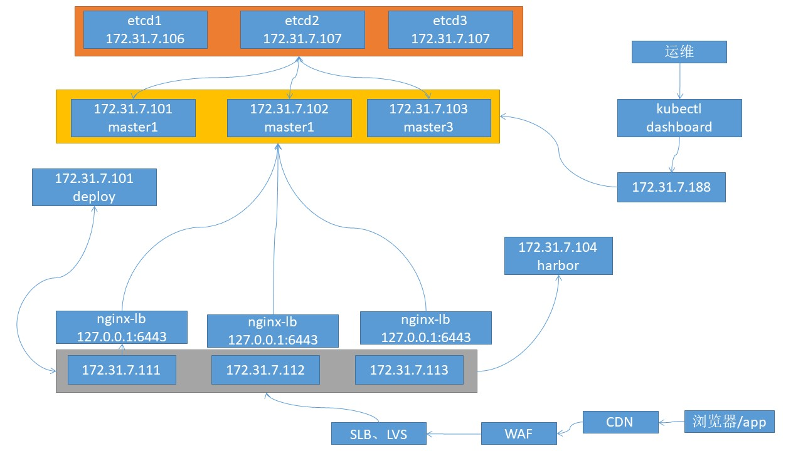

# 一：k8s集群环境搭建

k8s集群环境主要是kubernetes管理端服务（kube-apiserver、kube-controller-manager、kube-scheduler）的高可用实现，以及node节点上的（kubelet、kube-proxy）客户端服务的部署。

## 1.1：k8s高可用集群环境规划信息

按照实际环境需求，进行规划与部署相应的单master或者多master的高可用k8s运行环境。

### 1.1.1：单master环境：

见kubeadm安装k8s


### 1.1.2：多master环境：



### 1.1.3：服务器统计：

| 类型            | 服务器IP地址             | 备注                                     |
| --------------- | ------------------------ | ---------------------------------------- |
| Ansible(2台)    | 172.31.7.101/102         | k8s集群部署服务器，可以和其他服务器混用  |
| k8s Master(3台) | 172.31.7.101/102/103     | k8s控制端，通过一个VIP做主备高可用       |
| Harbor(2台)     | 172.31.7.104、105        | 高可用镜像服务器                         |
| Etcd(最少3台)   | 172.31.7.106/107/108     | 保存k8s集群数据的服务器                  |
| Haproxy(2台)    | 172.31.7.109/110         | 高可用etcd代理服务器                     |
| Node节点(2-N台) | 172.31.7.111/112/113/xxx | 真正运行容器的服务器，高可用环境至少两台 |

## 1.2：服务器准备：

服务器可以是私有云的虚拟机或物理机，也可以是公有云环境的虚拟机环境，如果是公司托管的IDC环境，可以直接将harbor和node节点部署在物理机环境，master节点、etcd、负载均衡等可以是虚拟机。

| 类型        | 服务器IP     | 主机名              | VIP          | CPU内存 |
| ----------- | ------------ | ------------------- | ------------ | ------- |
| k8s master1 | 172.31.7.101 | k8s-master1.rhce.cc | 172.31.7.188 | 4C 4G   |
| k8s master2 | 172.31.7.102 | k8s-master2.rhce.cc | 172.31.7.188 | 4C 4G   |
| k8s master3 | 172.31.7.103 | k8s-master3.rhce.cc | 172.31.7.188 | 4C 4G   |
| harbor1     | 172.31.7.104 | k8s-harbor1.rhce.cc |              | 4C 4G   |
| harbor2     | 172.31.7.105 | k8s-harbor2.rhce.cc |              | 4C 4G   |
| etcd节点1   | 172.31.7.106 | k8s-etcd1.rhce.cc   |              | 2C 2G   |
| etcd节点2   | 172.31.7.107 | k8s-etcd2.rhce.cc   |              | 2C 2G   |
| etcd节点2   | 172.31.7.108 | k8s-etcd3.rhce.cc   |              | 2C 2G   |
| haproxy1    | 172.31.7.109 | k8s-ha1.rhce.cc     |              | 2C 2G   |
| haproxy2    | 172.31.7.110 | k8s-ha2.rhce.cc     |              | 2C 2G   |
| node节点1   | 172.31.7.111 | k8s-node1.rhce.cc   |              | 4C 4G   |
| node节点2   | 172.31.7.112 | k8s-node2.rhce.cc   |              | 4C 4G   |
| node节点3   | 172.31.7.113 | k8s-node3.rhce.cc   |              | 4C 4G   |

## 1.3：k8s集群软件清单：

见当前目录下Excel文件 kubernetes软件清单

API端口：

```sh
端口：172.31.7.188:6443  #需要配置在负载均衡上实现反向代理
操作系统：ubuntu server 20.04.5
k8s版本：1.20.x
calico: 3.4.4
```

## 1.4：基础环境准备：

系统主机名配置、IP配置、系统参数优化，以及依赖的负载均衡和Harbor部署

### 1.4.1：系统配置

#### 1.4.1.1：主机名配置

> 所有主机均要配置，，这里以master1为例

```sh
[root@k8s-master1:~]# hostnamectl set-hostname k8s-master1.rhce.cc
[root@k8s-master1:~]# exec bash
```

#### 1.4.1.2：IP地址配置

> 所有主机均要配置，，这里以master1为例

```sh
[root@k8s-master1:~]# vim /etc/netplan/01-netcfg.yaml
network:
  version: 2
  renderer: networkd
  ethernets:
    eth0:
      addresses: [172.31.7.101/24] 
      gateway4: 172.31.7.2
      nameservers:
        addresses: [223.5.5.5, 180.76.76.76]

[root@k8s-master1:~]# netplan apply
```

#### 1.4.1.3：主机名与IP地址解析配置

> 所有主机均要配置

#### 1.4.1.4：主机安全配置

> 所有k8s集群节点均要配置，目前所有虚拟机模板均已经关闭防火墙和SELINUX，这里无需进一步设置

##### 1.4.1.4.1：主机防火墙设置

##### 1.4.1.4.2：主机SELINUX设置

#### 1.4.1.5：主机系统时间同步配置

> 所有主机均要配置，这里以master1为例

```sh
# 改为24小时制
[root@k8s-master1:~]# echo "LC_TIME=en_DK.UTF-8" >> /etc/default/locale
# 做软链接为本地时间
[root@k8s-master1:~]# ln -sf /usr/share/zoneinfo/America/Toronto /etc/localtime
# 配置时间同步任务计划
[root@k8s-master1:~]# echo "* */1 * * * ntpdate time1.aliyun.com &> /dev/null && hwclock -w" >> /var/spool/cron/crontabs/root
[root@k8s-master1:~]# crontab -l
```

#### 1.4.1.6：主机ipvs管理工具安装及模块卸载

> 所有k8s节点上均要配置，这里以master1为例

```sh
# 安装 ipvs 以及 负载均衡相关依赖
[root@k8s-master1:~]# apt -y install ipvsadm ipset sysstat conntrack

# ipvs 内核模块手动加载（所有节点配置）
[root@k8s-master1:~]# mkdir ~/k8s-init/
[root@k8s-master1:~]# tee ~/k8s-init/ipvs.modules <<'EOF'
#!/bin/bash
modprobe -- ip_vs
modprobe -- ip_vs_lc
modprobe -- ip_vs_lblc
modprobe -- ip_vs_lblcr
modprobe -- ip_vs_rr
modprobe -- ip_vs_wrr
modprobe -- ip_vs_sh
modprobe -- ip_vs_dh
modprobe -- ip_vs_fo
modprobe -- ip_vs_nq
modprobe -- ip_vs_sed
modprobe -- ip_vs_ftp
modprobe -- ip_tables
modprobe -- ip_set
modprobe -- ipt_set
modprobe -- ipt_rpfilter
modprobe -- ipt_REJECT
modprobe -- ipip
modprobe -- xt_set
modprobe -- br_netfilter
modprobe -- nf_conntrack
EOF

# 加载内核配置（临时|永久）注意管理员执行；授权、运行、检查是否加载
[root@k8s-master1:~]# chmod 755 ~/k8s-init/ipvs.modules && bash ~/k8s-init/ipvs.modules
[root@k8s-master1:~]# cp ~/k8s-init/ipvs.modules /etc/profile.d/ipvs.modules.sh
[root@k8s-master1:~]# lsmod | grep -e ip_vs -e nf_conntrack
ip_vs_ftp              16384  0
nf_nat                 45056  1 ip_vs_ftp
ip_vs_sed              16384  0
ip_vs_nq               16384  0
ip_vs_fo               16384  0
ip_vs_dh               16384  0
ip_vs_sh               16384  0
ip_vs_wrr              16384  0
ip_vs_rr               16384  0
ip_vs_lblcr            16384  0
ip_vs_lblc             16384  0
ip_vs_lc               16384  0
ip_vs                 155648  22 ip_vs_rr,ip_vs_dh,ip_vs_lblcr,ip_vs_sh,ip_vs_fo,ip_vs_nq,ip_vs_lblc,ip_vs_wrr,ip_vs_lc,ip_vs_sed,ip_vs_ftp
nf_conntrack          139264  2 nf_nat,ip_vs
nf_defrag_ipv6         24576  2 nf_conntrack,ip_vs
nf_defrag_ipv4         16384  1 nf_conntrack
libcrc32c              16384  6 nf_conntrack,nf_nat,btrfs,xfs,raid456,ip_vs

[root@k8s-master1:~]# ls /etc/modules-load.d/
modules.conf

# 以下命令在ubuntu上不能正确执行
[root@k8s-master1:~]# systemctl enable --now systemd-modules-load.service

PS : kube-proxy 是开启使用IPVS的前提条件必须正常安装;
```

#### 1.4.1.7：Linux内核升级

> 无需升级

#### 1.4.1.8：内核Kernel参数的调整，开启主机内核路由转发及网桥过滤

> 所有k8s节点上均要配置，这里以master1为例

```sh
# 1. kernel参数调整
[root@k8s-master1:~]# tee > ~/k8s-init/kubernetes-sysctl.conf <<'EOF'
# iptables 网桥模式开启
net.bridge.bridge-nf-call-iptables=1
net.bridge.bridge-nf-call-ip6tables=1

# 禁用 ipv6 协议
net.ipv6.conf.all.disable_ipv6=1

# 启用ipv4转发
net.ipv4.ip_forward=1 
# net.ipv4.tcp_tw_recycle=0 #Ubuntu 没有参数

# 禁止使用 swap 空间，只有当系统 OOM 时才允许使用它
vm.swappiness=0
# 不检查物理内存是否够用
vm.overcommit_memory=1
# 不启 OOM
vm.panic_on_oom=0

# 文件系统通知数(根据内存大小和空间大小配置)
fs.inotify.max_user_instances=8192
fs.inotify.max_user_watches=1048576

# 文件件打开句柄数
fs.file-max=52706963
fs.nr_open=52706963
net.netfilter.nf_conntrack_max=2310720

# tcp keepalive 相关参数配置
net.ipv4.tcp_keepalive_time = 600
net.ipv4.tcp_keepalive_probes = 3
net.ipv4.tcp_keepalive_intvl =15
net.ipv4.tcp_max_tw_buckets = 36000
net.ipv4.tcp_tw_reuse = 1
net.ipv4.tcp_max_orphans = 327680
net.ipv4.tcp_orphan_retries = 3
net.ipv4.tcp_syncookies = 1
net.ipv4.tcp_max_syn_backlog = 16384
# net.ipv4.ip_conntrack_max = 65536 # Ubuntu 没有参数
net.ipv4.tcp_timestamps = 0
net.core.somaxconn = 32768
EOF

[root@k8s-master1:~]# cp ~/k8s-init/kubernetes-sysctl.conf /etc/sysctl.d/99-kubernetes.conf
[root@k8s-master1:~]# sysctl -p /etc/sysctl.d/99-kubernetes.conf

# 查看是否加载
[root@k8s-master1:~]# lsmod | grep br_netfilter
br_netfilter           28672  0
bridge                176128  1 br_netfilter

PS：https://cloud.tencent.com/developer/article/2129608
```

#### 1.4.1.9：关闭主机swap分区

> 所有k8s节点上均要配置，这里以master1为例

```sh
# 关闭当前已启用的所有Swap设备。
[root@k8s-master1:~]# swapoff -a

# 编辑/etc/fstab配置文件，注释用于挂载Swap设备的所有行。
[root@k8s-master1:~]# sed -i '/swap/s/^/#/' /etc/fstab

# 在Ubuntu 2004及之后版本的系统上，若要彻底禁用Swap，可以需要类似如下命令进一步完成。
[root@k8s-master1:~]# systemctl --type swap
  UNIT          LOAD   ACTIVE SUB    DESCRIPTION   
  dev-sda4.swap loaded active active Swap Partition

LOAD   = Reflects whether the unit definition was properly loaded.
ACTIVE = The high-level unit activation state, i.e. generalization of SUB.
SUB    = The low-level unit activation state, values depend on unit type.

1 loaded units listed. Pass --all to see loaded but inactive units, too.
To show all installed unit files use 'systemctl list-unit-files'.

# 将上面命令列出的每个设备，使用systemctl mask命令加以禁用
[root@k8s-master1:~]# systemctl mask dev-sda4.swap
Created symlink /etc/systemd/system/dev-sda4.swap → /dev/null.

# 重启系统
[root@k8s-master1:~]# reboot
```


#### 1.4.1.10：


### 1.4.2：高可用负载均衡

#### 1.4.2.1：keepalived

> ha1和ha2上执行操作

```sh
[root@k8s-ha1:~]# apt install keepalived -y

# 找到模板配置文件
[root@k8s-ha1:~]# find / -name keepalived.*
......
/usr/share/doc/keepalived/samples/keepalived.conf.vrrp
......

# 拷贝模板配置文件到keepalived配置目录中
[root@k8s-ha1:~]# cp /usr/share/doc/keepalived/samples/keepalived.conf.vrrp /etc/keepalived/keepalived.conf

# 修改配置文件
[root@k8s-ha1:~]# vim /etc/keepalived/keepalived.conf 
! Configuration File for keepalived

global_defs {
   notification_email {
     acassen
   }
   notification_email_from Alexandre.Cassen@firewall.loc
   smtp_server 192.168.200.1
   smtp_connect_timeout 30
   router_id LVS_DEVEL
}

vrrp_instance VI_1 {
    state MASTER
    interface eth0
    garp_master_delay 10
    smtp_alert
    virtual_router_id 51
    priority 100
    advert_int 1
    authentication {
        auth_type PASS
        auth_pass 1111
    }
    virtual_ipaddress {
        172.31.7.188 dev eth0 label eth0:0
        172.31.7.189 dev eth0 label eth0:1
        172.31.7.190 dev eth0 label eth0:2
    }
}

# 重启keepalived
[root@k8s-ha1:~]# systemctl restart keepalived

# 设置为开机自启动
[root@k8s-ha1:~]# systemctl enable keepalived

# 查看VIP是否生成
[root@k8s-ha1:~]# ip a
1: lo: <LOOPBACK,UP,LOWER_UP> mtu 65536 qdisc noqueue state UNKNOWN group default qlen 1000
    link/loopback 00:00:00:00:00:00 brd 00:00:00:00:00:00
    inet 127.0.0.1/8 scope host lo
       valid_lft forever preferred_lft forever
    inet6 ::1/128 scope host 
       valid_lft forever preferred_lft forever
2: eth0: <BROADCAST,MULTICAST,UP,LOWER_UP> mtu 1500 qdisc fq_codel state UP group default qlen 1000
    link/ether 00:0c:29:d2:4a:83 brd ff:ff:ff:ff:ff:ff
    inet 172.31.7.109/24 brd 172.31.7.255 scope global eth0
       valid_lft forever preferred_lft forever
    inet 172.31.7.188/32 scope global eth0:0
       valid_lft forever preferred_lft forever
    inet 172.31.7.189/32 scope global eth0:1
       valid_lft forever preferred_lft forever
    inet 172.31.7.190/32 scope global eth0:2
       valid_lft forever preferred_lft forever
    inet6 fe80::20c:29ff:fed2:4a83/64 scope link 
       valid_lft forever preferred_lft forever

PS：类似于在公有云上买的一个SLB。在配置k8s前就需要配置上。
```

```sh
[root@k8s-ha2:~]# apt install keepalived -y

# 从ha1中拷贝配置文件
[root@k8s-ha1:~]# scp /etc/keepalived/keepalived.conf 172.31.7.110:/etc/keepalived/keepalived.conf

# 编辑配置文件
[root@k8s-ha2:~]# vim /etc/keepalived/keepalived.conf 
! Configuration File for keepalived

global_defs {
   notification_email {
     acassen
   }
   notification_email_from Alexandre.Cassen@firewall.loc
   smtp_server 192.168.200.1
   smtp_connect_timeout 30
   router_id LVS_DEVEL
}

vrrp_instance VI_1 {
    state BACKUP 
    interface eth0
    garp_master_delay 10
    smtp_alert
    virtual_router_id 51
    priority 80
    advert_int 1
    authentication {
        auth_type PASS
        auth_pass 1111
    }
    virtual_ipaddress {
        172.31.7.188 dev eth0 label eth0:0
        172.31.7.189 dev eth0 label eth0:1
        172.31.7.190 dev eth0 label eth0:2
    }
}

# 重启keepalived服务
[root@k8s-ha2:~]# systemctl restart keepalived

# 设置开机自启动
[root@k8s-ha2:~]# systemctl enable keepalived

# 验证VIP会不会漂移，将主keepalived服务停掉，看辅keepalived是否能获取VIP

PS：keepalived是通过priority来判断优先级。
```

#### 1.4.2.2：haproxy

> ha1和ha2上执行操作

```sh
[root@k8s-ha1:~]# apt install haproxy -y

# 修改配置文件
[root@k8s-ha1:~]# vim /etc/haproxy/haproxy.cfg
global
	log /dev/log	local0
	log /dev/log	local1 notice
	chroot /var/lib/haproxy
	stats socket /run/haproxy/admin.sock mode 660 level admin expose-fd listeners
	stats timeout 30s
	user haproxy
	group haproxy
	daemon

	# Default SSL material locations
	ca-base /etc/ssl/certs
	crt-base /etc/ssl/private

	# See: https://ssl-config.mozilla.org/#server=haproxy&server-version=2.0.3&config=intermediate
        ssl-default-bind-ciphers ECDHE-ECDSA-AES128-GCM-SHA256:ECDHE-RSA-AES128-GCM-SHA256:ECDHE-ECDSA-AES256-GCM-SHA384:ECDHE-RSA-AES256-GCM-SHA384:ECDHE-ECDSA-CHACHA20-POLY1305:ECDHE-RSA-CHACHA20-POLY1305:DHE-RSA-AES128-GCM-SHA256:DHE-RSA-AES256-GCM-SHA384
        ssl-default-bind-ciphersuites TLS_AES_128_GCM_SHA256:TLS_AES_256_GCM_SHA384:TLS_CHACHA20_POLY1305_SHA256
        ssl-default-bind-options ssl-min-ver TLSv1.2 no-tls-tickets

defaults
	log	global
	mode	http
	option	httplog
	option	dontlognull
        timeout connect 5000
        timeout client  50000
        timeout server  50000
	errorfile 400 /etc/haproxy/errors/400.http
	errorfile 403 /etc/haproxy/errors/403.http
	errorfile 408 /etc/haproxy/errors/408.http
	errorfile 500 /etc/haproxy/errors/500.http
	errorfile 502 /etc/haproxy/errors/502.http
	errorfile 503 /etc/haproxy/errors/503.http
	errorfile 504 /etc/haproxy/errors/504.http
    
listen k8s-api-6443
  bind 172.31.7.188:6443
  mode tcp
  server master1 172.31.7.101:6443 check inter 3s fall 3 rise 1
  server master2 172.31.7.102:6443 check inter 3s fall 3 rise 1
  server master3 172.31.7.103:6443 check inter 3s fall 3 rise 1

# 重启服务
[root@k8s-ha1:~]# systemctl restart haproxy

# 设置开机自启动
[root@k8s-ha1:~]# systemctl enable haproxy

# 检测监听端口
[root@k8s-ha1:~]# ss -ntl
State        Recv-Q       Send-Q               Local Address:Port                Peer Address:Port       Process       
LISTEN       0            4096                       0.0.0.0:23176                    0.0.0.0:*                        
LISTEN       0            20480                 172.31.7.188:6443                     0.0.0.0:*  
......
```

```sh
[root@k8s-ha2:~]# apt install haproxy -y

# 从ha1上拷贝配置文件
[root@k8s-ha1:~]# scp /etc/haproxy/haproxy.cfg 172.31.7.110:/etc/haproxy/haproxy.cfg

# 重启服务
[root@k8s-ha2:~]# systemctl restart haproxy

# 设置开机自启动
[root@k8s-ha2:~]# systemctl enable haproxy

# 检测监听端口
[root@k8s-ha2:~]# ss -ntl
State        Recv-Q       Send-Q               Local Address:Port                Peer Address:Port       Process       
LISTEN       0            20480                 172.31.7.188:6443                     0.0.0.0:*   

PS：有可能这个服务启动不了。为什么？
/var/log/syslog会有报错。
它不能绑定。因为这个地址没有在本地监听。
[root@k8s-ha2:~]# sysctl -a | grep local
net.ipv4.ip_nonlocal_bind = 1
[root@k8s-ha2:~]# vim /etc/sysctl.conf
net.ipv4.ip_nonlocal_bind = 1
[root@k8s-ha2:~]# sysctl -p
建议两台haproxy服务器都要配置这个内核参数。需要监听本机没有的IP地址的端口。
```

### 1.4.3：安装containerd


### 1.4.4：Harbor之https

#### 1.4.4.1：安装harbor

##### 1.4.4.1.1：安装docker

```sh
# 安装必要的一些系统工具
[root@k8s-harbor1:~]# apt-get update
[root@k8s-harbor1:~]# apt-get -y install apt-transport-https ca-certificates curl software-properties-common

# Add Docker's official GPG key
[root@k8s-harbor1:~]# install -m 0755 -d /etc/apt/keyrings
[root@k8s-harbor1:~]# curl -fsSL https://download.docker.com/linux/ubuntu/gpg -o /etc/apt/keyrings/docker.asc
[root@k8s-harbor1:~]# chmod a+r /etc/apt/keyrings/docker.asc

# Add the repository to Apt sources
[root@k8s-harbor1:~]# echo "deb [arch=$(dpkg --print-architecture) signed-by=/etc/apt/keyrings/docker.asc] https://download.docker.com/linux/ubuntu $(. /etc/os-release && echo "$VERSION_CODENAME") stable" | tee /etc/apt/sources.list.d/docker.list > /dev/null

# 更新
[root@k8s-harbor1:~]# apt-get update

# 安装指定版本的Docker-CE：
# 1. 查找Docker-CE的版本
[root@k8s-harbor1:~]# apt-cache madison docker-ce
[root@k8s-harbor1:~]# apt-cache madison docker-ce-cli

# 2. 安装指定版本的Docker-CE
[root@k8s-harbor1:~]# apt -y install docker-ce=5:26.0.2-1~ubuntu.20.04~focal docker-ce-cli=5:26.0.2-1~ubuntu.20.04~focal

# 查看安装版本
[root@k8s-harbor1:~]# docker info

PS: 使用官方docker源。https://docs.docker.com/engine/install/ubuntu/
```

##### 1.4.4.1.2：安装docker-compose

```sh
### 安装docker-compose，离线安装

# 下载docker-compose
[root@k8s-harbor1:~]# wget https://github.com/docker/compose/releases/download/v2.27.1/docker-compose-linux-x86_64

# 修改文件名为docker-compose
[root@k8s-harbor1:~]# mv docker-compose-linux-x86_64 docker-compose
[root@k8s-harbor1:~]# mv docker-compose /usr/bin/

# 增加执行权限
[root@k8s-harbor1:~]# chmod +x /usr/bin/docker-compose
[root@k8s-harbor1:~]# file /usr/bin/docker-compose

# 查看安装版本
[root@k8s-harbor1:~]# docker-compose version
```

##### 1.4.4.1.3：安装harbor

```sh


```


```sh
### 安装harbor

# 下载相应版本
[root@k8s-harbor1:~]# wget https://github.com/goharbor/harbor/releases/download/v2.11.0/harbor-offline-installer-v2.11.0.tgz

# 将下载的harbor压缩包移动到/apps目录下，解压
[root@k8s-harbor1:~]# mkdir /apps
[root@k8s-harbor1:~]# mv harbor-offline-installer-v2.11.0.tgz /apps/
[root@k8s-harbor1:~]# cd /apps/
[root@k8s-harbor1:/apps]# tar xvf harbor-offline-installer-v2.11.0.tgz

# 复制配置文件模版到配置文件harbor.yml
[root@k8s-harbor1:/apps]# cd harbor/
[root@k8s-harbor1:/apps/harbor]# cp harbor.yml.tmpl harbor.yml

# 自签发证书过程
[root@k8s-harbor1:/apps/harbor]# mkdir certs
[root@k8s-harbor1:/apps/harbor]# cd certs/

[root@k8s-habor1:/apps/harbor/certs]# openssl genrsa -out ca.key 2048
Generating RSA private key, 2048 bit long modulus (2 primes)
..........................+++++
................+++++
e is 65537 (0x010001)

[root@k8s-habor1:/apps/harbor/certs]# openssl req -new -x509 -days 7120 -key ca.key -subj "/C=CN/ST=GD/L=SZ/O=Acme, Inc./CN=Acme Root CA" -out ca.crt

[root@k8s-habor1:/apps/harbor/certs]# openssl req -newkey rsa:2048 -nodes -keyout harbor-ca.key -subj "/C=CN/ST=GD/L=SZ/O=Acme, Inc./CN=*.rhce.local" -out server.csr
Generating a RSA private key
.....................+++++
.............................+++++
writing new private key to 'harbor-ca.key'
-----

[root@k8s-habor1:/apps/harbor/certs]# openssl x509 -req -extfile <(printf "subjectAltName=DNS:rhce.local,DNS:harbor.rhce.local") -days 7120 -in server.csr -CA ca.crt -CAkey ca.key -CAcreateserial -out harbor-ca.crt
Signature ok
subject=C = CN, ST = GD, L = SZ, O = "Acme, Inc.", CN = *.rhce.local
Getting CA Private Key

[root@k8s-habor1:/apps/harbor/certs]# ls
ca.crt  ca.key  ca.srl  harbor-ca.crt  harbor-ca.key  server.csr

PS：注意路径是/apps/harbor/certs/

# 自签发证书路径
[root@k8s-harbor1:/apps/harbor/certs]# ls /apps/harbor/certs/harbor-ca.crt
/apps/harbor/certs/harbor-ca.crt

# 编辑harbor的主配置文件harbor.yml
[root@k8s-harbor1:/apps/harbor]# vim harbor.yml
# 修改为如下结果
[root@k8s-harbor1:/apps/harbor]# sed -e '/#/d' -e '/^$/d' harbor.yml
hostname: harbor.rhce.local  ##(1)
http:
  port: 80
https:
  port: 443
  certificate: /apps/harbor/certs/harbor-ca.crt  ##(2)
  private_key: /apps/harbor/certs/harbor-ca.key  ##(3)
harbor_admin_password: 123456  ##(4)
database:
  password: root123
  max_idle_conns: 100
  max_open_conns: 900
  conn_max_lifetime: 5m
  conn_max_idle_time: 0
data_volume: /data  ##(5)这里通常是数据盘或者挂载
trivy:
  ignore_unfixed: false
  skip_update: false
  skip_java_db_update: false
  offline_scan: false
  security_check: vuln
  insecure: false
  timeout: 5m0s
jobservice:
  max_job_workers: 10
  job_loggers:
    - STD_OUTPUT
    - FILE
notification:
  webhook_job_max_retry: 3
log:
  level: info
  local:
    rotate_count: 50
    rotate_size: 200M
    location: /var/log/harbor
_version: 2.11.0
proxy:
  http_proxy:
  https_proxy:
  no_proxy:
  components:
    - core
    - jobservice
    - trivy
upload_purging:
  enabled: true
  age: 168h
  interval: 24h
  dryrun: false
cache:
  enabled: false
  expire_hours: 24

# 安装harbor
[root@k8s-harbor1:/apps/harbor]# ./install.sh

# 查看启动后的容器，一共9个
[root@k8s-harbor1:/apps/harbor]# docker ps
CONTAINER ID   IMAGE                                 COMMAND                  CREATED          STATUS                    PORTS                                                                            NAMES
17c5448554b3   goharbor/harbor-jobservice:v2.11.0    "/harbor/entrypoint.…"   43 seconds ago   Up 38 seconds (healthy)                                                                                    harbor-jobservice
bd0c93dda846   goharbor/nginx-photon:v2.11.0         "nginx -g 'daemon of…"   43 seconds ago   Up 41 seconds (healthy)   0.0.0.0:80->8080/tcp, :::80->8080/tcp, 0.0.0.0:443->8443/tcp, :::443->8443/tcp   nginx
c5581a6a6886   goharbor/harbor-core:v2.11.0          "/harbor/entrypoint.…"   43 seconds ago   Up 41 seconds (healthy)                                                                                    harbor-core
0da2db2293c6   goharbor/harbor-portal:v2.11.0        "nginx -g 'daemon of…"   43 seconds ago   Up 42 seconds (healthy)                                                                                    harbor-portal
25ffce54b7b5   goharbor/redis-photon:v2.11.0         "redis-server /etc/r…"   43 seconds ago   Up 41 seconds (healthy)                                                                                    redis
50239ba69a38   goharbor/registry-photon:v2.11.0      "/home/harbor/entryp…"   43 seconds ago   Up 41 seconds (healthy)                                                                                    registry
89e65d65a840   goharbor/harbor-db:v2.11.0            "/docker-entrypoint.…"   43 seconds ago   Up 41 seconds (healthy)                                                                                    harbor-db
5dc762b94041   goharbor/harbor-registryctl:v2.11.0   "/home/harbor/start.…"   43 seconds ago   Up 41 seconds (healthy)                                                                                    registryctl
62bcd269a13d   goharbor/harbor-log:v2.11.0           "/bin/sh -c /usr/loc…"   43 seconds ago   Up 42 seconds (healthy)   127.0.0.1:1514->10514/tcp   

# 配置systemd
[root@k8s-harbor1:/apps/harbor]# vim /lib/systemd/system/harbor.service
[Unit]
Description=Harbor
After=docker.service systemd-networkd.service systemd-resolved.service
Requires=docker.service
Documentation=http://github.com/vmware/harbor

[Service]
Type=simple
Restart=on-failure
RestartSec=5
ExecStart=/usr/bin/docker-compose -f /apps/harbor/docker-compose.yml up
ExecStop=/usr/bin/docker-compose -f /apps/harbor/docker-compose.yml down

[Install]
WantedBy=multi-user.target

# 加载配置，停止服务，设置为开机自启动
[root@k8s-harbor1:/apps/harbor]# systemctl daemon-reload
[root@k8s-harbor1:/apps/harbor]# systemctl stop harbor.service
[root@k8s-harbor1:/apps/harbor]# systemctl enable --now harbor.service

# 配置DNS解析，在客户端机器。
172.31.7.104 harbor.rhce.local

PS：harbor安装就是镜像。
```


#### 1.4.4.2：部署节点同步harbor crt证书

#### 1.4.4.3：node登录harbor

#### 1.4.4.4：测试push镜像到harbor

## 1.5：手动二进制部署

## 1.6：ansible部署

> 使用kubeasz项目来部署k8s
>
> 项目网址：https://github.com/easzlab/kubeasz
>
> 运维人员通过haproxy负载均衡来访问master集群。
>
> 每个node上要部署nginx-lb来做负载均衡，访问master集群。
>
> 这里把master1也当成部署节点，安装ansible，它需要对所有安装节点配置免密钥认证。

### 1.6.1：基础环境准备

#### 1.6.1.1：部署节点安装ansible

> 部署节点，这里就是master1

```sh
# 安装ansible
[root@k8s-master1:~]# apt-get -y install ansible

[root@k8s-master1:~]# ansible --version
ansible 2.9.6
  config file = /etc/ansible/ansible.cfg
  configured module search path = ['/root/.ansible/plugins/modules', '/usr/share/ansible/plugins/modules']
  ansible python module location = /usr/lib/python3/dist-packages/ansible
  executable location = /usr/bin/ansible
  python version = 3.8.10 (default, Nov 22 2023, 10:22:35) [GCC 9.4.0]
```

#### 1.6.1.2：配置免密钥认证

```sh
# 生成密钥对
[root@k8s-master1:~]# ssh-keygen

# 安装sshpass命令用于同步公钥到各k8s服务器
[root@k8s-master1:~]# apt-get install sshpass

# 分发公钥脚本
[root@k8s-master1:~]# vim scp.sh
#!/bin/bash
# 目标主机列表
IP="
172.31.7.101
172.31.7.102
172.31.7.103
172.31.7.106
172.31.7.107
172.31.7.108
172.31.7.111
172.31.7.112
172.31.7.113
"

for node in ${IP};do
  sshpass -p 123456 ssh-copy-id ${node} -o StrictHostKeyChecking=no
  if [ $? -eq 0 ];then
    echo "${node} 密钥copy完成"
  else
    echo "${node} 密钥copy失败"
  fi
done

# 执行公钥分发
[root@k8s-master1:~]# bash scp.sh

PS：vim ~/.vimrc 取消vim自动缩进功能
PS：拷贝到所有master、etcd、node主机
101,102,103,106,107,108,111,112,113，这里就是本机的话，101也需要ssh-copy-id
```

#### 1.6.1.3：设置python软链接

```sh
# 将内置的python3.8做个软链接，或者确保每个节点都存在python3.8的软链接。名字为/usr/bin/python3。
# 注意，凡是ansible要去管理的节点都要做软链接
[root@k8s-master1:~]# whereis python
python: /usr/bin/python3.8 /usr/lib/python2.7 /usr/lib/python3.8 /usr/lib/python3.9 /etc/python3.8 /usr/local/lib/python3.8

[root@k8s-master1:~]# ln -s /usr/bin/python3.8 /usr/bin/python

PS：凡是ansible要去管理的节点都要做软链接，101,102,103,106,107,108,111,112,113。
```

### 1.6.2：下载kubeasz项目及组件

#### 1.6.2.1：下载项目及组件

```sh
# 实验准备部署kubeasz 3.6.4
k8s: v1.30.1
etcd: v3.5.12
containerd: 1.7.17
runc: v1.1.12
calico: v3.26.4
cilium: 1.15.5
cni: v1.4.1
harbor: v2.10.2
metrics-server: v0.7.1

# 下载工具脚本ezdown，举例使用kubeasz版本3.6.4
[root@k8s-master1:~]# export release=3.6.4
[root@k8s-master1:~]# wget https://github.com/easzlab/kubeasz/releases/download/${release}/ezdown
[root@k8s-master1:~]# chmod a+x ezdown

# 查看ezdown文件中的docker版本信息，不用更改
[root@k8s-master1:~]# vim ./ezdown
DOCKER_VER=26.1.3

# 查看ezdown帮助
[root@k8s-master1:~]# ./ezdown -help
./ezdown: illegal option -- h
Usage: ezdown [options] [args]
  option:
    -C         stop&clean all local containers
    -D         download default binaries/images into "/etc/kubeasz"
    -P <OS>    download system packages of the OS (ubuntu_22,debian_11,...)
    -R         download Registry(harbor) offline installer
    -S         start kubeasz in a container
    -X <opt>   download extra images
    -d <ver>   set docker-ce version, default "26.1.3"
    -e <ver>   set kubeasz-ext-bin version, default "1.10.1"
    -k <ver>   set kubeasz-k8s-bin version, default "v1.30.1"
    -m <str>   set docker registry mirrors, default "CN"(used in Mainland,China)
    -z <ver>   set kubeasz version, default "3.6.4"

PS：-D 下载所有包到/etc/kubeasz，下载时会使用docker命令去下载那些镜像，用镜像文件启动一些容器，再从容器里拷贝到本地。当然也可以自己安装docker。

# 下载kubeasz代码、二进制、默认容器镜像（更多关于ezdown的参数，运行./ezdown 查看）
[root@k8s-master1:~]# ./ezdown -D -m standard

# 下载完毕后，查看下载内容
[root@k8s-master1:~]# ls /etc/kubeasz
README.md  ansible.cfg  bin  docs  down  example  ezctl  ezdown  manifests  pics  playbooks  roles  tools
[root@k8s-master1:~]# ls /etc/kubeasz/example
config.yml  hosts.allinone  hosts.multi-node
```

#### 1.6.2.2：kubeasz的帮助说明

```sh
# 查看kubeasz的帮助
[root@k8s-master1:~]# cd /etc/kubeasz
[root@k8s-master1:/etc/kubeasz]# ll
total 112
drwxrwxr-x  12 root root   224 Jun  9 11:12 ./
drwxr-xr-x 105 root root  8192 Jun  9 11:12 ../
drwxrwxr-x   4 root root    77 May 22 11:19 .github/
-rw-rw-r--   1 root root   301 May 22 11:09 .gitignore
-rw-rw-r--   1 root root  6349 May 22 11:09 README.md
-rw-rw-r--   1 root root 20304 May 22 11:09 ansible.cfg
drwxr-xr-x   5 root root  4096 Jun  9 11:12 bin/
drwxrwxr-x   8 root root    94 May 22 11:19 docs/
drwxr-xr-x   3 root root   298 Jun  9 11:13 down/
drwxrwxr-x   2 root root    70 May 22 11:19 example/
-rwxrwxr-x   1 root root 26507 May 22 11:09 ezctl*
-rwxrwxr-x   1 root root 32390 May 22 11:09 ezdown*
drwxrwxr-x  10 root root   145 May 22 11:19 manifests/
drwxrwxr-x   2 root root    94 May 22 11:19 pics/
drwxrwxr-x   2 root root  4096 May 22 11:19 playbooks/
drwxrwxr-x  22 root root   323 May 22 11:19 roles/
drwxrwxr-x   2 root root    90 May 22 11:19 tools/

[root@k8s-master1:/etc/kubeasz]# ./ezctl --help
Usage: ezctl COMMAND [args]
-------------------------------------------------------------------------------------
Cluster setups:
    list		             to list all of the managed clusters
    checkout    <cluster>            to switch default kubeconfig of the cluster
    new         <cluster>            to start a new k8s deploy with name 'cluster'
    setup       <cluster>  <step>    to setup a cluster, also supporting a step-by-step way
    start       <cluster>            to start all of the k8s services stopped by 'ezctl stop'
    stop        <cluster>            to stop all of the k8s services temporarily
    upgrade     <cluster>            to upgrade the k8s cluster
    destroy     <cluster>            to destroy the k8s cluster
    backup      <cluster>            to backup the cluster state (etcd snapshot)
    restore     <cluster>            to restore the cluster state from backups
    start-aio		             to quickly setup an all-in-one cluster with default settings

Cluster ops:
    add-etcd    <cluster>  <ip>      to add a etcd-node to the etcd cluster
    add-master  <cluster>  <ip>      to add a master node to the k8s cluster
    add-node    <cluster>  <ip>      to add a work node to the k8s cluster
    del-etcd    <cluster>  <ip>      to delete a etcd-node from the etcd cluster
    del-master  <cluster>  <ip>      to delete a master node from the k8s cluster
    del-node    <cluster>  <ip>      to delete a work node from the k8s cluster

Extra operation:
    kca-renew   <cluster>            to force renew CA certs and all the other certs (with caution)
    kcfg-adm    <cluster>  <args>    to manage client kubeconfig of the k8s cluster

Use "ezctl help <command>" for more information about a given command.

PS：主要参数说明
list 列出部署的集群。可以部署多个k8s集群。
new 创建一个集群，名字自己可以指定，在后面加个参数，比如cluster。然后就会创建一个cluster目录，会拷贝两个文件，一个文件是./example/hosts.multi-node，这是ansible需要的一个文件，需要在这个文件中指定安装节点地址，指定一些路径，指定参数等。一个配置文件./example/config.yml，针对当前k8s集群的配置文件，包括证书签发的有效期，网络参数，每个node节点能最大启动多少容器，很多配置都是这里指定。但是这些都是通过变量来使用的。

[root@k8s-master1:/etc/kubeasz]# ll example/
total 16
drwxrwxr-x  2 root root   70 May 22 11:19 ./
drwxrwxr-x 12 root root  224 Jun  9 11:12 ../
-rw-rw-r--  1 root root 7743 May 22 11:09 config.yml
-rw-rw-r--  1 root root 2212 May 22 11:09 hosts.allinone
-rw-rw-r--  1 root root 2382 May 22 11:09 hosts.multi-node
```

### 1.6.3：使用kubeasz初始化k8s集群

#### 1.6.3.1：生成hosts和config.yml文件

```sh
# 创建新的k8s集群 --> "k8s-cluster1"
[root@k8s-master1:/etc/kubeasz]# ./ezctl new k8s-cluster1
2024-06-09 11:51:38 DEBUG generate custom cluster files in /etc/kubeasz/clusters/k8s-cluster1
2024-06-09 11:51:38 DEBUG set versions
2024-06-09 11:51:38 DEBUG disable registry mirrors
2024-06-09 11:51:38 DEBUG cluster k8s-cluster1: files successfully created.
2024-06-09 11:51:38 INFO next steps 1: to config '/etc/kubeasz/clusters/k8s-cluster1/hosts'
2024-06-09 11:51:38 INFO next steps 2: to config '/etc/kubeasz/clusters/k8s-cluster1/config.yml'

# 进入当前k8s-cluster1目录
[root@k8s-master1:/etc/kubeasz]# cd clusters/k8s-cluster1/

[root@k8s-master1:/etc/kubeasz/clusters/k8s-cluster1]# ll
total 12
drwxr-xr-x 2 root root   37 Jun  9 11:51 ./
drwxr-xr-x 3 root root   26 Jun  9 11:51 ../
-rw-r--r-- 1 root root 7616 Jun  9 11:51 config.yml
-rw-r--r-- 1 root root 2380 Jun  9 11:51 hosts
```

#### 1.6.3.2：编辑ansible hosts文件

> 指定etcd节点、master节点、node节点、VIP、运行时、网络组建类型、service IP和pod IP范围等配置信息

```sh
[root@k8s-master1:/etc/kubeasz/clusters/k8s-cluster1]# vim hosts
# 'etcd' cluster should have odd member(s) (1,3,5,...)
[etcd]
172.31.7.106 k8s_nodename='k8s-etcd1.rhce.cc'
172.31.7.107 k8s_nodename='k8s-etcd2.rhce.cc'
172.31.7.108 k8s_nodename='k8s-etcd3.rhce.cc'

# master node(s), set unique 'k8s_nodename' for each node
# CAUTION: 'k8s_nodename' must consist of lower case alphanumeric characters, '-' or '.',
# and must start and end with an alphanumeric character
【这里先写两个，后面会扩容master的第3个节点，172.31.7.103】
[kube_master]
172.31.7.101 k8s_nodename='k8s-master1.rhce.cc'
172.31.7.102 k8s_nodename='k8s-master2.rhce.cc'

# work node(s), set unique 'k8s_nodename' for each node
# CAUTION: 'k8s_nodename' must consist of lower case alphanumeric characters, '-' or '.',
# and must start and end with an alphanumeric character
【这里先写两个，后面会扩容node的第3个节点，172.31.7.113】
[kube_node]
172.31.7.111 k8s_nodename='k8s-node1.rhce.cc'
172.31.7.112 k8s_nodename='k8s-node2.rhce.cc'

# [optional] harbor server, a private docker registry
# 'NEW_INSTALL': 'true' to install a harbor server; 'false' to integrate with existed one
[harbor]
#172.31.7.8 NEW_INSTALL=false

# [optional] loadbalance for accessing k8s from outside
【虽然这里打开配置，但是负载均衡器实际上已经装好，等会儿把job注释掉】
【我们不用这个配置部署，所以地址是假的也无妨】
[ex_lb]
172.31.7.6 LB_ROLE=backup EX_APISERVER_VIP=172.31.7.188 EX_APISERVER_PORT=6443
172.31.7.7 LB_ROLE=master EX_APISERVER_VIP=172.31.7.188 EX_APISERVER_PORT=6443

# [optional] ntp server for the cluster
[chrony]
#172.31.7.1

[all:vars]
# --------- Main Variables ---------------
# Secure port for apiservers
SECURE_PORT="6443"

# Cluster container-runtime supported: docker, containerd
# if k8s version >= 1.24, docker is not supported
CONTAINER_RUNTIME="containerd"

# Network plugins supported: calico, flannel, kube-router, cilium, kube-ovn
【在私有云，推荐使用calico，公有云一般使用flannel】
CLUSTER_NETWORK="calico"

# Service proxy mode of kube-proxy: 'iptables' or 'ipvs'
PROXY_MODE="ipvs"

# K8S Service CIDR, not overlap with node(host) networking
【service网络地址，不要和宿主机网络、机房网络、办公网络冲突，这是私网地址，子网范围一定要大】
【选择192,172,10开头的私网地址，推荐配10的】
SERVICE_CIDR="10.100.0.0/16"

# Cluster CIDR (Pod CIDR), not overlap with node(host) networking
【pod网络地址，不要和宿主机网络、机房网络、办公网络冲突，这是私网地址，子网范围一定要大】
【选择192,172,10开头的私网地址，推荐配10的】
CLUSTER_CIDR="10.200.0.0/16"

# NodePort Range
【公司内规定，所有服务的端口范围不能配置到30000-65000，这是给k8s的】
【此外，不要在节点上安装别的服务，只运行k8s服务】
NODE_PORT_RANGE="30000-65000"

# Cluster DNS Domain
【一般可以不改，使用默认的cluster.local即可】
【这是service网络的后缀】
CLUSTER_DNS_DOMAIN="rhce.local"

# -------- Additional Variables (don't change the default value right now) ---
# Binaries Directory
【apiserver，controller-manager的二进制文件，会拷贝到master节点这个目录下】
【kubelet，kube-proxy的二进制文件，会拷贝到node节点这个目录下】
【其实拷贝到哪里都可以，会把它们做软链接，会把软链接指向/usr/bin里，然后用变量传到service文件里，】
【最后来这里去加载二进制】
【/usr/local/bin目录是存放第三方的二进制文件的建议位置】
bin_dir="/usr/local/bin"

# Deploy Directory (kubeasz workspace)
【kubeasz的部署路径】
base_dir="/etc/kubeasz"

# Directory for a specific cluster
【kubeasz的k8s集群配置文件目录】
cluster_dir="{{ base_dir }}/clusters/k8s-cluster1"

# CA and other components cert/key Directory
【自签发证书的路径】
ca_dir="/etc/kubernetes/ssl"

# Default 'k8s_nodename' is empty
【前面没有名字的节点，默认名字是''】
k8s_nodename=''

# Default python interpreter
【使用已经设置过的/usr/bin/python软链接】
ansible_python_interpreter=/usr/bin/python

PS：【】是自行注释

# 查看二进制文件当前的路径，已经在部署前准备完毕
[root@k8s-master1:/etc/kubeasz/clusters/k8s-cluster1]# ls /etc/kubeasz/bin/
calicoctl       cfssljson  cni-bin         docker-bin      etcdctl  keepalived               kube-proxy      kubelet
cfssl           chronyd    containerd-bin  docker-compose  helm     kube-apiserver           kube-scheduler  nginx
cfssl-certinfo  cilium     crictl          etcd            hubble   kube-controller-manager  kubectl
[root@k8s-master1:/etc/kubeasz/clusters/k8s-cluster1]# /etc/kubeasz/bin/kube-apiserver --version
Kubernetes v1.30.1
[root@k8s-master1:/etc/kubeasz/clusters/k8s-cluster1]# /etc/kubeasz/bin/kube-scheduler --version
Kubernetes v1.30.1
```


#### 1.6.3.3：编辑ansible config.yml文件

> 针对k8s的配置

```sh
[root@k8s-master1:/etc/kubeasz/clusters/k8s-cluster1]# vim config.yml
############################
# prepare
############################
# 可选离线安装系统软件包 (offline|online)
【online: 本地有包的话，优先使用本地的，没有包的话，就在线下载】
【优先拷贝本地环境的包，比如/etc/kubeasz/bin和/etc/kubeasz/down里的二进制文件或者tar包】
INSTALL_SOURCE: "online"

# 可选进行系统安全加固 github.com/dev-sec/ansible-collection-hardening
# (deprecated) 未更新上游项目，未验证最新k8s集群安装，不建议启用
OS_HARDEN: false


############################
# role:deploy
############################
# default: ca will expire in 100 years
# default: certs issued by the ca will expire in 50 years
【876000h是100年，438000h是50年】
CA_EXPIRY: "876000h"
CERT_EXPIRY: "438000h"

# force to recreate CA and other certs, not suggested to set 'true'
CHANGE_CA: false

# kubeconfig 配置参数
【多集群环境下，你的k8s叫什么名称】
【CONTEXT_NAME是用于切换集群的】
CLUSTER_NAME: "cluster1"
CONTEXT_NAME: "context-{{ CLUSTER_NAME }}"

# k8s version
K8S_VER: "1.30.1"

# set unique 'k8s_nodename' for each node, if not set(default:'') ip add will be used
# CAUTION: 'k8s_nodename' must consist of lower case alphanumeric characters, '-' or '.',
# and must start and end with an alphanumeric character (e.g. 'example.com'),
# regex used for validation is '[a-z0-9]([-a-z0-9]*[a-z0-9])?(\.[a-z0-9]([-a-z0-9]*[a-z0-9])?)*'
K8S_NODENAME: " \
                    {{ k8s_nodename|replace('_', '-')|lower }} \
                \
                    k8s-{{ inventory_hostname|replace('.', '-') }} \
               "

# use 'K8S_NODENAME' to set hostname
ENABLE_SETTING_HOSTNAME: true


############################
# role:etcd
############################
# 设置不同的wal目录，可以避免磁盘io竞争，提高性能
【可以改成/date/etcd，这里先不变】
ETCD_DATA_DIR: "/var/lib/etcd"
ETCD_WAL_DIR: ""


############################
# role:runtime [containerd,docker]
############################
# [.]启用拉取加速镜像仓库
【加速镜像下载。一旦启用之后，有些配置是可以更改的。】
【比如下面的文件：】
【/etc/kubeasz/playbooks/03.runtime.yml，见后面说明】
ENABLE_MIRROR_REGISTRY: true 

# [.]添加信任的私有仓库
# 必须按照如下示例格式，协议头'http://'和'https://'不能省略
INSECURE_REG:
  - "http://easzlab.io.local:5000"
  - "https://reg.yourcompany.com"

# [.]基础容器镜像
【pause是用来初始化容器底层的运行环境的】
SANDBOX_IMAGE: "easzlab.io.local:5000/easzlab/pause:3.9"

# [containerd]容器持久化存储目录
CONTAINERD_STORAGE_DIR: "/var/lib/containerd"

# [docker]容器存储目录
DOCKER_STORAGE_DIR: "/var/lib/docker"

# [docker]开启Restful API
DOCKER_ENABLE_REMOTE_API: false


############################
# role:kube-master
############################
# k8s 集群 master 节点证书配置，可以添加多个ip和域名（比如增加公网ip和域名）
【这个设置和证书签发有关系】
【如果k8s是自己部署的，你又在外网使用了负载均衡器，需要将外网的负载均衡器签发个证书】
【如果不签发，就无法在外网访问它，也就是运维人员无法使用kubectl来访问api-server】
【这是给api-server使用的，是master节点的】
MASTER_CERT_HOSTS:
  - "172.31.7.188"
  - "k8s.easzlab.io"
  #- "www.test.com"

# node 节点上 pod 网段掩码长度（决定每个节点最多能分配的pod ip地址）
# 如果flannel 使用 --kube-subnet-mgr 参数，那么它将读取该设置为每个节点分配pod网段
# https://github.com/coreos/flannel/issues/847
【这里不是使用flannel，所以改不改都可以】
NODE_CIDR_LEN: 24


############################
# role:kube-node
############################
# Kubelet 根目录
【kubelet的工作目录】
KUBELET_ROOT_DIR: "/var/lib/kubelet"

# node节点最大pod 数
【有些服务器配置非常高，800G-1T内存，可以启用很多容器】
MAX_PODS: 500

# 配置为kube组件（kubelet,kube-proxy,dockerd等）预留的资源量
# 数值设置详见templates/kubelet-config.yaml.j2
【yes开启的话，就是要给主机预留多少资源】
KUBE_RESERVED_ENABLED: "no"

# k8s 官方不建议草率开启 system-reserved, 除非你基于长期监控，了解系统的资源占用状况；
# 并且随着系统运行时间，需要适当增加资源预留，数值设置详见templates/kubelet-config.yaml.j2
# 系统预留设置基于 4c/8g 虚机，最小化安装系统服务，如果使用高性能物理机可以适当增加预留
# 另外，集群安装时候apiserver等资源占用会短时较大，建议至少预留1g内存
SYS_RESERVED_ENABLED: "no"


############################
# role:network [flannel,calico,cilium,kube-ovn,kube-router]
############################
# ------------------------------------------- flannel
# [flannel]设置flannel 后端"host-gw","vxlan"等
【网络模型是vxlan，是否开启DIRECT_ROUTING】
FLANNEL_BACKEND: "vxlan"
DIRECT_ROUTING: false

# [flannel] 
flannel_ver: "v0.22.2"

# ------------------------------------------- calico
# [calico] IPIP隧道模式可选项有: [Always, CrossSubnet, Never],跨子网可以配置为Always与CrossSubnet(公有云建议使用always比较省事，其他的话需要修改各自公有云的网络配置，具体可以参考各个公有云说明)
# 其次CrossSubnet为隧道+BGP路由混合模式可以提升网络性能，同子网配置为Never即可.
【一般都打开。关掉之后只能在同一个局域网内通信，可以理解为一个VLAN，是不能跨子网的】
【Always虽然性能有损耗，但是兼容性些好，支持任何子网。node节点在不同子网都可以】
CALICO_IPV4POOL_IPIP: "Always"

# [calico]设置 calico-node使用的host IP，bgp邻居通过该地址建立，可手工指定也可以自动发现
IP_AUTODETECTION_METHOD: "can-reach={{ groups['kube_master'][0] }}"

# [calico]设置calico 网络 backend: bird, vxlan, none
CALICO_NETWORKING_BACKEND: "bird"

# [calico]设置calico 是否使用route reflectors
# 如果集群规模超过50个节点，建议启用该特性
CALICO_RR_ENABLED: false

# CALICO_RR_NODES 配置route reflectors的节点，如果未设置默认使用集群master节点 
# CALICO_RR_NODES: ["192.168.1.1", "192.168.1.2"]
CALICO_RR_NODES: []

# [calico]更新支持calico 版本: ["3.19", "3.23"]
calico_ver: "v3.26.4"

# [calico]calico 主版本
calico_ver_main: "{{ calico_ver.split('.')[0] }}.{{ calico_ver.split('.')[1] }}"

# ------------------------------------------- cilium
# [cilium]镜像版本
cilium_ver: "1.15.5"
cilium_connectivity_check: true
cilium_hubble_enabled: false
cilium_hubble_ui_enabled: false

# ------------------------------------------- kube-ovn
# [kube-ovn]离线镜像tar包
kube_ovn_ver: "v1.11.5"

# ------------------------------------------- kube-router
# [kube-router]公有云上存在限制，一般需要始终开启 ipinip；自有环境可以设置为 "subnet"
OVERLAY_TYPE: "full"

# [kube-router]NetworkPolicy 支持开关
FIREWALL_ENABLE: true

# [kube-router]kube-router 镜像版本
kube_router_ver: "v1.5.4"


############################
# role:cluster-addon
############################
# coredns 自动安装
【我们自己安装】
【ENABLE_LOCAL_DNS_CACHE，是否开启主机的DNS缓存。】
【开启之后，主机会有小的容器，会缓存service的解析记录，会缓解DNS组件的压力】
【生产环境可以打开，可以减轻coredns的负载。实际也可以开多个dns也行】
dns_install: "no"
corednsVer: "1.11.1"
ENABLE_LOCAL_DNS_CACHE: false
dnsNodeCacheVer: "1.22.28"
# 设置 local dns cache 地址
LOCAL_DNS_CACHE: "169.254.20.10"

# metric server 自动安装
【我们自己安装】
metricsserver_install: "no"
metricsVer: "v0.7.1"

# dashboard 自动安装
【我们自己安装】
dashboard_install: "no"
dashboardVer: "v2.7.0"
dashboardMetricsScraperVer: "v1.0.8"

# prometheus 自动安装
【我们自己安装】
prom_install: "no"
prom_namespace: "monitor"
prom_chart_ver: "45.23.0"

# kubeapps 自动安装，如果选择安装，默认同时安装local-storage（提供storageClass: "local-path"）
kubeapps_install: "no"
kubeapps_install_namespace: "kubeapps"
kubeapps_working_namespace: "default"
kubeapps_storage_class: "local-path"
kubeapps_chart_ver: "12.4.3"

# local-storage (local-path-provisioner) 自动安装
local_path_provisioner_install: "no"
local_path_provisioner_ver: "v0.0.26"
# 设置默认本地存储路径
local_path_provisioner_dir: "/opt/local-path-provisioner"

# nfs-provisioner 自动安装
【如果要配置，后端有个nfs服务器】
【创建pv和pvc的时候，调用】
【持久化容器中的业务数据的，非常重要】
nfs_provisioner_install: "no"
nfs_provisioner_namespace: "kube-system"
nfs_provisioner_ver: "v4.0.2"
nfs_storage_class: "managed-nfs-storage"
nfs_server: "192.168.1.10"
nfs_path: "/data/nfs"

# network-check 自动安装
network_check_enabled: false 
network_check_schedule: "*/5 * * * *"

############################
# role:harbor
############################
# harbor version，完整版本号
HARBOR_VER: "v2.10.2"
HARBOR_DOMAIN: "harbor.easzlab.io.local"
HARBOR_PATH: /var/data
HARBOR_TLS_PORT: 8443
HARBOR_REGISTRY: "{{ HARBOR_DOMAIN }}:{{ HARBOR_TLS_PORT }}"

# if set 'false', you need to put certs named harbor.pem and harbor-key.pem in directory 'down'
HARBOR_SELF_SIGNED_CERT: true

# install extra component
HARBOR_WITH_TRIVY: false

PS：【】
```

#### 1.6.3.4：重要ansible部署文件说明

```sh
### 重要文件说明

# 根据配置文件不同，来选择部署不同的runtime
# /etc/kubeasz/playbooks/03.runtime.yml
[root@k8s-master1:/etc/kubeasz/clusters/k8s-cluster1]# vim ../../playbooks/03.runtime.yml
# to install a container runtime
- hosts:
  - kube_master
  - kube_node
  roles:
  - { role: docker, when: "CONTAINER_RUNTIME == 'docker'" }
  - { role: containerd, when: "CONTAINER_RUNTIME == 'containerd'" }

# 如果想在部署之前加一些参数，可以改这个service文件，改完后批量执行就可以。
# /etc/kubeasz/roles/docker/templates/docker.service.j2
[root@k8s-master1:/etc/kubeasz/clusters/k8s-cluster1]# vim ../../roles/docker/templates/docker.service.j2
[Unit]
Description=Docker Application Container Engine
Documentation=http://docs.docker.io

[Service]
Environment="PATH={{ bin_dir }}:/bin:/sbin:/usr/bin:/usr/sbin"
ExecStart={{ bin_dir }}/dockerd 
ExecStartPost=/sbin/iptables -I FORWARD -s 0.0.0.0/0 -j ACCEPT
ExecReload=/bin/kill -s HUP $MAINPID
Restart=on-failure
RestartSec=5
LimitNOFILE=infinity
LimitNPROC=infinity
LimitCORE=infinity
Delegate=yes
KillMode=process

[Install]
WantedBy=multi-user.target

# 配置镜像加速的文件
[root@k8s-master1:/etc/kubeasz/clusters/k8s-cluster1]# cat ../../roles/docker/templates/daemon.json.j2
{
  "data-root": "{{ DOCKER_STORAGE_DIR }}",
  "exec-opts": ["native.cgroupdriver={{ CGROUP_DRIVER }}"],

  "registry-mirrors": [
    "https://docker.nju.edu.cn/",
    "https://8otyy3fq.mirror.aliyuncs.com", 【这里添加了个人的阿里云镜像】
    "https://kuamavit.mirror.aliyuncs.com"
  ], 


  "hosts": ["tcp://0.0.0.0:2376", "unix:///var/run/docker.sock"],

  "insecure-registries": [{{ INSECURE_REG_STRING }}],
  "max-concurrent-downloads": 10,
  "live-restore": true,
  "log-driver": "json-file",
  "log-level": "warn",
  "log-opts": {
    "max-size": "50m",
    "max-file": "1"
    },
  "storage-driver": "overlay2"
}

PS：【】注释
公司内部的镜像仓库要配置到insecure-registries，这是配置http的。https不用配置。
registry-mirrors可以加上公司自己的，或者是阿里云的。

grep INSECURE_REG ./ -R 递归查找INSECURE_REG变量
```

#### 1.6.3.5： 去除haproxy节点

> 去除haproxy节点，因为我们自己安装，不需要ansible来做

```sh
# /etc/kubeasz/playbooks/01.prepare.yml文件中有ex_lb和chrony的设置
# 删除hosts下的
# - ex_lb
# - chrony
# 二者都不需要
[root@k8s-master1:/etc/kubeasz/clusters/k8s-cluster1]# vim ../../playbooks/01.prepare.yml
# [optional] to synchronize system time of nodes with 'chrony' 
- hosts:
  - kube_master
  - kube_node
  - etcd
  roles:
  - { role: os-harden, when: "OS_HARDEN|bool" }
  - { role: chrony, when: "groups['chrony']|length > 0" }

# to create CA, kubeconfig, kube-proxy.kubeconfig etc.
- hosts: localhost
  roles:
  - deploy

# prepare tasks for all nodes
- hosts:
  - kube_master
  - kube_node
  - etcd
  roles:
  - prepare
```

### 1.6.4：部署k8s集群

> 通过ansible脚本初始化环境及部署k8s高可用集群

#### 1.6.4.1：环境初始化

```sh
[root@k8s-master1:/etc/kubeasz]# ./ezctl setup k8s-cluster1 01
ansible-playbook -i clusters/k8s-cluster1/hosts -e @clusters/k8s-cluster1/config.yml  playbooks/01.prepare.yml
*** Component Version *********************
*******************************************
*   kubernetes: v1.30.1
*   etcd: v3.5.12
*   calico: v3.26.4
*******************************************
2024-06-09 14:09:15 INFO cluster:k8s-cluster1 setup step:01 begins in 5s, press any key to abort:


PLAY [kube_master,kube_node,etcd] ************************************************************************************

TASK [Gathering Facts] ***********************************************************************************************
ok: [172.31.7.112]
ok: [172.31.7.111]
ok: [172.31.7.101]
ok: [172.31.7.102]
ok: [172.31.7.106]
ok: [172.31.7.107]
ok: [172.31.7.108]

PLAY [localhost] *****************************************************************************************************

TASK [Gathering Facts] ***********************************************************************************************
ok: [localhost]

TASK [deploy : prepare some dirs] ************************************************************************************
ok: [localhost] => (item=/etc/kubeasz/clusters/k8s-cluster1/ssl)
ok: [localhost] => (item=/etc/kubeasz/clusters/k8s-cluster1/backup)
ok: [localhost] => (item=/etc/kubeasz/clusters/k8s-cluster1/yml)
ok: [localhost] => (item=~/.kube)

TASK [deploy : 本地设置 bin 目录权限] ****************************************************************************************
ok: [localhost]

TASK [deploy : 读取ca证书stat信息] *****************************************************************************************
ok: [localhost]

TASK [deploy : 准备kubectl使用的admin证书签名请求] ******************************************************************************
ok: [localhost]

TASK [deploy : 创建admin证书与私钥] *****************************************************************************************
changed: [localhost]

TASK [deploy : 设置集群参数] ***********************************************************************************************
changed: [localhost]

TASK [deploy : 设置客户端认证参数] ********************************************************************************************
changed: [localhost]

TASK [deploy : 设置上下文参数] **********************************************************************************************
changed: [localhost]

TASK [deploy : 选择默认上下文] **********************************************************************************************
changed: [localhost]

TASK [deploy : 安装kubeconfig] *****************************************************************************************
changed: [localhost]

TASK [deploy : 准备kube-proxy 证书签名请求] **********************************************************************************
ok: [localhost]

TASK [deploy : 创建 kube-proxy证书与私钥] ***********************************************************************************
changed: [localhost]

TASK [deploy : 设置集群参数] ***********************************************************************************************
changed: [localhost]

TASK [deploy : 设置客户端认证参数] ********************************************************************************************
changed: [localhost]

TASK [deploy : 设置上下文参数] **********************************************************************************************
changed: [localhost]

TASK [deploy : 选择默认上下文] **********************************************************************************************
changed: [localhost]

TASK [deploy : 准备kube-controller-manager 证书签名请求] *********************************************************************
ok: [localhost]

TASK [deploy : 创建 kube-controller-manager证书与私钥] **********************************************************************
changed: [localhost]

TASK [deploy : 设置集群参数] ***********************************************************************************************
changed: [localhost]

TASK [deploy : 设置认证参数] ***********************************************************************************************
changed: [localhost]

TASK [deploy : 设置上下文参数] **********************************************************************************************
changed: [localhost]

TASK [deploy : 选择默认上下文] **********************************************************************************************
changed: [localhost]

TASK [deploy : 准备kube-scheduler 证书签名请求] ******************************************************************************
ok: [localhost]

TASK [deploy : 创建 kube-scheduler证书与私钥] *******************************************************************************
changed: [localhost]

TASK [deploy : 设置集群参数] ***********************************************************************************************
changed: [localhost]

TASK [deploy : 设置认证参数] ***********************************************************************************************
changed: [localhost]

TASK [deploy : 设置上下文参数] **********************************************************************************************
changed: [localhost]

TASK [deploy : 选择默认上下文] **********************************************************************************************
changed: [localhost]

TASK [deploy : 本地创建 ezdown/ezctl 工具的软连接] *****************************************************************************
ok: [localhost] => (item=ezdown)
ok: [localhost] => (item=ezctl)

TASK [deploy : ansible 控制端创建 kubectl 软链接] ****************************************************************************
ok: [localhost]

PLAY [kube_master,kube_node,etcd] ************************************************************************************

TASK [prepare : apt更新缓存刷新] *******************************************************************************************
ok: [172.31.7.111]
ok: [172.31.7.112]
ok: [172.31.7.102]
ok: [172.31.7.101]
ok: [172.31.7.106]
ok: [172.31.7.108]
ok: [172.31.7.107]

TASK [prepare : 删除ubuntu默认安装] ****************************************************************************************
ok: [172.31.7.102]
ok: [172.31.7.112]
ok: [172.31.7.101]
ok: [172.31.7.111]
ok: [172.31.7.106]
ok: [172.31.7.107]
ok: [172.31.7.108]

TASK [prepare : 安装 ubuntu/debian基础软件] ********************************************************************************
ok: [172.31.7.111]
ok: [172.31.7.102]
ok: [172.31.7.112]
ok: [172.31.7.101]
ok: [172.31.7.106]
ok: [172.31.7.107]
ok: [172.31.7.108]

TASK [prepare : 准备 journal 日志相关目录] ***********************************************************************************
ok: [172.31.7.102] => (item=/etc/systemd/journald.conf.d)
ok: [172.31.7.101] => (item=/etc/systemd/journald.conf.d)
ok: [172.31.7.112] => (item=/etc/systemd/journald.conf.d)
ok: [172.31.7.111] => (item=/etc/systemd/journald.conf.d)
ok: [172.31.7.106] => (item=/etc/systemd/journald.conf.d)
ok: [172.31.7.112] => (item=/var/log/journal)
ok: [172.31.7.102] => (item=/var/log/journal)
ok: [172.31.7.101] => (item=/var/log/journal)
ok: [172.31.7.111] => (item=/var/log/journal)
ok: [172.31.7.106] => (item=/var/log/journal)
ok: [172.31.7.107] => (item=/etc/systemd/journald.conf.d)
ok: [172.31.7.108] => (item=/etc/systemd/journald.conf.d)
ok: [172.31.7.107] => (item=/var/log/journal)
ok: [172.31.7.108] => (item=/var/log/journal)

TASK [prepare : 优化设置 journal 日志] *************************************************************************************
ok: [172.31.7.102]
ok: [172.31.7.101]
ok: [172.31.7.112]
ok: [172.31.7.111]
ok: [172.31.7.106]
ok: [172.31.7.107]
ok: [172.31.7.108]

TASK [prepare : 重启 journald 服务] **************************************************************************************
changed: [172.31.7.111]
changed: [172.31.7.112]
changed: [172.31.7.102]
changed: [172.31.7.101]
changed: [172.31.7.106]
changed: [172.31.7.107]
changed: [172.31.7.108]

TASK [prepare : 禁用系统 swap] *******************************************************************************************
changed: [172.31.7.101]
changed: [172.31.7.102]
changed: [172.31.7.111]
changed: [172.31.7.112]
changed: [172.31.7.106]
changed: [172.31.7.107]
changed: [172.31.7.108]

TASK [prepare : 删除fstab swap 相关配置] ***********************************************************************************
ok: [172.31.7.102]
ok: [172.31.7.111]
ok: [172.31.7.101]
ok: [172.31.7.106]
ok: [172.31.7.112]
ok: [172.31.7.107]
ok: [172.31.7.108]

TASK [prepare : 加载内核模块] **********************************************************************************************
ok: [172.31.7.111] => (item=br_netfilter)
ok: [172.31.7.112] => (item=br_netfilter)
ok: [172.31.7.101] => (item=br_netfilter)
ok: [172.31.7.102] => (item=br_netfilter)
ok: [172.31.7.106] => (item=br_netfilter)
ok: [172.31.7.111] => (item=ip_vs)
ok: [172.31.7.112] => (item=ip_vs)
ok: [172.31.7.102] => (item=ip_vs)
ok: [172.31.7.101] => (item=ip_vs)
ok: [172.31.7.106] => (item=ip_vs)
ok: [172.31.7.111] => (item=ip_vs_rr)
ok: [172.31.7.112] => (item=ip_vs_rr)
ok: [172.31.7.102] => (item=ip_vs_rr)
ok: [172.31.7.106] => (item=ip_vs_rr)
ok: [172.31.7.101] => (item=ip_vs_rr)
ok: [172.31.7.111] => (item=ip_vs_wrr)
ok: [172.31.7.112] => (item=ip_vs_wrr)
ok: [172.31.7.102] => (item=ip_vs_wrr)
ok: [172.31.7.106] => (item=ip_vs_wrr)
ok: [172.31.7.101] => (item=ip_vs_wrr)
ok: [172.31.7.111] => (item=ip_vs_sh)
ok: [172.31.7.102] => (item=ip_vs_sh)
ok: [172.31.7.112] => (item=ip_vs_sh)
ok: [172.31.7.106] => (item=ip_vs_sh)
ok: [172.31.7.101] => (item=ip_vs_sh)
ok: [172.31.7.111] => (item=nf_conntrack)
ok: [172.31.7.102] => (item=nf_conntrack)
ok: [172.31.7.112] => (item=nf_conntrack)
ok: [172.31.7.106] => (item=nf_conntrack)
ok: [172.31.7.101] => (item=nf_conntrack)
ok: [172.31.7.107] => (item=br_netfilter)
ok: [172.31.7.108] => (item=br_netfilter)
ok: [172.31.7.107] => (item=ip_vs)
ok: [172.31.7.108] => (item=ip_vs)
ok: [172.31.7.107] => (item=ip_vs_rr)
ok: [172.31.7.108] => (item=ip_vs_rr)
ok: [172.31.7.107] => (item=ip_vs_wrr)
ok: [172.31.7.108] => (item=ip_vs_wrr)
ok: [172.31.7.107] => (item=ip_vs_sh)
ok: [172.31.7.108] => (item=ip_vs_sh)
ok: [172.31.7.107] => (item=nf_conntrack)
ok: [172.31.7.108] => (item=nf_conntrack)

TASK [prepare : 尝试加载nf_conntrack_ipv4] *******************************************************************************
changed: [172.31.7.101]
changed: [172.31.7.102]
changed: [172.31.7.111]
changed: [172.31.7.112]
changed: [172.31.7.106]
changed: [172.31.7.107]
changed: [172.31.7.108]

TASK [prepare : 启用systemd自动加载模块服务] ***********************************************************************************
ok: [172.31.7.111]
ok: [172.31.7.102]
ok: [172.31.7.101]
ok: [172.31.7.112]
ok: [172.31.7.106]
ok: [172.31.7.107]
ok: [172.31.7.108]

TASK [prepare : 增加内核模块开机加载配置] ****************************************************************************************
ok: [172.31.7.101]
ok: [172.31.7.112]
ok: [172.31.7.102]
ok: [172.31.7.111]
ok: [172.31.7.106]
ok: [172.31.7.107]
ok: [172.31.7.108]

TASK [prepare : 设置系统参数] **********************************************************************************************
ok: [172.31.7.102]
ok: [172.31.7.101]
ok: [172.31.7.112]
ok: [172.31.7.111]
ok: [172.31.7.106]
ok: [172.31.7.107]
ok: [172.31.7.108]

TASK [prepare : 查看是否需要设置 fs.may_detach_mounts] ***********************************************************************
ok: [172.31.7.101]
ok: [172.31.7.102]
ok: [172.31.7.111]
ok: [172.31.7.112]
ok: [172.31.7.106]
ok: [172.31.7.107]
ok: [172.31.7.108]

TASK [prepare : 查看是否需要设置 net.ipv4.tcp_tw_recycle] ********************************************************************
ok: [172.31.7.101]
ok: [172.31.7.102]
ok: [172.31.7.111]
ok: [172.31.7.112]
ok: [172.31.7.106]
ok: [172.31.7.107]
ok: [172.31.7.108]

TASK [prepare : 生效系统参数] **********************************************************************************************
changed: [172.31.7.101]
changed: [172.31.7.102]
changed: [172.31.7.111]
changed: [172.31.7.112]
changed: [172.31.7.106]
changed: [172.31.7.107]
changed: [172.31.7.108]

TASK [prepare : 创建 systemd 配置目录] *************************************************************************************
ok: [172.31.7.101]
ok: [172.31.7.102]
ok: [172.31.7.111]
ok: [172.31.7.112]
ok: [172.31.7.106]
ok: [172.31.7.107]
ok: [172.31.7.108]

TASK [prepare : 设置系统 ulimits] ****************************************************************************************
ok: [172.31.7.102]
ok: [172.31.7.101]
ok: [172.31.7.111]
ok: [172.31.7.112]
ok: [172.31.7.106]
ok: [172.31.7.107]
ok: [172.31.7.108]

TASK [prepare : 把SCTP列入内核模块黑名单] **************************************************************************************
ok: [172.31.7.102]
ok: [172.31.7.111]
ok: [172.31.7.101]
ok: [172.31.7.112]
ok: [172.31.7.106]
ok: [172.31.7.107]
ok: [172.31.7.108]

TASK [prepare : prepare some dirs] ***********************************************************************************
ok: [172.31.7.101] => (item=/usr/local/bin)
ok: [172.31.7.102] => (item=/usr/local/bin)
ok: [172.31.7.111] => (item=/usr/local/bin)
ok: [172.31.7.112] => (item=/usr/local/bin)
ok: [172.31.7.106] => (item=/usr/local/bin)
ok: [172.31.7.102] => (item=/etc/kubernetes/ssl)
ok: [172.31.7.101] => (item=/etc/kubernetes/ssl)
ok: [172.31.7.111] => (item=/etc/kubernetes/ssl)
ok: [172.31.7.112] => (item=/etc/kubernetes/ssl)
ok: [172.31.7.106] => (item=/etc/kubernetes/ssl)
ok: [172.31.7.102] => (item=/root/.kube)
ok: [172.31.7.111] => (item=/root/.kube)
ok: [172.31.7.101] => (item=/root/.kube)
ok: [172.31.7.112] => (item=/root/.kube)
ok: [172.31.7.106] => (item=/root/.kube)
ok: [172.31.7.107] => (item=/usr/local/bin)
ok: [172.31.7.108] => (item=/usr/local/bin)
ok: [172.31.7.107] => (item=/etc/kubernetes/ssl)
ok: [172.31.7.108] => (item=/etc/kubernetes/ssl)
ok: [172.31.7.107] => (item=/root/.kube)
ok: [172.31.7.108] => (item=/root/.kube)

TASK [prepare : 写入环境变量$PATH] *****************************************************************************************
ok: [172.31.7.101]
ok: [172.31.7.102]
ok: [172.31.7.111]
ok: [172.31.7.112]
ok: [172.31.7.106]
ok: [172.31.7.107]
ok: [172.31.7.108]

TASK [prepare : ansible 控制端写入命令别名] ***********************************************************************************
ok: [172.31.7.101]

TASK [prepare : 添加 local registry hosts 解析] **************************************************************************
ok: [172.31.7.102]
ok: [172.31.7.101]
ok: [172.31.7.111]
ok: [172.31.7.112]
ok: [172.31.7.106]
ok: [172.31.7.107]
ok: [172.31.7.108]

TASK [prepare : 设置节点 hostname] ***************************************************************************************
ok: [172.31.7.111]
ok: [172.31.7.112]
ok: [172.31.7.102]
ok: [172.31.7.101]
changed: [172.31.7.106]
changed: [172.31.7.107]
changed: [172.31.7.108]

TASK [prepare : 设置 k8s_nodename 在 master[0] 节点 /etc/hosts 地址解析] ******************************************************
ok: [172.31.7.101 -> 172.31.7.101]
ok: [172.31.7.111 -> 172.31.7.101]
ok: [172.31.7.102 -> 172.31.7.101]
ok: [172.31.7.112 -> 172.31.7.101]
changed: [172.31.7.106 -> 172.31.7.101]
changed: [172.31.7.107 -> 172.31.7.101]
changed: [172.31.7.108 -> 172.31.7.101]

TASK [prepare : 获取 master[0] 节点由kubeasz 创建的 /etc/hosts 地址解析] *********************************************************
changed: [172.31.7.101 -> 172.31.7.101]

TASK [prepare : 删除 master[0] 节点由kubeasz 创建的 /etc/hosts 地址解析] *********************************************************
changed: [172.31.7.101 -> 172.31.7.101]

TASK [prepare : 设置 k8s_nodename 在所有节点的 /etc/hosts 地址解析] **************************************************************
changed: [172.31.7.101 -> 172.31.7.101] => (item=172.31.7.101)
changed: [172.31.7.101 -> 172.31.7.102] => (item=172.31.7.102)
changed: [172.31.7.101 -> 172.31.7.111] => (item=172.31.7.111)
changed: [172.31.7.101 -> 172.31.7.112] => (item=172.31.7.112)

PLAY RECAP ***********************************************************************************************************
172.31.7.101               : ok=29   changed=7    unreachable=0    failed=0    skipped=114  rescued=0    ignored=0   
172.31.7.102               : ok=25   changed=4    unreachable=0    failed=0    skipped=111  rescued=0    ignored=0   
172.31.7.106               : ok=25   changed=6    unreachable=0    failed=0    skipped=111  rescued=0    ignored=0   
172.31.7.107               : ok=25   changed=6    unreachable=0    failed=0    skipped=111  rescued=0    ignored=0   
172.31.7.108               : ok=25   changed=6    unreachable=0    failed=0    skipped=111  rescued=0    ignored=0   
172.31.7.111               : ok=25   changed=4    unreachable=0    failed=0    skipped=111  rescued=0    ignored=0   
172.31.7.112               : ok=25   changed=4    unreachable=0    failed=0    skipped=111  rescued=0    ignored=0   
localhost                  : ok=31   changed=21   unreachable=0    failed=0    skipped=13   rescued=0    ignored=0 
```

```sh
# 第一步的prepare会执行的操作
[root@k8s-master1:/etc/kubeasz]# ls roles/prepare/tasks
common.yml  debian.yml  main.yml  offline.yml  redhat.yml  suse.yml

# 如果系统是ubuntu，就会执行这里的操作
[root@k8s-master1:/etc/kubeasz]# cat roles/prepare/tasks/debian.yml
# 系统基础软件环境
- name: apt更新缓存刷新
  apt: update_cache=yes cache_valid_time=72000
  ignore_errors: true
  when: 'INSTALL_SOURCE != "offline"'

# 删除默认安装
- name: 删除ubuntu默认安装
  package:
    name:
      - ufw
      - lxd
      - lxcfs
      - lxc-common
    state: absent
  ignore_errors: true

# 安装基础软件包
- name: 安装 ubuntu/debian基础软件
  package: 
    name:
      - bash-completion     # bash命令补全工具，需要重新登录服务器生效
      - conntrack           # network connection cleanup 用到
      - ipset               # ipvs 模式需要
      - ipvsadm             # ipvs 模式需要
      - jq                  # 轻量JSON处理程序，安装docker查询镜像需要
      - libseccomp2         # 安装containerd需要
      - nfs-common          # 挂载nfs 共享文件需要 (创建基于 nfs的PV 需要)
      - psmisc              # 安装psmisc 才能使用命令killall，keepalive的监测脚本需要
      - rsync               # 文件同步工具，分发证书等配置文件需要
      - socat               # 用于port forwarding
    state: present
  when: 'INSTALL_SOURCE != "offline"'

# 离线安装基础软件包
- import_tasks: offline.yml
  when: 'INSTALL_SOURCE == "offline"'

# 优化设置 journal 日志相关，避免日志重复搜集，浪费系统资源
- name: 准备 journal 日志相关目录
  file: name={{ item }} state=directory
  with_items:
  - "/etc/systemd/journald.conf.d"
  - "/var/log/journal"

- name: 优化设置 journal 日志
  template: src=95-k8s-journald.conf.j2 dest=/etc/systemd/journald.conf.d/95-k8s-journald.conf

- name: 重启 journald 服务
  service: name=systemd-journald state=restarted
  
# 还可以改一些优化参数
[root@k8s-master1:/etc/kubeasz]# ls roles/prepare/templates/
10-k8s-modules.conf.j2  30-k8s-ulimits.conf.j2  95-k8s-journald.conf.j2  95-k8s-sysctl.conf.j2
[root@k8s-master1:/etc/kubeasz]# cat roles/prepare/templates/30-k8s-ulimits.conf.j2 
[Manager]
DefaultLimitCORE=infinity
DefaultLimitNOFILE=100000
DefaultLimitNPROC=100000
[root@k8s-master1:/etc/kubeasz]# cat roles/prepare/templates/95-k8s-sysctl.conf.j2 
net.ipv4.ip_forward = 1
net.bridge.bridge-nf-call-iptables = 1
net.bridge.bridge-nf-call-ip6tables = 1
net.bridge.bridge-nf-call-arptables = 1
net.ipv4.tcp_tw_reuse = 0
net.core.somaxconn = 32768
net.netfilter.nf_conntrack_max=1000000
vm.swappiness = 0
vm.max_map_count=655360
fs.file-max=6553600

net.ipv4.tcp_keepalive_time = 600
net.ipv4.tcp_keepalive_intvl = 30
net.ipv4.tcp_keepalive_probes = 10


PS：会把这些文件拷贝到master和node节点的/etc/sysctl.d/中
[root@worker-01:~]# cat /etc/sysctl.d/95-k8s-sysctl.conf 
net.ipv4.ip_forward = 1
net.bridge.bridge-nf-call-iptables = 1
net.bridge.bridge-nf-call-ip6tables = 1
net.bridge.bridge-nf-call-arptables = 1
net.ipv4.tcp_tw_reuse = 0
net.core.somaxconn = 32768
net.netfilter.nf_conntrack_max=1000000
vm.swappiness = 0
vm.max_map_count=655360
fs.file-max=6553600
net.ipv4.tcp_keepalive_time = 600
net.ipv4.tcp_keepalive_intvl = 30
net.ipv4.tcp_keepalive_probes = 10

PS：这是内核参数。
net.ipv4.ip_forward 把宿主机当作路由器来处理
net.bridge.bridge-nf-call-iptables 允许网桥的报文通过宿主机进行检查，比如namespace
```

#### 1.6.4.2：部署etcd集群

```sh
[root@k8s-master1:/etc/kubeasz]# ./ezctl setup k8s-cluster1 02
ansible-playbook -i clusters/k8s-cluster1/hosts -e @clusters/k8s-cluster1/config.yml  playbooks/02.etcd.yml
*** Component Version *********************
*******************************************
*   kubernetes: v1.30.1
*   etcd: v3.5.12
*   calico: v3.26.4
*******************************************
2024-06-09 14:31:23 INFO cluster:k8s-cluster1 setup step:02 begins in 5s, press any key to abort:


PLAY [etcd] **********************************************************************************************************

TASK [Gathering Facts] ***********************************************************************************************
ok: [172.31.7.108]
ok: [172.31.7.106]
ok: [172.31.7.107]

TASK [etcd : prepare some dirs] **************************************************************************************
changed: [172.31.7.108]
changed: [172.31.7.107]
changed: [172.31.7.106]

TASK [etcd : 下载etcd二进制文件] ********************************************************************************************
changed: [172.31.7.108] => (item=etcd)
changed: [172.31.7.107] => (item=etcd)
changed: [172.31.7.106] => (item=etcd)
changed: [172.31.7.108] => (item=etcdctl)
changed: [172.31.7.107] => (item=etcdctl)
changed: [172.31.7.106] => (item=etcdctl)

TASK [etcd : 创建etcd证书请求] *********************************************************************************************
changed: [172.31.7.106]

TASK [etcd : 创建 etcd证书和私钥] *******************************************************************************************
changed: [172.31.7.106]

TASK [etcd : 分发etcd证书相关] *********************************************************************************************
changed: [172.31.7.107] => (item=ca.pem)
changed: [172.31.7.106] => (item=ca.pem)
changed: [172.31.7.108] => (item=ca.pem)
changed: [172.31.7.106] => (item=etcd.pem)
changed: [172.31.7.108] => (item=etcd.pem)
changed: [172.31.7.107] => (item=etcd.pem)
changed: [172.31.7.108] => (item=etcd-key.pem)
changed: [172.31.7.106] => (item=etcd-key.pem)
changed: [172.31.7.107] => (item=etcd-key.pem)

TASK [etcd : 创建etcd的systemd unit文件] **********************************************************************************
changed: [172.31.7.106]
changed: [172.31.7.107]
changed: [172.31.7.108]

TASK [etcd : 开机启用etcd服务] *********************************************************************************************
changed: [172.31.7.108]
changed: [172.31.7.107]
changed: [172.31.7.106]

TASK [etcd : 开启etcd服务] ***********************************************************************************************
changed: [172.31.7.108]
changed: [172.31.7.107]
changed: [172.31.7.106]

TASK [etcd : 以轮询的方式等待服务同步完成] *****************************************************************************************
changed: [172.31.7.106]
changed: [172.31.7.107]
changed: [172.31.7.108]

PLAY RECAP ***********************************************************************************************************
172.31.7.106               : ok=10   changed=9    unreachable=0    failed=0    skipped=0    rescued=0    ignored=0   
172.31.7.107               : ok=8    changed=7    unreachable=0    failed=0    skipped=0    rescued=0    ignored=0   
172.31.7.108               : ok=8    changed=7    unreachable=0    failed=0    skipped=0    rescued=0    ignored=0 

PS：
验证：ss -ntl
可以看到etcd服务是2379端口。
```

#### 1.6.4.3：部署containerd

```sh
[root@k8s-master1:/etc/kubeasz]# ./ezctl setup k8s-cluster1 03
ansible-playbook -i clusters/k8s-cluster1/hosts -e @clusters/k8s-cluster1/config.yml  playbooks/03.runtime.yml
*** Component Version *********************
*******************************************
*   kubernetes: v1.30.1
*   etcd: v3.5.12
*   calico: v3.26.4
*******************************************
2024-06-09 14:34:31 INFO cluster:k8s-cluster1 setup step:03 begins in 5s, press any key to abort:


PLAY [kube_master,kube_node] *****************************************************************************************

TASK [Gathering Facts] ***********************************************************************************************
ok: [172.31.7.101]
ok: [172.31.7.112]
ok: [172.31.7.111]
ok: [172.31.7.102]

TASK [containerd : 获取是否已经安装containerd] *******************************************************************************
changed: [172.31.7.101]
changed: [172.31.7.112]
changed: [172.31.7.102]
changed: [172.31.7.111]

TASK [containerd : 准备containerd相关目录] *********************************************************************************
changed: [172.31.7.102] => (item=/usr/local/bin/containerd-bin)
changed: [172.31.7.111] => (item=/usr/local/bin/containerd-bin)
changed: [172.31.7.112] => (item=/usr/local/bin/containerd-bin)
changed: [172.31.7.101] => (item=/usr/local/bin/containerd-bin)
changed: [172.31.7.102] => (item=/etc/containerd)
changed: [172.31.7.101] => (item=/etc/containerd)
changed: [172.31.7.112] => (item=/etc/containerd)
changed: [172.31.7.111] => (item=/etc/containerd)

TASK [containerd : 加载内核模块 overlay] ***********************************************************************************
ok: [172.31.7.101]
changed: [172.31.7.102]
changed: [172.31.7.111]
changed: [172.31.7.112]

TASK [containerd : 下载 containerd 二进制文件] ******************************************************************************
changed: [172.31.7.111] => (item=/etc/kubeasz/bin/containerd-bin/containerd)
changed: [172.31.7.102] => (item=/etc/kubeasz/bin/containerd-bin/containerd)
changed: [172.31.7.101] => (item=/etc/kubeasz/bin/containerd-bin/containerd)
changed: [172.31.7.112] => (item=/etc/kubeasz/bin/containerd-bin/containerd)
changed: [172.31.7.111] => (item=/etc/kubeasz/bin/containerd-bin/containerd-shim)
changed: [172.31.7.102] => (item=/etc/kubeasz/bin/containerd-bin/containerd-shim)
changed: [172.31.7.101] => (item=/etc/kubeasz/bin/containerd-bin/containerd-shim)
changed: [172.31.7.112] => (item=/etc/kubeasz/bin/containerd-bin/containerd-shim)
changed: [172.31.7.102] => (item=/etc/kubeasz/bin/containerd-bin/containerd-shim-runc-v1)
changed: [172.31.7.111] => (item=/etc/kubeasz/bin/containerd-bin/containerd-shim-runc-v1)
changed: [172.31.7.101] => (item=/etc/kubeasz/bin/containerd-bin/containerd-shim-runc-v1)
changed: [172.31.7.112] => (item=/etc/kubeasz/bin/containerd-bin/containerd-shim-runc-v1)
changed: [172.31.7.111] => (item=/etc/kubeasz/bin/containerd-bin/containerd-shim-runc-v2)
changed: [172.31.7.102] => (item=/etc/kubeasz/bin/containerd-bin/containerd-shim-runc-v2)
changed: [172.31.7.112] => (item=/etc/kubeasz/bin/containerd-bin/containerd-shim-runc-v2)
changed: [172.31.7.101] => (item=/etc/kubeasz/bin/containerd-bin/containerd-shim-runc-v2)
changed: [172.31.7.102] => (item=/etc/kubeasz/bin/containerd-bin/containerd-stress)
changed: [172.31.7.111] => (item=/etc/kubeasz/bin/containerd-bin/containerd-stress)
changed: [172.31.7.112] => (item=/etc/kubeasz/bin/containerd-bin/containerd-stress)
changed: [172.31.7.101] => (item=/etc/kubeasz/bin/containerd-bin/containerd-stress)
changed: [172.31.7.102] => (item=/etc/kubeasz/bin/containerd-bin/ctr)
changed: [172.31.7.111] => (item=/etc/kubeasz/bin/containerd-bin/ctr)
changed: [172.31.7.112] => (item=/etc/kubeasz/bin/containerd-bin/ctr)
changed: [172.31.7.101] => (item=/etc/kubeasz/bin/containerd-bin/ctr)
changed: [172.31.7.111] => (item=/etc/kubeasz/bin/containerd-bin/runc)
changed: [172.31.7.102] => (item=/etc/kubeasz/bin/containerd-bin/runc)
changed: [172.31.7.112] => (item=/etc/kubeasz/bin/containerd-bin/runc)
changed: [172.31.7.101] => (item=/etc/kubeasz/bin/containerd-bin/runc)

TASK [containerd : 下载 crictl] ****************************************************************************************
changed: [172.31.7.111]
changed: [172.31.7.102]
changed: [172.31.7.101]
changed: [172.31.7.112]

TASK [containerd : 添加 crictl 自动补全] ***********************************************************************************
changed: [172.31.7.111]
changed: [172.31.7.101]
changed: [172.31.7.102]
changed: [172.31.7.112]

TASK [containerd : 创建 containerd 配置文件] *******************************************************************************
changed: [172.31.7.102]
changed: [172.31.7.101]
changed: [172.31.7.111]
changed: [172.31.7.112]

TASK [containerd : 创建systemd unit文件] *********************************************************************************
changed: [172.31.7.111]
changed: [172.31.7.101]
changed: [172.31.7.102]
changed: [172.31.7.112]

TASK [containerd : 创建 crictl 配置] *************************************************************************************
changed: [172.31.7.101]
changed: [172.31.7.102]
changed: [172.31.7.111]
changed: [172.31.7.112]

TASK [containerd : 开机启用 containerd 服务] *******************************************************************************
changed: [172.31.7.111]
changed: [172.31.7.112]
changed: [172.31.7.102]
changed: [172.31.7.101]

TASK [containerd : 开启 containerd 服务] *********************************************************************************
changed: [172.31.7.101]
changed: [172.31.7.111]
changed: [172.31.7.102]
changed: [172.31.7.112]

TASK [containerd : 轮询等待containerd服务运行] *******************************************************************************
changed: [172.31.7.102]
changed: [172.31.7.101]
changed: [172.31.7.112]
changed: [172.31.7.111]

PLAY RECAP ***********************************************************************************************************
172.31.7.101               : ok=13   changed=11   unreachable=0    failed=0    skipped=13   rescued=0    ignored=0   
172.31.7.102               : ok=13   changed=12   unreachable=0    failed=0    skipped=10   rescued=0    ignored=0   
172.31.7.111               : ok=13   changed=12   unreachable=0    failed=0    skipped=10   rescued=0    ignored=0   
172.31.7.112               : ok=13   changed=12   unreachable=0    failed=0    skipped=10   rescued=0    ignored=0

PS：拷贝文件的位置
[root@k8s-node1:~]# ls /usr/local/bin/
containerd-bin  crictl
```

#### 1.6.4.4：部署master

```sh
[root@k8s-master1:/etc/kubeasz]# ./ezctl setup k8s-cluster1 04
ansible-playbook -i clusters/k8s-cluster1/hosts -e @clusters/k8s-cluster1/config.yml  playbooks/04.kube-master.yml
*** Component Version *********************
*******************************************
*   kubernetes: v1.30.1
*   etcd: v3.5.12
*   calico: v3.26.4
*******************************************
2024-06-09 14:43:45 INFO cluster:k8s-cluster1 setup step:04 begins in 5s, press any key to abort:


PLAY [kube_master] ***************************************************************************************************

TASK [Gathering Facts] ***********************************************************************************************
ok: [172.31.7.102]
ok: [172.31.7.101]

TASK [kube-lb : prepare some dirs] ***********************************************************************************
changed: [172.31.7.102] => (item=/etc/kube-lb/sbin)
changed: [172.31.7.101] => (item=/etc/kube-lb/sbin)
changed: [172.31.7.102] => (item=/etc/kube-lb/logs)
changed: [172.31.7.101] => (item=/etc/kube-lb/logs)
changed: [172.31.7.102] => (item=/etc/kube-lb/conf)
changed: [172.31.7.101] => (item=/etc/kube-lb/conf)

TASK [kube-lb : 下载二进制文件kube-lb(nginx)] *******************************************************************************
changed: [172.31.7.102]
changed: [172.31.7.101]

TASK [kube-lb : 创建kube-lb的配置文件] **************************************************************************************
changed: [172.31.7.101]
changed: [172.31.7.102]

TASK [kube-lb : 创建kube-lb的systemd unit文件] ****************************************************************************
changed: [172.31.7.101]
changed: [172.31.7.102]

TASK [kube-lb : 开机启用kube-lb服务] ***************************************************************************************
changed: [172.31.7.102]
changed: [172.31.7.101]

TASK [kube-lb : 开启kube-lb服务] *****************************************************************************************
changed: [172.31.7.102]
changed: [172.31.7.101]

TASK [kube-lb : 以轮询的方式等待kube-lb服务启动] *********************************************************************************
changed: [172.31.7.101]
changed: [172.31.7.102]

TASK [kube-master : 下载 kube_master 二进制] ******************************************************************************
changed: [172.31.7.101] => (item=kube-apiserver)
changed: [172.31.7.102] => (item=kube-apiserver)
changed: [172.31.7.101] => (item=kube-controller-manager)
changed: [172.31.7.102] => (item=kube-controller-manager)
changed: [172.31.7.101] => (item=kube-scheduler)
changed: [172.31.7.102] => (item=kube-scheduler)
changed: [172.31.7.101] => (item=kubectl)
changed: [172.31.7.102] => (item=kubectl)

TASK [kube-master : 分发controller/scheduler kubeconfig配置文件] ***********************************************************
changed: [172.31.7.101] => (item=kube-controller-manager.kubeconfig)
changed: [172.31.7.102] => (item=kube-controller-manager.kubeconfig)
changed: [172.31.7.101] => (item=kube-scheduler.kubeconfig)
changed: [172.31.7.102] => (item=kube-scheduler.kubeconfig)

TASK [kube-master : 创建 kubernetes 证书签名请求] ****************************************************************************
changed: [172.31.7.101]
ok: [172.31.7.102]

TASK [kube-master : 创建 kubernetes 证书和私钥] *****************************************************************************
changed: [172.31.7.102]
changed: [172.31.7.101]

TASK [kube-master : 创建 aggregator proxy证书签名请求] ***********************************************************************
changed: [172.31.7.101]
ok: [172.31.7.102]

TASK [kube-master : 创建 aggregator-proxy证书和私钥] ************************************************************************
changed: [172.31.7.102]
changed: [172.31.7.101]

TASK [kube-master : 分发 kubernetes证书] *********************************************************************************
changed: [172.31.7.101] => (item=ca.pem)
changed: [172.31.7.102] => (item=ca.pem)
changed: [172.31.7.101] => (item=ca-key.pem)
changed: [172.31.7.102] => (item=ca-key.pem)
changed: [172.31.7.101] => (item=kubernetes.pem)
changed: [172.31.7.102] => (item=kubernetes.pem)
changed: [172.31.7.101] => (item=kubernetes-key.pem)
changed: [172.31.7.102] => (item=kubernetes-key.pem)
changed: [172.31.7.101] => (item=aggregator-proxy.pem)
changed: [172.31.7.102] => (item=aggregator-proxy.pem)
changed: [172.31.7.101] => (item=aggregator-proxy-key.pem)
changed: [172.31.7.102] => (item=aggregator-proxy-key.pem)

TASK [kube-master : 替换 kubeconfig 的 apiserver 地址] ********************************************************************
changed: [172.31.7.101] => (item=/etc/kubernetes/kube-controller-manager.kubeconfig)
changed: [172.31.7.102] => (item=/etc/kubernetes/kube-controller-manager.kubeconfig)
changed: [172.31.7.101] => (item=/etc/kubernetes/kube-scheduler.kubeconfig)
changed: [172.31.7.102] => (item=/etc/kubernetes/kube-scheduler.kubeconfig)

TASK [kube-master : 创建 master 服务的 systemd unit 文件] *******************************************************************
changed: [172.31.7.101] => (item=kube-apiserver.service)
changed: [172.31.7.102] => (item=kube-apiserver.service)
changed: [172.31.7.101] => (item=kube-controller-manager.service)
changed: [172.31.7.102] => (item=kube-controller-manager.service)
changed: [172.31.7.101] => (item=kube-scheduler.service)
changed: [172.31.7.102] => (item=kube-scheduler.service)

TASK [kube-master : enable master 服务] ********************************************************************************
changed: [172.31.7.101]
changed: [172.31.7.102]

TASK [kube-master : 启动 master 服务] ************************************************************************************
changed: [172.31.7.101]
changed: [172.31.7.102]

TASK [kube-master : 轮询等待kube-apiserver启动] ****************************************************************************
changed: [172.31.7.101]
changed: [172.31.7.102]
FAILED - RETRYING: 轮询等待kube-controller-manager启动 (8 retries left).

TASK [kube-master : 轮询等待kube-controller-manager启动] *******************************************************************
changed: [172.31.7.102]
FAILED - RETRYING: 轮询等待kube-controller-manager启动 (7 retries left).
changed: [172.31.7.101]

TASK [kube-master : 轮询等待kube-scheduler启动] ****************************************************************************
changed: [172.31.7.102]
changed: [172.31.7.101]

TASK [kube-master : 复制kubectl.kubeconfig] ****************************************************************************
changed: [172.31.7.101]
changed: [172.31.7.102]

TASK [kube-master : 替换 kubeconfig 的 apiserver 地址] ********************************************************************
ok: [172.31.7.101]
changed: [172.31.7.102]

TASK [kube-master : 轮询等待master服务启动完成] ********************************************************************************
changed: [172.31.7.101]
changed: [172.31.7.102]

TASK [kube-master : 获取user:kubernetes是否已经绑定对应角色] *********************************************************************
changed: [172.31.7.101]

TASK [kube-master : 创建user:kubernetes角色绑定] ***************************************************************************
changed: [172.31.7.101]

TASK [kube-node : 创建kube_node 相关目录] **********************************************************************************
changed: [172.31.7.101] => (item=/var/lib/kubelet)
changed: [172.31.7.102] => (item=/var/lib/kubelet)
changed: [172.31.7.101] => (item=/var/lib/kube-proxy)
changed: [172.31.7.102] => (item=/var/lib/kube-proxy)
ok: [172.31.7.101] => (item=/etc/cni/net.d)
ok: [172.31.7.102] => (item=/etc/cni/net.d)
changed: [172.31.7.101] => (item=/opt/cni/bin)
changed: [172.31.7.102] => (item=/opt/cni/bin)

TASK [kube-node : 下载 kubelet,kube-proxy 二进制] *************************************************************************
ok: [172.31.7.101] => (item=kubectl)
ok: [172.31.7.102] => (item=kubectl)
changed: [172.31.7.101] => (item=kubelet)
changed: [172.31.7.102] => (item=kubelet)
changed: [172.31.7.101] => (item=kube-proxy)
changed: [172.31.7.102] => (item=kube-proxy)

TASK [kube-node : 下载 cni plugins 二进制文件] ******************************************************************************
changed: [172.31.7.101] => (item=/etc/kubeasz/bin/cni-bin/bandwidth)
changed: [172.31.7.102] => (item=/etc/kubeasz/bin/cni-bin/bandwidth)
changed: [172.31.7.101] => (item=/etc/kubeasz/bin/cni-bin/bridge)
changed: [172.31.7.102] => (item=/etc/kubeasz/bin/cni-bin/bridge)
changed: [172.31.7.101] => (item=/etc/kubeasz/bin/cni-bin/dhcp)
changed: [172.31.7.102] => (item=/etc/kubeasz/bin/cni-bin/dhcp)
changed: [172.31.7.101] => (item=/etc/kubeasz/bin/cni-bin/dummy)
changed: [172.31.7.102] => (item=/etc/kubeasz/bin/cni-bin/dummy)
changed: [172.31.7.101] => (item=/etc/kubeasz/bin/cni-bin/firewall)
changed: [172.31.7.102] => (item=/etc/kubeasz/bin/cni-bin/firewall)
changed: [172.31.7.101] => (item=/etc/kubeasz/bin/cni-bin/host-device)
changed: [172.31.7.102] => (item=/etc/kubeasz/bin/cni-bin/host-device)
changed: [172.31.7.101] => (item=/etc/kubeasz/bin/cni-bin/host-local)
changed: [172.31.7.102] => (item=/etc/kubeasz/bin/cni-bin/host-local)
changed: [172.31.7.101] => (item=/etc/kubeasz/bin/cni-bin/ipvlan)
changed: [172.31.7.102] => (item=/etc/kubeasz/bin/cni-bin/ipvlan)
changed: [172.31.7.101] => (item=/etc/kubeasz/bin/cni-bin/loopback)
changed: [172.31.7.102] => (item=/etc/kubeasz/bin/cni-bin/loopback)
changed: [172.31.7.101] => (item=/etc/kubeasz/bin/cni-bin/macvlan)
changed: [172.31.7.102] => (item=/etc/kubeasz/bin/cni-bin/macvlan)
changed: [172.31.7.101] => (item=/etc/kubeasz/bin/cni-bin/portmap)
changed: [172.31.7.102] => (item=/etc/kubeasz/bin/cni-bin/portmap)
changed: [172.31.7.101] => (item=/etc/kubeasz/bin/cni-bin/ptp)
changed: [172.31.7.102] => (item=/etc/kubeasz/bin/cni-bin/ptp)
changed: [172.31.7.101] => (item=/etc/kubeasz/bin/cni-bin/sbr)
changed: [172.31.7.102] => (item=/etc/kubeasz/bin/cni-bin/sbr)
changed: [172.31.7.101] => (item=/etc/kubeasz/bin/cni-bin/static)
changed: [172.31.7.102] => (item=/etc/kubeasz/bin/cni-bin/static)
changed: [172.31.7.101] => (item=/etc/kubeasz/bin/cni-bin/tap)
changed: [172.31.7.102] => (item=/etc/kubeasz/bin/cni-bin/tap)
changed: [172.31.7.101] => (item=/etc/kubeasz/bin/cni-bin/tuning)
changed: [172.31.7.102] => (item=/etc/kubeasz/bin/cni-bin/tuning)
changed: [172.31.7.101] => (item=/etc/kubeasz/bin/cni-bin/vlan)
changed: [172.31.7.101] => (item=/etc/kubeasz/bin/cni-bin/vrf)
changed: [172.31.7.102] => (item=/etc/kubeasz/bin/cni-bin/vlan)
changed: [172.31.7.102] => (item=/etc/kubeasz/bin/cni-bin/vrf)

TASK [kube-node : 添加 kubectl 自动补全] ***********************************************************************************
changed: [172.31.7.101]
changed: [172.31.7.102]

TASK [kube-node : 准备kubelet 证书签名请求] **********************************************************************************
changed: [172.31.7.101]
changed: [172.31.7.102]

TASK [kube-node : 创建 kubelet 证书与私钥] **********************************************************************************
changed: [172.31.7.102]
changed: [172.31.7.101]

TASK [kube-node : 设置集群参数] ********************************************************************************************
changed: [172.31.7.101]
changed: [172.31.7.102]

TASK [kube-node : 设置客户端认证参数] *****************************************************************************************
changed: [172.31.7.101]
changed: [172.31.7.102]

TASK [kube-node : 设置上下文参数] *******************************************************************************************
changed: [172.31.7.101]
changed: [172.31.7.102]

TASK [kube-node : 选择默认上下文] *******************************************************************************************
changed: [172.31.7.101]
changed: [172.31.7.102]

TASK [kube-node : 分发ca 证书] *******************************************************************************************
ok: [172.31.7.101]
ok: [172.31.7.102]

TASK [kube-node : 分发kubelet 证书] **************************************************************************************
changed: [172.31.7.101] => (item=kubelet.pem)
changed: [172.31.7.102] => (item=kubelet.pem)
changed: [172.31.7.101] => (item=kubelet-key.pem)
changed: [172.31.7.102] => (item=kubelet-key.pem)

TASK [kube-node : 分发kubeconfig] **************************************************************************************
changed: [172.31.7.101]
changed: [172.31.7.102]

TASK [kube-node : 准备 cni配置文件] ****************************************************************************************
changed: [172.31.7.101]
changed: [172.31.7.102]

TASK [kube-node : 创建kubelet的配置文件] ************************************************************************************
changed: [172.31.7.101]
changed: [172.31.7.102]

TASK [kube-node : 检查文件/run/systemd/resolve/resolv.conf] **************************************************************
ok: [172.31.7.101]
ok: [172.31.7.102]

TASK [kube-node : 替换resolvConf 配置] ***********************************************************************************
changed: [172.31.7.101]
changed: [172.31.7.102]

TASK [kube-node : 创建kubelet的systemd unit文件] **************************************************************************
changed: [172.31.7.101]
changed: [172.31.7.102]

TASK [kube-node : 开机启用kubelet 服务] ************************************************************************************
changed: [172.31.7.101]
changed: [172.31.7.102]

TASK [kube-node : 开启kubelet 服务] **************************************************************************************
changed: [172.31.7.101]
changed: [172.31.7.102]

TASK [kube-node : 分发 kube-proxy.kubeconfig配置文件] **********************************************************************
changed: [172.31.7.101]
changed: [172.31.7.102]

TASK [kube-node : 替换 kube-proxy.kubeconfig 的 apiserver 地址] ***********************************************************
changed: [172.31.7.101]
changed: [172.31.7.102]

TASK [kube-node : 创建kube-proxy 配置] ***********************************************************************************
changed: [172.31.7.101]
changed: [172.31.7.102]

TASK [kube-node : 创建kube-proxy 服务文件] *********************************************************************************
changed: [172.31.7.101]
changed: [172.31.7.102]

TASK [kube-node : 开机启用kube-proxy 服务] *********************************************************************************
changed: [172.31.7.101]
changed: [172.31.7.102]

TASK [kube-node : 开启kube-proxy 服务] ***********************************************************************************
changed: [172.31.7.101]
changed: [172.31.7.102]

TASK [kube-node : 轮询等待kube-proxy启动] **********************************************************************************
changed: [172.31.7.101]
changed: [172.31.7.102]

TASK [kube-node : 轮询等待kubelet启动] *************************************************************************************
changed: [172.31.7.101]
changed: [172.31.7.102]

TASK [kube-node : 轮询等待node达到Ready状态] *********************************************************************************
changed: [172.31.7.101]
changed: [172.31.7.102]

TASK [kube-node : Setting worker role name] **************************************************************************
changed: [172.31.7.101]
changed: [172.31.7.102]

TASK [kube-node : Setting master role name] **************************************************************************
changed: [172.31.7.101]
changed: [172.31.7.102]

TASK [kube-node : Making master nodes SchedulingDisabled] ************************************************************
changed: [172.31.7.101]
changed: [172.31.7.102]

PLAY RECAP ***********************************************************************************************************
172.31.7.101               : ok=59   changed=55   unreachable=0    failed=0    skipped=0    rescued=0    ignored=0   
172.31.7.102               : ok=57   changed=52   unreachable=0    failed=0    skipped=0    rescued=0    ignored=0 
```

```sh
[root@k8s-master1:/etc/kubeasz]# kubectl get nodes
NAME                  STATUS                     ROLES    AGE   VERSION
k8s-master1.rhce.cc   Ready,SchedulingDisabled   master   54s   v1.30.1
k8s-master2.rhce.cc   Ready,SchedulingDisabled   master   53s   v1.30.1
```

#### 1.6.4.5：部署node

```sh
[root@k8s-master1:/etc/kubeasz]# ./ezctl setup k8s-cluster1 05
ansible-playbook -i clusters/k8s-cluster1/hosts -e @clusters/k8s-cluster1/config.yml  playbooks/05.kube-node.yml
*** Component Version *********************
*******************************************
*   kubernetes: v1.30.1
*   etcd: v3.5.12
*   calico: v3.26.4
*******************************************
2024-06-09 14:50:37 INFO cluster:k8s-cluster1 setup step:05 begins in 5s, press any key to abort:


PLAY [kube_node] *****************************************************************************************************

TASK [Gathering Facts] ***********************************************************************************************
ok: [172.31.7.111]
ok: [172.31.7.112]

TASK [kube-lb : prepare some dirs] ***********************************************************************************
changed: [172.31.7.111] => (item=/etc/kube-lb/sbin)
changed: [172.31.7.112] => (item=/etc/kube-lb/sbin)
changed: [172.31.7.111] => (item=/etc/kube-lb/logs)
changed: [172.31.7.112] => (item=/etc/kube-lb/logs)
changed: [172.31.7.111] => (item=/etc/kube-lb/conf)
changed: [172.31.7.112] => (item=/etc/kube-lb/conf)

TASK [kube-lb : 下载二进制文件kube-lb(nginx)] *******************************************************************************
changed: [172.31.7.111]
changed: [172.31.7.112]

TASK [kube-lb : 创建kube-lb的配置文件] **************************************************************************************
changed: [172.31.7.111]
changed: [172.31.7.112]

TASK [kube-lb : 创建kube-lb的systemd unit文件] ****************************************************************************
changed: [172.31.7.111]
changed: [172.31.7.112]

TASK [kube-lb : 开机启用kube-lb服务] ***************************************************************************************
changed: [172.31.7.112]
changed: [172.31.7.111]

TASK [kube-lb : 开启kube-lb服务] *****************************************************************************************
changed: [172.31.7.111]
changed: [172.31.7.112]

TASK [kube-lb : 以轮询的方式等待kube-lb服务启动] *********************************************************************************
changed: [172.31.7.111]
changed: [172.31.7.112]

TASK [kube-node : 创建kube_node 相关目录] **********************************************************************************
changed: [172.31.7.111] => (item=/var/lib/kubelet)
changed: [172.31.7.112] => (item=/var/lib/kubelet)
changed: [172.31.7.111] => (item=/var/lib/kube-proxy)
changed: [172.31.7.112] => (item=/var/lib/kube-proxy)
ok: [172.31.7.111] => (item=/etc/cni/net.d)
ok: [172.31.7.112] => (item=/etc/cni/net.d)
changed: [172.31.7.111] => (item=/opt/cni/bin)
changed: [172.31.7.112] => (item=/opt/cni/bin)

TASK [kube-node : 下载 kubelet,kube-proxy 二进制] *************************************************************************
changed: [172.31.7.112] => (item=kubectl)
changed: [172.31.7.111] => (item=kubectl)
changed: [172.31.7.112] => (item=kubelet)
changed: [172.31.7.111] => (item=kubelet)
changed: [172.31.7.112] => (item=kube-proxy)
changed: [172.31.7.111] => (item=kube-proxy)

TASK [kube-node : 下载 cni plugins 二进制文件] ******************************************************************************
changed: [172.31.7.111] => (item=/etc/kubeasz/bin/cni-bin/bandwidth)
changed: [172.31.7.112] => (item=/etc/kubeasz/bin/cni-bin/bandwidth)
changed: [172.31.7.112] => (item=/etc/kubeasz/bin/cni-bin/bridge)
changed: [172.31.7.111] => (item=/etc/kubeasz/bin/cni-bin/bridge)
changed: [172.31.7.111] => (item=/etc/kubeasz/bin/cni-bin/dhcp)
changed: [172.31.7.112] => (item=/etc/kubeasz/bin/cni-bin/dhcp)
changed: [172.31.7.111] => (item=/etc/kubeasz/bin/cni-bin/dummy)
changed: [172.31.7.112] => (item=/etc/kubeasz/bin/cni-bin/dummy)
changed: [172.31.7.111] => (item=/etc/kubeasz/bin/cni-bin/firewall)
changed: [172.31.7.112] => (item=/etc/kubeasz/bin/cni-bin/firewall)
changed: [172.31.7.112] => (item=/etc/kubeasz/bin/cni-bin/host-device)
changed: [172.31.7.111] => (item=/etc/kubeasz/bin/cni-bin/host-device)
changed: [172.31.7.111] => (item=/etc/kubeasz/bin/cni-bin/host-local)
changed: [172.31.7.112] => (item=/etc/kubeasz/bin/cni-bin/host-local)
changed: [172.31.7.111] => (item=/etc/kubeasz/bin/cni-bin/ipvlan)
changed: [172.31.7.112] => (item=/etc/kubeasz/bin/cni-bin/ipvlan)
changed: [172.31.7.111] => (item=/etc/kubeasz/bin/cni-bin/loopback)
changed: [172.31.7.112] => (item=/etc/kubeasz/bin/cni-bin/loopback)
changed: [172.31.7.112] => (item=/etc/kubeasz/bin/cni-bin/macvlan)
changed: [172.31.7.111] => (item=/etc/kubeasz/bin/cni-bin/macvlan)
changed: [172.31.7.111] => (item=/etc/kubeasz/bin/cni-bin/portmap)
changed: [172.31.7.112] => (item=/etc/kubeasz/bin/cni-bin/portmap)
changed: [172.31.7.112] => (item=/etc/kubeasz/bin/cni-bin/ptp)
changed: [172.31.7.111] => (item=/etc/kubeasz/bin/cni-bin/ptp)
changed: [172.31.7.112] => (item=/etc/kubeasz/bin/cni-bin/sbr)
changed: [172.31.7.111] => (item=/etc/kubeasz/bin/cni-bin/sbr)
changed: [172.31.7.112] => (item=/etc/kubeasz/bin/cni-bin/static)
changed: [172.31.7.111] => (item=/etc/kubeasz/bin/cni-bin/static)
changed: [172.31.7.112] => (item=/etc/kubeasz/bin/cni-bin/tap)
changed: [172.31.7.111] => (item=/etc/kubeasz/bin/cni-bin/tap)
changed: [172.31.7.112] => (item=/etc/kubeasz/bin/cni-bin/tuning)
changed: [172.31.7.111] => (item=/etc/kubeasz/bin/cni-bin/tuning)
changed: [172.31.7.112] => (item=/etc/kubeasz/bin/cni-bin/vlan)
changed: [172.31.7.111] => (item=/etc/kubeasz/bin/cni-bin/vlan)
changed: [172.31.7.112] => (item=/etc/kubeasz/bin/cni-bin/vrf)
changed: [172.31.7.111] => (item=/etc/kubeasz/bin/cni-bin/vrf)

TASK [kube-node : 添加 kubectl 自动补全] ***********************************************************************************
changed: [172.31.7.111]
changed: [172.31.7.112]

TASK [kube-node : 准备kubelet 证书签名请求] **********************************************************************************
changed: [172.31.7.111]
changed: [172.31.7.112]

TASK [kube-node : 创建 kubelet 证书与私钥] **********************************************************************************
changed: [172.31.7.112]
changed: [172.31.7.111]

TASK [kube-node : 设置集群参数] ********************************************************************************************
changed: [172.31.7.111]
changed: [172.31.7.112]

TASK [kube-node : 设置客户端认证参数] *****************************************************************************************
changed: [172.31.7.111]
changed: [172.31.7.112]

TASK [kube-node : 设置上下文参数] *******************************************************************************************
changed: [172.31.7.111]
changed: [172.31.7.112]

TASK [kube-node : 选择默认上下文] *******************************************************************************************
changed: [172.31.7.111]
changed: [172.31.7.112]

TASK [kube-node : 分发ca 证书] *******************************************************************************************
changed: [172.31.7.111]
changed: [172.31.7.112]

TASK [kube-node : 分发kubelet 证书] **************************************************************************************
changed: [172.31.7.111] => (item=kubelet.pem)
changed: [172.31.7.112] => (item=kubelet.pem)
changed: [172.31.7.111] => (item=kubelet-key.pem)
changed: [172.31.7.112] => (item=kubelet-key.pem)

TASK [kube-node : 分发kubeconfig] **************************************************************************************
changed: [172.31.7.112]
changed: [172.31.7.111]

TASK [kube-node : 准备 cni配置文件] ****************************************************************************************
changed: [172.31.7.111]
changed: [172.31.7.112]

TASK [kube-node : 创建kubelet的配置文件] ************************************************************************************
changed: [172.31.7.111]
changed: [172.31.7.112]

TASK [kube-node : 检查文件/run/systemd/resolve/resolv.conf] **************************************************************
ok: [172.31.7.111]
ok: [172.31.7.112]

TASK [kube-node : 替换resolvConf 配置] ***********************************************************************************
changed: [172.31.7.111]
changed: [172.31.7.112]

TASK [kube-node : 创建kubelet的systemd unit文件] **************************************************************************
changed: [172.31.7.111]
changed: [172.31.7.112]

TASK [kube-node : 开机启用kubelet 服务] ************************************************************************************
changed: [172.31.7.111]
changed: [172.31.7.112]

TASK [kube-node : 开启kubelet 服务] **************************************************************************************
changed: [172.31.7.111]
changed: [172.31.7.112]

TASK [kube-node : 分发 kube-proxy.kubeconfig配置文件] **********************************************************************
changed: [172.31.7.111]
changed: [172.31.7.112]

TASK [kube-node : 替换 kube-proxy.kubeconfig 的 apiserver 地址] ***********************************************************
changed: [172.31.7.111]
changed: [172.31.7.112]

TASK [kube-node : 创建kube-proxy 配置] ***********************************************************************************
changed: [172.31.7.111]
changed: [172.31.7.112]

TASK [kube-node : 创建kube-proxy 服务文件] *********************************************************************************
changed: [172.31.7.111]
changed: [172.31.7.112]

TASK [kube-node : 开机启用kube-proxy 服务] *********************************************************************************
changed: [172.31.7.111]
changed: [172.31.7.112]

TASK [kube-node : 开启kube-proxy 服务] ***********************************************************************************
changed: [172.31.7.111]
changed: [172.31.7.112]

TASK [kube-node : 轮询等待kube-proxy启动] **********************************************************************************
changed: [172.31.7.111]
changed: [172.31.7.112]

TASK [kube-node : 轮询等待kubelet启动] *************************************************************************************
changed: [172.31.7.111]
changed: [172.31.7.112]

TASK [kube-node : 轮询等待node达到Ready状态] *********************************************************************************
changed: [172.31.7.111]
changed: [172.31.7.112]

TASK [kube-node : Setting worker role name] **************************************************************************
changed: [172.31.7.111]
changed: [172.31.7.112]

PLAY RECAP ***********************************************************************************************************
172.31.7.111               : ok=38   changed=36   unreachable=0    failed=0    skipped=2    rescued=0    ignored=0   
172.31.7.112               : ok=38   changed=36   unreachable=0    failed=0    skipped=2    rescued=0    ignored=0  

PS：
把node节点的二进制拷贝过去，证书分发下，service文件拷贝过去，把负载均衡器启动，而且负载均衡器的配置文件也会生成。再把kube-proxy和kubelet都启动。中间还得做一些证书签发。
```

```sh
[root@k8s-master1:/etc/kubeasz]# kubectl get nodes
NAME                  STATUS                     ROLES    AGE    VERSION
k8s-master1.rhce.cc   Ready,SchedulingDisabled   master   7m3s   v1.30.1
k8s-master2.rhce.cc   Ready,SchedulingDisabled   master   7m2s   v1.30.1
k8s-node1.rhce.cc     Ready                      node     50s    v1.30.1
k8s-node2.rhce.cc     Ready                      node     50s    v1.30.1
```

```sh
# node上最后会启动一个nginx
[root@k8s-node1:~]# ps -ef | grep nginx
root       14448       1  0 14:50 ?        00:00:00 nginx: master process /etc/kube-lb/sbin/kube-lb -c /etc/kube-lb/conf/kube-lb.conf -p /etc/kube-lb
root       14449   14448  0 14:50 ?        00:00:00 nginx: worker process
root       16862   13767  0 14:55 pts/0    00:00:00 grep --color=auto nginx
[root@k8s-node1:~]# cat /etc/kube-lb/conf/kube-lb.conf 
user root;
worker_processes 1;

error_log  /etc/kube-lb/logs/error.log warn;

events {
    worker_connections  3000;
}

stream {
    upstream backend {
        server 172.31.7.101:6443    max_fails=2 fail_timeout=3s;
        server 172.31.7.102:6443    max_fails=2 fail_timeout=3s;
    }

    server {
        listen 127.0.0.1:6443;
        proxy_connect_timeout 1s;
        proxy_pass backend;
    }
}

PS：后端服务器就是当前两个master的6443。它会监听在本机的6443。
如果添加新的master，这个文件会自动更新。。
```


#### 1.6.4.6：部署网络服务calico

```sh
[root@k8s-master1:/etc/kubeasz]# ./ezctl setup k8s-cluster1 06
ansible-playbook -i clusters/k8s-cluster1/hosts -e @clusters/k8s-cluster1/config.yml  playbooks/06.network.yml
*** Component Version *********************
*******************************************
*   kubernetes: v1.30.1
*   etcd: v3.5.12
*   calico: v3.26.4
*******************************************
2024-06-09 14:58:58 INFO cluster:k8s-cluster1 setup step:06 begins in 5s, press any key to abort:


PLAY [kube_master,kube_node] *****************************************************************************************

TASK [Gathering Facts] ***********************************************************************************************
ok: [172.31.7.111]
ok: [172.31.7.101]
ok: [172.31.7.112]
ok: [172.31.7.102]

TASK [calico : 创建calico 证书请求] ****************************************************************************************
changed: [172.31.7.101]

TASK [calico : 创建 calico证书和私钥] ***************************************************************************************
changed: [172.31.7.101]

TASK [calico : 删除旧 calico-etcd-secrets] ******************************************************************************
changed: [172.31.7.101]

TASK [calico : 创建 calico-etcd-secrets] *******************************************************************************
changed: [172.31.7.101]

TASK [calico : 配置 calico DaemonSet yaml文件] ***************************************************************************
changed: [172.31.7.101]

TASK [calico : 运行 calico网络] ******************************************************************************************
changed: [172.31.7.101]

TASK [calico : 在节点创建相关目录] ********************************************************************************************
changed: [172.31.7.111] => (item=/etc/calico/ssl)
changed: [172.31.7.102] => (item=/etc/calico/ssl)
changed: [172.31.7.112] => (item=/etc/calico/ssl)
changed: [172.31.7.101] => (item=/etc/calico/ssl)

TASK [calico : 分发calico证书相关] *****************************************************************************************
changed: [172.31.7.111] => (item=ca.pem)
changed: [172.31.7.101] => (item=ca.pem)
changed: [172.31.7.102] => (item=ca.pem)
changed: [172.31.7.112] => (item=ca.pem)
changed: [172.31.7.111] => (item=calico.pem)
changed: [172.31.7.101] => (item=calico.pem)
changed: [172.31.7.102] => (item=calico.pem)
changed: [172.31.7.112] => (item=calico.pem)
changed: [172.31.7.101] => (item=calico-key.pem)
changed: [172.31.7.111] => (item=calico-key.pem)
changed: [172.31.7.102] => (item=calico-key.pem)
changed: [172.31.7.112] => (item=calico-key.pem)

TASK [calico : 删除默认cni配置] ********************************************************************************************
changed: [172.31.7.101]
changed: [172.31.7.111]
changed: [172.31.7.112]
changed: [172.31.7.102]

TASK [calico : 下载calicoctl 客户端] **************************************************************************************
changed: [172.31.7.112] => (item=calicoctl)
changed: [172.31.7.111] => (item=calicoctl)
changed: [172.31.7.101] => (item=calicoctl)
changed: [172.31.7.102] => (item=calicoctl)

TASK [calico : 准备 calicoctl配置文件] *************************************************************************************
changed: [172.31.7.102]
changed: [172.31.7.101]
changed: [172.31.7.111]
changed: [172.31.7.112]

TASK [calico : 轮询等待calico-node 运行] ***********************************************************************************
changed: [172.31.7.101]
FAILED - RETRYING: 轮询等待calico-node 运行 (15 retries left).
changed: [172.31.7.102]
FAILED - RETRYING: 轮询等待calico-node 运行 (15 retries left).
changed: [172.31.7.111]
changed: [172.31.7.112]

PLAY RECAP ***********************************************************************************************************
172.31.7.101               : ok=13   changed=12   unreachable=0    failed=0    skipped=36   rescued=0    ignored=0   
172.31.7.102               : ok=7    changed=6    unreachable=0    failed=0    skipped=13   rescued=0    ignored=0   
172.31.7.111               : ok=7    changed=6    unreachable=0    failed=0    skipped=13   rescued=0    ignored=0   
172.31.7.112               : ok=7    changed=6    unreachable=0    failed=0    skipped=13   rescued=0    ignored=0
```

```sh
# 查看路由。是从当前节点开始，能够到达的目的服务器，也就是直连服务器。
[root@k8s-master1:/etc/kubeasz]# calicoctl node status
Calico process is running.

IPv4 BGP status
+--------------+-------------------+-------+----------+-------------+
| PEER ADDRESS |     PEER TYPE     | STATE |  SINCE   |    INFO     |
+--------------+-------------------+-------+----------+-------------+
| 172.31.7.102 | node-to-node mesh | up    | 18:59:32 | Established |
| 172.31.7.112 | node-to-node mesh | up    | 18:59:34 | Established |
| 172.31.7.111 | node-to-node mesh | up    | 18:59:35 | Established |
+--------------+-------------------+-------+----------+-------------+

IPv6 BGP status
No IPv6 peers found.

PS：calico启动后，会自动学习路由。
```

```sh
# 实际上执行的job
[root@k8s-master1:/etc/kubeasz]# cat playbooks/06.network.yml 
# to install network plugin, only one can be choosen 
- hosts:
  - kube_master
  - kube_node
  roles:
  - { role: calico, when: "CLUSTER_NETWORK == 'calico'" }
  - { role: cilium, when: "CLUSTER_NETWORK == 'cilium'" }
  - { role: flannel, when: "CLUSTER_NETWORK == 'flannel'" }
  - { role: kube-router, when: "CLUSTER_NETWORK == 'kube-router'" }
  - { role: kube-ovn, when: "CLUSTER_NETWORK == 'kube-ovn'" }

# calico的模板文件，可以根据情况修改。这里无需更改。
[root@k8s-master1:/etc/kubeasz]# ls roles/calico/templates/
bgp-default.yaml.j2  calico-csr.json.j2    calico-v3.23.yaml.j2  calico-v3.26.yaml.j2
bgp-rr.yaml.j2       calico-v3.19.yaml.j2  calico-v3.24.yaml.j2  calicoctl.cfg.j2

# 离线镜像，kubeasz帮你下载好的。可以导入到镜像库中。
[root@k8s-master1:/etc/kubeasz]# ls down/
calico_v3.26.4.tar    docker                          kubeasz_3.6.4.tar           pause_3.9.tar
coredns_1.11.1.tar    docker-26.1.3.tgz               metrics-scraper_v1.0.8.tar  registry-2.tar
dashboard_v2.7.0.tar  k8s-dns-node-cache_1.22.28.tar  metrics-server_v0.7.1.tar
```

```sh
# 面试题：
在nginx场景下，你的crt文件怎么样分发给客户端的浏览器的？

```

```sh
# 测试镜像能否上传到harbor服务器
[root@k8s-master1:/etc/kubeasz]# mkdir /etc/docker/certs.d/harbor.rhce.local -p

PS：这个目录名字harbor.rhce.local一定要和harbor的配置文件中的域名一致

# 从harbor服务器上，将证书拷贝到上传镜像的服务器
[root@k8s-harbor1:~]# scp /apps/harbor/certs/harbor-ca.crt 172.31.7.101:/etc/docker/certs.d/harbor.rhce.local/

# 添加域名解析
[root@k8s-master1:/etc/kubeasz]# vim /etc/hosts
172.31.7.104 harbor.rhce.loc

# 登录harbor服务器
[root@k8s-master1:/etc/kubeasz]# docker login harbor.rhce.local
Username: admin
Password: 
WARNING! Your password will be stored unencrypted in /root/.docker/config.json.
Configure a credential helper to remove this warning. See
https://docs.docker.com/engine/reference/commandline/login/#credentials-store

Login Succeeded

# 查看当前服务器中的镜像
[root@k8s-master1:/etc/kubeasz]# docker images
REPOSITORY                                           TAG       IMAGE ID       CREATED         SIZE
easzlab/kubeasz                                      3.6.4     42ec75317c49   2 weeks ago     157MB
easzlab/kubeasz-ext-bin                              1.10.1    fb29543bf6ab   3 weeks ago     722MB
easzlab/kubeasz-k8s-bin                              v1.30.1   41c3580883c5   3 weeks ago     1.2GB
easzlab/metrics-server                               v0.7.1    2c06895dd9cd   2 months ago    66.9MB
easzlab.io.local:5000/easzlab/metrics-server         v0.7.1    2c06895dd9cd   2 months ago    66.9MB
calico/kube-controllers                              v3.26.4   b32f99198153   6 months ago    74.7MB
easzlab.io.local:5000/calico/kube-controllers        v3.26.4   b32f99198153   6 months ago    74.7MB
calico/cni                                           v3.26.4   17d35f5bad38   6 months ago    209MB
easzlab.io.local:5000/calico/cni                     v3.26.4   17d35f5bad38   6 months ago    209MB
calico/node                                          v3.26.4   ded66453eb63   6 months ago    252MB
easzlab.io.local:5000/calico/node                    v3.26.4   ded66453eb63   6 months ago    252MB
easzlab/k8s-dns-node-cache                           1.22.28   c0120d8e4c91   7 months ago    77.5MB
easzlab.io.local:5000/easzlab/k8s-dns-node-cache     1.22.28   c0120d8e4c91   7 months ago    77.5MB
registry                                             2         d6b2c32a0f14   8 months ago    25.4MB
coredns/coredns                                      1.11.1    cbb01a7bd410   9 months ago    59.8MB
easzlab.io.local:5000/coredns/coredns                1.11.1    cbb01a7bd410   9 months ago    59.8MB
easzlab/pause                                        3.9       78d53e70b442   20 months ago   744kB
easzlab.io.local:5000/easzlab/pause                  3.9       78d53e70b442   20 months ago   744kB
kubernetesui/dashboard                               v2.7.0    07655ddf2eeb   21 months ago   246MB
easzlab.io.local:5000/kubernetesui/dashboard         v2.7.0    07655ddf2eeb   21 months ago   246MB
kubernetesui/metrics-scraper                         v1.0.8    115053965e86   2 years ago     43.8MB
easzlab.io.local:5000/kubernetesui/metrics-scraper   v1.0.8    115053965e86   2 years ago     43.8MB

# harbor仓库中创建项目
项目名称：baseimages
访问级别：公开
项目配额限制：-1

# 给calico/node:v3.26.4镜像打tag
[root@k8s-master1:/etc/kubeasz]# docker tag calico/node:v3.26.4 harbor.rhce.local/baseimages/calico-node:v3.26.4

# 上传镜像到harbor仓库
[root@k8s-master1:/etc/kubeasz]# docker push harbor.rhce.local/baseimages/calico-node:v3.26.4
The push refers to repository [harbor.rhce.local/baseimages/calico-node]
c0eef34472c4: Pushed 
f4270759c5ec: Pushed 
v3.26.4: digest: sha256:0b242b133d70518988a5a36c1401ee4f37bf937743ecceafd242bd821b6645c6 size: 737
```

#### 1.6.4.7：验证网络

```sh
# 建立两个容器。
[root@k8s-master1:/etc/kubeasz]# kubectl run net-test1 --image=centos:7.9.2009 sleep 3600000
pod/net-test1 created
[root@k8s-master1:/etc/kubeasz]# kubectl run net-test2 --image=centos:7.9.2009 sleep 3600000
pod/net-test2 created

# 查看已经创建的pod
[root@k8s-master1:/etc/kubeasz]# kubectl get pod
NAME        READY   STATUS    RESTARTS   AGE
net-test1   1/1     Running   0          2m2s
net-test2   1/1     Running   0          110s

[root@k8s-master1:/etc/kubeasz]# kubectl get pod -o wide
NAME        READY   STATUS    RESTARTS   AGE     IP              NODE                NOMINATED NODE   READINESS GATES
net-test1   1/1     Running   0          2m33s   10.200.55.193   k8s-node1.rhce.cc   <none>           <none>
net-test2   1/1     Running   0          2m21s   10.200.55.194   k8s-node1.rhce.cc   <none>           <none>

# ping 另外一台测试pod
[root@k8s-master1:/etc/kubeasz]# kubectl exec -it net-test1 bash
kubectl exec [POD] [COMMAND] is DEPRECATED and will be removed in a future version. Use kubectl exec [POD] -- [COMMAND] instead.
[root@net-test1 /]# ping 10.200.55.194
PING 10.200.55.194 (10.200.55.194) 56(84) bytes of data.
64 bytes from 10.200.55.194: icmp_seq=1 ttl=63 time=0.151 ms
64 bytes from 10.200.55.194: icmp_seq=2 ttl=63 time=0.051 ms
64 bytes from 10.200.55.194: icmp_seq=3 ttl=63 time=0.051 ms
64 bytes from 10.200.55.194: icmp_seq=4 ttl=63 time=0.048 ms
^C
--- 10.200.55.194 ping statistics ---
4 packets transmitted, 4 received, 0% packet loss, time 3063ms
rtt min/avg/max/mdev = 0.048/0.075/0.151/0.044 ms
[root@net-test1 /]# ping 223.6.6.6
PING 223.6.6.6 (223.6.6.6) 56(84) bytes of data.
64 bytes from 223.6.6.6: icmp_seq=1 ttl=127 time=246 ms
64 bytes from 223.6.6.6: icmp_seq=2 ttl=127 time=246 ms
64 bytes from 223.6.6.6: icmp_seq=3 ttl=127 time=245 ms
64 bytes from 223.6.6.6: icmp_seq=4 ttl=127 time=244 ms
^C
--- 223.6.6.6 ping statistics ---
4 packets transmitted, 4 received, 0% packet loss, time 3003ms
rtt min/avg/max/mdev = 244.740/245.743/246.670/0.724 ms
[root@net-test1 /]# 

PS：测试成功
目前可以上外网，但是不能解析域名，因为还没有装coredns。

sysctl -p 
net.ipv4.ip_forward如果是0的话，就不能访问其他pod和外网。切记！！！
```


### 1.6.5：集群管理

#### 1.6.5.1：添加node节点

#### 1.6.5.2：添加master节点

#### 1.6.5.3：验证当前节点

#### 1.6.5.4：验证calico状态

#### 1.6.5.5：验证node节点路由

## 1.7：DNS服务

> DNS组件用于解析k8s集群中service

### 1.7.1：k8s中DNS的演进

```sh
DNS的演变过程：
1. skydns
2. kube-dns: （大概了解）内部由三个容器组成。分别用于域名解析（A记录）、缓存、监控。性能不够强。
3. coredns: 只有一个容器，但是域名解析、状态监控这些功能都有，同时给prometheus提供单独的api接口，来监控coredns状态。

无论是哪个dns，都不负责存储数据。数据都是存储在etcd，都要到etcd去查询数据。把查询请求发送到api-server去etcd去查询数据，然后将结果返回给coredns。coredns再把结果返回给客户端，也就是pod。
nginx容器通过service去找tomcat容器。这是k8s内部的域名解析。service就是个名字，这就需要coredns解析。
域名解析在k8s中大多是内部的解析。

如果容器主动访问外面，比如tomcat容器去访问银联支付接口。这还要加入银联的白名单。tomcat向coredns解析公网的域名记录。但是，etcd没有这个数据记录。没有的话，就向外部的dns服务器转发，forward。一般是公司内部的bind或者powerdns。让coredns把解析不了的域名转发给powerdns，如果能解析，就返回，如果没有，继续转发给223.6.6.6。这是一个完整的DNS解析。既能解析k8s内部的，也能解析公司内部的，还能解析互联网上的域名。
```

### 1.7.2：如何寻找某服务的yaml文件

```sh
# 有些时候我们需要部署一个服务，如何去寻找一个服务的yaml文件？
# github里去搜索kubernetes，找到需要版本（v1.30.1）的链接地址，下载四个需要的文件。通过Changelog。
# 这里有coreDNS文件，和很多其它二进制文件。

# 下载kubernetes相关包文件
[root@k8s-master1:~]# cd /usr/local/src/
[root@k8s-master1:/usr/local/src]# wget https://dl.k8s.io/v1.30.1/kubernetes.tar.gz
[root@k8s-master1:/usr/local/src]# wget https://dl.k8s.io/v1.30.1/kubernetes-client-linux-amd64.tar.gz
[root@k8s-master1:/usr/local/src]# wget https://dl.k8s.io/v1.30.1/kubernetes-server-linux-amd64.tar.gz
[root@k8s-master1:/usr/local/src]# wget https://dl.k8s.io/v1.30.1/kubernetes-node-linux-amd64.tar.gz

# 修改文件名，加上版本号
[root@k8s-master1:/usr/local/src]# mv kubernetes.tar.gz kubernetes-v1.30.1.tar.gz
[root@k8s-master1:/usr/local/src]# mv kubernetes-server-linux-amd64.tar.gz kubernetes-v1.30.1-server-linux-amd64.tar.gz
[root@k8s-master1:/usr/local/src]# mv kubernetes-node-linux-amd64.tar.gz kubernetes-v1.30.1-node-linux-amd64.tar.gz
[root@k8s-master1:/usr/local/src]# mv kubernetes-client-linux-amd64.tar.gz kubernetes-v1.30.1-client-linux-amd64.tar.gz

# 列出文件名
[root@k8s-master1:/usr/local/src]# ls
kubernetes-v1.30.1-client-linux-amd64.tar.gz  kubernetes-v1.30.1-server-linux-amd64.tar.gz
kubernetes-v1.30.1-node-linux-amd64.tar.gz    kubernetes-v1.30.1.tar.gz

# 解压缩
[root@k8s-master1:/usr/local/src]# tar xf kubernetes-v1.30.1-client-linux-amd64.tar.gz
[root@k8s-master1:/usr/local/src]# tar xf kubernetes-v1.30.1-server-linux-amd64.tar.gz
[root@k8s-master1:/usr/local/src]# tar xf kubernetes-v1.30.1-node-linux-amd64.tar.gz
[root@k8s-master1:/usr/local/src]# tar xf kubernetes-v1.30.1.tar.gz

# 查看解压缩结果
[root@k8s-master1:/usr/local/src]# ll
total 524208
drwxr-xr-x  3 root root       211 Jun  9 23:27 ./
drwxr-xr-x 10 root root       114 Aug 31  2022 ../
drwxr-xr-x 10 root root       176 May 14 07:09 kubernetes/
-rw-r--r--  1 root root  31022127 May 15 03:01 kubernetes-v1.30.1-client-linux-amd64.tar.gz
-rw-r--r--  1 root root 130902267 May 15 03:01 kubernetes-v1.30.1-node-linux-amd64.tar.gz
-rw-r--r--  1 root root 374332257 May 15 03:02 kubernetes-v1.30.1-server-linux-amd64.tar.gz
-rw-r--r--  1 root root    525397 May 15 03:02 kubernetes-v1.30.1.tar.gz

[root@k8s-master1:/usr/local/src]# cd kubernetes/

[root@k8s-master1:/usr/local/src/kubernetes]# ll
total 38648
drwxr-xr-x 10 root root      176 May 14 07:09 ./
drwxr-xr-x  3 root root      211 Jun  9 23:27 ../
drwxr-xr-x  4 root root       68 May 14 07:09 LICENSES/
-rw-r--r--  1 root root     4376 May 14 07:09 README.md
drwxr-xr-x  2 root root        6 May 14 07:04 addons/
drwxr-xr-x  3 root root       31 May 14 07:09 client/
drwxr-xr-x  9 root root      311 May 14 07:09 cluster/
drwxr-xr-x  2 root root       38 May 14 07:09 docs/
drwxr-xr-x  3 root root       17 May 14 07:09 hack/
-rw-r--r--  1 root root 39561015 May 14 07:03 kubernetes-src.tar.gz
drwxr-xr-x  3 root root       17 May 14 07:03 node/
drwxr-xr-x  3 root root       66 May 14 07:09 server/
-rw-r--r--  1 root root        8 May 14 07:09 version

# 找到coredns的yml文件
[root@k8s-master1:/usr/local/src/kubernetes]# ll cluster/addons/dns/coredns/
total 36
drwxr-xr-x 2 root root  147 May 14 07:09 ./
drwxr-xr-x 5 root root   71 May 14 07:09 ../
-rw-r--r-- 1 root root 1075 May 14 07:09 Makefile
-rw-r--r-- 1 root root 5006 May 14 07:09 coredns.yaml.base
-rw-r--r-- 1 root root 5056 May 14 07:09 coredns.yaml.in
-rw-r--r-- 1 root root 5058 May 14 07:09 coredns.yaml.sed
-rw-r--r-- 1 root root  344 May 14 07:09 transforms2salt.sed
-rw-r--r-- 1 root root  287 May 14 07:09 transforms2sed.sed

# 该目录有二进制文件
[root@k8s-master1:/usr/local/src/kubernetes]# ll server/bin/
total 1124520
drwxr-xr-x 2 root root      4096 May 14 07:04 ./
drwxr-xr-x 3 root root        66 May 14 07:09 ../
-rwxr-xr-x 1 root root  63824024 May 14 07:04 apiextensions-apiserver*
-rwxr-xr-x 1 root root  61288600 May 14 07:04 kube-aggregator*
-rwxr-xr-x 1 root root 112869528 May 14 07:04 kube-apiserver*
-rw-r--r-- 1 root root         8 May 14 07:03 kube-apiserver.docker_tag
-rw------- 1 root root 117639680 May 14 07:03 kube-apiserver.tar
-rwxr-xr-x 1 root root 107438232 May 14 07:04 kube-controller-manager*
-rw-r--r-- 1 root root         8 May 14 07:03 kube-controller-manager.docker_tag
-rw------- 1 root root 112208384 May 14 07:03 kube-controller-manager.tar
-rwxr-xr-x 1 root root   1683608 May 14 07:04 kube-log-runner*
-rwxr-xr-x 1 root root  57577624 May 14 07:04 kube-proxy*
-rw-r--r-- 1 root root         8 May 14 07:03 kube-proxy.docker_tag
-rw------- 1 root root  85941248 May 14 07:03 kube-proxy.tar
-rwxr-xr-x 1 root root  58294424 May 14 07:04 kube-scheduler*
-rw-r--r-- 1 root root         8 May 14 07:03 kube-scheduler.docker_tag
-rw------- 1 root root  63064576 May 14 07:03 kube-scheduler.tar
-rwxr-xr-x 1 root root  50249880 May 14 07:04 kubeadm*
-rwxr-xr-x 1 root root  51454104 May 14 07:04 kubectl*
-rwxr-xr-x 1 root root  49971352 May 14 07:04 kubectl-convert*
-rw-r--r-- 1 root root         8 May 14 07:03 kubectl.docker_tag
-rw------- 1 root root  56223744 May 14 07:03 kubectl.tar
-rwxr-xr-x 1 root root 100100024 May 14 07:04 kubelet*
-rwxr-xr-x 1 root root   1601688 May 14 07:04 mounter*

PS：如果要使用二进制，这里的文件可以直接拷贝走执行的。

# 我们进入到addons目录，这里都是yml文件
[root@k8s-master1:/usr/local/src/kubernetes]# ll cluster/addons/
total 16
drwxr-xr-x 19 root root 4096 May 14 07:09 ./
drwxr-xr-x  9 root root  311 May 14 07:09 ../
-rw-r--r--  1 root root  104 May 14 07:09 OWNERS
-rw-r--r--  1 root root 1655 May 14 07:09 README.md
drwxr-xr-x  2 root root  167 May 14 07:09 addon-manager/
drwxr-xr-x  2 root root 4096 May 14 07:09 calico-policy-controller/
drwxr-xr-x  2 root root  119 May 14 07:09 cloud-controller-manager/
drwxr-xr-x  3 root root   32 May 14 07:09 cluster-loadbalancing/
drwxr-xr-x  3 root root   24 May 14 07:09 device-plugins/
drwxr-xr-x  5 root root   71 May 14 07:09 dns/
drwxr-xr-x  2 root root   97 May 14 07:09 dns-horizontal-autoscaler/
drwxr-xr-x  3 root root  298 May 14 07:09 fluentd-gcp/
drwxr-xr-x  2 root root   46 May 14 07:09 ip-masq-agent/
drwxr-xr-x  2 root root   74 May 14 07:09 kube-proxy/
drwxr-xr-x  3 root root   56 May 14 07:09 metadata-agent/
drwxr-xr-x  3 root root   48 May 14 07:09 metadata-proxy/
drwxr-xr-x  2 root root  220 May 14 07:09 metrics-server/
drwxr-xr-x  4 root root  124 May 14 07:09 node-problem-detector/
drwxr-xr-x  8 root root  176 May 14 07:09 rbac/
drwxr-xr-x  5 root root   43 May 14 07:09 storage-class/
drwxr-xr-x  4 root root   65 May 14 07:09 volumesnapshots/
```

### 1.7.3：部署coredns

```sh
# 拷贝coredns.yaml.base文件，并修改名字
[root@k8s-master1:/usr/local/src/kubernetes]# cp cluster/addons/dns/coredns/coredns.yaml.base /root/
[root@k8s-master1:/usr/local/src/kubernetes]# cd /root/
[root@k8s-master1:~]# mv coredns.yaml.base coredns.yaml

# 修改coredns.yaml文件
# 部署k8s的时候的域名后缀是什么？
# /etc/kubeasz/clusters/k8s-cluster1/hosts文件中找到CLUSTER_DNS_DOMAIN
# 是"rhce.local"
# 凡是后缀是rhce.local都是由k8s的etcd负责解析，负责查询
[root@k8s-master1:~]# vim coredns.yaml
---
apiVersion: v1
kind: ConfigMap
metadata:
  name: coredns
  namespace: kube-system
  labels:
      addonmanager.kubernetes.io/mode: EnsureExists
data:
  Corefile: |
    .:53 {
        errors
        health {
            lameduck 5s
        }
        ready
        kubernetes rhce.local in-addr.arpa ip6.arpa {            // 原【__DNS__DOMAIN__】
            pods insecure
            fallthrough in-addr.arpa ip6.arpa
            ttl 30
        }
        prometheus :9153
        forward . 223.6.6.6 {                                    // 原【/etc/resolv.conf】
            max_concurrent 1000
        }
        cache 30                                                 // 缓存30s
        loop
        reload
        loadbalance
    }

[root@k8s-master1:~]# vim coredns.yaml
# __MACHINE_GENERATED_WARNING__

apiVersion: v1
kind: ServiceAccount
metadata:
  name: coredns
  namespace: kube-system
  labels:
      kubernetes.io/cluster-service: "true"
      addonmanager.kubernetes.io/mode: Reconcile
---
apiVersion: rbac.authorization.k8s.io/v1
kind: ClusterRole
metadata:
  labels:
    kubernetes.io/bootstrapping: rbac-defaults
    addonmanager.kubernetes.io/mode: Reconcile
  name: system:coredns
rules:
- apiGroups:
  - ""
  resources:
  - endpoints
  - services
  - pods
  - namespaces
  verbs:
  - list
  - watch
- apiGroups:
  - discovery.k8s.io
  resources:
  - endpointslices
  verbs:
  - list
  - watch
---
apiVersion: rbac.authorization.k8s.io/v1
kind: ClusterRoleBinding
metadata:
  annotations:
    rbac.authorization.kubernetes.io/autoupdate: "true"
  labels:
    kubernetes.io/bootstrapping: rbac-defaults
    addonmanager.kubernetes.io/mode: EnsureExists
  name: system:coredns
roleRef:
  apiGroup: rbac.authorization.k8s.io
  kind: ClusterRole
  name: system:coredns
subjects:
- kind: ServiceAccount
  name: coredns
  namespace: kube-system
---
apiVersion: v1
kind: ConfigMap
metadata:
  name: coredns
  namespace: kube-system
  labels:
      addonmanager.kubernetes.io/mode: EnsureExists
data:
  Corefile: |
    .:53 {
        errors
        health {
            lameduck 5s
        }
        ready
        kubernetes rhce.local in-addr.arpa ip6.arpa {            // 原【__DNS__DOMAIN__】
            pods insecure
            fallthrough in-addr.arpa ip6.arpa
            ttl 30
        }
        prometheus :9153
        forward . 223.6.6.6 {                                   // 原【/etc/resolv.conf】
            max_concurrent 1000
        }
        cache 30                                                // 缓存30s
        loop
        reload
        loadbalance
    }
---
apiVersion: apps/v1
kind: Deployment
metadata:
  name: coredns
  namespace: kube-system
  labels:
    k8s-app: kube-dns
    kubernetes.io/cluster-service: "true"
    addonmanager.kubernetes.io/mode: Reconcile
    kubernetes.io/name: "CoreDNS"
spec:
  # replicas: not specified here:
  # 1. In order to make Addon Manager do not reconcile this replicas parameter.
  # 2. Default is 1.
  # 3. Will be tuned in real time if DNS horizontal auto-scaling is turned on.
  strategy:
    type: RollingUpdate
    rollingUpdate:
      maxUnavailable: 1
  selector:
    matchLabels:
      k8s-app: kube-dns
  template:
    metadata:
      labels:
        k8s-app: kube-dns
    spec:
      securityContext:
        seccompProfile:
          type: RuntimeDefault
      priorityClassName: system-cluster-critical
      serviceAccountName: coredns
      affinity:
        podAntiAffinity:
          preferredDuringSchedulingIgnoredDuringExecution:
          - weight: 100
            podAffinityTerm:
              labelSelector:
                matchExpressions:
                  - key: k8s-app
                    operator: In
                    values: ["kube-dns"]
              topologyKey: kubernetes.io/hostname
      tolerations:
        - key: "CriticalAddonsOnly"
          operator: "Exists"
      nodeSelector:
        kubernetes.io/os: linux
      containers:
      - name: coredns
        image: registry.k8s.io/coredns/coredns:v1.11.1
        imagePullPolicy: IfNotPresent
        resources:
          limits:
            memory: 200Mi                                 // 原 【__DNS__MEMORY__LIMIT__】           requests:
            cpu: 100m
            memory: 70Mi
        args: [ "-conf", "/etc/coredns/Corefile" ]
        volumeMounts:
        - name: config-volume
          mountPath: /etc/coredns
          readOnly: true
        ports:
        - containerPort: 53
          name: dns
          protocol: UDP
        - containerPort: 53
          name: dns-tcp
          protocol: TCP
        - containerPort: 9153
          name: metrics
          protocol: TCP
        livenessProbe:
          httpGet:
            path: /health
            port: 8080
            scheme: HTTP
          initialDelaySeconds: 60
          timeoutSeconds: 5
          successThreshold: 1
          failureThreshold: 5
        readinessProbe:
          httpGet:
            path: /ready
            port: 8181
            scheme: HTTP
        securityContext:
          allowPrivilegeEscalation: false
          capabilities:
            add:
            - NET_BIND_SERVICE
            drop:
            - ALL
          readOnlyRootFilesystem: true
      dnsPolicy: Default
      volumes:
        - name: config-volume
          configMap:
            name: coredns
            items:
            - key: Corefile
              path: Corefile
---
apiVersion: v1
kind: Service
metadata:
  name: kube-dns
  namespace: kube-system
  annotations:
    prometheus.io/port: "9153"
    prometheus.io/scrape: "true"
  labels:
    k8s-app: kube-dns
    kubernetes.io/cluster-service: "true"
    addonmanager.kubernetes.io/mode: Reconcile
    kubernetes.io/name: "CoreDNS"
spec:
  selector:
    k8s-app: kube-dns
  clusterIP: 10.100.0.2                                           // 原【__DNS__SERVER__】
  ports:
  - name: dns
    port: 53
    protocol: UDP
  - name: dns-tcp
    port: 53
    protocol: TCP
  - name: metrics
    port: 9153
    protocol: TCP
[root@k8s-master1:~]# 

PS：改动四处
__DNS__DOMAIN__          ----> rhce.local
/etc/resolv.conf         ----> 223.6.6.6
__DNS__MEMORY__LIMIT__   ----> 200m
__DNS__SERVER__          ----> 10.100.0.2
这里的coredns镜像是：registry.k8s.io/coredns/coredns:v1.11.1
也可以换成coredns/coredns:1.11.1，这个结果去hub.docker.com里搜索得到。

# 部署coredns
[root@k8s-master1:~]# kubectl apply -f coredns.yaml
serviceaccount/coredns created
clusterrole.rbac.authorization.k8s.io/system:coredns created
clusterrolebinding.rbac.authorization.k8s.io/system:coredns created
configmap/coredns created
deployment.apps/coredns created
service/kube-dns created

# 查看coredns的pod启动情况
[root@k8s-master1:~]# kubectl get pod -A
NAMESPACE     NAME                                       READY   STATUS    RESTARTS      AGE
default       net-test1                                  1/1     Running   1 (50m ago)   14h
default       net-test2                                  1/1     Running   1 (50m ago)   14h
kube-system   calico-kube-controllers-6946cb87d6-j4px7   1/1     Running   1 (50m ago)   21h
kube-system   calico-node-jfbs5                          1/1     Running   1 (50m ago)   21h
kube-system   calico-node-q8f2j                          1/1     Running   1 (50m ago)   21h
kube-system   calico-node-qd85n                          1/1     Running   1 (50m ago)   21h
kube-system   calico-node-wl7vk                          1/1     Running   1 (50m ago)   21h
kube-system   coredns-657fc47d7-c8vwc                    1/1     Running   0             63s

PS： 
coredns原则上是不能宕机的，因为它只缓存30s。
毕竟数据是放在etcd的。所以可以开多副本coredns。也可以增加资源。

# 第一个方法：将coredns更改为多副本
[root@k8s-master1:~]# kubectl get deploy -n kube-system
NAME                      READY   UP-TO-DATE   AVAILABLE   AGE
calico-kube-controllers   1/1     1            1           22h
coredns                   1/1     1            1           15m
[root@k8s-master1:~]# kubectl edit deploy coredns -n kube-system
......
spec:
  replicas: 2
......

[root@k8s-master1:~]# kubectl get deploy -n kube-system
NAME                      READY   UP-TO-DATE   AVAILABLE   AGE
calico-kube-controllers   1/1     1            1           22h
coredns                   2/2     2            2           19m

[root@k8s-master1:~]# kubectl get pod -A
NAMESPACE     NAME                                       READY   STATUS    RESTARTS      AGE
default       net-test1                                  1/1     Running   1 (69m ago)   14h
default       net-test2                                  1/1     Running   1 (69m ago)   14h
kube-system   calico-kube-controllers-6946cb87d6-j4px7   1/1     Running   1 (69m ago)   22h
kube-system   calico-node-jfbs5                          1/1     Running   1 (69m ago)   22h
kube-system   calico-node-q8f2j                          1/1     Running   1 (69m ago)   22h
kube-system   calico-node-qd85n                          1/1     Running   1 (69m ago)   22h
kube-system   calico-node-wl7vk                          1/1     Running   1 (69m ago)   22h
kube-system   coredns-657fc47d7-c8vwc                    1/1     Running   0             20m
kube-system   coredns-657fc47d7-hbc48                    1/1     Running   0             66s

PS：这样就以轮询的方式转达给coredns。

# 第二个方法：增加资源
就是扩充cpu和memory。

# 如果资源还不够，怎么办？还可以如下操作：
1. dnsmasq，在pod里加。直接从缓存里读。
优点是自己缓存自己的。缺点是缓存不共享。

2. 缓存放到宿主机。localdns。

缓存有三层：
node级别
pod级别
coredns级别，这个效果最好

# 问题：域名解析时间突然变长，什么原因？
以上讨论的问题都可能引发。
coredns级别的缓存效果最好，但是缓存时间要适当才可以。

# kube-dns是写到程序里的，所以名字没有改动
[root@k8s-master1:~]# kubectl get svc -A
NAMESPACE     NAME         TYPE        CLUSTER-IP   EXTERNAL-IP   PORT(S)                  AGE
default       kubernetes   ClusterIP   10.100.0.1   <none>        443/TCP                  22h
kube-system   kube-dns     ClusterIP   10.100.0.2   <none>        53/UDP,53/TCP,9153/TCP   33m

[root@k8s-master1:~]# kubectl exec -it net-test1 -- bash
[root@net-test1 /]# ping www.baidu.com
PING www.wshifen.com (183.240.99.202) 56(84) bytes of data.
64 bytes from 183.240.99.202 (183.240.99.202): icmp_seq=1 ttl=127 time=241 ms
64 bytes from 183.240.99.202 (183.240.99.202): icmp_seq=2 ttl=127 time=240 ms
64 bytes from 183.240.99.202 (183.240.99.202): icmp_seq=3 ttl=127 time=242 ms
^C
--- www.wshifen.com ping statistics ---
3 packets transmitted, 3 received, 0% packet loss, time 2002ms
rtt min/avg/max/mdev = 240.432/241.448/242.236/0.943 ms
[root@net-test1 /]# ping kubernetes
PING kubernetes.default.svc.rhce.local (10.100.0.1) 56(84) bytes of data.
From kubernetes.default.svc.rhce.local (10.100.0.1) icmp_seq=1 Destination Port Unreachable
From kubernetes.default.svc.rhce.local (10.100.0.1) icmp_seq=2 Destination Port Unreachable
From kubernetes.default.svc.rhce.local (10.100.0.1) icmp_seq=3 Destination Port Unreachable
^C
--- kubernetes.default.svc.rhce.local ping statistics ---
3 packets transmitted, 0 received, +3 errors, 100% packet loss, time 2040ms

[root@net-test1 /]# ping kube-dns.kube-system
PING kube-dns.kube-system.svc.rhce.local (10.100.0.2) 56(84) bytes of data.
From kube-dns.kube-system.svc.rhce.local (10.100.0.2) icmp_seq=1 Destination Port Unreachable
From kube-dns.kube-system.svc.rhce.local (10.100.0.2) icmp_seq=2 Destination Port Unreachable
From kube-dns.kube-system.svc.rhce.local (10.100.0.2) icmp_seq=3 Destination Port Unreachable
^C
--- kube-dns.kube-system.svc.rhce.local ping statistics ---
3 packets transmitted, 0 received, +3 errors, 100% packet loss, time 2053ms

[root@net-test1 /]# 

PS：
kube-dns.kube-system.svc.rhce.local 这是个完整的域名。
格式 ----> 名称.namespace.svc.rhce.local
```

```sh
# 创建一个容器，进入到容器内部，就知道它的coredns的service地址了。
[root@k8s-master1:~]# kubectl get pod
NAME        READY   STATUS    RESTARTS      AGE
net-test1   1/1     Running   1 (27m ago)   14h
net-test2   1/1     Running   1 (27m ago)   14h
[root@k8s-master1:~]# kubectl exec -it net-test1 -- bash
[root@net-test1 /]# cat /etc/resolv.conf
search default.svc.rhce.local svc.rhce.local rhce.local
nameserver 10.100.0.2
options ndots:5
[root@net-test1 /]# 

PS：10.100.0.2就是coredns的service IP。就是coredns的service。
pod去找coredns的时候，也是先去找service的。因为coredns可能是多副本的。很多时候可能是一个service。

# 第一个service的地址是由k8s分给apiserver的。
[root@k8s-master1:~]# kubectl get svc -A
NAMESPACE   NAME         TYPE        CLUSTER-IP   EXTERNAL-IP   PORT(S)   AGE
default     kubernetes   ClusterIP   10.100.0.1   <none>        443/TCP   21h

PS：第二个地址分配给dns，都是这样设计的。
```

### 1.7.4：coredns的配置

```sh
中小企业里不用动。

errors：错误信息标准输出

health：在coredns的http://localhost:8080/health端口提供coredns服务的健康报告

ready：监听8181端口，当coredns的插件都已经就绪时，访问该接口会返回200 OK

kubernetes：coredns将基于kubernetes service name进行DNS查询并返回查询记录给客户端

prometheus：coredns的度量指标数据以Prometheus 的key-value格式在http://localhost:9153/metrics URI上提供。暴露给prometheus

forward：不是kubernetes集群内的其他任何域名查询都将转发到预定义的目的server，如/etc/resolv.conf或IP，如8.8.8.8

cache：启用service解析缓存，单位为秒

loop：检测域名解析是否有死循环。

reload：检测corefile是否更改，在重新编辑configmap配置后，默认2分钟后会优雅地自动加载。

loadbalance：轮询DNS域名解析，如果一个域名存在多个记录则轮询解析。

举例：
data:
  Corefile: |
    .:53 {
        errors
        health {
            lameduck 5s
        }
        ready
        kubernetes rhce.local in-addr.arpa ip6.arpa {            // 原【__DNS__DOMAIN__】
            pods insecure
            fallthrough in-addr.arpa ip6.arpa
            ttl 30
        }
        prometheus :9153
        forward . 223.6.6.6 {                                   // 原【/etc/resolv.conf】
            max_concurrent 1000
        }
        cache 30                                                // 缓存30s
        loop
        reload
        loadbalance
    }
```

### 1.7.5：监控组件heapster

## 1.8：dashboard

### 1.8.1：部署dashboard

> kubernetes dashboard是用于kubernetes集群的前端UI组件，允许用户管理集群中运行的应用程序并对其进行故障排除，以及管理集群本身。

```sh
github.com找dashboard

一定要找到兼容的版本。目前的dashboard不支持v1.30.1
```

#### 1.8.1.2：token登录dashboard

#### 1.8.1.3：kubeconfig登录

#### 1.8.1.4：修改iptables为ipvs及调度算法

#### 1.8.1.5：设置token登录会话保持时间

### 1.8.2：rancher

### 1.8.3：kuboard

# 二：k8s运行机制及术语