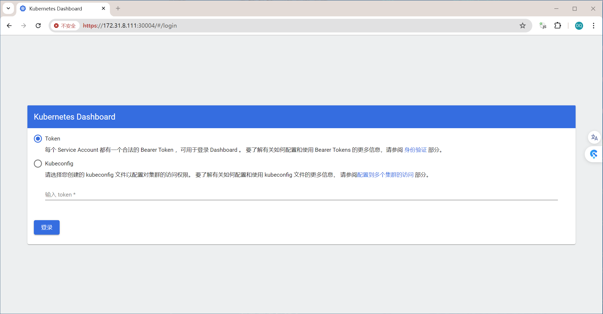
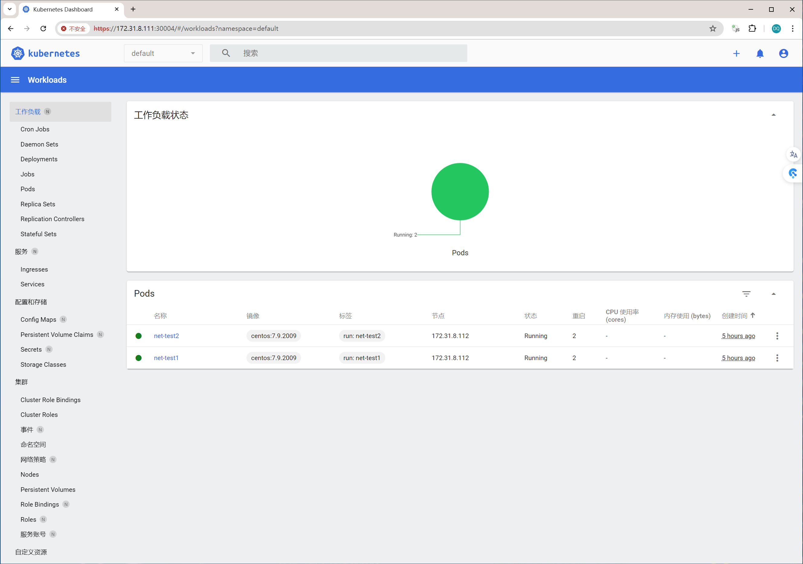

# 一：k8s集群环境搭建

k8s集群环境主要是kubernetes管理端服务（kube-apiserver、kube-controller-manager、kube-scheduler）的高可用实现，以及node节点上的（kubelet、kube-proxy）客户端服务的部署。

## 1.1：k8s高可用集群环境规划信息

按照实际环境需求，进行规划与部署相应的单master或者多master的高可用k8s运行环境。

### 1.1.1：单master环境

见kubeadm安装k8s

### 1.1.2：多master环境


### 1.1.3：服务器统计

| 类型            | 服务器IP地址             | 备注                                     |
| --------------- | ------------------------ | ---------------------------------------- |
| Ansible(2台)    | 172.31.8.101/102         | k8s集群部署服务器，可以和其他服务器混用  |
| k8s Master(3台) | 172.31.8.101/102/103     | k8s控制端，通过一个VIP做主备高可用       |
| Harbor(2台)     | 172.31.8.104、105        | 高可用镜像服务器                         |
| Etcd(最少3台)   | 172.31.8.106/107/108     | 保存k8s集群数据的服务器                  |
| Haproxy(2台)    | 172.31.8.109/110         | 高可用etcd代理服务器                     |
| Node节点(2-N台) | 172.31.8.111/112/113/xxx | 真正运行容器的服务器，高可用环境至少两台 |

## 1.2：服务器准备

服务器可以是私有云的虚拟机或物理机，也可以是公有云环境的虚拟机环境，如果是公司托管的IDC环境，可以直接将harbor和node节点部署在物理机环境，master节点、etcd、负载均衡等可以是虚拟机。

| 类型        | 服务器IP     | 主机名              | VIP          | CPU内存 |
| ----------- | ------------ | ------------------- | ------------ | ------- |
| k8s master1 | 172.31.8.101 | k8s-master1.rhce.cc | 172.31.8.188 | 4C 4G   |
| k8s master2 | 172.31.8.102 | k8s-master2.rhce.cc | 172.31.8.188 | 4C 4G   |
| k8s master3 | 172.31.8.103 | k8s-master3.rhce.cc | 172.31.8.188 | 4C 4G   |
| harbor1     | 172.31.8.104 | k8s-harbor1.rhce.cc |              | 4C 4G   |
| harbor2     | 172.31.8.105 | k8s-harbor2.rhce.cc |              | 4C 4G   |
| etcd节点1   | 172.31.8.106 | k8s-etcd1.rhce.cc   |              | 2C 2G   |
| etcd节点2   | 172.31.8.107 | k8s-etcd2.rhce.cc   |              | 2C 2G   |
| etcd节点2   | 172.31.8.108 | k8s-etcd3.rhce.cc   |              | 2C 2G   |
| haproxy1    | 172.31.8.109 | k8s-ha1.rhce.cc     |              | 2C 2G   |
| haproxy2    | 172.31.8.110 | k8s-ha2.rhce.cc     |              | 2C 2G   |
| node节点1   | 172.31.8.111 | k8s-node1.rhce.cc   |              | 4C 4G   |
| node节点2   | 172.31.8.112 | k8s-node2.rhce.cc   |              | 4C 4G   |
| node节点3   | 172.31.8.113 | k8s-node3.rhce.cc   |              | 4C 4G   |

## 1.3：k8s集群软件清单

见当前目录下Excel文件 kubernetes软件清单

API端口：

```sh

```

## 1.4：基础环境准备

系统主机名配置、IP配置、系统参数优化，以及依赖的负载均衡和Harbor部署

### 1.4.1：系统配置

> 前三项需要配置，其余都通过kubeasz处理

#### 1.4.1.1：主机名配置

> 所有主机均要配置，，这里以master1为例

```sh
[root@k8s-master1:~]# hostnamectl set-hostname k8s-master1.sunnycreek.ca
[root@k8s-master1:~]# exec bash
```

#### 1.4.1.2：IP地址配置

> 所有主机均要配置，，这里以master1为例

```sh
[root@k8s-master1:~]# vim /etc/netplan/01-netcfg.yaml
network:
  version: 2
  renderer: networkd
  ethernets:
    eth0:
      addresses: [172.31.8.101/24] 
      gateway4: 172.31.8.2
      nameservers:
        addresses: [223.5.5.5, 180.76.76.76]

[root@k8s-master1:~]# netplan apply
```

#### 1.4.1.3：主机系统时间同步配置

> 所有主机均要配置，这里以master1为例

```sh
# 改为24小时制
[root@k8s-master1:~]# echo "LC_TIME=en_DK.UTF-8" >> /etc/default/locale
# 做软链接为本地时间
[root@k8s-master1:~]# ln -sf /usr/share/zoneinfo/America/Toronto /etc/localtime
# 配置时间同步任务计划
[root@k8s-master1:~]# echo "* */1 * * * ntpdate time1.aliyun.com &> /dev/null && hwclock -w" >> /var/spool/cron/crontabs/root
[root@k8s-master1:~]# crontab -l
```

#### 1.4.1.4：主机名与IP地址解析配置

#### 1.4.1.5：主机安全配置

#### 1.4.1.6：主机ipvs管理工具安装及模块卸载

#### 1.4.1.7：Linux内核升级

#### 1.4.1.8：内核Kernel参数的调整，开启主机内核路由转发及网桥过滤

#### 1.4.1.9：关闭主机swap分区（master和node节点要注意重启后的问题，导致kubelet不能启动）

> 所有k8s节点上都要处理，因为使用kubeasz，可能这步不需要，但是要注意检查安装后的swap情况

```sh
# 关闭当前已启用的所有Swap设备。
[root@k8s-master1:~]# swapoff -a

# 编辑/etc/fstab配置文件，注释用于挂载Swap设备的所有行。
[root@k8s-master1:~]# sed -i '/swap/s/^/#/' /etc/fstab

# 在Ubuntu 2004及之后版本的系统上，若要彻底禁用Swap，可以需要类似如下命令进一步完成。
[root@k8s-master1:~]# systemctl --type swap
  UNIT          LOAD   ACTIVE SUB    DESCRIPTION   
  dev-sda4.swap loaded active active Swap Partition

LOAD   = Reflects whether the unit definition was properly loaded.
ACTIVE = The high-level unit activation state, i.e. generalization of SUB.
SUB    = The low-level unit activation state, values depend on unit type.

1 loaded units listed. Pass --all to see loaded but inactive units, too.
To show all installed unit files use 'systemctl list-unit-files'.

# 将上面命令列出的每个设备，使用systemctl mask命令加以禁用
[root@k8s-master1:~]# systemctl mask dev-sda4.swap
Created symlink /etc/systemd/system/dev-sda4.swap → /dev/null.

# 重启系统
[root@k8s-master1:~]# reboot
```


### 1.4.2：高可用负载均衡

> 以下均在ha1和ha2上执行操作

#### 1.4.2.1：keepalived

```sh
[root@k8s-ha1:~]# apt install keepalived -y

# 找到模板配置文件
[root@k8s-ha1:~]# find / -name keepalived.*
......
/usr/share/doc/keepalived/samples/keepalived.conf.vrrp
......

# 拷贝模板配置文件到keepalived配置目录中
[root@k8s-ha1:~]# cp /usr/share/doc/keepalived/samples/keepalived.conf.vrrp /etc/keepalived/keepalived.conf

# 修改配置文件
[root@k8s-ha1:~]# vim /etc/keepalived/keepalived.conf 
! Configuration File for keepalived

global_defs {
   notification_email {
     acassen
   }
   notification_email_from Alexandre.Cassen@firewall.loc
   smtp_server 192.168.200.1
   smtp_connect_timeout 30
   router_id LVS_DEVEL
}

vrrp_instance VI_1 {
    state MASTER
    interface eth0
    garp_master_delay 10
    smtp_alert
    virtual_router_id 51
    priority 100
    advert_int 1
    authentication {
        auth_type PASS
        auth_pass 1111
    }
    virtual_ipaddress {
        172.31.8.188 dev eth0 label eth0:0
        172.31.8.189 dev eth0 label eth0:1
        172.31.8.190 dev eth0 label eth0:2
    }
}

# 重启keepalived
[root@k8s-ha1:~]# systemctl restart keepalived

# 设置为开机自启动
[root@k8s-ha1:~]# systemctl enable keepalived

# 查看VIP是否生成
[root@k8s-ha1:~]# ip a
1: lo: <LOOPBACK,UP,LOWER_UP> mtu 65536 qdisc noqueue state UNKNOWN group default qlen 1000
    link/loopback 00:00:00:00:00:00 brd 00:00:00:00:00:00
    inet 127.0.0.1/8 scope host lo
       valid_lft forever preferred_lft forever
    inet6 ::1/128 scope host 
       valid_lft forever preferred_lft forever
2: eth0: <BROADCAST,MULTICAST,UP,LOWER_UP> mtu 1500 qdisc fq_codel state UP group default qlen 1000
    link/ether 00:0c:29:36:72:ff brd ff:ff:ff:ff:ff:ff
    inet 172.31.8.109/24 brd 172.31.8.255 scope global eth0
       valid_lft forever preferred_lft forever
    inet 172.31.8.188/32 scope global eth0:0
       valid_lft forever preferred_lft forever
    inet 172.31.8.189/32 scope global eth0:1
       valid_lft forever preferred_lft forever
    inet 172.31.8.190/32 scope global eth0:2
       valid_lft forever preferred_lft forever
    inet6 fe80::20c:29ff:fe36:72ff/64 scope link 
       valid_lft forever preferred_lft forever

PS：类似于在公有云上买的一个SLB。在配置k8s前就需要配置上。
```

```sh
[root@k8s-ha2:~]# apt install keepalived -y

# 从ha1中拷贝配置文件
[root@k8s-ha1:~]# scp /etc/keepalived/keepalived.conf 172.31.8.110:/etc/keepalived/keepalived.conf

# 编辑配置文件
[root@k8s-ha2:~]# vim /etc/keepalived/keepalived.conf 
! Configuration File for keepalived

global_defs {
   notification_email {
     acassen
   }
   notification_email_from Alexandre.Cassen@firewall.loc
   smtp_server 192.168.200.1
   smtp_connect_timeout 30
   router_id LVS_DEVEL
}

vrrp_instance VI_1 {
    state BACKUP 
    interface eth0
    garp_master_delay 10
    smtp_alert
    virtual_router_id 51
    priority 80
    advert_int 1
    authentication {
        auth_type PASS
        auth_pass 1111
    }
    virtual_ipaddress {
        172.31.8.188 dev eth0 label eth0:0
        172.31.8.189 dev eth0 label eth0:1
        172.31.8.190 dev eth0 label eth0:2
    }
}

# 重启keepalived服务
[root@k8s-ha2:~]# systemctl restart keepalived

# 设置开机自启动
[root@k8s-ha2:~]# systemctl enable keepalived

# 验证VIP会不会漂移，将主keepalived服务停掉，看辅keepalived是否能获取VIP

PS：keepalived是通过priority来判断优先级。
```

#### 1.4.2.2：haproxy

```sh
[root@k8s-ha1:~]# apt install haproxy -y

# 修改配置文件
[root@k8s-ha1:~]# vim /etc/haproxy/haproxy.cfg
global
	log /dev/log	local0
	log /dev/log	local1 notice
	chroot /var/lib/haproxy
	stats socket /run/haproxy/admin.sock mode 660 level admin expose-fd listeners
	stats timeout 30s
	user haproxy
	group haproxy
	daemon

	# Default SSL material locations
	ca-base /etc/ssl/certs
	crt-base /etc/ssl/private

	# See: https://ssl-config.mozilla.org/#server=haproxy&server-version=2.0.3&config=intermediate
        ssl-default-bind-ciphers ECDHE-ECDSA-AES128-GCM-SHA256:ECDHE-RSA-AES128-GCM-SHA256:ECDHE-ECDSA-AES256-GCM-SHA384:ECDHE-RSA-AES256-GCM-SHA384:ECDHE-ECDSA-CHACHA20-POLY1305:ECDHE-RSA-CHACHA20-POLY1305:DHE-RSA-AES128-GCM-SHA256:DHE-RSA-AES256-GCM-SHA384
        ssl-default-bind-ciphersuites TLS_AES_128_GCM_SHA256:TLS_AES_256_GCM_SHA384:TLS_CHACHA20_POLY1305_SHA256
        ssl-default-bind-options ssl-min-ver TLSv1.2 no-tls-tickets

defaults
	log	global
	mode	http
	option	httplog
	option	dontlognull
        timeout connect 5000
        timeout client  50000
        timeout server  50000
	errorfile 400 /etc/haproxy/errors/400.http
	errorfile 403 /etc/haproxy/errors/403.http
	errorfile 408 /etc/haproxy/errors/408.http
	errorfile 500 /etc/haproxy/errors/500.http
	errorfile 502 /etc/haproxy/errors/502.http
	errorfile 503 /etc/haproxy/errors/503.http
	errorfile 504 /etc/haproxy/errors/504.http
    
listen k8s-api-6443
  bind 172.31.8.188:6443
  mode tcp
  server master1 172.31.8.101:6443 check inter 3s fall 3 rise 1
  server master2 172.31.8.102:6443 check inter 3s fall 3 rise 1
  server master3 172.31.8.103:6443 check inter 3s fall 3 rise 1

# 重启服务
[root@k8s-ha1:~]# systemctl restart haproxy

# 设置开机自启动
[root@k8s-ha1:~]# systemctl enable haproxy

# 检测监听端口
[root@k8s-ha1:~]# ss -ntl
[root@k8s-ha1:~]# ss -ntl
State        Recv-Q       Send-Q              Local Address:Port                Peer Address:Port       Process       
LISTEN       0            20480                172.31.8.188:6443                     0.0.0.0:*                        
LISTEN       0            64                        0.0.0.0:21836                    0.0.0.0:*                        
......
```

```sh
[root@k8s-ha2:~]# apt install haproxy -y

# 从ha1上拷贝配置文件
[root@k8s-ha1:~]# scp /etc/haproxy/haproxy.cfg 172.31.7.110:/etc/haproxy/haproxy.cfg

# 重启服务
[root@k8s-ha2:~]# systemctl restart haproxy

# 设置开机自启动
[root@k8s-ha2:~]# systemctl enable haproxy

# 检测监听端口
[root@k8s-ha1:~]# ss -ntl
State        Recv-Q       Send-Q              Local Address:Port                Peer Address:Port       Process       
LISTEN       0            20480                172.31.8.188:6443                     0.0.0.0:*                        
LISTEN       0            64                        0.0.0.0:21836                    0.0.0.0:*       
......

PS：有可能这个服务启动不了。为什么？
/var/log/syslog会有报错。
它不能绑定。因为这个地址没有在本地监听。
[root@k8s-ha2:~]# sysctl -a | grep local
net.ipv4.ip_nonlocal_bind = 1
[root@k8s-ha2:~]# vim /etc/sysctl.conf
net.ipv4.ip_nonlocal_bind = 1
[root@k8s-ha2:~]# sysctl -p
建议两台haproxy服务器都要配置这个内核参数。需要监听本机没有的IP地址的端口。
```


### 1.4.3：harbor仓库

> 在harbor1上完成，这里没有做harbor负载均衡

#### 1.4.3.1：安装docker

```sh
# 安装必要的一些系统工具
[root@k8s-harbor1:~]# apt-get update
[root@k8s-harbor1:~]# apt-get -y install apt-transport-https ca-certificates curl software-properties-common

# Add Docker's official GPG key
[root@k8s-harbor1:~]# install -m 0755 -d /etc/apt/keyrings
[root@k8s-harbor1:~]# curl -fsSL https://download.docker.com/linux/ubuntu/gpg -o /etc/apt/keyrings/docker.asc
[root@k8s-harbor1:~]# chmod a+r /etc/apt/keyrings/docker.asc

# Add the repository to Apt sources
[root@k8s-harbor1:~]# echo "deb [arch=$(dpkg --print-architecture) signed-by=/etc/apt/keyrings/docker.asc] https://download.docker.com/linux/ubuntu $(. /etc/os-release && echo "$VERSION_CODENAME") stable" | tee /etc/apt/sources.list.d/docker.list > /dev/null

# 更新
[root@k8s-harbor1:~]# apt-get update

# 安装指定版本的Docker-CE：
# 1. 查找Docker-CE的版本
[root@k8s-harbor1:~]# apt-cache madison docker-ce
[root@k8s-harbor1:~]# apt-cache madison docker-ce-cli

# 2. 安装指定版本的Docker-CE
[root@k8s-harbor1:~]# apt -y install docker-ce=5:26.0.2-1~ubuntu.20.04~focal docker-ce-cli=5:26.0.2-1~ubuntu.20.04~focal

# 查看安装版本
[root@k8s-harbor1:~]# docker info

PS: 使用官方docker源。https://docs.docker.com/engine/install/ubuntu/
```


#### 1.4.3.2：安装docker-compose

```sh
### 安装docker-compose，离线安装

# 下载docker-compose
[root@k8s-harbor1:~]# wget https://github.com/docker/compose/releases/download/v2.27.1/docker-compose-linux-x86_64

# 修改文件名为docker-compose
[root@k8s-harbor1:~]# mv docker-compose-linux-x86_64 docker-compose
[root@k8s-harbor1:~]# mv docker-compose /usr/bin/

# 增加执行权限
[root@k8s-harbor1:~]# chmod +x /usr/bin/docker-compose
[root@k8s-harbor1:~]# file /usr/bin/docker-compose

# 查看安装版本
[root@k8s-harbor1:~]# docker-compose version
```


#### 1.4.3.3：安装harbor

```sh
### 安装harbor

# 下载相应版本
[root@k8s-harbor1:~]# wget https://github.com/goharbor/harbor/releases/download/v2.11.0/harbor-offline-installer-v2.11.0.tgz

# 将下载的harbor压缩包移动到/apps目录下，解压
[root@k8s-harbor1:~]# mkdir /apps
[root@k8s-harbor1:~]# mv harbor-offline-installer-v2.11.0.tgz /apps/
[root@k8s-harbor1:~]# cd /apps/
[root@k8s-harbor1:/apps]# tar xvf harbor-offline-installer-v2.11.0.tgz

# 复制配置文件模版到配置文件harbor.yml
[root@k8s-harbor1:/apps]# cd harbor/
[root@k8s-harbor1:/apps/harbor]# cp harbor.yml.tmpl harbor.yml

# 自签发证书过程
[root@k8s-harbor1:/apps/harbor]# mkdir certs
[root@k8s-harbor1:/apps/harbor]# cd certs/

[root@k8s-harbor1:/apps/harbor/certs]# openssl genrsa -out ca.key 2048
Generating RSA private key, 2048 bit long modulus (2 primes)
...............................................................................................+++++
.................................................................+++++
e is 65537 (0x010001)

[root@k8s-harbor1:/apps/harbor/certs]# openssl req -new -x509 -days 7120 -key ca.key -subj "/C=CN/ST=GD/L=SZ/O=Acme, Inc./CN=Acme Root CA" -out ca.crt

[root@k8s-harbor1:/apps/harbor/certs]# openssl req -newkey rsa:2048 -nodes -keyout harbor-ca.key -subj "/C=CN/ST=GD/L=SZ/O=Acme, Inc./CN=*.sunnycreek.local" -out server.csr
Generating a RSA private key
..............................+++++
......+++++
writing new private key to 'harbor-ca.key'
-----

[root@k8s-harbor1:/apps/harbor/certs]# openssl x509 -req -extfile <(printf "subjectAltName=DNS:sunnycreek.local,DNS:harbor.sunnycreek.local") -days 7120 -in server.csr -CA ca.crt -CAkey ca.key -CAcreateserial -out harbor-ca.crt
Signature ok
subject=C = CN, ST = GD, L = SZ, O = "Acme, Inc.", CN = *.sunnycreek.local
Getting CA Private Key

[root@k8s-harbor1:/apps/harbor/certs]# ls
ca.crt  ca.key  ca.srl  harbor-ca.crt  harbor-ca.key  server.csr

PS：注意路径是/apps/harbor/certs/

# 自签发证书路径
[root@k8s-harbor1:/apps/harbor/certs]# ls /apps/harbor/certs/harbor-ca.crt
/apps/harbor/certs/harbor-ca.crt

# 编辑harbor的主配置文件harbor.yml
[root@k8s-harbor1:/apps/harbor]# vim harbor.yml
# 修改为如下结果
[root@k8s-harbor1:/apps/harbor]# sed -e '/#/d' -e '/^$/d' harbor.yml
hostname: harbor.sunnycreek.local  ##(1)
http:
  port: 80
https:
  port: 443
  certificate: /apps/harbor/certs/harbor-ca.crt  ##(2)
  private_key: /apps/harbor/certs/harbor-ca.key  ##(3)
harbor_admin_password: 123456  ##(4)
database:
  password: root123
  max_idle_conns: 100
  max_open_conns: 900
  conn_max_lifetime: 5m
  conn_max_idle_time: 0
data_volume: /data  ##(5)这里通常是数据盘或者挂载
trivy:
  ignore_unfixed: false
  skip_update: false
  skip_java_db_update: false
  offline_scan: false
  security_check: vuln
  insecure: false
  timeout: 5m0s
jobservice:
  max_job_workers: 10
  job_loggers:
    - STD_OUTPUT
    - FILE
notification:
  webhook_job_max_retry: 3
log:
  level: info
  local:
    rotate_count: 50
    rotate_size: 200M
    location: /var/log/harbor
_version: 2.11.0
proxy:
  http_proxy:
  https_proxy:
  no_proxy:
  components:
    - core
    - jobservice
    - trivy
upload_purging:
  enabled: true
  age: 168h
  interval: 24h
  dryrun: false
cache:
  enabled: false
  expire_hours: 24
  
# 安装harbor
[root@k8s-harbor1:/apps/harbor]# ./install.sh

# 查看启动后的容器，一共9个
[root@k8s-harbor1:/apps/harbor]# docker ps
CONTAINER ID   IMAGE                                 COMMAND                  CREATED         STATUS                            PORTS                                                                            NAMES
7eace8ae8d69   goharbor/harbor-jobservice:v2.11.0    "/harbor/entrypoint.…"   9 seconds ago   Up 4 seconds (health: starting)                                                                                    harbor-jobservice
d052a3801ee0   goharbor/nginx-photon:v2.11.0         "nginx -g 'daemon of…"   9 seconds ago   Up 7 seconds (health: starting)   0.0.0.0:80->8080/tcp, :::80->8080/tcp, 0.0.0.0:443->8443/tcp, :::443->8443/tcp   nginx
36f40f38dd86   goharbor/harbor-core:v2.11.0          "/harbor/entrypoint.…"   9 seconds ago   Up 7 seconds (health: starting)                                                                                    harbor-core
3737e65c17a4   goharbor/harbor-registryctl:v2.11.0   "/home/harbor/start.…"   9 seconds ago   Up 8 seconds (health: starting)                                                                                    registryctl
9ee1d284fe78   goharbor/registry-photon:v2.11.0      "/home/harbor/entryp…"   9 seconds ago   Up 8 seconds (health: starting)                                                                                    registry
71a66d4a50a5   goharbor/harbor-portal:v2.11.0        "nginx -g 'daemon of…"   9 seconds ago   Up 8 seconds (health: starting)                                                                                    harbor-portal
258b824af65d   goharbor/redis-photon:v2.11.0         "redis-server /etc/r…"   9 seconds ago   Up 8 seconds (health: starting)                                                                                    redis
c39ba0ef2056   goharbor/harbor-db:v2.11.0            "/docker-entrypoint.…"   9 seconds ago   Up 8 seconds (health: starting)                                                                                    harbor-db
757b14c23209   goharbor/harbor-log:v2.11.0           "/bin/sh -c /usr/loc…"   9 seconds ago   Up 8 seconds (health: starting)   127.0.0.1:1514->10514/tcp                                                        harbor-log

# 配置systemd
[root@k8s-harbor1:/apps/harbor]# vim /lib/systemd/system/harbor.service
[Unit]
Description=Harbor
After=docker.service systemd-networkd.service systemd-resolved.service
Requires=docker.service
Documentation=http://github.com/vmware/harbor

[Service]
Type=simple
Restart=on-failure
RestartSec=5
ExecStart=/usr/bin/docker-compose -f /apps/harbor/docker-compose.yml up
ExecStop=/usr/bin/docker-compose -f /apps/harbor/docker-compose.yml down

[Install]
WantedBy=multi-user.target

# 加载配置，停止服务，设置为开机自启动
[root@k8s-harbor1:/apps/harbor]# systemctl daemon-reload
[root@k8s-harbor1:/apps/harbor]# systemctl stop harbor.service
[root@k8s-harbor1:/apps/harbor]# systemctl enable --now harbor.service

# 配置DNS解析，在客户端机器。
172.31.8.104 harbor.sunnycreek.local

PS：harbor安装就是镜像。
```

## 1.5：手动二进制部署

> 空

## 1.6：ansible部署

### 1.6.1：基础环境准备

#### 1.6.1.1：部署节点安装ansible

> 部署节点，这里就是master1

```sh
# 安装ansible
[root@k8s-master1:~]# apt-get -y install ansible

[root@k8s-master1:~]# ansible --version
ansible 2.9.6
  config file = /etc/ansible/ansible.cfg
  configured module search path = ['/root/.ansible/plugins/modules', '/usr/share/ansible/plugins/modules']
  ansible python module location = /usr/lib/python3/dist-packages/ansible
  executable location = /usr/bin/ansible
  python version = 3.8.10 (default, Nov 22 2023, 10:22:35) [GCC 9.4.0]
```

#### 1.6.1.2：配置免密钥认证

```sh
# 生成密钥对
[root@k8s-master1:~]# ssh-keygen

# 安装sshpass命令用于同步公钥到各k8s服务器
[root@k8s-master1:~]# apt-get install sshpass

# 分发公钥脚本
[root@k8s-master1:~]# vim scp.sh
#!/bin/bash
# 目标主机列表
IP="
172.31.8.101
172.31.8.102
172.31.8.103
172.31.8.106
172.31.8.107
172.31.8.108
172.31.8.111
172.31.8.112
172.31.8.113
"

for node in ${IP};do
  sshpass -p 123456 ssh-copy-id ${node} -o StrictHostKeyChecking=no
  if [ $? -eq 0 ];then
    echo "${node} 密钥copy完成"
  else
    echo "${node} 密钥copy失败"
  fi
done

# 执行公钥分发
[root@k8s-master1:~]# bash scp.sh

PS：vim ~/.vimrc 取消vim自动缩进功能
PS：拷贝到所有master、etcd、node主机
101,102,103,106,107,108,111,112,113，这里就是本机的话，101也需要ssh-copy-id
```

#### 1.6.1.3：设置python软链接

```sh
# 将内置的python3.8做个软链接，或者确保每个节点都存在python3.8的软链接。名字为/usr/bin/python3。
# 注意，凡是ansible要去管理的节点都要做软链接
[root@k8s-master1:~]# whereis python
python: /usr/bin/python3.8 /usr/lib/python2.7 /usr/lib/python3.8 /usr/lib/python3.9 /etc/python3.8 /usr/local/lib/python3.8

[root@k8s-master1:~]# ln -s /usr/bin/python3.8 /usr/bin/python

PS：凡是ansible要去管理的节点都要做软链接，101,102,103,106,107,108,111,112,113。
```

### 1.6.2：下载kubeasz项目及组件

#### 1.6.2.1：下载项目及组件

```sh
# 实验准备部署kubeasz 3.6.3
k8s: v1.29.0
etcd: v3.5.10
containerd: 1.6.26
runc: v1.1.10
calico: v3.26.4
cilium: 1.14.5

# 实际部署kubeasz 3.2.0
k8s: v1.23.1
etcd: v3.5.1
containerd: 1.5.8
calico: v3.19.3
flannel: v0.15.1
coredns: 1.8.6
cni-plugins: v1.0.1
pause: 3.6
dashboard: v2.4.0
metrics-server: v0.5.2
k8s-dns-node-cache: 1.21.1
nfs-provisioner: v4.0.2

# 下载工具脚本ezdown，举例使用kubeasz版本3.6.3；3.2.0
[root@k8s-master1:~]# export release=3.6.3
[root@k8s-master1:~]# wget https://github.com/easzlab/kubeasz/releases/download/${release}/ezdown
[root@k8s-master1:~]# chmod a+x ezdown

# 查看ezdown文件中的docker版本信息，不用更改
[root@k8s-master1:~]# vim ./ezdown
DOCKER_VER=24.0.7

# 查看ezdown帮助
[root@k8s-master1:~]# ./ezdown -help
./ezdown: illegal option -- h
Usage: ezdown [options] [args]
  option:
    -C         stop&clean all local containers
    -D         download default binaries/images into "/etc/kubeasz"
    -P <OS>    download system packages of the OS (ubuntu_22,debian_11,...)
    -R         download Registry(harbor) offline installer
    -S         start kubeasz in a container
    -X <opt>   download extra images
    -d <ver>   set docker-ce version, default "24.0.7"
    -e <ver>   set kubeasz-ext-bin version, default "1.9.0"
    -k <ver>   set kubeasz-k8s-bin version, default "v1.29.0"
    -m <str>   set docker registry mirrors, default "CN"(used in Mainland,China)
    -z <ver>   set kubeasz version, default "3.6.3"

PS：-D 下载所有包到/etc/kubeasz，下载时会使用docker命令去下载那些镜像，用镜像文件启动一些容器，再从容器里拷贝到本地。当然也可以自己安装docker。

# 下载kubeasz代码、二进制、默认容器镜像（更多关于ezdown的参数，运行./ezdown 查看）
[root@k8s-master1:~]# ./ezdown -D -m standard

# 下载完毕后，查看下载内容
[root@k8s-master1:~]# ls /etc/kubeasz
README.md  ansible.cfg  bin  docs  down  example  ezctl  ezdown  manifests  pics  playbooks  roles  tools
[root@k8s-master1:~]# ls /etc/kubeasz/example
config.yml  hosts.allinone  hosts.multi-node
```

#### 1.6.2.2：kubeasz的帮助说明

```sh
# 查看kubeasz的帮助
[root@k8s-master1:~]# cd /etc/kubeasz
[root@k8s-master1:/etc/kubeasz]# ll
total 112
drwxrwxr-x  12 root root   224 Jun 26 12:54 ./
drwxr-xr-x 103 root root  8192 Jun 26 12:55 ../
drwxrwxr-x   4 root root    77 Dec 31 00:40 .github/
-rw-rw-r--   1 root root   301 Dec 31 00:30 .gitignore
-rw-rw-r--   1 root root  6302 Dec 31 00:30 README.md
-rw-rw-r--   1 root root 20304 Dec 31 00:30 ansible.cfg
drwxr-xr-x   5 root root  4096 Jun 26 12:54 bin/
drwxrwxr-x   8 root root    94 Dec 31 00:40 docs/
drwxr-xr-x   3 root root   298 Jun 26 12:56 down/
drwxrwxr-x   2 root root    70 Dec 31 00:40 example/
-rwxrwxr-x   1 root root 26507 Dec 31 00:30 ezctl*
-rwxrwxr-x   1 root root 32260 Dec 31 00:30 ezdown*
drwxrwxr-x  10 root root   145 Dec 31 00:40 manifests/
drwxrwxr-x   2 root root    94 Dec 31 00:40 pics/
drwxrwxr-x   2 root root  4096 Dec 31 00:40 playbooks/
drwxrwxr-x  22 root root   323 Dec 31 00:40 roles/
drwxrwxr-x   2 root root    90 Dec 31 00:40 tools/


[root@k8s-master1:/etc/kubeasz]# ./ezctl --help
Usage: ezctl COMMAND [args]
-------------------------------------------------------------------------------------
Cluster setups:
    list		             to list all of the managed clusters
    checkout    <cluster>            to switch default kubeconfig of the cluster
    new         <cluster>            to start a new k8s deploy with name 'cluster'
    setup       <cluster>  <step>    to setup a cluster, also supporting a step-by-step way
    start       <cluster>            to start all of the k8s services stopped by 'ezctl stop'
    stop        <cluster>            to stop all of the k8s services temporarily
    upgrade     <cluster>            to upgrade the k8s cluster
    destroy     <cluster>            to destroy the k8s cluster
    backup      <cluster>            to backup the cluster state (etcd snapshot)
    restore     <cluster>            to restore the cluster state from backups
    start-aio		             to quickly setup an all-in-one cluster with default settings

Cluster ops:
    add-etcd    <cluster>  <ip>      to add a etcd-node to the etcd cluster
    add-master  <cluster>  <ip>      to add a master node to the k8s cluster
    add-node    <cluster>  <ip>      to add a work node to the k8s cluster
    del-etcd    <cluster>  <ip>      to delete a etcd-node from the etcd cluster
    del-master  <cluster>  <ip>      to delete a master node from the k8s cluster
    del-node    <cluster>  <ip>      to delete a work node from the k8s cluster

Extra operation:
    kca-renew   <cluster>            to force renew CA certs and all the other certs (with caution)
    kcfg-adm    <cluster>  <args>    to manage client kubeconfig of the k8s cluster

Use "ezctl help <command>" for more information about a given command.

PS：主要参数说明
list 列出部署的集群。可以部署多个k8s集群。
new 创建一个集群，名字自己可以指定，在后面加个参数，比如cluster。然后就会创建一个cluster目录，会拷贝两个文件，一个文件是./example/hosts.multi-node，这是ansible需要的一个文件，需要在这个文件中指定安装节点地址，指定一些路径，指定参数等。一个配置文件./example/config.yml，针对当前k8s集群的配置文件，包括证书签发的有效期，网络参数，每个node节点能最大启动多少容器，很多配置都是这里指定。但是这些都是通过变量来使用的。

[root@k8s-master1:/etc/kubeasz]# ll example/
total 16
drwxrwxr-x  2 root root   70 Dec 31 00:40 ./
drwxrwxr-x 12 root root  224 Jun 26 12:54 ../
-rw-rw-r--  1 root root 7601 Dec 31 00:30 config.yml
-rw-rw-r--  1 root root 2212 Dec 31 00:30 hosts.allinone
-rw-rw-r--  1 root root 2382 Dec 31 00:30 hosts.multi-node
```

### 1.6.3：使用kubeasz初始化k8s集群

#### 1.6.3.1：生成hosts和config.yml文件

```sh
# 创建新的k8s集群 --> "k8s-cluster1"
[root@k8s-master1:~]# cd /etc/kubeasz/
[root@k8s-master1:/etc/kubeasz]# ./ezctl new k8s-cluster1
2024-06-26 13:02:29 DEBUG generate custom cluster files in /etc/kubeasz/clusters/k8s-cluster1
2024-06-26 13:02:29 DEBUG set versions
2024-06-26 13:02:29 DEBUG disable registry mirrors
2024-06-26 13:02:29 DEBUG cluster k8s-cluster1: files successfully created.
2024-06-26 13:02:29 INFO next steps 1: to config '/etc/kubeasz/clusters/k8s-cluster1/hosts'
2024-06-26 13:02:29 INFO next steps 2: to config '/etc/kubeasz/clusters/k8s-cluster1/config.yml'

# 进入当前k8s-cluster1目录
[root@k8s-master1:/etc/kubeasz]# cd clusters/k8s-cluster1/
[root@k8s-master1:/etc/kubeasz/clusters/k8s-cluster1]# ll
total 12
drwxr-xr-x 2 root root   37 Jun 26 13:02 ./
drwxr-xr-x 3 root root   26 Jun 26 13:02 ../
-rw-r--r-- 1 root root 7473 Jun 26 13:02 config.yml
-rw-r--r-- 1 root root 2380 Jun 26 13:02 hosts
```

#### 1.6.3.2：编辑ansible hosts文件

> 指定etcd节点、master节点、node节点、VIP、运行时、网络组建类型、service IP和pod IP范围等配置信息

```sh
[root@k8s-master1:/etc/kubeasz/clusters/k8s-cluster1]# vim hosts
# 'etcd' cluster should have odd member(s) (1,3,5,...)
[etcd]
172.31.8.106 k8s_nodename='k8s-etcd1.sunnycreek.ca'
172.31.8.107 k8s_nodename='k8s-etcd2.sunnycreek.ca'
172.31.8.108 k8s_nodename='k8s-etcd3.sunnycreek.ca'

# master node(s), set unique 'k8s_nodename' for each node
# CAUTION: 'k8s_nodename' must consist of lower case alphanumeric characters, '-' or '.',
# and must start and end with an alphanumeric character
#【这里先写两个，后面会扩容master的第3个节点，172.31.8.103】
[kube_master]
172.31.8.101 k8s_nodename='k8s-master1.sunnycreek.ca'
172.31.8.102 k8s_nodename='k8s-master2.sunnycreek.ca'

# work node(s), set unique 'k8s_nodename' for each node
# CAUTION: 'k8s_nodename' must consist of lower case alphanumeric characters, '-' or '.',
# and must start and end with an alphanumeric character
# 【这里先写两个，后面会扩容node的第3个节点，172.31.8.113】
[kube_node]
172.31.8.111 k8s_nodename='k8s-node1.sunnycreek.ca'
172.31.8.112 k8s_nodename='k8s-node2.sunnycreek.ca'

# [optional] harbor server, a private docker registry
# 'NEW_INSTALL': 'true' to install a harbor server; 'false' to integrate with existed one
[harbor]
#192.168.1.8 NEW_INSTALL=false

# [optional] loadbalance for accessing k8s from outside
#【虽然这里打开配置，但是负载均衡器实际上已经装好，等会儿把job注释掉】
#【我们不用这个配置部署，所以地址是假的也无妨】
[ex_lb]
172.31.8.6 LB_ROLE=backup EX_APISERVER_VIP=172.31.8.188 EX_APISERVER_PORT=6443
172.31.8.7 LB_ROLE=master EX_APISERVER_VIP=172.31.8.188 EX_APISERVER_PORT=6443

# [optional] ntp server for the cluster
[chrony]
#192.168.1.1

[all:vars]
# --------- Main Variables ---------------
# Secure port for apiservers
SECURE_PORT="6443"

# Cluster container-runtime supported: docker, containerd
# if k8s version >= 1.24, docker is not supported
CONTAINER_RUNTIME="containerd"

# Network plugins supported: calico, flannel, kube-router, cilium, kube-ovn
# 【在私有云，推荐使用calico，公有云一般使用flannel】
CLUSTER_NETWORK="calico"

# Service proxy mode of kube-proxy: 'iptables' or 'ipvs'
PROXY_MODE="ipvs"

# K8S Service CIDR, not overlap with node(host) networking
#【service网络地址，不要和宿主机网络、机房网络、办公网络冲突，这是私网地址，子网范围一定要大】
#【选择192,172,10开头的私网地址，推荐配10的】
SERVICE_CIDR="10.100.0.0/16"

# Cluster CIDR (Pod CIDR), not overlap with node(host) networking
#【pod网络地址，不要和宿主机网络、机房网络、办公网络冲突，这是私网地址，子网范围一定要大】
#【选择192,172,10开头的私网地址，推荐配10的】
CLUSTER_CIDR="10.200.0.0/16"

# NodePort Range
#【公司内规定，所有服务的端口范围不能配置到30000-65000，这是给k8s的】
#【此外，不要在节点上安装别的服务，只运行k8s服务】
NODE_PORT_RANGE="30000-65000"

# Cluster DNS Domain
#【一般可以不改，使用默认的cluster.local即可】
#【这是service网络的后缀】
CLUSTER_DNS_DOMAIN="sunnycreek.local"

# -------- Additional Variables (don't change the default value right now) ---
# Binaries Directory
#【apiserver，controller-manager的二进制文件，会拷贝到master节点这个目录下】
#【kubelet，kube-proxy的二进制文件，会拷贝到node节点这个目录下】
#【其实拷贝到哪里都可以，会把它们做软链接，会把软链接指向/usr/bin里，然后用变量传到service文件里，】
#【最后来这里去加载二进制】
#【/usr/local/bin目录是存放第三方的二进制文件的建议位置】
bin_dir="/usr/local/bin"

# Deploy Directory (kubeasz workspace)
#【kubeasz的部署路径】
base_dir="/etc/kubeasz"

# Directory for a specific cluster
# 【kubeasz的k8s集群配置文件目录】
cluster_dir="{{ base_dir }}/clusters/k8s-cluster1"

# CA and other components cert/key Directory
# 【自签发证书的路径】
ca_dir="/etc/kubernetes/ssl"

# Default 'k8s_nodename' is empty
# 【前面没有名字的节点，默认名字是''】
k8s_nodename=''

# Default python interpreter
# 【使用已经设置过的/usr/bin/python软链接】
ansible_python_interpreter=/usr/bin/python

PS：【】是自行注释

# 查看二进制文件当前的路径，已经在部署前准备完毕
[root@k8s-master1:/etc/kubeasz/clusters/k8s-cluster1]# ls /etc/kubeasz/bin/
calicoctl       cfssljson  cni-bin         docker-bin      etcdctl  keepalived               kube-proxy      kubelet
cfssl           chronyd    containerd-bin  docker-compose  helm     kube-apiserver           kube-scheduler  nginx
cfssl-certinfo  cilium     crictl          etcd            hubble   kube-controller-manager  kubectl
[root@k8s-master1:/etc/kubeasz/clusters/k8s-cluster1]# /etc/kubeasz/bin/kube-apiserver --version
Kubernetes v1.29.0
[root@k8s-master1:/etc/kubeasz/clusters/k8s-cluster1]# /etc/kubeasz/bin/kube-scheduler --version
Kubernetes v1.29.0
```

#### 1.6.3.3：编辑ansible config.yml文件

> 针对k8s的配置

```sh
[root@k8s-master1:/etc/kubeasz/clusters/k8s-cluster1]# vim config.yml
############################
# prepare
############################
# 可选离线安装系统软件包 (offline|online)
#【online: 本地有包的话，优先使用本地的，没有包的话，就在线下载】
#【优先拷贝本地环境的包，比如/etc/kubeasz/bin和/etc/kubeasz/down里的二进制文件或者tar包】
INSTALL_SOURCE: "online"

# 可选进行系统安全加固 github.com/dev-sec/ansible-collection-hardening
# (deprecated) 未更新上游项目，未验证最新k8s集群安装，不建议启用
OS_HARDEN: false


############################
# role:deploy
############################
# default: ca will expire in 100 years
# default: certs issued by the ca will expire in 50 years
# 【876000h是100年，438000h是50年】
CA_EXPIRY: "876000h"
CERT_EXPIRY: "438000h"

# force to recreate CA and other certs, not suggested to set 'true'
CHANGE_CA: false

# kubeconfig 配置参数
#【多集群环境下，你的k8s叫什么名称】
#【CONTEXT_NAME是用于切换集群的】
CLUSTER_NAME: "cluster1"
CONTEXT_NAME: "context-{{ CLUSTER_NAME }}"

# k8s version
K8S_VER: "1.29.0"

# set unique 'k8s_nodename' for each node, if not set(default:'') ip add will be used
# CAUTION: 'k8s_nodename' must consist of lower case alphanumeric characters, '-' or '.',
# and must start and end with an alphanumeric character (e.g. 'example.com'),
# regex used for validation is '[a-z0-9]([-a-z0-9]*[a-z0-9])?(\.[a-z0-9]([-a-z0-9]*[a-z0-9])?)*'
K8S_NODENAME: " \
                    {{ k8s_nodename|replace('_', '-')|lower }} \
                \
                    {{ inventory_hostname }} \
               "

############################
# role:etcd
############################
# 设置不同的wal目录，可以避免磁盘io竞争，提高性能
# 【可以改成/date/etcd，这里先不变】
ETCD_DATA_DIR: "/var/lib/etcd"
ETCD_WAL_DIR: ""


############################
# role:runtime [containerd,docker]
############################
# [.]启用拉取加速镜像仓库
#【加速镜像下载。一旦启用之后，有些配置是可以更改的。】
#【比如下面的文件：】
#【/etc/kubeasz/playbooks/03.runtime.yml，见后面说明】
ENABLE_MIRROR_REGISTRY: true 

# [.]添加信任的私有仓库
INSECURE_REG:
  - "http://easzlab.io.local:5000"
  - "https://{{ HARBOR_REGISTRY }}"

# [.]基础容器镜像
# 【pause是用来初始化容器底层的运行环境的】
SANDBOX_IMAGE: "easzlab.io.local:5000/easzlab/pause:3.9"

# [containerd]容器持久化存储目录
CONTAINERD_STORAGE_DIR: "/var/lib/containerd"

# [docker]容器存储目录
DOCKER_STORAGE_DIR: "/var/lib/docker"

# [docker]开启Restful API
DOCKER_ENABLE_REMOTE_API: false


############################
# role:kube-master
############################
# k8s 集群 master 节点证书配置，可以添加多个ip和域名（比如增加公网ip和域名）
#【这个设置和证书签发有关系】
#【如果k8s是自己部署的，你又在外网使用了负载均衡器，需要将外网的负载均衡器签发个证书】
#【如果不签发，就无法在外网访问它，也就是运维人员无法使用kubectl来访问api-server】
#【这是给api-server使用的，是master节点的】
MASTER_CERT_HOSTS:
  - "172.31.8.188"
  - "k8s.easzlab.io"
  #- "www.test.com"

# node 节点上 pod 网段掩码长度（决定每个节点最多能分配的pod ip地址）
# 如果flannel 使用 --kube-subnet-mgr 参数，那么它将读取该设置为每个节点分配pod网段
# https://github.com/coreos/flannel/issues/847
#【这里不是使用flannel，所以改不改都可以】
NODE_CIDR_LEN: 24


############################
# role:kube-node
############################
# Kubelet 根目录
#【kubelet的工作目录】
KUBELET_ROOT_DIR: "/var/lib/kubelet"

# node节点最大pod 数
#【有些服务器配置非常高，800G-1T内存，可以启用很多容器】
MAX_PODS: 500

# 配置为kube组件（kubelet,kube-proxy,dockerd等）预留的资源量
# 数值设置详见templates/kubelet-config.yaml.j2
#【yes开启的话，就是要给主机预留多少资源】
KUBE_RESERVED_ENABLED: "no"

# k8s 官方不建议草率开启 system-reserved, 除非你基于长期监控，了解系统的资源占用状况；
# 并且随着系统运行时间，需要适当增加资源预留，数值设置详见templates/kubelet-config.yaml.j2
# 系统预留设置基于 4c/8g 虚机，最小化安装系统服务，如果使用高性能物理机可以适当增加预留
# 另外，集群安装时候apiserver等资源占用会短时较大，建议至少预留1g内存
SYS_RESERVED_ENABLED: "no"


############################
# role:network [flannel,calico,cilium,kube-ovn,kube-router]
############################
# ------------------------------------------- flannel
# [flannel]设置flannel 后端"host-gw","vxlan"等
#【网络模型是vxlan，是否开启DIRECT_ROUTING】
FLANNEL_BACKEND: "vxlan"
DIRECT_ROUTING: false

# [flannel] 
flannel_ver: "v0.22.2"

# ------------------------------------------- calico
# [calico] IPIP隧道模式可选项有: [Always, CrossSubnet, Never],跨子网可以配置为Always与CrossSubnet(公有云建议使用always比较省事，其他的话需要修改各自公有云的网络配置，具体可以参考各个公有云说明)
# 其次CrossSubnet为隧道+BGP路由混合模式可以提升网络性能，同子网配置为Never即可.
#【一般都打开。关掉之后只能在同一个局域网内通信，可以理解为一个VLAN，是不能跨子网的】
#【Always虽然性能有损耗，但是兼容性些好，支持任何子网。node节点在不同子网都可以】
CALICO_IPV4POOL_IPIP: "Always"

# [calico]设置 calico-node使用的host IP，bgp邻居通过该地址建立，可手工指定也可以自动发现
IP_AUTODETECTION_METHOD: "can-reach={{ groups['kube_master'][0] }}"

# [calico]设置calico 网络 backend: bird, vxlan, none
CALICO_NETWORKING_BACKEND: "bird"

# [calico]设置calico 是否使用route reflectors
# 如果集群规模超过50个节点，建议启用该特性
CALICO_RR_ENABLED: false

# CALICO_RR_NODES 配置route reflectors的节点，如果未设置默认使用集群master节点 
# CALICO_RR_NODES: ["192.168.1.1", "192.168.1.2"]
CALICO_RR_NODES: []

# [calico]更新支持calico 版本: ["3.19", "3.23"]
calico_ver: "v3.26.4"

# [calico]calico 主版本
calico_ver_main: "{{ calico_ver.split('.')[0] }}.{{ calico_ver.split('.')[1] }}"

# ------------------------------------------- cilium
# [cilium]镜像版本
cilium_ver: "1.14.5"
cilium_connectivity_check: true
cilium_hubble_enabled: false
cilium_hubble_ui_enabled: false

# ------------------------------------------- kube-ovn
# [kube-ovn]离线镜像tar包
kube_ovn_ver: "v1.11.5"

# ------------------------------------------- kube-router
# [kube-router]公有云上存在限制，一般需要始终开启 ipinip；自有环境可以设置为 "subnet"
OVERLAY_TYPE: "full"

# [kube-router]NetworkPolicy 支持开关
FIREWALL_ENABLE: true

# [kube-router]kube-router 镜像版本
kube_router_ver: "v1.5.4"


############################
# role:cluster-addon
############################
# coredns 自动安装
#【我们自己安装】
#【ENABLE_LOCAL_DNS_CACHE，是否开启主机的DNS缓存。】
#【开启之后，主机会有小的容器，会缓存service的解析记录，会缓解DNS组件的压力】
#【生产环境可以打开，可以减轻coredns的负载。实际也可以开多个dns也行】
dns_install: "no"
corednsVer: "1.11.1"
ENABLE_LOCAL_DNS_CACHE: false
dnsNodeCacheVer: "1.22.23"
# 设置 local dns cache 地址
LOCAL_DNS_CACHE: "169.254.20.10"

# metric server 自动安装
#【我们自己安装】
metricsserver_install: "no"
metricsVer: "v0.6.4"

# dashboard 自动安装
#【我们自己安装】
dashboard_install: "no"
dashboardVer: "v2.7.0"
dashboardMetricsScraperVer: "v1.0.8"

# prometheus 自动安装
#【我们自己安装】
prom_install: "no"
prom_namespace: "monitor"
prom_chart_ver: "45.23.0"

# kubeapps 自动安装，如果选择安装，默认同时安装local-storage（提供storageClass: "local-path"）
kubeapps_install: "no"
kubeapps_install_namespace: "kubeapps"
kubeapps_working_namespace: "default"
kubeapps_storage_class: "local-path"
kubeapps_chart_ver: "12.4.3"

# local-storage (local-path-provisioner) 自动安装
local_path_provisioner_install: "no"
local_path_provisioner_ver: "v0.0.24"
# 设置默认本地存储路径
local_path_provisioner_dir: "/opt/local-path-provisioner"

# nfs-provisioner 自动安装
#【如果要配置，后端有个nfs服务器】
#【创建pv和pvc的时候，调用】
#【持久化容器中的业务数据的，非常重要】
nfs_provisioner_install: "no"
nfs_provisioner_namespace: "kube-system"
nfs_provisioner_ver: "v4.0.2"
nfs_storage_class: "managed-nfs-storage"
nfs_server: "192.168.1.10"
nfs_path: "/data/nfs"

# network-check 自动安装
network_check_enabled: false 
network_check_schedule: "*/5 * * * *"

############################
# role:harbor
############################
# harbor version，完整版本号
HARBOR_VER: "v2.8.4"
HARBOR_DOMAIN: "harbor.easzlab.io.local"
HARBOR_PATH: /var/data
HARBOR_TLS_PORT: 8443
HARBOR_REGISTRY: "{{ HARBOR_DOMAIN }}:{{ HARBOR_TLS_PORT }}"

# if set 'false', you need to put certs named harbor.pem and harbor-key.pem in directory 'down'
HARBOR_SELF_SIGNED_CERT: true

# install extra component
HARBOR_WITH_NOTARY: false
HARBOR_WITH_TRIVY: false

PS：【】
```

#### 1.6.3.4：重要ansible部署文件说明

```sh
### 重要文件说明

# 根据配置文件不同，来选择部署不同的runtime
# /etc/kubeasz/playbooks/03.runtime.yml
[root@k8s-master1:/etc/kubeasz/clusters/k8s-cluster1]# vim ../../playbooks/03.runtime.yml
# to install a container runtime
- hosts:
  - kube_master
  - kube_node
  roles:
  - { role: docker, when: "CONTAINER_RUNTIME == 'docker'" }
  - { role: containerd, when: "CONTAINER_RUNTIME == 'containerd'" }

# 如果想在部署之前加一些参数，可以改这个service文件，改完后批量执行就可以。
# /etc/kubeasz/roles/docker/templates/docker.service.j2
[root@k8s-master1:/etc/kubeasz/clusters/k8s-cluster1]# vim ../../roles/docker/templates/docker.service.j2
[Unit]
Description=Docker Application Container Engine
Documentation=http://docs.docker.io

[Service]
Environment="PATH={{ bin_dir }}:/bin:/sbin:/usr/bin:/usr/sbin"
ExecStart={{ bin_dir }}/dockerd 
ExecStartPost=/sbin/iptables -I FORWARD -s 0.0.0.0/0 -j ACCEPT
ExecReload=/bin/kill -s HUP $MAINPID
Restart=on-failure
RestartSec=5
LimitNOFILE=infinity
LimitNPROC=infinity
LimitCORE=infinity
Delegate=yes
KillMode=process

[Install]
WantedBy=multi-user.target

# 配置镜像加速的文件
[root@k8s-master1:/etc/kubeasz/clusters/k8s-cluster1]# cat ../../roles/docker/templates/daemon.json.j2
{
  "data-root": "{{ DOCKER_STORAGE_DIR }}",
  "exec-opts": ["native.cgroupdriver={{ CGROUP_DRIVER }}"],

  "registry-mirrors": [
    "https://docker.nju.edu.cn/",
    "https://8otyy3fq.mirror.aliyuncs.com", 【这里添加了个人的阿里云镜像】
    "https://kuamavit.mirror.aliyuncs.com"
  ], 


  "hosts": ["tcp://0.0.0.0:2376", "unix:///var/run/docker.sock"],

  "insecure-registries": [{{ INSECURE_REG_STRING }}],
  "max-concurrent-downloads": 10,
  "live-restore": true,
  "log-driver": "json-file",
  "log-level": "warn",
  "log-opts": {
    "max-size": "50m",
    "max-file": "1"
    },
  "storage-driver": "overlay2"
}

PS：【】注释
公司内部的镜像仓库要配置到insecure-registries，这是配置http的。https不用配置。
registry-mirrors可以加上公司自己的，或者是阿里云的。

grep INSECURE_REG ./ -R 递归查找INSECURE_REG变量
```

#### 1.6.3.5：去除haproxy节点

> 去除haproxy节点，因为我们自己安装，不需要ansible来做

```sh
# /etc/kubeasz/playbooks/01.prepare.yml文件中有ex_lb和chrony的设置
# 删除hosts下的
# - ex_lb
# - chrony
# 二者都不需要
[root@k8s-master1:/etc/kubeasz/clusters/k8s-cluster1]# vim ../../playbooks/01.prepare.yml
[root@k8s-master1:/etc/kubeasz/clusters/k8s-cluster1]# cat ../../playbooks/01.prepare.yml
# [optional] to synchronize system time of nodes with 'chrony' 
- hosts:
  - kube_master
  - kube_node
  - etcd
  roles:
  - { role: os-harden, when: "OS_HARDEN|bool" }
  - { role: chrony, when: "groups['chrony']|length > 0" }

# to create CA, kubeconfig, kube-proxy.kubeconfig etc.
- hosts: localhost
  roles:
  - deploy

# prepare tasks for all nodes
- hosts:
  - kube_master
  - kube_node
  - etcd
  roles:
  - prepare
```

### 1.6.4：部署k8s集群

> 通过ansible脚本初始化环境及部署k8s高可用集群

#### 1.6.4.1：环境初始化

##### 1.6.4.1.1：执行操作

```sh
[root@k8s-master1:/etc/kubeasz]# ls
README.md  ansible.cfg  bin  clusters  docs  down  example  ezctl  ezdown  manifests  pics  playbooks  roles  tools

[root@k8s-master1:/etc/kubeasz]# ./ezctl setup k8s-cluster1 01
ansible-playbook -i clusters/k8s-cluster1/hosts -e @clusters/k8s-cluster1/config.yml  playbooks/01.prepare.yml
*** Component Version *********************
*******************************************
*   kubernetes: v1.29.0
*   etcd: v3.5.10
*   calico: v3.26.4
*******************************************
2024-06-26 14:56:03 INFO cluster:k8s-cluster1 setup step:01 begins in 5s, press any key to abort:


PLAY [kube_master,kube_node,etcd] ************************************************************************************

TASK [Gathering Facts] ***********************************************************************************************
ok: [172.31.8.111]
ok: [172.31.8.102]
ok: [172.31.8.112]
ok: [172.31.8.106]
ok: [172.31.8.108]
ok: [172.31.8.107]
ok: [172.31.8.101]

PLAY [localhost] *****************************************************************************************************

TASK [Gathering Facts] ***********************************************************************************************
ok: [localhost]

TASK [deploy : prepare some dirs] ************************************************************************************
changed: [localhost] => (item=/etc/kubeasz/clusters/k8s-cluster1/ssl)
changed: [localhost] => (item=/etc/kubeasz/clusters/k8s-cluster1/backup)
changed: [localhost] => (item=/etc/kubeasz/clusters/k8s-cluster1/yml)
changed: [localhost] => (item=~/.kube)

TASK [deploy : 本地设置 bin 目录权限] ****************************************************************************************
changed: [localhost]

TASK [deploy : 读取ca证书stat信息] *****************************************************************************************
ok: [localhost]

TASK [deploy : 准备CA配置文件和签名请求] ****************************************************************************************
changed: [localhost] => (item=ca-config.json)
changed: [localhost] => (item=ca-csr.json)

TASK [deploy : 生成 CA 证书和私钥] ******************************************************************************************
changed: [localhost]

TASK [deploy : 准备kubectl使用的admin证书签名请求] ******************************************************************************
changed: [localhost]

TASK [deploy : 创建admin证书与私钥] *****************************************************************************************
changed: [localhost]

TASK [deploy : 设置集群参数] ***********************************************************************************************
changed: [localhost]

TASK [deploy : 设置客户端认证参数] ********************************************************************************************
changed: [localhost]

TASK [deploy : 设置上下文参数] **********************************************************************************************
changed: [localhost]

TASK [deploy : 选择默认上下文] **********************************************************************************************
changed: [localhost]

TASK [deploy : 安装kubeconfig] *****************************************************************************************
changed: [localhost]

TASK [deploy : 准备kube-proxy 证书签名请求] **********************************************************************************
changed: [localhost]

TASK [deploy : 创建 kube-proxy证书与私钥] ***********************************************************************************
changed: [localhost]

TASK [deploy : 设置集群参数] ***********************************************************************************************
changed: [localhost]

TASK [deploy : 设置客户端认证参数] ********************************************************************************************
changed: [localhost]

TASK [deploy : 设置上下文参数] **********************************************************************************************
changed: [localhost]

TASK [deploy : 选择默认上下文] **********************************************************************************************
changed: [localhost]

TASK [deploy : 准备kube-controller-manager 证书签名请求] *********************************************************************
changed: [localhost]

TASK [deploy : 创建 kube-controller-manager证书与私钥] **********************************************************************
changed: [localhost]

TASK [deploy : 设置集群参数] ***********************************************************************************************
changed: [localhost]

TASK [deploy : 设置认证参数] ***********************************************************************************************
changed: [localhost]

TASK [deploy : 设置上下文参数] **********************************************************************************************
changed: [localhost]

TASK [deploy : 选择默认上下文] **********************************************************************************************
changed: [localhost]

TASK [deploy : 准备kube-scheduler 证书签名请求] ******************************************************************************
changed: [localhost]

TASK [deploy : 创建 kube-scheduler证书与私钥] *******************************************************************************
changed: [localhost]

TASK [deploy : 设置集群参数] ***********************************************************************************************
changed: [localhost]

TASK [deploy : 设置认证参数] ***********************************************************************************************
changed: [localhost]

TASK [deploy : 设置上下文参数] **********************************************************************************************
changed: [localhost]

TASK [deploy : 选择默认上下文] **********************************************************************************************
changed: [localhost]

TASK [deploy : 本地创建 ezdown/ezctl 工具的软连接] *****************************************************************************
changed: [localhost] => (item=ezdown)
changed: [localhost] => (item=ezctl)

TASK [deploy : ansible 控制端创建 kubectl 软链接] ****************************************************************************
changed: [localhost]

PLAY [kube_master,kube_node,etcd] ************************************************************************************

TASK [prepare : apt更新缓存刷新] *******************************************************************************************
ok: [172.31.8.112]
ok: [172.31.8.102]
ok: [172.31.8.106]
ok: [172.31.8.107]
changed: [172.31.8.111]
changed: [172.31.8.108]
changed: [172.31.8.101]

TASK [prepare : 删除ubuntu默认安装] ****************************************************************************************
ok: [172.31.8.101]
ok: [172.31.8.111]
ok: [172.31.8.102]
ok: [172.31.8.112]
ok: [172.31.8.106]
ok: [172.31.8.108]
ok: [172.31.8.107]

TASK [prepare : 安装 ubuntu/debian基础软件] ********************************************************************************
changed: [172.31.8.101]
changed: [172.31.8.111]
changed: [172.31.8.102]
changed: [172.31.8.112]
changed: [172.31.8.106]
changed: [172.31.8.108]
changed: [172.31.8.107]

TASK [prepare : 准备 journal 日志相关目录] ***********************************************************************************
changed: [172.31.8.111] => (item=/etc/systemd/journald.conf.d)
changed: [172.31.8.101] => (item=/etc/systemd/journald.conf.d)
changed: [172.31.8.102] => (item=/etc/systemd/journald.conf.d)
changed: [172.31.8.112] => (item=/etc/systemd/journald.conf.d)
changed: [172.31.8.106] => (item=/etc/systemd/journald.conf.d)
ok: [172.31.8.111] => (item=/var/log/journal)
ok: [172.31.8.102] => (item=/var/log/journal)
ok: [172.31.8.101] => (item=/var/log/journal)
ok: [172.31.8.112] => (item=/var/log/journal)
ok: [172.31.8.106] => (item=/var/log/journal)
changed: [172.31.8.107] => (item=/etc/systemd/journald.conf.d)
changed: [172.31.8.108] => (item=/etc/systemd/journald.conf.d)
ok: [172.31.8.107] => (item=/var/log/journal)
ok: [172.31.8.108] => (item=/var/log/journal)

TASK [prepare : 优化设置 journal 日志] *************************************************************************************
changed: [172.31.8.102]
changed: [172.31.8.101]
changed: [172.31.8.111]
changed: [172.31.8.112]
changed: [172.31.8.106]
changed: [172.31.8.107]
changed: [172.31.8.108]

TASK [prepare : 重启 journald 服务] **************************************************************************************
changed: [172.31.8.111]
changed: [172.31.8.112]
changed: [172.31.8.102]
changed: [172.31.8.106]
changed: [172.31.8.101]
changed: [172.31.8.107]
changed: [172.31.8.108]

TASK [prepare : 禁用系统 swap] *******************************************************************************************
changed: [172.31.8.102]
changed: [172.31.8.111]
changed: [172.31.8.101]
changed: [172.31.8.112]
changed: [172.31.8.106]
changed: [172.31.8.108]
changed: [172.31.8.107]

TASK [prepare : 删除fstab swap 相关配置] ***********************************************************************************
changed: [172.31.8.102]
changed: [172.31.8.112]
changed: [172.31.8.106]
changed: [172.31.8.111]
changed: [172.31.8.101]
changed: [172.31.8.107]
changed: [172.31.8.108]

TASK [prepare : 加载内核模块] **********************************************************************************************
ok: [172.31.8.101] => (item=br_netfilter)
changed: [172.31.8.111] => (item=br_netfilter)
changed: [172.31.8.102] => (item=br_netfilter)
changed: [172.31.8.106] => (item=br_netfilter)
changed: [172.31.8.112] => (item=br_netfilter)
changed: [172.31.8.101] => (item=ip_vs)
changed: [172.31.8.111] => (item=ip_vs)
changed: [172.31.8.106] => (item=ip_vs)
changed: [172.31.8.102] => (item=ip_vs)
changed: [172.31.8.112] => (item=ip_vs)
changed: [172.31.8.101] => (item=ip_vs_rr)
changed: [172.31.8.111] => (item=ip_vs_rr)
changed: [172.31.8.106] => (item=ip_vs_rr)
changed: [172.31.8.112] => (item=ip_vs_rr)
changed: [172.31.8.102] => (item=ip_vs_rr)
changed: [172.31.8.111] => (item=ip_vs_wrr)
changed: [172.31.8.101] => (item=ip_vs_wrr)
changed: [172.31.8.112] => (item=ip_vs_wrr)
changed: [172.31.8.106] => (item=ip_vs_wrr)
changed: [172.31.8.102] => (item=ip_vs_wrr)
changed: [172.31.8.101] => (item=ip_vs_sh)
changed: [172.31.8.111] => (item=ip_vs_sh)
changed: [172.31.8.106] => (item=ip_vs_sh)
changed: [172.31.8.112] => (item=ip_vs_sh)
changed: [172.31.8.102] => (item=ip_vs_sh)
ok: [172.31.8.101] => (item=nf_conntrack)
ok: [172.31.8.111] => (item=nf_conntrack)
ok: [172.31.8.112] => (item=nf_conntrack)
ok: [172.31.8.102] => (item=nf_conntrack)
ok: [172.31.8.106] => (item=nf_conntrack)
changed: [172.31.8.107] => (item=br_netfilter)
changed: [172.31.8.108] => (item=br_netfilter)
changed: [172.31.8.107] => (item=ip_vs)
changed: [172.31.8.108] => (item=ip_vs)
changed: [172.31.8.107] => (item=ip_vs_rr)
changed: [172.31.8.108] => (item=ip_vs_rr)
changed: [172.31.8.107] => (item=ip_vs_wrr)
changed: [172.31.8.108] => (item=ip_vs_wrr)
changed: [172.31.8.107] => (item=ip_vs_sh)
changed: [172.31.8.108] => (item=ip_vs_sh)
ok: [172.31.8.107] => (item=nf_conntrack)
ok: [172.31.8.108] => (item=nf_conntrack)

TASK [prepare : 尝试加载nf_conntrack_ipv4] *******************************************************************************
changed: [172.31.8.101]
changed: [172.31.8.102]
changed: [172.31.8.111]
changed: [172.31.8.112]
changed: [172.31.8.106]
changed: [172.31.8.107]
changed: [172.31.8.108]

TASK [prepare : 启用systemd自动加载模块服务] ***********************************************************************************
ok: [172.31.8.102]
ok: [172.31.8.101]
ok: [172.31.8.111]
ok: [172.31.8.112]
ok: [172.31.8.106]
ok: [172.31.8.107]
ok: [172.31.8.108]

TASK [prepare : 增加内核模块开机加载配置] ****************************************************************************************
changed: [172.31.8.102]
changed: [172.31.8.112]
changed: [172.31.8.101]
changed: [172.31.8.111]
changed: [172.31.8.106]
changed: [172.31.8.107]
changed: [172.31.8.108]

TASK [prepare : 设置系统参数] **********************************************************************************************
changed: [172.31.8.102]
changed: [172.31.8.101]
changed: [172.31.8.112]
changed: [172.31.8.111]
changed: [172.31.8.106]
changed: [172.31.8.107]
changed: [172.31.8.108]

TASK [prepare : 查看是否需要设置 fs.may_detach_mounts] ***********************************************************************
ok: [172.31.8.101]
ok: [172.31.8.102]
ok: [172.31.8.111]
ok: [172.31.8.112]
ok: [172.31.8.106]
ok: [172.31.8.107]
ok: [172.31.8.108]

TASK [prepare : 查看是否需要设置 net.ipv4.tcp_tw_recycle] ********************************************************************
ok: [172.31.8.101]
ok: [172.31.8.102]
ok: [172.31.8.111]
ok: [172.31.8.112]
ok: [172.31.8.106]
ok: [172.31.8.107]
ok: [172.31.8.108]

TASK [prepare : 生效系统参数] **********************************************************************************************
changed: [172.31.8.101]
changed: [172.31.8.102]
changed: [172.31.8.111]
changed: [172.31.8.112]
changed: [172.31.8.106]
changed: [172.31.8.107]
changed: [172.31.8.108]

TASK [prepare : 创建 systemd 配置目录] *************************************************************************************
changed: [172.31.8.101]
changed: [172.31.8.102]
changed: [172.31.8.111]
changed: [172.31.8.112]
changed: [172.31.8.106]
changed: [172.31.8.107]
changed: [172.31.8.108]

TASK [prepare : 设置系统 ulimits] ****************************************************************************************
changed: [172.31.8.102]
changed: [172.31.8.101]
changed: [172.31.8.111]
changed: [172.31.8.112]
changed: [172.31.8.106]
changed: [172.31.8.108]
changed: [172.31.8.107]

TASK [prepare : 把SCTP列入内核模块黑名单] **************************************************************************************
changed: [172.31.8.102]
changed: [172.31.8.101]
changed: [172.31.8.111]
changed: [172.31.8.112]
changed: [172.31.8.106]
changed: [172.31.8.107]
changed: [172.31.8.108]

TASK [prepare : prepare some dirs] ***********************************************************************************
ok: [172.31.8.101] => (item=/usr/local/bin)
ok: [172.31.8.102] => (item=/usr/local/bin)
ok: [172.31.8.111] => (item=/usr/local/bin)
ok: [172.31.8.112] => (item=/usr/local/bin)
ok: [172.31.8.106] => (item=/usr/local/bin)
changed: [172.31.8.101] => (item=/etc/kubernetes/ssl)
changed: [172.31.8.102] => (item=/etc/kubernetes/ssl)
changed: [172.31.8.111] => (item=/etc/kubernetes/ssl)
changed: [172.31.8.112] => (item=/etc/kubernetes/ssl)
changed: [172.31.8.106] => (item=/etc/kubernetes/ssl)
ok: [172.31.8.101] => (item=/root/.kube)
changed: [172.31.8.102] => (item=/root/.kube)
changed: [172.31.8.111] => (item=/root/.kube)
changed: [172.31.8.112] => (item=/root/.kube)
changed: [172.31.8.106] => (item=/root/.kube)
ok: [172.31.8.107] => (item=/usr/local/bin)
ok: [172.31.8.108] => (item=/usr/local/bin)
changed: [172.31.8.107] => (item=/etc/kubernetes/ssl)
changed: [172.31.8.108] => (item=/etc/kubernetes/ssl)
changed: [172.31.8.107] => (item=/root/.kube)
changed: [172.31.8.108] => (item=/root/.kube)

TASK [prepare : 写入环境变量$PATH] *****************************************************************************************
changed: [172.31.8.101]
changed: [172.31.8.102]
changed: [172.31.8.111]
changed: [172.31.8.112]
changed: [172.31.8.106]
changed: [172.31.8.107]
changed: [172.31.8.108]

TASK [prepare : ansible 控制端写入命令别名] ***********************************************************************************
changed: [172.31.8.101]

TASK [prepare : 添加 local registry hosts 解析] **************************************************************************
changed: [172.31.8.101]
changed: [172.31.8.102]
changed: [172.31.8.111]
changed: [172.31.8.112]
changed: [172.31.8.106]
changed: [172.31.8.107]
changed: [172.31.8.108]

TASK [prepare : 设置 k8s_nodename 在 master[0] 节点 /etc/hosts 地址解析] ******************************************************
changed: [172.31.8.101 -> 172.31.8.101]
changed: [172.31.8.102 -> 172.31.8.101]
changed: [172.31.8.111 -> 172.31.8.101]
changed: [172.31.8.112 -> 172.31.8.101]
changed: [172.31.8.106 -> 172.31.8.101]
changed: [172.31.8.107 -> 172.31.8.101]
changed: [172.31.8.108 -> 172.31.8.101]

TASK [prepare : 获取 master[0] 节点由kubeasz 创建的 /etc/hosts 地址解析] *********************************************************
changed: [172.31.8.101 -> 172.31.8.101]

TASK [prepare : 删除 master[0] 节点由kubeasz 创建的 /etc/hosts 地址解析] *********************************************************
changed: [172.31.8.101 -> 172.31.8.101]

TASK [prepare : 设置 k8s_nodename 在所有节点的 /etc/hosts 地址解析] **************************************************************
changed: [172.31.8.101 -> 172.31.8.101] => (item=172.31.8.101)
changed: [172.31.8.101 -> 172.31.8.102] => (item=172.31.8.102)
changed: [172.31.8.101 -> 172.31.8.111] => (item=172.31.8.111)
changed: [172.31.8.101 -> 172.31.8.112] => (item=172.31.8.112)

PLAY RECAP ***********************************************************************************************************
172.31.8.101               : ok=28   changed=23   unreachable=0    failed=0    skipped=114  rescued=0    ignored=0   
172.31.8.102               : ok=24   changed=18   unreachable=0    failed=0    skipped=111  rescued=0    ignored=0   
172.31.8.106               : ok=24   changed=18   unreachable=0    failed=0    skipped=111  rescued=0    ignored=0   
172.31.8.107               : ok=24   changed=18   unreachable=0    failed=0    skipped=111  rescued=0    ignored=0   
172.31.8.108               : ok=24   changed=19   unreachable=0    failed=0    skipped=111  rescued=0    ignored=0   
172.31.8.111               : ok=24   changed=19   unreachable=0    failed=0    skipped=111  rescued=0    ignored=0   
172.31.8.112               : ok=24   changed=18   unreachable=0    failed=0    skipped=111  rescued=0    ignored=0   
localhost                  : ok=33   changed=31   unreachable=0    failed=0    skipped=11   rescued=0    ignored=0   

```

##### 1.6.4.1.2：内容分析

https://www.cnblogs.com/yidadasre/p/16909229.html

https://docs.ansible.com/ansible/latest/playbook_guide/playbooks_conditionals.html

```sh
[root@k8s-master1:/etc/kubeasz]# ls
README.md  ansible.cfg  bin  clusters  docs  down  example  ezctl  ezdown  manifests  pics  playbooks  roles  tools

[root@k8s-master1:/etc/kubeasz]# ls playbooks/
01.prepare.yml      05.kube-node.yml      11.harbor.yml     31.deletcd.yml    91.start.yml    95.restore.yml
02.etcd.yml         06.network.yml        21.addetcd.yml    32.delnode.yml    92.stop.yml     96.update-certs.yml
03.runtime.yml      07.cluster-addon.yml  22.addnode.yml    33.delmaster.yml  93.upgrade.yml  99.clean.yml
04.kube-master.yml  10.ex-lb.yml          23.addmaster.yml  90.setup.yml      94.backup.yml

[root@k8s-master1:/etc/kubeasz]# ls roles/
calico  cilium  cluster-addon    containerd  docker  ex-lb    harbor   kube-master  kube-ovn     os-harden
chrony  clean   cluster-restore  deploy      etcd    flannel  kube-lb  kube-node    kube-router  prepare

--------------------------------------------------------------------------------------------------------------------------------

[root@k8s-master1:/etc/kubeasz]# cat playbooks/01.prepare.yml 
# [optional] to synchronize system time of nodes with 'chrony' 
- hosts:
  - kube_master
  - kube_node
  - etcd
  roles:
  - { role: os-harden, when: "OS_HARDEN|bool" }
  - { role: chrony, when: "groups['chrony']|length > 0" }

# to create CA, kubeconfig, kube-proxy.kubeconfig etc.
- hosts: localhost
  roles:
  - deploy

# prepare tasks for all nodes
- hosts:
  - kube_master
  - kube_node
  - etcd
  roles:
  - prepare


--------------------------------------------------------------------------------------------------------------------------------

# prepare这个role中的内容
[root@k8s-master1:/etc/kubeasz]# ls roles/prepare/tasks
common.yml  debian.yml  main.yml  offline.yml  redhat.yml  suse.yml

# prepare这个role的执行总入口：main.yml
[root@k8s-master1:/etc/kubeasz]# cat roles/prepare/tasks/main.yml
- import_tasks: debian.yml
  when: 'ansible_distribution_file_variety in ["Debian"]'

- import_tasks: redhat.yml
  when: 'ansible_distribution_file_variety in ["RedHat"]'

- import_tasks: suse.yml
  when: 'ansible_distribution_file_variety in ["SUSE"]'

- import_tasks: redhat.yml
  when: 'ansible_distribution in ["Anolis OS"]'

# 公共系统参数设置
- import_tasks: common.yml

- name: prepare some dirs
  file: name={{ item }} state=directory
  with_items:
  - "{{ bin_dir }}"
  - "{{ ca_dir }}"
  - /root/.kube

- name: 写入环境变量$PATH
  lineinfile:
    dest: ~/.bashrc
    state: present
    regexp: 'custom PATH'
    line: 'export PATH={{ bin_dir }}:$PATH  # generated by kubeasz:custom PATH'

- name: ansible 控制端写入命令别名
  lineinfile:
    dest: ~/.bashrc
    state: present
    regexp: 'docker exec'
    line: "alias dk='docker exec -it kubeasz'  # generated by kubeasz"
  when: "inventory_hostname == ansible_env.SSH_CLIENT.split(' ')[0]"

- name: 添加 local registry hosts 解析
  lineinfile:
    dest: /etc/hosts
    state: present
    regexp: 'easzlab.io.local'
    line: "{{ ansible_env.SSH_CLIENT.split(' ')[0] }}    easzlab.io.local"

# 设置节点名称{{ K8S_NODENAME }} /etc/hosts 解析
# 1.先确保第一个主节点做好解析
- name: 设置 k8s_nodename 在 master[0] 节点 /etc/hosts 地址解析
  lineinfile:
    dest: /etc/hosts
    state: present
    regexp: "{{ K8S_NODENAME }} .* generated by kubeasz"
    line: "{{ inventory_hostname }}    {{ K8S_NODENAME }} # generated by kubeasz"
  delegate_to: "{{ groups.kube_master[0] }}"
  when: "inventory_hostname != K8S_NODENAME"

# 2.然后复制给集群所有节点
- block:
  - name: 获取 master[0] 节点由kubeasz 创建的 /etc/hosts 地址解析
    shell: 'grep "generated by kubeasz" /etc/hosts|sort|uniq'
    register: RESOLVE_K8S_NODENAME
    delegate_to: "{{ groups.kube_master[0] }}"

  - name: 删除 master[0] 节点由kubeasz 创建的 /etc/hosts 地址解析
    lineinfile:
      dest: /etc/hosts
      state: absent
      regexp: "generated by kubeasz"
    delegate_to: "{{ groups.kube_master[0] }}"

  - name: 设置 k8s_nodename 在所有节点的 /etc/hosts 地址解析
    blockinfile:
      path: /etc/hosts
      block: |
        {{ RESOLVE_K8S_NODENAME.stdout }}
      marker: "### {mark} KUBEASZ MANAGED BLOCK"
    delegate_to: "{{ item }}"
    with_items: ["{{ groups.kube_master }}", "{{ groups.kube_node }}"]
  run_once: true


# 如果系统是ubuntu，就会执行这里的操作
[root@k8s-master1:/etc/kubeasz]# cat roles/prepare/tasks/debian.yml
# 系统基础软件环境
- name: apt更新缓存刷新
  apt: update_cache=yes cache_valid_time=72000
  ignore_errors: true
  when: 'INSTALL_SOURCE != "offline"'

# 删除默认安装
- name: 删除ubuntu默认安装
  package:
    name:
      - ufw
      - lxd
      - lxcfs
      - lxc-common
    state: absent
  ignore_errors: true

# 安装基础软件包
- name: 安装 ubuntu/debian基础软件
  package: 
    name:
      - bash-completion     # bash命令补全工具，需要重新登录服务器生效
      - conntrack           # network connection cleanup 用到
      - ipset               # ipvs 模式需要
      - ipvsadm             # ipvs 模式需要
      - jq                  # 轻量JSON处理程序，安装docker查询镜像需要
      - libseccomp2         # 安装containerd需要
      - nfs-common          # 挂载nfs 共享文件需要 (创建基于 nfs的PV 需要)
      - psmisc              # 安装psmisc 才能使用命令killall，keepalive的监测脚本需要
      - rsync               # 文件同步工具，分发证书等配置文件需要
      - socat               # 用于port forwarding
    state: present
  when: 'INSTALL_SOURCE != "offline"'

# 离线安装基础软件包
- import_tasks: offline.yml
  when: 'INSTALL_SOURCE == "offline"'

# 优化设置 journal 日志相关，避免日志重复搜集，浪费系统资源
- name: 准备 journal 日志相关目录
  file: name={{ item }} state=directory
  with_items:
  - "/etc/systemd/journald.conf.d"
  - "/var/log/journal"

- name: 优化设置 journal 日志
  template: src=95-k8s-journald.conf.j2 dest=/etc/systemd/journald.conf.d/95-k8s-journald.conf

- name: 重启 journald 服务
  service: name=systemd-journald state=restarted

# main.yml中包含的通用操作common.yml
[root@k8s-master1:/etc/kubeasz]# cat roles/prepare/tasks/common.yml
# 禁用系统swap
- name: 禁用系统 swap
  shell: "source /etc/profile; swapoff -a && sysctl -w vm.swappiness=0"
  ignore_errors: true

- name: 删除fstab swap 相关配置
  lineinfile:
    path: /etc/fstab
    regexp: 'swap'
    state: absent
    backup: 'yes'

- name: 加载内核模块
  modprobe: name={{ item }} state=present
  with_items:
    - br_netfilter
    - ip_vs
    - ip_vs_rr
    - ip_vs_wrr
    - ip_vs_sh
    - nf_conntrack
  ignore_errors: true

- name: 尝试加载nf_conntrack_ipv4
  shell: 'modprobe nf_conntrack_ipv4 || echo "NoFound"'
  register: NF_CONNTRACK_IPV4

- name: 启用systemd自动加载模块服务
  service: name=systemd-modules-load enabled=yes

- name: 增加内核模块开机加载配置
  template: src=10-k8s-modules.conf.j2 dest=/etc/modules-load.d/10-k8s-modules.conf

# 设置系统参数for k8s
# 消除docker info 警告WARNING: bridge-nf-call-ip[6]tables is disabled
# https://success.docker.com/article/ipvs-connection-timeout-issue 缩短keepalive_time超时时间为600s
- name: 设置系统参数
  template: src=95-k8s-sysctl.conf.j2 dest=/etc/sysctl.d/95-k8s-sysctl.conf

- name: 查看是否需要设置 fs.may_detach_mounts
  stat:
    path: /proc/sys/fs/may_detach_mounts
    get_attributes: no
    get_checksum: no
    get_mime: no
  register: fs_may_detach_mounts
  ignore_errors: true

- name: 当需要时，设置 fs.may_detach_mounts 为 1
  sysctl:
    sysctl_file: "/etc/sysctl.d/95-k8s-sysctl.conf"
    name: fs.may_detach_mounts
    value: 1
    state: present
    reload: yes
  when: fs_may_detach_mounts.stat.exists|bool

- name: 查看是否需要设置 net.ipv4.tcp_tw_recycle
  stat:
    path: /proc/sys/net/ipv4/tcp_tw_recycle
  register: tcp_tw_recycle
  ignore_errors: true

- name: 设置tcp_tw_recycle
  sysctl:
    sysctl_file: "/etc/sysctl.d/95-k8s-sysctl.conf"
    name: net.ipv4.tcp_tw_recycle
    value: 0
    state: present
    reload: yes
  when: tcp_tw_recycle.stat.exists|bool

- name: 生效系统参数
  shell: "source /etc/profile; sysctl -p /etc/sysctl.d/95-k8s-sysctl.conf"
  ignore_errors: true

# 设置系统 ulimits
- name: 创建 systemd 配置目录
  file: name=/etc/systemd/system.conf.d state=directory  

- name: 设置系统 ulimits
  template: src=30-k8s-ulimits.conf.j2 dest=/etc/systemd/system.conf.d/30-k8s-ulimits.conf

- name: 把SCTP列入内核模块黑名单
  copy: src=sctp.conf dest=/etc/modprobe.d/sctp.conf

```

#### 1.6.4.2：部署etcd集群

```sh
[root@k8s-master1:/etc/kubeasz]# ./ezctl setup k8s-cluster1 02
ansible-playbook -i clusters/k8s-cluster1/hosts -e @clusters/k8s-cluster1/config.yml  playbooks/02.etcd.yml
*** Component Version *********************
*******************************************
*   kubernetes: v1.29.0
*   etcd: v3.5.10
*   calico: v3.26.4
*******************************************
2024-06-26 17:19:43 INFO cluster:k8s-cluster1 setup step:02 begins in 5s, press any key to abort:


PLAY [etcd] **********************************************************************************************************

TASK [Gathering Facts] ***********************************************************************************************
ok: [172.31.8.108]
ok: [172.31.8.107]
ok: [172.31.8.106]

TASK [etcd : prepare some dirs] **************************************************************************************
changed: [172.31.8.107]
changed: [172.31.8.106]
changed: [172.31.8.108]

TASK [etcd : 下载etcd二进制文件] ********************************************************************************************
changed: [172.31.8.106] => (item=etcd)
changed: [172.31.8.108] => (item=etcd)
changed: [172.31.8.107] => (item=etcd)
changed: [172.31.8.106] => (item=etcdctl)
changed: [172.31.8.108] => (item=etcdctl)
changed: [172.31.8.107] => (item=etcdctl)

TASK [etcd : 创建etcd证书请求] *********************************************************************************************
changed: [172.31.8.106]

TASK [etcd : 创建 etcd证书和私钥] *******************************************************************************************
changed: [172.31.8.106]

TASK [etcd : 分发etcd证书相关] *********************************************************************************************
changed: [172.31.8.106] => (item=ca.pem)
changed: [172.31.8.108] => (item=ca.pem)
changed: [172.31.8.107] => (item=ca.pem)
changed: [172.31.8.106] => (item=etcd.pem)
changed: [172.31.8.107] => (item=etcd.pem)
changed: [172.31.8.108] => (item=etcd.pem)
changed: [172.31.8.106] => (item=etcd-key.pem)
changed: [172.31.8.108] => (item=etcd-key.pem)
changed: [172.31.8.107] => (item=etcd-key.pem)

TASK [etcd : 创建etcd的systemd unit文件] **********************************************************************************
changed: [172.31.8.107]
changed: [172.31.8.106]
changed: [172.31.8.108]

TASK [etcd : 开机启用etcd服务] *********************************************************************************************
changed: [172.31.8.108]
changed: [172.31.8.106]
changed: [172.31.8.107]

TASK [etcd : 开启etcd服务] ***********************************************************************************************
changed: [172.31.8.108]
changed: [172.31.8.107]
changed: [172.31.8.106]

TASK [etcd : 以轮询的方式等待服务同步完成] *****************************************************************************************
changed: [172.31.8.106]
changed: [172.31.8.107]
changed: [172.31.8.108]

PLAY RECAP ***********************************************************************************************************
172.31.8.106               : ok=10   changed=9    unreachable=0    failed=0    skipped=0    rescued=0    ignored=0   
172.31.8.107               : ok=8    changed=7    unreachable=0    failed=0    skipped=0    rescued=0    ignored=0   
172.31.8.108               : ok=8    changed=7    unreachable=0    failed=0    skipped=0    rescued=0    ignored=0   

PS：
验证：ss -ntl
可以看到etcd服务是2379端口。
```

#### 1.6.4.3：部署containerd

```sh
[root@k8s-master1:/etc/kubeasz]# ./ezctl setup k8s-cluster1 03
ansible-playbook -i clusters/k8s-cluster1/hosts -e @clusters/k8s-cluster1/config.yml  playbooks/03.runtime.yml
*** Component Version *********************
*******************************************
*   kubernetes: v1.29.0
*   etcd: v3.5.10
*   calico: v3.26.4
*******************************************
2024-06-26 17:22:23 INFO cluster:k8s-cluster1 setup step:03 begins in 5s, press any key to abort:


PLAY [kube_master,kube_node] *****************************************************************************************

TASK [Gathering Facts] ***********************************************************************************************
ok: [172.31.8.112]
ok: [172.31.8.102]
ok: [172.31.8.101]
ok: [172.31.8.111]

TASK [containerd : 获取是否已经安装containerd] *******************************************************************************
changed: [172.31.8.111]
changed: [172.31.8.102]
changed: [172.31.8.112]
changed: [172.31.8.101]

TASK [containerd : 准备containerd相关目录] *********************************************************************************
changed: [172.31.8.111] => (item=/usr/local/bin/containerd-bin)
changed: [172.31.8.112] => (item=/usr/local/bin/containerd-bin)
changed: [172.31.8.102] => (item=/usr/local/bin/containerd-bin)
changed: [172.31.8.101] => (item=/usr/local/bin/containerd-bin)
changed: [172.31.8.112] => (item=/etc/containerd)
changed: [172.31.8.102] => (item=/etc/containerd)
changed: [172.31.8.111] => (item=/etc/containerd)
changed: [172.31.8.101] => (item=/etc/containerd)

TASK [containerd : 加载内核模块 overlay] ***********************************************************************************
ok: [172.31.8.101]
changed: [172.31.8.102]
changed: [172.31.8.112]
changed: [172.31.8.111]

TASK [containerd : 下载 containerd 二进制文件] ******************************************************************************
changed: [172.31.8.112] => (item=/etc/kubeasz/bin/containerd-bin/containerd)
changed: [172.31.8.101] => (item=/etc/kubeasz/bin/containerd-bin/containerd)
changed: [172.31.8.111] => (item=/etc/kubeasz/bin/containerd-bin/containerd)
changed: [172.31.8.112] => (item=/etc/kubeasz/bin/containerd-bin/containerd-shim)
changed: [172.31.8.101] => (item=/etc/kubeasz/bin/containerd-bin/containerd-shim)
changed: [172.31.8.102] => (item=/etc/kubeasz/bin/containerd-bin/containerd)
changed: [172.31.8.111] => (item=/etc/kubeasz/bin/containerd-bin/containerd-shim)
changed: [172.31.8.102] => (item=/etc/kubeasz/bin/containerd-bin/containerd-shim)
changed: [172.31.8.112] => (item=/etc/kubeasz/bin/containerd-bin/containerd-shim-runc-v1)
changed: [172.31.8.101] => (item=/etc/kubeasz/bin/containerd-bin/containerd-shim-runc-v1)
changed: [172.31.8.111] => (item=/etc/kubeasz/bin/containerd-bin/containerd-shim-runc-v1)
changed: [172.31.8.102] => (item=/etc/kubeasz/bin/containerd-bin/containerd-shim-runc-v1)
changed: [172.31.8.112] => (item=/etc/kubeasz/bin/containerd-bin/containerd-shim-runc-v2)
changed: [172.31.8.101] => (item=/etc/kubeasz/bin/containerd-bin/containerd-shim-runc-v2)
changed: [172.31.8.111] => (item=/etc/kubeasz/bin/containerd-bin/containerd-shim-runc-v2)
changed: [172.31.8.102] => (item=/etc/kubeasz/bin/containerd-bin/containerd-shim-runc-v2)
changed: [172.31.8.112] => (item=/etc/kubeasz/bin/containerd-bin/containerd-stress)
changed: [172.31.8.101] => (item=/etc/kubeasz/bin/containerd-bin/containerd-stress)
changed: [172.31.8.111] => (item=/etc/kubeasz/bin/containerd-bin/containerd-stress)
changed: [172.31.8.102] => (item=/etc/kubeasz/bin/containerd-bin/containerd-stress)
changed: [172.31.8.112] => (item=/etc/kubeasz/bin/containerd-bin/ctr)
changed: [172.31.8.101] => (item=/etc/kubeasz/bin/containerd-bin/ctr)
changed: [172.31.8.111] => (item=/etc/kubeasz/bin/containerd-bin/ctr)
changed: [172.31.8.112] => (item=/etc/kubeasz/bin/containerd-bin/runc)
changed: [172.31.8.102] => (item=/etc/kubeasz/bin/containerd-bin/ctr)
changed: [172.31.8.101] => (item=/etc/kubeasz/bin/containerd-bin/runc)
changed: [172.31.8.111] => (item=/etc/kubeasz/bin/containerd-bin/runc)
changed: [172.31.8.102] => (item=/etc/kubeasz/bin/containerd-bin/runc)

TASK [containerd : 下载 crictl] ****************************************************************************************
changed: [172.31.8.112]
changed: [172.31.8.101]
changed: [172.31.8.102]
changed: [172.31.8.111]

TASK [containerd : 添加 crictl 自动补全] ***********************************************************************************
changed: [172.31.8.102]
changed: [172.31.8.112]
changed: [172.31.8.101]
changed: [172.31.8.111]

TASK [containerd : 创建 containerd 配置文件] *******************************************************************************
changed: [172.31.8.102]
changed: [172.31.8.111]
changed: [172.31.8.112]
changed: [172.31.8.101]

TASK [containerd : 创建systemd unit文件] *********************************************************************************
changed: [172.31.8.101]
changed: [172.31.8.102]
changed: [172.31.8.111]
changed: [172.31.8.112]

TASK [containerd : 创建 crictl 配置] *************************************************************************************
changed: [172.31.8.101]
changed: [172.31.8.102]
changed: [172.31.8.111]
changed: [172.31.8.112]

TASK [containerd : 开机启用 containerd 服务] *******************************************************************************
changed: [172.31.8.111]
changed: [172.31.8.102]
changed: [172.31.8.101]
changed: [172.31.8.112]

TASK [containerd : 开启 containerd 服务] *********************************************************************************
changed: [172.31.8.102]
changed: [172.31.8.101]
changed: [172.31.8.112]
changed: [172.31.8.111]

TASK [containerd : 轮询等待containerd服务运行] *******************************************************************************
changed: [172.31.8.101]
changed: [172.31.8.102]
changed: [172.31.8.111]
changed: [172.31.8.112]

PLAY RECAP ***********************************************************************************************************
172.31.8.101               : ok=13   changed=11   unreachable=0    failed=0    skipped=13   rescued=0    ignored=0   
172.31.8.102               : ok=13   changed=12   unreachable=0    failed=0    skipped=10   rescued=0    ignored=0   
172.31.8.111               : ok=13   changed=12   unreachable=0    failed=0    skipped=10   rescued=0    ignored=0   
172.31.8.112               : ok=13   changed=12   unreachable=0    failed=0    skipped=10   rescued=0    ignored=0

PS：拷贝文件的位置
[root@k8s-node1:~]# ls /usr/local/bin/
containerd-bin  crictl
```

#### 1.6.4.4：部署master

```sh
[root@k8s-master1:/etc/kubeasz]# ./ezctl setup k8s-cluster1 04
ansible-playbook -i clusters/k8s-cluster1/hosts -e @clusters/k8s-cluster1/config.yml  playbooks/04.kube-master.yml
*** Component Version *********************
*******************************************
*   kubernetes: v1.29.0
*   etcd: v3.5.10
*   calico: v3.26.4
*******************************************
2024-06-26 17:24:30 INFO cluster:k8s-cluster1 setup step:04 begins in 5s, press any key to abort:


PLAY [kube_master] ***************************************************************************************************

TASK [Gathering Facts] ***********************************************************************************************
ok: [172.31.8.102]
ok: [172.31.8.101]

TASK [kube-lb : prepare some dirs] ***********************************************************************************
changed: [172.31.8.102] => (item=/etc/kube-lb/sbin)
changed: [172.31.8.101] => (item=/etc/kube-lb/sbin)
changed: [172.31.8.102] => (item=/etc/kube-lb/logs)
changed: [172.31.8.101] => (item=/etc/kube-lb/logs)
changed: [172.31.8.102] => (item=/etc/kube-lb/conf)
changed: [172.31.8.101] => (item=/etc/kube-lb/conf)

TASK [kube-lb : 下载二进制文件kube-lb(nginx)] *******************************************************************************
changed: [172.31.8.101]
changed: [172.31.8.102]

TASK [kube-lb : 创建kube-lb的配置文件] **************************************************************************************
changed: [172.31.8.101]
changed: [172.31.8.102]

TASK [kube-lb : 创建kube-lb的systemd unit文件] ****************************************************************************
changed: [172.31.8.101]
changed: [172.31.8.102]

TASK [kube-lb : 开机启用kube-lb服务] ***************************************************************************************
changed: [172.31.8.102]
changed: [172.31.8.101]

TASK [kube-lb : 开启kube-lb服务] *****************************************************************************************
changed: [172.31.8.102]
changed: [172.31.8.101]

TASK [kube-lb : 以轮询的方式等待kube-lb服务启动] *********************************************************************************
changed: [172.31.8.101]
changed: [172.31.8.102]

TASK [kube-master : 下载 kube_master 二进制] ******************************************************************************
changed: [172.31.8.101] => (item=kube-apiserver)
changed: [172.31.8.102] => (item=kube-apiserver)
changed: [172.31.8.101] => (item=kube-controller-manager)
changed: [172.31.8.102] => (item=kube-controller-manager)
changed: [172.31.8.101] => (item=kube-scheduler)
changed: [172.31.8.102] => (item=kube-scheduler)
changed: [172.31.8.101] => (item=kubectl)
changed: [172.31.8.102] => (item=kubectl)

TASK [kube-master : 分发controller/scheduler kubeconfig配置文件] ***********************************************************
changed: [172.31.8.101] => (item=kube-controller-manager.kubeconfig)
changed: [172.31.8.102] => (item=kube-controller-manager.kubeconfig)
changed: [172.31.8.101] => (item=kube-scheduler.kubeconfig)
changed: [172.31.8.102] => (item=kube-scheduler.kubeconfig)

TASK [kube-master : 创建 kubernetes 证书签名请求] ****************************************************************************
changed: [172.31.8.101]
ok: [172.31.8.102]

TASK [kube-master : 创建 kubernetes 证书和私钥] *****************************************************************************
changed: [172.31.8.101]
changed: [172.31.8.102]

TASK [kube-master : 创建 aggregator proxy证书签名请求] ***********************************************************************
changed: [172.31.8.101]
ok: [172.31.8.102]

TASK [kube-master : 创建 aggregator-proxy证书和私钥] ************************************************************************
changed: [172.31.8.102]
changed: [172.31.8.101]

TASK [kube-master : 分发 kubernetes证书] *********************************************************************************
changed: [172.31.8.101] => (item=ca.pem)
changed: [172.31.8.102] => (item=ca.pem)
changed: [172.31.8.101] => (item=ca-key.pem)
changed: [172.31.8.102] => (item=ca-key.pem)
changed: [172.31.8.101] => (item=kubernetes.pem)
changed: [172.31.8.102] => (item=kubernetes.pem)
changed: [172.31.8.101] => (item=kubernetes-key.pem)
changed: [172.31.8.102] => (item=kubernetes-key.pem)
changed: [172.31.8.101] => (item=aggregator-proxy.pem)
changed: [172.31.8.102] => (item=aggregator-proxy.pem)
changed: [172.31.8.101] => (item=aggregator-proxy-key.pem)
changed: [172.31.8.102] => (item=aggregator-proxy-key.pem)

TASK [kube-master : 替换 kubeconfig 的 apiserver 地址] ********************************************************************
changed: [172.31.8.102] => (item=/etc/kubernetes/kube-controller-manager.kubeconfig)
changed: [172.31.8.101] => (item=/etc/kubernetes/kube-controller-manager.kubeconfig)
changed: [172.31.8.101] => (item=/etc/kubernetes/kube-scheduler.kubeconfig)
changed: [172.31.8.102] => (item=/etc/kubernetes/kube-scheduler.kubeconfig)

TASK [kube-master : 创建 master 服务的 systemd unit 文件] *******************************************************************
changed: [172.31.8.101] => (item=kube-apiserver.service)
changed: [172.31.8.102] => (item=kube-apiserver.service)
changed: [172.31.8.101] => (item=kube-controller-manager.service)
changed: [172.31.8.102] => (item=kube-controller-manager.service)
changed: [172.31.8.101] => (item=kube-scheduler.service)
changed: [172.31.8.102] => (item=kube-scheduler.service)

TASK [kube-master : enable master 服务] ********************************************************************************
changed: [172.31.8.102]
changed: [172.31.8.101]

TASK [kube-master : 启动 master 服务] ************************************************************************************
changed: [172.31.8.101]
changed: [172.31.8.102]

TASK [kube-master : 轮询等待kube-apiserver启动] ****************************************************************************
changed: [172.31.8.101]
changed: [172.31.8.102]
FAILED - RETRYING: 轮询等待kube-controller-manager启动 (8 retries left).

TASK [kube-master : 轮询等待kube-controller-manager启动] *******************************************************************
changed: [172.31.8.102]
FAILED - RETRYING: 轮询等待kube-controller-manager启动 (7 retries left).
changed: [172.31.8.101]

TASK [kube-master : 轮询等待kube-scheduler启动] ****************************************************************************
changed: [172.31.8.101]
changed: [172.31.8.102]

TASK [kube-master : 复制kubectl.kubeconfig] ****************************************************************************
changed: [172.31.8.101]
changed: [172.31.8.102]

TASK [kube-master : 替换 kubeconfig 的 apiserver 地址] ********************************************************************
ok: [172.31.8.101]
changed: [172.31.8.102]

TASK [kube-master : 轮询等待master服务启动完成] ********************************************************************************
changed: [172.31.8.101]
changed: [172.31.8.102]

TASK [kube-master : 获取user:kubernetes是否已经绑定对应角色] *********************************************************************
changed: [172.31.8.101]

TASK [kube-master : 创建user:kubernetes角色绑定] ***************************************************************************
changed: [172.31.8.101]

TASK [kube-node : 创建kube_node 相关目录] **********************************************************************************
changed: [172.31.8.101] => (item=/var/lib/kubelet)
changed: [172.31.8.102] => (item=/var/lib/kubelet)
changed: [172.31.8.101] => (item=/var/lib/kube-proxy)
changed: [172.31.8.102] => (item=/var/lib/kube-proxy)
ok: [172.31.8.101] => (item=/etc/cni/net.d)
ok: [172.31.8.102] => (item=/etc/cni/net.d)
changed: [172.31.8.101] => (item=/opt/cni/bin)
changed: [172.31.8.102] => (item=/opt/cni/bin)

TASK [kube-node : 下载 kubelet,kube-proxy 二进制] *************************************************************************
ok: [172.31.8.101] => (item=kubectl)
ok: [172.31.8.102] => (item=kubectl)
changed: [172.31.8.101] => (item=kubelet)
changed: [172.31.8.102] => (item=kubelet)
changed: [172.31.8.101] => (item=kube-proxy)
changed: [172.31.8.102] => (item=kube-proxy)

TASK [kube-node : 下载 cni plugins 二进制文件] ******************************************************************************
changed: [172.31.8.101] => (item=/etc/kubeasz/bin/cni-bin/bandwidth)
changed: [172.31.8.102] => (item=/etc/kubeasz/bin/cni-bin/bandwidth)
changed: [172.31.8.101] => (item=/etc/kubeasz/bin/cni-bin/bridge)
changed: [172.31.8.102] => (item=/etc/kubeasz/bin/cni-bin/bridge)
changed: [172.31.8.101] => (item=/etc/kubeasz/bin/cni-bin/dhcp)
changed: [172.31.8.102] => (item=/etc/kubeasz/bin/cni-bin/dhcp)
changed: [172.31.8.101] => (item=/etc/kubeasz/bin/cni-bin/dummy)
changed: [172.31.8.102] => (item=/etc/kubeasz/bin/cni-bin/dummy)
changed: [172.31.8.101] => (item=/etc/kubeasz/bin/cni-bin/firewall)
changed: [172.31.8.102] => (item=/etc/kubeasz/bin/cni-bin/firewall)
changed: [172.31.8.101] => (item=/etc/kubeasz/bin/cni-bin/host-device)
changed: [172.31.8.102] => (item=/etc/kubeasz/bin/cni-bin/host-device)
changed: [172.31.8.101] => (item=/etc/kubeasz/bin/cni-bin/host-local)
changed: [172.31.8.102] => (item=/etc/kubeasz/bin/cni-bin/host-local)
changed: [172.31.8.101] => (item=/etc/kubeasz/bin/cni-bin/ipvlan)
changed: [172.31.8.102] => (item=/etc/kubeasz/bin/cni-bin/ipvlan)
changed: [172.31.8.101] => (item=/etc/kubeasz/bin/cni-bin/loopback)
changed: [172.31.8.102] => (item=/etc/kubeasz/bin/cni-bin/loopback)
changed: [172.31.8.101] => (item=/etc/kubeasz/bin/cni-bin/macvlan)
changed: [172.31.8.102] => (item=/etc/kubeasz/bin/cni-bin/macvlan)
changed: [172.31.8.101] => (item=/etc/kubeasz/bin/cni-bin/portmap)
changed: [172.31.8.102] => (item=/etc/kubeasz/bin/cni-bin/portmap)
changed: [172.31.8.101] => (item=/etc/kubeasz/bin/cni-bin/ptp)
changed: [172.31.8.102] => (item=/etc/kubeasz/bin/cni-bin/ptp)
changed: [172.31.8.101] => (item=/etc/kubeasz/bin/cni-bin/sbr)
changed: [172.31.8.102] => (item=/etc/kubeasz/bin/cni-bin/sbr)
changed: [172.31.8.101] => (item=/etc/kubeasz/bin/cni-bin/static)
changed: [172.31.8.102] => (item=/etc/kubeasz/bin/cni-bin/static)
changed: [172.31.8.101] => (item=/etc/kubeasz/bin/cni-bin/tap)
changed: [172.31.8.102] => (item=/etc/kubeasz/bin/cni-bin/tap)
changed: [172.31.8.101] => (item=/etc/kubeasz/bin/cni-bin/tuning)
changed: [172.31.8.102] => (item=/etc/kubeasz/bin/cni-bin/tuning)
changed: [172.31.8.101] => (item=/etc/kubeasz/bin/cni-bin/vlan)
changed: [172.31.8.102] => (item=/etc/kubeasz/bin/cni-bin/vlan)
changed: [172.31.8.101] => (item=/etc/kubeasz/bin/cni-bin/vrf)
changed: [172.31.8.102] => (item=/etc/kubeasz/bin/cni-bin/vrf)

TASK [kube-node : 添加 kubectl 自动补全] ***********************************************************************************
changed: [172.31.8.101]
changed: [172.31.8.102]

TASK [kube-node : 准备kubelet 证书签名请求] **********************************************************************************
changed: [172.31.8.101]
changed: [172.31.8.102]

TASK [kube-node : 创建 kubelet 证书与私钥] **********************************************************************************
changed: [172.31.8.102]
changed: [172.31.8.101]

TASK [kube-node : 设置集群参数] ********************************************************************************************
changed: [172.31.8.101]
changed: [172.31.8.102]

TASK [kube-node : 设置客户端认证参数] *****************************************************************************************
changed: [172.31.8.101]
changed: [172.31.8.102]

TASK [kube-node : 设置上下文参数] *******************************************************************************************
changed: [172.31.8.101]
changed: [172.31.8.102]

TASK [kube-node : 选择默认上下文] *******************************************************************************************
changed: [172.31.8.101]
changed: [172.31.8.102]

TASK [kube-node : 分发ca 证书] *******************************************************************************************
ok: [172.31.8.101]
ok: [172.31.8.102]

TASK [kube-node : 分发kubelet 证书] **************************************************************************************
changed: [172.31.8.101] => (item=kubelet.pem)
changed: [172.31.8.102] => (item=kubelet.pem)
changed: [172.31.8.101] => (item=kubelet-key.pem)
changed: [172.31.8.102] => (item=kubelet-key.pem)

TASK [kube-node : 分发kubeconfig] **************************************************************************************
changed: [172.31.8.101]
changed: [172.31.8.102]

TASK [kube-node : 准备 cni配置文件] ****************************************************************************************
changed: [172.31.8.101]
changed: [172.31.8.102]

TASK [kube-node : 创建kubelet的配置文件] ************************************************************************************
changed: [172.31.8.101]
changed: [172.31.8.102]

TASK [kube-node : 检查文件/run/systemd/resolve/resolv.conf] **************************************************************
ok: [172.31.8.101]
ok: [172.31.8.102]

TASK [kube-node : 替换resolvConf 配置] ***********************************************************************************
changed: [172.31.8.101]
changed: [172.31.8.102]

TASK [kube-node : 创建kubelet的systemd unit文件] **************************************************************************
changed: [172.31.8.101]
changed: [172.31.8.102]

TASK [kube-node : 开机启用kubelet 服务] ************************************************************************************
changed: [172.31.8.101]
changed: [172.31.8.102]

TASK [kube-node : 开启kubelet 服务] **************************************************************************************
changed: [172.31.8.101]
changed: [172.31.8.102]

TASK [kube-node : 分发 kube-proxy.kubeconfig配置文件] **********************************************************************
changed: [172.31.8.101]
changed: [172.31.8.102]

TASK [kube-node : 替换 kube-proxy.kubeconfig 的 apiserver 地址] ***********************************************************
changed: [172.31.8.101]
changed: [172.31.8.102]

TASK [kube-node : 创建kube-proxy 配置] ***********************************************************************************
changed: [172.31.8.101]
changed: [172.31.8.102]

TASK [kube-node : 创建kube-proxy 服务文件] *********************************************************************************
changed: [172.31.8.101]
changed: [172.31.8.102]

TASK [kube-node : 开机启用kube-proxy 服务] *********************************************************************************
changed: [172.31.8.101]
changed: [172.31.8.102]

TASK [kube-node : 开启kube-proxy 服务] ***********************************************************************************
changed: [172.31.8.101]
changed: [172.31.8.102]

TASK [kube-node : 轮询等待kube-proxy启动] **********************************************************************************
changed: [172.31.8.102]
changed: [172.31.8.101]

TASK [kube-node : 轮询等待kubelet启动] *************************************************************************************
changed: [172.31.8.101]
changed: [172.31.8.102]

TASK [kube-node : 轮询等待node达到Ready状态] *********************************************************************************
changed: [172.31.8.101]
changed: [172.31.8.102]

TASK [kube-node : Setting worker role name] **************************************************************************
changed: [172.31.8.101]
changed: [172.31.8.102]

TASK [kube-node : Setting master role name] **************************************************************************
changed: [172.31.8.101]
changed: [172.31.8.102]

TASK [kube-node : Making master nodes SchedulingDisabled] ************************************************************
changed: [172.31.8.101]
changed: [172.31.8.102]

PLAY RECAP ***********************************************************************************************************
172.31.8.101               : ok=59   changed=55   unreachable=0    failed=0    skipped=0    rescued=0    ignored=0   
172.31.8.102               : ok=57   changed=52   unreachable=0    failed=0    skipped=0    rescued=0    ignored=0  
```

```sh
[root@k8s-master1:/etc/kubeasz]# kubectl get nodes
NAME                        STATUS                     ROLES    AGE   VERSION
k8s-master1.sunnycreek.ca   Ready,SchedulingDisabled   master   59s   v1.29.0
k8s-master2.sunnycreek.ca   Ready,SchedulingDisabled   master   58s   v1.29.0
```

#### 1.6.4.5：部署node

```sh
[root@k8s-master1:/etc/kubeasz]# ./ezctl setup k8s-cluster1 05
ansible-playbook -i clusters/k8s-cluster1/hosts -e @clusters/k8s-cluster1/config.yml  playbooks/05.kube-node.yml
*** Component Version *********************
*******************************************
*   kubernetes: v1.29.0
*   etcd: v3.5.10
*   calico: v3.26.4
*******************************************
2024-06-26 17:27:29 INFO cluster:k8s-cluster1 setup step:05 begins in 5s, press any key to abort:


PLAY [kube_node] *****************************************************************************************************

TASK [Gathering Facts] ***********************************************************************************************
ok: [172.31.8.112]
ok: [172.31.8.111]

TASK [kube-lb : prepare some dirs] ***********************************************************************************
changed: [172.31.8.111] => (item=/etc/kube-lb/sbin)
changed: [172.31.8.112] => (item=/etc/kube-lb/sbin)
changed: [172.31.8.111] => (item=/etc/kube-lb/logs)
changed: [172.31.8.112] => (item=/etc/kube-lb/logs)
changed: [172.31.8.111] => (item=/etc/kube-lb/conf)
changed: [172.31.8.112] => (item=/etc/kube-lb/conf)

TASK [kube-lb : 下载二进制文件kube-lb(nginx)] *******************************************************************************
changed: [172.31.8.111]
changed: [172.31.8.112]

TASK [kube-lb : 创建kube-lb的配置文件] **************************************************************************************
changed: [172.31.8.111]
changed: [172.31.8.112]

TASK [kube-lb : 创建kube-lb的systemd unit文件] ****************************************************************************
changed: [172.31.8.111]
changed: [172.31.8.112]

TASK [kube-lb : 开机启用kube-lb服务] ***************************************************************************************
changed: [172.31.8.111]
changed: [172.31.8.112]

TASK [kube-lb : 开启kube-lb服务] *****************************************************************************************
changed: [172.31.8.111]
changed: [172.31.8.112]

TASK [kube-lb : 以轮询的方式等待kube-lb服务启动] *********************************************************************************
changed: [172.31.8.111]
changed: [172.31.8.112]

TASK [kube-node : 创建kube_node 相关目录] **********************************************************************************
changed: [172.31.8.111] => (item=/var/lib/kubelet)
changed: [172.31.8.112] => (item=/var/lib/kubelet)
changed: [172.31.8.111] => (item=/var/lib/kube-proxy)
changed: [172.31.8.112] => (item=/var/lib/kube-proxy)
ok: [172.31.8.111] => (item=/etc/cni/net.d)
ok: [172.31.8.112] => (item=/etc/cni/net.d)
changed: [172.31.8.111] => (item=/opt/cni/bin)
changed: [172.31.8.112] => (item=/opt/cni/bin)

TASK [kube-node : 下载 kubelet,kube-proxy 二进制] *************************************************************************
changed: [172.31.8.111] => (item=kubectl)
changed: [172.31.8.112] => (item=kubectl)
changed: [172.31.8.111] => (item=kubelet)
changed: [172.31.8.112] => (item=kubelet)
changed: [172.31.8.111] => (item=kube-proxy)
changed: [172.31.8.112] => (item=kube-proxy)

TASK [kube-node : 下载 cni plugins 二进制文件] ******************************************************************************
changed: [172.31.8.111] => (item=/etc/kubeasz/bin/cni-bin/bandwidth)
changed: [172.31.8.112] => (item=/etc/kubeasz/bin/cni-bin/bandwidth)
changed: [172.31.8.111] => (item=/etc/kubeasz/bin/cni-bin/bridge)
changed: [172.31.8.112] => (item=/etc/kubeasz/bin/cni-bin/bridge)
changed: [172.31.8.111] => (item=/etc/kubeasz/bin/cni-bin/dhcp)
changed: [172.31.8.112] => (item=/etc/kubeasz/bin/cni-bin/dhcp)
changed: [172.31.8.111] => (item=/etc/kubeasz/bin/cni-bin/dummy)
changed: [172.31.8.112] => (item=/etc/kubeasz/bin/cni-bin/dummy)
changed: [172.31.8.111] => (item=/etc/kubeasz/bin/cni-bin/firewall)
changed: [172.31.8.112] => (item=/etc/kubeasz/bin/cni-bin/firewall)
changed: [172.31.8.111] => (item=/etc/kubeasz/bin/cni-bin/host-device)
changed: [172.31.8.112] => (item=/etc/kubeasz/bin/cni-bin/host-device)
changed: [172.31.8.111] => (item=/etc/kubeasz/bin/cni-bin/host-local)
changed: [172.31.8.112] => (item=/etc/kubeasz/bin/cni-bin/host-local)
changed: [172.31.8.111] => (item=/etc/kubeasz/bin/cni-bin/ipvlan)
changed: [172.31.8.112] => (item=/etc/kubeasz/bin/cni-bin/ipvlan)
changed: [172.31.8.111] => (item=/etc/kubeasz/bin/cni-bin/loopback)
changed: [172.31.8.112] => (item=/etc/kubeasz/bin/cni-bin/loopback)
changed: [172.31.8.111] => (item=/etc/kubeasz/bin/cni-bin/macvlan)
changed: [172.31.8.112] => (item=/etc/kubeasz/bin/cni-bin/macvlan)
changed: [172.31.8.111] => (item=/etc/kubeasz/bin/cni-bin/portmap)
changed: [172.31.8.112] => (item=/etc/kubeasz/bin/cni-bin/portmap)
changed: [172.31.8.111] => (item=/etc/kubeasz/bin/cni-bin/ptp)
changed: [172.31.8.112] => (item=/etc/kubeasz/bin/cni-bin/ptp)
changed: [172.31.8.111] => (item=/etc/kubeasz/bin/cni-bin/sbr)
changed: [172.31.8.112] => (item=/etc/kubeasz/bin/cni-bin/sbr)
changed: [172.31.8.111] => (item=/etc/kubeasz/bin/cni-bin/static)
changed: [172.31.8.112] => (item=/etc/kubeasz/bin/cni-bin/static)
changed: [172.31.8.111] => (item=/etc/kubeasz/bin/cni-bin/tap)
changed: [172.31.8.112] => (item=/etc/kubeasz/bin/cni-bin/tap)
changed: [172.31.8.111] => (item=/etc/kubeasz/bin/cni-bin/tuning)
changed: [172.31.8.112] => (item=/etc/kubeasz/bin/cni-bin/tuning)
changed: [172.31.8.111] => (item=/etc/kubeasz/bin/cni-bin/vlan)
changed: [172.31.8.112] => (item=/etc/kubeasz/bin/cni-bin/vlan)
changed: [172.31.8.111] => (item=/etc/kubeasz/bin/cni-bin/vrf)
changed: [172.31.8.112] => (item=/etc/kubeasz/bin/cni-bin/vrf)

TASK [kube-node : 添加 kubectl 自动补全] ***********************************************************************************
changed: [172.31.8.111]
changed: [172.31.8.112]

TASK [kube-node : 准备kubelet 证书签名请求] **********************************************************************************
changed: [172.31.8.111]
changed: [172.31.8.112]

TASK [kube-node : 创建 kubelet 证书与私钥] **********************************************************************************
changed: [172.31.8.111]
changed: [172.31.8.112]

TASK [kube-node : 设置集群参数] ********************************************************************************************
changed: [172.31.8.111]
changed: [172.31.8.112]

TASK [kube-node : 设置客户端认证参数] *****************************************************************************************
changed: [172.31.8.111]
changed: [172.31.8.112]

TASK [kube-node : 设置上下文参数] *******************************************************************************************
changed: [172.31.8.111]
changed: [172.31.8.112]

TASK [kube-node : 选择默认上下文] *******************************************************************************************
changed: [172.31.8.111]
changed: [172.31.8.112]

TASK [kube-node : 分发ca 证书] *******************************************************************************************
changed: [172.31.8.111]
changed: [172.31.8.112]

TASK [kube-node : 分发kubelet 证书] **************************************************************************************
changed: [172.31.8.111] => (item=kubelet.pem)
changed: [172.31.8.112] => (item=kubelet.pem)
changed: [172.31.8.111] => (item=kubelet-key.pem)
changed: [172.31.8.112] => (item=kubelet-key.pem)

TASK [kube-node : 分发kubeconfig] **************************************************************************************
changed: [172.31.8.111]
changed: [172.31.8.112]

TASK [kube-node : 准备 cni配置文件] ****************************************************************************************
changed: [172.31.8.111]
changed: [172.31.8.112]

TASK [kube-node : 创建kubelet的配置文件] ************************************************************************************
changed: [172.31.8.111]
changed: [172.31.8.112]

TASK [kube-node : 检查文件/run/systemd/resolve/resolv.conf] **************************************************************
ok: [172.31.8.111]
ok: [172.31.8.112]

TASK [kube-node : 替换resolvConf 配置] ***********************************************************************************
changed: [172.31.8.111]
changed: [172.31.8.112]

TASK [kube-node : 创建kubelet的systemd unit文件] **************************************************************************
changed: [172.31.8.111]
changed: [172.31.8.112]

TASK [kube-node : 开机启用kubelet 服务] ************************************************************************************
changed: [172.31.8.111]
changed: [172.31.8.112]

TASK [kube-node : 开启kubelet 服务] **************************************************************************************
changed: [172.31.8.111]
changed: [172.31.8.112]

TASK [kube-node : 分发 kube-proxy.kubeconfig配置文件] **********************************************************************
changed: [172.31.8.111]
changed: [172.31.8.112]

TASK [kube-node : 替换 kube-proxy.kubeconfig 的 apiserver 地址] ***********************************************************
changed: [172.31.8.111]
changed: [172.31.8.112]

TASK [kube-node : 创建kube-proxy 配置] ***********************************************************************************
changed: [172.31.8.111]
changed: [172.31.8.112]

TASK [kube-node : 创建kube-proxy 服务文件] *********************************************************************************
changed: [172.31.8.111]
changed: [172.31.8.112]

TASK [kube-node : 开机启用kube-proxy 服务] *********************************************************************************
changed: [172.31.8.111]
changed: [172.31.8.112]

TASK [kube-node : 开启kube-proxy 服务] ***********************************************************************************
changed: [172.31.8.111]
changed: [172.31.8.112]

TASK [kube-node : 轮询等待kube-proxy启动] **********************************************************************************
changed: [172.31.8.111]
changed: [172.31.8.112]

TASK [kube-node : 轮询等待kubelet启动] *************************************************************************************
changed: [172.31.8.111]
changed: [172.31.8.112]

TASK [kube-node : 轮询等待node达到Ready状态] *********************************************************************************
changed: [172.31.8.112]
changed: [172.31.8.111]

TASK [kube-node : Setting worker role name] **************************************************************************
changed: [172.31.8.111]
changed: [172.31.8.112]

PLAY RECAP ***********************************************************************************************************
172.31.8.111               : ok=38   changed=36   unreachable=0    failed=0    skipped=2    rescued=0    ignored=0   
172.31.8.112               : ok=38   changed=36   unreachable=0    failed=0    skipped=2    rescued=0    ignored=0 

PS：
把node节点的二进制拷贝过去，证书分发下，service文件拷贝过去，把负载均衡器启动，而且负载均衡器的配置文件也会生成。再把kube-proxy和kubelet都启动。中间还得做一些证书签发。
```

```sh
[root@k8s-master1:/etc/kubeasz]# kubectl get nodes
NAME                        STATUS                     ROLES    AGE     VERSION
k8s-master1.sunnycreek.ca   Ready,SchedulingDisabled   master   3m23s   v1.29.0
k8s-master2.sunnycreek.ca   Ready,SchedulingDisabled   master   3m22s   v1.29.0
k8s-node1.sunnycreek.ca     Ready                      node     54s     v1.29.0
k8s-node2.sunnycreek.ca     Ready                      node     54s     v1.29.0
```

```sh
# node上最后会启动一个nginx
[root@k8s-master1:/etc/kubeasz]# ps -ef | grep nginx
root       18532       1  0 17:24 ?        00:00:00 nginx: master process /etc/kube-lb/sbin/kube-lb -c /etc/kube-lb/conf/kube-lb.conf -p /etc/kube-lb
root       18533   18532  0 17:24 ?        00:00:00 nginx: worker process
root       23925    1417  0 17:29 pts/0    00:00:00 grep --color=auto nginx
[root@k8s-master1:/etc/kubeasz]# cat /etc/kube-lb/conf/kube-lb.conf
user root;
worker_processes 1;

error_log  /etc/kube-lb/logs/error.log warn;

events {
    worker_connections  3000;
}

stream {
    upstream backend {
        server 172.31.8.101:6443    max_fails=2 fail_timeout=3s;
        server 172.31.8.102:6443    max_fails=2 fail_timeout=3s;
    }

    server {
        listen 127.0.0.1:6443;
        proxy_connect_timeout 1s;
        proxy_pass backend;
    }
}

PS：后端服务器就是当前两个master的6443。它会监听在本机的6443。
如果添加新的master，这个文件会自动更新。。
```

#### 1.6.4.6：部署网络服务calico

```sh
[root@k8s-master1:/etc/kubeasz]# ./ezctl setup k8s-cluster1 06
ansible-playbook -i clusters/k8s-cluster1/hosts -e @clusters/k8s-cluster1/config.yml  playbooks/06.network.yml
*** Component Version *********************
*******************************************
*   kubernetes: v1.29.0
*   etcd: v3.5.10
*   calico: v3.26.4
*******************************************
2024-06-26 17:31:56 INFO cluster:k8s-cluster1 setup step:06 begins in 5s, press any key to abort:


PLAY [kube_master,kube_node] *****************************************************************************************

TASK [Gathering Facts] ***********************************************************************************************
ok: [172.31.8.102]
ok: [172.31.8.111]
ok: [172.31.8.112]
ok: [172.31.8.101]

TASK [calico : 创建calico 证书请求] ****************************************************************************************
changed: [172.31.8.101]

TASK [calico : 创建 calico证书和私钥] ***************************************************************************************
changed: [172.31.8.101]

TASK [calico : 删除旧 calico-etcd-secrets] ******************************************************************************
changed: [172.31.8.101]

TASK [calico : 创建 calico-etcd-secrets] *******************************************************************************
changed: [172.31.8.101]

TASK [calico : 配置 calico DaemonSet yaml文件] ***************************************************************************
changed: [172.31.8.101]

TASK [calico : 运行 calico网络] ******************************************************************************************
changed: [172.31.8.101]

TASK [calico : 在节点创建相关目录] ********************************************************************************************
changed: [172.31.8.111] => (item=/etc/calico/ssl)
changed: [172.31.8.112] => (item=/etc/calico/ssl)
changed: [172.31.8.102] => (item=/etc/calico/ssl)
changed: [172.31.8.101] => (item=/etc/calico/ssl)

TASK [calico : 分发calico证书相关] *****************************************************************************************
changed: [172.31.8.102] => (item=ca.pem)
changed: [172.31.8.111] => (item=ca.pem)
changed: [172.31.8.112] => (item=ca.pem)
changed: [172.31.8.101] => (item=ca.pem)
changed: [172.31.8.102] => (item=calico.pem)
changed: [172.31.8.111] => (item=calico.pem)
changed: [172.31.8.101] => (item=calico.pem)
changed: [172.31.8.112] => (item=calico.pem)
changed: [172.31.8.101] => (item=calico-key.pem)
changed: [172.31.8.111] => (item=calico-key.pem)
changed: [172.31.8.102] => (item=calico-key.pem)
changed: [172.31.8.112] => (item=calico-key.pem)

TASK [calico : 删除默认cni配置] ********************************************************************************************
changed: [172.31.8.101]
changed: [172.31.8.112]
changed: [172.31.8.111]
changed: [172.31.8.102]

TASK [calico : 下载calicoctl 客户端] **************************************************************************************
changed: [172.31.8.111] => (item=calicoctl)
changed: [172.31.8.112] => (item=calicoctl)
changed: [172.31.8.101] => (item=calicoctl)
changed: [172.31.8.102] => (item=calicoctl)

TASK [calico : 准备 calicoctl配置文件] *************************************************************************************
changed: [172.31.8.101]
changed: [172.31.8.102]
changed: [172.31.8.111]
changed: [172.31.8.112]
FAILED - RETRYING: 轮询等待calico-node 运行 (15 retries left).
FAILED - RETRYING: 轮询等待calico-node 运行 (15 retries left).
FAILED - RETRYING: 轮询等待calico-node 运行 (15 retries left).
FAILED - RETRYING: 轮询等待calico-node 运行 (15 retries left).

TASK [calico : 轮询等待calico-node 运行] ***********************************************************************************
changed: [172.31.8.111]
changed: [172.31.8.101]
changed: [172.31.8.102]
changed: [172.31.8.112]

PLAY RECAP ***********************************************************************************************************
172.31.8.101               : ok=13   changed=12   unreachable=0    failed=0    skipped=36   rescued=0    ignored=0   
172.31.8.102               : ok=7    changed=6    unreachable=0    failed=0    skipped=13   rescued=0    ignored=0   
172.31.8.111               : ok=7    changed=6    unreachable=0    failed=0    skipped=13   rescued=0    ignored=0   
172.31.8.112               : ok=7    changed=6    unreachable=0    failed=0    skipped=13   rescued=0    ignored=0
```

```sh
# 查看路由。是从当前节点开始，能够到达的目的服务器，也就是直连服务器。
[root@k8s-master1:/etc/kubeasz]# calicoctl node status
Calico process is running.

IPv4 BGP status
+--------------+-------------------+-------+----------+-------------+
| PEER ADDRESS |     PEER TYPE     | STATE |  SINCE   |    INFO     |
+--------------+-------------------+-------+----------+-------------+
| 172.31.8.102 | node-to-node mesh | up    | 21:32:27 | Established |
| 172.31.8.111 | node-to-node mesh | up    | 21:32:29 | Established |
| 172.31.8.112 | node-to-node mesh | up    | 21:32:29 | Established |
+--------------+-------------------+-------+----------+-------------+

IPv6 BGP status
No IPv6 peers found.

PS：calico启动后，会自动学习路由。
```

```sh
# 实际上执行的job
[root@k8s-master1:/etc/kubeasz]# cat playbooks/06.network.yml
# to install network plugin, only one can be choosen 
- hosts:
  - kube_master
  - kube_node
  roles:
  - { role: calico, when: "CLUSTER_NETWORK == 'calico'" }
  - { role: cilium, when: "CLUSTER_NETWORK == 'cilium'" }
  - { role: flannel, when: "CLUSTER_NETWORK == 'flannel'" }
  - { role: kube-router, when: "CLUSTER_NETWORK == 'kube-router'" }
  - { role: kube-ovn, when: "CLUSTER_NETWORK == 'kube-ovn'" }

# calico的模板文件，可以根据情况修改。这里无需更改。
[root@k8s-master1:/etc/kubeasz]# ls roles/calico/templates/
bgp-default.yaml.j2  calico-csr.json.j2    calico-v3.23.yaml.j2  calico-v3.26.yaml.j2
bgp-rr.yaml.j2       calico-v3.19.yaml.j2  calico-v3.24.yaml.j2  calicoctl.cfg.j2

# 离线镜像，kubeasz帮你下载好的。可以导入到镜像库中。
[root@k8s-master1:/etc/kubeasz]# ls down/
calico_v3.26.4.tar    docker                          kubeasz_3.6.3.tar           pause_3.9.tar
coredns_1.11.1.tar    docker-24.0.7.tgz               metrics-scraper_v1.0.8.tar  registry-2.tar
dashboard_v2.7.0.tar  k8s-dns-node-cache_1.22.23.tar  metrics-server_v0.6.4.tar
```

```sh
# 面试题：
在nginx场景下，你的crt文件怎么样分发给客户端的浏览器的？
```

#### 1.6.4.7：镜像上传habor服务器

```sh
# 创建docker中的上传目录
[root@k8s-master1:/etc/kubeasz]# mkdir /etc/docker/certs.d/harbor.sunnycreek.local -p

PS：这个目录名字harbor.rhce.local一定要和harbor的配置文件中的域名一致

# 从harbor服务器上，将证书拷贝到上传镜像的服务器
[root@k8s-harbor1:~]# scp /apps/harbor/certs/harbor-ca.crt 172.31.8.101:/etc/docker/certs.d/harbor.sunnycreek.local/

# 添加域名解析
[root@k8s-master1:/etc/kubeasz]# vim /etc/hosts
172.31.8.104    harbor.sunnycreek.local

# 登录harbor服务器
[root@k8s-master1:/etc/kubeasz]# docker login harbor.sunnycreek.local
Username: admin
Password: 
WARNING! Your password will be stored unencrypted in /root/.docker/config.json.
Configure a credential helper to remove this warning. See
https://docs.docker.com/engine/reference/commandline/login/#credentials-store

Login Succeeded

# 查看当前服务器中的镜像
[root@k8s-master1:/etc/kubeasz]# docker images
REPOSITORY                                           TAG       IMAGE ID       CREATED         SIZE
easzlab/kubeasz                                      3.6.3     6b81f4bc80dc   5 months ago    157MB
easzlab/kubeasz-ext-bin                              1.9.0     d0c1632444ec   6 months ago    654MB
easzlab/kubeasz-k8s-bin                              v1.29.0   d0059690aa5d   6 months ago    1.23GB
calico/kube-controllers                              v3.26.4   b32f99198153   7 months ago    74.7MB
easzlab.io.local:5000/calico/kube-controllers        v3.26.4   b32f99198153   7 months ago    74.7MB
easzlab.io.local:5000/calico/cni                     v3.26.4   17d35f5bad38   7 months ago    209MB
calico/cni                                           v3.26.4   17d35f5bad38   7 months ago    209MB
calico/node                                          v3.26.4   ded66453eb63   7 months ago    252MB
easzlab.io.local:5000/calico/node                    v3.26.4   ded66453eb63   7 months ago    252MB
registry                                             2         6a3edb1d5eb6   8 months ago    25.4MB
easzlab.io.local:5000/coredns/coredns                1.11.1    cbb01a7bd410   10 months ago   59.8MB
coredns/coredns                                      1.11.1    cbb01a7bd410   10 months ago   59.8MB
easzlab/metrics-server                               v0.6.4    c1623971df95   11 months ago   68.9MB
easzlab.io.local:5000/easzlab/metrics-server         v0.6.4    c1623971df95   11 months ago   68.9MB
easzlab.io.local:5000/easzlab/k8s-dns-node-cache     1.22.23   81d6450452ae   12 months ago   68.4MB
easzlab/k8s-dns-node-cache                           1.22.23   81d6450452ae   12 months ago   68.4MB
easzlab/pause                                        3.9       78d53e70b442   20 months ago   744kB
easzlab.io.local:5000/easzlab/pause                  3.9       78d53e70b442   20 months ago   744kB
easzlab.io.local:5000/kubernetesui/dashboard         v2.7.0    07655ddf2eeb   21 months ago   246MB
kubernetesui/dashboard                               v2.7.0    07655ddf2eeb   21 months ago   246MB
kubernetesui/metrics-scraper                         v1.0.8    115053965e86   2 years ago     43.8MB
easzlab.io.local:5000/kubernetesui/metrics-scraper   v1.0.8    115053965e86   2 years ago     43.8MB

# harbor仓库中创建项目
项目名称：baseimages
访问级别：公开
项目配额限制：-1

# 给calico/node:v3.26.4镜像打tag
[root@k8s-master1:/etc/kubeasz]# docker tag calico/node:v3.26.4 harbor.sunnycreek.local/baseimages/calico-node:v3.26.4

# 上传镜像到harbor仓库
[root@k8s-master1:/etc/kubeasz]# docker push harbor.sunnycreek.local/baseimages/calico-node:v3.26.4
The push refers to repository [harbor.sunnycreek.local/baseimages/calico-node]
c0eef34472c4: Pushed 
f4270759c5ec: Pushed 
v3.26.4: digest: sha256:0b242b133d70518988a5a36c1401ee4f37bf937743ecceafd242bd821b6645c6 size: 737
```

#### 1.6.4.8：验证网络

```sh
# 建立两个容器。
[root@k8s-master1:/etc/kubeasz]# kubectl run net-test1 --image=centos:7.9.2009 sleep 3600000
pod/net-test1 created
[root@k8s-master1:/etc/kubeasz]# kubectl run net-test2 --image=centos:7.9.2009 sleep 3600000
pod/net-test2 created

# 查看已经创建的pod
[root@k8s-master1:/etc/kubeasz]# kubectl get pod
NAME        READY   STATUS    RESTARTS   AGE
net-test1   1/1     Running   0          103s
net-test2   1/1     Running   0          88s

[root@k8s-master1:/etc/kubeasz]# kubectl get pod -o wide
NAME        READY   STATUS    RESTARTS   AGE     IP               NODE                      NOMINATED NODE   READINESS GATES
net-test1   1/1     Running   0          2m12s   10.200.155.129   k8s-node1.sunnycreek.ca   <none>           <none>
net-test2   1/1     Running   0          117s    10.200.155.130   k8s-node1.sunnycreek.ca   <none>           <none>

# ping 另外一台测试pod
[root@k8s-master1:/etc/kubeasz]# kubectl exec -it net-test1 -- bash
[root@net-test1 /]# ping 10.200.155.130
PING 10.200.155.130 (10.200.155.130) 56(84) bytes of data.
64 bytes from 10.200.155.130: icmp_seq=1 ttl=63 time=0.114 ms
64 bytes from 10.200.155.130: icmp_seq=2 ttl=63 time=0.052 ms
64 bytes from 10.200.155.130: icmp_seq=3 ttl=63 time=0.055 ms
64 bytes from 10.200.155.130: icmp_seq=4 ttl=63 time=0.055 ms
^C
--- 10.200.155.130 ping statistics ---
4 packets transmitted, 4 received, 0% packet loss, time 3071ms
rtt min/avg/max/mdev = 0.052/0.069/0.114/0.026 ms
[root@net-test1 /]# ping 223.6.6.6
PING 223.6.6.6 (223.6.6.6) 56(84) bytes of data.
64 bytes from 223.6.6.6: icmp_seq=1 ttl=127 time=249 ms
64 bytes from 223.6.6.6: icmp_seq=2 ttl=127 time=251 ms
64 bytes from 223.6.6.6: icmp_seq=3 ttl=127 time=249 ms
64 bytes from 223.6.6.6: icmp_seq=4 ttl=127 time=250 ms
^C
--- 223.6.6.6 ping statistics ---
4 packets transmitted, 4 received, 0% packet loss, time 3006ms
rtt min/avg/max/mdev = 249.484/250.271/251.714/0.874 ms
[root@net-test1 /]# 

PS：测试成功
目前可以上外网，但是不能解析域名，因为还没有装coredns。

sysctl -p 
net.ipv4.ip_forward如果是0的话，就不能访问其他pod和外网。切记！！！
```


### 1.6.5：集群管理


## 1.7：DNS服务

> DNS组件用于解析k8s集群中service

### 1.7.1：k8s中DNS的演进

```sh
DNS的演变过程：
1. skydns
2. kube-dns: （大概了解）内部由三个容器组成。分别用于域名解析（A记录）、缓存、监控。性能不够强。
3. coredns: 只有一个容器，但是域名解析、状态监控这些功能都有，同时给prometheus提供单独的api接口，来监控coredns状态。

无论是哪个dns，都不负责存储数据。数据都是存储在etcd，都要到etcd去查询数据。把查询请求发送到api-server去etcd去查询数据，然后将结果返回给coredns。coredns再把结果返回给客户端，也就是pod。
nginx容器通过service去找tomcat容器。这是k8s内部的域名解析。service就是个名字，这就需要coredns解析。
域名解析在k8s中大多是内部的解析。

如果容器主动访问外面，比如tomcat容器去访问银联支付接口。这还要加入银联的白名单。tomcat向coredns解析公网的域名记录。但是，etcd没有这个数据记录。没有的话，就向外部的dns服务器转发，forward。一般是公司内部的bind或者powerdns。让coredns把解析不了的域名转发给powerdns，如果能解析，就返回，如果没有，继续转发给223.6.6.6。这是一个完整的DNS解析。既能解析k8s内部的，也能解析公司内部的，还能解析互联网上的域名。
```

### 1.7.2：如何寻找某服务的yaml文件

```sh
# 有些时候我们需要部署一个服务，如何去寻找一个服务的yaml文件？
# github里去搜索kubernetes，找到需要版本（v1.29.0）的链接地址，下载四个需要的文件。通过Changelog去找。
# 实际部署中使用版本1.23.5，成功
# 这里有coreDNS文件，和很多其它二进制文件。

# 下载kubernetes相关包文件
[root@k8s-master1:~]# cd /usr/local/src/
[root@k8s-master1:/usr/local/src]# wget https://dl.k8s.io/v1.29.0/kubernetes.tar.gz
[root@k8s-master1:/usr/local/src]# wget https://dl.k8s.io/v1.29.0/kubernetes-client-linux-amd64.tar.gz
[root@k8s-master1:/usr/local/src]# wget https://dl.k8s.io/v1.29.0/kubernetes-server-linux-amd64.tar.gz
[root@k8s-master1:/usr/local/src]# wget https://dl.k8s.io/v1.29.0/kubernetes-node-linux-amd64.tar.gz

# 列出文件名
[root@k8s-master1:/usr/local/src]# ls
kubernetes-client-linux-amd64.tar.gz  kubernetes-server-linux-amd64.tar.gz
kubernetes-node-linux-amd64.tar.gz    kubernetes.tar.gz

# 解压缩
[root@k8s-master1:/usr/local/src]# tar xf kubernetes-client-linux-amd64.tar.gz 
[root@k8s-master1:/usr/local/src]# tar xf kubernetes-server-linux-amd64.tar.gz 
[root@k8s-master1:/usr/local/src]# tar xf kubernetes-node-linux-amd64.tar.gz 
[root@k8s-master1:/usr/local/src]# tar xf kubernetes.tar.gz 

# 查看解压缩结果
[root@k8s-master1:/usr/local/src]# ll
total 537372
drwxr-xr-x  3 root root       179 Jun 26 19:14 ./
drwxr-xr-x 10 root root       114 Aug 31  2022 ../
drwxr-xr-x 10 root root       176 Dec 13  2023 kubernetes/
-rw-r--r--  1 root root  30060943 Dec 13  2023 kubernetes-client-linux-amd64.tar.gz
-rw-r--r--  1 root root 135380131 Dec 13  2023 kubernetes-node-linux-amd64.tar.gz
-rw-r--r--  1 root root 384290445 Dec 13  2023 kubernetes-server-linux-amd64.tar.gz
-rw-r--r--  1 root root    532333 Dec 13  2023 kubernetes.tar.gz

[root@k8s-master1:/usr/local/src]# cd kubernetes/

[root@k8s-master1:/usr/local/src/kubernetes]# ll
total 42600
drwxr-xr-x 10 root root      176 Dec 13  2023 ./
drwxr-xr-x  3 root root      179 Jun 26 19:14 ../
drwxr-xr-x  4 root root       68 Dec 13  2023 LICENSES/
-rw-r--r--  1 root root     4426 Dec 13  2023 README.md
drwxr-xr-x  2 root root        6 Dec 13  2023 addons/
drwxr-xr-x  3 root root       31 Dec 13  2023 client/
drwxr-xr-x  9 root root      311 Dec 13  2023 cluster/
drwxr-xr-x  2 root root       38 Dec 13  2023 docs/
drwxr-xr-x  3 root root       17 Dec 13  2023 hack/
-rw-r--r--  1 root root 43607798 Dec 13  2023 kubernetes-src.tar.gz
drwxr-xr-x  3 root root       17 Dec 13  2023 node/
drwxr-xr-x  3 root root       66 Dec 13  2023 server/
-rw-r--r--  1 root root        8 Dec 13  2023 version

# 找到coredns的yml文件
[root@k8s-master1:/usr/local/src/kubernetes]# ll cluster/addons/dns/coredns/
total 36
drwxr-xr-x 2 root root  147 Dec 13  2023 ./
drwxr-xr-x 5 root root   71 Dec 13  2023 ../
-rw-r--r-- 1 root root 1075 Dec 13  2023 Makefile
-rw-r--r-- 1 root root 5006 Dec 13  2023 coredns.yaml.base
-rw-r--r-- 1 root root 5056 Dec 13  2023 coredns.yaml.in
-rw-r--r-- 1 root root 5058 Dec 13  2023 coredns.yaml.sed
-rw-r--r-- 1 root root  344 Dec 13  2023 transforms2salt.sed
-rw-r--r-- 1 root root  287 Dec 13  2023 transforms2sed.sed

# server/bin目录有我们需要的二进制文件
[root@k8s-master1:/usr/local/src/kubernetes]# ll server/bin/
total 1156604
drwxr-xr-x 2 root root      4096 Dec 13  2023 ./
drwxr-xr-x 3 root root        66 Dec 13  2023 ../
-rwxr-xr-x 1 root root  61329408 Dec 13  2023 apiextensions-apiserver*
-rwxr-xr-x 1 root root  58753024 Dec 13  2023 kube-aggregator*
-rwxr-xr-x 1 root root 123715584 Dec 13  2023 kube-apiserver*
-rw-r--r-- 1 root root         8 Dec 13  2023 kube-apiserver.docker_tag
-rw------- 1 root root 128420352 Dec 13  2023 kube-apiserver.tar
-rwxr-xr-x 1 root root 118345728 Dec 13  2023 kube-controller-manager*
-rw-r--r-- 1 root root         8 Dec 13  2023 kube-controller-manager.docker_tag
-rw------- 1 root root 123049984 Dec 13  2023 kube-controller-manager.tar
-rwxr-xr-x 1 root root   1613824 Dec 13  2023 kube-log-runner*
-rwxr-xr-x 1 root root  55234560 Dec 13  2023 kube-proxy*
-rw-r--r-- 1 root root         8 Dec 13  2023 kube-proxy.docker_tag
-rw------- 1 root root  83506688 Dec 13  2023 kube-proxy.tar
-rwxr-xr-x 1 root root  55939072 Dec 13  2023 kube-scheduler*
-rw-r--r-- 1 root root         8 Dec 13  2023 kube-scheduler.docker_tag
-rw------- 1 root root  60643328 Dec 13  2023 kube-scheduler.tar
-rwxr-xr-x 1 root root  48238592 Dec 13  2023 kubeadm*
-rwxr-xr-x 1 root root  49704960 Dec 13  2023 kubectl*
-rwxr-xr-x 1 root root  48082944 Dec 13  2023 kubectl-convert*
-rw-r--r-- 1 root root         8 Dec 13  2023 kubectl.docker_tag
-rw------- 1 root root  54408192 Dec 13  2023 kubectl.tar
-rwxr-xr-x 1 root root 111808512 Dec 13  2023 kubelet*
-rwxr-xr-x 1 root root   1531904 Dec 13  2023 mounter*

PS：如果要使用二进制，这里的文件可以直接拷贝走，这些都是可以直接执行的。

# 我们进入到addons目录，这里都是yml文件
[root@k8s-master1:/usr/local/src/kubernetes]# ll cluster/addons/
total 16
drwxr-xr-x 19 root root 4096 Dec 13  2023 ./
drwxr-xr-x  9 root root  311 Dec 13  2023 ../
-rw-r--r--  1 root root  104 Dec 13  2023 OWNERS
-rw-r--r--  1 root root 1655 Dec 13  2023 README.md
drwxr-xr-x  2 root root  167 Dec 13  2023 addon-manager/
drwxr-xr-x  2 root root 4096 Dec 13  2023 calico-policy-controller/
drwxr-xr-x  2 root root  119 Dec 13  2023 cloud-controller-manager/
drwxr-xr-x  3 root root   32 Dec 13  2023 cluster-loadbalancing/
drwxr-xr-x  3 root root   24 Dec 13  2023 device-plugins/
drwxr-xr-x  5 root root   71 Dec 13  2023 dns/
drwxr-xr-x  2 root root   97 Dec 13  2023 dns-horizontal-autoscaler/
drwxr-xr-x  3 root root  298 Dec 13  2023 fluentd-gcp/
drwxr-xr-x  2 root root   46 Dec 13  2023 ip-masq-agent/
drwxr-xr-x  2 root root   74 Dec 13  2023 kube-proxy/
drwxr-xr-x  3 root root   56 Dec 13  2023 metadata-agent/
drwxr-xr-x  3 root root   48 Dec 13  2023 metadata-proxy/
drwxr-xr-x  2 root root  220 Dec 13  2023 metrics-server/
drwxr-xr-x  4 root root  124 Dec 13  2023 node-problem-detector/
drwxr-xr-x  8 root root  176 Dec 13  2023 rbac/
drwxr-xr-x  6 root root   58 Dec 13  2023 storage-class/
drwxr-xr-x  4 root root   65 Dec 13  2023 volumesnapshots/
```

### 1.7.3：部署coredns

```sh
# 拷贝coredns.yaml.base文件到/root/目录下，并修改名字
[root@k8s-master1:/usr/local/src/kubernetes]# cp cluster/addons/dns/coredns/coredns.yaml.base /root/
[root@k8s-master1:/usr/local/src/kubernetes]# cd /root/
[root@k8s-master1:~]# mv coredns.yaml.base coredns.yaml

# 修改coredns.yaml文件
# 部署k8s的时候的域名后缀是什么？
# /etc/kubeasz/clusters/k8s-cluster1/hosts文件中找到CLUSTER_DNS_DOMAIN
# 是"sunnycreek.local"
# 凡是后缀是sunnycreek.local都是由k8s的etcd负责解析，负责查询
[root@k8s-master1:~]# vim coredns.yaml
# __MACHINE_GENERATED_WARNING__

apiVersion: v1
kind: ServiceAccount                                        // 创建一个访问api server的sa
metadata:
  name: coredns
  namespace: kube-system
  labels:
      kubernetes.io/cluster-service: "true"
      addonmanager.kubernetes.io/mode: Reconcile
---
apiVersion: rbac.authorization.k8s.io/v1
kind: ClusterRole
metadata:
  labels:
    kubernetes.io/bootstrapping: rbac-defaults
    addonmanager.kubernetes.io/mode: Reconcile
  name: system:coredns
rules:                                                              // 授予这个账号什么权限
- apiGroups:
  - ""
  resources:
  - endpoints
  - services
  - pods
  - namespaces
  verbs:
  - list
  - watch
- apiGroups:
  - discovery.k8s.io
  resources:
  - endpointslices
  verbs:
  - list
  - watch
---
apiVersion: rbac.authorization.k8s.io/v1
kind: ClusterRoleBinding
metadata:
  annotations:
    rbac.authorization.kubernetes.io/autoupdate: "true"
  labels:
    kubernetes.io/bootstrapping: rbac-defaults
    addonmanager.kubernetes.io/mode: EnsureExists
  name: system:coredns
roleRef:
  apiGroup: rbac.authorization.k8s.io
  kind: ClusterRole
  name: system:coredns
subjects:
- kind: ServiceAccount
  name: coredns
  namespace: kube-system
---
apiVersion: v1
kind: ConfigMap
metadata:
  name: coredns
  namespace: kube-system
  labels:
      addonmanager.kubernetes.io/mode: EnsureExists
data:
  Corefile: |
    .:53 {
        errors
        health {
            lameduck 5s
        }
        ready
        kubernetes sunnycreek.local in-addr.arpa ip6.arpa {     // 原【__DNS__DOMAIN__】
            pods insecure
            fallthrough in-addr.arpa ip6.arpa
            ttl 30
        }
        prometheus :9153
        forward . 223.6.6.6 {                                   // 原【/etc/resolv.conf】
            max_concurrent 1000
        }
        cache 30                                                // 缓存30s
        loop
        reload
        loadbalance
    }
---
apiVersion: apps/v1
kind: Deployment
metadata:
  name: coredns
  namespace: kube-system
  labels:
    k8s-app: kube-dns
    kubernetes.io/cluster-service: "true"
    addonmanager.kubernetes.io/mode: Reconcile
    kubernetes.io/name: "CoreDNS"
spec:
  # replicas: not specified here:
  # 1. In order to make Addon Manager do not reconcile this replicas parameter.
  # 2. Default is 1.
  # 3. Will be tuned in real time if DNS horizontal auto-scaling is turned on.
  strategy:
    type: RollingUpdate
    rollingUpdate:
      maxUnavailable: 1
  selector:
    matchLabels:
      k8s-app: kube-dns
  template:
    metadata:
      labels:
        k8s-app: kube-dns
    spec:
      securityContext:
        seccompProfile:
          type: RuntimeDefault
      priorityClassName: system-cluster-critical
      serviceAccountName: coredns
      affinity:
        podAntiAffinity:
          preferredDuringSchedulingIgnoredDuringExecution:
          - weight: 100
            podAffinityTerm:
              labelSelector:
                matchExpressions:
                  - key: k8s-app
                    operator: In
                    values: ["kube-dns"]
              topologyKey: kubernetes.io/hostname
      tolerations:
        - key: "CriticalAddonsOnly"
          operator: "Exists"
      nodeSelector:
        kubernetes.io/os: linux
      containers:
      - name: coredns
        image: registry.k8s.io/coredns/coredns:v1.11.1
        imagePullPolicy: IfNotPresent
        resources:
          limits:
            memory: 200Mi                   // 原 【__DNS__MEMORY__LIMIT__】，限制内存资源
          requests:
            cpu: 100m
            memory: 70Mi
        args: [ "-conf", "/etc/coredns/Corefile" ]
        volumeMounts:
        - name: config-volume
          mountPath: /etc/coredns
          readOnly: true
        ports:
        - containerPort: 53
          name: dns
          protocol: UDP
        - containerPort: 53
          name: dns-tcp
          protocol: TCP
        - containerPort: 9153
          name: metrics
          protocol: TCP
        livenessProbe:
          httpGet:
            path: /health
            port: 8080
            scheme: HTTP
          initialDelaySeconds: 60
          timeoutSeconds: 5
          successThreshold: 1
          failureThreshold: 5
        readinessProbe:
          httpGet:
            path: /ready
            port: 8181
            scheme: HTTP
        securityContext:
          allowPrivilegeEscalation: false
          capabilities:
            add:
            - NET_BIND_SERVICE
            drop:
            - ALL
          readOnlyRootFilesystem: true
      dnsPolicy: Default
      volumes:
        - name: config-volume
          configMap:
            name: coredns
            items:
            - key: Corefile
              path: Corefile
---
apiVersion: v1
kind: Service
metadata:
  name: kube-dns
  namespace: kube-system
  annotations:
    prometheus.io/port: "9153"
    prometheus.io/scrape: "true"
  labels:
    k8s-app: kube-dns
    kubernetes.io/cluster-service: "true"
    addonmanager.kubernetes.io/mode: Reconcile
    kubernetes.io/name: "CoreDNS"
spec:
  selector:
    k8s-app: kube-dns
  clusterIP: 10.100.0.2                                      // 原【__DNS__SERVER__】
  ports:
  - name: dns
    port: 53
    protocol: UDP
  - name: dns-tcp
    port: 53
    protocol: TCP
  - name: metrics
    port: 9153
    protocol: TCP
[root@k8s-master1:~]# 

PS：改动四处
__DNS__DOMAIN__          ----> sunnycreek.local
/etc/resolv.conf         ----> 223.6.6.6
__DNS__MEMORY__LIMIT__   ----> 200Mi
__DNS__SERVER__          ----> 10.100.0.2
这里的coredns镜像是：registry.k8s.io/coredns/coredns:v1.11.1
也可以换成coredns/coredns:1.11.1，这个结果去hub.docker.com里搜索得到。

# 部署coredns
[root@k8s-master1:~]# kubectl apply -f coredns.yaml
serviceaccount/coredns created
clusterrole.rbac.authorization.k8s.io/system:coredns created
clusterrolebinding.rbac.authorization.k8s.io/system:coredns created
configmap/coredns created
deployment.apps/coredns created
service/kube-dns created

# 查看coredns的pod启动情况
[root@k8s-master1:~]# kubectl get pod -A
NAMESPACE     NAME                                       READY   STATUS    RESTARTS   AGE
default       net-test1                                  1/1     Running   0          82m
default       net-test2                                  1/1     Running   0          82m
kube-system   calico-kube-controllers-5994f46b69-6bdvj   1/1     Running   0          118m
kube-system   calico-node-7jm9d                          1/1     Running   0          118m
kube-system   calico-node-97jbh                          1/1     Running   0          118m
kube-system   calico-node-l27d5                          1/1     Running   0          118m
kube-system   calico-node-wjgsf                          1/1     Running   0          118m
kube-system   coredns-7d7998b45c-jh6s8                   1/1     Running   0          35s

PS： 
coredns原则上是不能宕机的，因为它只缓存30s。
毕竟数据是放在etcd的。所以可以开多副本coredns。也可以增加资源。
coredns也有service。

# 第一个方法：也是简单的办法，就是将coredns更改为多副本。
[root@k8s-master1:~]# kubectl get deploy -n kube-system
NAME                      READY   UP-TO-DATE   AVAILABLE   AGE
calico-kube-controllers   1/1     1            1           119m
coredns                   1/1     1            1           106s

[root@k8s-master1:~]# kubectl edit deploy coredns -n kube-system
......
spec:
  replicas: 2
......

[root@k8s-master1:~]# kubectl get deploy -n kube-system
NAME                      READY   UP-TO-DATE   AVAILABLE   AGE
calico-kube-controllers   1/1     1            1           120m
coredns                   2/2     2            2           3m1s

[root@k8s-master1:~]# kubectl get pod -A
NAMESPACE     NAME                                       READY   STATUS    RESTARTS   AGE
default       net-test1                                  1/1     Running   0          85m
default       net-test2                                  1/1     Running   0          85m
kube-system   calico-kube-controllers-5994f46b69-6bdvj   1/1     Running   0          121m
kube-system   calico-node-7jm9d                          1/1     Running   0          121m
kube-system   calico-node-97jbh                          1/1     Running   0          121m
kube-system   calico-node-l27d5                          1/1     Running   0          121m
kube-system   calico-node-wjgsf                          1/1     Running   0          121m
kube-system   coredns-7d7998b45c-7xwc5                   1/1     Running   0          49s
kube-system   coredns-7d7998b45c-jh6s8                   1/1     Running   0          3m24s

PS：这样就以轮询的方式转达给coredns。如果并行1000个请求，两个coredns基本是500/coredns。

# 第二个方法：增加资源
就是扩充cpu和memory。
内存2G，CPU2核。如果不够，还不如扩多副本。

# 如果资源还不够，怎么办？第三个方法：还可以如下操作
1. dnsmasq，在容器里加。直接从缓存里读。
优点是自己缓存自己的；缺点是缓存不共享。
2. 缓存放到宿主机。localdns。

缓存有三层：
node级别
pod级别
coredns级别，这个效果最好

# 问题：域名解析时间突然变长，什么原因？
以上讨论的问题都可能引发。
coredns级别的缓存效果最好，但是缓存时间要适当才可以。

# kube-dns是写死到程序里的，所以name没有改动。即使换了coredns后，这个也没有改。
[root@k8s-master1:~]# kubectl get svc -A
NAMESPACE     NAME         TYPE        CLUSTER-IP   EXTERNAL-IP   PORT(S)                  AGE
default       kubernetes   ClusterIP   10.100.0.1   <none>        443/TCP                  129m
kube-system   kube-dns     ClusterIP   10.100.0.2   <none>        53/UDP,53/TCP,9153/TCP   4m48s

# 一旦coredns配置完成后，就可以ping通外网和内网地址了。
[root@k8s-master1:~]# kubectl exec -it net-test1 -- bash
[root@net-test1 /]# ping www.baidu.com
PING www.wshifen.com (103.235.47.188) 56(84) bytes of data.
64 bytes from 103.235.47.188 (103.235.47.188): icmp_seq=1 ttl=127 time=236 ms
64 bytes from 103.235.47.188 (103.235.47.188): icmp_seq=2 ttl=127 time=235 ms
64 bytes from 103.235.47.188 (103.235.47.188): icmp_seq=3 ttl=127 time=235 ms
64 bytes from 103.235.47.188 (103.235.47.188): icmp_seq=4 ttl=127 time=235 ms
^C
--- www.wshifen.com ping statistics ---
5 packets transmitted, 4 received, 20% packet loss, time 4005ms
rtt min/avg/max/mdev = 235.372/235.794/236.523/0.557 ms
[root@net-test1 /]# ping kubernetes
PING kubernetes.default.svc.sunnycreek.local (10.100.0.1) 56(84) bytes of data.
64 bytes from kubernetes.default.svc.sunnycreek.local (10.100.0.1): icmp_seq=1 ttl=64 time=0.055 ms
64 bytes from kubernetes.default.svc.sunnycreek.local (10.100.0.1): icmp_seq=2 ttl=64 time=0.052 ms
64 bytes from kubernetes.default.svc.sunnycreek.local (10.100.0.1): icmp_seq=3 ttl=64 time=0.051 ms
64 bytes from kubernetes.default.svc.sunnycreek.local (10.100.0.1): icmp_seq=4 ttl=64 time=0.048 ms
64 bytes from kubernetes.default.svc.sunnycreek.local (10.100.0.1): icmp_seq=5 ttl=64 time=0.041 ms
^C
--- kubernetes.default.svc.sunnycreek.local ping statistics ---
5 packets transmitted, 5 received, 0% packet loss, time 4105ms
rtt min/avg/max/mdev = 0.041/0.049/0.055/0.007 ms
[root@net-test1 /]# ping kube-dns.kube-system
PING kube-dns.kube-system.svc.sunnycreek.local (10.100.0.2) 56(84) bytes of data.
64 bytes from kube-dns.kube-system.svc.sunnycreek.local (10.100.0.2): icmp_seq=1 ttl=64 time=0.023 ms
64 bytes from kube-dns.kube-system.svc.sunnycreek.local (10.100.0.2): icmp_seq=2 ttl=64 time=0.124 ms
64 bytes from kube-dns.kube-system.svc.sunnycreek.local (10.100.0.2): icmp_seq=3 ttl=64 time=0.049 ms
64 bytes from kube-dns.kube-system.svc.sunnycreek.local (10.100.0.2): icmp_seq=4 ttl=64 time=0.054 ms
^C
--- kube-dns.kube-system.svc.sunnycreek.local ping statistics ---
4 packets transmitted, 4 received, 0% packet loss, time 3084ms
rtt min/avg/max/mdev = 0.023/0.062/0.124/0.038 ms
[root@net-test1 /]# 

PS：
kube-dns.kube-system.svc.sunnycreek.local 这是个完整的域名。
格式 ----> 名称.namespace.svc.sunnycreek.local
```

```sh
# 创建一个容器，进入到容器内部，就知道它的coredns的service地址了。
[root@k8s-master1:~]# kubectl get pod
NAME        READY   STATUS    RESTARTS   AGE
net-test1   1/1     Running   0          90m
net-test2   1/1     Running   0          90m

[root@k8s-master1:~]# kubectl exec -it net-test1 -- bash
[root@net-test1 /]# cat /etc/resolv.conf
search default.svc.sunnycreek.local svc.sunnycreek.local sunnycreek.local
nameserver 10.100.0.2
options ndots:5
[root@net-test1 /]# 

PS：10.100.0.2就是coredns的service IP。就是coredns的service。
pod去找coredns的时候，也是先去找service的。因为coredns可能是多副本的。很多时候可能是一个service。

# 第一个service的地址是由k8s分给apiserver的。
[root@k8s-master1:~]# kubectl get svc -A
NAMESPACE     NAME         TYPE        CLUSTER-IP   EXTERNAL-IP   PORT(S)                  AGE
default       kubernetes   ClusterIP   10.100.0.1   <none>        443/TCP                  135m
kube-system   kube-dns     ClusterIP   10.100.0.2   <none>        53/UDP,53/TCP,9153/TCP   10m

PS：第二个地址分配给dns，默认都是这样设计的。
```

### 1.7.4：coredns的配置

```sh
中小企业里不用动。只要把资源限制调整得高一些就行。
如果环境不够大，就在coredns中设置就可以。

# 这些都是coredns-plugin

errors：错误信息标准输出。比如说域名解析失败了，用kubectl logs -f xxx -n kube-system可以看到日志。

health：在coredns的http://localhost:8080/health端口提供coredns服务的健康报告

ready：监听8181端口，当coredns的插件都已经就绪时，访问该接口会返回200 OK。主要是给prometheus用的。

kubernetes：coredns将基于kubernetes service name进行DNS查询并返回查询记录给客户端

prometheus：coredns的度量指标数据以Prometheus 的key-value格式在http://localhost:9153/metrics URI上提供。暴露给prometheus

forward：不是kubernetes集群内的其他任何域名查询都将转发到预定义的目的server，如/etc/resolv.conf或IP，如8.8.8.8

cache：启用service解析缓存，单位为秒。默认是30S，可以改时间长一些。

loop：检测域名解析是否有死循环。如coredns转发给内网DNS服务器，而内网DNS服务器又转发给coredns，如果发现解析是死循环，则强制中止CoreDNS进程（kubernetes会重建）。

reload：检测corefile是否更改，在重新编辑configmap配置后，默认2分钟后会优雅地自动加载。

loadbalance：轮询DNS域名解析，如果一个域名存在多个A记录则轮询解析。

举例：
data:
  Corefile: |
    .:53 {
        errors
        health {
            lameduck 5s
        }
        ready
        kubernetes sunnycreek.local in-addr.arpa ip6.arpa {     // 原【__DNS__DOMAIN__】
            pods insecure
            fallthrough in-addr.arpa ip6.arpa
            ttl 30
        }
        prometheus :9153
        forward . 223.6.6.6 {                                   // 原【/etc/resolv.conf】
            max_concurrent 1000
        }
        cache 30                                                // 缓存30s
        loop
        reload
        loadbalance
    }
    
# 如果公司内部有一个内网域名需要解析
data:
  Corefile: |
    .:53 {
        errors
        health {
            lameduck 5s
        }
        ready
        kubernetes sunnycreek.local in-addr.arpa ip6.arpa {     // 原【__DNS__DOMAIN__】
            pods insecure
            fallthrough in-addr.arpa ip6.arpa
            ttl 30
        }
        prometheus :9153
        forward . 223.6.6.6 {                                   // 原【/etc/resolv.conf】
            max_concurrent 1000
        }
        cache 30                                                // 缓存30s
        loop
        reload
        loadbalance
    }
    myserver.online {                                           // 这是需要解析的域名
        forward . 172.16.16.16:53                               // 这是该域名的DNS
    }
kubectl apply -f coredns.yaml
确保coredns是运行状态就行。

```

### 1.7.5：coredns解析测试

```sh
[root@k8s-master1:~]# kubectl exec -it net-test1 -- bash
[root@net-test1 /]# yum install bind-utils
......

# 以非交互的方式进行域名解析
[root@k8s-master1:~]# kubectl exec net-test1 nslookup kubernetes.default.svc.sunnycreek.local
kubectl exec [POD] [COMMAND] is DEPRECATED and will be removed in a future version. Use kubectl exec [POD] -- [COMMAND] instead.
Server:		10.100.0.2
Address:	10.100.0.2#53

Name:	kubernetes.default.svc.sunnycreek.local
Address: 10.100.0.1

# 实际上，之前的在pod中能ping通域名就说明网络是好的，这很重要！！！
```

## 1.8：dashboard

> kubernetes dashboard是用于kubernetes集群的前端UI组件，允许用户管理集群中运行的应用程序并对其进行故障排除，以及管理集群本身。
>
> 社区开发的dashboard，rancher和kuboard

### 1.8.1：部署dashboard

#### 1.8.1.1：官网下载dashboard的yaml

```sh
# https://github.com/kubernetes/dashboard/releases/tag/v2.5.1

[root@k8s-master1:~]# ls
coredns.yaml  ezdown  reset_v7_4.sh  scp.sh  snap
[root@k8s-master1:~]# mkdir yaml/20240627/ -p
[root@k8s-master1:~]# mv coredns.yaml yaml/20240627/
[root@k8s-master1:~]# cd yaml/20240627/

# 下载dashboard的官方yaml文件
[root@k8s-master1:~/yaml/20240627]# wget https://raw.githubusercontent.com/kubernetes/dashboard/v2.5.1/aio/deploy/recommended.yaml

[root@k8s-master1:~/yaml/20240627]# mv recommended.yaml dashboard-v2.5.1.yaml
[root@k8s-master1:~/yaml/20240627]# ls
coredns.yaml  dashboard-v2.5.1.yaml
```


#### 1.8.1.2：上传dashboard相关镜像到本地harbor服务器

```sh
# 在master1上找到和dashboard的两个镜像
[root@k8s-master1:~/yaml/20240627]# grep image dashboard-v2.5.1.yaml 
          image: kubernetesui/dashboard:v2.5.1
          imagePullPolicy: Always
          image: kubernetesui/metrics-scraper:v1.0.7

# 下载两个镜像到harbor客户端服务器，也就是master1
[root@k8s-master1:~/yaml/20240627]# docker pull kubernetesui/dashboard:v2.5.1
[root@k8s-master1:~/yaml/20240627]# docker pull kubernetesui/metrics-scraper:v1.0.7

# 打标签
[root@k8s-master1:~/yaml/20240627]# docker tag kubernetesui/dashboard:v2.5.1 harbor.sunnycreek.local/baseimages/dashboard:v2.5.1
[root@k8s-master1:~/yaml/20240627]# docker tag kubernetesui/metrics-scraper:v1.0.7 harbor.sunnycreek.local/baseimages/metrics-scraper:v1.0.7

# 上传到本地harbor服务器
[root@k8s-master1:~/yaml/20240627]# docker push harbor.sunnycreek.local/baseimages/dashboard:v2.5.1
[root@k8s-master1:~/yaml/20240627]# docker push harbor.sunnycreek.local/baseimages/metrics-scraper:v1.0.7

# 修改yaml文件中的镜像改为本地镜像
[root@k8s-master1:~/yaml/20240627]# vim dashboard-v2.5.1.yaml 
harbor.sunnycreek.local/baseimages/dashboard:v2.5.1
harbor.sunnycreek.local/baseimages/metrics-scraper:v1.0.7

```

#### 1.8.1.3：在node节点上做containerd和crictl的相关配置

```sh
# 先把域名解析在所有node上做配置/etc/hosts
172.31.8.104       harbor.sunnycreek.local

# 在各个node节点上创建目录
[root@k8s-node1:~]# mkdir /etc/containerd/certs.d/harbor.sunnycreek.local -p
[root@k8s-node2:~]# mkdir /etc/containerd/certs.d/harbor.sunnycreek.local -p
[root@k8s-node3:~]# mkdir /etc/containerd/certs.d/harbor.sunnycreek.local -p

# 从harbor服务器上，拷贝证书到各个node节点
[root@k8s-harbor1:~]# scp /apps/harbor/certs/harbor-ca.crt 172.31.8.111:/etc/containerd/certs.d/harbor.sunnycreek.local/
[root@k8s-harbor1:~]# scp /apps/harbor/certs/harbor-ca.crt 172.31.8.112:/etc/containerd/certs.d/harbor.sunnycreek.local/
[root@k8s-harbor1:~]# scp /apps/harbor/certs/harbor-ca.crt 172.31.8.113:/etc/containerd/certs.d/harbor.sunnycreek.local/

# 在node1节点上修改ctrctl的toml文件（ChatGPT: how to configure crictl to pull images from harbor through https）
[root@k8s-node1:~]# vim /etc/containerd/config.toml
修改如下：
[plugins."io.containerd.grpc.v1.cri".registry.configs]
  [plugins."io.containerd.grpc.v1.cri".registry.configs."harbor.sunnycreek.local".auth]
    username = "admin"
    password = "123456"
  [plugins."io.containerd.grpc.v1.cri".registry.configs."harbor.sunnycreek.local".tls]
    ca_file = "/etc/containerd/certs.d/harbor.sunnycreek.local/harbor-ca.crt"

[plugins."io.containerd.grpc.v1.cri".registry.mirrors]
  [plugins."io.containerd.grpc.v1.cri".registry.mirrors."harbor.sunnycreek.local"]
    endpoint = ["https://harbor.sunnycreek.local"]
    
# 重启containerd服务
[root@k8s-node1:~]# systemctl restart containerd

# 修改crictl客户端配置文件
[root@k8s-node1:~]# vim /etc/crictl.yaml
修改如下：
runtime-endpoint: unix:///run/containerd/containerd.sock                                  image-endpoint: unix:///run/containerd/containerd.sock
timeout: 2
debug: true

# 拷贝配置到第二个node节点
[root@k8s-node1:~]# scp /etc/containerd/config.toml 172.31.8.112:/etc/containerd/config.toml
[root@k8s-node1:~]# scp /etc/crictl.yaml 172.31.8.112:/etc/crictl.yaml
--------------------------------------------------------------------------------------------------------------------------------
PS：
在后面k8s升级为三个node节点后，要执行如下命令，将两个文件拷贝到node3
[root@k8s-node1:~]# scp /etc/containerd/config.toml 172.31.8.113:/etc/containerd/config.toml
[root@k8s-node1:~]# scp /etc/crictl.yaml 172.31.8.113:/etc/crictl.yaml
# 重启containerd服务
[root@k8s-node3:~]# systemctl restart containerd
```


#### 1.8.1.4：安装dashboard，镜像从本地harbor下载

```sh
[root@k8s-master1:~/yaml/20240627]# kubectl apply -f dashboard-v2.5.1.yaml
namespace/kubernetes-dashboard created
serviceaccount/kubernetes-dashboard created
service/kubernetes-dashboard created
secret/kubernetes-dashboard-certs created
secret/kubernetes-dashboard-csrf created
secret/kubernetes-dashboard-key-holder created
configmap/kubernetes-dashboard-settings created
role.rbac.authorization.k8s.io/kubernetes-dashboard created
clusterrole.rbac.authorization.k8s.io/kubernetes-dashboard created
rolebinding.rbac.authorization.k8s.io/kubernetes-dashboard created
clusterrolebinding.rbac.authorization.k8s.io/kubernetes-dashboard created
deployment.apps/kubernetes-dashboard created
service/dashboard-metrics-scraper created
deployment.apps/dashboard-metrics-scraper created

[root@k8s-master1:~/yaml/20240627]# kubectl get pods -A
NAMESPACE              NAME                                        READY   STATUS    RESTARTS        AGE
default                net-test1                                   1/1     Running   2 (3h42m ago)   5h3m
default                net-test2                                   1/1     Running   2 (3h42m ago)   5h2m
kube-system            calico-kube-controllers-754966f84c-c2jzd    1/1     Running   0               30m
kube-system            calico-node-2kzfc                           1/1     Running   2 (3h43m ago)   5h8m
kube-system            calico-node-4f6jn                           1/1     Running   2 (3h42m ago)   5h8m
kube-system            calico-node-4lr4k                           1/1     Running   2 (3h42m ago)   5h8m
kube-system            calico-node-qkq78                           1/1     Running   2 (3h42m ago)   5h8m
kube-system            coredns-5c8ffdf657-h7gdq                    1/1     Running   0               30m
kube-system            coredns-5c8ffdf657-lxqb4                    1/1     Running   1 (3h42m ago)   3h57m
kubernetes-dashboard   dashboard-metrics-scraper-bd465845c-85dfn   1/1     Running   0               4s
kubernetes-dashboard   kubernetes-dashboard-7795d95649-nr864       1/1     Running   0               4s

```

```sh
[root@k8s-master1:~]# kubectl get svc -A
NAMESPACE              NAME                        TYPE        CLUSTER-IP      EXTERNAL-IP   PORT(S)                  AGE
default                kubernetes                  ClusterIP   10.100.0.1      <none>        443/TCP                  5h22m
kube-system            kube-dns                    ClusterIP   10.100.0.2      <none>        53/UDP,53/TCP,9153/TCP   4h48m
kubernetes-dashboard   dashboard-metrics-scraper   ClusterIP   10.100.194.39   <none>        8000/TCP                 10m
kubernetes-dashboard   kubernetes-dashboard        ClusterIP   10.100.44.84    <none>        443/TCP                  10m


[root@k8s-master1:~/yaml/20240627]# vim dashboard-v2.5.1.yaml
---

kind: Service
apiVersion: v1
metadata:
  labels:
    k8s-app: kubernetes-dashboard
  name: kubernetes-dashboard
  namespace: kubernetes-dashboard
spec:
  type: NodePort
  ports:
    - port: 443
      targetPort: 8443
      nodePort: 30004                                                                                                 
  selector:
    k8s-app: kubernetes-dashboard

[root@k8s-master1:~/yaml/20240627]# kubectl apply -f dashboard-v2.5.1.yaml 

# 暴露了30004
[root@k8s-master1:~/yaml/20240627]# kubectl get svc -A
NAMESPACE              NAME                        TYPE        CLUSTER-IP      EXTERNAL-IP   PORT(S)                  AGE
default                kubernetes                  ClusterIP   10.100.0.1      <none>        443/TCP                  5h27m
kube-system            kube-dns                    ClusterIP   10.100.0.2      <none>        53/UDP,53/TCP,9153/TCP   4h53m
kubernetes-dashboard   dashboard-metrics-scraper   ClusterIP   10.100.194.39   <none>        8000/TCP                 15m
kubernetes-dashboard   kubernetes-dashboard        NodePort    10.100.44.84    <none>        443:30004/TCP            15m

# 可以看到，任何一台node都会监听在30004端口，因为他们都是通过api server拿到规则文件，你的的kube-proxy都会维持同样的规则。
[root@k8s-node1:~]# ss -ntl
State        Recv-Q       Send-Q              Local Address:Port                Peer Address:Port       Process       
LISTEN       0            20480                   127.0.0.1:20250                    0.0.0.0:*                        
LISTEN       0            128                     127.0.0.1:6010                     0.0.0.0:*                        
LISTEN       0            64                        0.0.0.0:18268                    0.0.0.0:*                        
LISTEN       0            4096                      0.0.0.0:40732                    0.0.0.0:*                        
LISTEN       0            64                        0.0.0.0:2049                     0.0.0.0:*                        
LISTEN       0            4096                      0.0.0.0:56102                    0.0.0.0:*                        
LISTEN       0            4096                      0.0.0.0:16842                    0.0.0.0:*                        
LISTEN       0            20480                   127.0.0.1:9099                     0.0.0.0:*                        
LISTEN       0            511                     127.0.0.1:6443                     0.0.0.0:*                        
LISTEN       0            4096                      0.0.0.0:111                      0.0.0.0:*                        
LISTEN       0            8                         0.0.0.0:179                      0.0.0.0:*                        
LISTEN       0            20480                     0.0.0.0:30004                    0.0.0.0:*   

[root@k8s-node2:~]# ss -ntl
State        Recv-Q       Send-Q              Local Address:Port                Peer Address:Port       Process       
LISTEN       0            128                     127.0.0.1:6010                     0.0.0.0:*                        
LISTEN       0            64                        0.0.0.0:2049                     0.0.0.0:*                        
LISTEN       0            4096                      0.0.0.0:29540                    0.0.0.0:*                        
LISTEN       0            20480                   127.0.0.1:15018                    0.0.0.0:*                        
LISTEN       0            20480                   127.0.0.1:9099                     0.0.0.0:*                        
LISTEN       0            511                     127.0.0.1:6443                     0.0.0.0:*                        
LISTEN       0            4096                      0.0.0.0:13068                    0.0.0.0:*                        
LISTEN       0            4096                      0.0.0.0:111                      0.0.0.0:*                        
LISTEN       0            8                         0.0.0.0:179                      0.0.0.0:*                        
LISTEN       0            20480                     0.0.0.0:30004                    0.0.0.0:*   
```


#### 1.8.1.5：token登录dashboard

```sh
# 创建账号
[root@k8s-master1:~/yaml/20240627]# vim admin-user.yaml
apiVersion: v1
kind: ServiceAccount
metadata:
  name: admin-user
  namespace: kubernetes-dashboard

---
apiVersion: rbac.authorization.k8s.io/v1
kind: ClusterRoleBinding
metadata:
  name: admin-user
roleRef:
  apiGroup: rbac.authorization.k8s.io
  kind: ClusterRole
  name: cluster-admin
subjects:
- kind: ServiceAccount
  name: admin-user
  namespace: kubernetes-dashboard

[root@k8s-master1:~/yaml/20240627]# kubectl apply -f admin-user.yaml 
serviceaccount/admin-user created
clusterrolebinding.rbac.authorization.k8s.io/admin-user created

# 账号建立后会把密码放在secrets里
[root@k8s-master1:~/yaml/20240627]# kubectl get secrets -n kubernetes-dashboard 
NAME                               TYPE                                  DATA   AGE
admin-user-token-cdh8k             kubernetes.io/service-account-token   3      56s
default-token-vbwz7                kubernetes.io/service-account-token   3      33m
kubernetes-dashboard-certs         Opaque                                0      33m
kubernetes-dashboard-csrf          Opaque                                1      33m
kubernetes-dashboard-key-holder    Opaque                                2      33m
kubernetes-dashboard-token-6lxfd   kubernetes.io/service-account-token   3      33m

[root@k8s-master1:~/yaml/20240627]# kubectl get secrets -A | grep admin-user
kubernetes-dashboard   admin-user-token-cdh8k                           kubernetes.io/service-account-token   3      2m15s

[root@k8s-master1:~/yaml/20240627]# kubectl describe secrets admin-user-token-cdh8k -n kubernetes-dashboard 
Name:         admin-user-token-cdh8k
Namespace:    kubernetes-dashboard
Labels:       <none>
Annotations:  kubernetes.io/service-account.name: admin-user
              kubernetes.io/service-account.uid: f6f3f2bd-3247-414b-beae-3530cfe1fe5b

Type:  kubernetes.io/service-account-token

Data
====
token:      eyJhbGciOiJSUzI1NiIsImtpZCI6InVHeWpKMFVtTHZZWndyOHNMTURFNUFCeEQ4Zl9EbjdYdnhscXdKclVGaDgifQ.eyJpc3MiOiJrdWJlcm5ldGVzL3NlcnZpY2VhY2NvdW50Iiwia3ViZXJuZXRlcy5pby9zZXJ2aWNlYWNjb3VudC9uYW1lc3BhY2UiOiJrdWJlcm5ldGVzLWRhc2hib2FyZCIsImt1YmVybmV0ZXMuaW8vc2VydmljZWFjY291bnQvc2VjcmV0Lm5hbWUiOiJhZG1pbi11c2VyLXRva2VuLWNkaDhrIiwia3ViZXJuZXRlcy5pby9zZXJ2aWNlYWNjb3VudC9zZXJ2aWNlLWFjY291bnQubmFtZSI6ImFkbWluLXVzZXIiLCJrdWJlcm5ldGVzLmlvL3NlcnZpY2VhY2NvdW50L3NlcnZpY2UtYWNjb3VudC51aWQiOiJmNmYzZjJiZC0zMjQ3LTQxNGItYmVhZS0zNTMwY2ZlMWZlNWIiLCJzdWIiOiJzeXN0ZW06c2VydmljZWFjY291bnQ6a3ViZXJuZXRlcy1kYXNoYm9hcmQ6YWRtaW4tdXNlciJ9.s6ISwp7q5tqUI10Ztj0k-s35QE1tSim3I0xcq5Re99RRoZISpIOsCqr8Wa8e1veKA3mrHDfoJxEp3jdyJKc659hG0Gu5a4UEIHG41q1KZK4sACNN3K0yEpkVqGY8d_jWS442XqKh-d8QAcIi5Xe1q03I2LzWMlshg2F3U1JJlafM27xbWo-28kxfSHVNnrRNQ9MaIT0mKThiDdbTLJmHBGrSDAq0JC0jcPbO2hpmSRCRIjzy2CwN1pkGaTs6cHWJrrbsu_B_VTMgqo4GW_ZGb4z2HyWVcvkEKVbcSzC5BIM8LBUs7eIuR4Lg8k2xeD-zpQC-oakdD8b1XbjWmeZQjw
ca.crt:     1302 bytes
namespace:  20 bytes


PS：
thisisunsafe
```






#### 1.8.1.6：kubeconfig登录


### 1.8.2：rancher

> 国外社区开发

### 1.8.3：kuboard

> 中国社区开发，功能会更多。兼容性会更好。
>
> 社区版和增强版
>
> 官方的dashboard只支持特定版本的k8s。

### 1.8.4：kubesphere

> 青云公司出品


## 1.9：重要的kubectl命令

```sh
# 最近10条的标准输出和错误输出，写到文件里的日志是看不到的
kubectl logs -f --tail 10 xxxxxx -n namespace

# 常用的方式
kubectl apply -f xxxxxx.yaml

# 这个命令创建后只能删除，然后重新create，这会影响业务
kubectl create -f xxxxxx.yaml

k8s是基于重建容器的方式实现配置变更，而不是把服务重启。新建一个容器，然后把旧的容器回收，这不会影响用户的访问。

kubectl create -f nginx.yaml --save-config=true --record
kubectl apply -f nginx.yaml
这种方式也可以实现apply的效果，但是基本上已经废除了。推荐apply。

# 通过yaml文件删除，可以精确删除。尽量使用yaml文件。
kubectl delete -f xxxxxx.yaml

# 进入到某个容器中
kubectl exec -it net-test1 -- bash

# 描述资源的字段信息，很重要
kubectl explain service 
```


# 二：etcd

## 2.1：etcd简介

```sh
etcd是CoreOS团队于2013年6月发起的开源项目，它的目标是构建一个高可用的分布式键值（key-value）数据库，etcd内部采用raft协议作为一致性算法，etcd基于Go语言实现。

官方网站：https://etcd.io/

github地址：https://github.com/etcd-io/etcd

官方硬件推荐：https://etcd.io/docs/v3.5/op-guide/hardware/
官方文档：https://etcd.io/docs/v3.5/op-guide/maintenance/

etcd具有下面的这些属性：
完全复制：集群中的每个节点都可以使用完整的存档。可以从任何一个节点来备份。这是复制集群。
高可用性：etcd可用于避免硬件的单点故障或网络问题。
一致性：每次读取都会返回跨多主机的最新写入。
简单：包括一个定义良好、面向用户的API（gRPC）。
安全：实现了带有可选的客户端证书身份验证的自动化TLS。
快速：每秒10000次写入的基准速度。
可靠：使用Raft算法实现了存储的合理分布Etcd的工作原理。
```

## 2.2：etcd硬件建议

```sh
etcd和zookeeper的工作机制很相似，奇数个节点。

etcd是整个k8s核心，要体现高可用，高性能。
内存：8G 就满足需求。数千个就16G内存，上万的话32G或者64G内存。
CPU：8核（4核有点儿紧张）
4C8G，可以跑几百个上千个容器。
一般情况下加到8C16G就基本满足需求！！！

硬盘：最好使用SSD。
16C32G SSD 上万个pod。
公有云选择性能型的SSD。

etcd保存的是元数据，一般情况下就几个G的数据。大部分情况下，千兆网卡也就够了。
8C 8G SSD 可以容纳数百个pod，小环境
8C 16G SSD 可以容纳数千pod
16C 32G SSD 可以容纳上万pod

node节点：放两块盘。
  系统盘 可以用机械盘
  数据盘 要使用SSD    数据挂载于：/var/lib/containerd

master节点：
  CPU要足够强，apiserver并不消耗master的磁盘
```


```sh
# 如何破坏整个k8s环境
kubeadm reset   整个k8s环境就全清空了。
./ezctl destroy    kubeasz中的命令
/var/lib/etcd  默认是这里保存。这个目录下的数据被删除的话，etcd的数据就没了。

master是单个节点没关系。etcd最好高可用。

etcd也就几百兆数据，就很多了。
```


## 2.3：etcd服务配置

```sh
[root@k8s-etcd1:~]# cat /etc/systemd/system/etcd.service
[Unit]
Description=Etcd Server
After=network.target
After=network-online.target
Wants=network-online.target
Documentation=https://github.com/coreos

[Service]
Type=notify
WorkingDirectory=/var/lib/etcd
ExecStart=/usr/local/bin/etcd \
  --name=etcd-172.31.8.106 \
  --cert-file=/etc/kubernetes/ssl/etcd.pem \
  --key-file=/etc/kubernetes/ssl/etcd-key.pem \
  --peer-cert-file=/etc/kubernetes/ssl/etcd.pem \
  --peer-key-file=/etc/kubernetes/ssl/etcd-key.pem \
  --trusted-ca-file=/etc/kubernetes/ssl/ca.pem \
  --peer-trusted-ca-file=/etc/kubernetes/ssl/ca.pem \
  --initial-advertise-peer-urls=https://172.31.8.106:2380 \  # 通告自己的集群端口，通告，选举
  --listen-peer-urls=https://172.31.8.106:2380 \             # 集群之间通讯端口
  --listen-client-urls=https://172.31.8.106:2379,http://127.0.0.1:2379 \  # 给客户端apiserver用的。 
  --advertise-client-urls=https://172.31.8.106:2379 \    # 通告自己的客户端端口
  --initial-cluster-token=etcd-cluster-0 \  # 创建集群使用的token，一个集群内的节点保持一致，相当于做一个认证
  --initial-cluster=etcd-172.31.8.106=https://172.31.8.106:2380,etcd-172.31.8.107=https://172.31.8.107:2380,etcd-172.31.8.108=https://172.31.8.108:2380 \ # 初始化时，集群每个节点的地址以及名称。这个名称一定要和--name中的完全一样，必须完全对得上。
  --initial-cluster-state=new \    # 新建集群的时候的值为new，如果是已经存在的集群为existing。
  --data-dir=/var/lib/etcd \       # 数据目录路径，保存当前节点上etcd的数据。
  --wal-dir= \                        # 在当前目录下
  --snapshot-count=50000 \            # 快照数量
  --auto-compaction-retention=1 \     # 数据压缩，这会节省磁盘空间。但是我的磁盘空间根本占不完。元数据加起来都不如3G，压缩还导致CPU使用率上升。这个操作没有必要。CPU使用率高，导致读写数据变慢。
  --auto-compaction-mode=periodic \   # 周期性压缩
  --max-request-bytes=10485760 \      # 往etcd写数据，请求的最大字节数，默认是1.5M。官方推荐最大10M。除非把etcd当成kafka来用，否则数据没有这么大。10485760/1024/1024。
  --quota-backend-bytes=8589934592    # 磁盘存储空间大小限制，默认是2G。超过8G会有警告。
Restart=always
RestartSec=15
LimitNOFILE=65536
OOMScoreAdjust=-999

[Install]
WantedBy=multi-user.target
[root@k8s-etcd1:~]# 

```

## 2.4：etcd数据文件

```sh
# etcd存储数据的方式：
# 写数据的时候先写日志，wal是预写式日志来持久化etcd的数据，在插入数据的时候先写完日志再保存数据。
# 如果日志没有写入成功，就相当于数据未写入完成。
# 有点儿像mysql的binlog日志。

[root@k8s-etcd1:~]# cd /var/lib/etcd
[root@k8s-etcd1:/var/lib/etcd]# ll
total 4
drwx------  3 root root   20 Jun 27 12:44 ./
drwxr-xr-x 43 root root 4096 Jun 27 11:11 ../
drwx------  4 root root   29 Jun 27 12:44 member/

[root@k8s-etcd1:/var/lib/etcd]# cd member/
[root@k8s-etcd1:/var/lib/etcd/member]# ll
total 0
drwx------ 4 root root 29 Jun 27 12:44 ./
drwx------ 3 root root 20 Jun 27 12:44 ../
drwx------ 2 root root 62 Jun 27 18:01 snap/
drwx------ 2 root root 64 Jun 27 12:44 wal/

[root@k8s-etcd1:/var/lib/etcd/member]# ll snap/
total 3884
drwx------ 2 root root      62 Jun 27 18:01 ./
drwx------ 4 root root      29 Jun 27 12:44 ../
-rw-r--r-- 1 root root   11394 Jun 27 18:01 0000000000000005-000000000000c351.snap
-rw------- 1 root root 3964928 Jun 27 22:40 db
[root@k8s-etcd1:/var/lib/etcd/member]# ll wal/
total 125000
drwx------ 2 root root       64 Jun 27 12:44 ./
drwx------ 4 root root       29 Jun 27 12:44 ../
-rw------- 1 root root 64000000 Jun 27 12:44 0.tmp
-rw------- 1 root root 64000000 Jun 27 22:40 0000000000000000-0000000000000000.wal

```

## 2.5：etcd数据管理

### 2.5.1：etcdctl版本

```sh
# etcdctl有多个不同的API访问版本。
# v1版本已经废弃。
# v2和v3本质上是共享同一套raft协议代码的两个独立的应用，接口不一样，存储不一样。
# 数据互相隔离，也就是说如果从etcdctl v2升级到v3，原来v2的数据还是只能用v2的接口访问，v3的接口创建的数据也只能访问通过v3的接口访问。

[root@k8s-etcd1:~]# etcdctl --help
NAME:
	etcdctl - A simple command line client for etcd3.

USAGE:
	etcdctl [flags]

VERSION:
	3.5.1

API VERSION:
	3.5
......

PS：默认就是v3版本。

不要把etcd当成kafka或者redis来使用。

要正视etcd的使用方法。
大数据场合用kafka
session用redis

PS：生产环境一般都是通过apiserver来对etcd进行管理的。
```

### 2.5.2：etcd碎片整理

```sh
# 数据碎片整理，在任何一个etcd节点上做都可以
# 即使不整理也没啥事情，因为etcd数据量比较小
[root@k8s-etcd1:~]# ETCDCTL_API=3 /usr/local/bin/etcdctl defrag --cluster --endpoints=https://172.31.8.106:2379 --cacert=/etc/kubernetes/ssl/ca.pem --cert=/etc/kubernetes/ssl/etcd.pem --key=/etc/kubernetes/ssl/etcd-key.pem
Finished defragmenting etcd member[https://172.31.8.108:2379]
Finished defragmenting etcd member[https://172.31.8.107:2379]
Finished defragmenting etcd member[https://172.31.8.106:2379]

PS：可以写一个任务计划，每周整理一次。
```

### 2.5.3：etcd健康检测

```sh
生产环境很少用etcdctl命令来操作etcd。都是用apiserver来操作etcd数据库的。
[root@k8s-etcd1:~]# etcdctl --help
默认就是v3版本的etcd

# 强制指定v2版本，现在已经废了。v2没有了。显示还是v3的帮助。现在只有v3。
[root@k8s-etcd1:~]# ETCDCTL_API=2
[root@k8s-etcd1:~]# etcdctl --help

# etcdctl member list
[root@k8s-etcd1:~]# etcdctl member list
b2491efb44f0eec, started, etcd-172.31.8.108, https://172.31.8.108:2380, https://172.31.8.108:2379, false
51c310722a955719, started, etcd-172.31.8.107, https://172.31.8.107:2380, https://172.31.8.107:2379, false
cc85f37fb961c832, started, etcd-172.31.8.106, https://172.31.8.106:2380, https://172.31.8.106:2379, false

PS：false代表是否同步传送数据

# 循环监测三个节点的etcd健康状态，用于监控
[root@k8s-etcd1:~]# export NODE_IPS="172.31.8.106 172.31.8.107 172.31.8.108"
[root@k8s-etcd1:~]# for ip in ${NODE_IPS}; do ETCDCTL_API=3 /usr/local/bin/etcdctl --endpoints=https://${ip}:2379 --cacert=/etc/kubernetes/ssl/ca.pem --cert=/etc/kubernetes/ssl/etcd.pem --key=/etc/kubernetes/ssl/etcd-key.pem endpoint health; done
https://172.31.8.106:2379 is healthy: successfully committed proposal: took = 8.698595ms
https://172.31.8.107:2379 is healthy: successfully committed proposal: took = 11.695645ms
https://172.31.8.108:2379 is healthy: successfully committed proposal: took = 9.028008ms

# 如果是当前etcd服务器，可以直接使用下面命令
[root@k8s-etcd1:~]# etcdctl endpoint health
127.0.0.1:2379 is healthy: successfully committed proposal: took = 2.668116ms

# 以表格方式显示节点详细信息，三个节点的话一定只有一个leader
[root@k8s-etcd1:~]# export NODE_IPS="172.31.8.106 172.31.8.107 172.31.8.108"
[root@k8s-etcd1:~]# for ip in ${NODE_IPS}; do /usr/local/bin/etcdctl --write-out=table endpoint status --endpoints=https://${ip}:2379 --cacert=/etc/kubernetes/ssl/ca.pem --cert=/etc/kubernetes/ssl/etcd.pem --key=/etc/kubernetes/ssl/etcd-key.pem endpoint health; done
+---------------------------+------------------+---------+---------+-----------+------------+-----------+------------+--------------------+--------+
|         ENDPOINT          |        ID        | VERSION | DB SIZE | IS LEADER | IS LEARNER | RAFT TERM | RAFT INDEX | RAFT APPLIED INDEX | ERRORS |
+---------------------------+------------------+---------+---------+-----------+------------+-----------+------------+--------------------+--------+
| https://172.31.8.106:2379 | cc85f37fb961c832 |   3.5.1 |  3.5 MB |      true |      false |         6 |      90054 |              90054 |        |
+---------------------------+------------------+---------+---------+-----------+------------+-----------+------------+--------------------+--------+
+---------------------------+------------------+---------+---------+-----------+------------+-----------+------------+--------------------+--------+
|         ENDPOINT          |        ID        | VERSION | DB SIZE | IS LEADER | IS LEARNER | RAFT TERM | RAFT INDEX | RAFT APPLIED INDEX | ERRORS |
+---------------------------+------------------+---------+---------+-----------+------------+-----------+------------+--------------------+--------+
| https://172.31.8.107:2379 | 51c310722a955719 |   3.5.1 |  3.5 MB |     false |      false |         6 |      90054 |              90054 |        |
+---------------------------+------------------+---------+---------+-----------+------------+-----------+------------+--------------------+--------+
+---------------------------+-----------------+---------+---------+-----------+------------+-----------+------------+--------------------+--------+
|         ENDPOINT          |       ID        | VERSION | DB SIZE | IS LEADER | IS LEARNER | RAFT TERM | RAFT INDEX | RAFT APPLIED INDEX | ERRORS |
+---------------------------+-----------------+---------+---------+-----------+------------+-----------+------------+--------------------+--------+
| https://172.31.8.108:2379 | b2491efb44f0eec |   3.5.1 |  3.5 MB |     false |      false |         6 |      90056 |              90056 |        |
+---------------------------+-----------------+---------+---------+-----------+------------+-----------+------------+--------------------+--------+


```

### 2.5.4：etcd数据查看

```sh
# # 查看etcd数据，这是etcd的所有数据。这里的数据一定要保护好。
[root@k8s-etcd1:~]# etcdctl get / --prefix --keys-only
/calico/ipam/v2/assignment/ipv4/block/10.200.155.128-26

/calico/ipam/v2/assignment/ipv4/block/10.200.175.192-26

/calico/ipam/v2/assignment/ipv4/block/10.200.241.192-26

/calico/ipam/v2/assignment/ipv4/block/10.200.55.128-26

/calico/ipam/v2/handle/ipip-tunnel-addr-k8s-master1.sunnycreek.ca

/calico/ipam/v2/handle/ipip-tunnel-addr-k8s-master2.sunnycreek.ca

/calico/ipam/v2/handle/ipip-tunnel-addr-k8s-node1.sunnycreek.ca

/calico/ipam/v2/handle/ipip-tunnel-addr-k8s-node2.sunnycreek.ca

......

# 过滤出来dashboard的etcd数据
[root@k8s-etcd1:~]# etcdctl get / --prefix --keys-only | grep dashboard
/calico/resources/v3/projectcalico.org/profiles/kns.kubernetes-dashboard
/calico/resources/v3/projectcalico.org/profiles/ksa.kubernetes-dashboard.admin-user
/calico/resources/v3/projectcalico.org/profiles/ksa.kubernetes-dashboard.default
/calico/resources/v3/projectcalico.org/profiles/ksa.kubernetes-dashboard.kubernetes-dashboard
/calico/resources/v3/projectcalico.org/workloadendpoints/kubernetes-dashboard/k8s--node1.sunnycreek.ca-k8s-dashboard--metrics--scraper--bd465845c--85dfn-eth0
/calico/resources/v3/projectcalico.org/workloadendpoints/kubernetes-dashboard/k8s--node1.sunnycreek.ca-k8s-kubernetes--dashboard--7795d95649--nr864-eth0
/registry/clusterrolebindings/kubernetes-dashboard
/registry/clusterroles/kubernetes-dashboard
/registry/configmaps/kubernetes-dashboard/kube-root-ca.crt
/registry/configmaps/kubernetes-dashboard/kubernetes-dashboard-settings
/registry/deployments/kubernetes-dashboard/dashboard-metrics-scraper
/registry/deployments/kubernetes-dashboard/kubernetes-dashboard
/registry/endpointslices/kubernetes-dashboard/dashboard-metrics-scraper-lg54g
/registry/endpointslices/kubernetes-dashboard/kubernetes-dashboard-nzpsd
/registry/events/kubernetes-dashboard/dashboard-metrics-scraper-bd465845c-85dfn.17dd2b0de2196a8d
/registry/events/kubernetes-dashboard/dashboard-metrics-scraper-bd465845c-85dfn.17dd2b0e574dc27d
/registry/events/kubernetes-dashboard/dashboard-metrics-scraper-bd465845c-85dfn.17dd2b0f313c1708
/registry/events/kubernetes-dashboard/dashboard-metrics-scraper-bd465845c-85dfn.17dd2b0f34195967
/registry/events/kubernetes-dashboard/dashboard-metrics-scraper-bd465845c-85dfn.17dd2b0f3a28bfe5
/registry/events/kubernetes-dashboard/dashboard-metrics-scraper-bd465845c-85dfn.17dd2b101637ea94
/registry/events/kubernetes-dashboard/kubernetes-dashboard-7795d95649-nr864.17dd2b0de1b9ae3a
/registry/events/kubernetes-dashboard/kubernetes-dashboard-7795d95649-nr864.17dd2b0e5ba33dea
/registry/events/kubernetes-dashboard/kubernetes-dashboard-7795d95649-nr864.17dd2b0fa5b099e1
/registry/events/kubernetes-dashboard/kubernetes-dashboard-7795d95649-nr864.17dd2b0fada4a6d9
/registry/events/kubernetes-dashboard/kubernetes-dashboard-7795d95649-nr864.17dd2b0faea108f1
/registry/events/kubernetes-dashboard/kubernetes-dashboard-7795d95649-nr864.17dd2b0fb598124e
/registry/events/kubernetes-dashboard/kubernetes-dashboard-7795d95649-nr864.17dd2b10163810ed
/registry/namespaces/kubernetes-dashboard
/registry/pods/kubernetes-dashboard/dashboard-metrics-scraper-bd465845c-85dfn
/registry/pods/kubernetes-dashboard/kubernetes-dashboard-7795d95649-nr864
/registry/replicasets/kubernetes-dashboard/dashboard-metrics-scraper-bd465845c
/registry/replicasets/kubernetes-dashboard/kubernetes-dashboard-7795d95649
/registry/rolebindings/kubernetes-dashboard/kubernetes-dashboard
/registry/roles/kubernetes-dashboard/kubernetes-dashboard
/registry/secrets/kubernetes-dashboard/admin-user-token-cdh8k
/registry/secrets/kubernetes-dashboard/default-token-vbwz7
/registry/secrets/kubernetes-dashboard/kubernetes-dashboard-certs
/registry/secrets/kubernetes-dashboard/kubernetes-dashboard-csrf
/registry/secrets/kubernetes-dashboard/kubernetes-dashboard-key-holder
/registry/secrets/kubernetes-dashboard/kubernetes-dashboard-token-6lxfd
/registry/serviceaccounts/kubernetes-dashboard/admin-user
/registry/serviceaccounts/kubernetes-dashboard/default
/registry/serviceaccounts/kubernetes-dashboard/kubernetes-dashboard
/registry/services/endpoints/kubernetes-dashboard/dashboard-metrics-scraper
/registry/services/endpoints/kubernetes-dashboard/kubernetes-dashboard
/registry/services/specs/kubernetes-dashboard/dashboard-metrics-scraper
/registry/services/specs/kubernetes-dashboard/kubernetes-dashboard

PS：不要让别人拿到etcd的控制权

# 如何删除数据
[root@k8s-master1:~]# kubectl get pods 
NAME        READY   STATUS    RESTARTS      AGE
net-test1   1/1     Running   3 (27m ago)   21h
net-test2   1/1     Running   3 (27m ago)   21h

[root@k8s-etcd1:~]# etcdctl get / --prefix --keys-only | grep net-test1
/registry/events/default/net-test1.17dd2b0d97c520fc
/registry/events/default/net-test1.17dd2b11240fb2a5
/registry/events/default/net-test1.17dd2b1124fc9658
/registry/events/default/net-test1.17dd2b1129ca8f51
/registry/pods/default/net-test1

[root@k8s-etcd1:~]# etcdctl get /registry/pods/default/net-test1
......

[root@k8s-etcd1:~]# etcdctl del /registry/pods/default/net-test1

PS：绕过apiserver，不需要鉴权

[root@k8s-master1:~]# kubectl get pods 
NAME        READY   STATUS    RESTARTS      AGE
net-test2   1/1     Running   3 (31m ago)   21h

PS：这个服务就被删除了。注意，一定要保护好etcd的权限和备份。

# 重新创建删除的net-test1
[root@k8s-master1:~]# kubectl run net-test1 --image=centos:7.9.2009 sleep 3600000
pod/net-test1 created
[root@k8s-master1:~]# kubectl get pods
NAME        READY   STATUS    RESTARTS      AGE
net-test1   1/1     Running   0             5s
net-test2   1/1     Running   3 (38m ago)   21h

只要是存在etcd的数据，都能删除。
get是用来查询数据
del是用来删除数据

# 建立一个数据，获取一个数据，删除一个数据
[root@k8s-etcd1:~]# etcdctl put /node1 "172.31.8.101"
OK
[root@k8s-etcd1:~]# etcdctl get /node1
/node1
172.31.8.101
[root@k8s-etcd1:~]# etcdctl del /node1
1
[root@k8s-etcd1:~]# etcdctl get /node1
[root@k8s-etcd1:~]# 

```

### 2.5.5：etcd的watch机制

```sh
# etcd数据watch机制
# server端数据变化后，会主动通知客户端。
[root@k8s-etcd1:~]# etcdctl put /data "172.31.8.1"
OK
[root@k8s-etcd1:~]# etcdctl del /data
1

[root@k8s-etcd2:~]# etcdctl watch /data
PUT
/data
172.31.8.1
DELETE
/data

PS：修改数据也是用put，相当于覆盖掉前面的数据。
k8s里很多组件都用了watch机制。对于运维来说，watch不用了解很多。
```

### 2.5.6：etcd V3 API版本单机数据备份与恢复

```sh
# WAL是write ahead log（预写日志）的缩写，顾名思义，也就是在执行真正的写操作之前先写一个日志，预写日志。
# wal: 存放预写日志，最大的作用是记录了整个数据变化的全部历程。在etcd中，所有数据的修改在提交前，都要先写入到WAL中。

[root@k8s-etcd1:~]# mkdir /data/etcdbackup -p

[root@k8s-etcd1:~]# etcdctl snapshot save /data/etcdbackup/etcd-backup-20240628_092630
{"level":"info","ts":1719581205.762167,"caller":"snapshot/v3_snapshot.go:68","msg":"created temporary db file","path":"/data/etcdbackup/etcd-backup-20240628_092630.part"}
{"level":"info","ts":1719581205.7681518,"logger":"client","caller":"v3/maintenance.go:211","msg":"opened snapshot stream; downloading"}
{"level":"info","ts":1719581205.7684882,"caller":"snapshot/v3_snapshot.go:76","msg":"fetching snapshot","endpoint":"127.0.0.1:2379"}
{"level":"info","ts":1719581205.8317037,"logger":"client","caller":"v3/maintenance.go:219","msg":"completed snapshot read; closing"}
{"level":"info","ts":1719581205.8374536,"caller":"snapshot/v3_snapshot.go:91","msg":"fetched snapshot","endpoint":"127.0.0.1:2379","size":"3.5 MB","took":"now"}
{"level":"info","ts":1719581205.8379169,"caller":"snapshot/v3_snapshot.go:100","msg":"saved","path":"/data/etcdbackup/etcd-backup-20240628_092630"}
Snapshot saved at /data/etcdbackup/etcd-backup-20240628_092630

[root@k8s-etcd1:~]# ll -h /data/etcdbackup/etcd-backup-20240628_092630
-rw------- 1 root root 3.4M Jun 28 09:26 /data/etcdbackup/etcd-backup-20240628_092630

PS：三台etcd数据一样的。

# 恢复数据，必须为新的目录，否则报错。该目录可以不存在，恢复的时候会给你创建。
[root@k8s-etcd1:~]# etcdctl snapshot restore /data/etcdbackup/etcd-backup-20240628_092630 --data-dir=/var/lib/etcd
Deprecated: Use `etcdutl snapshot restore` instead.

Error: data-dir "/var/lib/etcd" not empty or could not be read

# 新目录
[root@k8s-etcd1:~]# etcdctl snapshot restore /data/etcdbackup/etcd-backup-20240628_092630 --data-dir=/tmp/etcddir

[root@k8s-etcd1:~]# ls /tmp/etcddir/
member
[root@k8s-etcd1:~]# ls /tmp/etcddir/member/
snap  wal

# 需要改etcd的service文件，然后重启服务。
[root@k8s-etcd1:~]# vim /etc/systemd/system/etcd.service
WorkingDirectory=/tmp/etcddir
--data-dir=/tmp/etcddir

PS：这是单机的时候这么做。切记！！！


PS：MySQL优化很多也不如固态盘性能好。当几个T的数据的时候，MySQL又慢了。
MySQL性能与数据量大小和SQL语句写法有关。
```

### 2.5.7：etcd集群数据备份与恢复

#### 2.5.7.1：kubeasz对etcd的数据备份和恢复流程

```sh
# 如果是集群的话，通过/etc/kubeasz/playbooks中的 backup.yaml和restore.yaml
# 过程比较复杂。
# 先监测心跳信息，获取时间戳（区分不同备份的），创建数据目录，etcdctl snapshot save ...
# 拷贝到kubeasz服务器上。放到backup目录里。

[root@k8s-master1:~]# cd /etc/kubeasz/
[root@k8s-master1:/etc/kubeasz]# ./ezctl --help
Usage: ezctl COMMAND [args]
-------------------------------------------------------------------------------------
Cluster setups:
    list		             to list all of the managed clusters
    checkout    <cluster>            to switch default kubeconfig of the cluster
    new         <cluster>            to start a new k8s deploy with name 'cluster'
    setup       <cluster>  <step>    to setup a cluster, also supporting a step-by-step way
    start       <cluster>            to start all of the k8s services stopped by 'ezctl stop'
    stop        <cluster>            to stop all of the k8s services temporarily
    upgrade     <cluster>            to upgrade the k8s cluster
    destroy     <cluster>            to destroy the k8s cluster
    backup      <cluster>            to backup the cluster state (etcd snapshot)
    restore     <cluster>            to restore the cluster state from backups
    start-aio		             to quickly setup an all-in-one cluster with 'default' settings

Cluster ops:
    add-etcd    <cluster>  <ip>      to add a etcd-node to the etcd cluster
    add-master  <cluster>  <ip>      to add a master node to the k8s cluster
    add-node    <cluster>  <ip>      to add a work node to the k8s cluster
    del-etcd    <cluster>  <ip>      to delete a etcd-node from the etcd cluster
    del-master  <cluster>  <ip>      to delete a master node from the k8s cluster
    del-node    <cluster>  <ip>      to delete a work node from the k8s cluster

Extra operation:
    kcfg-adm    <cluster>  <args>    to manage client kubeconfig of the k8s cluster

Use "ezctl help <command>" for more information about a given command.

[root@k8s-master1:/etc/kubeasz]# ls playbooks/
01.prepare.yml      05.kube-node.yml      11.harbor.yml     31.deletcd.yml    91.start.yml    95.restore.yml
02.etcd.yml         06.network.yml        21.addetcd.yml    32.delnode.yml    92.stop.yml     99.clean.yml
03.runtime.yml      07.cluster-addon.yml  22.addnode.yml    33.delmaster.yml  93.upgrade.yml
04.kube-master.yml  10.ex-lb.yml          23.addmaster.yml  90.setup.yml      94.backup.yml

# 一定要按照流程去做！！！
```

#### 2.5.7.2：kubeasz备份还原etcd数据的源码分析

```sh
### kubeasz备份还原etcd数据源码分析
# /etc/kubeasz/playbooks
[root@k8s-master1:/etc/kubeasz]# ll playbooks/
total 92
drwxrwxr-x  2 root root 4096 Jun 27 11:06 ./
drwxrwxr-x 12 root root  225 Jun 27 10:52 ../
-rw-rw-r--  1 root root  422 Jun 27 11:06 01.prepare.yml
-rw-rw-r--  1 root root   58 Jan  5  2022 02.etcd.yml
-rw-rw-r--  1 root root  209 Jan  5  2022 03.runtime.yml
-rw-rw-r--  1 root root  482 Jan  5  2022 04.kube-master.yml
-rw-rw-r--  1 root root  218 Jan  5  2022 05.kube-node.yml
-rw-rw-r--  1 root root  408 Jan  5  2022 06.network.yml
-rw-rw-r--  1 root root   77 Jan  5  2022 07.cluster-addon.yml
-rw-rw-r--  1 root root   34 Jan  5  2022 10.ex-lb.yml
-rw-rw-r--  1 root root 3893 Jan  5  2022 11.harbor.yml
-rw-rw-r--  1 root root 1567 Jan  5  2022 21.addetcd.yml
-rw-rw-r--  1 root root 1520 Jan  5  2022 22.addnode.yml
-rw-rw-r--  1 root root 1050 Jan  5  2022 23.addmaster.yml
-rw-rw-r--  1 root root 3344 Jan  5  2022 31.deletcd.yml
-rw-rw-r--  1 root root 2018 Jan  5  2022 32.delnode.yml
-rw-rw-r--  1 root root 2071 Jan  5  2022 33.delmaster.yml
-rw-rw-r--  1 root root 1891 Jan  5  2022 90.setup.yml
-rw-rw-r--  1 root root 1054 Jan  5  2022 91.start.yml
-rw-rw-r--  1 root root  934 Jan  5  2022 92.stop.yml
-rw-rw-r--  1 root root 1042 Jan  5  2022 93.upgrade.yml
-rw-rw-r--  1 root root 1786 Jan  5  2022 94.backup.yml
-rw-rw-r--  1 root root  999 Jan  5  2022 95.restore.yml
-rw-rw-r--  1 root root  337 Jan  5  2022 99.clean.yml

[root@k8s-master1:/etc/kubeasz]# cat playbooks/94.backup.yml 
# cluster-backup playbook
# read the guide: 'op/cluster_restore.md'

- hosts:
  - localhost
  tasks:
  # step1: find a healthy member in the etcd cluster
  - name: set NODE_IPS of the etcd cluster
    set_fact: NODE_IPS="{{ host }} "

  # 【先检测心跳信息】
  - name: get etcd cluster status
    shell: 'for ip in {{ NODE_IPS }};do \
              ETCDCTL_API=3 {{ base_dir }}/bin/etcdctl \
              --endpoints=https://"$ip":2379 \
              --cacert={{ cluster_dir }}/ssl/ca.pem \
              --cert={{ cluster_dir }}/ssl/etcd.pem \
              --key={{ cluster_dir }}/ssl/etcd-key.pem \
              endpoint health; \
            done'
    register: ETCD_CLUSTER_STATUS
    ignore_errors: true

  - debug: var="ETCD_CLUSTER_STATUS"

  # [root@k8s-etcd1:~]# echo "https://172.31.8.106:2379 is healthy: successfully committed proposal: took = 8.698595ms" |grep "is healthy"| sed -n "1p"|cut -d: -f2|cut -d/ -f3
172.31.8.106
  - name: get a running ectd node
    shell: 'echo -e "{{ ETCD_CLUSTER_STATUS.stdout }}" \
             "{{ ETCD_CLUSTER_STATUS.stderr }}" \
             |grep "is healthy"|sed -n "1p"|cut -d: -f2|cut -d/ -f3'
    register: RUNNING_NODE

  - debug: var="RUNNING_NODE.stdout"

  # 【获取时间戳，区分不同备份数据】
  - name: get current time
    shell: "date +'%Y%m%d%H%M'"
    register: timestamp

  # step2: backup data on the healthy member
  # 【在etcd节点做备份】
  - name: make a backup on the etcd node
    shell: "mkdir -p /etcd_backup && cd /etcd_backup && \
        ETCDCTL_API=3 {{ bin_dir }}/etcdctl snapshot save snapshot_{{ timestamp.stdout }}.db"
    args:
      warn: false
    delegate_to: "{{ RUNNING_NODE.stdout }}"

  # 【从etcd服务器上拷贝到kubeasz服务器上】
  # 【clusters/k8s-cluster1/backup目录】  
  - name: fetch the backup data
    fetch:
      src: /etcd_backup/snapshot_{{ timestamp.stdout }}.db
      dest: "{{ cluster_dir }}/backup/"
      flat: yes
    delegate_to: "{{ RUNNING_NODE.stdout }}"

  # 【把最新的备份数据改名为 snapshot.db，因为恢复任务的源码写死为snapshot.db】
  - name: update the latest backup
    shell: 'cd {{ cluster_dir }}/backup/ && /bin/cp -f snapshot_{{ timestamp.stdout }}.db snapshot.db'

# 还原集群数据源代码
[root@k8s-master1:/etc/kubeasz]# cat roles/cluster-restore/tasks/main.yml
- name: 停止ectd 服务
  service: name=etcd state=stopped

- name: 清除etcd 数据目录
  file: name={{ ETCD_DATA_DIR }}/member state=absent

- name: 生成备份目录
  file: name=/etcd_backup state=directory

# 【这里就是写死的备份数据文件名字】
- name: 准备指定的备份etcd 数据
  copy: 
    src: "{{ cluster_dir }}/backup/{{ db_to_restore }}"
    dest: "/etcd_backup/snapshot.db"

- name: 清理上次备份恢复数据
  file: name=/etcd_backup/etcd-{{ inventory_hostname }}.etcd state=absent

- name: etcd 数据恢复
  shell: "cd /etcd_backup && \
	ETCDCTL_API=3 {{ bin_dir }}/etcdctl snapshot restore snapshot.db \
	--name etcd-{{ inventory_hostname }} \
	--initial-cluster {{ ETCD_NODES }} \
	--initial-cluster-token etcd-cluster-0 \
	--initial-advertise-peer-urls https://{{ inventory_hostname }}:2380"

- name: 恢复数据至etcd 数据目录
  shell: "cp -rf /etcd_backup/etcd-{{ inventory_hostname }}.etcd/member {{ ETCD_DATA_DIR }}/"

- name: 重启etcd 服务
  service: name=etcd state=restarted

- name: 以轮询的方式等待服务同步完成
  shell: "systemctl is-active etcd.service"
  register: etcd_status
  until: '"active" in etcd_status.stdout'
  retries: 8
  delay: 8

# 找到配置kubeasz的时候的etcd数据目录，这在config文件里写死的。
[root@k8s-master1:/etc/kubeasz]# grep ETCD_DATA_DIR ./* -R
./clusters/k8s-cluster1/config.yml:ETCD_DATA_DIR: "/var/lib/etcd"

### 源码分析完毕
```

#### 2.5.7.3：kubeasz对etcd数据备份和恢复实验

```sh
# 查看目前的资源，准备删除并还原。
[root@k8s-master1:/etc/kubeasz]# kubectl get pod -A
NAMESPACE              NAME                                        READY   STATUS    RESTARTS       AGE
default                net-test1                                   1/1     Running   0              78m
default                net-test2                                   1/1     Running   3 (117m ago)   23h
kube-system            calico-kube-controllers-754966f84c-c2jzd    1/1     Running   1 (117m ago)   18h
kube-system            calico-node-2kzfc                           1/1     Running   3 (117m ago)   23h
kube-system            calico-node-4f6jn                           1/1     Running   3 (117m ago)   23h
kube-system            calico-node-4lr4k                           1/1     Running   3 (117m ago)   23h
kube-system            calico-node-qkq78                           1/1     Running   3 (116m ago)   23h
kube-system            coredns-5c8ffdf657-h7gdq                    1/1     Running   1 (117m ago)   18h
kube-system            coredns-5c8ffdf657-lxqb4                    1/1     Running   2 (117m ago)   21h
kubernetes-dashboard   dashboard-metrics-scraper-bd465845c-85dfn   1/1     Running   1 (116m ago)   18h
kubernetes-dashboard   kubernetes-dashboard-7795d95649-nr864       1/1     Running   1 (116m ago)   18h

# 备份
[root@k8s-master1:/etc/kubeasz]# ls clusters/k8s-cluster1/
backup      hosts                               kube-proxy.kubeconfig      kubectl.kubeconfig  yml
config.yml  kube-controller-manager.kubeconfig  kube-scheduler.kubeconfig  ssl

[root@k8s-master1:/etc/kubeasz]# ./ezctl backup k8s-cluster1
ansible-playbook -i clusters/k8s-cluster1/hosts -e @clusters/k8s-cluster1/config.yml playbooks/94.backup.yml
2024-06-28 10:32:44 INFO cluster:k8s-cluster1 backup begins in 5s, press any key to abort:


PLAY [localhost] *****************************************************************************************************

TASK [Gathering Facts] ***********************************************************************************************
ok: [localhost]

TASK [set NODE_IPS of the etcd cluster] ******************************************************************************
ok: [localhost]

TASK [get etcd cluster status] ***************************************************************************************
changed: [localhost]

TASK [debug] *********************************************************************************************************
ok: [localhost] => {
    "ETCD_CLUSTER_STATUS": {
        "changed": true,
        "cmd": "for ip in 172.31.8.106 172.31.8.107 172.31.8.108 ;do ETCDCTL_API=3 /etc/kubeasz/bin/etcdctl --endpoints=https://\"$ip\":2379 --cacert=/etc/kubeasz/clusters/k8s-cluster1/ssl/ca.pem --cert=/etc/kubeasz/clusters/k8s-cluster1/ssl/etcd.pem --key=/etc/kubeasz/clusters/k8s-cluster1/ssl/etcd-key.pem endpoint health; done",
        "delta": "0:00:00.160472",
        "end": "2024-06-28 10:32:52.433159",
        "failed": false,
        "rc": 0,
        "start": "2024-06-28 10:32:52.272687",
        "stderr": "",
        "stderr_lines": [],
        "stdout": "https://172.31.8.106:2379 is healthy: successfully committed proposal: took = 10.806467ms\nhttps://172.31.8.107:2379 is healthy: successfully committed proposal: took = 7.923874ms\nhttps://172.31.8.108:2379 is healthy: successfully committed proposal: took = 8.935286ms",
        "stdout_lines": [
            "https://172.31.8.106:2379 is healthy: successfully committed proposal: took = 10.806467ms",
            "https://172.31.8.107:2379 is healthy: successfully committed proposal: took = 7.923874ms",
            "https://172.31.8.108:2379 is healthy: successfully committed proposal: took = 8.935286ms"
        ]
    }
}

TASK [get a running ectd node] ***************************************************************************************
changed: [localhost]

TASK [debug] *********************************************************************************************************
ok: [localhost] => {
    "RUNNING_NODE.stdout": "172.31.8.106"
}

TASK [get current time] **********************************************************************************************
changed: [localhost]

TASK [make a backup on the etcd node] ********************************************************************************
changed: [localhost -> 172.31.8.106]

TASK [fetch the backup data] *****************************************************************************************
changed: [localhost -> 172.31.8.106]

TASK [update the latest backup] **************************************************************************************
changed: [localhost]

PLAY RECAP ***********************************************************************************************************
localhost                  : ok=10   changed=6    unreachable=0    failed=0    skipped=0    rescued=0    ignored=0 

PS：一旦检测通过，它会连接到第一个etcd上。这里就是172.8.31.106。

# 快照备份拷贝回来的位置
[root@k8s-master1:/etc/kubeasz]# ls clusters/k8s-cluster1/backup/
snapshot.db  snapshot_202406281032.db

PS：在只有一个备份的前提下，这两个是一个备份。

[root@k8s-master1:/etc/kubeasz]# md5sum clusters/k8s-cluster1/backup/snapshot.db
11ae299151fa3ef8ea113207aa3733fd  clusters/k8s-cluster1/backup/snapshot.db
[root@k8s-master1:/etc/kubeasz]# md5sum clusters/k8s-cluster1/backup/snapshot_202406281032.db 
11ae299151fa3ef8ea113207aa3733fd  clusters/k8s-cluster1/backup/snapshot_202406281032.db


# 现在删除一个pod
[root@k8s-master1:/etc/kubeasz]# kubectl delete pod net-test1 -n default 
pod "net-test1" deleted

[root@k8s-master1:/etc/kubeasz]# kubectl get pod -A
NAMESPACE              NAME                                        READY   STATUS    RESTARTS       AGE
default                net-test2                                   1/1     Running   3 (125m ago)   23h
kube-system            calico-kube-controllers-754966f84c-c2jzd    1/1     Running   1 (125m ago)   18h
kube-system            calico-node-2kzfc                           1/1     Running   3 (126m ago)   23h
kube-system            calico-node-4f6jn                           1/1     Running   3 (125m ago)   23h
kube-system            calico-node-4lr4k                           1/1     Running   3 (126m ago)   23h
kube-system            calico-node-qkq78                           1/1     Running   3 (125m ago)   23h
kube-system            coredns-5c8ffdf657-h7gdq                    1/1     Running   1 (125m ago)   18h
kube-system            coredns-5c8ffdf657-lxqb4                    1/1     Running   2 (125m ago)   22h
kubernetes-dashboard   dashboard-metrics-scraper-bd465845c-85dfn   1/1     Running   1 (125m ago)   18h
kubernetes-dashboard   kubernetes-dashboard-7795d95649-nr864       1/1     Running   1 (125m ago)   18h

# 还原
[root@k8s-master1:/etc/kubeasz]# ./ezctl restore k8s-cluster1
ansible-playbook -i clusters/k8s-cluster1/hosts -e @clusters/k8s-cluster1/config.yml playbooks/95.restore.yml
2024-06-28 10:39:58 INFO cluster:k8s-cluster1 restore begins in 5s, press any key to abort:


PLAY [kube_master] ***************************************************************************************************

TASK [Gathering Facts] ***********************************************************************************************
ok: [172.31.8.101]
ok: [172.31.8.102]

TASK [stopping kube_master services] *********************************************************************************
changed: [172.31.8.101] => (item=kube-apiserver)
changed: [172.31.8.102] => (item=kube-apiserver)
changed: [172.31.8.101] => (item=kube-controller-manager)
changed: [172.31.8.102] => (item=kube-controller-manager)
changed: [172.31.8.102] => (item=kube-scheduler)
changed: [172.31.8.101] => (item=kube-scheduler)

PLAY [kube_master,kube_node] *****************************************************************************************

TASK [Gathering Facts] ***********************************************************************************************
ok: [172.31.8.112]
ok: [172.31.8.111]

TASK [stopping kube_node services] ***********************************************************************************
changed: [172.31.8.102] => (item=kubelet)
changed: [172.31.8.101] => (item=kubelet)
changed: [172.31.8.111] => (item=kubelet)
changed: [172.31.8.112] => (item=kubelet)
changed: [172.31.8.102] => (item=kube-proxy)
changed: [172.31.8.112] => (item=kube-proxy)
changed: [172.31.8.101] => (item=kube-proxy)
changed: [172.31.8.111] => (item=kube-proxy)

PLAY [etcd] **********************************************************************************************************

TASK [Gathering Facts] ***********************************************************************************************
ok: [172.31.8.106]
ok: [172.31.8.107]
ok: [172.31.8.108]

TASK [cluster-restore : 停止ectd 服务] ***********************************************************************************
changed: [172.31.8.108]
changed: [172.31.8.107]
changed: [172.31.8.106]

TASK [cluster-restore : 清除etcd 数据目录] *********************************************************************************
changed: [172.31.8.106]
changed: [172.31.8.108]
changed: [172.31.8.107]

TASK [cluster-restore : 生成备份目录] **************************************************************************************
ok: [172.31.8.106]
changed: [172.31.8.107]
changed: [172.31.8.108]

TASK [cluster-restore : 准备指定的备份etcd 数据] ******************************************************************************
changed: [172.31.8.108]
changed: [172.31.8.106]
changed: [172.31.8.107]

TASK [cluster-restore : 清理上次备份恢复数据] **********************************************************************************
ok: [172.31.8.106]
ok: [172.31.8.107]
ok: [172.31.8.108]

TASK [cluster-restore : etcd 数据恢复] ***********************************************************************************
changed: [172.31.8.106]
changed: [172.31.8.107]
changed: [172.31.8.108]

TASK [cluster-restore : 恢复数据至etcd 数据目录] ******************************************************************************
changed: [172.31.8.106]
changed: [172.31.8.107]
changed: [172.31.8.108]

TASK [cluster-restore : 重启etcd 服务] ***********************************************************************************
changed: [172.31.8.108]
changed: [172.31.8.106]
changed: [172.31.8.107]

TASK [cluster-restore : 以轮询的方式等待服务同步完成] ******************************************************************************
changed: [172.31.8.106]
changed: [172.31.8.107]
changed: [172.31.8.108]

PLAY [kube_master] ***************************************************************************************************

TASK [starting kube_master services] *********************************************************************************
changed: [172.31.8.101] => (item=kube-apiserver)
changed: [172.31.8.102] => (item=kube-apiserver)
changed: [172.31.8.101] => (item=kube-controller-manager)
changed: [172.31.8.102] => (item=kube-controller-manager)
changed: [172.31.8.101] => (item=kube-scheduler)
changed: [172.31.8.102] => (item=kube-scheduler)

PLAY [kube_master,kube_node] *****************************************************************************************

TASK [starting kube_node services] ***********************************************************************************
changed: [172.31.8.101] => (item=kubelet)
changed: [172.31.8.111] => (item=kubelet)
changed: [172.31.8.112] => (item=kubelet)
changed: [172.31.8.102] => (item=kubelet)
changed: [172.31.8.101] => (item=kube-proxy)
changed: [172.31.8.111] => (item=kube-proxy)
changed: [172.31.8.102] => (item=kube-proxy)
changed: [172.31.8.112] => (item=kube-proxy)

PLAY RECAP ***********************************************************************************************************
172.31.8.101               : ok=5    changed=4    unreachable=0    failed=0    skipped=0    rescued=0    ignored=0   
172.31.8.102               : ok=5    changed=4    unreachable=0    failed=0    skipped=0    rescued=0    ignored=0   
172.31.8.106               : ok=10   changed=7    unreachable=0    failed=0    skipped=0    rescued=0    ignored=0   
172.31.8.107               : ok=10   changed=8    unreachable=0    failed=0    skipped=0    rescued=0    ignored=0   
172.31.8.108               : ok=10   changed=8    unreachable=0    failed=0    skipped=0    rescued=0    ignored=0   
172.31.8.111               : ok=3    changed=2    unreachable=0    failed=0    skipped=0    rescued=0    ignored=0   
172.31.8.112               : ok=3    changed=2    unreachable=0    failed=0    skipped=0    rescued=0    ignored=0   

# 查看还原数据
[root@k8s-master1:/etc/kubeasz]# kubectl get pod -A
NAMESPACE              NAME                                        READY   STATUS    RESTARTS       AGE
default                net-test1                                   1/1     Running   0              91m
default                net-test2                                   1/1     Running   3 (129m ago)   23h
kube-system            calico-kube-controllers-754966f84c-c2jzd    1/1     Running   2 (65s ago)    18h
kube-system            calico-node-2kzfc                           1/1     Running   3 (130m ago)   23h
kube-system            calico-node-4f6jn                           1/1     Running   3 (129m ago)   23h
kube-system            calico-node-4lr4k                           1/1     Running   3 (130m ago)   23h
kube-system            calico-node-qkq78                           1/1     Running   3 (129m ago)   23h
kube-system            coredns-5c8ffdf657-h7gdq                    1/1     Running   1 (129m ago)   18h
kube-system            coredns-5c8ffdf657-lxqb4                    1/1     Running   2 (129m ago)   22h
kubernetes-dashboard   dashboard-metrics-scraper-bd465845c-85dfn   1/1     Running   1 (129m ago)   18h
kubernetes-dashboard   kubernetes-dashboard-7795d95649-nr864       1/1     Running   1 (129m ago)   18h

# 这种数据恢复是不会恢复指定删除的数据的。恢复的话是全恢复，是全量备份和全量恢复。
# 恢复数据。恢复期间，apiserver是用不了的。这时候停止写入，它会停止一些服务。

# 如果在myserver的ns中创建另外一个pod，如果删除后想恢复的话，这在etcd级别是做不了的。恢复不了指定的ns的资源。
# 这类似于做了数据库的全库备份。你删除了一个表，但是你恢复的是全库。
```

#### 2.5.7.4：etcd数据恢复流程

```sh
ETCD数据恢复流程：
当etcd集群宕机数量超过集群总节点数一半以上的时候（如总数为三台，宕机两台），就会导致整个集群宕机。后期需要重新恢复数据，则恢复流程如下：
1、恢复服务器系统
2、重新部署ETCD集群
3、停止kube-apiserver/controller-manager/scheduler/kubelet/kube-proxy
4、停止ETCD集群
5、各ETCD节点恢复同一份备份数据
6、启动各节点并验证ETCD集群（做心跳检测）
7、启动kube-apiserver/controller-manager/scheduler/kubelet/kube-proxy（之后kubelet会重建k8s的所有内容）
8、验证k8s master状态及pod数据

PS：这是当硬件故障情况下如何恢复etcd。
```


# 三：k8s集群升级

```sh
# 获取k8s版本信息
[root@k8s-master1:~]# kubectl get node
NAME           STATUS                     ROLES    AGE   VERSION
172.31.8.101   Ready,SchedulingDisabled   master   32h   v1.23.1
172.31.8.102   Ready,SchedulingDisabled   master   32h   v1.23.1
172.31.8.111   Ready                      node     31h   v1.23.1
172.31.8.112   Ready                      node     31h   v1.23.1

# k8s，很早之前，一年更新四个大版本。
# 1.9支持deployment控制器。还支持测试版的ipvs。
# 1.11就正式升级支持ipvs策略了。node节点上service之间服务的转发，就用ipvs了。之前用的是iptables。

# 跨版本一定要做好足够的测试，因为API未必兼容。
# 增加新功能，又是修复bug，那就要注意是否支持。
# 去changelog查看变更，会可能有API的变更，升级前需要做好足够的测试。
# 一般来说，小版本升级，不会出现不兼容情况。比如，1.9.6 --> 1.9.18
# 如果1.9.18-->1.11.0，有可能API不兼容。
# 使用yaml文件试试能不能跑，就知道新旧版本是否兼容。
```

## 2.1：准备k8s集群升级文件

```sh
# 已经下载了1.23.5的版本，并解压过。
[root@k8s-master1:~]# cd /usr/local/src
[root@k8s-master1:/usr/local/src]# ll
total 509720
drwxr-xr-x  4 root root       252 Jun 28 12:52 ./
drwxr-xr-x 10 root root       114 Aug 31  2022 ../
drwxr-xr-x 10 root root       176 Mar 16  2022 kubernetes/
-rw-r--r--  1 root root  28757182 Mar 16  2022 kubernetes-client-linux-amd64.tar.gz
-rw-r--r--  1 root root 121635346 Mar 16  2022 kubernetes-node-linux-amd64.tar.gz
-rw-r--r--  1 root root 341423907 Mar 16  2022 kubernetes-server-linux-amd64.tar.gz
-rw-r--r--  1 root root    554989 Mar 16  2022 kubernetes.tar.gz
drwxr-xr-x  3 root root        51 Jun 28 12:52 velero-v1.8.1-linux-amd64/
-rw-r--r--  1 root root  29570064 Mar 14  2022 velero-v1.8.1-linux-amd64.tar.gz
[root@k8s-master1:/usr/local/src]# cd kubernetes/
[root@k8s-master1:/usr/local/src/kubernetes]# ls
LICENSES  README.md  addons  client  cluster  docs  hack  kubernetes-src.tar.gz  node  server  version

# 
[root@k8s-master1:/usr/local/src/kubernetes]# ll server/bin/
total 1134144
drwxr-xr-x 2 root root      4096 Mar 16  2022 ./
drwxr-xr-x 3 root root        66 Mar 16  2022 ../
-rwxr-xr-x 1 root root  57733120 Mar 16  2022 apiextensions-apiserver*
-rwxr-xr-x 1 root root  51781632 Mar 16  2022 kube-aggregator*
-rwxr-xr-x 1 root root 131305472 Mar 16  2022 kube-apiserver*
-rw-r--r-- 1 root root         8 Mar 16  2022 kube-apiserver.docker_tag
-rw------- 1 root root 136530944 Mar 16  2022 kube-apiserver.tar
-rwxr-xr-x 1 root root 121118720 Mar 16  2022 kube-controller-manager*
-rw-r--r-- 1 root root         8 Mar 16  2022 kube-controller-manager.docker_tag
-rw------- 1 root root 126344192 Mar 16  2022 kube-controller-manager.tar
-rwxr-xr-x 1 root root   1507328 Mar 16  2022 kube-log-runner*
-rwxr-xr-x 1 root root  44163072 Mar 16  2022 kube-proxy*
-rw-r--r-- 1 root root         8 Mar 16  2022 kube-proxy.docker_tag
-rw------- 1 root root 114255872 Mar 16  2022 kube-proxy.tar
-rwxr-xr-x 1 root root  49623040 Mar 16  2022 kube-scheduler*
-rw-r--r-- 1 root root         8 Mar 16  2022 kube-scheduler.docker_tag
-rw------- 1 root root  54848512 Mar 16  2022 kube-scheduler.tar
-rwxr-xr-x 1 root root  45215744 Mar 16  2022 kubeadm*
-rwxr-xr-x 1 root root  46596096 Mar 16  2022 kubectl*
-rwxr-xr-x 1 root root  54337680 Mar 16  2022 kubectl-convert*
-rwxr-xr-x 1 root root 124533824 Mar 16  2022 kubelet*
-rwxr-xr-x 1 root root   1437696 Mar 16  2022 mounter*

[root@k8s-master1:/usr/local/src/kubernetes]# kube
kube-apiserver           kube-proxy               kubectl                  
kube-controller-manager  kube-scheduler           kubelet   

PS：server上把五个文件替换下，node上只需要替换两个文件。


```

## 2.2：master升级

```sh
# 业务低峰升级
# 针对master升级，我们从负载均衡上摘下去再升级。
# 最好一个一个升级。

# 有可能出现两个版本共存情况，所以要看API是否兼容。
# 滚动升级，线上会有版本不一样的情况，所以要做好足够的测试。

# 目前，版本是1.23.1，在kubeasz项目的目录中。
[root@k8s-master1:/usr/local/src/kubernetes]# ls /etc/kubeasz/bin/
bridge          chronyd                  ctr             dockerd  host-local               kube-scheduler  portmap
calicoctl       containerd               docker          etcd     keepalived               kubectl         runc
cfssl           containerd-bin           docker-compose  etcdctl  kube-apiserver           kubelet         tuning
cfssl-certinfo  containerd-shim          docker-init     flannel  kube-controller-manager  loopback
cfssljson       containerd-shim-runc-v2  docker-proxy    helm     kube-proxy               nginx

[root@k8s-master1:/usr/local/src/kubernetes]# /etc/kubeasz/bin/kube-apiserver --version
Kubernetes v1.23.1

# 要升级的版本是1.23.5
[root@k8s-master1:/usr/local/src/kubernetes]# ./server/bin/kube-apiserver --version
Kubernetes v1.23.5

# 拷贝v1.23.5 到 /etc/kubeasz/bin/目录下
[root@k8s-master1:/usr/local/src/kubernetes]# cd server/bin/
[root@k8s-master1:/usr/local/src/kubernetes/server/bin]# kube
kube-apiserver           kube-proxy               kubectl                  
kube-controller-manager  kube-scheduler           kubelet    
[root@k8s-master1:/usr/local/src/kubernetes/server/bin]# cp kube-apiserver kube-controller-manager kube-scheduler kubelet kube-proxy kubectl /etc/kubeasz/bin/

## 开始升级
# 要去node节点上的负载均衡器上将master节点去掉一个。
[root@k8s-node1:~]# vim /etc/kube-lb/conf/kube-lb.conf
user root;
worker_processes 1;

error_log  /etc/kube-lb/logs/error.log warn;

events {
    worker_connections  3000;
}

stream {
    upstream backend {
        #server 172.31.8.101:6443    max_fails=2 fail_timeout=3s;
        server 172.31.8.102:6443    max_fails=2 fail_timeout=3s;
    }

    server {
        listen 127.0.0.1:6443;
        proxy_connect_timeout 1s;
        proxy_pass backend;
    }
}

[root@k8s-node1:~]# systemctl restart kube-lb.service 

# 另外一个node节点也要这么做
[root@k8s-node2:~]# vim /etc/kube-lb/conf/kube-lb.conf
user root;
worker_processes 1;

error_log  /etc/kube-lb/logs/error.log warn;

events {
    worker_connections  3000;
}

stream {
    upstream backend {
        #server 172.31.8.101:6443    max_fails=2 fail_timeout=3s;
        server 172.31.8.102:6443    max_fails=2 fail_timeout=3s;
    }

    server {
        listen 127.0.0.1:6443;
        proxy_connect_timeout 1s;
        proxy_pass backend;
    }
}

[root@k8s-node2:~]# systemctl restart kube-lb.service 

PS：提前72小时通知，做好升级策略和回退策略。

# 停止master1上服务
[root@k8s-master1:/usr/local/src/kubernetes/server/bin]# systemctl stop kube-apiserver.service kube-controller-manager.service kube-scheduler.service kube-proxy.service kubelet.service

[root@k8s-master1:/usr/local/src/kubernetes/server/bin]# kubectl get nodes
NAME           STATUS                        ROLES    AGE   VERSION
172.31.8.101   NotReady,SchedulingDisabled   master   32h   v1.23.1
172.31.8.102   Ready,SchedulingDisabled      master   32h   v1.23.1
172.31.8.111   Ready                         node     32h   v1.23.1
172.31.8.112   Ready                         node     32h   v1.23.1

# 拷贝文件到/usr/local/bin/中替换之前的旧版本文件，k8s集群的服务文件都在这个目录中
[root@k8s-master1:/usr/local/src/kubernetes/server/bin]# \cp kube-apiserver kube-controller-manager kube-scheduler kubelet kube-proxy kubectl /usr/local/bin/

# 启动master1上的服务
[root@k8s-master1:/usr/local/src/kubernetes/server/bin]# systemctl start kube-apiserver.service kube-controller-manager.service kube-scheduler.service kube-proxy.service kubelet.service

[root@k8s-master1:/usr/local/src/kubernetes/server/bin]# kubectl get nodes
NAME           STATUS                     ROLES    AGE   VERSION
172.31.8.101   Ready,SchedulingDisabled   master   32h   v1.23.5
172.31.8.102   Ready,SchedulingDisabled   master   32h   v1.23.1
172.31.8.111   Ready                      node     32h   v1.23.1
172.31.8.112   Ready                      node     32h   v1.23.1

# 相应的流程操作，把其它的master升级。用scp命令拷贝文件到其它节点。
# node节点上的操作如上

# 停掉master2的五个服务
[root@k8s-master2:~]# systemctl stop kube-apiserver.service kube-controller-manager.service kube-scheduler.service kube-proxy.service kubelet.service

# 拷贝升级文件到master2上
[root@k8s-master1:/usr/local/src/kubernetes/server/bin]# scp kube-apiserver kube-controller-manager kube-scheduler kubelet kube-proxy kubectl 172.31.8.102:/usr/local/bin/

# 启动master2的五个服务
[root@k8s-master2:~]# systemctl start kube-apiserver.service kube-controller-manager.service kube-scheduler.service kube-proxy.service kubelet.service

[root@k8s-master1:/usr/local/src/kubernetes/server/bin]# kubectl get nodes
NAME           STATUS                     ROLES    AGE   VERSION
172.31.8.101   Ready,SchedulingDisabled   master   32h   v1.23.5
172.31.8.102   Ready,SchedulingDisabled   master   32h   v1.23.5
172.31.8.111   Ready                      node     32h   v1.23.1
172.31.8.112   Ready                      node     32h   v1.23.1

PS：
###
# 针对master升级
# 业务不繁忙的时候升级。从负载均衡上摘下去升级。升级完一个master后，再换下一个升级。
# 五个服务，\cp过去就可以。
# 之前从node上把升级的master要去掉负载均衡。
### 
```


## 2.3：node升级

```sh
# 针对node升级，会相对复杂些。因为要不要把当前node节点上的pod驱逐。
# 不驱逐的话，这种升级就会影响业务。
# deployment类型的可以直接驱逐，daemonset类型的不能驱逐（每个节点跑一个容器的这种）
# 如果把节点删除，k8s也会把容器驱逐走。
# 就看你使用哪一种方式。

[root@k8s-master1:/usr/local/src/kubernetes/server/bin]# kubectl get nodes
NAME           STATUS                     ROLES    AGE   VERSION
172.31.8.101   Ready,SchedulingDisabled   master   32h   v1.23.5
172.31.8.102   Ready,SchedulingDisabled   master   32h   v1.23.5
172.31.8.111   Ready                      node     32h   v1.23.1
172.31.8.112   Ready                      node     32h   v1.23.1

# 目前该node上运行的pod
[root@k8s-master1:/usr/local/src/kubernetes/server/bin]# kubectl get pods -A -o wide | grep 172.31.8.111
default                net-test1                                         1/1     Running   0             11h     10.200.155.140   172.31.8.111   <none>           <none>
kube-system            calico-node-qkq78                                 1/1     Running   3 (11h ago)   32h     172.31.8.111     172.31.8.111   <none>           <none>
kubernetes-dashboard   dashboard-metrics-scraper-bd465845c-85dfn         1/1     Running   1 (11h ago)   27h     10.200.155.136   172.31.8.111   <none>           <none>
kubernetes-dashboard   kubernetes-dashboard-7795d95649-nr864             1/1     Running   1 (11h ago)   27h     10.200.155.137   172.31.8.111   <none>           <none>
velero-system          velero-6755cb8697-k5pqq                           1/1     Running   0             6h10m   10.200.155.141   172.31.8.111   <none>           <none>

# 执行驱逐
[root@k8s-master1:/usr/local/src/kubernetes/server/bin]# kubectl drain 172.31.8.111 --force --ignore-daemonsets --delete-emptydir-data
node/172.31.8.111 cordoned
WARNING: ignoring DaemonSet-managed Pods: kube-system/calico-node-qkq78; deleting Pods not managed by ReplicationController, ReplicaSet, Job, DaemonSet or StatefulSet: default/net-test1
evicting pod velero-system/velero-6755cb8697-k5pqq
evicting pod default/net-test1
evicting pod kubernetes-dashboard/kubernetes-dashboard-7795d95649-nr864
evicting pod kubernetes-dashboard/dashboard-metrics-scraper-bd465845c-85dfn
pod/kubernetes-dashboard-7795d95649-nr864 evicted
pod/dashboard-metrics-scraper-bd465845c-85dfn evicted
pod/velero-6755cb8697-k5pqq evicted
pod/net-test1 evicted
node/172.31.8.111 drained

# 这些pod现在跑到哪里去了？
[root@k8s-master1:/usr/local/src/kubernetes/server/bin]# kubectl get pods -A -o wide
NAMESPACE              NAME                                              READY   STATUS    RESTARTS      AGE     IP              NODE           NOMINATED NODE   READINESS GATES
default                net-test2                                         1/1     Running   3 (11h ago)   32h     10.200.55.142   172.31.8.112   <none>           <none>
kube-system            calico-kube-controllers-754966f84c-c2jzd          1/1     Running   2 (9h ago)    28h     172.31.8.112    172.31.8.112   <none>           <none>
kube-system            calico-node-2kzfc                                 1/1     Running   3 (11h ago)   32h     172.31.8.101    172.31.8.101   <none>           <none>
kube-system            calico-node-4f6jn                                 1/1     Running   3 (11h ago)   32h     172.31.8.112    172.31.8.112   <none>           <none>
kube-system            calico-node-4lr4k                                 1/1     Running   3 (11h ago)   32h     172.31.8.102    172.31.8.102   <none>           <none>
kube-system            calico-node-qkq78                                 1/1     Running   3 (11h ago)   32h     172.31.8.111    172.31.8.111   <none>           <none>
kube-system            coredns-5c8ffdf657-h7gdq                          1/1     Running   1 (11h ago)   28h     10.200.55.140   172.31.8.112   <none>           <none>
kube-system            coredns-5c8ffdf657-lxqb4                          1/1     Running   2 (11h ago)   31h     10.200.55.141   172.31.8.112   <none>           <none>
kubernetes-dashboard   dashboard-metrics-scraper-bd465845c-5zw5k         1/1     Running   0             72s     10.200.55.146   172.31.8.112   <none>           <none>
kubernetes-dashboard   kubernetes-dashboard-7795d95649-dptm5             1/1     Running   0             72s     10.200.55.147   172.31.8.112   <none>           <none>
myserver               linux66-tomcat-app1-deployment-667c9cf879-xtl9h   1/1     Running   0             5h35m   10.200.55.145   172.31.8.112   <none>           <none>
velero-system          velero-6755cb8697-2spwv                           1/1     Running   0             72s     10.200.55.148   172.31.8.112   <none>           <none>


# node1停止调度
[root@k8s-master1:/usr/local/src/kubernetes/server/bin]# kubectl get node
NAME           STATUS                     ROLES    AGE   VERSION
172.31.8.101   Ready,SchedulingDisabled   master   33h   v1.23.5
172.31.8.102   Ready,SchedulingDisabled   master   33h   v1.23.5
172.31.8.111   Ready,SchedulingDisabled   node     33h   v1.23.1
172.31.8.112   Ready                      node     33h   v1.23.1

# node1上停止两个服务
[root@k8s-node1:~]# systemctl stop kubelet.service kube-proxy.service

[root@k8s-master1:/usr/local/src/kubernetes/server/bin]# kubectl get nodes
NAME           STATUS                        ROLES    AGE   VERSION
172.31.8.101   Ready,SchedulingDisabled      master   33h   v1.23.5
172.31.8.102   Ready,SchedulingDisabled      master   33h   v1.23.5
172.31.8.111   NotReady,SchedulingDisabled   node     33h   v1.23.1
172.31.8.112   Ready                         node     33h   v1.23.1

# 拷贝二进制文件到node1节点
[root@k8s-master1:/usr/local/src/kubernetes/server/bin]# scp kubelet kube-proxy 172.31.8.111:/usr/local/bin

# node1上启动两个服务
[root@k8s-node1:~]# systemctl start kubelet.service kube-proxy.service

[root@k8s-master1:/usr/local/src/kubernetes/server/bin]# kubectl get nodes
NAME           STATUS                     ROLES    AGE   VERSION
172.31.8.101   Ready,SchedulingDisabled   master   33h   v1.23.5
172.31.8.102   Ready,SchedulingDisabled   master   33h   v1.23.5
172.31.8.111   Ready,SchedulingDisabled   node     33h   v1.23.5
172.31.8.112   Ready                      node     33h   v1.23.1

PS：kubelet启动后，会立即向api-server汇报它的状态。

# 去掉SchedulingDisabled状态
[root@k8s-master1:/usr/local/src/kubernetes/server/bin]# kubectl uncordon 172.31.8.111
node/172.31.8.111 uncordoned
PS：新建的容器才会调度到172.31.8.111

[root@k8s-master1:/usr/local/src/kubernetes/server/bin]# kubectl get nodes
NAME           STATUS                     ROLES    AGE   VERSION
172.31.8.101   Ready,SchedulingDisabled   master   33h   v1.23.5
172.31.8.102   Ready,SchedulingDisabled   master   33h   v1.23.5
172.31.8.111   Ready                      node     33h   v1.23.5
172.31.8.112   Ready                      node     33h   v1.23.1

# node2节点升级
# 直接关掉node2的服务，正常应该是按照node1这么做的
[root@k8s-node2:~]# systemctl stop kube-proxy.service kubelet.service

# 拷贝文件到node2
[root@k8s-master1:/usr/local/src/kubernetes/server/bin]# scp kubelet kube-proxy 172.31.8.112:/usr/local/bin

# 重启node2的服务
[root@k8s-node2:~]# systemctl start kubelet.service kube-proxy.service

[root@k8s-master1:/usr/local/src/kubernetes/server/bin]# kubectl get nodes
NAME           STATUS                     ROLES    AGE   VERSION
172.31.8.101   Ready,SchedulingDisabled   master   33h   v1.23.5
172.31.8.102   Ready,SchedulingDisabled   master   33h   v1.23.5
172.31.8.111   Ready                      node     33h   v1.23.5
172.31.8.112   Ready                      node     33h   v1.23.5

[root@k8s-master1:/usr/local/src/kubernetes/server/bin]# kubectl get pods -A -o wide
NAMESPACE              NAME                                              READY   STATUS    RESTARTS      AGE     IP              NODE           NOMINATED NODE   READINESS GATES
default                net-test2                                         1/1     Running   3 (11h ago)   33h     10.200.55.142   172.31.8.112   <none>           <none>
kube-system            calico-kube-controllers-754966f84c-c2jzd          1/1     Running   2 (9h ago)    28h     172.31.8.112    172.31.8.112   <none>           <none>
kube-system            calico-node-2kzfc                                 1/1     Running   3 (11h ago)   33h     172.31.8.101    172.31.8.101   <none>           <none>
kube-system            calico-node-4f6jn                                 1/1     Running   3 (11h ago)   33h     172.31.8.112    172.31.8.112   <none>           <none>
kube-system            calico-node-4lr4k                                 1/1     Running   3 (11h ago)   33h     172.31.8.102    172.31.8.102   <none>           <none>
kube-system            calico-node-qkq78                                 1/1     Running   3 (11h ago)   33h     172.31.8.111    172.31.8.111   <none>           <none>
kube-system            coredns-5c8ffdf657-h7gdq                          1/1     Running   1 (11h ago)   28h     10.200.55.140   172.31.8.112   <none>           <none>
kube-system            coredns-5c8ffdf657-lxqb4                          1/1     Running   2 (11h ago)   32h     10.200.55.141   172.31.8.112   <none>           <none>
kubernetes-dashboard   dashboard-metrics-scraper-bd465845c-5zw5k         1/1     Running   0             16m     10.200.55.146   172.31.8.112   <none>           <none>
kubernetes-dashboard   kubernetes-dashboard-7795d95649-dptm5             1/1     Running   0             16m     10.200.55.147   172.31.8.112   <none>           <none>
myserver               linux66-tomcat-app1-deployment-667c9cf879-xtl9h   1/1     Running   0             5h49m   10.200.55.145   172.31.8.112   <none>           <none>
velero-system          velero-6755cb8697-2spwv                           1/1     Running   0             16m     10.200.55.148   172.31.8.112   <none>           <none>

```

## 2.4：添加node节点

```sh
[root@k8s-master1:/etc/kubeasz]# ./ezctl --help
Usage: ezctl COMMAND [args]
-------------------------------------------------------------------------------------
Cluster setups:
    list		             to list all of the managed clusters
    checkout    <cluster>            to switch default kubeconfig of the cluster
    new         <cluster>            to start a new k8s deploy with name 'cluster'
    setup       <cluster>  <step>    to setup a cluster, also supporting a step-by-step way
    start       <cluster>            to start all of the k8s services stopped by 'ezctl stop'
    stop        <cluster>            to stop all of the k8s services temporarily
    upgrade     <cluster>            to upgrade the k8s cluster
    destroy     <cluster>            to destroy the k8s cluster
    backup      <cluster>            to backup the cluster state (etcd snapshot)
    restore     <cluster>            to restore the cluster state from backups
    start-aio		             to quickly setup an all-in-one cluster with 'default' settings

Cluster ops:
    add-etcd    <cluster>  <ip>      to add a etcd-node to the etcd cluster
    add-master  <cluster>  <ip>      to add a master node to the k8s cluster
    add-node    <cluster>  <ip>      to add a work node to the k8s cluster
    del-etcd    <cluster>  <ip>      to delete a etcd-node from the etcd cluster
    del-master  <cluster>  <ip>      to delete a master node from the k8s cluster
    del-node    <cluster>  <ip>      to delete a work node from the k8s cluster

Extra operation:
    kcfg-adm    <cluster>  <args>    to manage client kubeconfig of the k8s cluster

Use "ezctl help <command>" for more information about a given command.

# 添加node3
[root@k8s-master1:/etc/kubeasz]# ./ezctl add-node k8s-cluster1 172.31.8.113
2024-06-28 20:37:29 INFO add 172.31.8.113 into 'kube_node' group
2024-06-28 20:37:30 INFO start to add a work node:172.31.8.113 into cluster:k8s-cluster1

PLAY [172.31.8.113] **************************************************************************************************

TASK [Gathering Facts] ***********************************************************************************************
ok: [172.31.8.113]

TASK [prepare : apt更新缓存刷新] *******************************************************************************************
ok: [172.31.8.113]

TASK [prepare : 删除ubuntu默认安装] ****************************************************************************************
changed: [172.31.8.113] => (item=ufw)
changed: [172.31.8.113] => (item=lxd)
changed: [172.31.8.113] => (item=lxd-client)
changed: [172.31.8.113] => (item=lxcfs)
changed: [172.31.8.113] => (item=lxc-common)

TASK [prepare : 安装 ubuntu/debian基础软件] ********************************************************************************
changed: [172.31.8.113]

TASK [prepare : 准备 journal 日志相关目录] ***********************************************************************************
changed: [172.31.8.113] => (item=/etc/systemd/journald.conf.d)
ok: [172.31.8.113] => (item=/var/log/journal)

TASK [prepare : 优化设置 journal 日志] *************************************************************************************
changed: [172.31.8.113]

TASK [prepare : 重启 journald 服务] **************************************************************************************
changed: [172.31.8.113]

TASK [prepare : 禁用系统 swap] *******************************************************************************************
changed: [172.31.8.113]

TASK [prepare : 删除fstab swap 相关配置] ***********************************************************************************
changed: [172.31.8.113]

TASK [prepare : 转换内核版本为浮点数] ******************************************************************************************
ok: [172.31.8.113]

TASK [prepare : 加载内核模块] **********************************************************************************************
changed: [172.31.8.113] => (item=br_netfilter)
changed: [172.31.8.113] => (item=ip_vs)
changed: [172.31.8.113] => (item=ip_vs_rr)
changed: [172.31.8.113] => (item=ip_vs_wrr)
changed: [172.31.8.113] => (item=ip_vs_sh)
ok: [172.31.8.113] => (item=nf_conntrack)

TASK [prepare : 尝试加载nf_conntrack_ipv4] *******************************************************************************
changed: [172.31.8.113]

TASK [prepare : 启用systemd自动加载模块服务] ***********************************************************************************
ok: [172.31.8.113]

TASK [prepare : 增加内核模块开机加载配置] ****************************************************************************************
changed: [172.31.8.113]

TASK [prepare : 设置系统参数] **********************************************************************************************
changed: [172.31.8.113]

TASK [prepare : 生效系统参数] **********************************************************************************************
changed: [172.31.8.113]

TASK [prepare : 创建 systemd 配置目录] *************************************************************************************
changed: [172.31.8.113]

TASK [prepare : 设置系统 ulimits] ****************************************************************************************
changed: [172.31.8.113]

TASK [prepare : 把SCTP列入内核模块黑名单] **************************************************************************************
changed: [172.31.8.113]

TASK [prepare : prepare some dirs] ***********************************************************************************
ok: [172.31.8.113] => (item=/usr/local/bin)
changed: [172.31.8.113] => (item=/etc/kubernetes/ssl)
changed: [172.31.8.113] => (item=/root/.kube)
changed: [172.31.8.113] => (item=/opt/kube/images)

TASK [prepare : symlink /usr/bin/python -> /usr/bin/python3] *********************************************************
changed: [172.31.8.113]

TASK [prepare : 写入环境变量$PATH] *****************************************************************************************
changed: [172.31.8.113]

TASK [prepare : 添加 kubectl 命令自动补全] ***********************************************************************************
changed: [172.31.8.113]

TASK [prepare : 分发 kubeconfig配置文件] ***********************************************************************************
changed: [172.31.8.113]

TASK [prepare : 分发 kube-proxy.kubeconfig配置文件] ************************************************************************
changed: [172.31.8.113]

TASK [containerd : 获取是否已经安装containerd] *******************************************************************************
changed: [172.31.8.113]

TASK [containerd : 准备containerd相关目录] *********************************************************************************
ok: [172.31.8.113] => (item=/usr/local/bin)
ok: [172.31.8.113] => (item=/etc/containerd)

TASK [containerd : 加载内核模块 overlay] ***********************************************************************************
changed: [172.31.8.113]

TASK [containerd : 下载 containerd 二进制文件] ******************************************************************************
changed: [172.31.8.113] => (item=containerd)
changed: [172.31.8.113] => (item=containerd-shim)
changed: [172.31.8.113] => (item=containerd-shim-runc-v1)
changed: [172.31.8.113] => (item=containerd-shim-runc-v2)
changed: [172.31.8.113] => (item=crictl)
changed: [172.31.8.113] => (item=ctr)
changed: [172.31.8.113] => (item=runc)

TASK [containerd : 创建 containerd 配置文件] *******************************************************************************
changed: [172.31.8.113]

TASK [containerd : 创建systemd unit文件] *********************************************************************************
changed: [172.31.8.113]

TASK [containerd : 创建 crictl 配置] *************************************************************************************
changed: [172.31.8.113]

TASK [containerd : 开机启用 containerd 服务] *******************************************************************************
changed: [172.31.8.113]

TASK [containerd : 开启 containerd 服务] *********************************************************************************
changed: [172.31.8.113]

TASK [containerd : 轮询等待containerd服务运行] *******************************************************************************
changed: [172.31.8.113]

TASK [containerd : 添加 crictl 命令自动补全] *********************************************************************************
changed: [172.31.8.113]

TASK [kube-lb : prepare some dirs] ***********************************************************************************
changed: [172.31.8.113] => (item=/etc/kube-lb/sbin)
changed: [172.31.8.113] => (item=/etc/kube-lb/logs)
changed: [172.31.8.113] => (item=/etc/kube-lb/conf)

TASK [kube-lb : 下载二进制文件kube-lb(nginx)] *******************************************************************************
changed: [172.31.8.113]

TASK [kube-lb : 创建kube-lb的配置文件] **************************************************************************************
changed: [172.31.8.113]

TASK [kube-lb : 创建kube-lb的systemd unit文件] ****************************************************************************
changed: [172.31.8.113]

TASK [kube-lb : 开机启用kube-lb服务] ***************************************************************************************
changed: [172.31.8.113]

TASK [kube-lb : 开启kube-lb服务] *****************************************************************************************
changed: [172.31.8.113]

TASK [kube-lb : 以轮询的方式等待kube-lb服务启动] *********************************************************************************
changed: [172.31.8.113]

TASK [kube-node : 创建kube_node 相关目录] **********************************************************************************
changed: [172.31.8.113] => (item=/var/lib/kubelet)
changed: [172.31.8.113] => (item=/var/lib/kube-proxy)
ok: [172.31.8.113] => (item=/etc/cni/net.d)

TASK [kube-node : 下载 kubelet,kube-proxy 二进制和基础 cni plugins] **********************************************************
changed: [172.31.8.113] => (item=kubectl)
changed: [172.31.8.113] => (item=kubelet)
changed: [172.31.8.113] => (item=kube-proxy)
changed: [172.31.8.113] => (item=bridge)
changed: [172.31.8.113] => (item=host-local)
changed: [172.31.8.113] => (item=loopback)

TASK [kube-node : 替换 kubeconfig 的 apiserver 地址] **********************************************************************
changed: [172.31.8.113]

TASK [kube-node : 准备kubelet 证书签名请求] **********************************************************************************
changed: [172.31.8.113]

TASK [kube-node : 创建 kubelet 证书与私钥] **********************************************************************************
changed: [172.31.8.113]

TASK [kube-node : 分发ca 证书] *******************************************************************************************
changed: [172.31.8.113]

TASK [kube-node : 分发kubelet 证书] **************************************************************************************
changed: [172.31.8.113] => (item=kubelet.pem)
changed: [172.31.8.113] => (item=kubelet-key.pem)

TASK [kube-node : 设置集群参数] ********************************************************************************************
changed: [172.31.8.113]

TASK [kube-node : 设置客户端认证参数] *****************************************************************************************
changed: [172.31.8.113]

TASK [kube-node : 设置上下文参数] *******************************************************************************************
changed: [172.31.8.113]

TASK [kube-node : 选择默认上下文] *******************************************************************************************
changed: [172.31.8.113]

TASK [kube-node : 准备 cni配置文件] ****************************************************************************************
changed: [172.31.8.113]

TASK [kube-node : 注册变量 DNS_SVC_IP] ***********************************************************************************
changed: [172.31.8.113]

TASK [kube-node : 设置变量 CLUSTER_DNS_SVC_IP] ***************************************************************************
ok: [172.31.8.113]

TASK [kube-node : 创建kubelet的配置文件] ************************************************************************************
changed: [172.31.8.113]

TASK [kube-node : 创建kubelet的systemd unit文件] **************************************************************************
changed: [172.31.8.113]

TASK [kube-node : 开机启用kubelet 服务] ************************************************************************************
changed: [172.31.8.113]

TASK [kube-node : 开启kubelet 服务] **************************************************************************************
changed: [172.31.8.113]

TASK [kube-node : 替换 kube-proxy.kubeconfig 的 apiserver 地址] ***********************************************************
changed: [172.31.8.113]

TASK [kube-node : 创建kube-proxy 配置] ***********************************************************************************
changed: [172.31.8.113]

TASK [kube-node : 创建kube-proxy 服务文件] *********************************************************************************
changed: [172.31.8.113]

TASK [kube-node : 开机启用kube-proxy 服务] *********************************************************************************
changed: [172.31.8.113]

TASK [kube-node : 开启kube-proxy 服务] ***********************************************************************************
changed: [172.31.8.113]

TASK [kube-node : 轮询等待kube-proxy启动] **********************************************************************************
changed: [172.31.8.113]

TASK [kube-node : 轮询等待kubelet启动] *************************************************************************************
changed: [172.31.8.113]
FAILED - RETRYING: 轮询等待node达到Ready状态 (8 retries left).

TASK [kube-node : 轮询等待node达到Ready状态] *********************************************************************************
changed: [172.31.8.113]

TASK [kube-node : 设置node节点role] **************************************************************************************
changed: [172.31.8.113]

TASK [calico : 在节点创建相关目录] ********************************************************************************************
ok: [172.31.8.113] => (item=/etc/cni/net.d)
changed: [172.31.8.113] => (item=/etc/calico/ssl)
ok: [172.31.8.113] => (item=/opt/kube/images)

TASK [calico : 创建calico 证书请求] ****************************************************************************************
ok: [172.31.8.113]

TASK [calico : 创建 calico证书和私钥] ***************************************************************************************
changed: [172.31.8.113]

TASK [calico : 分发calico证书相关] *****************************************************************************************
changed: [172.31.8.113] => (item=ca.pem)
changed: [172.31.8.113] => (item=calico.pem)
changed: [172.31.8.113] => (item=calico-key.pem)

TASK [calico : get calico-etcd-secrets info] *************************************************************************
changed: [172.31.8.113]

TASK [calico : 检查是否已下载离线calico镜像] ************************************************************************************
changed: [172.31.8.113]

TASK [calico : 尝试推送离线docker 镜像（若执行失败，可忽略）] ***************************************************************************
changed: [172.31.8.113] => (item=pause.tar)
changed: [172.31.8.113] => (item=calico_v3.19.3.tar)

TASK [calico : 获取calico离线镜像推送情况] *************************************************************************************
changed: [172.31.8.113]

TASK [calico : 导入 calico的离线镜像（若执行失败，可忽略）] ****************************************************************************
changed: [172.31.8.113] => (item=pause.tar)
changed: [172.31.8.113] => (item=calico_v3.19.3.tar)

TASK [calico : 配置 calico DaemonSet yaml文件] ***************************************************************************
ok: [172.31.8.113]

TASK [calico : 运行 calico网络] ******************************************************************************************
changed: [172.31.8.113]

TASK [calico : 删除默认cni配置] ********************************************************************************************
changed: [172.31.8.113]

TASK [calico : 下载calicoctl 客户端] **************************************************************************************
changed: [172.31.8.113] => (item=calicoctl)

TASK [calico : 准备 calicoctl配置文件] *************************************************************************************
changed: [172.31.8.113]
FAILED - RETRYING: 轮询等待calico-node 运行，视下载镜像速度而定 (15 retries left).
FAILED - RETRYING: 轮询等待calico-node 运行，视下载镜像速度而定 (14 retries left).

TASK [calico : 轮询等待calico-node 运行，视下载镜像速度而定] *************************************************************************
changed: [172.31.8.113]

TASK [推送cluster-addon的离线镜像包] *****************************************************************************************
changed: [172.31.8.113] => (item=/etc/kubeasz/down/coredns_1.8.6.tar)
changed: [172.31.8.113] => (item=/etc/kubeasz/down/dashboard_v2.4.0.tar)
changed: [172.31.8.113] => (item=/etc/kubeasz/down/metrics-scraper_v1.0.7.tar)
changed: [172.31.8.113] => (item=/etc/kubeasz/down/metrics-server_v0.5.2.tar)

TASK [导入离线镜像（若执行失败，可忽略）] *********************************************************************************************
changed: [172.31.8.113]

PLAY RECAP ***********************************************************************************************************
172.31.8.113               : ok=87   changed=79   unreachable=0    failed=0    skipped=191  rescued=0    ignored=0   

[root@k8s-master1:/etc/kubeasz]# kubectl get nodes
NAME           STATUS                     ROLES    AGE     VERSION
172.31.8.101   Ready,SchedulingDisabled   master   33h     v1.23.5
172.31.8.102   Ready,SchedulingDisabled   master   33h     v1.23.5
172.31.8.111   Ready                      node     33h     v1.23.5
172.31.8.112   Ready                      node     33h     v1.23.5
172.31.8.113   Ready                      node     3m29s   v1.23.5

# 添加node节点过程：是给node做环境初始化，装docker，拷贝哪些二进制，拷贝service文件，然后把kubelet和kube-proxy启动。然后会注册到apiserver上。然后就可以使用了！！！
# calico启动后，会自动学习路由策略。

# 添加完node3节点后，会把这个主机IP加到kubeasz的host主机文件中。

# 有些后续处理，比如swap是否真的关闭？
```

## 2.5：添加master节点

```sh
# 添加master节点后，下面这个node节点文件会被自动替换。添加node节点是不会的。
/etc/kube-lb/conf/kube-lb.conf  

# 添加master3节点
[root@k8s-master1:/etc/kubeasz]# ./ezctl add-master k8s-cluster1 172.31.8.103
2024-06-28 20:49:37 INFO add 172.31.8.103 into 'kube_master' group
2024-06-28 20:49:37 INFO start to add a master node:172.31.8.103 into cluster:k8s-cluster1

PLAY [172.31.8.103] **************************************************************************************************

TASK [Gathering Facts] ***********************************************************************************************
ok: [172.31.8.103]

TASK [prepare : apt更新缓存刷新] *******************************************************************************************
ok: [172.31.8.103]

TASK [prepare : 删除ubuntu默认安装] ****************************************************************************************
changed: [172.31.8.103] => (item=ufw)
changed: [172.31.8.103] => (item=lxd)
changed: [172.31.8.103] => (item=lxd-client)
changed: [172.31.8.103] => (item=lxcfs)
changed: [172.31.8.103] => (item=lxc-common)

TASK [prepare : 安装 ubuntu/debian基础软件] ********************************************************************************
changed: [172.31.8.103]

TASK [prepare : 准备 journal 日志相关目录] ***********************************************************************************
changed: [172.31.8.103] => (item=/etc/systemd/journald.conf.d)
ok: [172.31.8.103] => (item=/var/log/journal)

TASK [prepare : 优化设置 journal 日志] *************************************************************************************
changed: [172.31.8.103]

TASK [prepare : 重启 journald 服务] **************************************************************************************
changed: [172.31.8.103]

TASK [prepare : 禁用系统 swap] *******************************************************************************************
changed: [172.31.8.103]

TASK [prepare : 删除fstab swap 相关配置] ***********************************************************************************
changed: [172.31.8.103]

TASK [prepare : 转换内核版本为浮点数] ******************************************************************************************
ok: [172.31.8.103]

TASK [prepare : 加载内核模块] **********************************************************************************************
changed: [172.31.8.103] => (item=br_netfilter)
changed: [172.31.8.103] => (item=ip_vs)
changed: [172.31.8.103] => (item=ip_vs_rr)
changed: [172.31.8.103] => (item=ip_vs_wrr)
changed: [172.31.8.103] => (item=ip_vs_sh)
ok: [172.31.8.103] => (item=nf_conntrack)

TASK [prepare : 尝试加载nf_conntrack_ipv4] *******************************************************************************
changed: [172.31.8.103]

TASK [prepare : 启用systemd自动加载模块服务] ***********************************************************************************
ok: [172.31.8.103]

TASK [prepare : 增加内核模块开机加载配置] ****************************************************************************************
changed: [172.31.8.103]

TASK [prepare : 设置系统参数] **********************************************************************************************
changed: [172.31.8.103]

TASK [prepare : 生效系统参数] **********************************************************************************************
changed: [172.31.8.103]

TASK [prepare : 创建 systemd 配置目录] *************************************************************************************
changed: [172.31.8.103]

TASK [prepare : 设置系统 ulimits] ****************************************************************************************
changed: [172.31.8.103]

TASK [prepare : 把SCTP列入内核模块黑名单] **************************************************************************************
changed: [172.31.8.103]

TASK [prepare : prepare some dirs] ***********************************************************************************
ok: [172.31.8.103] => (item=/usr/local/bin)
changed: [172.31.8.103] => (item=/etc/kubernetes/ssl)
changed: [172.31.8.103] => (item=/root/.kube)
changed: [172.31.8.103] => (item=/opt/kube/images)

TASK [prepare : symlink /usr/bin/python -> /usr/bin/python3] *********************************************************
changed: [172.31.8.103]

TASK [prepare : 写入环境变量$PATH] *****************************************************************************************
changed: [172.31.8.103]

TASK [prepare : 添加 kubectl 命令自动补全] ***********************************************************************************
changed: [172.31.8.103]

TASK [prepare : 分发 kubeconfig配置文件] ***********************************************************************************
changed: [172.31.8.103]

TASK [prepare : 分发 kube-proxy.kubeconfig配置文件] ************************************************************************
changed: [172.31.8.103]

TASK [prepare : 分发controller/scheduler kubeconfig配置文件] ***************************************************************
changed: [172.31.8.103] => (item=kube-controller-manager.kubeconfig)
changed: [172.31.8.103] => (item=kube-scheduler.kubeconfig)

TASK [containerd : 获取是否已经安装containerd] *******************************************************************************
changed: [172.31.8.103]

TASK [containerd : 准备containerd相关目录] *********************************************************************************
ok: [172.31.8.103] => (item=/usr/local/bin)
changed: [172.31.8.103] => (item=/etc/containerd)

TASK [containerd : 加载内核模块 overlay] ***********************************************************************************
changed: [172.31.8.103]

TASK [containerd : 下载 containerd 二进制文件] ******************************************************************************
changed: [172.31.8.103] => (item=containerd)
changed: [172.31.8.103] => (item=containerd-shim)
changed: [172.31.8.103] => (item=containerd-shim-runc-v1)
changed: [172.31.8.103] => (item=containerd-shim-runc-v2)
changed: [172.31.8.103] => (item=crictl)
changed: [172.31.8.103] => (item=ctr)
changed: [172.31.8.103] => (item=runc)

TASK [containerd : 创建 containerd 配置文件] *******************************************************************************
changed: [172.31.8.103]

TASK [containerd : 创建systemd unit文件] *********************************************************************************
changed: [172.31.8.103]

TASK [containerd : 创建 crictl 配置] *************************************************************************************
changed: [172.31.8.103]

TASK [containerd : 开机启用 containerd 服务] *******************************************************************************
changed: [172.31.8.103]

TASK [containerd : 开启 containerd 服务] *********************************************************************************
changed: [172.31.8.103]

TASK [containerd : 轮询等待containerd服务运行] *******************************************************************************
changed: [172.31.8.103]

TASK [containerd : 添加 crictl 命令自动补全] *********************************************************************************
changed: [172.31.8.103]

TASK [kube-lb : prepare some dirs] ***********************************************************************************
changed: [172.31.8.103] => (item=/etc/kube-lb/sbin)
changed: [172.31.8.103] => (item=/etc/kube-lb/logs)
changed: [172.31.8.103] => (item=/etc/kube-lb/conf)

TASK [kube-lb : 下载二进制文件kube-lb(nginx)] *******************************************************************************
changed: [172.31.8.103]

TASK [kube-lb : 创建kube-lb的配置文件] **************************************************************************************
changed: [172.31.8.103]

TASK [kube-lb : 创建kube-lb的systemd unit文件] ****************************************************************************
changed: [172.31.8.103]

TASK [kube-lb : 开机启用kube-lb服务] ***************************************************************************************
changed: [172.31.8.103]

TASK [kube-lb : 开启kube-lb服务] *****************************************************************************************
changed: [172.31.8.103]

TASK [kube-lb : 以轮询的方式等待kube-lb服务启动] *********************************************************************************
changed: [172.31.8.103]

TASK [kube-master : 下载 kube_master 二进制] ******************************************************************************
changed: [172.31.8.103] => (item=kube-apiserver)
changed: [172.31.8.103] => (item=kube-controller-manager)
changed: [172.31.8.103] => (item=kube-scheduler)
changed: [172.31.8.103] => (item=kubectl)

TASK [kube-master : 注册变量 KUBERNETES_SVC_IP] **************************************************************************
changed: [172.31.8.103]

TASK [kube-master : 设置变量 CLUSTER_KUBERNETES_SVC_IP] ******************************************************************
ok: [172.31.8.103]

TASK [kube-master : 创建 kubernetes 证书签名请求] ****************************************************************************
changed: [172.31.8.103]

TASK [kube-master : 创建 kubernetes 证书和私钥] *****************************************************************************
changed: [172.31.8.103]

TASK [kube-master : 创建 aggregator proxy证书签名请求] ***********************************************************************
ok: [172.31.8.103]

TASK [kube-master : 创建 aggregator-proxy证书和私钥] ************************************************************************
changed: [172.31.8.103]

TASK [kube-master : 分发 kubernetes证书] *********************************************************************************
changed: [172.31.8.103] => (item=ca.pem)
changed: [172.31.8.103] => (item=ca-key.pem)
changed: [172.31.8.103] => (item=kubernetes.pem)
changed: [172.31.8.103] => (item=kubernetes-key.pem)
changed: [172.31.8.103] => (item=aggregator-proxy.pem)
changed: [172.31.8.103] => (item=aggregator-proxy-key.pem)

TASK [kube-master : 替换 kubeconfig 的 apiserver 地址] ********************************************************************
changed: [172.31.8.103] => (item=/root/.kube/config)
changed: [172.31.8.103] => (item=/etc/kubernetes/kube-controller-manager.kubeconfig)
changed: [172.31.8.103] => (item=/etc/kubernetes/kube-scheduler.kubeconfig)

TASK [kube-master : 创建 master 服务的 systemd unit 文件] *******************************************************************
changed: [172.31.8.103] => (item=kube-apiserver.service)
changed: [172.31.8.103] => (item=kube-controller-manager.service)
changed: [172.31.8.103] => (item=kube-scheduler.service)

TASK [kube-master : enable master 服务] ********************************************************************************
changed: [172.31.8.103]

TASK [kube-master : 启动 master 服务] ************************************************************************************
changed: [172.31.8.103]

TASK [kube-master : 轮询等待kube-apiserver启动] ****************************************************************************
changed: [172.31.8.103]

TASK [kube-master : 轮询等待kube-controller-manager启动] *******************************************************************
changed: [172.31.8.103]

TASK [kube-master : 轮询等待kube-scheduler启动] ****************************************************************************
changed: [172.31.8.103]

TASK [kube-master : 以轮询的方式等待master服务启动完成] ****************************************************************************
changed: [172.31.8.103]

TASK [kube-master : 获取user:kubernetes是否已经绑定对应角色] *********************************************************************
changed: [172.31.8.103]

TASK [kube-node : 创建kube_node 相关目录] **********************************************************************************
changed: [172.31.8.103] => (item=/var/lib/kubelet)
changed: [172.31.8.103] => (item=/var/lib/kube-proxy)
ok: [172.31.8.103] => (item=/etc/cni/net.d)

TASK [kube-node : 下载 kubelet,kube-proxy 二进制和基础 cni plugins] **********************************************************
ok: [172.31.8.103] => (item=kubectl)
changed: [172.31.8.103] => (item=kubelet)
changed: [172.31.8.103] => (item=kube-proxy)
changed: [172.31.8.103] => (item=bridge)
changed: [172.31.8.103] => (item=host-local)
changed: [172.31.8.103] => (item=loopback)

TASK [kube-node : 替换 kubeconfig 的 apiserver 地址] **********************************************************************
ok: [172.31.8.103]

TASK [kube-node : 准备kubelet 证书签名请求] **********************************************************************************
changed: [172.31.8.103]

TASK [kube-node : 创建 kubelet 证书与私钥] **********************************************************************************
changed: [172.31.8.103]

TASK [kube-node : 分发ca 证书] *******************************************************************************************
ok: [172.31.8.103]

TASK [kube-node : 分发kubelet 证书] **************************************************************************************
changed: [172.31.8.103] => (item=kubelet.pem)
changed: [172.31.8.103] => (item=kubelet-key.pem)

TASK [kube-node : 设置集群参数] ********************************************************************************************
changed: [172.31.8.103]

TASK [kube-node : 设置客户端认证参数] *****************************************************************************************
changed: [172.31.8.103]

TASK [kube-node : 设置上下文参数] *******************************************************************************************
changed: [172.31.8.103]

TASK [kube-node : 选择默认上下文] *******************************************************************************************
changed: [172.31.8.103]

TASK [kube-node : 准备 cni配置文件] ****************************************************************************************
changed: [172.31.8.103]

TASK [kube-node : 注册变量 DNS_SVC_IP] ***********************************************************************************
changed: [172.31.8.103]

TASK [kube-node : 设置变量 CLUSTER_DNS_SVC_IP] ***************************************************************************
ok: [172.31.8.103]

TASK [kube-node : 创建kubelet的配置文件] ************************************************************************************
changed: [172.31.8.103]

TASK [kube-node : 创建kubelet的systemd unit文件] **************************************************************************
changed: [172.31.8.103]

TASK [kube-node : 开机启用kubelet 服务] ************************************************************************************
changed: [172.31.8.103]

TASK [kube-node : 开启kubelet 服务] **************************************************************************************
changed: [172.31.8.103]

TASK [kube-node : 替换 kube-proxy.kubeconfig 的 apiserver 地址] ***********************************************************
changed: [172.31.8.103]

TASK [kube-node : 创建kube-proxy 配置] ***********************************************************************************
changed: [172.31.8.103]

TASK [kube-node : 创建kube-proxy 服务文件] *********************************************************************************
changed: [172.31.8.103]

TASK [kube-node : 开机启用kube-proxy 服务] *********************************************************************************
changed: [172.31.8.103]

TASK [kube-node : 开启kube-proxy 服务] ***********************************************************************************
changed: [172.31.8.103]

TASK [kube-node : 轮询等待kube-proxy启动] **********************************************************************************
changed: [172.31.8.103]

TASK [kube-node : 轮询等待kubelet启动] *************************************************************************************
changed: [172.31.8.103]
FAILED - RETRYING: 轮询等待node达到Ready状态 (8 retries left).
FAILED - RETRYING: 轮询等待node达到Ready状态 (7 retries left).

TASK [kube-node : 轮询等待node达到Ready状态] *********************************************************************************
changed: [172.31.8.103]

TASK [kube-node : 设置node节点role] **************************************************************************************
changed: [172.31.8.103]

TASK [calico : 在节点创建相关目录] ********************************************************************************************
ok: [172.31.8.103] => (item=/etc/cni/net.d)
changed: [172.31.8.103] => (item=/etc/calico/ssl)
ok: [172.31.8.103] => (item=/opt/kube/images)

TASK [calico : 创建calico 证书请求] ****************************************************************************************
ok: [172.31.8.103]

TASK [calico : 创建 calico证书和私钥] ***************************************************************************************
changed: [172.31.8.103]

TASK [calico : 分发calico证书相关] *****************************************************************************************
changed: [172.31.8.103] => (item=ca.pem)
changed: [172.31.8.103] => (item=calico.pem)
changed: [172.31.8.103] => (item=calico-key.pem)

TASK [calico : get calico-etcd-secrets info] *************************************************************************
changed: [172.31.8.103]

TASK [calico : 检查是否已下载离线calico镜像] ************************************************************************************
changed: [172.31.8.103]

TASK [calico : 尝试推送离线docker 镜像（若执行失败，可忽略）] ***************************************************************************
changed: [172.31.8.103] => (item=pause.tar)
changed: [172.31.8.103] => (item=calico_v3.19.3.tar)

TASK [calico : 获取calico离线镜像推送情况] *************************************************************************************
changed: [172.31.8.103]

TASK [calico : 导入 calico的离线镜像（若执行失败，可忽略）] ****************************************************************************
changed: [172.31.8.103] => (item=pause.tar)
changed: [172.31.8.103] => (item=calico_v3.19.3.tar)

TASK [calico : 配置 calico DaemonSet yaml文件] ***************************************************************************
changed: [172.31.8.103]

TASK [calico : 运行 calico网络] ******************************************************************************************
changed: [172.31.8.103]

TASK [calico : 删除默认cni配置] ********************************************************************************************
changed: [172.31.8.103]

TASK [calico : 下载calicoctl 客户端] **************************************************************************************
changed: [172.31.8.103] => (item=calicoctl)

TASK [calico : 准备 calicoctl配置文件] *************************************************************************************
changed: [172.31.8.103]

TASK [calico : 轮询等待calico-node 运行，视下载镜像速度而定] *************************************************************************
changed: [172.31.8.103]

TASK [Making master nodes SchedulingDisabled] ************************************************************************
changed: [172.31.8.103]

TASK [Setting master role name] **************************************************************************************
changed: [172.31.8.103]

PLAY RECAP ***********************************************************************************************************
172.31.8.103               : ok=105  changed=95   unreachable=0    failed=0    skipped=190  rescued=0    ignored=0   

2024-06-28 20:52:18 INFO reconfigure and restart 'kube-lb' service

PLAY [kube_master,kube_node,etcd,ex_lb,chrony] ***********************************************************************

TASK [Gathering Facts] ***********************************************************************************************
ok: [172.31.8.103]
ok: [172.31.8.102]
ok: [172.31.8.111]
ok: [172.31.8.101]
ok: [172.31.8.113]
ok: [172.31.8.112]
ok: [172.31.8.106]
ok: [172.31.8.107]
ok: [172.31.8.108]
[WARNING]: Unhandled error in Python interpreter discovery for host 172.31.8.6: Failed to connect to the host via
ssh: ssh: connect to host 172.31.8.6 port 22: No route to host
[WARNING]: Unhandled error in Python interpreter discovery for host 172.31.8.7: Failed to connect to the host via
ssh: ssh: connect to host 172.31.8.7 port 22: No route to host
fatal: [172.31.8.6]: UNREACHABLE! => {"changed": false, "msg": "Data could not be sent to remote host \"172.31.8.6\". Make sure this host can be reached over ssh: ssh: connect to host 172.31.8.6 port 22: No route to host\r\n", "unreachable": true}
fatal: [172.31.8.7]: UNREACHABLE! => {"changed": false, "msg": "Data could not be sent to remote host \"172.31.8.7\". Make sure this host can be reached over ssh: ssh: connect to host 172.31.8.7 port 22: No route to host\r\n", "unreachable": true}

PLAY [localhost] *****************************************************************************************************

TASK [Gathering Facts] ***********************************************************************************************
ok: [localhost]

PLAY [kube_master,kube_node,etcd] ************************************************************************************

PLAY [etcd] **********************************************************************************************************

PLAY [kube_master,kube_node] *****************************************************************************************

PLAY [kube_master] ***************************************************************************************************

TASK [kube-lb : 创建kube-lb的配置文件] **************************************************************************************
changed: [172.31.8.101]
ok: [172.31.8.103]
changed: [172.31.8.102]

TASK [kube-lb : 创建kube-lb的systemd unit文件] ****************************************************************************
ok: [172.31.8.103]
ok: [172.31.8.101]
ok: [172.31.8.102]

TASK [kube-lb : 开启kube-lb服务] *****************************************************************************************
changed: [172.31.8.103]
changed: [172.31.8.101]
changed: [172.31.8.102]

TASK [kube-lb : 以轮询的方式等待kube-lb服务启动] *********************************************************************************
changed: [172.31.8.103]
changed: [172.31.8.101]
changed: [172.31.8.102]

PLAY [kube_node] *****************************************************************************************************

TASK [kube-lb : 创建kube-lb的配置文件] **************************************************************************************
changed: [172.31.8.113]
changed: [172.31.8.111]
changed: [172.31.8.112]

TASK [kube-lb : 创建kube-lb的systemd unit文件] ****************************************************************************
ok: [172.31.8.113]
ok: [172.31.8.111]
ok: [172.31.8.112]

TASK [kube-lb : 开启kube-lb服务] *****************************************************************************************
changed: [172.31.8.113]
changed: [172.31.8.111]
changed: [172.31.8.112]

TASK [kube-lb : 以轮询的方式等待kube-lb服务启动] *********************************************************************************
changed: [172.31.8.113]
changed: [172.31.8.111]
changed: [172.31.8.112]

PLAY [kube_master,kube_node] *****************************************************************************************

PLAY [kube_node] *****************************************************************************************************

PLAY RECAP ***********************************************************************************************************
172.31.8.101               : ok=5    changed=3    unreachable=0    failed=0    skipped=2    rescued=0    ignored=0   
172.31.8.102               : ok=5    changed=3    unreachable=0    failed=0    skipped=2    rescued=0    ignored=0   
172.31.8.103               : ok=5    changed=2    unreachable=0    failed=0    skipped=2    rescued=0    ignored=0   
172.31.8.106               : ok=1    changed=0    unreachable=0    failed=0    skipped=2    rescued=0    ignored=0   
172.31.8.107               : ok=1    changed=0    unreachable=0    failed=0    skipped=2    rescued=0    ignored=0   
172.31.8.108               : ok=1    changed=0    unreachable=0    failed=0    skipped=2    rescued=0    ignored=0   
172.31.8.111               : ok=5    changed=3    unreachable=0    failed=0    skipped=2    rescued=0    ignored=0   
172.31.8.112               : ok=5    changed=3    unreachable=0    failed=0    skipped=2    rescued=0    ignored=0   
172.31.8.113               : ok=5    changed=3    unreachable=0    failed=0    skipped=2    rescued=0    ignored=0   
172.31.8.6                 : ok=0    changed=0    unreachable=1    failed=0    skipped=0    rescued=0    ignored=0   
172.31.8.7                 : ok=0    changed=0    unreachable=1    failed=0    skipped=0    rescued=0    ignored=0   
localhost                  : ok=1    changed=0    unreachable=0    failed=0    skipped=0    rescued=0    ignored=0   


[root@k8s-master1:/etc/kubeasz]# kubectl get nodes
NAME           STATUS                     ROLES    AGE     VERSION
172.31.8.101   Ready,SchedulingDisabled   master   33h     v1.23.5
172.31.8.102   Ready,SchedulingDisabled   master   33h     v1.23.5
172.31.8.103   Ready,SchedulingDisabled   master   2m37s   v1.23.5
172.31.8.111   Ready                      node     33h     v1.23.5
172.31.8.112   Ready                      node     33h     v1.23.5
172.31.8.113   Ready                      node     15m     v1.23.5

# 每个node节点的kube-lb.conf会被修改，可以看到文件的时间戳有变化。
[root@k8s-node1:~]# ll -h /etc/kube-lb/conf/kube-lb.conf
-rw-r--r-- 1 root root 468 Jun 28 20:54 /etc/kube-lb/conf/kube-lb.conf

[root@k8s-node1:~]# cat /etc/kube-lb/conf/kube-lb.conf
user root;
worker_processes 1;

error_log  /etc/kube-lb/logs/error.log warn;

events {
    worker_connections  3000;
}

stream {
    upstream backend {
        server 172.31.8.103:6443    max_fails=2 fail_timeout=3s;
        server 172.31.8.101:6443    max_fails=2 fail_timeout=3s;
        server 172.31.8.102:6443    max_fails=2 fail_timeout=3s;
    }

    server {
        listen 127.0.0.1:6443;
        proxy_connect_timeout 1s;
        proxy_pass backend;
    }
}

# 发现hosts文件的内容也更改了。
[root@k8s-master1:/etc/kubeasz]# cat /etc/kubeasz/clusters/k8s-cluster1/hosts
# 'etcd' cluster should have odd member(s) (1,3,5,...)
[etcd]
172.31.8.106 k8s_nodename='k8s-etcd1.sunnycreek.ca'
172.31.8.107 k8s_nodename='k8s-etcd2.sunnycreek.ca'
172.31.8.108 k8s_nodename='k8s-etcd3.sunnycreek.ca'

# master node(s)
[kube_master]
172.31.8.103
172.31.8.101 k8s_nodename='k8s-master1.sunnycreek.ca'
172.31.8.102 k8s_nodename='k8s-master2.sunnycreek.ca'

# work node(s)
[kube_node]
172.31.8.113
172.31.8.111 k8s_nodename='k8s-node1.sunnycreek.ca'
172.31.8.112 k8s_nodename='k8s-node2.sunnycreek.ca'

```

## 2.6：总结

```sh
# k8s在公司里不是天天装的。只要是不出什么问题，很少去动的。

# 可以把kubeasz的playbook拆解一下。如果想了解下，将playbook文件全部拆解。

# 生产环境，要么是二进制，要么是公有云直接买的。
# 保证稳定运行就行。最重要的是etcd数据定期备份好。

# 公司里最重要的是【业务容器化】，将公司的业务跑进来。
# 微服务，nginx，支付服务，要远比装k8s值钱多了。
# 很多中小企业直接上公有云，把你的服务迁移到公有云上。大公司要自己装k8s。

# 业务容器化更重要！！！比二进制安装更重要。

# 高可用这一块儿，master不能宕机，etcd数据不能丢失。这样基础环境就足够稳定。
# 再往后就是业务容器化。
```

```sh
[root@k8s-node1:~]# ll /etc/kubernetes/ssl/
total 12
drwxr-xr-x 2 root root   62 Jun 27 11:16 ./
drwxr-xr-x 3 root root   72 Jun 27 11:16 ../
-rw-r--r-- 1 root root 1302 Jun 27 11:16 ca.pem
-rw-r--r-- 1 root root 1675 Jun 27 11:16 kubelet-key.pem
-rw-r--r-- 1 root root 1448 Jun 27 11:16 kubelet.pem

[root@k8s-master1:~]# ll /etc/kubernetes/ssl/
total 40
drwxr-xr-x 2 root root  230 Jun 28 13:18 ./
drwxr-xr-x 3 root root  147 Jun 27 11:15 ../
-rw-r--r-- 1 root root 1679 Jun 27 11:14 aggregator-proxy-key.pem
-rw-r--r-- 1 root root 1383 Jun 27 11:14 aggregator-proxy.pem
-rw------- 1 root root 1679 Jun 28 13:18 awsuser-key.pem
-rw-r--r-- 1 root root 1387 Jun 28 13:18 awsuser.pem
-rw-r--r-- 1 root root 1679 Jun 27 11:14 ca-key.pem
-rw-r--r-- 1 root root 1302 Jun 27 11:14 ca.pem
-rw-r--r-- 1 root root 1675 Jun 27 11:15 kubelet-key.pem
-rw-r--r-- 1 root root 1448 Jun 27 11:15 kubelet.pem
-rw-r--r-- 1 root root 1675 Jun 27 11:14 kubernetes-key.pem
-rw-r--r-- 1 root root 1602 Jun 27 11:14 kubernetes.pem
```

