# 基于Docker容器运行时实现k8s 1.28二进制高可用集群

## 一、K8S集群架构说明


## 二、K8S集群主机配置

### 2.1 主机操作系统说明

| 序号 | 操作系统及版本 | 备注 |
| :--: | :------------: | :--: |
|  1   |   CentOS7u9    |      |

### 2.2 主机软、硬件配置说明

| 需求 | CPU  | 内存 | 硬盘   | 角色         | 主机名       | 软件                                                         |
| ---- | ---- | ---- | ------ | ------------ | ------------ | ------------------------------------------------------------ |
| 值   | 8C   | 8G   | 1024GB | HA           | ha1          | haproxy、keepalived                                          |
| 值   | 8C   | 8G   | 1024GB | HA           | ha2          | haproxy、keepalived                                          |
| 值   | 8C   | 8G   | 1024GB | master       | k8s-master01 | kube-apiserver、kubectl、kube-controller-manager、kube-scheduler、etcd |
| 值   | 8C   | 8G   | 1024GB | master       | k8s-master02 | kube-apiserver、kubectl、kube-controller-manager、kube-scheduler、etcd |
| 值   | 8C   | 8G   | 1024GB | master       | k8s-master03 | kube-apiserver、kubectl、kube-controller-manager、kube-scheduler\ etcd |
| 值   | 8C   | 8G   | 1024GB | worker(node) | k8s-worker01 | kubelet、kube-proxy、Docker-ce、cri-dockerd                  |
| 值   | 8C   | 8G   | 1024GB | worker(node) | k8s-worker02 | kubelet、kube-proxy、Docker-ce、cri-dockerd                  |

### 2.3 主机IP地址分配

| 序号 | 主机名       | IP 地址           |
| ---- | ------------ | ----------------- |
| 1    | ha1          | 192.168.10.140/24 |
| 2    | ha2          | 192.168.10.141/24 |
| 3    | k8s-master01 | 192.168.10.142/24 |
| 4    | k8s-master02 | 192.168.10.143/24 |
| 5    | k8s-master03 | 192.168.10.144/24 |
| 6    | k8s-worker01 | 192.168.10.145/24 |
| 7    | k8s-worker02 | 192.168.10.146/24 |
| 8    | lb           | 192.168.10.100/24 |

## 三、K8S集群主机准备

### 3.1 主机名配置

> 所有主机均要配置
```sh
# hostnamectl set-hostname xxx
```

### 3.2 IP地址配置

> 所有主机均要配置
```sh
[root@centos7 ~]# vim /etc/sysconfig/network-scripts/ifcfg-eth0
[root@centos7 ~]# cat /etc/sysconfig/network-scripts/ifcfg-eth0 
DEVICE=eth0
NAME=eth0
BOOTPROTO=none
ONBOOT=yes
IPADDR=192.168.10.14x
PREFIX=24
GATEWAY=192.168.10.2
DNS1=223.5.5.5
DNS2=180.76.76.76
```

### 3.3 主机名与IP地址解析配置

> 所有主机均要配置

```sh
# vim /etc/hosts
# cat /etc/hosts
127.0.0.1   localhost localhost.localdomain localhost4 localhost4.localdomain4
::1         localhost localhost.localdomain localhost6 localhost6.localdomain6
192.168.10.140 ha1
192.168.10.141 ha2
192.168.10.142 k8s-master01
192.168.10.143 k8s-master02
192.168.10.144 k8s-master03
192.168.10.145 k8s-worker01
192.168.10.146 k8s-worker02
```

### 3.4 主机安全配置

> 所有主机均要配置

#### 3.4.1 主机防火墙配置

```sh
# systemctl stop firewalld
# systemctl disable firewalld
```

```sh
# systemctl disable --now firewalld
```

```sh
# firewall-cmd --state
```

#### 3.4.2 主机SELINUX设置

> 修改完SELINUX配置后，一定要重启主机配置

```sh
# setenforce 0
```

```sh
# sed -ri 's/SELINUX=enforcing/SELINUX=disabled/' /etc/selinux/config
```

```sh
# sestatus
```

### 3.5 主机系统时间同步设置

> 所有主机均要配置
```sh
# yum -y install ntpdate
```

```sh
# crontab -e

0 */1 * * * ntpdate time1.aliyun.com
```

```sh
# ntpdate time1.aliyun.com
```

### 3.6 主机ipvs管理工具安装及模块加载

> 为K8S集群节点进行安装，其他节点不安装
```sh
# yum -y install ipvsadm ipset sysstat conntrack libseccomp
```

```sh
配置ipvsadm模块加载方式
添加需要加载的模块
# cat >/etc/sysconfig/modules/ipvs.modules <<EOF
#!/bin/bash
modprobe -- ip_vs
modprobe -- ip_vs_rr
modprobe -- ip_vs_wrr
modprobe -- ip_vs_sh
modprobe -- nf_conntrack
EOF
```

```sh
授权、运行、检查是否加载
# chmod 755 /etc/sysconfig/modules/ipvs.modules && bash /etc/sysconfig/modules/ipvs.modules && lsmod | grep -e ip_vs -e nf_conntrack
```

### 3.7 Linux内核升级

> 所有主机均可升级
```sh
导入elrepo gpg key
# rpm --import https://www.elrepo.org/RPM-GPG-KEY-elrepo.org
```

```sh
安装elrepo YUM源仓库
# yum -y install https://www.elrepo.org/elrepo-release-7.0-4.el7.elrepo.noarch.rpm
```

```sh
安装kernel-lt版本，ml为最新稳定版本，lt为长期维护版本
# yum --enablerepo="elrepo-kernel" -y install kernel-lt.x86_64
```

```sh
设置grub2默认引导为0
# grub2-set-default 0
```

```sh
重新生成grub2引导文件
# grub2-mkconfig -o /boot/grub2/grub.cfg
```

```sh
更新后，需要重启，使用升级的内核生效。
# reboot
```

```sh
重启后，需要验证内核是否为更新对应的版本
# uname -r

当前升级后的内核版本是
5.4.268-1.el7.elrepo.x86_64
```

### 3.8 开启主机内核路由转发及网桥过滤

> 所有主机均需要操作

> 配置内核加载br_netfilter和iptables放行ipv6和ipv4的流量，确保集群内的容器能够正常通信

```sh
添加网桥过滤及内核转发配置文件
# cat > /etc/sysctl.d/k8s.conf << EOF
net.bridge.bridge-nf-call-ip6tables = 1
net.bridge.bridge-nf-call-iptables = 1
net.ipv4.ip_forward = 1
vm.swappiness = 0
EOF
```

```sh
加载br_netfilter模块
# modprobe br_netfilter
```

```sh
# sysctl --system
```

### 3.9 关闭主机SWAP分区

> 修改完成后需要重启操作系统，如不重启，可临时关闭，命令为swapoff -a

```sh
永远关闭swap分区，需要重启操作系统
# cat /etc/fstab
......

# /dev/mapper/centos-swap swap                    swap    defaults        0 0

在上一行中行首添加#
```

### 3.10 K8S集群节点间免密登录配置

> 在k8s-master01节点上创建即可 ，复制公钥到其它节点。

```sh
[root@k8s-master01 ~]# ssh-keygen

[root@k8s-master01 ~]# ls /root/.ssh/
id_rsa  id_rsa.pub
```

```sh
[root@k8s-master01 ~]# ssh-copy-id root@k8s-master02
```

```sh
[root@k8s-master01 ~]# ssh-copy-id root@k8s-master03
```

```sh
[root@k8s-master01 ~]# ssh-copy-id root@k8s-worker01
```

```sh
[root@k8s-master01 ~]# ssh-copy-id root@k8s-worker02
```

## 四、负载均衡器部署 Haproxy+Keepalived

### 4.1 Haproxy & Keepalived安装

> 在ha1和ha2节点上

```sh
# yum -y install haproxy
```

### 4.2 Haproxy配置文件准备

> 所有节点都相同，直接复制就可以了

```sh
# cat > /etc/haproxy/haproxy.cfg << "EOF"
global
 maxconn 2000
 ulimit-n 16384
 log 127.0.0.1 local0 err
 stats timeout 30s

defaults
 log global
 mode http
 option httplog
 timeout connect 5000
 timeout client 50000
 timeout server 50000
 timeout http-request 15s
 timeout http-keep-alive 15s

frontend monitor-in
 bind *:33305
 mode http
 option httplog
 monitor-uri /monitor

frontend k8s-master
 bind 0.0.0.0:6443
 bind 127.0.0.1:6443
 mode tcp
 option tcplog
 tcp-request inspect-delay 5s
 default_backend k8s-master

backend k8s-master
 mode tcp
 option tcplog
 option tcp-check
 balance roundrobin
 default-server inter 10s downinter 5s rise 2 fall 2 slowstart 60s maxconn 250 maxqueue 256 weight 100
 server  k8s-master01  192.168.10.142:6443 check
 server  k8s-master02  192.168.10.143:6443 check
 server  k8s-master03  192.168.10.144:6443 check
EOF
```

### 4.3 Keepalived配置文件及健康检查脚本准备

> 需要注意：Master节点与Backup节点配置有区别

#### 4.3.1 ha1节点

```sh
# cat > /etc/keepalived/keepalived.conf << "EOF"
! Configuration File for keepalived
global_defs {
   router_id LVS_DEVEL
   script_user root
   enable_script_security
}
vrrp_script chk_apiserver {
   script "/etc/keepalived/check_apiserver.sh"
   interval 5
   weight -5
   fall 2 
   rise 1
}
vrrp_instance VI_1 {
   state MASTER
   interface eth0
   mcast_src_ip 192.168.10.140
   virtual_router_id 51
   priority 100
   advert_int 2
   authentication {
       auth_type PASS
       auth_pass K8SHA_KA_AUTH
   }
   virtual_ipaddress {
       192.168.10.100
   }
   track_script {
      chk_apiserver
   }
}
EOF
```

```sh
# cat > /etc/keepalived/check_apiserver.sh <<"EOF"
#!/bin/bash
err=0
for k in $(seq 1 3)
do
   check_code=$(pgrep haproxy)
   if [[ $check_code == "" ]]; then
       err=$(expr $err + 1)
       sleep 1
       continue
   else
       err=0
       break
   fi
done

if [[ $err != "0" ]]; then
   echo "systemctl stop keepalived"
   /usr/bin/systemctl stop keepalived
   exit 1
else
   exit 0
fi
EOF
```

```sh
# chmod +x /etc/keepalived/check_apiserver.sh
```

#### 4.3.2 ha2节点

```sh
# cat > /etc/keepalived/keepalived.conf << "EOF"
! Configuration File for keepalived
global_defs {
   router_id LVS_DEVEL
script_user root
   enable_script_security
}
vrrp_script chk_apiserver {
   script "/etc/keepalived/check_apiserver.sh"
  interval 5
   weight -5
   fall 2 
rise 1
}
vrrp_instance VI_1 {
   state BACKUP
   interface eth0
   mcast_src_ip 192.168.10.141
   virtual_router_id 51
   priority 99
   advert_int 2
   authentication {
       auth_type PASS
       auth_pass K8SHA_KA_AUTH
   }
   virtual_ipaddress {
       192.168.10.100
   }
   track_script {
      chk_apiserver
   }
}
EOF
```

```sh
# cat > /etc/keepalived/check_apiserver.sh <<"EOF"
#!/bin/bash
err=0
for k in $(seq 1 3)
do
   check_code=$(pgrep haproxy)
   if [[ $check_code == "" ]]; then
       err=$(expr $err + 1)
       sleep 1
       continue
   else
       err=0
       break
   fi
done

if [[ $err != "0" ]]; then
   echo "systemctl stop keepalived"
   /usr/bin/systemctl stop keepalived
   exit 1
else
   exit 0
fi
EOF
```

```sh
# chmod +x /etc/keepalived/check_apiserver.sh
```

### 4.4 Haproxy & Keepalived服务启动及验证

```sh
[root@ha1 ~]# systemctl enable --now haproxy keepalived
```

```sh
[root@ha2 ~]# systemctl enable --now haproxy keepalived
```

```sh
[root@ha1 ~]# ip a s
1: lo: <LOOPBACK,UP,LOWER_UP> mtu 65536 qdisc noqueue state UNKNOWN group default qlen 1000
    link/loopback 00:00:00:00:00:00 brd 00:00:00:00:00:00
    inet 127.0.0.1/8 scope host lo
       valid_lft forever preferred_lft forever
    inet6 ::1/128 scope host
       valid_lft forever preferred_lft forever
2: eth0: <BROADCAST,MULTICAST,UP,LOWER_UP> mtu 1500 qdisc pfifo_fast state UP group default qlen 1000
    link/ether 00:0c:29:24:7f:cb brd ff:ff:ff:ff:ff:ff
    inet 192.168.10.140/24 brd 192.168.10.255 scope global noprefixroute eth0
       valid_lft forever preferred_lft forever
    inet 192.168.10.100/32 scope global eth0
       valid_lft forever preferred_lft forever
    inet6 fe80::20c:29ff:fe24:7fcb/64 scope link
       valid_lft forever preferred_lft forever
```

## 五、ETCD数据库部署

> 以下操作均在k8s-master01上执行即可

### 5.1 创建工作目录

```sh
[root@k8s-master01 ~]# mkdir -p /data/k8s-work
```

### 5.2 获取cfssl工具

> 说明：
> cfssl是使用go编写，由CloudFlare开源的一款PKI/TLS工具。主要程序有：
>   - cfssl是CFSSL的命令行工具
>   - cfssljson用来从cfssl程序获取JSON输出，并将证书，密钥，CSR和bundle写入文件中


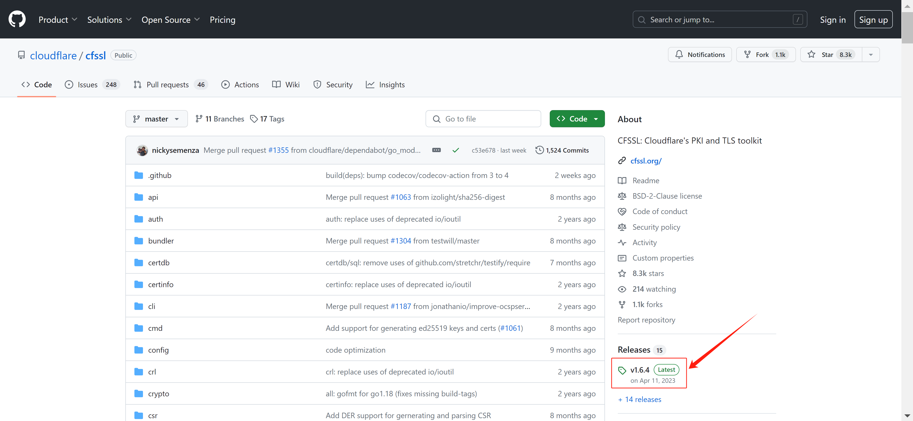

#### 5.2.1 设置cfssl

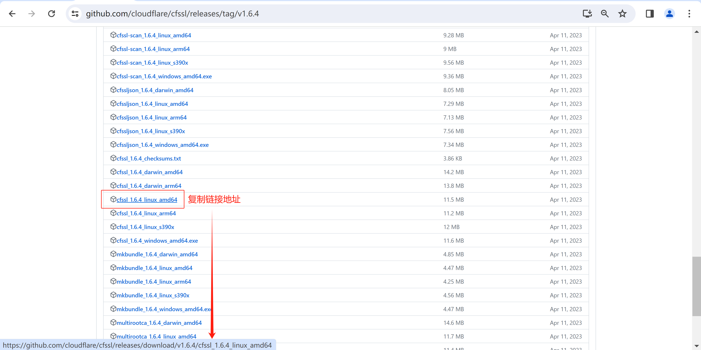

```sh
[root@k8s-master01 k8s-work]# wget https://github.com/cloudflare/cfssl/releases/download/v1.6.4/cfssl_1.6.4_linux_amd64
```

```sh
[root@k8s-master01 k8s-work]# ls
cfssl_1.6.4_linux_amd64

# 添加文件的可执行权限
[root@k8s-master01 k8s-work]# chmod +x cfssl_1.6.4_linux_amd64
[root@k8s-master01 k8s-work]# ls
cfssl_1.6.4_linux_amd64

# 移动到/usr/local/bin/目录下，并修改名字为cfssl
[root@k8s-master01 k8s-work]# mv cfssl_1.6.4_linux_amd64 /usr/local/bin/cfssl
```

#### 5.2.2 设置cfssljson

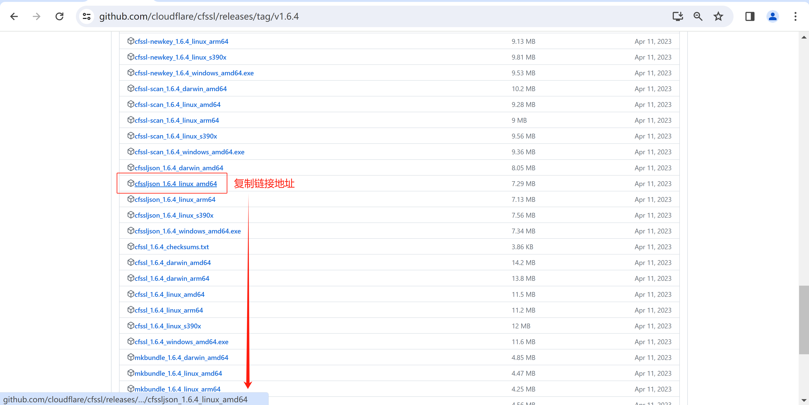

```sh
[root@k8s-master01 k8s-work]# wget https://github.com/cloudflare/cfssl/releases/download/v1.6.4/cfssljson_1.6.4_linux_amd64
```

```sh
[root@k8s-master01 k8s-work]# ls
cfssljson_1.6.4_linux_amd64

# 添加文件的可执行权限
[root@k8s-master01 k8s-work]# chmod +x cfssljson_1.6.4_linux_amd64
[root@k8s-master01 k8s-work]# ls
cfssljson_1.6.4_linux_amd64

# 移动到/usr/local/bin/目录下，并修改名字为cfssljson
[root@k8s-master01 k8s-work]# mv cfssljson_1.6.4_linux_amd64 /usr/local/bin/cfssljson
```

#### 5.2.3 设置cfssl-certinfo

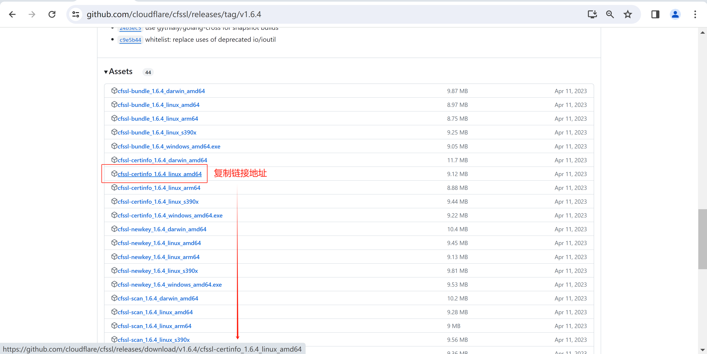

```sh
[root@k8s-master01 k8s-work]# wget https://github.com/cloudflare/cfssl/releases/download/v1.6.4/cfssl-certinfo_1.6.4_linux_amd64
```

```sh
[root@k8s-master01 k8s-work]# ls
cfssl-certinfo_1.6.4_linux_amd64

# 添加文件的可执行权限
[root@k8s-master01 k8s-work]# chmod +x cfssl-certinfo_1.6.4_linux_amd64
[root@k8s-master01 k8s-work]# ls
cfssl-certinfo_1.6.4_linux_amd64

# 移动到/usr/local/bin/目录下，并修改名字为cfssl-certinfo
[root@k8s-master01 k8s-work]# mv cfssl-certinfo_1.6.4_linux_amd64 /usr/local/bin/cfssl-certinfo
```

### 5.3 创建CA证书

#### 5.3.1 配置CA证书请求文件

```sh
[root@k8s-master01 k8s-work]# cat > ca-csr.json <<"EOF"
{
  "CN": "kubernetes",
  "key": {
      "algo": "rsa",
      "size": 2048
  },
  "names": [
    {
      "C": "CN",
      "ST": "Beijing",
      "L": "Beijing",
      "O": "kubemsb",
      "OU": "CN"
    }
  ],
  "ca": {
          "expiry": "87600h"
  }
}
EOF
```

```sh
[root@k8s-master01 k8s-work]# cat ca-csr.json
{
  "CN": "kubernetes",
  "key": {
      "algo": "rsa",
      "size": 2048
  },
  "names": [
    {
      "C": "CN",
      "ST": "Beijing",
      "L": "Beijing",
      "O": "kubemsb",
      "OU": "CN"
    }
  ],
  "ca": {
          "expiry": "87600h"
  }
}
```

#### 5.3.2 创建CA证书

```sh
[root@k8s-master01 k8s-work]# cfssl gencert -initca ca-csr.json | cfssljson -bare ca
```

```sh
输出内容如下：
2024/02/15 16:37:48 [INFO] generating a new CA key and certificate from CSR
2024/02/15 16:37:48 [INFO] generate received request
2024/02/15 16:37:48 [INFO] received CSR
2024/02/15 16:37:48 [INFO] generating key: rsa-2048
2024/02/15 16:37:48 [INFO] encoded CSR
2024/02/15 16:37:48 [INFO] signed certificate with serial number 226567738862383354813196293260870449385215336526
```

```sh
[root@k8s-master01 k8s-work]# ls
ca.csr  ca-csr.json  ca-key.pem  ca.pem
```

#### 5.3.3 CA证书策略

```sh
[root@k8s-master01 k8s-work]# cat > ca-config.json <<"EOF"
{
  "signing": {
      "default": {
          "expiry": "87600h"
        },
      "profiles": {
          "kubernetes": {
              "usages": [
                  "signing",
                  "key encipherment",
                  "server auth",
                  "client auth"
              ],
              "expiry": "87600h"
          }
      }
  }
}
EOF
```

```sh
[root@k8s-master01 k8s-work]# ls
ca-config.json  ca.csr  ca-csr.json  ca-key.pem  ca.pem
```

```sh
server auth 表示client可以对使用该ca对server提供的证书进行验证

client auth 表示server可以使用该ca对client提供的证书进行验证
```

### 5.4 创建etcd证书

#### 5.4.1 配置etcd请求文件

```sh
[root@k8s-master01 k8s-work]# cat > etcd-csr.json <<"EOF"
{
  "CN": "etcd",
  "hosts": [
    "127.0.0.1",
    "192.168.10.142",
    "192.168.10.143",
    "192.168.10.144"
  ],
  "key": {
    "algo": "rsa",
    "size": 2048
  },
  "names": [{
    "C": "CN",
    "ST": "Beijing",
    "L": "Beijing",
    "O": "kubemsb",
    "OU": "CN"
  }]
}
EOF
```

```sh
[root@k8s-master01 k8s-work]# ls
ca-config.json  ca.csr  ca-csr.json  ca-key.pem  ca.pem  etcd-csr.json
```

#### 5.4.2 生成etcd证书

```sh
[root@k8s-master01 k8s-work]# cfssl gencert -ca=ca.pem -ca-key=ca-key.pem -config=ca-config.json -profile=kubernetes etcd-csr.json | cfssljson  -bare etcd
```

```sh
输出：
2024/02/15 16:46:08 [INFO] generate received request
2024/02/15 16:46:08 [INFO] received CSR
2024/02/15 16:46:08 [INFO] generating key: rsa-2048
2024/02/15 16:46:09 [INFO] encoded CSR
2024/02/15 16:46:09 [INFO] signed certificate with serial number 638021028606448569303420226363269138546224775395
```

```sh
[root@k8s-master01 k8s-work]# ls
ca-config.json  ca.csr  ca-csr.json  ca-key.pem  ca.pem  etcd.csr  etcd-csr.json  etcd-key.pem  etcd.pem
```

### 5.5 etcd集群部署

#### 5.5.1 下载etcd软件包

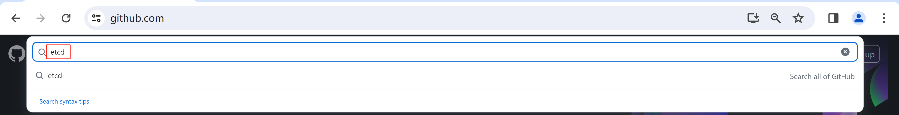

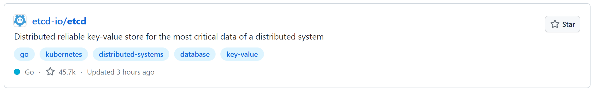

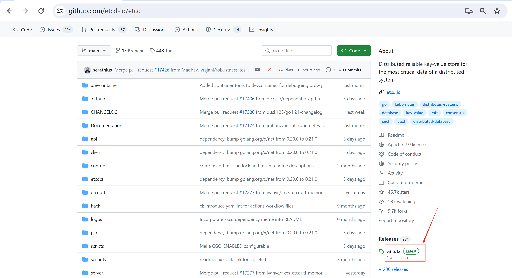

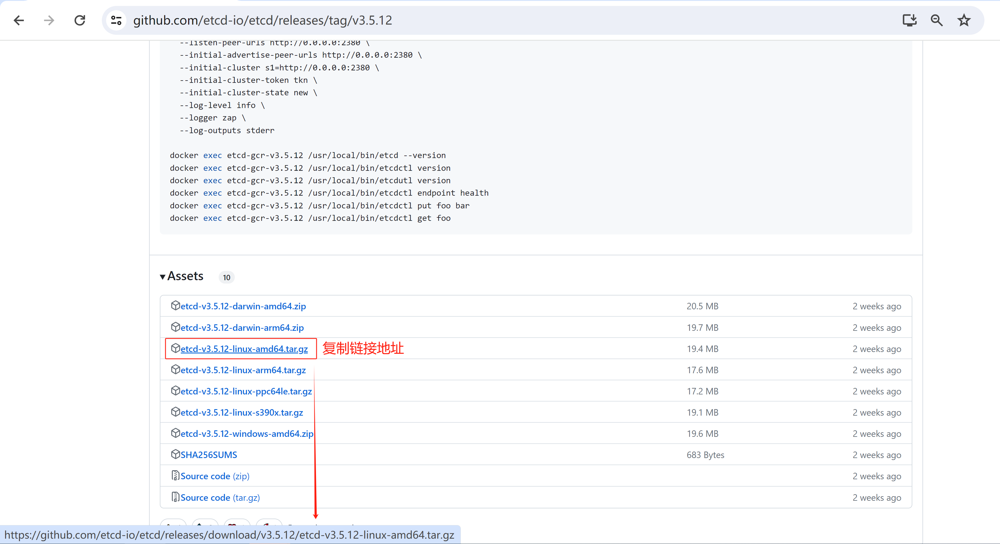

```sh
[root@k8s-master01 k8s-work]# wget https://github.com/etcd-io/etcd/releases/download/v3.5.12/etcd-v3.5.12-linux-amd64.tar.gz
```

```sh
[root@k8s-master01 k8s-work]# ls
etcd-v3.5.12-linux-amd64.tar.gz
```

#### 5.5.2 etcd软件分发

```sh
[root@k8s-master01 k8s-work]# tar xvf etcd-v3.5.12-linux-amd64.tar.gz
```

```sh
[root@k8s-master01 k8s-work]# ls etcd-v3.5.12-linux-amd64
Documentation  etcd  etcdctl  etcdutl  README-etcdctl.md  README-etcdutl.md  README.md  READMEv2-etcdctl.md

[root@k8s-master01 k8s-work]# cp -p etcd-v3.5.12-linux-amd64/etcd* /usr/local/bin/
```

```sh
[root@k8s-master01 k8s-work]# scp -p etcd-v3.5.12-linux-amd64/etcd* k8s-master02:/usr/local/bin/
```

```sh
[root@k8s-master01 k8s-work]# scp -p etcd-v3.5.12-linux-amd64/etcd* k8s-master03:/usr/local/bin/
```

#### 5.5.3 创建etcd配置文件

##### 5.5.3.1 创建etcd配置文件

> 所有master节点上都需要

k8s-master01

```sh
[root@k8s-master01 ~]# mkdir /etc/etcd
```

```sh
[root@k8s-master01 ~]# cat >  /etc/etcd/etcd.conf << "EOF"
#[Member]
ETCD_NAME="etcd1"
ETCD_DATA_DIR="/var/lib/etcd/default.etcd"
ETCD_LISTEN_PEER_URLS="https://192.168.10.142:2380"
ETCD_LISTEN_CLIENT_URLS="https://192.168.10.142:2379,http://127.0.0.1:2379"

#[Clustering]
ETCD_INITIAL_ADVERTISE_PEER_URLS="https://192.168.10.142:2380"
ETCD_ADVERTISE_CLIENT_URLS="https://192.168.10.142:2379"
ETCD_INITIAL_CLUSTER="etcd1=https://192.168.10.142:2380,etcd2=https://192.168.10.143:2380,etcd3=https://192.168.10.144:2380"
ETCD_INITIAL_CLUSTER_TOKEN="etcd-cluster"
ETCD_INITIAL_CLUSTER_STATE="new"
EOF
```

k8s-master02

```sh
[root@k8s-master02 ~]# mkdir /etc/etcd
```

```sh
[root@k8s-master02 ~]# cat >  /etc/etcd/etcd.conf <<"EOF"
#[Member]
ETCD_NAME="etcd2"
ETCD_DATA_DIR="/var/lib/etcd/default.etcd"
ETCD_LISTEN_PEER_URLS="https://192.168.10.143:2380"
ETCD_LISTEN_CLIENT_URLS="https://192.168.10.143:2379,http://127.0.0.1:2379"

#[Clustering]
ETCD_INITIAL_ADVERTISE_PEER_URLS="https://192.168.10.143:2380"
ETCD_ADVERTISE_CLIENT_URLS="https://192.168.10.143:2379"
ETCD_INITIAL_CLUSTER="etcd1=https://192.168.10.142:2380,etcd2=https://192.168.10.143:2380,etcd3=https://192.168.10.144:2380"
ETCD_INITIAL_CLUSTER_TOKEN="etcd-cluster"
ETCD_INITIAL_CLUSTER_STATE="new"
EOF
```

k8s-master03

```sh
[root@k83-master03 ~]# mkdir /etc/etcd
```

```sh
#[Member]
ETCD_NAME="etcd3"
ETCD_DATA_DIR="/var/lib/etcd/default.etcd"
ETCD_LISTEN_PEER_URLS="https://192.168.10.144:2380"
ETCD_LISTEN_CLIENT_URLS="https://192.168.10.144:2379,http://127.0.0.1:2379"

#[Clustering]
ETCD_INITIAL_ADVERTISE_PEER_URLS="https://192.168.10.144:2380"
ETCD_ADVERTISE_CLIENT_URLS="https://192.168.10.144:2379"
ETCD_INITIAL_CLUSTER="etcd1=https://192.168.10.142:2380,etcd2=https://192.168.10.143:2380,etcd3=https://192.168.10.144:2380"
ETCD_INITIAL_CLUSTER_TOKEN="etcd-cluster"
ETCD_INITIAL_CLUSTER_STATE="new"
EOF
```

```sh
说明：
ETCD_NAME：节点名称，集群中唯一
ETCD_DATA_DIR：数据目录
ETCD_LISTEN_PEER_URLS：集群通信监听地址
ETCD_LISTEN_CLIENT_URLS：客户端访问监听地址
ETCD_INITIAL_ADVERTISE_PEER_URLS：集群通告地址
ETCD_ADVERTISE_CLIENT_URLS：客户端通告地址
ETCD_INITIAL_CLUSTER：集群节点地址
ETCD_INITIAL_CLUSTER_TOKEN：集群Token
ETCD_INITIAL_CLUSTER_STATE：加入集群的当前状态，new是新集群，existing表示加入已有集群
```

##### 5.5.3.2 准备证书文件及创建etcd服务配置文件

> 所有etcd节点都需要配置
```sh
mkdir -p /etc/etcd/ssl
mkdir -p /var/lib/etcd/default.etcd
```

在k8s-master01上操作

准备证书文件
```sh
[root@k8s-master01 ~]# cd /data/k8s-work
[root@k8s-master01 k8s-work]# ls
ca-config.json  ca-csr.json  ca.pem    etcd-csr.json  etcd.pem                  etcd-v3.5.12-linux-amd64.tar.gz
ca.csr          ca-key.pem   etcd.csr  etcd-key.pem   etcd-v3.5.12-linux-amd64
[root@k8s-master01 k8s-work]# cp ca*.pem /etc/etcd/ssl
[root@k8s-master01 k8s-work]# cp etcd*.pem /etc/etcd/ssl
```

```sh
[root@k8s-master01 k8s-work]# scp ca*.pem k8s-master02:/etc/etcd/ssl
ca-key.pem                                                                                   100% 1679   476.1KB/s   00:00
ca.pem                                                                                       100% 1310   313.4KB/s   00:00
[root@k8s-master01 k8s-work]# scp etcd*.pem k8s-master02:/etc/etcd/ssl
etcd-key.pem                                                                                 100% 1679   755.0KB/s   00:00
etcd.pem                                                                                     100% 1436     1.6MB/s   00:00
```

```sh
[root@k8s-master01 k8s-work]# scp ca*.pem k8s-master03:/etc/etcd/ssl
ca-key.pem                                                                                   100% 1679   808.7KB/s   00:00
ca.pem                                                                                       100% 1310     1.8MB/s   00:00
[root@k8s-master01 k8s-work]# scp etcd*.pem k8s-master03:/etc/etcd/ssl
etcd-key.pem                                                                                 100% 1679     1.3MB/s   00:00
etcd.pem                                                                                     100% 1436     1.6MB/s   00:00
```

准备服务配置文件

```sh
[root@k8s-master01 ~]# cat > /etc/systemd/system/etcd.service <<"EOF"
[Unit]
Description=Etcd Server
After=network.target
After=network-online.target
Wants=network-online.target

[Service]
Type=notify
EnvironmentFile=-/etc/etcd/etcd.conf
WorkingDirectory=/var/lib/etcd/
ExecStart=/usr/local/bin/etcd \
  --cert-file=/etc/etcd/ssl/etcd.pem \
  --key-file=/etc/etcd/ssl/etcd-key.pem \
  --trusted-ca-file=/etc/etcd/ssl/ca.pem \
  --peer-cert-file=/etc/etcd/ssl/etcd.pem \
  --peer-key-file=/etc/etcd/ssl/etcd-key.pem \
  --peer-trusted-ca-file=/etc/etcd/ssl/ca.pem \
  --peer-client-cert-auth \
  --client-cert-auth
Restart=on-failure
RestartSec=5
LimitNOFILE=65536

[Install]
WantedBy=multi-user.target
EOF
```

```sh
[root@k8s-master02 ~]# cat > /etc/systemd/system/etcd.service <<"EOF"
[Unit]
Description=Etcd Server
After=network.target
After=network-online.target
Wants=network-online.target

[Service]
Type=notify
EnvironmentFile=-/etc/etcd/etcd.conf
WorkingDirectory=/var/lib/etcd/
ExecStart=/usr/local/bin/etcd \
  --cert-file=/etc/etcd/ssl/etcd.pem \
  --key-file=/etc/etcd/ssl/etcd-key.pem \
  --trusted-ca-file=/etc/etcd/ssl/ca.pem \
  --peer-cert-file=/etc/etcd/ssl/etcd.pem \
  --peer-key-file=/etc/etcd/ssl/etcd-key.pem \
  --peer-trusted-ca-file=/etc/etcd/ssl/ca.pem \
  --peer-client-cert-auth \
  --client-cert-auth
Restart=on-failure
RestartSec=5
LimitNOFILE=65536

[Install]
WantedBy=multi-user.target
EOF
```

```sh
[root@k8s-master03 ~]# cat > /etc/systemd/system/etcd.service <<"EOF"
[Unit]
Description=Etcd Server
After=network.target
After=network-online.target
Wants=network-online.target

[Service]
Type=notify
EnvironmentFile=-/etc/etcd/etcd.conf
WorkingDirectory=/var/lib/etcd/
ExecStart=/usr/local/bin/etcd \
  --cert-file=/etc/etcd/ssl/etcd.pem \
  --key-file=/etc/etcd/ssl/etcd-key.pem \
  --trusted-ca-file=/etc/etcd/ssl/ca.pem \
  --peer-cert-file=/etc/etcd/ssl/etcd.pem \
  --peer-key-file=/etc/etcd/ssl/etcd-key.pem \
  --peer-trusted-ca-file=/etc/etcd/ssl/ca.pem \
  --peer-client-cert-auth \
  --client-cert-auth
Restart=on-failure
RestartSec=5
LimitNOFILE=65536

[Install]
WantedBy=multi-user.target
EOF
```

#### 5.5.4 启动etcd集群

> 所有etcd节点全部操作
```
systemctl daemon-reload
systemctl enable --now etcd.service
systemctl status etcd
```

#### 5.5.5 验证etcd集群状态

```sh
[root@k8s-master01 ~]# etcdctl member list
a68a666f91b03162, started, etcd3, https://192.168.10.144:2380, https://192.168.10.144:2379, false
b131ed220be54449, started, etcd2, https://192.168.10.143:2380, https://192.168.10.143:2379, false
ca5baaa4a4adb577, started, etcd1, https://192.168.10.142:2380, https://192.168.10.142:2379, false
```

```sh
[root@k8s-master01 ~]# etcdctl member list -w table
+------------------+---------+-------+-----------------------------+-----------------------------+------------+
|        ID        | STATUS  | NAME  |         PEER ADDRS          |        CLIENT ADDRS         | IS LEARNER |
+------------------+---------+-------+-----------------------------+-----------------------------+------------+
| a68a666f91b03162 | started | etcd3 | https://192.168.10.144:2380 | https://192.168.10.144:2379 |      false |
| b131ed220be54449 | started | etcd2 | https://192.168.10.143:2380 | https://192.168.10.143:2379 |      false |
| ca5baaa4a4adb577 | started | etcd1 | https://192.168.10.142:2380 | https://192.168.10.142:2379 |      false |
+------------------+---------+-------+-----------------------------+-----------------------------+------------+
```

```sh
[root@k8s-master01 ~]# ETCDCTL_API=3 /usr/local/bin/etcdctl --write-out=table --cacert=/etc/etcd/ssl/ca.pem --cert=/etc/etcd/ssl/etcd.pem --key=/etc/etcd/ssl/etcd-key.pem --endpoints=https://192.168.10.142:2379,https://192.168.10.143:2379,https://192.168.10.144:2379 endpoint health
+-----------------------------+--------+-------------+-------+
|          ENDPOINT           | HEALTH |    TOOK     | ERROR |
+-----------------------------+--------+-------------+-------+
| https://192.168.10.142:2379 |   true | 13.541084ms |       |
| https://192.168.10.143:2379 |   true | 16.941395ms |       |
| https://192.168.10.144:2379 |   true | 17.166418ms |       |
+-----------------------------+--------+-------------+-------+
```

```sh
[root@k8s-master01 ~]# ETCDCTL_API=3 /usr/local/bin/etcdctl --write-out=table --cacert=/etc/etcd/ssl/ca.pem --cert=/etc/etcd/ssl/etcd.pem --key=/etc/etcd/ssl/etcd-key.pem --endpoints=https://192.168.10.142:2379,https://192.168.10.143:2379,https://192.168.10.144:2379 endpoint status
+-----------------------------+------------------+---------+---------+-----------+------------+-----------+------------+--------------------+--------+
|          ENDPOINT           |        ID        | VERSION | DB SIZE | IS LEADER | IS LEARNER | RAFT TERM | RAFT INDEX | RAFT APPLIED INDEX | ERRORS |
+-----------------------------+------------------+---------+---------+-----------+------------+-----------+------------+--------------------+--------+
| https://192.168.10.142:2379 | ca5baaa4a4adb577 |  3.5.12 |   25 kB |      true |      false |         2 |         12 |                 12 |        |
| https://192.168.10.143:2379 | b131ed220be54449 |  3.5.12 |   20 kB |     false |      false |         2 |         12 |                 12 |        |
| https://192.168.10.144:2379 | a68a666f91b03162 |  3.5.12 |   20 kB |     false |      false |         2 |         12 |                 12 |        |
+-----------------------------+------------------+---------+---------+-----------+------------+-----------+------------+--------------------+--------+
```

## 六、K8S集群部署

### 6.1 获取kubernetes源码

```sh
[root@k8s-master01 k8s-work]# pwd
/data/k8s-work

[root@k8s-master01 k8s-work]# wget --no-check-certificate https://dl.k8s.io/v1.28.0/kubernetes-server-linux-amd64.tar.gz
```

```sh
[root@k8s-master01 k8s-work]# ls
kubernetes-server-linux-amd64.tar.gz
```

### 6.2 kubernetes软件安装

#### 6.2.1 k8s-master01节点安装

```sh
[root@k8s-master01 k8s-work]# tar xf kubernetes-server-linux-amd64.tar.gz
```

```sh
[root@k8s-master01 k8s-work]# ls
kubernetes-server-linux-amd64.tar.gz
kubernetes
```

```sh
[root@k8s-master01 k8s-work]# ls kubernetes
addons  kubernetes-src.tar.gz  LICENSES  server
[root@k8s-master01 k8s-work]# ls kubernetes/server/
bin
[root@k8s-master01 k8s-work]# ls kubernetes/server/bin
apiextensions-apiserver    kube-controller-manager             kubectl.tar            kube-scheduler
kubeadm                    kube-controller-manager.docker_tag  kubelet                kube-scheduler.docker_tag
kube-aggregator            kube-controller-manager.tar         kube-log-runner        kube-scheduler.tar
kube-apiserver             kubectl                             kube-proxy             mounter
kube-apiserver.docker_tag  kubectl-convert                     kube-proxy.docker_tag
kube-apiserver.tar         kubectl.docker_tag                  kube-proxy.tar
```

```sh
[root@k8s-master01 k8s-work]# cd kubernetes/server/bin/
[root@k8s-master01 bin]# ls
apiextensions-apiserver    kube-controller-manager             kubectl.tar            kube-scheduler
kubeadm                    kube-controller-manager.docker_tag  kubelet                kube-scheduler.docker_tag
kube-aggregator            kube-controller-manager.tar         kube-log-runner        kube-scheduler.tar
kube-apiserver             kubectl                             kube-proxy             mounter
kube-apiserver.docker_tag  kubectl-convert                     kube-proxy.docker_tag
kube-apiserver.tar         kubectl.docker_tag                  kube-proxy.tar
```

```sh
[root@k8s-master01 bin]# cp kube-apiserver kube-controller-manager kube-scheduler kubectl /usr/local/bin/
```

#### 6.2.2 k8s-master02节点安装

```sh
[root@k8s-master01 bin]# scp kube-apiserver kube-controller-manager kube-scheduler kubectl k8s-master02:/usr/local/bin/
```

#### 6.2.3 k8s-master03节点安装

```sh
[root@k8s-master01 bin]# scp kube-apiserver kube-controller-manager kube-scheduler kubectl k8s-master03:/usr/local/bin/
```

#### 6.2.4 k8s-worker01及k8s-workder02节点安装

```sh
[root@k8s-master01 bin]# for i in k8s-worker01 k8s-worker02;do scp kubelet kube-proxy $i:/usr/local/bin/;done
```

### 6.3 创建目录

> 在所有k8s master节点上

```sh
mkdir -p /etc/kubernetes/        
mkdir -p /etc/kubernetes/ssl     
mkdir -p /var/log/kubernetes 
```

### 6.4 kube apiserver部署

#### 6.4.1 创建apiserver证书请求文件

```sh
[root@k8s-master01 k8s-work]# cat > kube-apiserver-csr.json << "EOF"
{
"CN": "kubernetes",
  "hosts": [
    "127.0.0.1",
    "192.168.10.142",
    "192.168.10.143",
    "192.168.10.144",
    "192.168.10.145",
    "192.168.10.146",
    "192.168.10.147",
    "192.168.10.148",
    "192.168.10.149",
    "192.168.10.150",
    "192.168.10.100",
    "10.96.0.1",
    "kubernetes",
    "kubernetes.default",
    "kubernetes.default.svc",
    "kubernetes.default.svc.cluster",
    "kubernetes.default.svc.cluster.local"
  ],
  "key": {
    "algo": "rsa",
    "size": 2048
  },
  "names": [
    {
      "C": "CN",
      "ST": "Beijing",
      "L": "Beijing",
      "O": "kubemsb",
      "OU": "CN"
    }
  ]
}
EOF
```

```sh
说明：
如果 hosts 字段不为空则需要指定授权使用该证书的 IP（含VIP） 或域名列表。
由于该证书被 集群使用，需要将节点的IP都填上，为了方便后期扩容可以多写几个预留的IP。
同时还需要填写 service 网络的首个IP(一般是 kube-apiserver 指定的 service-cluster-ip-range 网段的第一个IP，如 10.96.0.1)。
```

```sh
关于IPv6地址的说明：
如果需要把IPv6地址添加进去，可以直接在IPv4地址后直接添加即可，也可以添加常用域名。
```

```sh
也可以单独创建CA证书
```

```sh
[root@k8s-master01 k8s-work]# ls
kube-apiserver-csr.json
```

#### 6.4.2 生成apiserver证书

```sh
[root@k8s-master01 k8s-work]# cfssl gencert -ca=ca.pem -ca-key=ca-key.pem -config=ca-config.json -profile=kubernetes kube-apiserver-csr.json | cfssljson -bare kube-apiserver
```

```sh
输出内容如下：
2024/02/16 11:54:03 [INFO] generate received request
2024/02/16 11:54:03 [INFO] received CSR
2024/02/16 11:54:03 [INFO] generating key: rsa-2048
2024/02/16 11:54:03 [INFO] encoded CSR
2024/02/16 11:54:03 [INFO] signed certificate with serial number 667755172517036007016265348960805268542970737714
```

```sh
[root@k8s-master01 k8s-work]# ls
kube-apiserver-csr.json
kube-apiserver-key.pem
kube-apiserver.pem
kube-apiserver.csr
```

#### 6.4.3 创建TLS机制所需TOKEN

TLS Bootstraping：Master apiserver启用TLS认证后，Node节点kubelet和kube-proxy与kube-apiserver进行通信，必须使用CA签发的有效证书才可以，当Node节点很多时，这种客户端证书颁发需要大量工作，同样也会增加集群扩展复杂度。为了简化流程，Kubernetes引入了TLS bootstraping机制来自动颁发客户端证书，kubelet会以一个低权限用户自动向apiserver申请证书，kubelet的证书由apiserver动态签署。所以强烈建议在Node上使用这种方式，目前主要用于kubelet，kube-proxy还是由我们统一颁发一个证书。

```sh
[root@k8s-master01 k8s-work]# cat > token.csv << EOF
$(head -c 16 /dev/urandom | od -An -t x | tr -d ' '),kubelet-bootstrap,10001,"system:kubelet-bootstrap"
EOF
```

```sh
[root@k8s-master01 k8s-work]# ls
token.csv

[root@k8s-master01 k8s-work]# cat token.csv
9be09a8ffbf8329f9c253024f6ceec46,kubelet-bootstrap,10001,"system:kubelet-bootstrap"
```

#### 6.4.4 创建apiserver服务配置文件

```sh
[root@k8s-master01 k8s-work]# cat > /etc/kubernetes/kube-apiserver.conf << "EOF"
KUBE_APISERVER_OPTS="--enable-admission-plugins=NamespaceLifecycle,NodeRestriction,LimitRanger,ServiceAccount,DefaultStorageClass,ResourceQuota \
  --anonymous-auth=false \
  --bind-address=192.168.10.142 \
  --advertise-address=192.168.10.142 \
  --secure-port=6443 \
  --authorization-mode=Node,RBAC \
  --runtime-config=api/all=true \
  --enable-bootstrap-token-auth \
  --service-cluster-ip-range=10.96.0.0/16 \
  --token-auth-file=/etc/kubernetes/token.csv \
  --service-node-port-range=30000-32767 \
  --tls-cert-file=/etc/kubernetes/ssl/kube-apiserver.pem  \
  --tls-private-key-file=/etc/kubernetes/ssl/kube-apiserver-key.pem \
  --client-ca-file=/etc/kubernetes/ssl/ca.pem \
  --kubelet-client-certificate=/etc/kubernetes/ssl/kube-apiserver.pem \
  --kubelet-client-key=/etc/kubernetes/ssl/kube-apiserver-key.pem \
  --service-account-key-file=/etc/kubernetes/ssl/ca-key.pem \
  --service-account-signing-key-file=/etc/kubernetes/ssl/ca-key.pem  \
  --service-account-issuer=api \
  --etcd-cafile=/etc/etcd/ssl/ca.pem \
  --etcd-certfile=/etc/etcd/ssl/etcd.pem \
  --etcd-keyfile=/etc/etcd/ssl/etcd-key.pem \
  --etcd-servers=https://192.168.10.142:2379,https://192.168.10.143:2379,https://192.168.10.144:2379 \
  --allow-privileged=true \
  --apiserver-count=3 \
  --audit-log-maxage=30 \
  --audit-log-maxbackup=3 \
  --audit-log-maxsize=100 \
  --audit-log-path=/var/log/kube-apiserver-audit.log \
  --event-ttl=1h \
  --v=4"
EOF

？？？   --enable-swagger-ui=true \
```

```sh
[root@k8s-master01 k8s-work]# ls /etc/kubernetes/
kube-apiserver.conf  ssl
```

```sh
[root@k8s-master02 ~]# cat > /etc/kubernetes/kube-apiserver.conf << "EOF"
KUBE_APISERVER_OPTS="--enable-admission-plugins=NamespaceLifecycle,NodeRestriction,LimitRanger,ServiceAccount,DefaultStorageClass,ResourceQuota \
  --anonymous-auth=false \
  --bind-address=192.168.10.143 \
  --secure-port=6443 \
  --advertise-address=192.168.10.143 \
  --authorization-mode=Node,RBAC \
  --runtime-config=api/all=true \
  --enable-bootstrap-token-auth \
  --service-cluster-ip-range=10.96.0.0/16 \
  --token-auth-file=/etc/kubernetes/token.csv \
  --service-node-port-range=30000-32767 \
  --tls-cert-file=/etc/kubernetes/ssl/kube-apiserver.pem  \
  --tls-private-key-file=/etc/kubernetes/ssl/kube-apiserver-key.pem \
  --client-ca-file=/etc/kubernetes/ssl/ca.pem \
  --kubelet-client-certificate=/etc/kubernetes/ssl/kube-apiserver.pem \
  --kubelet-client-key=/etc/kubernetes/ssl/kube-apiserver-key.pem \
  --service-account-key-file=/etc/kubernetes/ssl/ca-key.pem \
  --service-account-signing-key-file=/etc/kubernetes/ssl/ca-key.pem  \
  --service-account-issuer=api \
  --etcd-cafile=/etc/etcd/ssl/ca.pem \
  --etcd-certfile=/etc/etcd/ssl/etcd.pem \
  --etcd-keyfile=/etc/etcd/ssl/etcd-key.pem \
  --etcd-servers=https://192.168.10.142:2379,https://192.168.10.143:2379,https://192.168.10.144:2379 \
  --allow-privileged=true \
  --apiserver-count=3 \
  --audit-log-maxage=30 \
  --audit-log-maxbackup=3 \
  --audit-log-maxsize=100 \
  --audit-log-path=/var/log/kube-apiserver-audit.log \
  --event-ttl=1h \
  --v=4"
EOF
```

```sh
[root@k8s-master03 ~]# cat > /etc/kubernetes/kube-apiserver.conf << "EOF"
KUBE_APISERVER_OPTS="--enable-admission-plugins=NamespaceLifecycle,NodeRestriction,LimitRanger,ServiceAccount,DefaultStorageClass,ResourceQuota \
  --anonymous-auth=false \
  --bind-address=192.168.10.144 \
  --secure-port=6443 \
  --advertise-address=192.168.10.144 \
  --authorization-mode=Node,RBAC \
  --runtime-config=api/all=true \
  --enable-bootstrap-token-auth \
  --service-cluster-ip-range=10.96.0.0/16 \
  --token-auth-file=/etc/kubernetes/token.csv \
  --service-node-port-range=30000-32767 \
  --tls-cert-file=/etc/kubernetes/ssl/kube-apiserver.pem  \
  --tls-private-key-file=/etc/kubernetes/ssl/kube-apiserver-key.pem \
  --client-ca-file=/etc/kubernetes/ssl/ca.pem \
  --kubelet-client-certificate=/etc/kubernetes/ssl/kube-apiserver.pem \
  --kubelet-client-key=/etc/kubernetes/ssl/kube-apiserver-key.pem \
  --service-account-key-file=/etc/kubernetes/ssl/ca-key.pem \
  --service-account-signing-key-file=/etc/kubernetes/ssl/ca-key.pem  \
  --service-account-issuer=api \
  --etcd-cafile=/etc/etcd/ssl/ca.pem \
  --etcd-certfile=/etc/etcd/ssl/etcd.pem \
  --etcd-keyfile=/etc/etcd/ssl/etcd-key.pem \
  --etcd-servers=https://192.168.10.142:2379,https://192.168.10.143:2379,https://192.168.10.144:2379 \
  --allow-privileged=true \
  --apiserver-count=3 \
  --audit-log-maxage=30 \
  --audit-log-maxbackup=3 \
  --audit-log-maxsize=100 \
  --audit-log-path=/var/log/kube-apiserver-audit.log \
  --event-ttl=1h \
  --v=4"
EOF
```

#### 6.4.5 创建apiserver服务管理配置文件

```sh
[root@k8s-master01 k8s-work]# cat > /etc/systemd/system/kube-apiserver.service << "EOF"
[Unit]
Description=Kubernetes API Server
Documentation=https://github.com/kubernetes/kubernetes
After=etcd.service
Wants=etcd.service

[Service]
EnvironmentFile=-/etc/kubernetes/kube-apiserver.conf
ExecStart=/usr/local/bin/kube-apiserver $KUBE_APISERVER_OPTS
Restart=on-failure
RestartSec=5
Type=notify
LimitNOFILE=65536

[Install]
WantedBy=multi-user.target
EOF
```

```sh
[root@k8s-master01 k8s-work]# ls /etc/systemd/system/
kube-apiserver.service
```

```sh
[root@k8s-master02 ~]# cat > /etc/systemd/system/kube-apiserver.service << "EOF"
[Unit]
Description=Kubernetes API Server
Documentation=https://github.com/kubernetes/kubernetes
After=etcd.service
Wants=etcd.service

[Service]
EnvironmentFile=-/etc/kubernetes/kube-apiserver.conf
ExecStart=/usr/local/bin/kube-apiserver $KUBE_APISERVER_OPTS
Restart=on-failure
RestartSec=5
Type=notify
LimitNOFILE=65536

[Install]
WantedBy=multi-user.target
EOF
```

```sh
[root@k8s-master03 ~]# cat > /etc/systemd/system/kube-apiserver.service << "EOF"
[Unit]
Description=Kubernetes API Server
Documentation=https://github.com/kubernetes/kubernetes
After=etcd.service
Wants=etcd.service

[Service]
EnvironmentFile=-/etc/kubernetes/kube-apiserver.conf
ExecStart=/usr/local/bin/kube-apiserver $KUBE_APISERVER_OPTS
Restart=on-failure
RestartSec=5
Type=notify
LimitNOFILE=65536

[Install]
WantedBy=multi-user.target
EOF
```

#### 6.4.6 分发证书及token文件到各master节点

```sh
[root@k8s-master01 k8s-work]# cp ca*.pem kube-apiserver*.pem /etc/kubernetes/ssl/
[root@k8s-master01 k8s-work]# cp token.csv /etc/kubernetes/
```

```sh
[root@k8s-master01 k8s-work]# scp ca*.pem kube-apiserver*.pem k8s-master02:/etc/kubernetes/ssl/
[root@k8s-master01 k8s-work]# scp token.csv k8s-master02:/etc/kubernetes/
```

```sh
[root@k8s-master01 k8s-work]# scp ca*.pem kube-apiserver*.pem k8s-master03:/etc/kubernetes/ssl/
[root@k8s-master01 k8s-work]# scp token.csv k8s-master03:/etc/kubernetes/
```

#### 6.4.7 启动apiserver服务

> 所有的master节点全部执行

```sh
systemctl daemon-reload
systemctl enable --now kube-apiserver
systemctl status kube-apiserver
```

#### 6.4.8 验证apiserver访问

```sh
[root@k8s-master01 k8s-work]# curl --insecure https://192.168.10.142:6443/
{
  "kind": "Status",
  "apiVersion": "v1",
  "metadata": {},
  "status": "Failure",
  "message": "Unauthorized",
  "reason": "Unauthorized",
  "code": 401
}[root@k8s-master01 k8s-work]# curl --insecure https://192.168.10.143:6443/
{
  "kind": "Status",
  "apiVersion": "v1",
  "metadata": {},
  "status": "Failure",
  "message": "Unauthorized",
  "reason": "Unauthorized",
  "code": 401
}[root@k8s-master01 k8s-work]# curl --insecure https://192.168.10.144:6443/
{
  "kind": "Status",
  "apiVersion": "v1",
  "metadata": {},
  "status": "Failure",
  "message": "Unauthorized",
  "reason": "Unauthorized",
  "code": 401
}[root@k8s-master01 k8s-work]# curl --insecure https://192.168.10.100:6443/
{
  "kind": "Status",
  "apiVersion": "v1",
  "metadata": {},
  "status": "Failure",
  "message": "Unauthorized",
  "reason": "Unauthorized",
  "code": 401
}[root@k8s-master01 k8s-work]#
```

### 6.5 kubectl部署

#### 6.5.1 创建kubectl证书请求文件

后续 kube-apiserver 使用 RBAC 对客户端(如 kubelet、kube-proxy、Pod)请求进行授权；
kube-apiserver 预定义了一些 RBAC 使用的 RoleBindings，如 cluster-admin 将 Group system:masters 与 Role cluster-admin 绑定，该 Role 授予了调用kube-apiserver 的所有 API的权限；

O指定该证书的 Group 为 system:masters，kubelet 使用该证书访问 kube-apiserver 时 ，由于证书被 CA 签名，所以认证通过，同时由于证书用户组为经过预授权的 system:masters，所以被授予访问所有 API 的权限；

```sh
[root@k8s-master01 k8s-work]# cat > admin-csr.json << "EOF"
{
  "CN": "admin",
  "hosts": [],
  "key": {
    "algo": "rsa",
    "size": 2048
  },
  "names": [
    {
      "C": "CN",
      "ST": "Beijing",
      "L": "Beijing",
      "O": "system:masters",             
      "OU": "system"
    }
  ]
}
EOF
```

```sh
[root@k8s-master01 k8s-work]# ls
admin-csr.json  ca-key.pem   
```

```sh
说明：
这个admin 证书，是将来生成管理员用的kubeconfig 配置文件用的，现在我们一般建议使用RBAC 来对kubernetes 进行角色权限控制， kubernetes 将证书中的CN 字段 作为User， O 字段作为 Group；
"O": "system:masters", 必须是system:masters，否则后面kubectl create clusterrolebinding报错。
```

#### 6.5.2 生成admin证书文件

```sh
[root@k8s-master01 k8s-work]# cfssl gencert -ca=ca.pem -ca-key=ca-key.pem -config=ca-config.json -profile=kubernetes admin-csr.json | cfssljson -bare admin
```

```sh
输出：
2024/02/17 09:33:55 [INFO] generate received request
2024/02/17 09:33:55 [INFO] received CSR
2024/02/17 09:33:55 [INFO] generating key: rsa-2048
2024/02/17 09:33:55 [INFO] encoded CSR
2024/02/17 09:33:55 [INFO] signed certificate with serial number 594380297939886134982740714088849555666323868656

下面的警告为：因为缺少主机字段，所以有警告。
2024/02/17 09:33:55 [WARNING] This certificate lacks a "hosts" field. This makes it unsuitable for
websites. For more information see the Baseline Requirements for the Issuance and Management
of Publicly-Trusted Certificates, v.1.1.6, from the CA/Browser Forum (https://cabforum.org);
specifically, section 10.2.3 ("Information Requirements").
```

```sh
[root@k8s-master01 k8s-work]# ls
admin.csr
admin-csr.json
admin-key.pem
admin.pem 
```

#### 6.5.3 复制admin证书到指定目录

```sh
[root@k8s-master01 k8s-work]# cp admin*.pem /etc/kubernetes/ssl/
[root@k8s-master01 k8s-work]# ls /etc/kubernetes/ssl/
admin-key.pem  admin.pem  ca-key.pem  ca.pem  kube-apiserver-key.pem  kube-apiserver.pem
```

#### 6.5.4 生成admin配置文件kubeconfig

kube.config 为 kubectl 的配置文件，包含访问 apiserver 的所有信息，如 apiserver 地址、CA 证书和自身使用的证书

```sh
[root@k8s-master01 k8s-work]# kubectl config set-cluster kubernetes --certificate-authority=ca.pem --embed-certs=true --server=https://192.168.10.100:6443 --kubeconfig=kube.config
```

```sh
[root@k8s-master01 k8s-work]# ls
kube.config
```

```sh
[root@k8s-master01 k8s-work]# cat kube.config
apiVersion: v1
clusters:
- cluster:
    certificate-authority-data: LS0tLS1CRUdJTiBDRVJUSUZJQ0FURS0tLS0tCk1JSURtakNDQW9LZ0F3SUJBZ0lVSjYrbUZzYzlMTXY3Z1RtdlZZUnhKdnRub0U0d0RRWUpLb1pJaHZjTkFRRUwKQlFBd1pURUxNQWtHQTFVRUJoTUNRMDR4RURBT0JnTlZCQWdUQjBKbGFXcHBibWN4RURBT0JnTlZCQWNUQjBKbAphV3BwYm1jeEVEQU9CZ05WQkFvVEIydDFZbVZ0YzJJeEN6QUpCZ05WQkFzVEFrTk9NUk13RVFZRFZRUURFd3ByCmRXSmxjbTVsZEdWek1CNFhEVEkwTURJeE5USXhNek13TUZvWERUTTBNREl4TWpJeE16TXdNRm93WlRFTE1Ba0cKQTFVRUJoTUNRMDR4RURBT0JnTlZCQWdUQjBKbGFXcHBibWN4RURBT0JnTlZCQWNUQjBKbGFXcHBibWN4RURBTwpCZ05WQkFvVEIydDFZbVZ0YzJJeEN6QUpCZ05WQkFzVEFrTk9NUk13RVFZRFZRUURFd3ByZFdKbGNtNWxkR1Z6Ck1JSUJJakFOQmdrcWhraUc5dzBCQVFFRkFBT0NBUThBTUlJQkNnS0NBUUVBbzU5YWR4a1I0MUxKb21YK0J0ejEKTDhQR1kyWmgxczgzakFBancxYk5jVlBzVzRycWplNm4zeHlRZTV4ZEQvTVg4T2t1SXArSnBTNHRpVUFhRHp0VAoxTjhFQlVEY01pNHBUc3M1MnFBSlBGZGFLUW1OaEx2V0p3SWdYS3hRODY5L29ld2lRdVhLeGlTeUtpTkU3eHhiCkp2eG9pL2RGSlMzMVhRbCtweGZ0aHhYbVF2TmVRd1FFU1hRODV3cHJUSjBacDVwZmhuMXVOcEIzUjJlbFJmQloKSDBNWWYxVlE5bUltWW43OVpBK1F4c096Qm5rWjd6bStuL1dRRlpuZmJIYjhxaTZpT0lmOTdlM0x1eHh6VmFsWgpwTm9nejJwTVJQUnorNmtwMXRtZGdhQ1hLSXpVa3RxVGVsNWlLaVRhaUhNOVN5elluc1gva0o1Q0hxbUhkdzdBCnBRSURBUUFCbzBJd1FEQU9CZ05WSFE4QkFmOEVCQU1DQVFZd0R3WURWUjBUQVFIL0JBVXdBd0VCL3pBZEJnTlYKSFE0RUZnUVVPWWtHQ1JQTU1RSTVMOHFoV3pvYndoTFh2YUF3RFFZSktvWklodmNOQVFFTEJRQURnZ0VCQUtCcQprdVh6RWZJK2JiemJ0aFlTV0JMeVdFRVByK1VPUHRMS1RKOTR5ZksxTFBEWS9zN0kxRUVIMEhhc2xzNUJXaHlmCkVPNE5DK2p5WnJXUzU3czJINzU3S00yWFZ6NmxHSmFSaENiMG5EVTY4cmg1VjNBRFN5Z0JFbDY3QW1JZm4rUlkKL1BsckZkWkVUQmtjaUkwMWRlVmJqQmRCd3cwS3o1MW0wNWxLL3dSZkFkOTRLYytCZjBocUJPSEZENExzWjlyNgpOcGd0dk9jdWEvaEQ4dndnNjVrdFNiNmszRmEvNStkMzZuemN3QU0rZXJicFByemVUREtSTE12cnhkaTVEMmdVCkI0ZHFtajBnYUgybkd2M3FPZXBXaGk3VFEwNFM3VzkvYVhSVktjQ28wUE9hZkRocTNDNEpoM1dlTXplQk1BckIKVnJNTHJ1L2VtblJWallLdnBUYz0KLS0tLS1FTkQgQ0VSVElGSUNBVEUtLS0tLQo=
    server: https://192.168.10.100:6443
  name: kubernetes
contexts: null
current-context: ""
kind: Config
preferences: {}
users: null
```

```sh
[root@k8s-master01 k8s-work]# kubectl config set-credentials admin --client-certificate=admin.pem --client-key=admin-key.pem --embed-certs=true --kubeconfig=kube.config
```

```sh
[root@k8s-master01 k8s-work]# cat kube.config
apiVersion: v1
clusters:
- cluster:
    certificate-authority-data: LS0tLS1CRUdJTiBDRVJUSUZJQ0FURS0tLS0tCk1JSURtakNDQW9LZ0F3SUJBZ0lVSjYrbUZzYzlMTXY3Z1RtdlZZUnhKdnRub0U0d0RRWUpLb1pJaHZjTkFRRUwKQlFBd1pURUxNQWtHQTFVRUJoTUNRMDR4RURBT0JnTlZCQWdUQjBKbGFXcHBibWN4RURBT0JnTlZCQWNUQjBKbAphV3BwYm1jeEVEQU9CZ05WQkFvVEIydDFZbVZ0YzJJeEN6QUpCZ05WQkFzVEFrTk9NUk13RVFZRFZRUURFd3ByCmRXSmxjbTVsZEdWek1CNFhEVEkwTURJeE5USXhNek13TUZvWERUTTBNREl4TWpJeE16TXdNRm93WlRFTE1Ba0cKQTFVRUJoTUNRMDR4RURBT0JnTlZCQWdUQjBKbGFXcHBibWN4RURBT0JnTlZCQWNUQjBKbGFXcHBibWN4RURBTwpCZ05WQkFvVEIydDFZbVZ0YzJJeEN6QUpCZ05WQkFzVEFrTk9NUk13RVFZRFZRUURFd3ByZFdKbGNtNWxkR1Z6Ck1JSUJJakFOQmdrcWhraUc5dzBCQVFFRkFBT0NBUThBTUlJQkNnS0NBUUVBbzU5YWR4a1I0MUxKb21YK0J0ejEKTDhQR1kyWmgxczgzakFBancxYk5jVlBzVzRycWplNm4zeHlRZTV4ZEQvTVg4T2t1SXArSnBTNHRpVUFhRHp0VAoxTjhFQlVEY01pNHBUc3M1MnFBSlBGZGFLUW1OaEx2V0p3SWdYS3hRODY5L29ld2lRdVhLeGlTeUtpTkU3eHhiCkp2eG9pL2RGSlMzMVhRbCtweGZ0aHhYbVF2TmVRd1FFU1hRODV3cHJUSjBacDVwZmhuMXVOcEIzUjJlbFJmQloKSDBNWWYxVlE5bUltWW43OVpBK1F4c096Qm5rWjd6bStuL1dRRlpuZmJIYjhxaTZpT0lmOTdlM0x1eHh6VmFsWgpwTm9nejJwTVJQUnorNmtwMXRtZGdhQ1hLSXpVa3RxVGVsNWlLaVRhaUhNOVN5elluc1gva0o1Q0hxbUhkdzdBCnBRSURBUUFCbzBJd1FEQU9CZ05WSFE4QkFmOEVCQU1DQVFZd0R3WURWUjBUQVFIL0JBVXdBd0VCL3pBZEJnTlYKSFE0RUZnUVVPWWtHQ1JQTU1RSTVMOHFoV3pvYndoTFh2YUF3RFFZSktvWklodmNOQVFFTEJRQURnZ0VCQUtCcQprdVh6RWZJK2JiemJ0aFlTV0JMeVdFRVByK1VPUHRMS1RKOTR5ZksxTFBEWS9zN0kxRUVIMEhhc2xzNUJXaHlmCkVPNE5DK2p5WnJXUzU3czJINzU3S00yWFZ6NmxHSmFSaENiMG5EVTY4cmg1VjNBRFN5Z0JFbDY3QW1JZm4rUlkKL1BsckZkWkVUQmtjaUkwMWRlVmJqQmRCd3cwS3o1MW0wNWxLL3dSZkFkOTRLYytCZjBocUJPSEZENExzWjlyNgpOcGd0dk9jdWEvaEQ4dndnNjVrdFNiNmszRmEvNStkMzZuemN3QU0rZXJicFByemVUREtSTE12cnhkaTVEMmdVCkI0ZHFtajBnYUgybkd2M3FPZXBXaGk3VFEwNFM3VzkvYVhSVktjQ28wUE9hZkRocTNDNEpoM1dlTXplQk1BckIKVnJNTHJ1L2VtblJWallLdnBUYz0KLS0tLS1FTkQgQ0VSVElGSUNBVEUtLS0tLQo=
    server: https://192.168.10.100:6443
  name: kubernetes
contexts: null
current-context: ""
kind: Config
preferences: {}
users:
- name: admin
  user:
    client-certificate-data: LS0tLS1CRUdJTiBDRVJUSUZJQ0FURS0tLS0tCk1JSUQzVENDQXNXZ0F3SUJBZ0lVYUJ6dk1pdkhXNnljMkhQUDhEa1I4ZVRIaS9Bd0RRWUpLb1pJaHZjTkFRRUwKQlFBd1pURUxNQWtHQTFVRUJoTUNRMDR4RURBT0JnTlZCQWdUQjBKbGFXcHBibWN4RURBT0JnTlZCQWNUQjBKbAphV3BwYm1jeEVEQU9CZ05WQkFvVEIydDFZbVZ0YzJJeEN6QUpCZ05WQkFzVEFrTk9NUk13RVFZRFZRUURFd3ByCmRXSmxjbTVsZEdWek1CNFhEVEkwTURJeE56RTBNamt3TUZvWERUTTBNREl4TkRFME1qa3dNRm93YXpFTE1Ba0cKQTFVRUJoTUNRMDR4RURBT0JnTlZCQWdUQjBKbGFXcHBibWN4RURBT0JnTlZCQWNUQjBKbGFXcHBibWN4RnpBVgpCZ05WQkFvVERuTjVjM1JsYlRwdFlYTjBaWEp6TVE4d0RRWURWUVFMRXdaemVYTjBaVzB4RGpBTUJnTlZCQU1UCkJXRmtiV2x1TUlJQklqQU5CZ2txaGtpRzl3MEJBUUVGQUFPQ0FROEFNSUlCQ2dLQ0FRRUF2OG9WNk1GU09scXAKNVlXM2RwcmFXbFovNmE2T0xkOTBPa3hoa0VPb2x6QklIcU9ZUzFOd1VIdloxZlFmWHk4eldmd1M4OEdleTEwRApXNENoTUpNUVplR3F4SnkyNnpPOVdJbFB5UTB5Zjl2TXRtR2pNMElta2cwQkFXK2ltc0R5Wk9IM1hlSlJlQXR4CnZXSlgreE1ILzdZcTlRUlBuc3VHejlmTzZRV1BCZThJZkovMnFOK3QvM04zVTF0TmtLTmhHOWwxL29nM29tZFoKYjNpcDZsS1dZYU84cW55QTI3Z1h0WHpUazY0a2F2aFNmVFgxWTNrWVRXZUlsUzhBbE5WZVk5RGlMeWQxaUhkaQpiZ1FUeEhxaFpOSVhCa2p2QmxlUWVFMExLcWJLN2JJTVRjcWMxdG1JajhZQ2pDVVFYVkhBRCtPWTk1SlMvdDBlCkYvUWFQQ1lUQXdJREFRQUJvMzh3ZlRBT0JnTlZIUThCQWY4RUJBTUNCYUF3SFFZRFZSMGxCQll3RkFZSUt3WUIKQlFVSEF3RUdDQ3NHQVFVRkJ3TUNNQXdHQTFVZEV3RUIvd1FDTUFBd0hRWURWUjBPQkJZRUZOLzJySUE4Z1RRWgpGekl3UGVpN3BKSjU4cWhpTUI4R0ExVWRJd1FZTUJhQUZEbUpCZ2tUekRFQ09TL0tvVnM2RzhJUzE3MmdNQTBHCkNTcUdTSWIzRFFFQkN3VUFBNElCQVFCRldNT09YVWdWOGMzd1NKSm1TeFBWcFlBQXdleUNZZEpKTUhERVl0Z3cKY0hDZW9RQ2FsSWV6Uk1RNi83NlhPaVdaNWozckY3R05qRWZGRXVLZGJtanQySUlsWEthbkp3eFo3ZkdtWGc4YQpGamljVlVKNlhPNGFyaVFLOEEzY2twNTh5VlVTTjUrT082Tm9CcHpyemFBOWdJTkxkOXBMUDZuUTBpbVlKa0FjCkppeHpkQ2hpTGNnd21mQ0orRFNRK2tianY4TXdCNFB1dDNQMEYwNGU5Y0Z4WHR3TVBhV2RqWUloVm1Nd0dNbVMKaDhwYlkyYXBWbVNWS3NUNitlRVBvcFl5cWVuYW1sbXNMWndiaXNza1NWQUJOeFVsVUYwMWtJZktXV3hDYXM0cApxQndzTmppOUpib0Y3ais1a2FlYlZVWUsvVHlybUdIaVIrZFBWYUJpb1dVZgotLS0tLUVORCBDRVJUSUZJQ0FURS0tLS0tCg==
    client-key-data: LS0tLS1CRUdJTiBSU0EgUFJJVkFURSBLRVktLS0tLQpNSUlFcEFJQkFBS0NBUUVBdjhvVjZNRlNPbHFwNVlXM2RwcmFXbFovNmE2T0xkOTBPa3hoa0VPb2x6QklIcU9ZClMxTndVSHZaMWZRZlh5OHpXZndTODhHZXkxMERXNENoTUpNUVplR3F4SnkyNnpPOVdJbFB5UTB5Zjl2TXRtR2oKTTBJbWtnMEJBVytpbXNEeVpPSDNYZUpSZUF0eHZXSlgreE1ILzdZcTlRUlBuc3VHejlmTzZRV1BCZThJZkovMgpxTit0LzNOM1UxdE5rS05oRzlsMS9vZzNvbWRaYjNpcDZsS1dZYU84cW55QTI3Z1h0WHpUazY0a2F2aFNmVFgxClkza1lUV2VJbFM4QWxOVmVZOURpTHlkMWlIZGliZ1FUeEhxaFpOSVhCa2p2QmxlUWVFMExLcWJLN2JJTVRjcWMKMXRtSWo4WUNqQ1VRWFZIQUQrT1k5NUpTL3QwZUYvUWFQQ1lUQXdJREFRQUJBb0lCQUJQOERjNWtIcHBnQ2lZVgppZWw4OTFYRWY2MnM5N25GK0FsL0hnZDNWV0R6c2dBblVkNC9nb3VRYkVHRUg2UytlVjVlQ3VlRmZITjZiTGdqCkxpaXVtbDNUWndUM3c0TzhyM1ZEVWFJRWt3ZUpzc29xWUdRZDk0RHVnL1ZQV2FWQWg4R0ZYazVWSCtJZlp5bXgKenJNbDU0WjR4LzhpQk4zcUhWRVpEc0Z2UjlqNVFkOVBqbXVTYjRYSC80eG53MlRFOU1SR0Evb2dwMHJQSUtXNQpJanZMa1dsbWZBS1lyd2RYV2Vnd2RXSlMrTEQ3cEgzMVBuVWxnbUx5S2hUQURjazQ3KytaMmZESTRRMkJsVGMwCnAzVFdFeUIyYzRJYUpTZE8vY3lObmZybXIya2Q4ZXhmNkJDcWlwUStKWWtsT2F6YTJ4ZExrbHFWOUw1c3RsazcKd2ZZQmE3RUNnWUVBd3pJdkVKcUFrOXF6NUF6VXR4bk00ZVJCQ05Eb2djQjJQZndFbWhTV0FHb2ZuTEtiQ29ZOQpVWjUySVFBOTkrK1VFVkIyNVhsM3hkNUxQcnVkTEpvYU5DZlArVFZZcnhrdjl0WUYzQm5CcDNGNTNLa0IwdlVHCkZSa1B5dFBQaW5XQnRPMStEc1NQMDliS3hCclBlRm5yRzJKd3JibDVDZHFCTk90TUJ5ZEtwL3NDZ1lFQSs0ZzkKeHJaSU1hUFBkUjdqM1FoWm0yWWdDN1RIYm1DT3pIaVk2ZE5ZVE1GdERndmZjN1Y0VSt2VHhMcFdLRFhOaWMxdApJeGZITy8vbklYRWdFbUtlVk5aUERQQ09IYWNtQjVYNVBvdlFMcXpGcDNnRTVjNkN2RzNyTEFCeUJsV1RKL0ZoCmZtcjF1YmRxMEdnb3NOMUJydFMxNi9MczQzWm13TTJDbEg4QnFwa0NnWUFLYmk0UnB3L2oxclh5STdWaUsyREYKV1ZzWVM0R0JIWFcwRGpsNHVremhyTW9QcDRPZFpscjBkNUU4WmpUcGdNWGF2di83ZHlndFRKbWN1bzNGaWw2SQpGdkNJRW8rd201bnlpTEU3ZDZ6ZmM3TGRWYktoUVRLWUFnVFVBOGw5VHBZbHd1TVBpdlZjam9lN1B1dUROTnJaClZjTkxwVE9Ra1RxQ1IyaUNvVmpkN1FLQmdRREZBbUg0ZVI4MG1peE1mTVJXaEVyQzk0dFQvK1ZRWTVxVk5rUDIKcU0xNVdPclUzS0hKSERMQjhHMHVvaEFIY0pTclFWWWc3V2ZrYTd3WnFtUkhZaXpISUJCTWYwR2dvaUdjUVhBMQorQVkzK0tUYlZacm9jQVpnRmV2ankvbURVcFZ1N0pYREVYMmpWN0QyeVE1TjhRNllKQXpWWUxFQU8rV2hUNVhlClAxZ0x5UUtCZ1FDNUluYTFxaGJ3MytvZ3ZCR2NGQUtwYWN3K0RLd0kvT21BN0pseWovVmMwNDhmS1pzdWFKcnUKZ2hiNTB3YTlvZTVQblovZmZicHBMdkZNTjBpekptc3F6a045RTdDSDVBL2JBREs1bGlmMlRMOExwcTFqNGpJMwphZDIwdTJoUXNsREFWcHYxbG4xRDBQM1hid3NaelVudUZjUXovdEh4TE9hSEZVL3FteHB5VVE9PQotLS0tLUVORCBSU0EgUFJJVkFURSBLRVktLS0tLQo=
```

```sh
[root@k8s-master01 k8s-work]# kubectl config set-context kubernetes --cluster=kubernetes --user=admin --kubeconfig=kube.config
```

```sh
[root@k8s-master01 k8s-work]# cat kube.config
apiVersion: v1
clusters:
- cluster:
    certificate-authority-data: LS0tLS1CRUdJTiBDRVJUSUZJQ0FURS0tLS0tCk1JSURtakNDQW9LZ0F3SUJBZ0lVSjYrbUZzYzlMTXY3Z1RtdlZZUnhKdnRub0U0d0RRWUpLb1pJaHZjTkFRRUwKQlFBd1pURUxNQWtHQTFVRUJoTUNRMDR4RURBT0JnTlZCQWdUQjBKbGFXcHBibWN4RURBT0JnTlZCQWNUQjBKbAphV3BwYm1jeEVEQU9CZ05WQkFvVEIydDFZbVZ0YzJJeEN6QUpCZ05WQkFzVEFrTk9NUk13RVFZRFZRUURFd3ByCmRXSmxjbTVsZEdWek1CNFhEVEkwTURJeE5USXhNek13TUZvWERUTTBNREl4TWpJeE16TXdNRm93WlRFTE1Ba0cKQTFVRUJoTUNRMDR4RURBT0JnTlZCQWdUQjBKbGFXcHBibWN4RURBT0JnTlZCQWNUQjBKbGFXcHBibWN4RURBTwpCZ05WQkFvVEIydDFZbVZ0YzJJeEN6QUpCZ05WQkFzVEFrTk9NUk13RVFZRFZRUURFd3ByZFdKbGNtNWxkR1Z6Ck1JSUJJakFOQmdrcWhraUc5dzBCQVFFRkFBT0NBUThBTUlJQkNnS0NBUUVBbzU5YWR4a1I0MUxKb21YK0J0ejEKTDhQR1kyWmgxczgzakFBancxYk5jVlBzVzRycWplNm4zeHlRZTV4ZEQvTVg4T2t1SXArSnBTNHRpVUFhRHp0VAoxTjhFQlVEY01pNHBUc3M1MnFBSlBGZGFLUW1OaEx2V0p3SWdYS3hRODY5L29ld2lRdVhLeGlTeUtpTkU3eHhiCkp2eG9pL2RGSlMzMVhRbCtweGZ0aHhYbVF2TmVRd1FFU1hRODV3cHJUSjBacDVwZmhuMXVOcEIzUjJlbFJmQloKSDBNWWYxVlE5bUltWW43OVpBK1F4c096Qm5rWjd6bStuL1dRRlpuZmJIYjhxaTZpT0lmOTdlM0x1eHh6VmFsWgpwTm9nejJwTVJQUnorNmtwMXRtZGdhQ1hLSXpVa3RxVGVsNWlLaVRhaUhNOVN5elluc1gva0o1Q0hxbUhkdzdBCnBRSURBUUFCbzBJd1FEQU9CZ05WSFE4QkFmOEVCQU1DQVFZd0R3WURWUjBUQVFIL0JBVXdBd0VCL3pBZEJnTlYKSFE0RUZnUVVPWWtHQ1JQTU1RSTVMOHFoV3pvYndoTFh2YUF3RFFZSktvWklodmNOQVFFTEJRQURnZ0VCQUtCcQprdVh6RWZJK2JiemJ0aFlTV0JMeVdFRVByK1VPUHRMS1RKOTR5ZksxTFBEWS9zN0kxRUVIMEhhc2xzNUJXaHlmCkVPNE5DK2p5WnJXUzU3czJINzU3S00yWFZ6NmxHSmFSaENiMG5EVTY4cmg1VjNBRFN5Z0JFbDY3QW1JZm4rUlkKL1BsckZkWkVUQmtjaUkwMWRlVmJqQmRCd3cwS3o1MW0wNWxLL3dSZkFkOTRLYytCZjBocUJPSEZENExzWjlyNgpOcGd0dk9jdWEvaEQ4dndnNjVrdFNiNmszRmEvNStkMzZuemN3QU0rZXJicFByemVUREtSTE12cnhkaTVEMmdVCkI0ZHFtajBnYUgybkd2M3FPZXBXaGk3VFEwNFM3VzkvYVhSVktjQ28wUE9hZkRocTNDNEpoM1dlTXplQk1BckIKVnJNTHJ1L2VtblJWallLdnBUYz0KLS0tLS1FTkQgQ0VSVElGSUNBVEUtLS0tLQo=
    server: https://192.168.10.100:6443
  name: kubernetes
contexts:
- context:
    cluster: kubernetes
    user: admin
  name: kubernetes
current-context: ""
kind: Config
preferences: {}
users:
- name: admin
  user:
    client-certificate-data: LS0tLS1CRUdJTiBDRVJUSUZJQ0FURS0tLS0tCk1JSUQzVENDQXNXZ0F3SUJBZ0lVYUJ6dk1pdkhXNnljMkhQUDhEa1I4ZVRIaS9Bd0RRWUpLb1pJaHZjTkFRRUwKQlFBd1pURUxNQWtHQTFVRUJoTUNRMDR4RURBT0JnTlZCQWdUQjBKbGFXcHBibWN4RURBT0JnTlZCQWNUQjBKbAphV3BwYm1jeEVEQU9CZ05WQkFvVEIydDFZbVZ0YzJJeEN6QUpCZ05WQkFzVEFrTk9NUk13RVFZRFZRUURFd3ByCmRXSmxjbTVsZEdWek1CNFhEVEkwTURJeE56RTBNamt3TUZvWERUTTBNREl4TkRFME1qa3dNRm93YXpFTE1Ba0cKQTFVRUJoTUNRMDR4RURBT0JnTlZCQWdUQjBKbGFXcHBibWN4RURBT0JnTlZCQWNUQjBKbGFXcHBibWN4RnpBVgpCZ05WQkFvVERuTjVjM1JsYlRwdFlYTjBaWEp6TVE4d0RRWURWUVFMRXdaemVYTjBaVzB4RGpBTUJnTlZCQU1UCkJXRmtiV2x1TUlJQklqQU5CZ2txaGtpRzl3MEJBUUVGQUFPQ0FROEFNSUlCQ2dLQ0FRRUF2OG9WNk1GU09scXAKNVlXM2RwcmFXbFovNmE2T0xkOTBPa3hoa0VPb2x6QklIcU9ZUzFOd1VIdloxZlFmWHk4eldmd1M4OEdleTEwRApXNENoTUpNUVplR3F4SnkyNnpPOVdJbFB5UTB5Zjl2TXRtR2pNMElta2cwQkFXK2ltc0R5Wk9IM1hlSlJlQXR4CnZXSlgreE1ILzdZcTlRUlBuc3VHejlmTzZRV1BCZThJZkovMnFOK3QvM04zVTF0TmtLTmhHOWwxL29nM29tZFoKYjNpcDZsS1dZYU84cW55QTI3Z1h0WHpUazY0a2F2aFNmVFgxWTNrWVRXZUlsUzhBbE5WZVk5RGlMeWQxaUhkaQpiZ1FUeEhxaFpOSVhCa2p2QmxlUWVFMExLcWJLN2JJTVRjcWMxdG1JajhZQ2pDVVFYVkhBRCtPWTk1SlMvdDBlCkYvUWFQQ1lUQXdJREFRQUJvMzh3ZlRBT0JnTlZIUThCQWY4RUJBTUNCYUF3SFFZRFZSMGxCQll3RkFZSUt3WUIKQlFVSEF3RUdDQ3NHQVFVRkJ3TUNNQXdHQTFVZEV3RUIvd1FDTUFBd0hRWURWUjBPQkJZRUZOLzJySUE4Z1RRWgpGekl3UGVpN3BKSjU4cWhpTUI4R0ExVWRJd1FZTUJhQUZEbUpCZ2tUekRFQ09TL0tvVnM2RzhJUzE3MmdNQTBHCkNTcUdTSWIzRFFFQkN3VUFBNElCQVFCRldNT09YVWdWOGMzd1NKSm1TeFBWcFlBQXdleUNZZEpKTUhERVl0Z3cKY0hDZW9RQ2FsSWV6Uk1RNi83NlhPaVdaNWozckY3R05qRWZGRXVLZGJtanQySUlsWEthbkp3eFo3ZkdtWGc4YQpGamljVlVKNlhPNGFyaVFLOEEzY2twNTh5VlVTTjUrT082Tm9CcHpyemFBOWdJTkxkOXBMUDZuUTBpbVlKa0FjCkppeHpkQ2hpTGNnd21mQ0orRFNRK2tianY4TXdCNFB1dDNQMEYwNGU5Y0Z4WHR3TVBhV2RqWUloVm1Nd0dNbVMKaDhwYlkyYXBWbVNWS3NUNitlRVBvcFl5cWVuYW1sbXNMWndiaXNza1NWQUJOeFVsVUYwMWtJZktXV3hDYXM0cApxQndzTmppOUpib0Y3ais1a2FlYlZVWUsvVHlybUdIaVIrZFBWYUJpb1dVZgotLS0tLUVORCBDRVJUSUZJQ0FURS0tLS0tCg==
    client-key-data: LS0tLS1CRUdJTiBSU0EgUFJJVkFURSBLRVktLS0tLQpNSUlFcEFJQkFBS0NBUUVBdjhvVjZNRlNPbHFwNVlXM2RwcmFXbFovNmE2T0xkOTBPa3hoa0VPb2x6QklIcU9ZClMxTndVSHZaMWZRZlh5OHpXZndTODhHZXkxMERXNENoTUpNUVplR3F4SnkyNnpPOVdJbFB5UTB5Zjl2TXRtR2oKTTBJbWtnMEJBVytpbXNEeVpPSDNYZUpSZUF0eHZXSlgreE1ILzdZcTlRUlBuc3VHejlmTzZRV1BCZThJZkovMgpxTit0LzNOM1UxdE5rS05oRzlsMS9vZzNvbWRaYjNpcDZsS1dZYU84cW55QTI3Z1h0WHpUazY0a2F2aFNmVFgxClkza1lUV2VJbFM4QWxOVmVZOURpTHlkMWlIZGliZ1FUeEhxaFpOSVhCa2p2QmxlUWVFMExLcWJLN2JJTVRjcWMKMXRtSWo4WUNqQ1VRWFZIQUQrT1k5NUpTL3QwZUYvUWFQQ1lUQXdJREFRQUJBb0lCQUJQOERjNWtIcHBnQ2lZVgppZWw4OTFYRWY2MnM5N25GK0FsL0hnZDNWV0R6c2dBblVkNC9nb3VRYkVHRUg2UytlVjVlQ3VlRmZITjZiTGdqCkxpaXVtbDNUWndUM3c0TzhyM1ZEVWFJRWt3ZUpzc29xWUdRZDk0RHVnL1ZQV2FWQWg4R0ZYazVWSCtJZlp5bXgKenJNbDU0WjR4LzhpQk4zcUhWRVpEc0Z2UjlqNVFkOVBqbXVTYjRYSC80eG53MlRFOU1SR0Evb2dwMHJQSUtXNQpJanZMa1dsbWZBS1lyd2RYV2Vnd2RXSlMrTEQ3cEgzMVBuVWxnbUx5S2hUQURjazQ3KytaMmZESTRRMkJsVGMwCnAzVFdFeUIyYzRJYUpTZE8vY3lObmZybXIya2Q4ZXhmNkJDcWlwUStKWWtsT2F6YTJ4ZExrbHFWOUw1c3RsazcKd2ZZQmE3RUNnWUVBd3pJdkVKcUFrOXF6NUF6VXR4bk00ZVJCQ05Eb2djQjJQZndFbWhTV0FHb2ZuTEtiQ29ZOQpVWjUySVFBOTkrK1VFVkIyNVhsM3hkNUxQcnVkTEpvYU5DZlArVFZZcnhrdjl0WUYzQm5CcDNGNTNLa0IwdlVHCkZSa1B5dFBQaW5XQnRPMStEc1NQMDliS3hCclBlRm5yRzJKd3JibDVDZHFCTk90TUJ5ZEtwL3NDZ1lFQSs0ZzkKeHJaSU1hUFBkUjdqM1FoWm0yWWdDN1RIYm1DT3pIaVk2ZE5ZVE1GdERndmZjN1Y0VSt2VHhMcFdLRFhOaWMxdApJeGZITy8vbklYRWdFbUtlVk5aUERQQ09IYWNtQjVYNVBvdlFMcXpGcDNnRTVjNkN2RzNyTEFCeUJsV1RKL0ZoCmZtcjF1YmRxMEdnb3NOMUJydFMxNi9MczQzWm13TTJDbEg4QnFwa0NnWUFLYmk0UnB3L2oxclh5STdWaUsyREYKV1ZzWVM0R0JIWFcwRGpsNHVremhyTW9QcDRPZFpscjBkNUU4WmpUcGdNWGF2di83ZHlndFRKbWN1bzNGaWw2SQpGdkNJRW8rd201bnlpTEU3ZDZ6ZmM3TGRWYktoUVRLWUFnVFVBOGw5VHBZbHd1TVBpdlZjam9lN1B1dUROTnJaClZjTkxwVE9Ra1RxQ1IyaUNvVmpkN1FLQmdRREZBbUg0ZVI4MG1peE1mTVJXaEVyQzk0dFQvK1ZRWTVxVk5rUDIKcU0xNVdPclUzS0hKSERMQjhHMHVvaEFIY0pTclFWWWc3V2ZrYTd3WnFtUkhZaXpISUJCTWYwR2dvaUdjUVhBMQorQVkzK0tUYlZacm9jQVpnRmV2ankvbURVcFZ1N0pYREVYMmpWN0QyeVE1TjhRNllKQXpWWUxFQU8rV2hUNVhlClAxZ0x5UUtCZ1FDNUluYTFxaGJ3MytvZ3ZCR2NGQUtwYWN3K0RLd0kvT21BN0pseWovVmMwNDhmS1pzdWFKcnUKZ2hiNTB3YTlvZTVQblovZmZicHBMdkZNTjBpekptc3F6a045RTdDSDVBL2JBREs1bGlmMlRMOExwcTFqNGpJMwphZDIwdTJoUXNsREFWcHYxbG4xRDBQM1hid3NaelVudUZjUXovdEh4TE9hSEZVL3FteHB5VVE9PQotLS0tLUVORCBSU0EgUFJJVkFURSBLRVktLS0tLQo=
```

```sh
[root@k8s-master01 k8s-work]# kubectl config use-context kubernetes --kubeconfig=kube.config
```

```sh
[root@k8s-master01 k8s-work]# cat kube.config
apiVersion: v1
clusters:
- cluster:
    certificate-authority-data: LS0tLS1CRUdJTiBDRVJUSUZJQ0FURS0tLS0tCk1JSURtakNDQW9LZ0F3SUJBZ0lVSjYrbUZzYzlMTXY3Z1RtdlZZUnhKdnRub0U0d0RRWUpLb1pJaHZjTkFRRUwKQlFBd1pURUxNQWtHQTFVRUJoTUNRMDR4RURBT0JnTlZCQWdUQjBKbGFXcHBibWN4RURBT0JnTlZCQWNUQjBKbAphV3BwYm1jeEVEQU9CZ05WQkFvVEIydDFZbVZ0YzJJeEN6QUpCZ05WQkFzVEFrTk9NUk13RVFZRFZRUURFd3ByCmRXSmxjbTVsZEdWek1CNFhEVEkwTURJeE5USXhNek13TUZvWERUTTBNREl4TWpJeE16TXdNRm93WlRFTE1Ba0cKQTFVRUJoTUNRMDR4RURBT0JnTlZCQWdUQjBKbGFXcHBibWN4RURBT0JnTlZCQWNUQjBKbGFXcHBibWN4RURBTwpCZ05WQkFvVEIydDFZbVZ0YzJJeEN6QUpCZ05WQkFzVEFrTk9NUk13RVFZRFZRUURFd3ByZFdKbGNtNWxkR1Z6Ck1JSUJJakFOQmdrcWhraUc5dzBCQVFFRkFBT0NBUThBTUlJQkNnS0NBUUVBbzU5YWR4a1I0MUxKb21YK0J0ejEKTDhQR1kyWmgxczgzakFBancxYk5jVlBzVzRycWplNm4zeHlRZTV4ZEQvTVg4T2t1SXArSnBTNHRpVUFhRHp0VAoxTjhFQlVEY01pNHBUc3M1MnFBSlBGZGFLUW1OaEx2V0p3SWdYS3hRODY5L29ld2lRdVhLeGlTeUtpTkU3eHhiCkp2eG9pL2RGSlMzMVhRbCtweGZ0aHhYbVF2TmVRd1FFU1hRODV3cHJUSjBacDVwZmhuMXVOcEIzUjJlbFJmQloKSDBNWWYxVlE5bUltWW43OVpBK1F4c096Qm5rWjd6bStuL1dRRlpuZmJIYjhxaTZpT0lmOTdlM0x1eHh6VmFsWgpwTm9nejJwTVJQUnorNmtwMXRtZGdhQ1hLSXpVa3RxVGVsNWlLaVRhaUhNOVN5elluc1gva0o1Q0hxbUhkdzdBCnBRSURBUUFCbzBJd1FEQU9CZ05WSFE4QkFmOEVCQU1DQVFZd0R3WURWUjBUQVFIL0JBVXdBd0VCL3pBZEJnTlYKSFE0RUZnUVVPWWtHQ1JQTU1RSTVMOHFoV3pvYndoTFh2YUF3RFFZSktvWklodmNOQVFFTEJRQURnZ0VCQUtCcQprdVh6RWZJK2JiemJ0aFlTV0JMeVdFRVByK1VPUHRMS1RKOTR5ZksxTFBEWS9zN0kxRUVIMEhhc2xzNUJXaHlmCkVPNE5DK2p5WnJXUzU3czJINzU3S00yWFZ6NmxHSmFSaENiMG5EVTY4cmg1VjNBRFN5Z0JFbDY3QW1JZm4rUlkKL1BsckZkWkVUQmtjaUkwMWRlVmJqQmRCd3cwS3o1MW0wNWxLL3dSZkFkOTRLYytCZjBocUJPSEZENExzWjlyNgpOcGd0dk9jdWEvaEQ4dndnNjVrdFNiNmszRmEvNStkMzZuemN3QU0rZXJicFByemVUREtSTE12cnhkaTVEMmdVCkI0ZHFtajBnYUgybkd2M3FPZXBXaGk3VFEwNFM3VzkvYVhSVktjQ28wUE9hZkRocTNDNEpoM1dlTXplQk1BckIKVnJNTHJ1L2VtblJWallLdnBUYz0KLS0tLS1FTkQgQ0VSVElGSUNBVEUtLS0tLQo=
    server: https://192.168.10.100:6443
  name: kubernetes
contexts:
- context:
    cluster: kubernetes
    user: admin
  name: kubernetes
current-context: kubernetes
kind: Config
preferences: {}
users:
- name: admin
  user:
    client-certificate-data: LS0tLS1CRUdJTiBDRVJUSUZJQ0FURS0tLS0tCk1JSUQzVENDQXNXZ0F3SUJBZ0lVYUJ6dk1pdkhXNnljMkhQUDhEa1I4ZVRIaS9Bd0RRWUpLb1pJaHZjTkFRRUwKQlFBd1pURUxNQWtHQTFVRUJoTUNRMDR4RURBT0JnTlZCQWdUQjBKbGFXcHBibWN4RURBT0JnTlZCQWNUQjBKbAphV3BwYm1jeEVEQU9CZ05WQkFvVEIydDFZbVZ0YzJJeEN6QUpCZ05WQkFzVEFrTk9NUk13RVFZRFZRUURFd3ByCmRXSmxjbTVsZEdWek1CNFhEVEkwTURJeE56RTBNamt3TUZvWERUTTBNREl4TkRFME1qa3dNRm93YXpFTE1Ba0cKQTFVRUJoTUNRMDR4RURBT0JnTlZCQWdUQjBKbGFXcHBibWN4RURBT0JnTlZCQWNUQjBKbGFXcHBibWN4RnpBVgpCZ05WQkFvVERuTjVjM1JsYlRwdFlYTjBaWEp6TVE4d0RRWURWUVFMRXdaemVYTjBaVzB4RGpBTUJnTlZCQU1UCkJXRmtiV2x1TUlJQklqQU5CZ2txaGtpRzl3MEJBUUVGQUFPQ0FROEFNSUlCQ2dLQ0FRRUF2OG9WNk1GU09scXAKNVlXM2RwcmFXbFovNmE2T0xkOTBPa3hoa0VPb2x6QklIcU9ZUzFOd1VIdloxZlFmWHk4eldmd1M4OEdleTEwRApXNENoTUpNUVplR3F4SnkyNnpPOVdJbFB5UTB5Zjl2TXRtR2pNMElta2cwQkFXK2ltc0R5Wk9IM1hlSlJlQXR4CnZXSlgreE1ILzdZcTlRUlBuc3VHejlmTzZRV1BCZThJZkovMnFOK3QvM04zVTF0TmtLTmhHOWwxL29nM29tZFoKYjNpcDZsS1dZYU84cW55QTI3Z1h0WHpUazY0a2F2aFNmVFgxWTNrWVRXZUlsUzhBbE5WZVk5RGlMeWQxaUhkaQpiZ1FUeEhxaFpOSVhCa2p2QmxlUWVFMExLcWJLN2JJTVRjcWMxdG1JajhZQ2pDVVFYVkhBRCtPWTk1SlMvdDBlCkYvUWFQQ1lUQXdJREFRQUJvMzh3ZlRBT0JnTlZIUThCQWY4RUJBTUNCYUF3SFFZRFZSMGxCQll3RkFZSUt3WUIKQlFVSEF3RUdDQ3NHQVFVRkJ3TUNNQXdHQTFVZEV3RUIvd1FDTUFBd0hRWURWUjBPQkJZRUZOLzJySUE4Z1RRWgpGekl3UGVpN3BKSjU4cWhpTUI4R0ExVWRJd1FZTUJhQUZEbUpCZ2tUekRFQ09TL0tvVnM2RzhJUzE3MmdNQTBHCkNTcUdTSWIzRFFFQkN3VUFBNElCQVFCRldNT09YVWdWOGMzd1NKSm1TeFBWcFlBQXdleUNZZEpKTUhERVl0Z3cKY0hDZW9RQ2FsSWV6Uk1RNi83NlhPaVdaNWozckY3R05qRWZGRXVLZGJtanQySUlsWEthbkp3eFo3ZkdtWGc4YQpGamljVlVKNlhPNGFyaVFLOEEzY2twNTh5VlVTTjUrT082Tm9CcHpyemFBOWdJTkxkOXBMUDZuUTBpbVlKa0FjCkppeHpkQ2hpTGNnd21mQ0orRFNRK2tianY4TXdCNFB1dDNQMEYwNGU5Y0Z4WHR3TVBhV2RqWUloVm1Nd0dNbVMKaDhwYlkyYXBWbVNWS3NUNitlRVBvcFl5cWVuYW1sbXNMWndiaXNza1NWQUJOeFVsVUYwMWtJZktXV3hDYXM0cApxQndzTmppOUpib0Y3ais1a2FlYlZVWUsvVHlybUdIaVIrZFBWYUJpb1dVZgotLS0tLUVORCBDRVJUSUZJQ0FURS0tLS0tCg==
    client-key-data: LS0tLS1CRUdJTiBSU0EgUFJJVkFURSBLRVktLS0tLQpNSUlFcEFJQkFBS0NBUUVBdjhvVjZNRlNPbHFwNVlXM2RwcmFXbFovNmE2T0xkOTBPa3hoa0VPb2x6QklIcU9ZClMxTndVSHZaMWZRZlh5OHpXZndTODhHZXkxMERXNENoTUpNUVplR3F4SnkyNnpPOVdJbFB5UTB5Zjl2TXRtR2oKTTBJbWtnMEJBVytpbXNEeVpPSDNYZUpSZUF0eHZXSlgreE1ILzdZcTlRUlBuc3VHejlmTzZRV1BCZThJZkovMgpxTit0LzNOM1UxdE5rS05oRzlsMS9vZzNvbWRaYjNpcDZsS1dZYU84cW55QTI3Z1h0WHpUazY0a2F2aFNmVFgxClkza1lUV2VJbFM4QWxOVmVZOURpTHlkMWlIZGliZ1FUeEhxaFpOSVhCa2p2QmxlUWVFMExLcWJLN2JJTVRjcWMKMXRtSWo4WUNqQ1VRWFZIQUQrT1k5NUpTL3QwZUYvUWFQQ1lUQXdJREFRQUJBb0lCQUJQOERjNWtIcHBnQ2lZVgppZWw4OTFYRWY2MnM5N25GK0FsL0hnZDNWV0R6c2dBblVkNC9nb3VRYkVHRUg2UytlVjVlQ3VlRmZITjZiTGdqCkxpaXVtbDNUWndUM3c0TzhyM1ZEVWFJRWt3ZUpzc29xWUdRZDk0RHVnL1ZQV2FWQWg4R0ZYazVWSCtJZlp5bXgKenJNbDU0WjR4LzhpQk4zcUhWRVpEc0Z2UjlqNVFkOVBqbXVTYjRYSC80eG53MlRFOU1SR0Evb2dwMHJQSUtXNQpJanZMa1dsbWZBS1lyd2RYV2Vnd2RXSlMrTEQ3cEgzMVBuVWxnbUx5S2hUQURjazQ3KytaMmZESTRRMkJsVGMwCnAzVFdFeUIyYzRJYUpTZE8vY3lObmZybXIya2Q4ZXhmNkJDcWlwUStKWWtsT2F6YTJ4ZExrbHFWOUw1c3RsazcKd2ZZQmE3RUNnWUVBd3pJdkVKcUFrOXF6NUF6VXR4bk00ZVJCQ05Eb2djQjJQZndFbWhTV0FHb2ZuTEtiQ29ZOQpVWjUySVFBOTkrK1VFVkIyNVhsM3hkNUxQcnVkTEpvYU5DZlArVFZZcnhrdjl0WUYzQm5CcDNGNTNLa0IwdlVHCkZSa1B5dFBQaW5XQnRPMStEc1NQMDliS3hCclBlRm5yRzJKd3JibDVDZHFCTk90TUJ5ZEtwL3NDZ1lFQSs0ZzkKeHJaSU1hUFBkUjdqM1FoWm0yWWdDN1RIYm1DT3pIaVk2ZE5ZVE1GdERndmZjN1Y0VSt2VHhMcFdLRFhOaWMxdApJeGZITy8vbklYRWdFbUtlVk5aUERQQ09IYWNtQjVYNVBvdlFMcXpGcDNnRTVjNkN2RzNyTEFCeUJsV1RKL0ZoCmZtcjF1YmRxMEdnb3NOMUJydFMxNi9MczQzWm13TTJDbEg4QnFwa0NnWUFLYmk0UnB3L2oxclh5STdWaUsyREYKV1ZzWVM0R0JIWFcwRGpsNHVremhyTW9QcDRPZFpscjBkNUU4WmpUcGdNWGF2di83ZHlndFRKbWN1bzNGaWw2SQpGdkNJRW8rd201bnlpTEU3ZDZ6ZmM3TGRWYktoUVRLWUFnVFVBOGw5VHBZbHd1TVBpdlZjam9lN1B1dUROTnJaClZjTkxwVE9Ra1RxQ1IyaUNvVmpkN1FLQmdRREZBbUg0ZVI4MG1peE1mTVJXaEVyQzk0dFQvK1ZRWTVxVk5rUDIKcU0xNVdPclUzS0hKSERMQjhHMHVvaEFIY0pTclFWWWc3V2ZrYTd3WnFtUkhZaXpISUJCTWYwR2dvaUdjUVhBMQorQVkzK0tUYlZacm9jQVpnRmV2ankvbURVcFZ1N0pYREVYMmpWN0QyeVE1TjhRNllKQXpWWUxFQU8rV2hUNVhlClAxZ0x5UUtCZ1FDNUluYTFxaGJ3MytvZ3ZCR2NGQUtwYWN3K0RLd0kvT21BN0pseWovVmMwNDhmS1pzdWFKcnUKZ2hiNTB3YTlvZTVQblovZmZicHBMdkZNTjBpekptc3F6a045RTdDSDVBL2JBREs1bGlmMlRMOExwcTFqNGpJMwphZDIwdTJoUXNsREFWcHYxbG4xRDBQM1hid3NaelVudUZjUXovdEh4TE9hSEZVL3FteHB5VVE9PQotLS0tLUVORCBSU0EgUFJJVkFURSBLRVktLS0tLQo=
```

#### 6.5.5 准备kubectl配置文件并进行角色绑定

```sh
[root@k8s-master01 k8s-work]# mkdir ~/.kube
[root@k8s-master01 k8s-work]# cp kube.config ~/.kube/config
```

```sh
[root@k8s-master01 k8s-work]# kubectl create clusterrolebinding kube-apiserver:kubelet-apis --clusterrole=system:kubelet-api-admin --user kubernetes --kubeconfig=/root/.kube/config
```

#### 6.5.6 查看集群状态

```sh
[root@k8s-master01 k8s-work]# kubectl cluster-info
Kubernetes control plane is running at https://192.168.10.100:6443
```

```sh
[root@k8s-master01 k8s-work]# kubectl get componentstatuses
Warning: v1 ComponentStatus is deprecated in v1.19+
NAME                 STATUS      MESSAGE                                                                                        ERROR
controller-manager   Unhealthy   Get "https://127.0.0.1:10257/healthz": dial tcp 127.0.0.1:10257: connect: connection refused  
scheduler            Unhealthy   Get "https://127.0.0.1:10259/healthz": dial tcp 127.0.0.1:10259: connect: connection refused  
etcd-0               Healthy     ok   
```

```sh
[root@k8s-master01 k8s-work]# kubectl get all --all-namespaces
NAMESPACE   NAME                 TYPE        CLUSTER-IP   EXTERNAL-IP   PORT(S)   AGE
default     service/kubernetes   ClusterIP   10.96.0.1    <none>        443/TCP   9h
```

#### 6.5.7 同步kubectl配置文件到其它master节点

```sh
[root@k8s-master02 ~]# mkdir /root/.kube
[root@k8s-master03 ~]# mkdir /root/.kube
```

```sh
[root@k8s-master01 k8s-work]# scp /root/.kube/config k8s-master02:/root/.kube/config
[root@k8s-master01 k8s-work]# scp /root/.kube/config k8s-master03:/root/.kube/config
```

#### 6.5.8 配置kubectl命令补全功能（可选）

```sh
yum install -y bash-completion
source /usr/share/bash-completion/bash_completion
source <(kubectl completion bash)
kubectl completion bash > ~/.kube/completion.bash.inc
source '/root/.kube/completion.bash.inc'  
source $HOME/.bash_profile
```

### 6.6 kube-controller-manager部署

#### 6.6.1 创建kube-controller-manager证书请求文件

```sh
[root@k8s-master01 k8s-work]# cat > kube-controller-manager-csr.json << "EOF"
{
    "CN": "system:kube-controller-manager",
    "key": {
        "algo": "rsa",
        "size": 2048
    },
    "hosts": [
      "127.0.0.1",
      "192.168.10.142",
      "192.168.10.143",
      "192.168.10.144"
    ],
    "names": [
      {
        "C": "CN",
        "ST": "Beijing",
        "L": "Beijing",
        "O": "system:kube-controller-manager",
        "OU": "system"
      }
    ]
}
EOF
```

```sh
说明：
hosts 列表包含所有 kube-controller-manager 节点 IP；
CN 为 system:kube-controller-manager、O 为 system:kube-controller-manager，kubernetes 内置的 ClusterRoleBindings system:kube-controller-manager 赋予 kube-controller-manager 工作所需的权限
```

```sh
[root@k8s-master01 k8s-work]# ls
kube-controller-manager-csr.json
```

#### 6.6.2 创建kube-controller-manager证书文件

```sh
[root@k8s-master01 k8s-work]# cfssl gencert -ca=ca.pem -ca-key=ca-key.pem -config=ca-config.json -profile=kubernetes kube-controller-manager-csr.json | cfssljson -bare kube-controller-manager
```

```sh
输出：
2024/02/17 10:19:48 [INFO] generate received request
2024/02/17 10:19:48 [INFO] received CSR
2024/02/17 10:19:48 [INFO] generating key: rsa-2048
2024/02/17 10:19:48 [INFO] encoded CSR
2024/02/17 10:19:48 [INFO] signed certificate with serial number 685464975392055333667662239697785570784293553192
```

```sh
[root@k8s-master01 k8s-work]# ls
kube-controller-manager.csr
kube-controller-manager-csr.json
kube-controller-manager-key.pem
kube-controller-manager.pem
```

#### 6.6.3 创建kube-controller-manager的config文件

```sh
[root@k8s-master01 k8s-work]# kubectl config set-cluster kubernetes --certificate-authority=ca.pem --embed-certs=true --server=https://192.168.10.100:6443 --kubeconfig=kube-controller-manager.kubeconfig
```

```sh
[root@k8s-master01 k8s-work]# cat kube-controller-manager.kubeconfig
apiVersion: v1
clusters:
- cluster:
    certificate-authority-data: LS0tLS1CRUdJTiBDRVJUSUZJQ0FURS0tLS0tCk1JSURtakNDQW9LZ0F3SUJBZ0lVSjYrbUZzYzlMTXY3Z1RtdlZZUnhKdnRub0U0d0RRWUpLb1pJaHZjTkFRRUwKQlFBd1pURUxNQWtHQTFVRUJoTUNRMDR4RURBT0JnTlZCQWdUQjBKbGFXcHBibWN4RURBT0JnTlZCQWNUQjBKbAphV3BwYm1jeEVEQU9CZ05WQkFvVEIydDFZbVZ0YzJJeEN6QUpCZ05WQkFzVEFrTk9NUk13RVFZRFZRUURFd3ByCmRXSmxjbTVsZEdWek1CNFhEVEkwTURJeE5USXhNek13TUZvWERUTTBNREl4TWpJeE16TXdNRm93WlRFTE1Ba0cKQTFVRUJoTUNRMDR4RURBT0JnTlZCQWdUQjBKbGFXcHBibWN4RURBT0JnTlZCQWNUQjBKbGFXcHBibWN4RURBTwpCZ05WQkFvVEIydDFZbVZ0YzJJeEN6QUpCZ05WQkFzVEFrTk9NUk13RVFZRFZRUURFd3ByZFdKbGNtNWxkR1Z6Ck1JSUJJakFOQmdrcWhraUc5dzBCQVFFRkFBT0NBUThBTUlJQkNnS0NBUUVBbzU5YWR4a1I0MUxKb21YK0J0ejEKTDhQR1kyWmgxczgzakFBancxYk5jVlBzVzRycWplNm4zeHlRZTV4ZEQvTVg4T2t1SXArSnBTNHRpVUFhRHp0VAoxTjhFQlVEY01pNHBUc3M1MnFBSlBGZGFLUW1OaEx2V0p3SWdYS3hRODY5L29ld2lRdVhLeGlTeUtpTkU3eHhiCkp2eG9pL2RGSlMzMVhRbCtweGZ0aHhYbVF2TmVRd1FFU1hRODV3cHJUSjBacDVwZmhuMXVOcEIzUjJlbFJmQloKSDBNWWYxVlE5bUltWW43OVpBK1F4c096Qm5rWjd6bStuL1dRRlpuZmJIYjhxaTZpT0lmOTdlM0x1eHh6VmFsWgpwTm9nejJwTVJQUnorNmtwMXRtZGdhQ1hLSXpVa3RxVGVsNWlLaVRhaUhNOVN5elluc1gva0o1Q0hxbUhkdzdBCnBRSURBUUFCbzBJd1FEQU9CZ05WSFE4QkFmOEVCQU1DQVFZd0R3WURWUjBUQVFIL0JBVXdBd0VCL3pBZEJnTlYKSFE0RUZnUVVPWWtHQ1JQTU1RSTVMOHFoV3pvYndoTFh2YUF3RFFZSktvWklodmNOQVFFTEJRQURnZ0VCQUtCcQprdVh6RWZJK2JiemJ0aFlTV0JMeVdFRVByK1VPUHRMS1RKOTR5ZksxTFBEWS9zN0kxRUVIMEhhc2xzNUJXaHlmCkVPNE5DK2p5WnJXUzU3czJINzU3S00yWFZ6NmxHSmFSaENiMG5EVTY4cmg1VjNBRFN5Z0JFbDY3QW1JZm4rUlkKL1BsckZkWkVUQmtjaUkwMWRlVmJqQmRCd3cwS3o1MW0wNWxLL3dSZkFkOTRLYytCZjBocUJPSEZENExzWjlyNgpOcGd0dk9jdWEvaEQ4dndnNjVrdFNiNmszRmEvNStkMzZuemN3QU0rZXJicFByemVUREtSTE12cnhkaTVEMmdVCkI0ZHFtajBnYUgybkd2M3FPZXBXaGk3VFEwNFM3VzkvYVhSVktjQ28wUE9hZkRocTNDNEpoM1dlTXplQk1BckIKVnJNTHJ1L2VtblJWallLdnBUYz0KLS0tLS1FTkQgQ0VSVElGSUNBVEUtLS0tLQo=
    server: https://192.168.10.100:6443
  name: kubernetes
contexts: null
current-context: ""
kind: Config
preferences: {}
users: null
```

```sh
[root@k8s-master01 k8s-work]# kubectl config set-credentials system:kube-controller-manager --client-certificate=kube-controller-manager.pem --client-key=kube-controller-manager-key.pem --embed-certs=true --kubeconfig=kube-controller-manager.kubeconfig
```

```sh
[root@k8s-master01 k8s-work]# cat kube-controller-manager.kubeconfig
apiVersion: v1
clusters:
- cluster:
    certificate-authority-data: LS0tLS1CRUdJTiBDRVJUSUZJQ0FURS0tLS0tCk1JSURtakNDQW9LZ0F3SUJBZ0lVSjYrbUZzYzlMTXY3Z1RtdlZZUnhKdnRub0U0d0RRWUpLb1pJaHZjTkFRRUwKQlFBd1pURUxNQWtHQTFVRUJoTUNRMDR4RURBT0JnTlZCQWdUQjBKbGFXcHBibWN4RURBT0JnTlZCQWNUQjBKbAphV3BwYm1jeEVEQU9CZ05WQkFvVEIydDFZbVZ0YzJJeEN6QUpCZ05WQkFzVEFrTk9NUk13RVFZRFZRUURFd3ByCmRXSmxjbTVsZEdWek1CNFhEVEkwTURJeE5USXhNek13TUZvWERUTTBNREl4TWpJeE16TXdNRm93WlRFTE1Ba0cKQTFVRUJoTUNRMDR4RURBT0JnTlZCQWdUQjBKbGFXcHBibWN4RURBT0JnTlZCQWNUQjBKbGFXcHBibWN4RURBTwpCZ05WQkFvVEIydDFZbVZ0YzJJeEN6QUpCZ05WQkFzVEFrTk9NUk13RVFZRFZRUURFd3ByZFdKbGNtNWxkR1Z6Ck1JSUJJakFOQmdrcWhraUc5dzBCQVFFRkFBT0NBUThBTUlJQkNnS0NBUUVBbzU5YWR4a1I0MUxKb21YK0J0ejEKTDhQR1kyWmgxczgzakFBancxYk5jVlBzVzRycWplNm4zeHlRZTV4ZEQvTVg4T2t1SXArSnBTNHRpVUFhRHp0VAoxTjhFQlVEY01pNHBUc3M1MnFBSlBGZGFLUW1OaEx2V0p3SWdYS3hRODY5L29ld2lRdVhLeGlTeUtpTkU3eHhiCkp2eG9pL2RGSlMzMVhRbCtweGZ0aHhYbVF2TmVRd1FFU1hRODV3cHJUSjBacDVwZmhuMXVOcEIzUjJlbFJmQloKSDBNWWYxVlE5bUltWW43OVpBK1F4c096Qm5rWjd6bStuL1dRRlpuZmJIYjhxaTZpT0lmOTdlM0x1eHh6VmFsWgpwTm9nejJwTVJQUnorNmtwMXRtZGdhQ1hLSXpVa3RxVGVsNWlLaVRhaUhNOVN5elluc1gva0o1Q0hxbUhkdzdBCnBRSURBUUFCbzBJd1FEQU9CZ05WSFE4QkFmOEVCQU1DQVFZd0R3WURWUjBUQVFIL0JBVXdBd0VCL3pBZEJnTlYKSFE0RUZnUVVPWWtHQ1JQTU1RSTVMOHFoV3pvYndoTFh2YUF3RFFZSktvWklodmNOQVFFTEJRQURnZ0VCQUtCcQprdVh6RWZJK2JiemJ0aFlTV0JMeVdFRVByK1VPUHRMS1RKOTR5ZksxTFBEWS9zN0kxRUVIMEhhc2xzNUJXaHlmCkVPNE5DK2p5WnJXUzU3czJINzU3S00yWFZ6NmxHSmFSaENiMG5EVTY4cmg1VjNBRFN5Z0JFbDY3QW1JZm4rUlkKL1BsckZkWkVUQmtjaUkwMWRlVmJqQmRCd3cwS3o1MW0wNWxLL3dSZkFkOTRLYytCZjBocUJPSEZENExzWjlyNgpOcGd0dk9jdWEvaEQ4dndnNjVrdFNiNmszRmEvNStkMzZuemN3QU0rZXJicFByemVUREtSTE12cnhkaTVEMmdVCkI0ZHFtajBnYUgybkd2M3FPZXBXaGk3VFEwNFM3VzkvYVhSVktjQ28wUE9hZkRocTNDNEpoM1dlTXplQk1BckIKVnJNTHJ1L2VtblJWallLdnBUYz0KLS0tLS1FTkQgQ0VSVElGSUNBVEUtLS0tLQo=
    server: https://192.168.10.100:6443
  name: kubernetes
contexts: null
current-context: ""
kind: Config
preferences: {}
users:
- name: system:kube-controller-manager
  user:
    client-certificate-data: LS0tLS1CRUdJTiBDRVJUSUZJQ0FURS0tLS0tCk1JSUVMRENDQXhTZ0F3SUJBZ0lVZUJGUUE2WlY2WUZjWU1yLzFQMExYdnhpQkNnd0RRWUpLb1pJaHZjTkFRRUwKQlFBd1pURUxNQWtHQTFVRUJoTUNRMDR4RURBT0JnTlZCQWdUQjBKbGFXcHBibWN4RURBT0JnTlZCQWNUQjBKbAphV3BwYm1jeEVEQU9CZ05WQkFvVEIydDFZbVZ0YzJJeEN6QUpCZ05WQkFzVEFrTk9NUk13RVFZRFZRUURFd3ByCmRXSmxjbTVsZEdWek1CNFhEVEkwTURJeE56RTFNVFV3TUZvWERUTTBNREl4TkRFMU1UVXdNRm93Z1pReEN6QUoKQmdOVkJBWVRBa05PTVJBd0RnWURWUVFJRXdkQ1pXbHFhVzVuTVJBd0RnWURWUVFIRXdkQ1pXbHFhVzVuTVNjdwpKUVlEVlFRS0V4NXplWE4wWlcwNmEzVmlaUzFqYjI1MGNtOXNiR1Z5TFcxaGJtRm5aWEl4RHpBTkJnTlZCQXNUCkJuTjVjM1JsYlRFbk1DVUdBMVVFQXhNZWMzbHpkR1Z0T210MVltVXRZMjl1ZEhKdmJHeGxjaTF0WVc1aFoyVnkKTUlJQklqQU5CZ2txaGtpRzl3MEJBUUVGQUFPQ0FROEFNSUlCQ2dLQ0FRRUFwMlVXYXc3MUVSTmdQM0xJdXVaRgowTUJZd1E3Qnl2Zkx6YTQxR2VxaGVWMTkvNlllclgwWGx1aDlkVXFMSStVOWFKVE1tTFAvN2M0Ti9vMjBNYXRwClgwNkhLNUoxTk4yUGh0NVlyZHlJZUVNSGJYZkFlc2pVaEsvOW0ycFpZTWZYQUkwRWZNY1UwZFNNUEdKTDZNOSsKL1V2VUpmUyt0ZFBDb1RuK2hwVmhpWkVLcVVkdG9ZTVMrQjh6SEJpTlM3NEVwRURVdnlwQjhlUW1iUlpwd0NTYwp5NWxFVVM5bExwTkM1MFZZQ0NIbThETmlLK3ZrVUtNSTdmUDI0VXYxTElhelJxMGR6RXBBUEw4MTN2ZTMyQTI3CjFnbFAvV3ZzOGVCdUZtN0wwVGs4bUllSkZXYVhSWURsekNkRVZhcUdQdXNsbnprbUNvd0plUTVBM2NtUEVscFQKc3dJREFRQUJvNEdqTUlHZ01BNEdBMVVkRHdFQi93UUVBd0lGb0RBZEJnTlZIU1VFRmpBVUJnZ3JCZ0VGQlFjRApBUVlJS3dZQkJRVUhBd0l3REFZRFZSMFRBUUgvQkFJd0FEQWRCZ05WSFE0RUZnUVV5cDA1RmhiWW9VMVhOdEp6CkxrZXhqc09zSjdBd0h3WURWUjBqQkJnd0ZvQVVPWWtHQ1JQTU1RSTVMOHFoV3pvYndoTFh2YUF3SVFZRFZSMFIKQkJvd0dJY0Vmd0FBQVljRXdLZ0tqb2NFd0tnS2o0Y0V3S2dLa0RBTkJna3Foa2lHOXcwQkFRc0ZBQU9DQVFFQQplc1dibWhoaE1vYWZOMnpEMVg1RWF4ZGdYY1lZblY5T0l1TU1yUU9wOU94T3dqaGdEZFo5NFpUbVV2ajUvVm15ClFoR2lnc3ZqU3JhdXE0NjgxSmRxMHUrMHc2K1h5OVVvcENrQU4ybXdJVnNUbGpJazAwV014VkdzUm9EMTlVTm8KeU56d3FIYXlEeEt2RXA2aFlDVEVncENybXdnYTkzMW9tdVZFV3g1azcxMDhMYkFTZUJ1WE42QVNCbW9mbmFMZwpkNEJVQ1RDRk1UdzlvMnVBUGp3MHVtYlpvZnhSSVpXMGlPamk2NjI3M2FjaVBNalc2OEVFZHJKY0J6endiOVVWCmtEMnBvMlo4Wlkya0ZTZVZrcEM4Y1hSMXl4bm10Y0RCS2JSRGxIM2UyRmlVaHl3WDlDTXBWaDhFTldCZzlwZFAKbFFzZ3NVTmd4TmVONWVJM2EzMXpGdz09Ci0tLS0tRU5EIENFUlRJRklDQVRFLS0tLS0K
    client-key-data: LS0tLS1CRUdJTiBSU0EgUFJJVkFURSBLRVktLS0tLQpNSUlFcEFJQkFBS0NBUUVBcDJVV2F3NzFFUk5nUDNMSXV1WkYwTUJZd1E3Qnl2Zkx6YTQxR2VxaGVWMTkvNlllCnJYMFhsdWg5ZFVxTEkrVTlhSlRNbUxQLzdjNE4vbzIwTWF0cFgwNkhLNUoxTk4yUGh0NVlyZHlJZUVNSGJYZkEKZXNqVWhLLzltMnBaWU1mWEFJMEVmTWNVMGRTTVBHSkw2TTkrL1V2VUpmUyt0ZFBDb1RuK2hwVmhpWkVLcVVkdApvWU1TK0I4ekhCaU5TNzRFcEVEVXZ5cEI4ZVFtYlJacHdDU2N5NWxFVVM5bExwTkM1MFZZQ0NIbThETmlLK3ZrClVLTUk3ZlAyNFV2MUxJYXpScTBkekVwQVBMODEzdmUzMkEyNzFnbFAvV3ZzOGVCdUZtN0wwVGs4bUllSkZXYVgKUllEbHpDZEVWYXFHUHVzbG56a21Db3dKZVE1QTNjbVBFbHBUc3dJREFRQUJBb0lCQVFDRHhzaUhMeGN0Z2h0YQoxM205NkZrOXBLNDZET3Z5WkhCRVVzZnF4eEtuQURxWWJxWG4zWG9jaXBsNUpGMjB2RnBEWWlCT2RpVWJpQUxzClNaRjVLSCtqVDZhSlhwcDJLNVU1andBd25sT3dtTlBZRVZXdFV6dzUySEhGVDB0ZExQVE1zamErSTlyMzlHTVIKaGpCTDdrMENDaGZRYVlOWWtJTy9lSEF1Y3BwK09ESGRrU3pWempPQVVqYktHajZpSCs2cXBta09xY3gxcjlBVwpSTm90dmdHNmVQblVwNWpkejlVbUZyRTNkK1JDbXJEN2dnL3ZHQ1J1bTVDbVE0d3c2dW9uTlVIR3JKQWl6Si9oCkFoc1hsQnlTU1lGSTRxTFc4SjR4T3R4cEZpa0NuYTBFUVBzVjBVZUVxdXFMMnA1L3RwY0cvcmFHWk9ZV2djNkMKMkJzVEdaWUJBb0dCQU5tblRCK0lwcU9YMU5vQ3VaRmRFUEtHWVlXc3NsbXZZSnZja09BRUV3VUFmemVNR3dBNAprY2dBb2FpSHoxa21nbHp6MEU5RzVaSE11ZUxiekdZNGtTWHVQZWU0bE80UG92b1hTd1NmOFZqMXBBWXlpTUYzCnFXZ0hDT0tqQmtodzY2dU5KSnl2VFdCVjZmeHFEQnVvRXArRG9kbWZ3eElCa3l2RjZTZ0xMdXhoQW9HQkFNVGoKQU80VHpmcXRUK2p2cjExeG8vbjMraUFCMGxIR1NKcUlLVFBtR3g5a2phbkhrc3lLZHpRMmFOSFk5VlEzVmxZMQpSakxkS1RrQytuMGdxMVM4Z2huSGxodkhWMTNGU0F0eElKZWZQc2c2ZytwNGEwOFRzOWVsY2F3d0RVKzZ6dlMrCnNPU1ozdyt4bk5WUzdBemE4R012N1RhUEZ3YlA3SmFaTnBmTWI1aVRBb0dCQU1pTm8xTWJNNUZpZ2pzd2I1VkcKVUN0cEw4dGd5aVpodDM5bXlnZmhPVFZPcytxWEt2b1ZKaDlJbGEwWkZ6SnFqWXpoREgxQU1xRWFKOTZsOGIzdgpPYS9keXlVTnJBMkFVd2huRmpUNHZBYmdzWGNVY1hienNDR3UrYno3d3ZwVk1wTXN4eU9wVkg4RUswcnUzS0ZQClNYbTZiUlIrWmR6ZG5xS2pCcWhqUmFXQkFvR0FISERhUW9uejJFRk82TXd1M2VXN2xURmdIVjJGL3pBUWJ0bzYKY1hmTTlUVDJUYzg1Z25pQ0RiWEtZSDNodW4rZjVpWWQ5TjBEeG11S3VhYU5lVmtkeGhHUnVvT0tPRTUyUU1qZgp0MmRXajEvOGpGTkcxUTU0alM4bUE0U1JkN0g1a1ZzMmZGOUozSitBazBRK093RXBkbnFHM3JtK3pzb2NXQWpiCjNRTzRIeWNDZ1lBUWdNQnNNNTM3bEo3M25qVlcxNEt2WjhYR0xZMm9pWjF4YTUxeWIrbExoajBCdnpnREpHNFAKYmE4UldIbmdJT1RTeDRSN3VQdnFpeS9pUWxCMUg2MmNOdUhNV2VBVHozOGswMklsVW9RdXM3OTZuUlcwbldQSgpRN1lyOTN0VlFpUlovbTRnZnJxZXdxeUtjV0ZPeENkV2tLbTUvNGJ3bXVFMnRMMHBRL2ZrUHc9PQotLS0tLUVORCBSU0EgUFJJVkFURSBLRVktLS0tLQo=
```

```sh
[root@k8s-master01 k8s-work]# kubectl config set-context system:kube-controller-manager --cluster=kubernetes --user=system:kube-controller-manager --kubeconfig=kube-controller-manager.kubeconfig
```

```sh
[root@k8s-master01 k8s-work]# cat kube-controller-manager.kubeconfig
apiVersion: v1
clusters:
- cluster:
    certificate-authority-data: LS0tLS1CRUdJTiBDRVJUSUZJQ0FURS0tLS0tCk1JSURtakNDQW9LZ0F3SUJBZ0lVSjYrbUZzYzlMTXY3Z1RtdlZZUnhKdnRub0U0d0RRWUpLb1pJaHZjTkFRRUwKQlFBd1pURUxNQWtHQTFVRUJoTUNRMDR4RURBT0JnTlZCQWdUQjBKbGFXcHBibWN4RURBT0JnTlZCQWNUQjBKbAphV3BwYm1jeEVEQU9CZ05WQkFvVEIydDFZbVZ0YzJJeEN6QUpCZ05WQkFzVEFrTk9NUk13RVFZRFZRUURFd3ByCmRXSmxjbTVsZEdWek1CNFhEVEkwTURJeE5USXhNek13TUZvWERUTTBNREl4TWpJeE16TXdNRm93WlRFTE1Ba0cKQTFVRUJoTUNRMDR4RURBT0JnTlZCQWdUQjBKbGFXcHBibWN4RURBT0JnTlZCQWNUQjBKbGFXcHBibWN4RURBTwpCZ05WQkFvVEIydDFZbVZ0YzJJeEN6QUpCZ05WQkFzVEFrTk9NUk13RVFZRFZRUURFd3ByZFdKbGNtNWxkR1Z6Ck1JSUJJakFOQmdrcWhraUc5dzBCQVFFRkFBT0NBUThBTUlJQkNnS0NBUUVBbzU5YWR4a1I0MUxKb21YK0J0ejEKTDhQR1kyWmgxczgzakFBancxYk5jVlBzVzRycWplNm4zeHlRZTV4ZEQvTVg4T2t1SXArSnBTNHRpVUFhRHp0VAoxTjhFQlVEY01pNHBUc3M1MnFBSlBGZGFLUW1OaEx2V0p3SWdYS3hRODY5L29ld2lRdVhLeGlTeUtpTkU3eHhiCkp2eG9pL2RGSlMzMVhRbCtweGZ0aHhYbVF2TmVRd1FFU1hRODV3cHJUSjBacDVwZmhuMXVOcEIzUjJlbFJmQloKSDBNWWYxVlE5bUltWW43OVpBK1F4c096Qm5rWjd6bStuL1dRRlpuZmJIYjhxaTZpT0lmOTdlM0x1eHh6VmFsWgpwTm9nejJwTVJQUnorNmtwMXRtZGdhQ1hLSXpVa3RxVGVsNWlLaVRhaUhNOVN5elluc1gva0o1Q0hxbUhkdzdBCnBRSURBUUFCbzBJd1FEQU9CZ05WSFE4QkFmOEVCQU1DQVFZd0R3WURWUjBUQVFIL0JBVXdBd0VCL3pBZEJnTlYKSFE0RUZnUVVPWWtHQ1JQTU1RSTVMOHFoV3pvYndoTFh2YUF3RFFZSktvWklodmNOQVFFTEJRQURnZ0VCQUtCcQprdVh6RWZJK2JiemJ0aFlTV0JMeVdFRVByK1VPUHRMS1RKOTR5ZksxTFBEWS9zN0kxRUVIMEhhc2xzNUJXaHlmCkVPNE5DK2p5WnJXUzU3czJINzU3S00yWFZ6NmxHSmFSaENiMG5EVTY4cmg1VjNBRFN5Z0JFbDY3QW1JZm4rUlkKL1BsckZkWkVUQmtjaUkwMWRlVmJqQmRCd3cwS3o1MW0wNWxLL3dSZkFkOTRLYytCZjBocUJPSEZENExzWjlyNgpOcGd0dk9jdWEvaEQ4dndnNjVrdFNiNmszRmEvNStkMzZuemN3QU0rZXJicFByemVUREtSTE12cnhkaTVEMmdVCkI0ZHFtajBnYUgybkd2M3FPZXBXaGk3VFEwNFM3VzkvYVhSVktjQ28wUE9hZkRocTNDNEpoM1dlTXplQk1BckIKVnJNTHJ1L2VtblJWallLdnBUYz0KLS0tLS1FTkQgQ0VSVElGSUNBVEUtLS0tLQo=
    server: https://192.168.10.100:6443
  name: kubernetes
contexts:
- context:
    cluster: kubernetes
    user: system:kube-controller-manager
  name: system:kube-controller-manager
current-context: ""
kind: Config
preferences: {}
users:
- name: system:kube-controller-manager
  user:
    client-certificate-data: LS0tLS1CRUdJTiBDRVJUSUZJQ0FURS0tLS0tCk1JSUVMRENDQXhTZ0F3SUJBZ0lVZUJGUUE2WlY2WUZjWU1yLzFQMExYdnhpQkNnd0RRWUpLb1pJaHZjTkFRRUwKQlFBd1pURUxNQWtHQTFVRUJoTUNRMDR4RURBT0JnTlZCQWdUQjBKbGFXcHBibWN4RURBT0JnTlZCQWNUQjBKbAphV3BwYm1jeEVEQU9CZ05WQkFvVEIydDFZbVZ0YzJJeEN6QUpCZ05WQkFzVEFrTk9NUk13RVFZRFZRUURFd3ByCmRXSmxjbTVsZEdWek1CNFhEVEkwTURJeE56RTFNVFV3TUZvWERUTTBNREl4TkRFMU1UVXdNRm93Z1pReEN6QUoKQmdOVkJBWVRBa05PTVJBd0RnWURWUVFJRXdkQ1pXbHFhVzVuTVJBd0RnWURWUVFIRXdkQ1pXbHFhVzVuTVNjdwpKUVlEVlFRS0V4NXplWE4wWlcwNmEzVmlaUzFqYjI1MGNtOXNiR1Z5TFcxaGJtRm5aWEl4RHpBTkJnTlZCQXNUCkJuTjVjM1JsYlRFbk1DVUdBMVVFQXhNZWMzbHpkR1Z0T210MVltVXRZMjl1ZEhKdmJHeGxjaTF0WVc1aFoyVnkKTUlJQklqQU5CZ2txaGtpRzl3MEJBUUVGQUFPQ0FROEFNSUlCQ2dLQ0FRRUFwMlVXYXc3MUVSTmdQM0xJdXVaRgowTUJZd1E3Qnl2Zkx6YTQxR2VxaGVWMTkvNlllclgwWGx1aDlkVXFMSStVOWFKVE1tTFAvN2M0Ti9vMjBNYXRwClgwNkhLNUoxTk4yUGh0NVlyZHlJZUVNSGJYZkFlc2pVaEsvOW0ycFpZTWZYQUkwRWZNY1UwZFNNUEdKTDZNOSsKL1V2VUpmUyt0ZFBDb1RuK2hwVmhpWkVLcVVkdG9ZTVMrQjh6SEJpTlM3NEVwRURVdnlwQjhlUW1iUlpwd0NTYwp5NWxFVVM5bExwTkM1MFZZQ0NIbThETmlLK3ZrVUtNSTdmUDI0VXYxTElhelJxMGR6RXBBUEw4MTN2ZTMyQTI3CjFnbFAvV3ZzOGVCdUZtN0wwVGs4bUllSkZXYVhSWURsekNkRVZhcUdQdXNsbnprbUNvd0plUTVBM2NtUEVscFQKc3dJREFRQUJvNEdqTUlHZ01BNEdBMVVkRHdFQi93UUVBd0lGb0RBZEJnTlZIU1VFRmpBVUJnZ3JCZ0VGQlFjRApBUVlJS3dZQkJRVUhBd0l3REFZRFZSMFRBUUgvQkFJd0FEQWRCZ05WSFE0RUZnUVV5cDA1RmhiWW9VMVhOdEp6CkxrZXhqc09zSjdBd0h3WURWUjBqQkJnd0ZvQVVPWWtHQ1JQTU1RSTVMOHFoV3pvYndoTFh2YUF3SVFZRFZSMFIKQkJvd0dJY0Vmd0FBQVljRXdLZ0tqb2NFd0tnS2o0Y0V3S2dLa0RBTkJna3Foa2lHOXcwQkFRc0ZBQU9DQVFFQQplc1dibWhoaE1vYWZOMnpEMVg1RWF4ZGdYY1lZblY5T0l1TU1yUU9wOU94T3dqaGdEZFo5NFpUbVV2ajUvVm15ClFoR2lnc3ZqU3JhdXE0NjgxSmRxMHUrMHc2K1h5OVVvcENrQU4ybXdJVnNUbGpJazAwV014VkdzUm9EMTlVTm8KeU56d3FIYXlEeEt2RXA2aFlDVEVncENybXdnYTkzMW9tdVZFV3g1azcxMDhMYkFTZUJ1WE42QVNCbW9mbmFMZwpkNEJVQ1RDRk1UdzlvMnVBUGp3MHVtYlpvZnhSSVpXMGlPamk2NjI3M2FjaVBNalc2OEVFZHJKY0J6endiOVVWCmtEMnBvMlo4Wlkya0ZTZVZrcEM4Y1hSMXl4bm10Y0RCS2JSRGxIM2UyRmlVaHl3WDlDTXBWaDhFTldCZzlwZFAKbFFzZ3NVTmd4TmVONWVJM2EzMXpGdz09Ci0tLS0tRU5EIENFUlRJRklDQVRFLS0tLS0K
    client-key-data: LS0tLS1CRUdJTiBSU0EgUFJJVkFURSBLRVktLS0tLQpNSUlFcEFJQkFBS0NBUUVBcDJVV2F3NzFFUk5nUDNMSXV1WkYwTUJZd1E3Qnl2Zkx6YTQxR2VxaGVWMTkvNlllCnJYMFhsdWg5ZFVxTEkrVTlhSlRNbUxQLzdjNE4vbzIwTWF0cFgwNkhLNUoxTk4yUGh0NVlyZHlJZUVNSGJYZkEKZXNqVWhLLzltMnBaWU1mWEFJMEVmTWNVMGRTTVBHSkw2TTkrL1V2VUpmUyt0ZFBDb1RuK2hwVmhpWkVLcVVkdApvWU1TK0I4ekhCaU5TNzRFcEVEVXZ5cEI4ZVFtYlJacHdDU2N5NWxFVVM5bExwTkM1MFZZQ0NIbThETmlLK3ZrClVLTUk3ZlAyNFV2MUxJYXpScTBkekVwQVBMODEzdmUzMkEyNzFnbFAvV3ZzOGVCdUZtN0wwVGs4bUllSkZXYVgKUllEbHpDZEVWYXFHUHVzbG56a21Db3dKZVE1QTNjbVBFbHBUc3dJREFRQUJBb0lCQVFDRHhzaUhMeGN0Z2h0YQoxM205NkZrOXBLNDZET3Z5WkhCRVVzZnF4eEtuQURxWWJxWG4zWG9jaXBsNUpGMjB2RnBEWWlCT2RpVWJpQUxzClNaRjVLSCtqVDZhSlhwcDJLNVU1andBd25sT3dtTlBZRVZXdFV6dzUySEhGVDB0ZExQVE1zamErSTlyMzlHTVIKaGpCTDdrMENDaGZRYVlOWWtJTy9lSEF1Y3BwK09ESGRrU3pWempPQVVqYktHajZpSCs2cXBta09xY3gxcjlBVwpSTm90dmdHNmVQblVwNWpkejlVbUZyRTNkK1JDbXJEN2dnL3ZHQ1J1bTVDbVE0d3c2dW9uTlVIR3JKQWl6Si9oCkFoc1hsQnlTU1lGSTRxTFc4SjR4T3R4cEZpa0NuYTBFUVBzVjBVZUVxdXFMMnA1L3RwY0cvcmFHWk9ZV2djNkMKMkJzVEdaWUJBb0dCQU5tblRCK0lwcU9YMU5vQ3VaRmRFUEtHWVlXc3NsbXZZSnZja09BRUV3VUFmemVNR3dBNAprY2dBb2FpSHoxa21nbHp6MEU5RzVaSE11ZUxiekdZNGtTWHVQZWU0bE80UG92b1hTd1NmOFZqMXBBWXlpTUYzCnFXZ0hDT0tqQmtodzY2dU5KSnl2VFdCVjZmeHFEQnVvRXArRG9kbWZ3eElCa3l2RjZTZ0xMdXhoQW9HQkFNVGoKQU80VHpmcXRUK2p2cjExeG8vbjMraUFCMGxIR1NKcUlLVFBtR3g5a2phbkhrc3lLZHpRMmFOSFk5VlEzVmxZMQpSakxkS1RrQytuMGdxMVM4Z2huSGxodkhWMTNGU0F0eElKZWZQc2c2ZytwNGEwOFRzOWVsY2F3d0RVKzZ6dlMrCnNPU1ozdyt4bk5WUzdBemE4R012N1RhUEZ3YlA3SmFaTnBmTWI1aVRBb0dCQU1pTm8xTWJNNUZpZ2pzd2I1VkcKVUN0cEw4dGd5aVpodDM5bXlnZmhPVFZPcytxWEt2b1ZKaDlJbGEwWkZ6SnFqWXpoREgxQU1xRWFKOTZsOGIzdgpPYS9keXlVTnJBMkFVd2huRmpUNHZBYmdzWGNVY1hienNDR3UrYno3d3ZwVk1wTXN4eU9wVkg4RUswcnUzS0ZQClNYbTZiUlIrWmR6ZG5xS2pCcWhqUmFXQkFvR0FISERhUW9uejJFRk82TXd1M2VXN2xURmdIVjJGL3pBUWJ0bzYKY1hmTTlUVDJUYzg1Z25pQ0RiWEtZSDNodW4rZjVpWWQ5TjBEeG11S3VhYU5lVmtkeGhHUnVvT0tPRTUyUU1qZgp0MmRXajEvOGpGTkcxUTU0alM4bUE0U1JkN0g1a1ZzMmZGOUozSitBazBRK093RXBkbnFHM3JtK3pzb2NXQWpiCjNRTzRIeWNDZ1lBUWdNQnNNNTM3bEo3M25qVlcxNEt2WjhYR0xZMm9pWjF4YTUxeWIrbExoajBCdnpnREpHNFAKYmE4UldIbmdJT1RTeDRSN3VQdnFpeS9pUWxCMUg2MmNOdUhNV2VBVHozOGswMklsVW9RdXM3OTZuUlcwbldQSgpRN1lyOTN0VlFpUlovbTRnZnJxZXdxeUtjV0ZPeENkV2tLbTUvNGJ3bXVFMnRMMHBRL2ZrUHc9PQotLS0tLUVORCBSU0EgUFJJVkFURSBLRVktLS0tLQo=
```

```sh
[root@k8s-master01 k8s-work]# kubectl config use-context system:kube-controller-manager --kubeconfig=kube-controller-manager.kubeconfig
```

```sh
[root@k8s-master01 k8s-work]# cat kube-controller-manager.kubeconfig                                                           apiVersion: v1
clusters:
- cluster:
    certificate-authority-data: LS0tLS1CRUdJTiBDRVJUSUZJQ0FURS0tLS0tCk1JSURtakNDQW9LZ0F3SUJBZ0lVSjYrbUZzYzlMTXY3Z1RtdlZZUnhKdnRub0U0d0RRWUpLb1pJaHZjTkFRRUwKQlFBd1pURUxNQWtHQTFVRUJoTUNRMDR4RURBT0JnTlZCQWdUQjBKbGFXcHBibWN4RURBT0JnTlZCQWNUQjBKbAphV3BwYm1jeEVEQU9CZ05WQkFvVEIydDFZbVZ0YzJJeEN6QUpCZ05WQkFzVEFrTk9NUk13RVFZRFZRUURFd3ByCmRXSmxjbTVsZEdWek1CNFhEVEkwTURJeE5USXhNek13TUZvWERUTTBNREl4TWpJeE16TXdNRm93WlRFTE1Ba0cKQTFVRUJoTUNRMDR4RURBT0JnTlZCQWdUQjBKbGFXcHBibWN4RURBT0JnTlZCQWNUQjBKbGFXcHBibWN4RURBTwpCZ05WQkFvVEIydDFZbVZ0YzJJeEN6QUpCZ05WQkFzVEFrTk9NUk13RVFZRFZRUURFd3ByZFdKbGNtNWxkR1Z6Ck1JSUJJakFOQmdrcWhraUc5dzBCQVFFRkFBT0NBUThBTUlJQkNnS0NBUUVBbzU5YWR4a1I0MUxKb21YK0J0ejEKTDhQR1kyWmgxczgzakFBancxYk5jVlBzVzRycWplNm4zeHlRZTV4ZEQvTVg4T2t1SXArSnBTNHRpVUFhRHp0VAoxTjhFQlVEY01pNHBUc3M1MnFBSlBGZGFLUW1OaEx2V0p3SWdYS3hRODY5L29ld2lRdVhLeGlTeUtpTkU3eHhiCkp2eG9pL2RGSlMzMVhRbCtweGZ0aHhYbVF2TmVRd1FFU1hRODV3cHJUSjBacDVwZmhuMXVOcEIzUjJlbFJmQloKSDBNWWYxVlE5bUltWW43OVpBK1F4c096Qm5rWjd6bStuL1dRRlpuZmJIYjhxaTZpT0lmOTdlM0x1eHh6VmFsWgpwTm9nejJwTVJQUnorNmtwMXRtZGdhQ1hLSXpVa3RxVGVsNWlLaVRhaUhNOVN5elluc1gva0o1Q0hxbUhkdzdBCnBRSURBUUFCbzBJd1FEQU9CZ05WSFE4QkFmOEVCQU1DQVFZd0R3WURWUjBUQVFIL0JBVXdBd0VCL3pBZEJnTlYKSFE0RUZnUVVPWWtHQ1JQTU1RSTVMOHFoV3pvYndoTFh2YUF3RFFZSktvWklodmNOQVFFTEJRQURnZ0VCQUtCcQprdVh6RWZJK2JiemJ0aFlTV0JMeVdFRVByK1VPUHRMS1RKOTR5ZksxTFBEWS9zN0kxRUVIMEhhc2xzNUJXaHlmCkVPNE5DK2p5WnJXUzU3czJINzU3S00yWFZ6NmxHSmFSaENiMG5EVTY4cmg1VjNBRFN5Z0JFbDY3QW1JZm4rUlkKL1BsckZkWkVUQmtjaUkwMWRlVmJqQmRCd3cwS3o1MW0wNWxLL3dSZkFkOTRLYytCZjBocUJPSEZENExzWjlyNgpOcGd0dk9jdWEvaEQ4dndnNjVrdFNiNmszRmEvNStkMzZuemN3QU0rZXJicFByemVUREtSTE12cnhkaTVEMmdVCkI0ZHFtajBnYUgybkd2M3FPZXBXaGk3VFEwNFM3VzkvYVhSVktjQ28wUE9hZkRocTNDNEpoM1dlTXplQk1BckIKVnJNTHJ1L2VtblJWallLdnBUYz0KLS0tLS1FTkQgQ0VSVElGSUNBVEUtLS0tLQo=
    server: https://192.168.10.100:6443
  name: kubernetes
contexts:
- context:
    cluster: kubernetes
    user: system:kube-controller-manager
  name: system:kube-controller-manager
current-context: system:kube-controller-manager
kind: Config
preferences: {}
users:
- name: system:kube-controller-manager
  user:
    client-certificate-data: LS0tLS1CRUdJTiBDRVJUSUZJQ0FURS0tLS0tCk1JSUVMRENDQXhTZ0F3SUJBZ0lVZUJGUUE2WlY2WUZjWU1yLzFQMExYdnhpQkNnd0RRWUpLb1pJaHZjTkFRRUwKQlFBd1pURUxNQWtHQTFVRUJoTUNRMDR4RURBT0JnTlZCQWdUQjBKbGFXcHBibWN4RURBT0JnTlZCQWNUQjBKbAphV3BwYm1jeEVEQU9CZ05WQkFvVEIydDFZbVZ0YzJJeEN6QUpCZ05WQkFzVEFrTk9NUk13RVFZRFZRUURFd3ByCmRXSmxjbTVsZEdWek1CNFhEVEkwTURJeE56RTFNVFV3TUZvWERUTTBNREl4TkRFMU1UVXdNRm93Z1pReEN6QUoKQmdOVkJBWVRBa05PTVJBd0RnWURWUVFJRXdkQ1pXbHFhVzVuTVJBd0RnWURWUVFIRXdkQ1pXbHFhVzVuTVNjdwpKUVlEVlFRS0V4NXplWE4wWlcwNmEzVmlaUzFqYjI1MGNtOXNiR1Z5TFcxaGJtRm5aWEl4RHpBTkJnTlZCQXNUCkJuTjVjM1JsYlRFbk1DVUdBMVVFQXhNZWMzbHpkR1Z0T210MVltVXRZMjl1ZEhKdmJHeGxjaTF0WVc1aFoyVnkKTUlJQklqQU5CZ2txaGtpRzl3MEJBUUVGQUFPQ0FROEFNSUlCQ2dLQ0FRRUFwMlVXYXc3MUVSTmdQM0xJdXVaRgowTUJZd1E3Qnl2Zkx6YTQxR2VxaGVWMTkvNlllclgwWGx1aDlkVXFMSStVOWFKVE1tTFAvN2M0Ti9vMjBNYXRwClgwNkhLNUoxTk4yUGh0NVlyZHlJZUVNSGJYZkFlc2pVaEsvOW0ycFpZTWZYQUkwRWZNY1UwZFNNUEdKTDZNOSsKL1V2VUpmUyt0ZFBDb1RuK2hwVmhpWkVLcVVkdG9ZTVMrQjh6SEJpTlM3NEVwRURVdnlwQjhlUW1iUlpwd0NTYwp5NWxFVVM5bExwTkM1MFZZQ0NIbThETmlLK3ZrVUtNSTdmUDI0VXYxTElhelJxMGR6RXBBUEw4MTN2ZTMyQTI3CjFnbFAvV3ZzOGVCdUZtN0wwVGs4bUllSkZXYVhSWURsekNkRVZhcUdQdXNsbnprbUNvd0plUTVBM2NtUEVscFQKc3dJREFRQUJvNEdqTUlHZ01BNEdBMVVkRHdFQi93UUVBd0lGb0RBZEJnTlZIU1VFRmpBVUJnZ3JCZ0VGQlFjRApBUVlJS3dZQkJRVUhBd0l3REFZRFZSMFRBUUgvQkFJd0FEQWRCZ05WSFE0RUZnUVV5cDA1RmhiWW9VMVhOdEp6CkxrZXhqc09zSjdBd0h3WURWUjBqQkJnd0ZvQVVPWWtHQ1JQTU1RSTVMOHFoV3pvYndoTFh2YUF3SVFZRFZSMFIKQkJvd0dJY0Vmd0FBQVljRXdLZ0tqb2NFd0tnS2o0Y0V3S2dLa0RBTkJna3Foa2lHOXcwQkFRc0ZBQU9DQVFFQQplc1dibWhoaE1vYWZOMnpEMVg1RWF4ZGdYY1lZblY5T0l1TU1yUU9wOU94T3dqaGdEZFo5NFpUbVV2ajUvVm15ClFoR2lnc3ZqU3JhdXE0NjgxSmRxMHUrMHc2K1h5OVVvcENrQU4ybXdJVnNUbGpJazAwV014VkdzUm9EMTlVTm8KeU56d3FIYXlEeEt2RXA2aFlDVEVncENybXdnYTkzMW9tdVZFV3g1azcxMDhMYkFTZUJ1WE42QVNCbW9mbmFMZwpkNEJVQ1RDRk1UdzlvMnVBUGp3MHVtYlpvZnhSSVpXMGlPamk2NjI3M2FjaVBNalc2OEVFZHJKY0J6endiOVVWCmtEMnBvMlo4Wlkya0ZTZVZrcEM4Y1hSMXl4bm10Y0RCS2JSRGxIM2UyRmlVaHl3WDlDTXBWaDhFTldCZzlwZFAKbFFzZ3NVTmd4TmVONWVJM2EzMXpGdz09Ci0tLS0tRU5EIENFUlRJRklDQVRFLS0tLS0K
    client-key-data: LS0tLS1CRUdJTiBSU0EgUFJJVkFURSBLRVktLS0tLQpNSUlFcEFJQkFBS0NBUUVBcDJVV2F3NzFFUk5nUDNMSXV1WkYwTUJZd1E3Qnl2Zkx6YTQxR2VxaGVWMTkvNlllCnJYMFhsdWg5ZFVxTEkrVTlhSlRNbUxQLzdjNE4vbzIwTWF0cFgwNkhLNUoxTk4yUGh0NVlyZHlJZUVNSGJYZkEKZXNqVWhLLzltMnBaWU1mWEFJMEVmTWNVMGRTTVBHSkw2TTkrL1V2VUpmUyt0ZFBDb1RuK2hwVmhpWkVLcVVkdApvWU1TK0I4ekhCaU5TNzRFcEVEVXZ5cEI4ZVFtYlJacHdDU2N5NWxFVVM5bExwTkM1MFZZQ0NIbThETmlLK3ZrClVLTUk3ZlAyNFV2MUxJYXpScTBkekVwQVBMODEzdmUzMkEyNzFnbFAvV3ZzOGVCdUZtN0wwVGs4bUllSkZXYVgKUllEbHpDZEVWYXFHUHVzbG56a21Db3dKZVE1QTNjbVBFbHBUc3dJREFRQUJBb0lCQVFDRHhzaUhMeGN0Z2h0YQoxM205NkZrOXBLNDZET3Z5WkhCRVVzZnF4eEtuQURxWWJxWG4zWG9jaXBsNUpGMjB2RnBEWWlCT2RpVWJpQUxzClNaRjVLSCtqVDZhSlhwcDJLNVU1andBd25sT3dtTlBZRVZXdFV6dzUySEhGVDB0ZExQVE1zamErSTlyMzlHTVIKaGpCTDdrMENDaGZRYVlOWWtJTy9lSEF1Y3BwK09ESGRrU3pWempPQVVqYktHajZpSCs2cXBta09xY3gxcjlBVwpSTm90dmdHNmVQblVwNWpkejlVbUZyRTNkK1JDbXJEN2dnL3ZHQ1J1bTVDbVE0d3c2dW9uTlVIR3JKQWl6Si9oCkFoc1hsQnlTU1lGSTRxTFc4SjR4T3R4cEZpa0NuYTBFUVBzVjBVZUVxdXFMMnA1L3RwY0cvcmFHWk9ZV2djNkMKMkJzVEdaWUJBb0dCQU5tblRCK0lwcU9YMU5vQ3VaRmRFUEtHWVlXc3NsbXZZSnZja09BRUV3VUFmemVNR3dBNAprY2dBb2FpSHoxa21nbHp6MEU5RzVaSE11ZUxiekdZNGtTWHVQZWU0bE80UG92b1hTd1NmOFZqMXBBWXlpTUYzCnFXZ0hDT0tqQmtodzY2dU5KSnl2VFdCVjZmeHFEQnVvRXArRG9kbWZ3eElCa3l2RjZTZ0xMdXhoQW9HQkFNVGoKQU80VHpmcXRUK2p2cjExeG8vbjMraUFCMGxIR1NKcUlLVFBtR3g5a2phbkhrc3lLZHpRMmFOSFk5VlEzVmxZMQpSakxkS1RrQytuMGdxMVM4Z2huSGxodkhWMTNGU0F0eElKZWZQc2c2ZytwNGEwOFRzOWVsY2F3d0RVKzZ6dlMrCnNPU1ozdyt4bk5WUzdBemE4R012N1RhUEZ3YlA3SmFaTnBmTWI1aVRBb0dCQU1pTm8xTWJNNUZpZ2pzd2I1VkcKVUN0cEw4dGd5aVpodDM5bXlnZmhPVFZPcytxWEt2b1ZKaDlJbGEwWkZ6SnFqWXpoREgxQU1xRWFKOTZsOGIzdgpPYS9keXlVTnJBMkFVd2huRmpUNHZBYmdzWGNVY1hienNDR3UrYno3d3ZwVk1wTXN4eU9wVkg4RUswcnUzS0ZQClNYbTZiUlIrWmR6ZG5xS2pCcWhqUmFXQkFvR0FISERhUW9uejJFRk82TXd1M2VXN2xURmdIVjJGL3pBUWJ0bzYKY1hmTTlUVDJUYzg1Z25pQ0RiWEtZSDNodW4rZjVpWWQ5TjBEeG11S3VhYU5lVmtkeGhHUnVvT0tPRTUyUU1qZgp0MmRXajEvOGpGTkcxUTU0alM4bUE0U1JkN0g1a1ZzMmZGOUozSitBazBRK093RXBkbnFHM3JtK3pzb2NXQWpiCjNRTzRIeWNDZ1lBUWdNQnNNNTM3bEo3M25qVlcxNEt2WjhYR0xZMm9pWjF4YTUxeWIrbExoajBCdnpnREpHNFAKYmE4UldIbmdJT1RTeDRSN3VQdnFpeS9pUWxCMUg2MmNOdUhNV2VBVHozOGswMklsVW9RdXM3OTZuUlcwbldQSgpRN1lyOTN0VlFpUlovbTRnZnJxZXdxeUtjV0ZPeENkV2tLbTUvNGJ3bXVFMnRMMHBRL2ZrUHc9PQotLS0tLUVORCBSU0EgUFJJVkFURSBLRVktLS0tLQo=
```

#### 6.6.4 创建kube-controller-manager服务配置文件

```sh
[root@k8s-master01 k8s-work]# cat > /etc/kubernetes/kube-controller-manager.conf << "EOF"
KUBE_CONTROLLER_MANAGER_OPTS=" \
  --secure-port=10257 \
  --bind-address=127.0.0.1 \
  --kubeconfig=/etc/kubernetes/kube-controller-manager.kubeconfig \
  --service-cluster-ip-range=10.96.0.0/16 \
  --cluster-name=kubernetes \
  --cluster-signing-cert-file=/etc/kubernetes/ssl/ca.pem \
  --cluster-signing-key-file=/etc/kubernetes/ssl/ca-key.pem \
  --allocate-node-cidrs=true \
  --cluster-cidr=10.244.0.0/16 \
  --root-ca-file=/etc/kubernetes/ssl/ca.pem \
  --service-account-private-key-file=/etc/kubernetes/ssl/ca-key.pem \
  --leader-elect=true \
  --feature-gates=RotateKubeletServerCertificate=true \
  --controllers=*,bootstrapsigner,tokencleaner \
  --tls-cert-file=/etc/kubernetes/ssl/kube-controller-manager.pem \
  --tls-private-key-file=/etc/kubernetes/ssl/kube-controller-manager-key.pem \
  --use-service-account-credentials=true \
  --v=2"
EOF
```

```sh
[root@k8s-master02 ~]# cat > /etc/kubernetes/kube-controller-manager.conf << "EOF"
KUBE_CONTROLLER_MANAGER_OPTS=" \
  --secure-port=10257 \
  --bind-address=127.0.0.1 \
  --kubeconfig=/etc/kubernetes/kube-controller-manager.kubeconfig \
  --service-cluster-ip-range=10.96.0.0/16 \
  --cluster-name=kubernetes \
  --cluster-signing-cert-file=/etc/kubernetes/ssl/ca.pem \
  --cluster-signing-key-file=/etc/kubernetes/ssl/ca-key.pem \
  --allocate-node-cidrs=true \
  --cluster-cidr=10.244.0.0/16 \
  --root-ca-file=/etc/kubernetes/ssl/ca.pem \
  --service-account-private-key-file=/etc/kubernetes/ssl/ca-key.pem \
  --leader-elect=true \
  --feature-gates=RotateKubeletServerCertificate=true \
  --controllers=*,bootstrapsigner,tokencleaner \
  --tls-cert-file=/etc/kubernetes/ssl/kube-controller-manager.pem \
  --tls-private-key-file=/etc/kubernetes/ssl/kube-controller-manager-key.pem \
  --use-service-account-credentials=true \
  --v=2"
EOF
```

```sh
[root@k8s-master03 ~]# cat > /etc/kubernetes/kube-controller-manager.conf << "EOF"
KUBE_CONTROLLER_MANAGER_OPTS=" \
  --secure-port=10257 \
  --bind-address=127.0.0.1 \
  --kubeconfig=/etc/kubernetes/kube-controller-manager.kubeconfig \
  --service-cluster-ip-range=10.96.0.0/16 \
  --cluster-name=kubernetes \
  --cluster-signing-cert-file=/etc/kubernetes/ssl/ca.pem \
  --cluster-signing-key-file=/etc/kubernetes/ssl/ca-key.pem \
  --allocate-node-cidrs=true \
  --cluster-cidr=10.244.0.0/16 \
  --root-ca-file=/etc/kubernetes/ssl/ca.pem \
  --service-account-private-key-file=/etc/kubernetes/ssl/ca-key.pem \
  --leader-elect=true \
  --feature-gates=RotateKubeletServerCertificate=true \
  --controllers=*,bootstrapsigner,tokencleaner \
  --tls-cert-file=/etc/kubernetes/ssl/kube-controller-manager.pem \
  --tls-private-key-file=/etc/kubernetes/ssl/kube-controller-manager-key.pem \
  --use-service-account-credentials=true \
  --v=2"
EOF
```

#### 6.6.5 创建kube-controller-manager服务启动配置文件

```sh
[root@k8s-master01 ~]# cat > /usr/lib/systemd/system/kube-controller-manager.service << "EOF"
[Unit]
Description=Kubernetes Controller Manager
Documentation=https://github.com/kubernetes/kubernetes

[Service]
EnvironmentFile=-/etc/kubernetes/kube-controller-manager.conf
ExecStart=/usr/local/bin/kube-controller-manager $KUBE_CONTROLLER_MANAGER_OPTS
Restart=on-failure
RestartSec=5

[Install]
WantedBy=multi-user.target
EOF
```

```sh
[root@k8s-master02 ~]# cat > /usr/lib/systemd/system/kube-controller-manager.service << "EOF"
[Unit]
Description=Kubernetes Controller Manager
Documentation=https://github.com/kubernetes/kubernetes

[Service]
EnvironmentFile=-/etc/kubernetes/kube-controller-manager.conf
ExecStart=/usr/local/bin/kube-controller-manager $KUBE_CONTROLLER_MANAGER_OPTS
Restart=on-failure
RestartSec=5

[Install]
WantedBy=multi-user.target
EOF
```

```sh
[root@k8s-master03 ~]# cat > /usr/lib/systemd/system/kube-controller-manager.service << "EOF"
[Unit]
Description=Kubernetes Controller Manager
Documentation=https://github.com/kubernetes/kubernetes

[Service]
EnvironmentFile=-/etc/kubernetes/kube-controller-manager.conf
ExecStart=/usr/local/bin/kube-controller-manager $KUBE_CONTROLLER_MANAGER_OPTS
Restart=on-failure
RestartSec=5

[Install]
WantedBy=multi-user.target
EOF
```

#### 6.6.6 同步kube-controller-manager证书文件到集群master节点

k8s-master01
```sh
[root@k8s-master01 k8s-work]# cp kube-controller-manager*.pem /etc/kubernetes/ssl/
[root@k8s-master01 k8s-work]# cp kube-controller-manager.kubeconfig /etc/kubernetes/
```

k8s-master02
```sh
[root@k8s-master01 k8s-work]# scp kube-controller-manager*.pem k8s-master02:/etc/kubernetes/ssl/
[root@k8s-master01 k8s-work]# scp kube-controller-manager.kubeconfig k8s-master02:/etc/kubernetes/
```

k8s-master03
```sh
[root@k8s-master01 k8s-work]# scp kube-controller-manager*.pem k8s-master03:/etc/kubernetes/ssl/
[root@k8s-master01 k8s-work]# scp kube-controller-manager.kubeconfig k8s-master03:/etc/kubernetes/       
```

#### 6.6.7 查看证书

```sh
[root@k8s-master01 k8s-work]# openssl x509 -in /etc/kubernetes/ssl/kube-controller-manager.pem -noout -text
```

#### 6.6.8 启动kube-controller-manager服务

```sh
systemctl daemon-reload 
systemctl enable --now kube-controller-manager
systemctl status kube-controller-manager
```

```sh
[root@k8s-master01 k8s-work]# kubectl get cs
Warning: v1 ComponentStatus is deprecated in v1.19+
NAME                 STATUS      MESSAGE                                                                                        scheduler            Unhealthy   Get "https://127.0.0.1:10259/healthz": dial tcp 127.0.0.1:10259: connect: connection refused  
controller-manager   Healthy     ok   状态正常                                                                                     
etcd-0               Healthy     ok       
```

### 6.7 kube-scheduler部署

#### 6.7.1 创建kube-scheduler证书请求文件

```sh
[root@k8s-master01 k8s-work]# cat > kube-scheduler-csr.json << "EOF"
{
    "CN": "system:kube-scheduler",
    "hosts": [
      "127.0.0.1",
      "192.168.10.142",
      "192.168.10.143",
      "192.168.10.144"
    ],
    "key": {
        "algo": "rsa",
        "size": 2048
    },
    "names": [
      {
        "C": "CN",
        "ST": "Beijing",
        "L": "Beijing",
        "O": "system:kube-scheduler",
        "OU": "system"
      }
    ]
}
EOF
```

```sh
[root@k8s-master01 k8s-work]# ls
kube-scheduler-csr.json
```

#### 6.7.2 生成kube-scheduler证书

```sh
[root@k8s-master01 k8s-work]# cfssl gencert -ca=ca.pem -ca-key=ca-key.pem -config=ca-config.json -profile=kubernetes kube-scheduler-csr.json | cfssljson -bare kube-scheduler
```

```sh
输出内容：
2024/02/17 11:10:43 [INFO] generate received request
2024/02/17 11:10:43 [INFO] received CSR
2024/02/17 11:10:43 [INFO] generating key: rsa-2048
2024/02/17 11:10:43 [INFO] encoded CSR
2024/02/17 11:10:43 [INFO] signed certificate with serial number 31469526306248078986073883891121949087624046632
```

```sh
[root@k8s-master01 k8s-work]# ls
kube-scheduler.csr
kube-scheduler-csr.json
kube-scheduler-key.pem
kube-scheduler.pem
```

#### 6.7.3 创建kube-scheduler的kubeconfig

```sh
[root@k8s-master01 k8s-work]# kubectl config set-cluster kubernetes --certificate-authority=ca.pem --embed-certs=true --server=https://192.168.10.100:6443 --kubeconfig=kube-scheduler.kubeconfig
Cluster "kubernetes" set.

[root@k8s-master01 k8s-work]# kubectl config set-credentials system:kube-scheduler --client-certificate=kube-scheduler.pem --client-key=kube-scheduler-key.pem --embed-certs=true --kubeconfig=kube-scheduler.kubeconfig
User "system:kube-scheduler" set.

[root@k8s-master01 k8s-work]# kubectl config set-context system:kube-scheduler --cluster=kubernetes --user=system:kube-scheduler --kubeconfig=kube-scheduler.kubeconfig
Context "system:kube-scheduler" created.

[root@k8s-master01 k8s-work]# kubectl config use-context system:kube-scheduler --kubeconfig=kube-scheduler.kubeconfig
Switched to context "system:kube-scheduler".
```

```sh
[root@k8s-master01 k8s-work]# ls
kube-scheduler.kubeconfig
```

#### 6.7.4 创建kube-scheduler服务配置文件

> 所有master节点全部执行

```sh
cat > /etc/kubernetes/kube-scheduler.conf << "EOF"
KUBE_SCHEDULER_OPTS=" \
  --kubeconfig=/etc/kubernetes/kube-scheduler.kubeconfig \
  --leader-elect=true \
  --v=2"
EOF
```

#### 6.7.5 创建kube-scheduler服务启动配置文件

> 所有master节点全部执行

```sh
cat > /usr/lib/systemd/system/kube-scheduler.service << "EOF"
[Unit]
Description=Kubernetes Scheduler
Documentation=https://github.com/kubernetes/kubernetes

[Service]
EnvironmentFile=-/etc/kubernetes/kube-scheduler.conf
ExecStart=/usr/local/bin/kube-scheduler $KUBE_SCHEDULER_OPTS
Restart=on-failure
RestartSec=5

[Install]
WantedBy=multi-user.target
EOF
```

#### 6.7.6 同步证书文件到master节点

k8s-master01
```sh
[root@k8s-master01 k8s-work]# cp kube-scheduler*.pem /etc/kubernetes/ssl/
[root@k8s-master01 k8s-work]# cp kube-scheduler.kubeconfig /etc/kubernetes/
```

k8s-master02
```sh
[root@k8s-master01 k8s-work]# scp kube-scheduler*.pem k8s-master02:/etc/kubernetes/ssl/
[root@k8s-master01 k8s-work]# scp kube-scheduler.kubeconfig k8s-master02:/etc/kubernetes/
```

k8s-master03
```sh
[root@k8s-master01 k8s-work]# scp kube-scheduler*.pem k8s-master03:/etc/kubernetes/ssl/
[root@k8s-master01 k8s-work]# scp kube-scheduler.kubeconfig k8s-master03:/etc/kubernetes/
```

#### 6.7.7 启动kube-scheduler服务

> 所有master节点全部执行

```sh
systemctl daemon-reload
systemctl enable --now kube-scheduler
systemctl status kube-scheduler
```

```sh
[root@k8s-master01 k8s-work]# kubectl get cs
Warning: v1 ComponentStatus is deprecated in v1.19+
NAME                 STATUS    MESSAGE   ERROR
scheduler            Healthy   ok
controller-manager   Healthy   ok
etcd-0               Healthy   ok
```

### 6.8 Node节点部署

#### 6.8.1 容器运行时 Docker部署

##### 6.8.1.1 Docker安装

> 所有worker节点
```sh
# wget -O /etc/yum.repos.d/docker-ce.repo https://download.docker.com/linux/centos/docker-ce.repo
```

```sh
# yum -y install docker-ce
```

```sh
# systemctl enable --now docker
```

##### 6.8.1.2 修改Docker配置

```sh
# cat <<EOF | sudo tee /etc/docker/daemon.json
{
  "exec-opts": ["native.cgroupdriver=systemd"]
}
EOF
```

```sh
# sysstemctl restart docker
```

##### 6.8.1.3 cri-dockerd安装


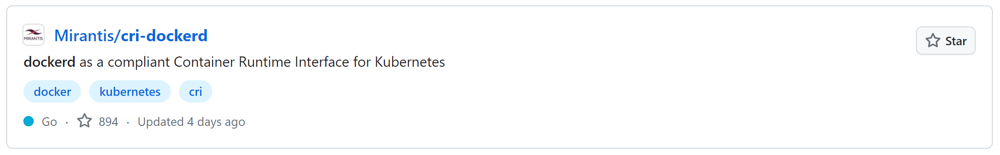

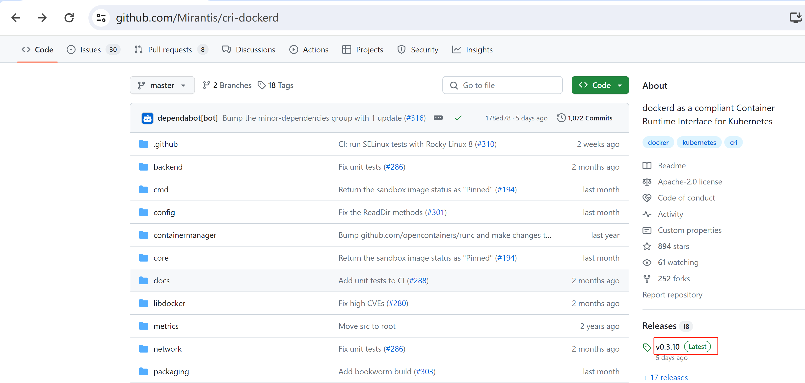

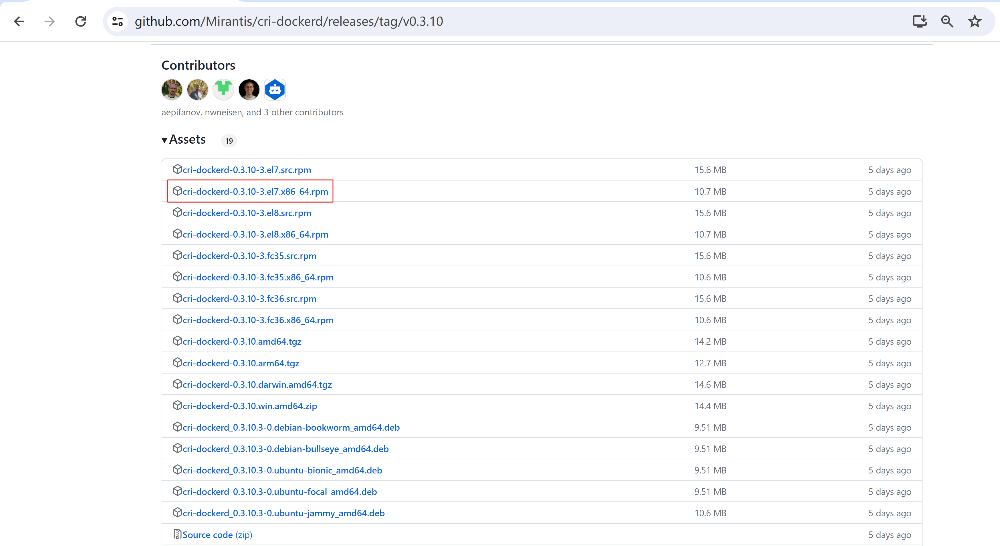

```sh
# wget https://github.com/Mirantis/cri-dockerd/releases/download/v0.3.10/cri-dockerd-0.3.10-3.el7.x86_64.rpm
```

```sh
# yum install cri-dockerd-0.3.10-3.el7.x86_64.rpm
```

```sh
# systemctl enable --now  cri-docker
```

#### 6.8.2 kubelet部署

##### 6.8.2.1 创建kubelet-bootstrap的kubeconfig

```sh
[root@k8s-master01 k8s-work]# BOOTSTRAP_TOKEN=$(awk -F "," '{print $1}' /etc/kubernetes/token.csv)

[root@k8s-master01 k8s-work]# kubectl config set-cluster kubernetes --certificate-authority=ca.pem --embed-certs=true --server=https://192.168.10.100:6443 --kubeconfig=kubelet-bootstrap.kubeconfig
Cluster "kubernetes" set.

[root@k8s-master01 k8s-work]# kubectl config set-credentials kubelet-bootstrap --token=${BOOTSTRAP_TOKEN} --kubeconfig=kubelet-bootstrap.kubeconfig
User "kubelet-bootstrap" set.

[root@k8s-master01 k8s-work]# kubectl config set-context default --cluster=kubernetes --user=kubelet-bootstrap --kubeconfig=kubelet-bootstrap.kubeconfig
Context "default" created.

[root@k8s-master01 k8s-work]# kubectl config use-context default --kubeconfig=kubelet-bootstrap.kubeconfig
Switched to context "default".
```

```sh
[root@k8s-master01 k8s-work]# ls
kubelet-bootstrap.kubeconfig 
```

```sh
[root@k8s-master01 k8s-work]# kubectl create clusterrolebinding cluster-system-anonymous --clusterrole=cluster-admin --user=kubelet-bootstrap
clusterrolebinding.rbac.authorization.k8s.io/cluster-system-anonymous created

[root@k8s-master01 k8s-work]# kubectl create clusterrolebinding kubelet-bootstrap --clusterrole=system:node-bootstrapper --user=kubelet-bootstrap --kubeconfig=kubelet-bootstrap.kubeconfig
clusterrolebinding.rbac.authorization.k8s.io/kubelet-bootstrap created
```

```sh
[root@k8s-master01 k8s-work]# kubectl describe clusterrolebinding cluster-system-anonymous

[root@k8s-master01 k8s-work]# kubectl describe clusterrolebinding kubelet-bootstrap
```

##### 6.8.2.2 创建kubelet配置文件

k8s-worker01

```sh
[root@k8s-worker01 ~]# mkdir -p  /etc/kubernetes/ssl
```

```sh
[root@k8s-worker01 ~]# cat >  /etc/kubernetes/kubelet.json << "EOF"
{
  "kind": "KubeletConfiguration",
  "apiVersion": "kubelet.config.k8s.io/v1beta1",
  "authentication": {
    "x509": {
      "clientCAFile": "/etc/kubernetes/ssl/ca.pem"
    },
    "webhook": {
      "enabled": true,
      "cacheTTL": "2m0s"
    },
    "anonymous": {
      "enabled": false
    }
  },
  "authorization": {
    "mode": "Webhook",
    "webhook": {
      "cacheAuthorizedTTL": "5m0s",
      "cacheUnauthorizedTTL": "30s"
    }
  },
  "address": "192.168.10.145",
  "port": 10250,
  "readOnlyPort": 10255,
  "cgroupDriver": "systemd",                    
  "hairpinMode": "promiscuous-bridge",
  "serializeImagePulls": false,
  "clusterDomain": "cluster.local.",
  "clusterDNS": ["10.96.0.2"]
}
EOF
```

k8s-worker01

```sh
[root@k8s-worker02 ~]# mkdir -p  /etc/kubernetes/ssl
```

```sh
[root@k8s-worker02 ~]# cat > /etc/kubernetes/kubelet.json << "EOF"
{
  "kind": "KubeletConfiguration",
  "apiVersion": "kubelet.config.k8s.io/v1beta1",
  "authentication": {
    "x509": {
      "clientCAFile": "/etc/kubernetes/ssl/ca.pem"
    },
    "webhook": {
      "enabled": true,
      "cacheTTL": "2m0s"
    },
    "anonymous": {
      "enabled": false
    }
  },
  "authorization": {
    "mode": "Webhook",
    "webhook": {
      "cacheAuthorizedTTL": "5m0s",
      "cacheUnauthorizedTTL": "30s"
    }
  },
  "address": "192.168.10.146",
  "port": 10250,
  "readOnlyPort": 10255,
  "cgroupDriver": "systemd",                    
  "hairpinMode": "promiscuous-bridge",
  "serializeImagePulls": false,
  "clusterDomain": "cluster.local.",
  "clusterDNS": ["10.96.0.2"]
}
EOF
```

##### 6.8.2.3 创建kubelet服务配置文件

> 所有worker节点都要执行

```sh
cat > /usr/lib/systemd/system/kubelet.service << "EOF"
[Unit]
Description=Kubernetes Kubelet
Documentation=https://github.com/kubernetes/kubernetes
After=docker.service
Requires=docker.service

[Service]
WorkingDirectory=/var/lib/kubelet
ExecStart=/usr/local/bin/kubelet \
  --bootstrap-kubeconfig=/etc/kubernetes/kubelet-bootstrap.kubeconfig \
  --cert-dir=/etc/kubernetes/ssl \
  --kubeconfig=/etc/kubernetes/kubelet.kubeconfig \
  --config=/etc/kubernetes/kubelet.json \
  --rotate-certificates \
  --container-runtime-endpoint=unix:///run/cri-dockerd.sock \
  --pod-infra-container-image=registry.k8s.io/pause:3.9 \
  --v=2
Restart=on-failure
RestartSec=5

[Install]
WantedBy=multi-user.target
EOF
```

```sh
关于容器运行时的说明：
如果使用的是containerd，则--container-runtime-endpoint设置为：unix:///run/containerd/containerd.sock
```

##### 6.8.2.4 分发CA证书及kubelet-bootstrap.kubeconfig文件

```sh
[root@k8s-master01 k8s-work]# for i in k8s-worker01 k8s-worker02;do scp kubelet-bootstrap.kubeconfig $i:/etc/kubernetes;done
```

```sh
[root@k8s-master01 k8s-work]# for i in k8s-worker01 k8s-worker02;do scp ca.pem $i:/etc/kubernetes/ssl;done
```

##### 6.8.2.5 创建目录及启动kubelet服务

> 所有worker节点上都要执行
```sh
mkdir -p /var/lib/kubelet
```

```sh
systemctl daemon-reload
systemctl enable --now kubelet
systemctl status kubelet
```

```sh
[root@k8s-master01 k8s-work]# kubectl get nodes
NAME                      STATUS     ROLES    AGE   VERSION
k8s-worker01.magedu.com   NotReady   <none>   40m   v1.28.0
k8s-worker02.magedu.com   NotReady   <none>   35s   v1.28.0
```

```sh
[root@k8s-master01 k8s-work]# kubectl get csr
NAME        AGE   SIGNERNAME                                    REQUESTOR           REQUESTEDDURATION   CONDITION
csr-5khqj   41m   kubernetes.io/kube-apiserver-client-kubelet   kubelet-bootstrap   <none>              Approved,Issued
csr-jj9ch   41m   kubernetes.io/kube-apiserver-client-kubelet   kubelet-bootstrap   <none>              Approved,Issued
```

```sh
说明：
确认kubelet服务启动成功后，接着到master上Approve一下bootstrap请求。
```

```sh
[root@k8s-master01 k8s-work]# kubectl describe node | grep Runtime
  Container Runtime Version:  docker://25.0.3
  Container Runtime Version:  docker://25.0.3
```

#### 6.8.3 kube-proxy部署

##### 6.8.3.1 创建kube-proxy证书请求文件

```sh
[root@k8s-master01 k8s-work]# cat > kube-proxy-csr.json << "EOF"
{
  "CN": "system:kube-proxy",
  "key": {
    "algo": "rsa",
    "size": 2048
  },
  "names": [
    {
      "C": "CN",
      "ST": "Beijing",
      "L": "Beijing",
      "O": "kubemsb",
      "OU": "CN"
    }
  ]
}
EOF
```

```sh
[root@k8s-master01 k8s-work]# ls
kube-proxy-csr.json
```

##### 6.8.3.2 生成kube-proxy证书

```sh
[root@k8s-master01 k8s-work]# cfssl gencert -ca=ca.pem -ca-key=ca-key.pem -config=ca-config.json -profile=kubernetes kube-proxy-csr.json | cfssljson -bare kube-proxy
```

```sh
输出内容：
2024/02/18 12:46:11 [INFO] generate received request
2024/02/18 12:46:11 [INFO] received CSR
2024/02/18 12:46:11 [INFO] generating key: rsa-2048
2024/02/18 12:46:12 [INFO] encoded CSR
2024/02/18 12:46:12 [INFO] signed certificate with serial number 287014884519032251718192470174684298031860745303
2024/02/18 12:46:12 [WARNING] This certificate lacks a "hosts" field. This makes it unsuitable for
websites. For more information see the Baseline Requirements for the Issuance and Management
of Publicly-Trusted Certificates, v.1.1.6, from the CA/Browser Forum (https://cabforum.org);
specifically, section 10.2.3 ("Information Requirements").
```

```sh
[root@k8s-master01 k8s-work]# ls kube-proxy*
kube-proxy.csr  
kube-proxy-csr.json  
kube-proxy-key.pem  
kube-proxy.pem
```

##### 6.8.3.3 生成kube-proxy的kubeconfig文件

```sh
[root@k8s-master01 k8s-work]# kubectl config set-cluster kubernetes --certificate-authority=ca.pem --embed-certs=true --server=https://192.168.10.100:6443 --kubeconfig=kube-proxy.kubeconfig
Cluster "kubernetes" set.

[root@k8s-master01 k8s-work]# kubectl config set-credentials kube-proxy --client-certificate=kube-proxy.pem --client-key=kube-proxy-key.pem --embed-certs=true --kubeconfig=kube-proxy.kubeconfig
User "kube-proxy" set.

[root@k8s-master01 k8s-work]# kubectl config set-context default --cluster=kubernetes --user=kube-proxy --kubeconfig=kube-proxy.kubeconfig
Context "default" created.

[root@k8s-master01 k8s-work]# kubectl config use-context default --kubeconfig=kube-proxy.kubeconfig
Switched to context "default".
```

```sh
[root@k8s-master01 k8s-work]# ls kube-proxy.kubeconf*
kube-proxy.kubeconfig
```

##### 6.8.3.4 创建kube-proxy服务配置文件

k8s-worker01
```sh
[root@k8s-worker01 ~]# cat > /etc/kubernetes/kube-proxy.yaml << "EOF"
apiVersion: kubeproxy.config.k8s.io/v1alpha1
bindAddress: 192.168.10.145
clientConnection:
  kubeconfig: /etc/kubernetes/kube-proxy.kubeconfig
clusterCIDR: 10.244.0.0/16
healthzBindAddress: 192.168.10.145:10256
kind: KubeProxyConfiguration
metricsBindAddress: 192.168.10.145:10249
mode: "ipvs"
EOF
```

k8s-workder02
```sh
[root@k8s-worker02 ~]# cat > /etc/kubernetes/kube-proxy.yaml << "EOF"
apiVersion: kubeproxy.config.k8s.io/v1alpha1
bindAddress: 192.168.10.146
clientConnection:
  kubeconfig: /etc/kubernetes/kube-proxy.kubeconfig
clusterCIDR: 10.244.0.0/16
healthzBindAddress: 192.168.10.146:10256
kind: KubeProxyConfiguration
metricsBindAddress: 192.168.10.146:10249
mode: "ipvs"
EOF
```

##### 6.8.3.5 创建kube-proxy服务启动配置文件

> 所有worker节点都需要执行

```sh
cat >  /usr/lib/systemd/system/kube-proxy.service << "EOF"
[Unit]
Description=Kubernetes Kube-Proxy Server
Documentation=https://github.com/kubernetes/kubernetes
After=network.target

[Service]
WorkingDirectory=/var/lib/kube-proxy
ExecStart=/usr/local/bin/kube-proxy \
  --config=/etc/kubernetes/kube-proxy.yaml \
  --v=2
Restart=on-failure
RestartSec=5
LimitNOFILE=65536

[Install]
WantedBy=multi-user.target
EOF
```

##### 6.8.3.6 同步kube-proxy文件到worker节点

```sh
[root@k8s-master01 k8s-work]# for i in k8s-worker01 k8s-worker02;do scp kube-proxy*.pem $i:/etc/kubernetes/ssl/; done
```

```sh
[root@k8s-master01 k8s-work]# for i in k8s-worker01 k8s-worker02;do scp kube-proxy.kubeconfig $i:/etc/kubernetes/; done
```

##### 6.8.3.7 kube-proxy服务启动

> 所有的worker节点上执行

```sh
mkdir -p /var/lib/kube-proxy
```

```sh
systemctl daemon-reload
systemctl enable --now kube-proxy

systemctl status kube-proxy
```

## 七、K8S集群网络插件 Calico部署

> 使用calico部署集群网络
安装参考网址：https://projectcalico.docs.tigera.io/about/about-calico

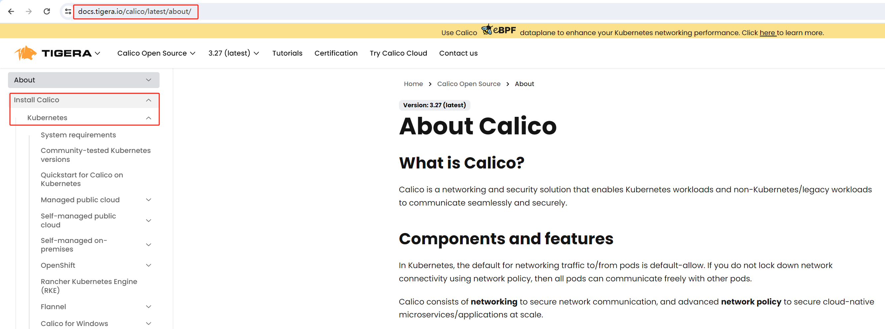

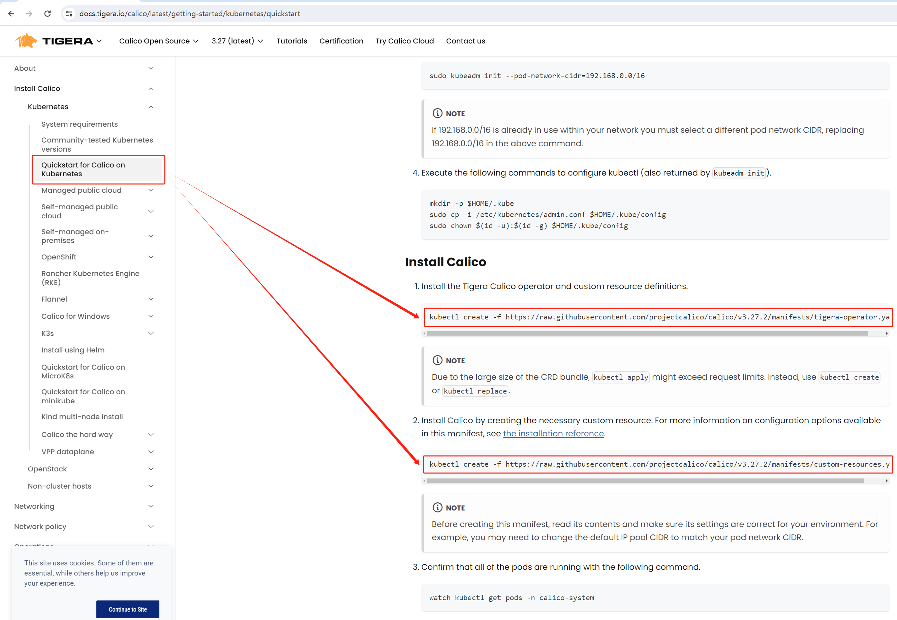

```sh
应用operator资源清单文件
[root@k8s-master01 ~]# kubectl create -f https://raw.githubusercontent.com/projectcalico/calico/v3.27.2/manifests/tigera-operator.yaml
```

```sh
通过自定义资源方式安装
[root@k8s-master01 ~]# wget https://raw.githubusercontent.com/projectcalico/calico/v3.27.2/manifests/custom-resources.yaml
```

```sh
修改文件第13行，修改为使用kubeadm init ----pod-network-cidr对应的IP地址段
[root@k8s-master01 ~]# vim custom-resources.yaml
  1 # This section includes base Calico installation configuration.
  2 # For more information, see: https://docs.tigera.io/calico/latest/reference/installation/api#operator.tigera.io/v1.Installation
  3 apiVersion: operator.tigera.io/v1
  4 kind: Installation
  5 metadata:
  6   name: default
  7 spec:
  8   # Configures Calico networking.
  9   calicoNetwork:
 10     # Note: The ipPools section cannot be modified post-install.
 11     ipPools:
 12     - blockSize: 26
 13       cidr: 10.244.0.0/16
 14       encapsulation: VXLANCrossSubnet
 15       natOutgoing: Enabled
 16       nodeSelector: all()
 17
 18 ---
 19
 20 # This section configures the Calico API server.
 21 # For more information, see: https://docs.tigera.io/calico/latest/reference/installation/api#operator.tigera.io/v1.APIServe    r
 22 apiVersion: operator.tigera.io/v1
 23 kind: APIServer
 24 metadata:
 25   name: default
 26 spec: {}
```

```sh
应用资源清单文件
[root@k8s-master01 ~]# kubectl create -f custom-resources.yaml
installation.operator.tigera.io/default created
apiserver.operator.tigera.io/default created
```

```sh
监视calico-sysem命名空间中pod运行情况
[root@k8s-master01 ~]# watch kubectl get pods -n calico-system
```
> Wait until each pod has the `STATUS` of `Running`.

## 八、coredns部署

> 在k8s-master01节点上执行

```sh
[root@k8s-master01 ~]# cat >  coredns.yaml << "EOF"
apiVersion: v1
kind: ServiceAccount
metadata:
  name: coredns
  namespace: kube-system
---
apiVersion: rbac.authorization.k8s.io/v1
kind: ClusterRole
metadata:
  labels:
    kubernetes.io/bootstrapping: rbac-defaults
  name: system:coredns
rules:
  - apiGroups:
    - ""
    resources:
    - endpoints
    - services
    - pods
    - namespaces
    verbs:
    - list
    - watch
  - apiGroups:
    - discovery.k8s.io
    resources:
    - endpointslices
    verbs:
    - list
    - watch
---
apiVersion: rbac.authorization.k8s.io/v1
kind: ClusterRoleBinding
metadata:
  annotations:
    rbac.authorization.kubernetes.io/autoupdate: "true"
  labels:
    kubernetes.io/bootstrapping: rbac-defaults
  name: system:coredns
roleRef:
  apiGroup: rbac.authorization.k8s.io
  kind: ClusterRole
  name: system:coredns
subjects:
- kind: ServiceAccount
  name: coredns
  namespace: kube-system
---
apiVersion: v1
kind: ConfigMap
metadata:
  name: coredns
  namespace: kube-system
data:
  Corefile: |
    .:53 {
        errors
        health {
          lameduck 5s
        }
        ready
        kubernetes cluster.local  in-addr.arpa ip6.arpa {
          fallthrough in-addr.arpa ip6.arpa
        }
        prometheus :9153
        forward . /etc/resolv.conf {
          max_concurrent 1000
        }
        cache 30
        loop
        reload
        loadbalance
    }
---
apiVersion: apps/v1
kind: Deployment
metadata:
  name: coredns
  namespace: kube-system
  labels:
    k8s-app: kube-dns
    kubernetes.io/name: "CoreDNS"
spec:
  # replicas: not specified here:
  # 1. Default is 1.
  # 2. Will be tuned in real time if DNS horizontal auto-scaling is turned on.
  strategy:
    type: RollingUpdate
    rollingUpdate:
      maxUnavailable: 1
  selector:
    matchLabels:
      k8s-app: kube-dns
  template:
    metadata:
      labels:
        k8s-app: kube-dns
    spec:
      priorityClassName: system-cluster-critical
      serviceAccountName: coredns
      tolerations:
        - key: "CriticalAddonsOnly"
          operator: "Exists"
      nodeSelector:
        kubernetes.io/os: linux
      affinity:
         podAntiAffinity:
           preferredDuringSchedulingIgnoredDuringExecution:
           - weight: 100
             podAffinityTerm:
               labelSelector:
                 matchExpressions:
                   - key: k8s-app
                     operator: In
                     values: ["kube-dns"]
               topologyKey: kubernetes.io/hostname
      containers:
      - name: coredns
        image: coredns/coredns:1.10.1
        imagePullPolicy: IfNotPresent
        resources:
          limits:
            memory: 170Mi
          requests:
            cpu: 100m
            memory: 70Mi
        args: [ "-conf", "/etc/coredns/Corefile" ]
        volumeMounts:
        - name: config-volume
          mountPath: /etc/coredns
          readOnly: true
        ports:
        - containerPort: 53
          name: dns
          protocol: UDP
        - containerPort: 53
          name: dns-tcp
          protocol: TCP
        - containerPort: 9153
          name: metrics
          protocol: TCP
        securityContext:
          allowPrivilegeEscalation: false
          capabilities:
            add:
            - NET_BIND_SERVICE
            drop:
            - all
          readOnlyRootFilesystem: true
        livenessProbe:
          httpGet:
            path: /health
            port: 8080
            scheme: HTTP
          initialDelaySeconds: 60
          timeoutSeconds: 5
          successThreshold: 1
          failureThreshold: 5
        readinessProbe:
          httpGet:
            path: /ready
            port: 8181
            scheme: HTTP
      dnsPolicy: Default
      volumes:
        - name: config-volume
          configMap:
            name: coredns
            items:
            - key: Corefile
              path: Corefile
---
apiVersion: v1
kind: Service
metadata:
  name: kube-dns
  namespace: kube-system
  annotations:
    prometheus.io/port: "9153"
    prometheus.io/scrape: "true"
  labels:
    k8s-app: kube-dns
    kubernetes.io/cluster-service: "true"
    kubernetes.io/name: "CoreDNS"
spec:
  selector:
    k8s-app: kube-dns
  clusterIP: 10.96.0.2
  ports:
  - name: dns
    port: 53
    protocol: UDP
  - name: dns-tcp
    port: 53
    protocol: TCP
  - name: metrics
    port: 9153
    protocol: TCP
 
EOF
```

```sh
[root@k8s-master01 ~]# kubectl apply -f coredns.yaml
serviceaccount/coredns created
clusterrole.rbac.authorization.k8s.io/system:coredns created
clusterrolebinding.rbac.authorization.k8s.io/system:coredns created
configmap/coredns created
deployment.apps/coredns created
service/kube-dns created
```

```sh
[root@k8s-master01 ~]# kubectl get pods -n kube-system
NAME                       READY   STATUS    RESTARTS   AGE
coredns-758895f87b-wpsbs   1/1     Running   0          30s
```

```sh
[root@k8s-master01 ~]# yum install bind-utils


这里没有实现如下效果：需要排查问题原因。
[root@k8s-worker01 ~]# dig -t a www.baidu.com @10.96.0.2

; <<>> DiG 9.11.4-P2-RedHat-9.11.4-26.P2.el7_9.9 <<>> -t a www.baidu.com @10.96.0.2
;; global options: +cmd
;; Got answer:
;; ->>HEADER<<- opcode: QUERY, status: NOERROR, id: 47201
;; flags: qr rd ra; QUERY: 1, ANSWER: 3, AUTHORITY: 0, ADDITIONAL: 1

;; OPT PSEUDOSECTION:
; EDNS: version: 0, flags:; udp: 4096
;; QUESTION SECTION:
;www.baidu.com.                 IN      A

;; ANSWER SECTION:
www.baidu.com.          30      IN      CNAME   www.a.shifen.com.
www.a.shifen.com.       30      IN      A       39.156.66.18
www.a.shifen.com.       30      IN      A       39.156.66.14

;; Query time: 309 msec
;; SERVER: 10.96.0.2#53(10.96.0.2)
;; WHEN: 四 8月 24 20:53:20 CST 2023
;; MSG SIZE  rcvd: 149
```

## 九、K8S集群可用性验证

```sh
[root@k8s-master01 ~]# cat >  nginx.yaml  << "EOF"
---
apiVersion: v1
kind: ReplicationController
metadata:
  name: nginx-web
spec:
  replicas: 2
  selector:
    name: nginx
  template:
    metadata:
      labels:
        name: nginx
    spec:
      containers:
        - name: nginx
          image: nginx:1.19.6
          ports:
            - containerPort: 80
---
apiVersion: v1
kind: Service
metadata:
  name: nginx-service-nodeport
spec:
  ports:
    - port: 80
      targetPort: 80
      nodePort: 30001
      protocol: TCP
  type: NodePort
  selector:
    name: nginx
EOF
```

```sh
[root@k8s-master01 ~]# kubectl apply -f nginx.yaml
replicationcontroller/nginx-web created
service/nginx-service-nodeport created
```

```sh
[root@k8s-master01 ~]# kubectl get pods -o wide
NAME              READY   STATUS    RESTARTS   AGE   IP               NODE                      NOMINATED NODE   READINESS GATES
nginx-web-gt4px   1/1     Running   0          30s   10.244.38.68     k8s-worker02.magedu.com   <none>           <none>
nginx-web-pbkp7   1/1     Running   0          30s   10.244.203.196   k8s-worker01.magedu.com   <none>           <none>
```

```sh
[root@k8s-worker01 ~]# curl http://10.244.38.68
<!DOCTYPE html>
<html>
<head>
<title>Welcome to nginx!</title>
<style>
    body {
        width: 35em;
        margin: 0 auto;
        font-family: Tahoma, Verdana, Arial, sans-serif;
    }
</style>
</head>
<body>
<h1>Welcome to nginx!</h1>
<p>If you see this page, the nginx web server is successfully installed and
working. Further configuration is required.</p>

<p>For online documentation and support please refer to
<a href="http://nginx.org/">nginx.org</a>.<br/>
Commercial support is available at
<a href="http://nginx.com/">nginx.com</a>.</p>

<p><em>Thank you for using nginx.</em></p>
</body>
</html>
```

