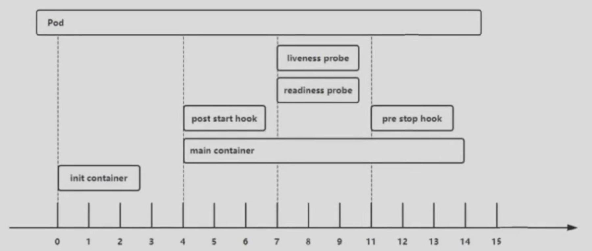

# 一：Pod调度流程和常见状态

## 1.1：Pod调度流程


```sh
## Pod调度流程：

1、客户端通过命令行工具创建Pod，这个请求发给API Server。API Server来完成鉴权和准入以及检查请求的字段是否合法。
比如，有没有缩进的问题，有没有大小写的问题，有没有字段不支持的问题，还有你的API是否符合条件等。
如果没有，API Server会接受请求，写入到etcd。一旦etcd写入完成，再返回 API Server。

2、通过kube Scheduler进行调度。Scheduler会通过API Server拿到事件，这是Scheduler通过watch机制来完成的。一旦API Server有了事件后，就会通过Scheduler的watch机制通知Scheduler执行。Scheduler拿到这个事件后会通过它的调度算法进行调度，同时要判断有没有设置亲和、容忍、污点等等。然后Scheduler把调度的结果返回给API Server，这其实就是确定把pod绑定给哪个node节点来进行创建。
API Server再将结果写回到etcd，etcd再返回给API Server，告知数据写入完毕。然后API Server再返回给Scheduler，说数据写入完毕。

3、node节点的kubelet拿到这个pod的创建事件，它也是基于watch机制完成的。kubelet一旦拿到事件，就会在本机调用docker，通过socket将事件传送给docker。docker就去拉取镜像，然后创建容器。把容器创建好后就返回给kubelet，kubelet再返回给API Server，告知这个pod已经创建完毕。正常情况下会是running状态，去更新状态。API Server将running状态结果返回给etcd写入。etcd写入完成后再返回给API Server说写入完毕，pod状态更新完毕。

4、后面就是kubelet和API Server的一个交互了。包括查询pod，或者exec进入容器，中间都会使用API Server和etcd做消息的传递。
```


## 1.2：Pod常见状态


```sh
## Pod的状态，都是由kubelet来搜集本机的pod状态来发给API Server，再写到etcd。然后再通过kubectl get pod就能拿到pod的状态了。每个节点的kubelet都要汇报pod状态。

## Pod常见状态
1、Unschedulable： # Pod不能被调度。
kube-scheduler调度的时候，没有匹配到合适的node节点。可能是因为资源分配的太多了，node的资源不够了，而导致匹配失败。通常是资源超过已有的资源限制导致。

2、PodScheduled：  # Pod正处于调度中。这个很少见。
场景：一次创建成千个pod。在kube-scheduler刚开始调度的时候，还没有将Pod分配到指定的node，当在筛选出合适的节点后，API Server就会通知去更新etcd数据，将pod分配到指定的node。这种情况很少见。通常是通过yaml文件创建上千个Pod，pod调度需要一个一个调度。kubelet在筛选出node之前才会出现。调度器非常慢也可以看到这个情况，或者一次调动好多个pod。

3、Pending： # 常见状态。
正在创建Pod，但是Pod中的容器还没有全部被创建完成【处于此状态的Pod应该检查Pod依赖的存储是否有权限挂载等】这个情况要去检查pod所以来的存储是否有权限挂载。pv和nas、nfs连接不上，nas、nfs授权的地址不包含这个容器的访问。无法绑定，总之就是这段关联不上，导致pod处于pending状态。一旦总是pending状态，一般就是这些问题，要去好好检查。

4、Failed： # Pod中有容器启动失败而导致Pod工作异常。
为什么启动不了呢？通常都是配置文件写错了，比如nginx。nginc.conf无法加载，就启动失败了。

5、Unknown： # 由于某种原因无法获得Pod的当前状态。
通常是由于pod所在的node节点的kubelet无法和API Server通信，一般是网络问题，一般见不到。kubelet无法和API Server通信。

6、Initialized： # 所有Pod中的初始化容器已经完成了。
pod里有好几个容器的情况下可能发生这个情况。这些容器是按照顺序依次创建的。
pod中的初始化容器已经完成，可以看到这个状态。负责初始化pod的运行环境，包括pod所需要的数据，是由init容器执行的。它不是必需的。
一般是有状态的pod才需要init，比如MySQL主从同步，一般都是init去同步数据。init同步数据后，再去做增量同步，init是做首次全量同步的。一旦同步完成后，也会出现Initialized状态。

7、ImagePullBackOff： # Pod所在的node节点下载镜像失败。
无论是创建什么样的容器，去镜像仓库去下，但是下载不行，可能harbor负载比较高，或者网络问题，总之就是镜像下载不成功。

8、Running： # Pod内部的容器已经被创建并且启动。
正常的状态。这里涉及探针，检测通过，才会显示running。探针是默认存在的，如果你没有配置探针，就认为是成功的。

9、Ready： # 表示pod中的容器已经可以提供访问服务。
READY 1/2 表示一个容器检测没通过。

10、Error： # pod启动过程中发生错误。
pod内部环境不符合业务需求，导致启动失败。

11、NodeLost： # Pod所在节点失联。
kubelet很久没有API Server交互了，很少见。Node都已经丢失了。

12、Waiting： # Pod等待启动。

13、Terminating： # Pod正在被销毁。
理解为，正在删除中。

14、CrashLoopBackOff： # Pod的一些探针检测失败。
但是kubelet正在将它重启尝试恢复。一些探针检测失败，kubelet尝试重启，表现为重启。
会返回给kubelet，就会将状态置为这个。

15、InvalidImageName： # node节点无法解析镜像名称，导致的镜像无法下载。
镜像路径、名称写错导致。

16、ImageInspectError： # 无法校验镜像，镜像不完整导致。
很少见，校验的时候hash值不对。

17、ErrImageNeverPull： # 策略禁止拉取镜像。
镜像中心权限是私有等。镜像不存在，报404。kubectl describe会显示403或者404。

18、RegistryUnavailable： # 镜像服务器不可用
网络原因或harbor宕机。原因是域名无法解析，TCP端口连接不上。

19、ErrImagePull： # 镜像拉取出错。
一般是超时或下载被强制终止。因为harbor重启，网络中断等。就是TCP连接建立好，下到一半报错了。403错误。

20、CreateContainerConfigError： # 不能创建kubelet使用的容器配置。
镜像拉下来，创建的时候报了一些内部错误。kubelet运行环境有问题，一般不会。很少见。

21、CreateContainerError： # 创建容器失败。
kubelet调用docker失败，或者镜像没有设置守护进程，拉不起来。所以镜像一定要打对！！！

22、RunContainerError： # pod运行失败。
原因是容器中没有初始化PID为1的守护进程等。也有可能是权限和路径问题导致。

23、ContainersNotInitialized： # pod没有初始化完毕。
内部路径和权限导致的报错，一般见不到。

24、ContainersNotReady； # pod没有准备完毕。

25、ContainerCreating： # pod正在创建中。

26、PodInitializing： # pod正在初始化中。

27、DockerDaemonNotReady： # node节点docker服务没有启动.

28、NetworkPluginNotReady： # 网络插件没有启动。

15、16、17、19，可能会见到。
1、3、4、8、9、13、14比较常见。

# 遇到这种pod状态时，需要如下命令来查看：
kubectl describle pod "podname" -n "namespace"
Events：来显示错误。
```

# 二：Pause容器

## 2.1：Pause本质

```sh
在node节点上用docker ps去查看，会有很多pause容器。
这些pause在k8s中，就是创建pod的底层容器。
虽然没有指定创建这些容器，但是k8s会自动加上去。

# 是kubelet加上去的，看下面配置。
[root@k8s-node1:~]# cat /etc/systemd/system/kubelet.service 
[Unit]
Description=Kubernetes Kubelet
Documentation=https://github.com/GoogleCloudPlatform/kubernetes

[Service]
WorkingDirectory=/var/lib/kubelet
ExecStart=/usr/local/bin/kubelet \
  --config=/var/lib/kubelet/config.yaml \
  --cni-bin-dir=/usr/local/bin \
  --cni-conf-dir=/etc/cni/net.d \
  --container-runtime=remote \
  --container-runtime-endpoint=unix:///run/containerd/containerd.sock \
  --hostname-override=172.31.8.111 \
  --image-pull-progress-deadline=5m \
  --kubeconfig=/etc/kubernetes/kubelet.kubeconfig \
  --network-plugin=cni \
  --pod-infra-container-image=easzlab/pause:3.6 \
  --root-dir=/var/lib/kubelet \
  --v=2
Restart=always
RestartSec=5

[Install]
WantedBy=multi-user.target

PS：
--pod-infra-container-image=easzlab/pause:3.6

## 
底层的基础容器。负责初始化容器的运行环境，包括容器的网络。
容器的地址是怎么获取的呢？多个容器会共用同一个网络。

infra在什么什么之下的意思。

实际上nginx是使用infra容器的网络。
一个pod里有多个容器，每个pod有一个底层容器，负责初始化网络运行环境。当前pod里的容器都是用它的地址。
用来共享底层的网络环境的。但是容器的文件系统还是隔离，包括用户空间，也是隔离的。
网络是使用infra的网络。

pause镜像很小，只有几百kB。
```

## 2.2：Pause简介

```sh
## pause容器简介：
Pause容器，又叫infra容器，是pod的基础容器，镜像体积只有几百kB左右。配置在kubelet中，主要功能是一个pod中多个容器的网络通信。

infra容器被创建后会初始化Network Namespace，之后其它容器就可以加入到infra容器中共享infra容器的网络了，因此如果一个pod中的两个容器A和B，那么关系如下：
1、A容器和B容器能够直接使用localhost通信；
2、A容器和B容器可以看到相同的网卡、IP与端口监听信息；
3、Pod只有一个IP地址，也就是该Pod的Network Namespace对应的IP地址（由infra容器初始化并创建）
4、k8s环境中的每个pod都有一个独立的IP地址（前提是地址足够用，特别是公有云上，有些公司创建的网络段比较小），并且此IP被当前Pod中所有容器在内部共享使用。
5、pod删除后，infra容器随机被删除，其IP被回收。
```

```sh
## Pause容器共享的Namespace
1、NET Namespace：Pod中的多个容器共享同一个网络命令空间，即它们使用相同的IP和端口信息。
2、IPC Namespace：Pod中的多个容器可以使用System V IPC或POSIX消息队列进行通信。这是UNIX的通信协议，可以内部通信。
3、UTS Namespace：pod中的多个容器共享一个主机名。

MNT Namespace、PID Namespace、User Namespace未共享。
挂载不一样，PID不一样，User不一样。
A容器可以挂个NFS，B容器可以不挂。
A容器的nginx的PID可以为1，B容器的是PHP的PID可以为1
A容器可以有用户1，B容器也可以有用户1
```

## 2.3：Pause示例

```sh
[root@k8s-master1:~/yaml/20240629/case3-controller]# ll
total 12
drwxr-xr-x  2 root root  56 Jun 29 15:22 ./
drwxr-xr-x 15 root root 292 Jun 29 13:18 ../
-rw-r--r--  1 root root 509 Jun 29 15:22 deployment.yml
-rw-r--r--  1 root root 366 Jun 29 14:52 rc.yml
-rw-r--r--  1 root root 438 Jun 29 13:16 rs.yml

[root@k8s-master1:~/yaml/20240629/case3-controller]# kubectl apply -f deployment.yml 
deployment.apps/nginx-deployment created

[root@k8s-master1:~/yaml/20240629/case3-controller]# kubectl get pods
NAME                                READY   STATUS    RESTARTS       AGE
net-test1                           1/1     Running   7 (10h ago)    2d20h
net-test2                           1/1     Running   12 (10h ago)   4d7h
nginx-deployment-585c9848bb-dfk2v   1/1     Running   0              13s
nginx-deployment-585c9848bb-f88vz   1/1     Running   0              13s

# 查看这个容器是在哪个node上
[root@k8s-master1:~/yaml/20240629/case3-controller]# kubectl get pods -o wide
NAME                                READY   STATUS    RESTARTS       AGE     IP               NODE           NOMINATED NODE   READINESS GATES
net-test1                           1/1     Running   7 (10h ago)    2d20h   10.200.155.182   172.31.8.111   <none>           <none>
net-test2                           1/1     Running   12 (10h ago)   4d7h    10.200.55.145    172.31.8.112   <none>           <none>
nginx-deployment-585c9848bb-dfk2v   1/1     Running   0              5m47s   10.200.70.92     172.31.8.113   <none>           <none>
nginx-deployment-585c9848bb-f88vz   1/1     Running   0              5m47s   10.200.155.191   172.31.8.111   <none>           <none>

PS：是在node1上

# 想知道这个容器在node1上用的是哪块网卡
# 进入容器安装 ethtool net-tools
[root@k8s-master1:~/yaml/20240629/case3-controller]# kubectl exec -it nginx-deployment-585c9848bb-f88vz -- bash
root@nginx-deployment-585c9848bb-f88vz:/# apt update
......
root@nginx-deployment-585c9848bb-f88vz:/# apt install ethtool net-tools -y
......
root@nginx-deployment-585c9848bb-f88vz:/# ethtool -S eth0
NIC statistics:
     peer_ifindex: 16
     rx_queue_0_xdp_packets: 0
     rx_queue_0_xdp_bytes: 0
     rx_queue_0_xdp_drops: 0
root@nginx-deployment-585c9848bb-f88vz:/# ifconfig
eth0: flags=4163<UP,BROADCAST,RUNNING,MULTICAST>  mtu 1500
        inet 10.200.155.191  netmask 255.255.255.255  broadcast 10.200.155.191
        inet6 fe80::b4e2:baff:fe0a:e5b9  prefixlen 64  scopeid 0x20<link>
        ether b6:e2:ba:0a:e5:b9  txqueuelen 0  (Ethernet)
        RX packets 847  bytes 9164765 (8.7 MiB)
        RX errors 0  dropped 0  overruns 0  frame 0
        TX packets 809  bytes 46676 (45.5 KiB)
        TX errors 0  dropped 1 overruns 0  carrier 0  collisions 0

lo: flags=73<UP,LOOPBACK,RUNNING>  mtu 65536
        inet 127.0.0.1  netmask 255.0.0.0
        inet6 ::1  prefixlen 128  scopeid 0x10<host>
        loop  txqueuelen 1000  (Local Loopback)
        RX packets 0  bytes 0 (0.0 B)
        RX errors 0  dropped 0  overruns 0  frame 0
        TX packets 0  bytes 0 (0.0 B)
        TX errors 0  dropped 0 overruns 0  carrier 0  collisions 0

root@nginx-deployment-585c9848bb-f88vz:/# exit
exit

PS：
peer_ifindex: 16
找到这个16

# node1
[root@k8s-node1:~]# ip link show
1: lo: <LOOPBACK,UP,LOWER_UP> mtu 65536 qdisc noqueue state UNKNOWN mode DEFAULT group default qlen 1000
    link/loopback 00:00:00:00:00:00 brd 00:00:00:00:00:00
2: eth0: <BROADCAST,MULTICAST,UP,LOWER_UP> mtu 1500 qdisc fq_codel state UP mode DEFAULT group default qlen 1000
    link/ether 00:0c:29:4d:b8:86 brd ff:ff:ff:ff:ff:ff
3: kube-ipvs0: <BROADCAST,NOARP> mtu 1500 qdisc noop state DOWN mode DEFAULT group default 
    link/ether 46:b6:68:a0:7a:6f brd ff:ff:ff:ff:ff:ff
4: cali073b411309a@if3: <BROADCAST,MULTICAST,UP,LOWER_UP> mtu 1500 qdisc noqueue state UP mode DEFAULT group default 
    link/ether ee:ee:ee:ee:ee:ee brd ff:ff:ff:ff:ff:ff link-netns cni-a80476d8-fd2a-1356-d1c6-655876f8ff90
5: tunl0@NONE: <NOARP,UP,LOWER_UP> mtu 1440 qdisc noqueue state UNKNOWN mode DEFAULT group default qlen 1000
    link/ipip 0.0.0.0 brd 0.0.0.0
11: cali1876609adb6@if4: <BROADCAST,MULTICAST,UP,LOWER_UP> mtu 1500 qdisc noqueue state UP mode DEFAULT group default 
    link/ether ee:ee:ee:ee:ee:ee brd ff:ff:ff:ff:ff:ff link-netns cni-6c7b8682-46cc-7f16-5885-5c0bddfcb82e
16: cali945da5de7b8@if4: <BROADCAST,MULTICAST,UP,LOWER_UP> mtu 1500 qdisc noqueue state UP mode DEFAULT group default 
    link/ether ee:ee:ee:ee:ee:ee brd ff:ff:ff:ff:ff:ff link-netns cni-3c19e9ef-4d6d-4933-d186-98254deb215d
    
[root@k8s-node1:~]# ifconfig
cali073b411309a: flags=4163<UP,BROADCAST,RUNNING,MULTICAST>  mtu 1500
        inet6 fe80::ecee:eeff:feee:eeee  prefixlen 64  scopeid 0x20<link>
        ether ee:ee:ee:ee:ee:ee  txqueuelen 0  (Ethernet)
        RX packets 25  bytes 1846 (1.8 KB)
        RX errors 0  dropped 2  overruns 0  frame 0
        TX packets 5  bytes 446 (446.0 B)
        TX errors 0  dropped 0 overruns 0  carrier 0  collisions 0

cali1876609adb6: flags=4163<UP,BROADCAST,RUNNING,MULTICAST>  mtu 1500
        inet6 fe80::ecee:eeff:feee:eeee  prefixlen 64  scopeid 0x20<link>
        ether ee:ee:ee:ee:ee:ee  txqueuelen 0  (Ethernet)
        RX packets 46  bytes 3910 (3.9 KB)
        RX errors 0  dropped 2  overruns 0  frame 0
        TX packets 32  bytes 4180 (4.1 KB)
        TX errors 0  dropped 0 overruns 0  carrier 0  collisions 0

cali945da5de7b8: flags=4163<UP,BROADCAST,RUNNING,MULTICAST>  mtu 1500
        inet6 fe80::ecee:eeff:feee:eeee  prefixlen 64  scopeid 0x20<link>
        ether ee:ee:ee:ee:ee:ee  txqueuelen 0  (Ethernet)
        RX packets 811  bytes 46816 (46.8 KB)
        RX errors 0  dropped 2  overruns 0  frame 0
        TX packets 847  bytes 9164765 (9.1 MB)
        TX errors 0  dropped 0 overruns 0  carrier 0  collisions 0

eth0: flags=4163<UP,BROADCAST,RUNNING,MULTICAST>  mtu 1500
        inet 172.31.8.111  netmask 255.255.255.0  broadcast 172.31.8.255
        inet6 fe80::20c:29ff:fe4d:b886  prefixlen 64  scopeid 0x20<link>
        ether 00:0c:29:4d:b8:86  txqueuelen 1000  (Ethernet)
        RX packets 268165  bytes 158556356 (158.5 MB)
        RX errors 0  dropped 0  overruns 0  frame 0
        TX packets 130093  bytes 11840112 (11.8 MB)
        TX errors 0  dropped 0 overruns 0  carrier 0  collisions 0

lo: flags=73<UP,LOOPBACK,RUNNING>  mtu 65536
        inet 127.0.0.1  netmask 255.0.0.0
        inet6 ::1  prefixlen 128  scopeid 0x10<host>
        loop  txqueuelen 1000  (Local Loopback)
        RX packets 162140  bytes 43897175 (43.8 MB)
        RX errors 0  dropped 0  overruns 0  frame 0
        TX packets 162140  bytes 43897175 (43.8 MB)
        TX errors 0  dropped 0 overruns 0  carrier 0  collisions 0

tunl0: flags=193<UP,RUNNING,NOARP>  mtu 1440
        inet 10.200.155.128  netmask 255.255.255.255
        tunnel   txqueuelen 1000  (IPIP Tunnel)
        RX packets 97  bytes 10114 (10.1 KB)
        RX errors 0  dropped 0  overruns 0  frame 0
        TX packets 76  bytes 5518 (5.5 KB)
        TX errors 0  dropped 0 overruns 0  carrier 0  collisions 0

PS：
真实环境会有很多网卡，看最前面的值。
二者一致就是一块网卡。
pod可能会有多个容器，都是使用这块网卡。cali945da5de7b8@if4。

如果想用tcpdump -i抓包。就抓这个网卡的报文。

[root@k8s-node1:~]# ls /run/netns/
cni-3c19e9ef-4d6d-4933-d186-98254deb215d  cni-a80476d8-fd2a-1356-d1c6-655876f8ff90
cni-6c7b8682-46cc-7f16-5885-5c0bddfcb82e

[root@k8s-node1:~]# sudo nsenter --net=/run/netns/cni-3c19e9ef-4d6d-4933-d186-98254deb215d ifconfig
eth0: flags=4163<UP,BROADCAST,RUNNING,MULTICAST>  mtu 1500
        inet 10.200.155.191  netmask 255.255.255.255  broadcast 10.200.155.191
        inet6 fe80::b4e2:baff:fe0a:e5b9  prefixlen 64  scopeid 0x20<link>
        ether b6:e2:ba:0a:e5:b9  txqueuelen 0  (Ethernet)
        RX packets 847  bytes 9164765 (9.1 MB)
        RX errors 0  dropped 0  overruns 0  frame 0
        TX packets 811  bytes 46816 (46.8 KB)
        TX errors 0  dropped 1 overruns 0  carrier 0  collisions 0

lo: flags=73<UP,LOOPBACK,RUNNING>  mtu 65536
        inet 127.0.0.1  netmask 255.0.0.0
        inet6 ::1  prefixlen 128  scopeid 0x10<host>
        loop  txqueuelen 1000  (Local Loopback)
        RX packets 0  bytes 0 (0.0 B)
        RX errors 0  dropped 0  overruns 0  frame 0
        TX packets 0  bytes 0 (0.0 B)
        TX errors 0  dropped 0 overruns 0  carrier 0  collisions 0
        
PS：
10.200.155.191
可以看到pod就是这个地址。
那这个pod就是cni-3c19e9ef-4d6d-4933-d186-98254deb215d这个namespace。有的时候好几个，需要自己去找。

每个pod在宿主机都有一个namespace，这个namespace就是一个文件。这个namespace文件就是pause或者说infra容器初始化完成的，给当前的pod的容器去使用的。k8s会自动完成pod和pause容器的创建，以及共享。
```

## 2.4：验证Pause容器的作用（使用docker）

```sh
## 用docker机器来做实验，不是k8s环境。

2小时16分

docker下的实验，和k8s没关系：这个实验没有实际使用场景。
nginx
php
pause
网络都是使用同一个namespace。

用docker ps查看，只在pause容器上做端口映射，nginx和php使用pause容器的端口，所以它们三个使用同一net namespace。
它们都是一个IP地址。但是它们的用户，文件结构都是隔离开的。

证明pause的实现方式就是这样的。是由kubelet实现的。
```

# 三：init容器

## 3.1：init简介

```sh
## init容器的作用：
1、可以为业务容器提前准备好业务容器的运行环境，比如，将业务容器需要的配置文件提前生成并放在指定位置、检查数据权限或完整性、业务容器所需要的软件版本等基础运行环境。

2、可以在运行业务容器之前准备好需要的业务数据，比如从OSS下载、或者从其他位置copy。
比如MySQL。MySQL master会使用statefulset运行，它启动之后，会产生它自己的数据，主库的数据。
Slave在使用虚拟机或者物理机做的时候，需要使用mysqldump把主库的数据dump出来一个sql文件，然后将sql文件拷贝到备库，导入进来。
k8s不是这样做的，它是使用init容器，把master数据同步过来，拷贝到slave的pvc中，或者指定目录/var/lib/mysql，把数据同步过来。这就是init容器做的事情。第二个init容易可以检查环境，可有可无。数据同步好后，slave容器就可以启动了，就可以加载数据库内容，app就可以读slave的数据了。为什么呢？因此第一次有一个init容器做了全量同步，后期的话只做增量就可以了。

3、检查依赖的服务是否能够访问。
先用init容器检查，执行成功之后，才会继续向下运行业务容器。不成功，就会重新执行，不会继续执行后续业务容器。

## init容器的特点：
1、一个pod可以有多个业务容器还能再有多个init容器，但是每个init容器和业务容器的运行环境都是隔离的，都是独立的文件系统。
init和业务容器是数据共享的。

2、init容器会比业务容器先启动。

3、init容器运行成功之后才会继续运行业务容器。

4、如果一个pod有多个init容器，则需要从上到下逐个运行并且全部成功，最后才会运行业务容器。（init容器的镜像可能不一样的）

5、init容器不支持探针检测（因为初始化完成后就退出再也不运行了）。
```

## 3.2：示例

```sh
[root@k8s-master1:~/yaml/20240701/2.PodProbe-case]# ll
total 8
drwxr-xr-x 6 root root  145 Jul  1 20:07 ./
drwxr-xr-x 4 root root   59 Jul  1 20:07 ../
-rw-r--r-- 1 root root 6148 Jul  1 20:07 .DS_Store
drwxr-xr-x 2 root root   35 Jul  1 20:07 case1-init-container/
drwxr-xr-x 2 root root   55 Jul  1 20:07 case2-docker-container-healthy-check/
drwxr-xr-x 2 root root  163 Jul  1 20:07 case3-Probe/
drwxr-xr-x 2 root root   54 Jul  1 20:07 case4-postStart-preStop/

[root@k8s-master1:~/yaml/20240701/2.PodProbe-case/case1-init-container]# vim 1-init-container.yaml 
kind: Deployment
#apiVersion: extensions/v1beta1
apiVersion: apps/v1
metadata:
  labels:
    app: myserver-myapp 
  name: myserver-myapp-deployment-name
  namespace: myserver
spec:
  replicas: 1 
  selector:
    matchLabels:
      app: myserver-myapp-frontend
  template:
    metadata:
      labels:
        app: myserver-myapp-frontend
    spec:
      containers:
        - name: myserver-myapp-container
          image: nginx:1.16.0
          #imagePullPolicy: Always
          volumeMounts:
          - mountPath: "/usr/share/nginx/html/myserver"
            name: myserver-data
      initContainers:
        - name: init-web-data
          image: centos:7.9.2009
          command: ['/bin/bash','-c',"for i in `seq 1 10`;do echo '<h1>'$i web page at $(date +%Y%m%d%H%M%S) '<h1>' >> /data/nginx/html/myserver/index.html;sleep 1;done"]
          volumeMounts:
          - mountPath: "/data/nginx/html/myserver"
            name: myserver-data
        - name: change-data-owner
          image: busybox:1.28
          command: ['/bin/sh','-c',"/bin/chmod 644 /data/nginx/html/myserver/* -R"]
          volumeMounts:
          - mountPath: "/data/nginx/html/myserver"
            name: myserver-data
      volumes:
      - name: myserver-data
        hostPath:
          path: /tmp/data/html

---
kind: Service
apiVersion: v1
metadata:
  labels:
    app: myserver-myapp-service
  name: myserver-myapp-service-name
  namespace: myserver
spec:
  type: NodePort
  ports:
  - name: http
    port: 80
    targetPort: 80
    nodePort: 30080
  selector:
    app: myserver-myapp-frontend

PS：
第一个init
初始化nginx的web页面。循环生成10行内容，追加。
用hostPath和nfs挂载都是可以的。
第二个init
修改属主和属组

[root@k8s-master1:~/yaml/20240701/2.PodProbe-case/case1-init-container]# kubectl apply -f 1-init-container.yaml 

deployment.apps/myserver-myapp-deployment-name created
service/myserver-myapp-service-name created

[root@k8s-master1:~/yaml/20240701/2.PodProbe-case/case1-init-container]# kubectl get pod -n myserver
NAME                                             READY   STATUS     RESTARTS   AGE
myserver-myapp-deployment-name-767f4878c-7xn9z   0/1     Init:0/2   0          4s
net-test-myserver                                1/1     Running    0          7h44m

[root@k8s-master1:~/yaml/20240701/2.PodProbe-case/case1-init-container]# kubectl get pod -n myserver
NAME                                             READY   STATUS     RESTARTS   AGE
myserver-myapp-deployment-name-767f4878c-7xn9z   0/1     Init:1/2   0          12s
net-test-myserver                                1/1     Running    0          7h45m

[root@k8s-master1:~/yaml/20240701/2.PodProbe-case/case1-init-container]# kubectl get pod -n myserver
NAME                                             READY   STATUS    RESTARTS   AGE
myserver-myapp-deployment-name-767f4878c-7xn9z   1/1     Running   0          24s
net-test-myserver                                1/1     Running   0          7h45m

PS：可以看到init容器初始化的过程。

[root@k8s-master1:~/yaml/20240701/2.PodProbe-case/case1-init-container]# kubectl get pod -n myserver -o wide
NAME                                             READY   STATUS    RESTARTS   AGE     IP               NODE           NOMINATED NODE   READINESS GATES
myserver-myapp-deployment-name-767f4878c-7xn9z   1/1     Running   0          2m54s   10.200.155.129   172.31.8.111   <none>           <none>
net-test-myserver                                1/1     Running   0          7h47m   10.200.155.186   172.31.8.111   <none>           <none>

访问
http://172.31.8.111:30080/myserver

# node1上查看数据，删除pod的话也不会数据丢失
[root@k8s-node1:~]# cat /tmp/data/html/index.html
<h1>1 web page at 20240702013718 <h1>
<h1>2 web page at 20240702013719 <h1>
<h1>3 web page at 20240702013720 <h1>
<h1>4 web page at 20240702013721 <h1>
<h1>5 web page at 20240702013722 <h1>
<h1>6 web page at 20240702013723 <h1>
<h1>7 web page at 20240702013724 <h1>
<h1>8 web page at 20240702013725 <h1>
<h1>9 web page at 20240702013726 <h1>
<h1>10 web page at 20240702013727 <h1>

# 恢复环境
[root@k8s-master1:~/yaml/20240701/2.PodProbe-case/case1-init-container]# kubectl delete -f 1-init-container.yaml 
deployment.apps "myserver-myapp-deployment-name" deleted
service "myserver-myapp-service-name" deleted

PS：如果修改镜像，重新apply，会发现数据会重新生成。
```


# 四：Health Check（了解）

## 4.1：概念

```sh
## Health Check
由发起者对容器进行周期性健康状态监测。每隔3s，5s，10s检查一次。
周期检测相当于人类的周期性体检。
每次检测相当于人类每次体检的内容。

方法：
数据能否查询。
API等。

两种方式health check：
打镜像的时候配置
运行容器的时候配置

这个就是了解，k8s里不是这样用的，使用探针。
```

## 4.2：示例

```sh
无
```

# 五：Pod生命周期和探针

```
1. 健康状态检查。
当容器中的服务出现异常，健康检查会及时发现，把pod重启。降低对业务的影响。

2. 资源限制。

看起来很简单，但是二者实用性很强，都需要配置。
```

## 5.1：Pod的生命周期


```sh
## pod lifecycle:
pod的生命周期，从start后可以配置postStart检测，运行过程中可以配置livenessProbe和readinessProbe，最后在stop前可以配置preStop操作。

postStart指的就是pod被创建好了，但是里面的服务可能还没有启动。
pod启动后，在pod里面有一个main container，一个pod至少有一个容器用来提供常规业务请求。
pod启动后，这个main container不一定能启动，因为服务可能要被加载、解析、连接数据库、连接中间件等等。
pod一旦启动之后，我们就可以配置一个postStart检测。检测一些服务，端口是否存在等等。
再往后可以配置Readiness和Liveness探针。
最后在pod被终止之前，配置变更，镜像更新后，会把之前的容器删除，新建一个，在pod终止之前的操作。

四个时间配置不同的probe。
start和stop 只是一次。
Readiness 服务是否就绪，周期执行。
Liveness 服务是否存活，周期执行。

pod里可以初始化容器的数据等操作。
```

## 5.2：探针

### 5.2.1：简介


```sh
## 探针简介
探针是由kubelet对容器执行的定期诊断，用以保证pod的状态始终处于运行状态。如果pod提供的服务不能正常访问，探针就会有一个异常返回值。一旦拿到异常返回值，kubelet就会把这个pod重启。一直检测不通过，就会形成死循环。（如果在这里探针配置不好，有可能会出现死循环）很多时候容器重启就恢复了。

要执行诊断，kubelet调用由容器实现的Handler（处理程序），也称为Hook（钩子），其实就是kubelet对你的容器实现的处理程序。
就是由kubelet对容器执行的http/https，TCP诊断。

## 有三种类型的处理程序：

ExecAction：
在容器内执行指定命令，如果命令退出时返回码为0则认为诊断成功。
可以自己写一些命令，到容器里执行，比如非交互式的，mysql -e 传递一些命令。如果命令能成功，返回码就是0，这时候kubelet就什么都不做。如果不是0，那就是异常，kubelet把这个值记录，看你配置了几次，监测几次后，还是不行的话，就将容器重启。

TCPSocketAction：
对指定端口上的容器的IP地址进行TCP检查，如果端口在容器里是监听的，则诊断被认为是成功的。返回值是0。同上kubelet操作。

HTTPGetAction：
对指定的端口和路径上的容器的IP地址执行HTTPGet请求，如果响应的状态码大于等于200且小于400，则诊断被认为是成功的。同上kubelet操作。当然需要看你用的是什么探针，有些探针是可以重启容器的，有些是不会的，它会把pod从service后面摘掉。
类似于curl，看url和API能不能访问。

每次探测都将获得以下三种结果之一：
成功：容器通过了诊断
失败：容器未通过诊断
未知：诊断失败，因此不会采取任何行动
```

### 5.2.2：Pod重启策略

```sh
## Pod重启策略：
Pod一旦配置探针，在检测失败的时候，会基于restartPolicy对Pod进行下一步操作：
restartPolicy（容器重启策略）：
  Always：当容器异常时，k8s自动重启该容器。可以配置在ReplicatonController/Replicaset/Deployment。Always是默认值。
  OnFailure：当容器失败时（容器停止运行且退出码不为0），k8s自动重启该容器。
  Never：不论容器运行状态如何，都不会重启该容器，用于job或cronjob。

imagePullPolicy（镜像拉取策略）：
  ifNotPresent：node节点没有此镜像就去指定的镜像仓库拉取，node有这个镜像，就使用node本地镜像。
  Always：每次重建pod都会重新拉取镜像。消耗带宽。
  Never：从不到镜像中心拉取镜像，只使用本地镜像。
```

### 5.2.3：探针类型（pod生命周期不同阶段区分）

```sh
由kubelet根据你配置的probe类型，对当前节点上的pod进行检测。每个节点上都会有kubelet。
成功就什么都不做。失败的话，可能会受到重启策略的影响，对pod进行重启或者从service上拿掉。
常见有两个探针：readinessProbe，livenessProbe。
k8s 1.16后又引入了startupProbe。

## 探针类型

startupProbe：启动探针，kubernetes v1.16引入
判断容器内的应用程序是否已启动完成。如果配置了启动探测，则会先禁用所有其它的探针检测，直到startupProbe检测成功为止。如果startupProbe探测失败，则kubelet将直接杀死容器，容器将按照重启策略进行下一步操作（Always还是Never，对于Deployment，千万不要配置成Never，就配置Always，在检测失败的时候，重启），如果容器没有提供startupProbe探针，则kubelet默认检测结果为success。
在readiness和liveness之前，进行检测，看是否容器内服务启动。如果没有启动，后面的readiness和liveness就不会被执行，容器直接强制重启。
  
livenessProbe：存活探针
当pod启动后，服务也正常了。会周期性监测容器中的服务是否正在运行。每隔一段时间，检查main container的服务是否正常。如果存活探测失败，则kubelet会杀死容器，并且容器将受到其重启策略的影响，如果容器不提供存活探针，则默认状态为success。livenessProbe用于控制是否重启pod。
很多情况下，资源限制或者内存溢出导致服务失败，重启就好了。但是这治标不治本，最终需要代码改进。
livenessProbe用于控制是否重启pod。就跟虚拟机重启一样。
  
readinessProbe：就绪探针
就绪探针是决定service是否关联后面的pod。如果就绪探测失败，端点控制器将从与Pod匹配的所有Service的端点中删除该Pod的IP地址，它不会做容器重启的操作。初始延迟（就是等待时间）之前的就绪状态默认为Failure（失败），需要留足够的时间，通常配置延迟60、120秒或者180秒，这样就不会挂到service后面。需要留足够的时间才开始检测，因为容器的启动比较慢，我们需要等待，一上来就检测，肯定失败。如果容器不提供就绪探针，则默认状态为success。readinessProbe用于控制pod是否添加至service。
成功的话就1次，然后加到service后面。
延迟时间之后检测成功，再挂到service后面。
readinessProbe用于控制pod是否添加至service！！！这是和livenessProbe的最大区别。
  
后面这两个探针是配合使用的，都需要一起配置好。
##
```

### 5.2.4：探针通用配置参数

```sh
## 探针通用配置参数：
官方文档。https://kubernetes.io/docs/tasks/configure-pod-container/configure-liveness-rediness-startup-probes/
探针有很多配置字段，可以使用这些字段精确地控制存活和就绪检测的行为：
这些字段是通用的。可以配置到各种探针。

initialDelaySeconds：120
初始化延迟时间，告诉kubelet在执行第一次探测前应该等待多少秒，默认为0秒，最小值是0。
不延迟的话，很容易导致容器启动失败，然后造成死循环。配置时间尽量长一些，15-30s，多测几次。
一般情况下，微服务启动比较快，代码就几M，几秒就启动。
 
periodSeconds：60
探测周期间隔时间，指定kubelet应该隔多少秒执行一次存活探测，默认是10秒，最小值是1。
这个值千万不要太快！一般配置3秒或者2秒就很快了。3-5秒比较合适。

timeoutSeconds：5
单次探测超时时间，探测超时后等待了多少秒，默认值是1秒，最小值是1。
不要比periodSeconds时间长。一定要小于等于periodSeconds。如果periodSeconds是3s的话，那timeoutSeconds就应该为1-2s。

successThreshold：1
从失败转为成功的重试次数。就是已经失败了，但是这个pod又启动了，再连续监测几次成功之后，再把它挂到service之后。
探测器在失败后，被视为成功的最小连续成功次数，默认值是1。
livenessProbe探针的这个值必须是1，最小值是1。写个2都不行。就支持1次。一次成功就挂到service后面。
  
failureThreshold：3
从成功转为失败的重试次数。当Pod启动后，并且探测到失败，kubernetes的重试次数。具体要看使用什么探针类型。
livenessProbe探针中设置，连续重试几次后都失败的话，就意味着重新启动容器。
readinessProbe探针中设置，连续重试几次后，这个放弃Pod会被打上未就绪的标签，从service中删掉。默认值是3，最小值是1。  
```

### 5.2.5：探针http配置参数

```sh
## 探针http配置参数：
HTTP探测器可以在httpGet上配置额外的字段：

host:
连接使用的主机名，默认是Pod的IP，也可以在HTTP头中设置"Host"来代替。
一般不用配置。

scheme: http
用于设置连接主机的方式（HTTP还是HTTPS），默认是HTTP。

path:  /monitor/index.html
访问HTTP服务的路径，自己去定。默认是/
检测容器中的url

httpHeaders：
请求中自定义的HTTP头，HTTP头字段允许重复

port: 80
访问容器的端口号或者端口名，如果数字必须在1-65535之间 

PS：这个是http才需要的字段。
```

### 5.2.6：示例 -- 基于http的检测

```sh
[root@k8s-master1:~/yaml/20240701/2.PodProbe-case/case3-Probe]# ll
total 20
drwxr-xr-x 2 root root  163 Jul  1 20:07 ./
drwxr-xr-x 6 root root  145 Jul  1 20:07 ../
-rw-r--r-- 1 root root 1412 Jul  1 20:07 1-http-Probe.yaml
-rw-r--r-- 1 root root 1076 Jul  1 20:07 2-tcp-Probe.yaml
-rw-r--r-- 1 root root 1142 Jul  1 20:07 3-exec-Probe.yaml
-rw-r--r-- 1 root root 1079 Jul  1 20:07 4-startupProbe.yaml
-rw-r--r-- 1 root root 1723 Jul  1 20:07 5-startupProbe-livenessProbe-readinessProbe.yaml

[root@k8s-master1:~/yaml/20240701/2.PodProbe-case/case3-Probe]# vim 1-http-Probe.yaml 
apiVersion: apps/v1
kind: Deployment
metadata:
  name: myserver-myapp-frontend-deployment
  namespace: myserver
spec:
  replicas: 1
  selector:
    matchLabels: #rs or deployment
      app: myserver-myapp-frontend-label
    #matchExpressions:
    #  - {key: app, operator: In, values: [myserver-myapp-frontend,ng-rs-81]}
  template:
    metadata:
      labels:
        app: myserver-myapp-frontend-label
    spec:
      containers:
      - name: myserver-myapp-frontend-label
        image: nginx:1.20.2
        ports:
        - containerPort: 80
        #readinessProbe:
        livenessProbe:    #用于控制重启的
          httpGet:
            #path: /monitor/monitor.html
            path: /index.html
            port: 80
          initialDelaySeconds: 5
          periodSeconds: 3
          timeoutSeconds: 3
          successThreshold: 1
          failureThreshold: 3

---
apiVersion: v1
kind: Service
metadata:
  name: myserver-myapp-frontend-service
  namespace: myserver
spec:
  ports:
  - name: http
    port: 80
    targetPort: 80
    nodePort: 40018
    protocol: TCP
  type: NodePort
  selector:
    app: myserver-myapp-frontend-label


PS：
http检测方法可以配置在livenessProbe中，也可以配置在readinessProbe中。
这个nginx里有index.html页面，探测方法就是去访问这个页面。

[root@k8s-master1:~/yaml/20240701/2.PodProbe-case/case3-Probe]# kubectl apply -f 1-http-Probe.yaml 
deployment.apps/myserver-myapp-frontend-deployment created
service/myserver-myapp-frontend-service created

[root@k8s-master1:~/yaml/20240701/2.PodProbe-case/case3-Probe]# kubectl get pods -n myserver
NAME                                                  READY   STATUS    RESTARTS       AGE
myserver-myapp-frontend-deployment-6cd8dbf49d-h5g7m   1/1     Running   0              5s
net-test-myserver                                     1/1     Running   1 (4h4m ago)   25h

PS：正常情况下，是可以探测到这个页面能够访问。所以RESTARTS的次数是0。

# 更改容器中nginx的页面位置目录，这是不存在的位置
改成如下：
        livenessProbe:    #用于控制重启的
          httpGet:
            path: /monitor/monitor.html
            #path: /index.html
            port: 80
          initialDelaySeconds: 5
          periodSeconds: 3
          timeoutSeconds: 3
          successThreshold: 1
          failureThreshold: 3
          
[root@k8s-master1:~/yaml/20240701/2.PodProbe-case/case3-Probe]# kubectl apply -f 1-http-Probe.yaml 
deployment.apps/myserver-myapp-frontend-deployment configured
service/myserver-myapp-frontend-service unchanged

[root@k8s-master1:~/yaml/20240701/2.PodProbe-case/case3-Probe]# kubectl get pods -n myserver
NAME                                                  READY   STATUS    RESTARTS       AGE
myserver-myapp-frontend-deployment-8557f96867-6pg5l   1/1     Running   0              5s
net-test-myserver                                     1/1     Running   1 (4h6m ago)   25h

[root@k8s-master1:~/yaml/20240701/2.PodProbe-case/case3-Probe]# kubectl get pods -n myserver
NAME                                                  READY   STATUS    RESTARTS       AGE
myserver-myapp-frontend-deployment-8557f96867-6pg5l   1/1     Running   1 (1s ago)     13s
net-test-myserver                                     1/1     Running   1 (4h6m ago)   25h

[root@k8s-master1:~/yaml/20240701/2.PodProbe-case/case3-Probe]# kubectl get pods -n myserver
NAME                                                  READY   STATUS    RESTARTS       AGE
myserver-myapp-frontend-deployment-8557f96867-6pg5l   1/1     Running   2 (1s ago)     13s
net-test-myserver                                     1/1     Running   1 (4h6m ago)   25h

[root@k8s-master1:~/yaml/20240701/2.PodProbe-case/case3-Probe]# kubectl get pods -n myserver
NAME                                                  READY   STATUS             RESTARTS       AGE
myserver-myapp-frontend-deployment-8557f96867-6pg5l   0/1     CrashLoopBackOff   3 (27s ago)    105s
net-test-myserver                                     1/1     Running            1 (4h8m ago)   25h

[root@k8s-master1:~/yaml/20240701/2.PodProbe-case/case3-Probe]# kubectl get pods -n myserver
NAME                                                  READY   STATUS    RESTARTS       AGE
myserver-myapp-frontend-deployment-8557f96867-6pg5l   1/1     Running   4 (28s ago)    106s
net-test-myserver                                     1/1     Running   1 (4h8m ago)   25h

PS：注意RESTARTS次数。
经过几次重启后，就会转为CrashLoopBackOff状态，然后又转到running状态。

# 检查service
[root@k8s-master1:~/yaml/20240701/2.PodProbe-case/case3-Probe]# kubectl get svc -n myserver
NAME                              TYPE       CLUSTER-IP      EXTERNAL-IP   PORT(S)        AGE
myserver-myapp-frontend-service   NodePort   10.100.214.20   <none>        80:40018/TCP   6m15s

PS：是有service的IP的。
所以访问nginx页面还是可以访问的。
原因是这里只配置了livenessProbe，所以只要检测失败是不停地重启容器。但是服务是好的，只是这里探测的路径有问题，所以导致重启。由于没有readinessProbe的配合，重启的容器还是会挂在service后面。

# 恢复环境
[root@k8s-master1:~/yaml/20240701/2.PodProbe-case/case3-Probe]# kubectl delete -f 1-http-Probe.yaml 
deployment.apps "myserver-myapp-frontend-deployment" deleted
service "myserver-myapp-frontend-service" deleted

## 然后，我们添加readinessProbe探针
[root@k8s-master1:~/yaml/20240701/2.PodProbe-case/case3-Probe]# vim 1-http-Probe.yaml 
apiVersion: apps/v1
kind: Deployment
metadata:
  name: myserver-myapp-frontend-deployment
  namespace: myserver
spec:
  replicas: 1
  selector:
    matchLabels: #rs or deployment
      app: myserver-myapp-frontend-label
    #matchExpressions:
    #  - {key: app, operator: In, values: [myserver-myapp-frontend,ng-rs-81]}
  template:
    metadata:
      labels:
        app: myserver-myapp-frontend-label
    spec:
      containers:
      - name: myserver-myapp-frontend-label
        image: nginx:1.20.2
        ports:
        - containerPort: 80
        #readinessProbe:
        livenessProbe:
          httpGet:
            path: /monitor/monitor.html
            #path: /index.html
            port: 80
          initialDelaySeconds: 5
          periodSeconds: 3
          timeoutSeconds: 3
          successThreshold: 1
          failureThreshold: 3

        readinessProbe:
          httpGet:
            path: /monitor/monitor.html
            #path: /index.html
            port: 80
          initialDelaySeconds: 5
          periodSeconds: 3
          timeoutSeconds: 3
          successThreshold: 1
          failureThreshold: 3

---
apiVersion: v1
kind: Service
metadata:
  name: myserver-myapp-frontend-service
  namespace: myserver
spec:
  ports:
  - name: http
    port: 80
    targetPort: 80
    nodePort: 40018
    protocol: TCP
  type: NodePort
  selector:
    app: myserver-myapp-frontend-label

[root@k8s-master1:~/yaml/20240701/2.PodProbe-case/case3-Probe]# kubectl apply -f 1-http-Probe.yaml 
deployment.apps/myserver-myapp-frontend-deployment created
service/myserver-myapp-frontend-service created

[root@k8s-master1:~/yaml/20240701/2.PodProbe-case/case3-Probe]# kubectl get pods -n myserver
NAME                                                  READY   STATUS    RESTARTS        AGE
myserver-myapp-frontend-deployment-76797d96c8-znrzz   0/1     Running   0               4s
net-test-myserver                                     1/1     Running   1 (4h23m ago)   25h

[root@k8s-master1:~/yaml/20240701/2.PodProbe-case/case3-Probe]# kubectl get pods -n myserver
NAME                                                  READY   STATUS    RESTARTS        AGE
myserver-myapp-frontend-deployment-76797d96c8-znrzz   0/1     Running   1 (1s ago)      13s
net-test-myserver                                     1/1     Running   1 (4h23m ago)   25h

[root@k8s-master1:~/yaml/20240701/2.PodProbe-case/case3-Probe]# kubectl get pods -n myserver
NAME                                                  READY   STATUS    RESTARTS        AGE
myserver-myapp-frontend-deployment-76797d96c8-znrzz   0/1     Running   2 (12s ago)     36s
net-test-myserver                                     1/1     Running   1 (4h23m ago)   25h

[root@k8s-master1:~/yaml/20240701/2.PodProbe-case/case3-Probe]# kubectl get pods -n myserver
NAME                                                  READY   STATUS             RESTARTS        AGE
myserver-myapp-frontend-deployment-76797d96c8-znrzz   0/1     CrashLoopBackOff   3 (2s ago)      86s
net-test-myserver                                     1/1     Running            1 (4h24m ago)   25h

[root@k8s-master1:~/yaml/20240701/2.PodProbe-case/case3-Probe]# kubectl get pods -n myserver
NAME                                                  READY   STATUS             RESTARTS         AGE
myserver-myapp-frontend-deployment-76797d96c8-znrzz   0/1     CrashLoopBackOff   91 (3m37s ago)   4h2m
net-test-myserver                                     1/1     Running            1 (8h ago)       29h

PS：此后pod虽然反复重启（livenessProbe的作用），但是一直是CrashLoopBackOff状态（readinessProbe的作用）。

# 检查service
[root@k8s-master1:~/yaml/20240701/2.PodProbe-case/case3-Probe]# kubectl get svc -n myserver
NAME                              TYPE       CLUSTER-IP       EXTERNAL-IP   PORT(S)        AGE
myserver-myapp-frontend-service   NodePort   10.100.244.249   <none>        80:40018/TCP   109s

# 检查ep
[root@k8s-master1:~/yaml/20240701/2.PodProbe-case/case3-Probe]# kubectl get ep -n myserver
NAME                              ENDPOINTS   AGE
myserver-myapp-frontend-service               97s

# 访问nginx页面
[root@k8s-master1:~/yaml/20240701/2.PodProbe-case/case3-Probe]# curl http://172.31.8.111:40018/index.html
curl: (7) Failed to connect to 172.31.8.111 port 40018: Connection refused

[root@k8s-master1:~/yaml/20240701/2.PodProbe-case/case3-Probe]# kubectl describe pods -n myserver myserver-myapp-frontend-deployment-76797d96c8-znrzz 
Name:         myserver-myapp-frontend-deployment-76797d96c8-znrzz
Namespace:    myserver
Priority:     0
Node:         172.31.8.111/172.31.8.111
Start Time:   Tue, 02 Jul 2024 15:32:22 -0400
Labels:       app=myserver-myapp-frontend-label
              pod-template-hash=76797d96c8
Annotations:  <none>
Status:       Running
IP:           10.200.155.142
IPs:
  IP:           10.200.155.142
Controlled By:  ReplicaSet/myserver-myapp-frontend-deployment-76797d96c8
Containers:
  myserver-myapp-frontend-label:
    Container ID:   containerd://cf41c3f0ce18cba731b77fe0f96ab1052d7cb752166ab522541334e1e7b0a320
    Image:          nginx:1.20.2
    Image ID:       docker.io/library/nginx@sha256:38f8c1d9613f3f42e7969c3b1dd5c3277e635d4576713e6453c6193e66270a6d
    Port:           80/TCP
    Host Port:      0/TCP
    State:          Waiting
      Reason:       CrashLoopBackOff
    Last State:     Terminated
      Reason:       Completed
      Exit Code:    0
      Started:      Tue, 02 Jul 2024 15:36:09 -0400
      Finished:     Tue, 02 Jul 2024 15:36:22 -0400
    Ready:          False
    Restart Count:  6
    Liveness:       http-get http://:80/monitor/monitor.html delay=5s timeout=3s period=3s #success=1 #failure=3
    Readiness:      http-get http://:80/monitor/monitor.html delay=5s timeout=3s period=3s #success=1 #failure=3
    Environment:    <none>
    Mounts:
      /var/run/secrets/kubernetes.io/serviceaccount from kube-api-access-qz2k2 (ro)
Conditions:
  Type              Status
  Initialized       True 
  Ready             False 
  ContainersReady   False 
  PodScheduled      True 
Volumes:
  kube-api-access-qz2k2:
    Type:                    Projected (a volume that contains injected data from multiple sources)
    TokenExpirationSeconds:  3607
    ConfigMapName:           kube-root-ca.crt
    ConfigMapOptional:       <nil>
    DownwardAPI:             true
QoS Class:                   BestEffort
Node-Selectors:              <none>
Tolerations:                 node.kubernetes.io/not-ready:NoExecute op=Exists for 300s
                             node.kubernetes.io/unreachable:NoExecute op=Exists for 300s
Events:
  Type     Reason     Age                    From               Message
  ----     ------     ----                   ----               -------
  Normal   Scheduled  6m5s                   default-scheduler  Successfully assigned myserver/myserver-myapp-frontend-deployment-76797d96c8-znrzz to 172.31.8.111
  Normal   Pulled     5m41s (x3 over 6m4s)   kubelet            Container image "nginx:1.20.2" already present on machine
  Normal   Created    5m41s (x3 over 6m4s)   kubelet            Created container myserver-myapp-frontend-label
  Normal   Started    5m41s (x3 over 6m4s)   kubelet            Started container myserver-myapp-frontend-label
  Warning  Unhealthy  5m41s (x6 over 5m59s)  kubelet            Liveness probe failed: HTTP probe failed with statuscode: 404
  Warning  Unhealthy  5m41s (x8 over 5m59s)  kubelet            Readiness probe failed: HTTP probe failed with statuscode: 404
  Normal   Killing    5m41s (x2 over 5m53s)  kubelet            Container myserver-myapp-frontend-label failed liveness probe, will be restarted
  Warning  BackOff    63s (x22 over 5m17s)   kubelet            Back-off restarting failed container

PS：
由于readinessProbe的存在，导致3次重启容器后失败，直接拿掉service后端的endpoint。但是由于livenessProbe的存在，会继续反复重启pod。

# 恢复环境
[root@k8s-master1:~/yaml/20240701/2.PodProbe-case/case3-Probe]# kubectl delete -f 1-http-Probe.yaml 
deployment.apps "myserver-myapp-frontend-deployment" deleted
service "myserver-myapp-frontend-service" deleted

PS：无论livenessProbe怎么控制重启，在readinessProbe没有检测通过之前，你的service后面是不会挂载你的pod。

# 然后改成正确的nginx配置，能让kubelet检测通过的配置
        livenessProbe:
          httpGet:
            #path: /monitor/monitor.html
            path: /index.html
            port: 80
          initialDelaySeconds: 5
          periodSeconds: 3
          timeoutSeconds: 3
          successThreshold: 1
          failureThreshold: 3

        readinessProbe:
          httpGet:
            #path: /monitor/monitor.html
            path: /index.html
            port: 80
          initialDelaySeconds: 5
          periodSeconds: 3
          timeoutSeconds: 3
          successThreshold: 1
          failureThreshold: 3

[root@k8s-master1:~/yaml/20240701/2.PodProbe-case/case3-Probe]# kubectl apply -f 1-http-Probe.yaml 
deployment.apps/myserver-myapp-frontend-deployment created
service/myserver-myapp-frontend-service created

[root@k8s-master1:~/yaml/20240701/2.PodProbe-case/case3-Probe]# kubectl get pods -n myserver
NAME                                                  READY   STATUS    RESTARTS     AGE
myserver-myapp-frontend-deployment-84888c75cd-b4hvc   1/1     Running   0            37s
net-test-myserver                                     1/1     Running   1 (8h ago)   29h

PS：这种情况下也是readinessProbe检测通过后才能访问。所有pod启动之后不会立即接受外部的请求。只有pod全部检测通过之后，才能接受外部请求。

PS：
yaml文件里配置了两个探针。
livenessProbe检测失败后会重启pod，readinessProbe检测失败之后会拿掉service后面的pod。

场景1：
重启pod是相当于基于镜像重建了一个pod，只不过是pod的名字不变。所以如果我们去现在运行的pod里将nginx的页面index.html改为index1.html。此时由于livenessProbe检测会失败，就会重启容器，但是重启的容器里nginx的页面还是index.html，就会看到pod是running状态了。

场景2：
livenessProbe配置正确，readinessProbe配置错误（url错误）。
导致容器不会重启，但是你一直访问不了。因为readinessProbe的url检测失败。service后面就不会有这个pod的IP。
所有这些场景都需要恢复环境后重新apply，直接apply可能会利用之前继续running的pod。

通常情况下两个都配置，一般情况下是一样的。

# 恢复环境
[root@k8s-master1:~/yaml/20240701/2.PodProbe-case/case3-Probe]# kubectl delete -f 1-http-Probe.yaml 
deployment.apps "myserver-myapp-frontend-deployment" deleted
service "myserver-myapp-frontend-service" deleted
```

### 5.2.7：示例 -- 基于tcp的检测

```sh
## 有些服务是没办法通过http进行检测，必须使用tcp检测
tcp探针是检测没有http的服务，比如，MySQL 3306和Redis 6379端口。它们是都没有http访问接口的服务。
一种方式是检测它的端口是否存在。

[root@k8s-master1:~/yaml/20240701/2.PodProbe-case/case3-Probe]# vim 2-tcp-Probe.yaml 
apiVersion: apps/v1
kind: Deployment
metadata:
  name: myserver-myapp-frontend-deployment
  namespace: myserver
spec:
  replicas: 1
  selector:
    matchLabels: #rs or deployment
      app: myserver-myapp-frontend-label
    #matchExpressions:
    #  - {key: app, operator: In, values: [myserver-myapp-frontend,ng-rs-81]}
  template:
    metadata:
      labels:
        app: myserver-myapp-frontend-label
    spec:
      containers:
      - name: myserver-myapp-frontend-label
        image: nginx:1.20.2
        ports:
        - containerPort: 80
        livenessProbe:
        #readinessProbe:
          tcpSocket:
            #port: 80
            port: 80
          initialDelaySeconds: 5
          periodSeconds: 3
          timeoutSeconds: 5
          successThreshold: 1
          failureThreshold: 3

---
apiVersion: v1
kind: Service
metadata:
  name: myserver-myapp-frontend-service
  namespace: myserver
spec:
  ports:
  - name: http
    port: 81
    targetPort: 80
    nodePort: 40012
    protocol: TCP
  type: NodePort
  selector:
    app: myserver-myapp-frontend

PS：这个例子还是使用nginx服务器，只不过是用TCP端口80来检测。

[root@k8s-master1:~/yaml/20240701/2.PodProbe-case/case3-Probe]# kubectl apply -f 2-tcp-Probe.yaml 
deployment.apps/myserver-myapp-frontend-deployment created
service/myserver-myapp-frontend-service created

[root@k8s-master1:~/yaml/20240701/2.PodProbe-case/case3-Probe]# kubectl get pods -n myserver
NAME                                                  READY   STATUS    RESTARTS      AGE
myserver-myapp-frontend-deployment-795fb8f855-qqxdk   1/1     Running   0             7s
net-test-myserver                                     1/1     Running   1 (10h ago)   31h

PS：正常容器启动，没有RESTARTS变化。

# 将livenessProbe改为错误端口，比如8080
        livenessProbe:
        #readinessProbe:
          tcpSocket:
            #port: 80
            port: 8080
          initialDelaySeconds: 5
          periodSeconds: 3
          timeoutSeconds: 5
          successThreshold: 1
          failureThreshold: 3

[root@k8s-master1:~/yaml/20240701/2.PodProbe-case/case3-Probe]# kubectl apply -f 2-tcp-Probe.yaml 
deployment.apps/myserver-myapp-frontend-deployment configured
service/myserver-myapp-frontend-service unchanged

[root@k8s-master1:~/yaml/20240701/2.PodProbe-case/case3-Probe]# kubectl get pods -n myserver
NAME                                                  READY   STATUS    RESTARTS      AGE
myserver-myapp-frontend-deployment-59b7d576d7-892vz   1/1     Running   0             10s
net-test-myserver                                     1/1     Running   1 (10h ago)   31h
[root@k8s-master1:~/yaml/20240701/2.PodProbe-case/case3-Probe]# kubectl get pods -n myserver
NAME                                                  READY   STATUS    RESTARTS      AGE
myserver-myapp-frontend-deployment-59b7d576d7-892vz   1/1     Running   1 (3s ago)    15s
net-test-myserver                                     1/1     Running   1 (10h ago)   31h
[root@k8s-master1:~/yaml/20240701/2.PodProbe-case/case3-Probe]# kubectl get pods -n myserver
NAME                                                  READY   STATUS    RESTARTS      AGE
myserver-myapp-frontend-deployment-59b7d576d7-892vz   1/1     Running   2 (1s ago)    25s
net-test-myserver                                     1/1     Running   1 (10h ago)   31h

PS：可以看到，容器不停重启，RESTARTS次数不断变化

[root@k8s-master1:~/yaml/20240701/2.PodProbe-case/case3-Probe]# kubectl describe pods -n myserver myserver-myapp-frontend-deployment-59b7d576d7-892vz 
Name:         myserver-myapp-frontend-deployment-59b7d576d7-892vz
Namespace:    myserver
Priority:     0
Node:         172.31.8.111/172.31.8.111
Start Time:   Tue, 02 Jul 2024 21:35:51 -0400
Labels:       app=myserver-myapp-frontend-label
              pod-template-hash=59b7d576d7
Annotations:  <none>
Status:       Running
IP:           10.200.155.146
IPs:
  IP:           10.200.155.146
Controlled By:  ReplicaSet/myserver-myapp-frontend-deployment-59b7d576d7
Containers:
  myserver-myapp-frontend-label:
    Container ID:   containerd://83c54efd1de70c96da1cb064c208938137000560c9a43a50c9f1c8dd9135819d
    Image:          nginx:1.20.2
    Image ID:       docker.io/library/nginx@sha256:38f8c1d9613f3f42e7969c3b1dd5c3277e635d4576713e6453c6193e66270a6d
    Port:           80/TCP
    Host Port:      0/TCP
    State:          Waiting
      Reason:       CrashLoopBackOff
    Last State:     Terminated
      Reason:       Completed
      Exit Code:    0
      Started:      Tue, 02 Jul 2024 21:37:06 -0400
      Finished:     Tue, 02 Jul 2024 21:37:18 -0400
    Ready:          False
    Restart Count:  4
    Liveness:       tcp-socket :8080 delay=5s timeout=3s period=3s #success=1 #failure=3
    Environment:    <none>
    Mounts:
      /var/run/secrets/kubernetes.io/serviceaccount from kube-api-access-gf9hh (ro)
Conditions:
  Type              Status
  Initialized       True 
  Ready             False 
  ContainersReady   False 
  PodScheduled      True 
Volumes:
  kube-api-access-gf9hh:
    Type:                    Projected (a volume that contains injected data from multiple sources)
    TokenExpirationSeconds:  3607
    ConfigMapName:           kube-root-ca.crt
    ConfigMapOptional:       <nil>
    DownwardAPI:             true
QoS Class:                   BestEffort
Node-Selectors:              <none>
Tolerations:                 node.kubernetes.io/not-ready:NoExecute op=Exists for 300s
                             node.kubernetes.io/unreachable:NoExecute op=Exists for 300s
Events:
  Type     Reason     Age                  From               Message
  ----     ------     ----                 ----               -------
  Normal   Scheduled  106s                 default-scheduler  Successfully assigned myserver/myserver-myapp-frontend-deployment-59b7d576d7-892vz to 172.31.8.111
  Normal   Pulled     70s (x4 over 105s)   kubelet            Container image "nginx:1.20.2" already present on machine
  Normal   Created    70s (x4 over 105s)   kubelet            Created container myserver-myapp-frontend-label
  Normal   Started    70s (x4 over 105s)   kubelet            Started container myserver-myapp-frontend-label
  Normal   Killing    70s (x3 over 94s)    kubelet            Container myserver-myapp-frontend-label failed liveness probe, will be restarted
  Warning  Unhealthy  64s (x10 over 100s)  kubelet            Liveness probe failed: dial tcp 10.200.155.146:8080: connect: connection refused

PS：可以看到livenessProbe检测失败的状态。使用kubectl describe命令查看。
用kubectl logs -f命令只能看到容器内部的一些事件日志。

# 恢复环境
[root@k8s-master1:~/yaml/20240701/2.PodProbe-case/case3-Probe]# kubectl delete -f 2-tcp-Probe.yaml 
deployment.apps "myserver-myapp-frontend-deployment" deleted
service "myserver-myapp-frontend-service" deleted
```

### 5.2.8：示例 -- 基于exec的检测

```sh
## 自己写一些命令，既不是http，也不是tcp。
tcp检测不准，虽然端口存在，但是服务未必访问得了。比如说redis，6379存在，服务就存在吗？有可能是继续监听这个端口，但是进程异常。
特别是java程序，

[root@k8s-master1:~/yaml/20240701/2.PodProbe-case/case3-Probe]# cat 3-exec-Probe.yaml 
apiVersion: apps/v1
kind: Deployment
metadata:
  name: myserver-myapp-redis-deployment
  namespace: myserver
spec:
  replicas: 1
  selector:
    matchLabels: #rs or deployment
      app: myserver-myapp-redis-label
    #matchExpressions:
    #  - {key: app, operator: In, values: [myserver-myapp-redis,ng-rs-81]}
  template:
    metadata:
      labels:
        app: myserver-myapp-redis-label
    spec:
      containers:
      - name: myserver-myapp-redis-container
        image: redis
        ports:
        - containerPort: 6379
        livenessProbe:
        #readinessProbe:
          exec:
            command:
            #- /apps/redis/bin/redis-cli
            - /usr/local/bin/redis-cli    #redis的客户端命令
            - quit                        #退出redis
          initialDelaySeconds: 5
          periodSeconds: 3
          timeoutSeconds: 3
          successThreshold: 1
          failureThreshold: 3
      
---
apiVersion: v1
kind: Service
metadata:
  name: myserver-myapp-redis-service
  namespace: myserver
spec:
  ports:
  - name: http
    port: 6379
    targetPort: 6379
    nodePort: 40016
    protocol: TCP
  type: NodePort
  selector:
    app: myserver-myapp-redis-label

PS：能进入到redis，然后退出，说明这个端口就是存在的。
这个命令也可以是脚本来执行。但是都是非交互式的。
MySQL也有类似的操作。

[root@k8s-master1:~/yaml/20240701/2.PodProbe-case/case3-Probe]# kubectl apply -f 3-exec-Probe.yaml 
deployment.apps/myserver-myapp-redis-deployment created
service/myserver-myapp-redis-service created

[root@k8s-master1:~/yaml/20240701/2.PodProbe-case/case3-Probe]# kubectl get pod -n myserver
NAME                                              READY   STATUS    RESTARTS      AGE
myserver-myapp-redis-deployment-6ffb774b6-2dslm   1/1     Running   0             33s
net-test-myserver                                 1/1     Running   1 (10h ago)   31h

[root@k8s-master1:~/yaml/20240701/2.PodProbe-case/case3-Probe]# kubectl get pod -n myserver -o wide
NAME                                              READY   STATUS    RESTARTS      AGE    IP               NODE           NOMINATED NODE   READINESS GATES
myserver-myapp-redis-deployment-6ffb774b6-2dslm   1/1     Running   0             2m6s   10.200.155.147   172.31.8.111   <none>           <none>
net-test-myserver                                 1/1     Running   1 (10h ago)   31h    10.200.155.132   172.31.8.111   <none>           <none>

# 通过telnet登录到pod的redis服务
[root@k8s-master1:~/yaml/20240701/2.PodProbe-case/case3-Probe]# telnet 172.31.8.111 40016
Trying 172.31.8.111...
Connected to 172.31.8.111.
Escape character is '^]'.
info
$5257
# Server
redis_version:7.2.5
redis_git_sha1:00000000
redis_git_dirty:0
redis_build_id:799eaa5c57248b78
redis_mode:standalone
os:Linux 5.4.0-187-generic x86_64
arch_bits:64
monotonic_clock:POSIX clock_gettime
multiplexing_api:epoll
atomicvar_api:c11-builtin
gcc_version:12.2.0
process_id:1
process_supervised:no
run_id:0b704c8841627ceceaa0f98b290967b0f6ff7c4c
tcp_port:6379
server_time_usec:1719971564556554
uptime_in_seconds:269
uptime_in_days:0
hz:10
configured_hz:10
lru_clock:8695532
executable:/data/redis-server
config_file:
io_threads_active:0
listener0:name=tcp,bind=*,bind=-::*,port=6379
......
quit
+OK
Connection closed by foreign host.
[root@k8s-master1:~/yaml/20240701/2.PodProbe-case/case3-Probe]# 

# 恢复环境
[root@k8s-master1:~/yaml/20240701/2.PodProbe-case/case3-Probe]# kubectl delete -f 3-exec-Probe.yaml 
deployment.apps "myserver-myapp-redis-deployment" deleted
service "myserver-myapp-redis-service" deleted

# 修改yaml配置
        livenessProbe:
        #readinessProbe:
          exec:
            command:
            - /apps/redis/bin/redis-cli
            #- /usr/local/bin/redis-cli    #redis的客户端命令
            - quit                        #退出redis
          initialDelaySeconds: 5
          periodSeconds: 3
          timeoutSeconds: 3
          successThreshold: 1
          failureThreshold: 3

[root@k8s-master1:~/yaml/20240701/2.PodProbe-case/case3-Probe]# kubectl apply -f 3-exec-Probe.yaml 
deployment.apps/myserver-myapp-redis-deployment created
service/myserver-myapp-redis-service created

[root@k8s-master1:~/yaml/20240701/2.PodProbe-case/case3-Probe]# kubectl get pods -n myserver 
NAME                                               READY   STATUS    RESTARTS      AGE
myserver-myapp-redis-deployment-67b886c96d-njfgj   1/1     Running   0             63s
net-test-myserver                                  1/1     Running   1 (10h ago)   32h

PS：按道理，这里应该可以看到RESTARTS的变化。但是实验没有出现。

[root@k8s-master1:~/yaml/20240701/2.PodProbe-case/case3-Probe]# kubectl describe pods -n myserver myserver-myapp-redis-deployment-67b886c96d-njfgj 
Name:         myserver-myapp-redis-deployment-67b886c96d-njfgj
Namespace:    myserver
Priority:     0
Node:         172.31.8.111/172.31.8.111
Start Time:   Tue, 02 Jul 2024 22:01:32 -0400
Labels:       app=myserver-myapp-redis-label
              pod-template-hash=67b886c96d
Annotations:  <none>
Status:       Running
IP:           10.200.155.150
IPs:
  IP:           10.200.155.150
Controlled By:  ReplicaSet/myserver-myapp-redis-deployment-67b886c96d
Containers:
  myserver-myapp-redis-container:
    Container ID:   containerd://a30907d9cec8c537536d962907f830ad60f1e806009eefc1c57bb7215ba2c941
    Image:          redis
    Image ID:       docker.io/library/redis@sha256:9b68bd6a9e590cf73a2428235a938745bd7426e045c7cd8a3404da6bc83ed829
    Port:           6379/TCP
    Host Port:      0/TCP
    State:          Running
      Started:      Tue, 02 Jul 2024 22:01:36 -0400
    Ready:          True
    Restart Count:  0
    Liveness:       exec [/apps/redis/bin/redis-cli quit] delay=5s timeout=3s period=3s #success=1 #failure=3
    Environment:    <none>
    Mounts:
      /var/run/secrets/kubernetes.io/serviceaccount from kube-api-access-gptj5 (ro)
Conditions:
  Type              Status
  Initialized       True 
  Ready             True 
  ContainersReady   True 
  PodScheduled      True 
Volumes:
  kube-api-access-gptj5:
    Type:                    Projected (a volume that contains injected data from multiple sources)
    TokenExpirationSeconds:  3607
    ConfigMapName:           kube-root-ca.crt
    ConfigMapOptional:       <nil>
    DownwardAPI:             true
QoS Class:                   BestEffort
Node-Selectors:              <none>
Tolerations:                 node.kubernetes.io/not-ready:NoExecute op=Exists for 300s
                             node.kubernetes.io/unreachable:NoExecute op=Exists for 300s
Events:
  Type     Reason     Age                  From               Message
  ----     ------     ----                 ----               -------
  Normal   Scheduled  2m30s                default-scheduler  Successfully assigned myserver/myserver-myapp-redis-deployment-67b886c96d-njfgj to 172.31.8.111
  Normal   Pulling    2m29s                kubelet            Pulling image "redis"
  Normal   Pulled     2m26s                kubelet            Successfully pulled image "redis" in 2.640448651s
  Normal   Created    2m26s                kubelet            Created container myserver-myapp-redis-container
  Normal   Started    2m26s                kubelet            Started container myserver-myapp-redis-container
  Warning  Unhealthy  2m20s                kubelet            Liveness probe errored: rpc error: code = Unknown desc = failed to exec in container: failed to start exec "437598a284ab091a61d05faf14261febbb5372fefc05af074568c19292880b30": OCI runtime exec failed: exec failed: container_linux.go:380: starting container process caused: exec: "/apps/redis/bin/redis-cli": stat /apps/redis/bin/redis-cli: no such file or directory: unknown
......

PS：用kubectl describe命令可以看到livenessProbe检测失败的结果。

# 恢复环境
[root@k8s-master1:~/yaml/20240701/2.PodProbe-case/case3-Probe]# kubectl delete -f 3-exec-Probe.yaml 
deployment.apps "myserver-myapp-redis-deployment" deleted
service "myserver-myapp-redis-service" deleted
```

### 5.2.9：示例 -- startupProbe

```sh
## startupProbe探针
是用来控制pod启动完成后，首次检测服务是否正常运行。如果正常运行之后，再往后运行livenessProbe和readinessProbe。失败就不继续检测其他探针了。它的配置方法和readinessProbe和livenessProbe几乎一样。
用的不是很多。

[root@k8s-master1:~/yaml/20240701/2.PodProbe-case/case3-Probe]# vim 4-startupProbe.yaml 
apiVersion: apps/v1
kind: Deployment
metadata:
  name: myserver-myapp-frontend-deployment
  namespace: myserver
spec:
  replicas: 1
  selector:
    matchLabels: #rs or deployment
      app: myserver-myapp-frontend-label
    #matchExpressions:
    #  - {key: app, operator: In, values: [myserver-myapp-frontend,ng-rs-81]}
  template:
    metadata:
      labels:
        app: myserver-myapp-frontend-label
    spec:
      containers:
      - name: myserver-myapp-frontend-label
        image: nginx:1.20.2
        ports:
        - containerPort: 80
        startupProbe:
          httpGet:
            path: /index.html
            port: 80
          initialDelaySeconds: 5 #首次检测延迟5s
          failureThreshold: 3  #从成功转为失败的次数
          periodSeconds: 3 #探测间隔周期，这个配置没用，因为它只检测一次。

---
apiVersion: v1
kind: Service
metadata:
  name: myserver-myapp-frontend-service
  namespace: myserver
spec:
  ports:
  - name: http
    port: 81
    targetPort: 80
    nodePort: 40012
    protocol: TCP
  type: NodePort
  selector:
    app: myserver-myapp-frontend-label

[root@k8s-master1:~/yaml/20240701/2.PodProbe-case/case3-Probe]# kubectl apply -f 4-startupProbe.yaml 
deployment.apps/myserver-myapp-frontend-deployment created
service/myserver-myapp-frontend-service created

[root@k8s-master1:~/yaml/20240701/2.PodProbe-case/case3-Probe]# kubectl get pods -n myserver
NAME                                                  READY   STATUS    RESTARTS      AGE
myserver-myapp-frontend-deployment-549f7cb644-z5p5z   1/1     Running   0             11s
net-test-myserver                                     1/1     Running   1 (11h ago)   33h

PS：这个探针就在生命周期的start位置。就是检测一次！！！
检查某些端口或者url是否可以正常访问。
必须在k8s v1.16以上才支持这个参数。

# 恢复环境
[root@k8s-master1:~/yaml/20240701/2.PodProbe-case/case3-Probe]# kubectl delete -f 4-startupProbe.yaml 
deployment.apps "myserver-myapp-frontend-deployment" deleted
service "myserver-myapp-frontend-service" deleted
```

### 5.2.10：示例 -- 三个探针一起配置

```sh
PS：
生产中怎么配置？
这三个probe都配置。

[root@k8s-master1:~/yaml/20240701/2.PodProbe-case/case3-Probe]# cat 5-startupProbe-livenessProbe-readinessProbe.yaml 
apiVersion: apps/v1
kind: Deployment
metadata:
  name: myserver-myapp-frontend-deployment
  namespace: myserver
spec:
  replicas: 1
  selector:
    matchLabels: #rs or deployment
      app: myserver-myapp-frontend-label
    #matchExpressions:
    #  - {key: app, operator: In, values: [myserver-myapp-frontend,ng-rs-81]}
  template:
    metadata:
      labels:
        app: myserver-myapp-frontend-label
    spec:
      terminationGracePeriodSeconds: 60
      containers:
      - name: myserver-myapp-frontend-label
        image: nginx:1.20.2
        ports:
        - containerPort: 80
        startupProbe:
          httpGet:
            #path: /monitor/index.html
            path: /index.html
            port: 80
          initialDelaySeconds: 5 #首次检测延迟5s
          failureThreshold: 3  #从成功转为失败的次数
          periodSeconds: 3 #探测间隔周期
        readinessProbe:
          httpGet:
            #path: /monitor/monitor.html
            path: /index.html
            port: 80
          initialDelaySeconds: 5
          periodSeconds: 3
          timeoutSeconds: 5
          successThreshold: 1
          failureThreshold: 3
        livenessProbe:
          httpGet:
            #path: /monitor/monitor.html
            path: /index.html
            port: 80
          initialDelaySeconds: 5
          periodSeconds: 3
          timeoutSeconds: 5
          successThreshold: 1
          failureThreshold: 3

---
apiVersion: v1
kind: Service
metadata:
  name: myserver-myapp-frontend-service
  namespace: myserver
spec:
  ports:
  - name: http
    port: 81
    targetPort: 80
    nodePort: 40012
    protocol: TCP
  type: NodePort
  selector:
    app: myserver-myapp-frontend-label

[root@k8s-master1:~/yaml/20240701/2.PodProbe-case/case3-Probe]# kubectl apply -f 5-startupProbe-livenessProbe-readinessProbe.yaml 
deployment.apps/myserver-myapp-frontend-deployment created
service/myserver-myapp-frontend-service created

[root@k8s-master1:~/yaml/20240701/2.PodProbe-case/case3-Probe]# kubectl get pods -n myserver
NAME                                                  READY   STATUS    RESTARTS      AGE
myserver-myapp-frontend-deployment-855c89f977-xvcqj   1/1     Running   0             8s
net-test-myserver                                     1/1     Running   1 (11h ago)   33h

PS：三个探针都配置上，启动pod成功。

[root@k8s-master1:~/yaml/20240701/2.PodProbe-case/case3-Probe]# kubectl describe pods -n myserver myserver-myapp-frontend-deployment-855c89f977-xvcqj 
Name:         myserver-myapp-frontend-deployment-855c89f977-xvcqj
Namespace:    myserver
Priority:     0
Node:         172.31.8.111/172.31.8.111
Start Time:   Tue, 02 Jul 2024 23:00:25 -0400
Labels:       app=myserver-myapp-frontend-label
              pod-template-hash=855c89f977
Annotations:  <none>
Status:       Running
IP:           10.200.155.152
IPs:
  IP:           10.200.155.152
Controlled By:  ReplicaSet/myserver-myapp-frontend-deployment-855c89f977
Containers:
  myserver-myapp-frontend-label:
    Container ID:   containerd://f14dc427f57ac6ce50cf26782635eaccbafc8b87242d972edc65d398ab9c1067
    Image:          nginx:1.20.2
    Image ID:       docker.io/library/nginx@sha256:38f8c1d9613f3f42e7969c3b1dd5c3277e635d4576713e6453c6193e66270a6d
    Port:           80/TCP
    Host Port:      0/TCP
    State:          Running
      Started:      Tue, 02 Jul 2024 23:00:25 -0400
    Ready:          True
    Restart Count:  0
    Liveness:       http-get http://:80/index.html delay=5s timeout=5s period=3s #success=1 #failure=3
    Readiness:      http-get http://:80/index.html delay=5s timeout=5s period=3s #success=1 #failure=3
    Startup:        http-get http://:80/index.html delay=5s timeout=1s period=3s #success=1 #failure=3
    Environment:    <none>
    Mounts:
      /var/run/secrets/kubernetes.io/serviceaccount from kube-api-access-vg4w7 (ro)
Conditions:
  Type              Status
  Initialized       True 
  Ready             True 
  ContainersReady   True 
  PodScheduled      True 
Volumes:
  kube-api-access-vg4w7:
    Type:                    Projected (a volume that contains injected data from multiple sources)
    TokenExpirationSeconds:  3607
    ConfigMapName:           kube-root-ca.crt
    ConfigMapOptional:       <nil>
    DownwardAPI:             true
QoS Class:                   BestEffort
Node-Selectors:              <none>
Tolerations:                 node.kubernetes.io/not-ready:NoExecute op=Exists for 300s
                             node.kubernetes.io/unreachable:NoExecute op=Exists for 300s
Events:
  Type    Reason     Age   From               Message
  ----    ------     ----  ----               -------
  Normal  Scheduled  81s   default-scheduler  Successfully assigned myserver/myserver-myapp-frontend-deployment-855c89f977-xvcqj to 172.31.8.111
  Normal  Pulled     81s   kubelet            Container image "nginx:1.20.2" already present on machine
  Normal  Created    81s   kubelet            Created container myserver-myapp-frontend-label
  Normal  Started    81s   kubelet            Started container myserver-myapp-frontend-label

PS：没有看到startupProbe检测结果，因为它成功了，并不显示。其余两个探针成功检测的结果也不显示。
失败才会有日志！！！

# 恢复环境
[root@k8s-master1:~/yaml/20240701/2.PodProbe-case/case3-Probe]# kubectl delete -f 5-startupProbe-livenessProbe-readinessProbe.yaml 
deployment.apps "myserver-myapp-frontend-deployment" deleted
service "myserver-myapp-frontend-service" deleted

# 将startupProbe改动，错误配置
        startupProbe:
          httpGet:
            path: /monitor/index.html
            #path: /index.html
            port: 80
          initialDelaySeconds: 5 #首次检测延迟5s
          failureThreshold: 3  #从成功转为失败的次数
          periodSeconds: 3 #探测间隔周期
          
[root@k8s-master1:~/yaml/20240701/2.PodProbe-case/case3-Probe]# kubectl apply -f 5-startupProbe-livenessProbe-readinessProbe.yaml 
deployment.apps/myserver-myapp-frontend-deployment created
service/myserver-myapp-frontend-service created

[root@k8s-master1:~/yaml/20240701/2.PodProbe-case/case3-Probe]# kubectl get pods -n myserver
NAME                                                 READY   STATUS    RESTARTS      AGE
myserver-myapp-frontend-deployment-9c4f86cf4-fkkxn   0/1     Running   0             8s
net-test-myserver                                    1/1     Running   1 (11h ago)   33h

[root@k8s-master1:~/yaml/20240701/2.PodProbe-case/case3-Probe]# kubectl get pods -n myserver
NAME                                                 READY   STATUS    RESTARTS      AGE
myserver-myapp-frontend-deployment-9c4f86cf4-fkkxn   0/1     Running   1 (4s ago)    40s
net-test-myserver                                    1/1     Running   1 (11h ago)   33h
[root@k8s-master1:~/yaml/20240701/2.PodProbe-case/case3-Probe]# kubectl get pods -n myserver
NAME                                                 READY   STATUS    RESTARTS      AGE
myserver-myapp-frontend-deployment-9c4f86cf4-fkkxn   0/1     Running   2 (5s ago)    41s
net-test-myserver                                    1/1     Running   1 (11h ago)   33h
[root@k8s-master1:~/yaml/20240701/2.PodProbe-case/case3-Probe]# kubectl get pods -n myserver
NAME                                                 READY   STATUS    RESTARTS      AGE
myserver-myapp-frontend-deployment-9c4f86cf4-fkkxn   0/1     Running   3 (5s ago)    41s
net-test-myserver                                    1/1     Running   1 (11h ago)   33h
[root@k8s-master1:~/yaml/20240701/2.PodProbe-case/case3-Probe]# kubectl get pods -n myserver
NAME                                                 READY   STATUS             RESTARTS      AGE
myserver-myapp-frontend-deployment-9c4f86cf4-fkkxn   0/1     CrashLoopBackOff   3 (4s ago)    52s
net-test-myserver                                    1/1     Running            1 (11h ago)   33h

PS：
三个探针都配了。先启动pod，状态是running，然后开始检测startupProbe，不通过的话，直接将pod重启。然后状态从running到CrashLoopBackOff，就这样反复下去。不会进入livenessProbe和readinessProbe检测。

[root@k8s-master1:~/yaml/20240701/2.PodProbe-case/case3-Probe]# kubectl describe pods -n myserver myserver-myapp-frontend-deployment-9c4f86cf4-fkkxn 
Name:         myserver-myapp-frontend-deployment-9c4f86cf4-fkkxn
Namespace:    myserver
Priority:     0
Node:         172.31.8.111/172.31.8.111
Start Time:   Tue, 02 Jul 2024 23:06:53 -0400
Labels:       app=myserver-myapp-frontend-label
              pod-template-hash=9c4f86cf4
Annotations:  <none>
Status:       Running
IP:           10.200.155.154
IPs:
  IP:           10.200.155.154
Controlled By:  ReplicaSet/myserver-myapp-frontend-deployment-9c4f86cf4
Containers:
  myserver-myapp-frontend-label:
    Container ID:   containerd://8f35eece6f9815ed83f87d1196c9dff3e8f38331bd491830f88503ea9b466ab9
    Image:          nginx:1.20.2
    Image ID:       docker.io/library/nginx@sha256:38f8c1d9613f3f42e7969c3b1dd5c3277e635d4576713e6453c6193e66270a6d
    Port:           80/TCP
    Host Port:      0/TCP
    State:          Waiting
      Reason:       CrashLoopBackOff
    Last State:     Terminated
      Reason:       Completed
      Exit Code:    0
      Started:      Tue, 02 Jul 2024 23:08:08 -0400
      Finished:     Tue, 02 Jul 2024 23:08:20 -0400
    Ready:          False
    Restart Count:  4
    Liveness:       http-get http://:80/index.html delay=5s timeout=5s period=3s #success=1 #failure=3
    Readiness:      http-get http://:80/index.html delay=5s timeout=5s period=3s #success=1 #failure=3
    Startup:        http-get http://:80/monitor/index.html delay=5s timeout=1s period=3s #success=1 #failure=3
    Environment:    <none>
    Mounts:
      /var/run/secrets/kubernetes.io/serviceaccount from kube-api-access-cx2x7 (ro)
Conditions:
  Type              Status
  Initialized       True 
  Ready             False 
  ContainersReady   False 
  PodScheduled      True 
Volumes:
  kube-api-access-cx2x7:
    Type:                    Projected (a volume that contains injected data from multiple sources)
    TokenExpirationSeconds:  3607
    ConfigMapName:           kube-root-ca.crt
    ConfigMapOptional:       <nil>
    DownwardAPI:             true
QoS Class:                   BestEffort
Node-Selectors:              <none>
Tolerations:                 node.kubernetes.io/not-ready:NoExecute op=Exists for 300s
                             node.kubernetes.io/unreachable:NoExecute op=Exists for 300s
Events:
  Type     Reason     Age                  From               Message
  ----     ------     ----                 ----               -------
  Normal   Scheduled  107s                 default-scheduler  Successfully assigned myserver/myserver-myapp-frontend-deployment-9c4f86cf4-fkkxn to 172.31.8.111
  Normal   Pulled     71s (x4 over 107s)   kubelet            Container image "nginx:1.20.2" already present on machine
  Normal   Created    71s (x4 over 107s)   kubelet            Created container myserver-myapp-frontend-label
  Normal   Started    71s (x4 over 106s)   kubelet            Started container myserver-myapp-frontend-label
  Normal   Killing    71s (x3 over 95s)    kubelet            Container myserver-myapp-frontend-label failed startup probe, will be restarted
  Warning  Unhealthy  65s (x10 over 101s)  kubelet            Startup probe failed: HTTP probe failed with statuscode: 404

PS：可以看到startupProbe探针检测失败。

# 恢复环境
[root@k8s-master1:~/yaml/20240701/2.PodProbe-case/case3-Probe]# kubectl delete -f 5-startupProbe-livenessProbe-readinessProbe.yaml 
deployment.apps "myserver-myapp-frontend-deployment" deleted
service "myserver-myapp-frontend-service" deleted
```

## 5.3：pod的终止流程


```sh
## Pod的终止流程

1、创建pod
完成调度流程
容器启动并执行postStart（可以把它注册到注册中心）
livenessProbe（控制是否重启）
进入running状态
readinessProbe（控制是否关联service）
service关联pod
接受客户端请求

2、删除pod
pod运行一段时间，要更新镜像......
Pod被设置为"Terminating"状态，从service的Endpoints列表中删除并不再接受新的客户端请求，新的请求不再转给这个pod。不会立即删除，会受到后面参数的影响，这里就是preStop。
执行preStop（一些脚本或者命令）
在执行preStop的时候，就是kubernetes向pod中的容器发送SIGTERM信号（就是正常终止信号）终止pod里面的主进程，就是PID为1的进程，这个信号让容器知道自己很快将会被关闭。这个时间不会太长。
这时候可以配置这样一个参数：terminationGracePeriodSeconds: 60（秒） 可选的终止pod等待期，如果有设置宽限时间，则等待宽限时间到期，否则最多等待30s（默认值）。这个就是：优雅终止宽限期。
Kubernetes等待指定的时间称为【优雅终止宽限期】，默认情况下是30s，值得注意的是等待期与preStop Hook和SIGTERM信号并行倒计时来执行。即kubernetes可能不会等待preStop Hook完成（最长30秒之后，即使主进程可能是go或者java进程还没有结束，也会强制终止pod）。
SIGKILL信号被发送到Pod，并删除Pod（这个就类似于拔电源一样）。

PS：注意上面描述的并行执行。
一般都会配置preStop，这是为了保证服务正常运行。
数据准备，运行环境准备的时候，我们通常用initContainer。所以就不需要postStart来做。导致postStart的操作很少。

PS：
terminationGracePeriodSeconds是和pod平级的。
```

## 5.4：postStart和preStop handlers

### 5.4.1：概念



```sh
## postStart and preStop handlers
postStart 和 preStop handlers 处理函数

postStart: 这个就是startupProbe。
Pod被创建后立即执行检测，即不等待pod中的服务启动。所以需要一个等待时间会更好！这个检测一定要延迟几十秒才可以。
如果是java的没启动，就检测，那这个容器就怎么都启动不了。
如果postStart执行失败pod不会继续创建

preStop:
在pod被停止之前执行。
场景：如果我的pod不需要了，比如在做镜像更新或者配置更新时，k8s中更新镜像一般都是重建容器。新的容器启动后再把旧的回收。这时候会遇到一个问题，这个旧pod回收的时候，有些用户正在访问，你就删除了，用户这边就会报500错误。这很不友好，体验很差。如何避免这种错误呢？
我们就在preStop里添加一些命令。能够让我的容器优雅地终止。这个其实就是等一段时间。如何等呢？延迟30s或者60s，再把这个pod删除。在这个时间内，把用户请求处理完。旧的pod里没有用户请求了，然后再把旧pod删除。这样就不影响用户访问。由于有session共享，后续的业务请求就转给新的pod了。新的用户请求就被转发到新的pod。session和之前的pod是共享的。旧的pod就被回收。
有的公司用的是微服务，微服务就更好操作。pod在终止之前自己去注册中心把这个地址删除。用户请求就不会转发到这个pod了。
  
官方文档：https://kubernetes.io/zh/docs/tasks/configure-pod-container/attach-handler-lifecycle-evnet/

# 面试题：如何避免用户访问到已经被销毁掉的容器里。
执行preStop操作，把自己从注册中心拿掉，注册中心通过watch机制通知消费者，消费者就不会调用之前的生产者了。
pod的探针检测是有延迟的，直接从注册中心拿掉是即时的，新的请求就不会再往旧的pod发了。
这个需要问开发，很多时候需要结合开发去做。
```

### 5.4.2：示例

```sh
[root@k8s-master1:~/yaml/20240701/2.PodProbe-case/case4-postStart-preStop]# ll
total 4
drwxr-xr-x 2 root root   54 Jul  1 20:07 ./
drwxr-xr-x 6 root root  145 Jul  1 20:07 ../
-rw-r--r-- 1 root root 1416 Jul  1 20:07 1-myserver-myapp1-postStart-preStop.yaml

[root@k8s-master1:~/yaml/20240701/2.PodProbe-case/case4-postStart-preStop]# vim 1-myserver-myapp1-postStart-preStop.yaml 
apiVersion: apps/v1
kind: Deployment
metadata:
  name: myserver-myapp1-lifecycle
  labels:
    app: myserver-myapp1-lifecycle
  namespace: myserver
spec:
  replicas: 1
  selector:
    matchLabels:
      app: myserver-myapp1-lifecycle-label
  template:
    metadata:
      labels:
        app: myserver-myapp1-lifecycle-label
    spec:
      terminationGracePeriodSeconds: 60
      containers:
      - name: myserver-myapp1-lifecycle-label
        image: tomcat:7.0.94-alpine 
        lifecycle:
          postStart:
            exec:
             #command: 把自己注册到注册在中心
              command: ["/bin/sh", "-c", "echo 'Hello from the postStart handler' >> /usr/local/tomcat/webapps/ROOT/index.html"]

            #httpGet:
            #  #path: /monitor/monitor.html
            #  host: www.magedu.com
            #  port: 80
            #  scheme: HTTP
            #  path: index.html
          preStop:
            exec:
             #command: 把自己从注册中心移除
              command: ["/usr/local/tomcat/bin/catalina.sh","stop"]
        ports:
          - name: http
            containerPort: 8080

---
apiVersion: v1
kind: Service
metadata:
  name: myserver-myapp1-lifecycle-service
  namespace: myserver
spec:
  ports:
  - name: http
    port: 80
    targetPort: 8080
    nodePort: 30012
    protocol: TCP
  type: NodePort
  selector:
    app: myserver-myapp1-lifecycle-label

PS：
这里用伪代码。postStart和preStop都是到注册中心去处理，执行脚本等操作。

[root@k8s-master1:~/yaml/20240701/2.PodProbe-case/case4-postStart-preStop]# kubectl apply -f 1-myserver-myapp1-postStart-preStop.yaml 
deployment.apps/myserver-myapp1-lifecycle created
service/myserver-myapp1-lifecycle-service created

[root@k8s-master1:~/yaml/20240701/2.PodProbe-case/case4-postStart-preStop]# kubectl get pods -n myserver -o wide
NAME                                        READY   STATUS    RESTARTS      AGE   IP               NODE           NOMINATED NODE   READINESS GATES
myserver-myapp1-lifecycle-6f7b4f659-7wgmt   1/1     Running   0             11s   10.200.155.155   172.31.8.111   <none>           <none>
net-test-myserver                           1/1     Running   1 (12h ago)   34h   10.200.155.132   172.31.8.111   <none>           <none>

访问：
http://172.31.8.111:30012

# 恢复环境
[root@k8s-master1:~/yaml/20240701/2.PodProbe-case/case4-postStart-preStop]# kubectl delete -f 1-myserver-myapp1-postStart-preStop.yaml 
deployment.apps "myserver-myapp1-lifecycle" deleted
service "myserver-myapp1-lifecycle-service" deleted
```

