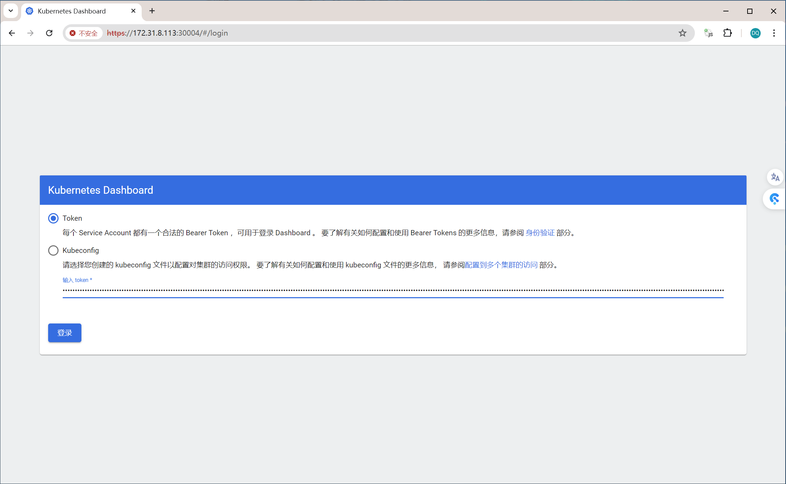

# 一：k8s项目规划

```sh
## kubernetes实战案例--优势

业务容器化优势：
1、提高资源利用率，节约部署IT成本。

2、提高部署效率，基于kubernetes实现微服务的快速部署与交付、容器的批量调度与秒级启动。

3、实现横向扩容、灰度部署、回滚、链路追踪、服务治理等。

4、可根据业务负载进行自动弹性伸缩。
根据CPU利用率来判断，基于node的CPU利用率弹性伸缩的。

5、容器将环境和代码打包在镜像内，保证了测试与生产运行环境的一致性。

6、紧跟云原生社区技术发展的步伐，不给公司遗留技术债，为后期技术升级夯实了基础。

7、为个人储备前沿技术，提高个人level。
```

# 二：镜像分层构建和实战案例

## 2.1：镜像分层构建介绍


```sh
制作镜像的原则：
官方原镜像 ----> OS基础镜像 ----> 服务镜像 ----> 业务镜像

1. 基础镜像
先写个Dockerfile，基于官方的centos或者ubutntu镜像，安装最基本运行环境，比如gcc，jdk，一些常用的命令等等。
装好之后，提交成一个镜像。包括公司需要的最基本的运行环境。常用命令和编译环境。

2. 服务镜像
在基础镜像之上，安装nginx或者tomcat，但是这里不包含代码。可以给多个不同的项目的服务去用。

3. 业务镜像
配置和代码放进去。这就是业务镜像。

PS：不推荐直接下某个服务的镜像，还是要自己通过OS基础镜像来自己打镜像。
```

## 2.2：CI/CD基本流程


```sh
1. push：开发人员先开发好代码，使用push上传到公司的gitlab。

2. clone：通过jenkins来调用脚本或者使用命令，把gitlab上的代码clone下来。

3. mvn：把代码编译为jar包或者war包，这个叫制品。

4. build image：把jar包或者war包放在和dockerfile相同的目录，执行构建，生成镜像。

5. push image：把镜像上传到harbor。

6. update image：jenkins通过命令或者客户端来调用k8s的API，就是执行kubectl命令或者通过API更新镜像。

7. rolling update：k8s在内部进行滚动更新。把pod版本从1更新到2。这是k8s内部自动完成的。
前提是镜像的代码和配置必须正确。
```

## 2.3：实战案例 -- 自定义镜像运行nginx及java服务并基于nfs实现动静分离

### 2.3.1：构建基础镜像

```sh
# 进入到镜像构建文件Dockfile的目录
# 最终目录是：/opt/k8s-data/dockerfile/system/centos
[root@k8s-master1:/opt]# ll
total 0
drwxr-xr-x  5 root root  52 Jul  5 12:13 ./
drwxr-xr-x 19 root root 291 Jan  3  2024 ../
drwx--x--x  4 root root  28 Jun 27 10:50 containerd/
drwxr-xr-x  5 root root  51 Jul  5 12:13 k8s-data/
drwxr-xr-x  4 root root  31 Jun 27 11:09 kube/

[root@k8s-master1:/opt]# cd k8s-data/
[root@k8s-master1:/opt/k8s-data]# ll
total 0
drwxr-xr-x 5 root root 51 Jul  5 12:13 ./
drwxr-xr-x 5 root root 52 Jul  5 12:13 ../
drwxr-xr-x 4 root root 31 Jul  5 12:13 dockerfile/
drwxr-xr-x 4 root root 39 Jul  5 12:13 linux40/
drwxr-xr-x 4 root root 38 Jul  5 12:13 yaml/

[root@k8s-master1:/opt/k8s-data]# cd dockerfile
[root@k8s-master1:/opt/k8s-data/dockerfile]# ls
system  web

[root@k8s-master1:/opt/k8s-data/dockerfile]# cd system/
[root@k8s-master1:/opt/k8s-data/dockerfile/system]# ll
total 0
drwxr-xr-x 3 root root 20 Jul  5 12:13 ./
drwxr-xr-x 4 root root 31 Jul  5 12:13 ../
drwxr-xr-x 2 root root 82 Jul  5 12:13 centos/

[root@k8s-master1:/opt/k8s-data/dockerfile/system]# cd centos/
[root@k8s-master1:/opt/k8s-data/dockerfile/system/centos]# ls
Dockerfile  base.repo  build-command.sh  epel.repo  filebeat-7.12.1-x86_64.rpm

# 编写Dockerfile，自定义CentOS基础镜像
[root@k8s-master1:/opt/k8s-data/dockerfile/system/centos]# vim Dockerfile
#自定义Centos 基础镜像
FROM centos:7.9.2009 
MAINTAINER Jack.Zhang  2973707860@qq.com

RUN rm -rf /etc/yum.repos.d/*
ADD filebeat-7.12.1-x86_64.rpm /tmp
ADD base.repo epel.repo /etc/yum.repos.d/
RUN yum install -y /tmp/filebeat-7.12.1-x86_64.rpm vim wget tree  lrzsz gcc gcc-c++ automake pcre pcre-devel zlib zlib-devel openssl openssl-devel iproute net-tools iotop &&  rm -rf /etc/localtime /tmp/filebeat-7.12.1-x86_64.rpm && ln -snf /usr/share/zoneinfo/Asia/Shanghai /etc/localtime 

PS：
把filebeat加进去，后面会用来做日志收集，所以这里提前装好。
gcc编译环境
把时区文件删除，把安装后的rpm包删除
把上海时区的软链接过来。

PS：
这里增加了两个文件base.repo，epel.repo，是因为官网镜像的base源和epel源有问题，换成有效的阿里源
[root@k8s-master1:/opt/k8s-data/dockerfile/system/centos]# cat base.repo
[base]
name=base
baseurl=https://mirrors.aliyun.com/centos/$releasever/os/$basearch/
gpgcheck=1
gpgkey=file:///etc/pki/rpm-gpg/RPM-GPG-KEY-CentOS-$releasever

[extras]
name=extras
baseurl=https://mirrors.aliyun.com/centos/$releasever/extras/$basearch/
gpgcheck=1
gpgkey=file:///etc/pki/rpm-gpg/RPM-GPG-KEY-CentOS-$releasever

[updates]
name=updates
baseurl=https://mirrors.aliyun.com/centos/$releasever/updates/$basearch/
gpgcheck=1
gpgkey=file:///etc/pki/rpm-gpg/RPM-GPG-KEY-CentOS-$releasever

[centosplus]
name=centosplus
baseurl=https://mirrors.aliyun.com/centos/$releasever/centosplus/$basearch/
gpgcheck=1
gpgkey=file:///etc/pki/rpm-gpg/RPM-GPG-KEY-CentOS-$releasever

[root@k8s-master1:/opt/k8s-data/dockerfile/system/centos]# cat epel.repo
[epel]
name=epel
baseurl=https://mirrors.aliyun.com/epel/$releasever/$basearch/
gpgcheck=1
gpgkey=https://mirrors.aliyun.com/epel/RPM-GPG-KEY-EPEL-$releasever

# 构建脚本
# 构建后将镜像上传到harbor服务器，harbor.sunnycreek.local
[root@k8s-master1:/opt/k8s-data/dockerfile/system/centos]# vim build-command.sh 
#!/bin/bash
docker build -t  harbor.sunnycreek.local/baseimages/magedu-centos-base:7.9.2009 .
docker push harbor.sunnycreek.local/baseimages/magedu-centos-base:7.9.2009

PS：
注意docker build命令后面有个.

# docker构建镜像服务器，需要有harbor的证书（通常会有单独的服务器来完成这个任务）
[root@k8s-master1:/opt/k8s-data/dockerfile/system/centos]# ls /etc/docker/certs.d/harbor.sunnycreek.local/
harbor-ca.crt

# 构建镜像
[root@k8s-master1:/opt/k8s-data/dockerfile/system/centos]# bash build-command.sh

[root@k8s-master1:/opt/k8s-data/dockerfile/system/centos]# docker images
REPOSITORY                                              TAG                  IMAGE ID       CREATED         SIZE
harbor.sunnycreek.local/baseimages/magedu-centos-base   7.9.2009             a4e1a544c9d2   4 minutes ago   881MB

PS：
目前镜像已经上传到harbor服务器。
```

### 2.3.2：构建jdk镜像

```sh
# 最终目录是：/opt/k8s-data/dockerfile/web/pub-images/jdk-1.8.212
[root@k8s-master1:/opt/k8s-data/dockerfile/system/centos]# cd ../../web
[root@k8s-master1:/opt/k8s-data/dockerfile/web]# pwd
/opt/k8s-data/dockerfile/web

[root@k8s-master1:/opt/k8s-data/dockerfile/web]# ll
total 0
drwxr-xr-x  4 root root  38 Jul  5 12:13 ./
drwxr-xr-x  4 root root  31 Jul  5 12:13 ../
drwxr-xr-x 11 root root 153 Jul  5 12:13 magedu/
drwxr-xr-x  6 root root  97 Jul  5 12:13 pub-images/

[root@k8s-master1:/opt/k8s-data/dockerfile/web]# cd magedu/
[root@k8s-master1:/opt/k8s-data/dockerfile/web/magedu]# ls
dubbo  jenkins  nginx  redis  redis-cluster  tomcat-app1  tomcat-app2  wordpress  zookeeper

[root@k8s-master1:/opt/k8s-data/dockerfile/web/magedu]# cd ../pub-images/
[root@k8s-master1:/opt/k8s-data/dockerfile/web/pub-images]# ls
jdk-1.8.212  nginx-base  nginx-base-wordpress  tomcat-base-8.5.43

## 现在以基础镜像为基础，构建JDK镜像
[root@k8s-master1:/opt/k8s-data/dockerfile/web/pub-images/jdk-1.8.212]# ls
Dockerfile  build-command.sh  jdk-8u212-linux-x64.tar.gz  profile

# 编写Dockerfile文件，制作jdk镜像
[root@k8s-master1:/opt/k8s-data/dockerfile/web/pub-images/jdk-1.8.212]# vim Dockerfile
#JDK Base Image
FROM harbor.sunnycreek.local/baseimages/magedu-centos-base:7.9.2009 

MAINTAINER zhangshijie "zhangshijie@magedu.net"

ADD jdk-8u212-linux-x64.tar.gz /usr/local/src/
RUN ln -sv /usr/local/src/jdk1.8.0_212 /usr/local/jdk 
ADD profile /etc/profile

ENV JAVA_HOME /usr/local/jdk
ENV JRE_HOME $JAVA_HOME/jre
ENV CLASSPATH $JAVA_HOME/lib/:$JRE_HOME/lib/
ENV PATH $PATH:$JAVA_HOME/bin

# profile文件内容
[root@k8s-master1:/opt/k8s-data/dockerfile/web/pub-images/jdk-1.8.212]# cat profile
# /etc/profile

# System wide environment and startup programs, for login setup
# Functions and aliases go in /etc/bashrc

# It's NOT a good idea to change this file unless you know what you
# are doing. It's much better to create a custom.sh shell script in
# /etc/profile.d/ to make custom changes to your environment, as this
# will prevent the need for merging in future updates.

pathmunge () {
    case ":${PATH}:" in
        *:"$1":*)
            ;;
        *)
            if [ "$2" = "after" ] ; then
                PATH=$PATH:$1
            else
                PATH=$1:$PATH
            fi
    esac
}


if [ -x /usr/bin/id ]; then
    if [ -z "$EUID" ]; then
        # ksh workaround
        EUID=`/usr/bin/id -u`
        UID=`/usr/bin/id -ru`
    fi
    USER="`/usr/bin/id -un`"
    LOGNAME=$USER
    MAIL="/var/spool/mail/$USER"
fi

# Path manipulation
if [ "$EUID" = "0" ]; then
    pathmunge /usr/sbin
    pathmunge /usr/local/sbin
else
    pathmunge /usr/local/sbin after
    pathmunge /usr/sbin after
fi

HOSTNAME=`/usr/bin/hostname 2>/dev/null`
HISTSIZE=1000
if [ "$HISTCONTROL" = "ignorespace" ] ; then
    export HISTCONTROL=ignoreboth
else
    export HISTCONTROL=ignoredups
fi

export PATH USER LOGNAME MAIL HOSTNAME HISTSIZE HISTCONTROL

# By default, we want umask to get set. This sets it for login shell
# Current threshold for system reserved uid/gids is 200
# You could check uidgid reservation validity in
# /usr/share/doc/setup-*/uidgid file
if [ $UID -gt 199 ] && [ "`/usr/bin/id -gn`" = "`/usr/bin/id -un`" ]; then
    umask 002
else
    umask 022
fi

for i in /etc/profile.d/*.sh /etc/profile.d/sh.local ; do
    if [ -r "$i" ]; then
        if [ "${-#*i}" != "$-" ]; then 
            . "$i"
        else
            . "$i" >/dev/null
        fi
    fi
done

unset i
unset -f pathmunge
export LANG=en_US.UTF-8
export HISTTIMEFORMAT="%F %T `whoami` "

export JAVA_HOME=/usr/local/jdk
export TOMCAT_HOME=/apps/tomcat
export PATH=$JAVA_HOME/bin:$JAVA_HOME/jre/bin:$TOMCAT_HOME/bin:$PATH
export CLASSPATH=.$CLASSPATH:$JAVA_HOME/lib:$JAVA_HOME/jre/lib:$JAVA_HOME/lib/tools.jar

PS：
profile就是export一些JAVA的环境变量。
通过ENV声明JAVA的环境变量。

# 编辑构建脚本文件build-command.sh
[root@k8s-master1:/opt/k8s-data/dockerfile/web/pub-images/jdk-1.8.212]# vim build-command.sh 
#!/bin/bash
docker build -t harbor.sunnycreek.local/pub-images/jdk-base:v8.212  .
sleep 1
docker push  harbor.sunnycreek.local/pub-images/jdk-base:v8.212

# harbor服务器上创建pub-images目录
项目名称：pub-images
访问级别：public
项目配额限制：-1

# 通过脚本构建jdk镜像
[root@k8s-master1:/opt/k8s-data/dockerfile/web/pub-images/jdk-1.8.212]# bash build-command.sh

[root@k8s-master1:/opt/k8s-data/dockerfile/web/pub-images/jdk-1.8.212]# docker images
REPOSITORY                                              TAG                  IMAGE ID       CREATED              SIZE
harbor.sunnycreek.local/pub-images/jdk-base             v8.212               89781c38300f   About a minute ago   1.29GB


# 检查harbor服务器
发现harbor服务器已经上传了刚刚创建的jdk镜像

这样jdk镜像就创建完毕了。
```

### 2.3.3：构建nginx镜像

```sh
# 最终目录是：/opt/k8s-data/dockerfile/web/pub-images/nginx-base
[root@k8s-master1:/opt/k8s-data/dockerfile/web/pub-images/jdk-1.8.212]# cd ../nginx-base
[root@k8s-master1:/opt/k8s-data/dockerfile/web/pub-images/nginx-base]# ls
Dockerfile  build-command.sh  nginx-1.20.2.tar.gz

# 编辑Dockfile文件，构建nginx镜像
[root@k8s-master1:/opt/k8s-data/dockerfile/web/pub-images/nginx-base]# vim Dockerfile
#Nginx Base Image
FROM harbor.sunnycreek.local/baseimages/magedu-centos-base:7.9.2009 

MAINTAINER  zhangshijie@magedu.net

RUN yum install -y vim wget tree  lrzsz gcc gcc-c++ automake pcre pcre-devel zlib zlib-devel openssl openssl-devel iproute net-tools iotop
ADD nginx-1.20.2.tar.gz /usr/local/src/
RUN cd /usr/local/src/nginx-1.20.2 && ./configure  && make && make install && ln -sv  /usr/local/nginx/sbin/nginx /usr/sbin/nginx  && rm -rf /usr/local/src/nginx-1.20.2.tar.gz 

PS：
解压nginx文件到/usr/local/src
编译安装nginx
创建软链接
删除复制到镜像中的nginx压缩文件

# 编辑构建镜像的脚本文件
[root@k8s-master1:/opt/k8s-data/dockerfile/web/pub-images/nginx-base]# vim build-command.sh 
#!/bin/bash
docker build -t harbor.sunnycreek.local/pub-images/nginx-base:v1.20.2  .
sleep 1
docker push  harbor.sunnycreek.local/pub-images/nginx-base:v1.20.2

# 构建nginx镜像
[root@k8s-master1:/opt/k8s-data/dockerfile/web/pub-images/nginx-base]# bash build-command.sh

[root@k8s-master1:/opt/k8s-data/dockerfile/web/pub-images/nginx-base]# docker images
REPOSITORY                                              TAG                  IMAGE ID       CREATED              SIZE
harbor.sunnycreek.local/pub-images/nginx-base           v1.20.2              e38fc81ebda0   About a minute ago   1.25GB

# 查看harbor中的镜像
刚刚创建的nginx已经上传。
```

### 2.3.4：构建tomcat镜像

```sh
[root@k8s-master1:/opt/k8s-data/dockerfile/web/pub-images/tomcat-base-8.5.43]# ls
Dockerfile  apache-tomcat-8.5.43.tar.gz  build-command.sh

# 编辑tomcat的Dockerfile文件
[root@k8s-master1:/opt/k8s-data/dockerfile/web/pub-images/tomcat-base-8.5.43]# vim Dockerfile
#Tomcat 8.5.43基础镜像
FROM harbor.sunnycreek.local/pub-images/jdk-base:v8.212 

MAINTAINER zhangshijie "zhangshijie@magedu.net"

RUN mkdir /apps /data/tomcat/webapps /data/tomcat/logs -pv 
ADD apache-tomcat-8.5.43.tar.gz  /apps
RUN useradd tomcat -u 2050 && ln -sv /apps/apache-tomcat-8.5.43 /apps/tomcat && chown -R tomcat.tomcat /apps /data

PS：
/apps 是放tomcat的
/data/tomcat/webapps 是放war包的
/data/tomcat/logs 是放一些log文件的
创建web服务的普通用户，做软链接，把tomcat目录改成普通用户和普通组

# 编辑构建镜像的脚本
[root@k8s-master1:/opt/k8s-data/dockerfile/web/pub-images/tomcat-base-8.5.43]# vim build-command.sh 
#!/bin/bash
docker build -t harbor.sunnycreek.local/pub-images/tomcat-base:v8.5.43  .
sleep 3
docker push  harbor.sunnycreek.local/pub-images/tomcat-base:v8.5.43

# 构建tomcat镜像
[root@k8s-master1:/opt/k8s-data/dockerfile/web/pub-images/tomcat-base-8.5.43]# bash build-command.sh

[root@k8s-master1:/opt/k8s-data/dockerfile/web/pub-images/tomcat-base-8.5.43]# docker images
REPOSITORY                                              TAG                  IMAGE ID       CREATED          SIZE
harbor.sunnycreek.local/pub-images/tomcat-base          v8.5.43              e54fd017af2c   14 seconds ago   1.32GB

# 检查harbor仓库
刚创建的tomcat镜像已经存在

# 验证tomcat镜像
[root@k8s-master1:/opt/k8s-data/dockerfile/web/pub-images/tomcat-base-8.5.43]# docker run -it --rm harbor.sunnycreek.local/pub-images/tomcat-base:v8.5.43 bash
[root@0d9737304cba /]# ls /apps/tomcat/
BUILDING.txt     LICENSE  README.md      RUNNING.txt  conf  logs  webapps
CONTRIBUTING.md  NOTICE   RELEASE-NOTES  bin          lib   temp  work
[root@0d9737304cba /]# /apps/tomcat/bin/catalina.sh run
......
06-Jul-2024 05:39:10.850 INFO [main] org.apache.catalina.startup.Catalina.start Server startup in 499 ms
ctrl+C
[root@0d9737304cba /]# ls /data/ -l -d
drwxr-xr-x 1 tomcat tomcat 20 Jul  6 05:30 /data/
[root@0d9737304cba /]# exit
exit

PS：
/data/的属主和属组
catalina能否运行
```

### 2.3.5：构建java业务镜像

```sh
# 最终目录是：/opt/k8s-data/dockerfile/web/magedu/tomcat-app1，注意这是业务镜像，注意目录层次的变化
[root@k8s-master1:/opt/k8s-data/dockerfile/web/pub-images/tomcat-base-8.5.43]# cd ../../magedu/tomcat-app1
[root@k8s-master1:/opt/k8s-data/dockerfile/web/magedu/tomcat-app1]# ll
total 23580
drwxr-xr-x  3 root root      209 Jul  5 12:13 ./
drwxr-xr-x 11 root root      153 Jul  5 12:13 ../
-rw-r--r--  1 root root      537 Jul  5 12:13 Dockerfile
-rw-r--r--  1 root root      154 Jul  5 12:13 app1.tar.gz
-rw-r--r--  1 root root      151 Jul  5 12:13 build-command.sh
-rw-r--r--  1 root root    23611 Jul  5 12:13 catalina.sh
-rw-r--r--  1 root root 24086235 Jul  5 12:13 filebeat-7.5.1-x86_64.rpm
-rw-r--r--  1 root root      667 Jul  5 12:13 filebeat.yml
-rw-r--r--  1 root root       63 Jul  5 12:13 index.html
drwxr-xr-x  2 root root       24 Jul  5 12:13 myapp/
-rw-r--r--  1 root root      373 Jul  5 12:13 run_tomcat.sh
-rw-r--r--  1 root root     6462 Jul  5 12:13 server.xml

# 增加文件可执行权限
[root@k8s-master1:/opt/k8s-data/dockerfile/web/magedu/tomcat-app1]# chmod a+x run_tomcat.sh 
[root@k8s-master1:/opt/k8s-data/dockerfile/web/magedu/tomcat-app1]# chmod a+x catalina.sh
[root@k8s-master1:/opt/k8s-data/dockerfile/web/magedu/tomcat-app1]# chmod a+x build-command.sh

# 修改Dockerfile文件，制作java业务镜像
[root@k8s-master1:/opt/k8s-data/dockerfile/web/magedu/tomcat-app1]# vim Dockerfile
#tomcat web1
FROM harbor.sunnycreek.local/pub-images/tomcat-base:v8.5.43

ADD catalina.sh /apps/tomcat/bin/catalina.sh
ADD server.xml /apps/tomcat/conf/server.xml
#ADD myapp/* /data/tomcat/webapps/myapp/
ADD app1.tar.gz /data/tomcat/webapps/myapp/
ADD run_tomcat.sh /apps/tomcat/bin/run_tomcat.sh
#ADD filebeat.yml /etc/filebeat/filebeat.yml 
RUN chown  -R tomcat.tomcat /data/ /apps/
#ADD filebeat-7.5.1-x86_64.rpm /tmp/
#RUN cd /tmp && yum localinstall -y filebeat-7.5.1-amd64.deb

EXPOSE 8080 8443

CMD ["/apps/tomcat/bin/run_tomcat.sh"]

# server.xml
[root@k8s-master1:/opt/k8s-data/dockerfile/web/magedu/tomcat-app1]# cat server.xml 
<?xml version='1.0' encoding='utf-8'?>
<!--
  Licensed to the Apache Software Foundation (ASF) under one or more
  contributor license agreements.  See the NOTICE file distributed with
  this work for additional information regarding copyright ownership.
  The ASF licenses this file to You under the Apache License, Version 2.0
  (the "License"); you may not use this file except in compliance with
  the License.  You may obtain a copy of the License at

      http://www.apache.org/licenses/LICENSE-2.0

  Unless required by applicable law or agreed to in writing, software
  distributed under the License is distributed on an "AS IS" BASIS,
  WITHOUT WARRANTIES OR CONDITIONS OF ANY KIND, either express or implied.
  See the License for the specific language governing permissions and
  limitations under the License.
-->
<!-- Note:  A "Server" is not itself a "Container", so you may not
     define subcomponents such as "Valves" at this level.
     Documentation at /docs/config/server.html
 -->
<Server port="8005" shutdown="SHUTDOWN">
  <Listener className="org.apache.catalina.startup.VersionLoggerListener" />
  <!-- Security listener. Documentation at /docs/config/listeners.html
  <Listener className="org.apache.catalina.security.SecurityListener" />
  -->
  <!--APR library loader. Documentation at /docs/apr.html -->
  <Listener className="org.apache.catalina.core.AprLifecycleListener" SSLEngine="on" />
  <!-- Prevent memory leaks due to use of particular java/javax APIs-->
  <Listener className="org.apache.catalina.core.JreMemoryLeakPreventionListener" />
  <Listener className="org.apache.catalina.mbeans.GlobalResourcesLifecycleListener" />
  <Listener className="org.apache.catalina.core.ThreadLocalLeakPreventionListener" />

  <!-- Global JNDI resources
       Documentation at /docs/jndi-resources-howto.html
  -->
  <GlobalNamingResources>
    <!-- Editable user database that can also be used by
         UserDatabaseRealm to authenticate users
    -->
    <Resource name="UserDatabase" auth="Container"
              type="org.apache.catalina.UserDatabase"
              description="User database that can be updated and saved"
              factory="org.apache.catalina.users.MemoryUserDatabaseFactory"
              pathname="conf/tomcat-users.xml" />
  </GlobalNamingResources>

  <!-- A "Service" is a collection of one or more "Connectors" that share
       a single "Container" Note:  A "Service" is not itself a "Container",
       so you may not define subcomponents such as "Valves" at this level.
       Documentation at /docs/config/service.html
   -->
  <Service name="Catalina">

    <!--The connectors can use a shared executor, you can define one or more named thread pools-->
    <!--
    <Executor name="tomcatThreadPool" namePrefix="catalina-exec-"
        maxThreads="150" minSpareThreads="4"/>
    -->


    <!-- A "Connector" represents an endpoint by which requests are received
         and responses are returned. Documentation at :
         Java HTTP Connector: /docs/config/http.html (blocking & non-blocking)
         Java AJP  Connector: /docs/config/ajp.html
         APR (HTTP/AJP) Connector: /docs/apr.html
         Define a non-SSL/TLS HTTP/1.1 Connector on port 8080
    -->
    <Connector port="8080" protocol="HTTP/1.1"
               connectionTimeout="20000"
               redirectPort="8443" />
    <!-- A "Connector" using the shared thread pool-->
    <!--
    <Connector executor="tomcatThreadPool"
               port="8080" protocol="HTTP/1.1"
               connectionTimeout="20000"
               redirectPort="8443" />
    -->
    <!-- Define a SSL/TLS HTTP/1.1 Connector on port 8443
         This connector uses the NIO implementation that requires the JSSE
         style configuration. When using the APR/native implementation, the
         OpenSSL style configuration is required as described in the APR/native
         documentation -->
    <!--
    <Connector port="8443" protocol="org.apache.coyote.http11.Http11NioProtocol"
               maxThreads="150" SSLEnabled="true" scheme="https" secure="true"
               clientAuth="false" sslProtocol="TLS" />
    -->

    <!-- Define an AJP 1.3 Connector on port 8009 -->
    <Connector port="8009" protocol="AJP/1.3" redirectPort="8443" />


    <!-- An Engine represents the entry point (within Catalina) that processes
         every request.  The Engine implementation for Tomcat stand alone
         analyzes the HTTP headers included with the request, and passes them
         on to the appropriate Host (virtual host).
         Documentation at /docs/config/engine.html -->

    <!-- You should set jvmRoute to support load-balancing via AJP ie :
    <Engine name="Catalina" defaultHost="localhost" jvmRoute="jvm1">
    -->
    <Engine name="Catalina" defaultHost="localhost">

      <!--For clustering, please take a look at documentation at:
          /docs/cluster-howto.html  (simple how to)
          /docs/config/cluster.html (reference documentation) -->
      <!--
      <Cluster className="org.apache.catalina.ha.tcp.SimpleTcpCluster"/>
      -->

      <!-- Use the LockOutRealm to prevent attempts to guess user passwords
           via a brute-force attack -->
      <Realm className="org.apache.catalina.realm.LockOutRealm">
        <!-- This Realm uses the UserDatabase configured in the global JNDI
             resources under the key "UserDatabase".  Any edits
             that are performed against this UserDatabase are immediately
             available for use by the Realm.  -->
        <Realm className="org.apache.catalina.realm.UserDatabaseRealm"
               resourceName="UserDatabase"/>
      </Realm>

      <Host name="localhost"  appBase="/data/tomcat/webapps"  unpackWARs="false" autoDeploy="false">

        <!-- SingleSignOn valve, share authentication between web applications
             Documentation at: /docs/config/valve.html -->
        <!--
        <Valve className="org.apache.catalina.authenticator.SingleSignOn" />
        -->

        <!-- Access log processes all example.
             Documentation at: /docs/config/valve.html
             Note: The pattern used is equivalent to using pattern="common" -->
        <Valve className="org.apache.catalina.valves.AccessLogValve" directory="logs"
               prefix="localhost_access_log" suffix=".txt"
               pattern="%h %l %u %t &quot;%r&quot; %s %b" />

      </Host>
    </Engine>
  </Service>
</Server>


PS：
catalina.sh 启动脚本
server.xml 配置文件。这里将tomcat的appBase目录指向了/data/tomcat/webapps，那jar包就要放在这里，不要再放在默认的路径里。
myapps/ 下就是测试页面

[root@k8s-master1:/opt/k8s-data/dockerfile/web/magedu/tomcat-app1]# cat catalina.sh
......
JAVA_OPTS="-server -Xms1g -Xmx1g -Xss512k -Xmn1g -XX:CMSInitiatingOccupancyFraction=65  -XX:+UseFastAccessorMethods -XX:+AggressiveOpts -XX:+UseBiasedLocking -XX:+DisableExplicitGC -XX:MaxTenuringThreshold=10 -XX:NewSize=2048M -XX:MaxNewSize=2048M -XX:NewRatio=2 -XX:PermSize=128m -XX:MaxPermSize=512m -XX:CMSFullGCsBeforeCompaction=5 -XX:+ExplicitGCInvokesConcurrent -XX:+UseConcMarkSweepGC -XX:+UseParNewGC -XX:+CMSParallelRemarkEnabled"
......

PS：
启动脚本里，每个公司添加的优化参数都不一样
-Xms1g -Xmx1g  虚拟机环境没有那么多资源，暂时改成这个参数

# 把测试页面修改后打包
[root@k8s-master1:/opt/k8s-data/dockerfile/web/magedu/tomcat-app1]# cd myapp/
[root@k8s-master1:/opt/k8s-data/dockerfile/web/magedu/tomcat-app1/myapp]# ll
total 4
drwxr-xr-x 2 root root  24 Jul  5 12:13 ./
drwxr-xr-x 3 root root 209 Jul  5 17:44 ../
-rw-r--r-- 1 root root  35 Jul  5 12:13 index.html
[root@k8s-master1:/opt/k8s-data/dockerfile/web/magedu/tomcat-app1/myapp]# cat index.html
<h1>tomcat app1 for linux n66</h1>

# 查看压缩包文件结构
[root@k8s-master1:/opt/k8s-data/dockerfile/web/magedu/tomcat-app1]# cp app1.tar.gz /tmp/
[root@k8s-master1:/opt/k8s-data/dockerfile/web/magedu/tomcat-app1]# cd /tmp/
[root@k8s-master1:/tmp]# tar xvf app1.tar.gz
./index.html

PS：要保留这个压缩的结构

[root@k8s-master1:/opt/k8s-data/dockerfile/web/magedu/tomcat-app1/myapp]# ls
index.html
[root@k8s-master1:/opt/k8s-data/dockerfile/web/magedu/tomcat-app1/myapp]# tar czvf app1.tar.gz ./index.html
./index.html
[root@k8s-master1:/opt/k8s-data/dockerfile/web/magedu/tomcat-app1/myapp]# ls
app1.tar.gz  index.html
[root@k8s-master1:/opt/k8s-data/dockerfile/web/magedu/tomcat-app1/myapp]# cd ..
[root@k8s-master1:/opt/k8s-data/dockerfile/web/magedu/tomcat-app1]# mv myapp/app1.tar.gz .
[root@k8s-master1:/opt/k8s-data/dockerfile/web/magedu/tomcat-app1]# ls
Dockerfile   build-command.sh  filebeat-7.5.1-x86_64.rpm  index.html  run_tomcat.sh
app1.tar.gz  catalina.sh       filebeat.yml               myapp       server.xml

PS：
以上做的目的就是让这个压缩包能够解压添加到/data/tomcat/webapps/myapp/这个目录下
这个包解压完后，不带目录。

# tomcat运行脚本
[root@k8s-master1:/opt/k8s-data/dockerfile/web/magedu/tomcat-app1]# cat run_tomcat.sh 
#!/bin/bash
#echo "nameserver 223.6.6.6" > /etc/resolv.conf
#echo "192.168.7.248 k8s-vip.example.com" >> /etc/hosts

#/usr/share/filebeat/bin/filebeat -e -c /etc/filebeat/filebeat.yml -path.home /usr/share/filebeat -path.config /etc/filebeat -path.data /var/lib/filebeat -path.logs /var/log/filebeat &
su - tomcat -c "/apps/tomcat/bin/catalina.sh start"
tail -f /etc/hosts

PS：
启动的脚本。普通用户把tomcat跑起来。
制作守护进程。tail -f /etc/hosts。初始化pid为1的守护进程。
CMD指定容器启动时执行脚本。

# 编辑构建脚本
[root@k8s-master1:/opt/k8s-data/dockerfile/web/magedu/tomcat-app1]# vim build-command.sh 
#!/bin/bash
TAG=$1
docker build -t  harbor.sunnycreek.local/magedu/tomcat-app1:${TAG} .
sleep 3
docker push  harbor.sunnycreek.local/magedu/tomcat-app1:${TAG}

PS：
因为经常需要更新代码，所以TAG不是固定的。

# harbor服务器上建立magedu目录
项目名称：magedu
访问级别：public
项目配额限制：-1

# 构建镜像并上传
[root@k8s-master1:/opt/k8s-data/dockerfile/web/magedu/tomcat-app1]# bash build-command.sh 20240705_180829

[root@k8s-master1:/opt/k8s-data/yaml/magedu/tomcat-app1]# docker images
REPOSITORY                                              TAG                  IMAGE ID       CREATED             SIZE
harbor.sunnycreek.local/magedu/tomcat-app1              20240705_180829      3966125a9e78   19 minutes ago      1.33GB

# 测试镜像，使用docker命令
[root@k8s-master1:/opt/k8s-data/dockerfile/web/magedu/tomcat-app1]# docker run -it --rm -p 8080:8080 harbor.sunnycreek.local/magedu/tomcat-app1:20240705_180829
Using CATALINA_BASE:   /apps/tomcat
Using CATALINA_HOME:   /apps/tomcat
Using CATALINA_TMPDIR: /apps/tomcat/temp
Using JRE_HOME:        /usr/local/jdk
Using CLASSPATH:       /apps/tomcat/bin/bootstrap.jar:/apps/tomcat/bin/tomcat-juli.jar
Tomcat started.
127.0.0.1	localhost
::1	localhost ip6-localhost ip6-loopback
fe00::0	ip6-localnet
ff00::0	ip6-mcastprefix
ff02::1	ip6-allnodes
ff02::2	ip6-allrouters
172.17.0.2	e47446598a8e

PS：
可以启动
这里注意脚本的执行权限问题。

访问
http://172.31.8.101:8080/myapp/
这是docker容器的启动方式，测试而已。
```


### 2.3.6：编写tomcat的yaml文件并在k8s中部署

```sh
# 最终目录是：/opt/k8s-data/yaml/magedu/tomcat-app1
[root@k8s-master1:~]# cd /opt/k8s-data/
[root@k8s-master1:/opt/k8s-data]# ls
dockerfile  linux40  yaml

[root@k8s-master1:/opt/k8s-data]# cd yaml
[root@k8s-master1:/opt/k8s-data/yaml]# ls
magedu  namespaces

[root@k8s-master1:/opt/k8s-data/yaml]# cd magedu
[root@k8s-master1:/opt/k8s-data/yaml/magedu]# ls
dubbo  jenkins  mysql  nginx  redis  redis-cluster  tomcat-app1  tomcat-app2  wordpress  zookeeper

[root@k8s-master1:/opt/k8s-data/yaml/magedu]# cd tomcat-app1
[root@k8s-master1:/opt/k8s-data/yaml/magedu/tomcat-app1]# ls
hpa.yaml  tomcat-app1.yaml

PS：
Dockerfile和yaml是有对应关系的，以免发生混乱。

# 准备nfs服务器的存储目录
[root@k8s-ha1:~]# ls /data
k8sdata  volumes
[root@k8s-ha1:~]# ls /data/k8sdata/
linux66  myserver
[root@k8s-ha1:~]# mkdir -p /data/k8sdata/magedu/static
[root@k8s-ha1:~]# mkdir -p /data/k8sdata/magedu/images

[root@k8s-ha1:~]# vim /etc/exports
/data/k8sdata *(rw,no_root_squash)
/data/k8sdata/myserver/myappdata *(rw,no_root_squash)
/data/volumes *(rw,no_root_squash)

# 编辑yaml文件
[root@k8s-master1:/opt/k8s-data/yaml/magedu/tomcat-app1]# vim tomcat-app1.yaml 
kind: Deployment
#apiVersion: extensions/v1beta1
apiVersion: apps/v1
metadata:
  labels:
    app: magedu-tomcat-app1-deployment-label
  name: magedu-tomcat-app1-deployment
  namespace: magedu
spec:
  replicas: 1
  selector:
    matchLabels:
      app: magedu-tomcat-app1-selector
  template:
    metadata:
      labels:
        app: magedu-tomcat-app1-selector
    spec:
      containers:
      - name: magedu-tomcat-app1-container
        image: harbor.sunnycreek.local/magedu/tomcat-app1:20240705_180829 
        #command: ["/apps/tomcat/bin/run_tomcat.sh"]
        imagePullPolicy: IfNotPresent
        #imagePullPolicy: Always
        ports:
        - containerPort: 8080
          protocol: TCP
          name: http
        env:
        - name: "password"
          value: "123456"
        - name: "age"
          value: "18"
        resources:
          limits:
            cpu: 1
            memory: "512Mi"
          requests:
            cpu: 500m
            memory: "512Mi"
        volumeMounts:
        - name: magedu-images
          mountPath: /usr/local/nginx/html/webapp/images
          readOnly: false
        - name: magedu-static
          mountPath: /usr/local/nginx/html/webapp/static
          readOnly: false
      volumes:
      - name: magedu-images
        nfs:
          server: 172.31.8.109
          path: /data/k8sdata/magedu/images
      - name: magedu-static
        nfs:
          server: 172.31.8.109
          path: /data/k8sdata/magedu/static
#      nodeSelector:
#        project: magedu
#        app: tomcat
---
kind: Service
apiVersion: v1
metadata:
  labels:
    app: magedu-tomcat-app1-service-label
  name: magedu-tomcat-app1-service
  namespace: magedu
spec:
  #type: NodePort
  ports:
  - name: http
    port: 80
    protocol: TCP
    targetPort: 8080
    #nodePort: 30092
  selector:
    app: magedu-tomcat-app1-selector

PS：
这里先不用管挂载，因为是存图片和静态文件的。

# 创建magedu的ns
[root@k8s-master1:/opt/k8s-data/yaml/magedu/tomcat-app1]# kubectl create ns magedu
namespace/magedu created

# 启动容器
[root@k8s-master1:/opt/k8s-data/yaml/magedu/tomcat-app1]# kubectl apply -f tomcat-app1.yaml 
deployment.apps/magedu-tomcat-app1-deployment created
service/magedu-tomcat-app1-service created

[root@k8s-master1:/opt/k8s-data/yaml/magedu/tomcat-app1]# kubectl get pods -n magedu
NAME                                             READY   STATUS    RESTARTS   AGE
magedu-tomcat-app1-deployment-595f5b7cf8-xrdmx   1/1     Running   0          168m

[root@k8s-master1:/opt/k8s-data/yaml/magedu/tomcat-app1]# kubectl get pods -n magedu -o wide
NAME                                             READY   STATUS    RESTARTS   AGE   IP               NODE           NOMINATED NODE   READINESS GATES
magedu-tomcat-app1-deployment-595f5b7cf8-xrdmx   1/1     Running   0          2m    10.200.70.103    172.31.8.113   <none>           <none>


# 需要service中开放NodePort才可以访问
[root@k8s-master1:/opt/k8s-data/yaml/magedu/tomcat-app1]# vim tomcat-app1.yaml
......
kind: Service
apiVersion: v1
metadata:
  labels:
    app: magedu-tomcat-app1-service-label
  name: magedu-tomcat-app1-service
  namespace: magedu
spec:
  type: NodePort
  ports:
  - name: http
    port: 80
    protocol: TCP
    targetPort: 8080
    nodePort: 30092
  selector:
    app: magedu-tomcat-app1-selector

[root@k8s-master1:/opt/k8s-data/yaml/magedu/tomcat-app1]# kubectl apply -f tomcat-app1.yaml 
deployment.apps/magedu-tomcat-app1-deployment configured
service/magedu-tomcat-app1-service configured

访问如下地址：
http://172.31.8.113:30092/myapp/
```


### 2.3.7：构建nginx业务镜像 -- 动静分离

```sh
# 最终目录是：/opt/k8s-data/dockerfile/web/magedu/nginx
[root@k8s-master1:/opt/k8s-data/dockerfile/web/magedu/nginx]# ll
total 20
drwxr-xr-x  3 root root  117 Jul  5 12:13 ./
drwxr-xr-x 11 root root  153 Jul  5 12:13 ../
-rw-r--r--  1 root root  486 Jul  5 12:13 Dockerfile
-rw-r--r--  1 root root  234 Jul  5 12:13 app1.tar.gz
-rw-r--r--  1 root root  232 Jul  5 12:13 build-command.sh
-rw-r--r--  1 root root   35 Jul  5 12:13 index.html
-rw-r--r--  1 root root 3147 Jul  5 12:13 nginx.conf
drwxr-xr-x  2 root root   24 Jul  5 12:13 webapp/

# 修改Dockerfile文件
[root@k8s-master1:/opt/k8s-data/dockerfile/web/magedu/nginx]# vim Dockerfile 
#Nginx 1.20.2
FROM harbor.sunnycreek.local/pub-images/nginx-base:v1.20.2 

RUN useradd tomcat -u 2050 
ADD nginx.conf /usr/local/nginx/conf/nginx.conf
ADD app1.tar.gz  /usr/local/nginx/html/webapp/
ADD index.html  /usr/local/nginx/html/index.html

#静态资源挂载路径
RUN mkdir -p /usr/local/nginx/html/webapp/static /usr/local/nginx/html/webapp/images && chown tomcat.tomcat -R /usr/local/nginx/html/webapp/static /usr/local/nginx/html/webapp/images 

EXPOSE 80 443

CMD ["nginx"] 

PS：
其实主要是写nginx.conf的配置文件

[root@k8s-master1:/opt/k8s-data/dockerfile/web/magedu/nginx]# vim Dockerfile 
user  tomcat tomcat;
worker_processes  auto;

#error_log  logs/error.log;
#error_log  logs/error.log  notice;
#error_log  logs/error.log  info;

#pid        logs/nginx.pid;
daemon off;

events {
    worker_connections  1024;
}


http {
    include       mime.types;
    default_type  application/octet-stream;

    #log_format  main  '$remote_addr - $remote_user [$time_local] "$request" '
    #                  '$status $body_bytes_sent "$http_referer" '
    #                  '"$http_user_agent" "$http_x_forwarded_for"';

    #access_log  logs/access.log  main;

    sendfile        on;
    #tcp_nopush     on;

    #keepalive_timeout  0;
    keepalive_timeout  65;

    #gzip  on;

upstream  tomcat_webserver {
        server  magedu-tomcat-app1-service.magedu.svc.sunnycreek.local:80; 
}

    server {
        listen       80;
        server_name  localhost;

        #charset koi8-r;

        #access_log  logs/host.access.log  main;

        location / {
            root   html;
            index  index.html index.htm;
        }

        location /webapp {
            root   html;
            index  index.html index.htm;
        }

        location /myapp {
             proxy_pass  http://tomcat_webserver;
             proxy_set_header   Host    $host;     # 添加头部字段。
             proxy_set_header   X-Forwarded-For $proxy_add_x_forwarded_for;
             proxy_set_header X-Real-IP $remote_addr;
        }

        #error_page  404              /404.html;

        # redirect server error pages to the static page /50x.html
        #
        error_page   500 502 503 504  /50x.html;
        location = /50x.html {
            root   html;
        }

        # proxy the PHP scripts to Apache listening on 127.0.0.1:80
        #
        #location ~ \.php$ {
        #    proxy_pass   http://127.0.0.1;
        #}

        # pass the PHP scripts to FastCGI server listening on 127.0.0.1:9000
        #
        #location ~ \.php$ {
        #    root           html;
        #    fastcgi_pass   127.0.0.1:9000;
        #    fastcgi_index  index.php;
        #    fastcgi_param  SCRIPT_FILENAME  /scripts$fastcgi_script_name;
        #    include        fastcgi_params;
        #}

        # deny access to .htaccess files, if Apache's document root
        # concurs with nginx's one
        #
        #location ~ /\.ht {
        #    deny  all;
        #}
    }


    # another virtual host using mix of IP-, name-, and port-based configuration
    #
    #server {
    #    listen       8000;
    #    listen       somename:8080;
    #    server_name  somename  alias  another.alias;

    #    location / {
    #        root   html;
    #        index  index.html index.htm;
    #    }
    #}


    # HTTPS server
    #
    #server {
    #    listen       443 ssl;
    #    server_name  localhost;

    #    ssl_certificate      cert.pem;
    #    ssl_certificate_key  cert.key;

    #    ssl_session_cache    shared:SSL:1m;
    #    ssl_session_timeout  5m;

    #    ssl_ciphers  HIGH:!aNULL:!MD5;
    #    ssl_prefer_server_ciphers  on;

    #    location / {
    #        root   html;
    #        index  index.html index.htm;
    #    }
    #}

}

PS：
启动nginx账号也是tomcat。要保证和后端tomcat启动的账号一样。同一个项目下要使用同一个用户。
nginx相当于是整个项目的访问入口。
nginx可能会写好多个location。
注意整个upstream的设置。要和service名字匹配，最好写全称。见下面的方法。
如果是静态文件，会nginx处理；如果是动态文件，会根据nginx指定的后端服务器，通过service，转给后端的tomat的pod。pod可以有一个或多个，它们挂在同一个存储服务器，数据都是一样的。
这时候，如果tomcat没启动，直接创建nginx是启动不了的，因为nginx要解析tomcat的service，但是这时候发现service没有后端服务器，就会报错。

# 通过service的name来找
[root@k8s-master1:/opt/k8s-data/yaml/magedu]# kubectl get svc -n magedu
NAME                         TYPE       CLUSTER-IP      EXTERNAL-IP   PORT(S)        AGE
magedu-tomcat-app1-service   NodePort   10.100.210.58   <none>        80:30092/TCP   52m

[root@k8s-master1:/opt/k8s-data/yaml/magedu]# kubectl get pods -n magedu
NAME                                             READY   STATUS    RESTARTS   AGE
magedu-tomcat-app1-deployment-595f5b7cf8-t6dws   1/1     Running   0          55m
magedu-tomcat-app1-deployment-595f5b7cf8-xrdmx   1/1     Running   0          55m

[root@k8s-master1:/opt/k8s-data/yaml/magedu]# kubectl exec -it -n magedu magedu-tomcat-app1-deployment-595f5b7cf8-t6dws -- bash
[root@magedu-tomcat-app1-deployment-595f5b7cf8-t6dws /]# cat /etc/resolv.conf
search magedu.svc.sunnycreek.local svc.sunnycreek.local sunnycreek.local
nameserver 10.100.0.2
options ndots:5
[root@magedu-tomcat-app1-deployment-595f5b7cf8-t6dws /]# exit
exit

PS：
magedu-tomcat-app1-service
magedu.svc.sunnycreek.local
二者组成了全称，magedu-tomcat-app1-service.magedu.svc.sunnycreek.local


# nginx的页面就是个测试文件
[root@k8s-master1:/opt/k8s-data/dockerfile/web/magedu/nginx]# cat webapp/index.html
<!DOCTYPE html>
<html lang="en">
<head>
    <meta charset="UTF-8">
    <title>Devops</title>
</head>
<body>
<h1>magedu devops v11111111</h1>
</body>
</html>


# 编辑构建镜像的脚本
[root@k8s-master1:/opt/k8s-data/dockerfile/web/magedu/nginx]# vim build-command.sh 
#!/bin/bash
TAG=$1
docker build -t harbor.sunnycreek.local/magedu/nginx-web1:${TAG} .
echo "镜像构建完成，即将上传到harbor"
sleep 1
docker push harbor.sunnycreek.local/magedu/nginx-web1:${TAG}
echo "镜像上传到harbor完成"

# 构建nginx镜像
[root@k8s-master1:/opt/k8s-data/dockerfile/web/magedu/nginx]# bash build-command.sh 20240705_195646

[root@k8s-master1:/opt/k8s-data/dockerfile/web/magedu/nginx]# docker images
REPOSITORY                                              TAG                  IMAGE ID       CREATED              SIZE
harbor.sunnycreek.local/magedu/nginx-web1               20240705_195646      7d637784b711   About a minute ago   1.25GB

# 检查harbor镜像
此镜像已经上传

# 测试镜像能否启动
[root@k8s-master1:/opt/k8s-data/dockerfile/web/magedu/nginx]# docker run -it --rm harbor.sunnycreek.local/magedu/nginx-web1:20240705_195646 bash
[root@81fe05b1c636 /]# cat /etc/passwd
root:x:0:0:root:/root:/bin/bash
bin:x:1:1:bin:/bin:/sbin/nologin
daemon:x:2:2:daemon:/sbin:/sbin/nologin
adm:x:3:4:adm:/var/adm:/sbin/nologin
lp:x:4:7:lp:/var/spool/lpd:/sbin/nologin
sync:x:5:0:sync:/sbin:/bin/sync
shutdown:x:6:0:shutdown:/sbin:/sbin/shutdown
halt:x:7:0:halt:/sbin:/sbin/halt
mail:x:8:12:mail:/var/spool/mail:/sbin/nologin
operator:x:11:0:operator:/root:/sbin/nologin
games:x:12:100:games:/usr/games:/sbin/nologin
ftp:x:14:50:FTP User:/var/ftp:/sbin/nologin
nobody:x:99:99:Nobody:/:/sbin/nologin
systemd-network:x:192:192:systemd Network Management:/:/sbin/nologin
dbus:x:81:81:System message bus:/:/sbin/nologin
tomcat:x:2050:2050::/home/tomcat:/bin/bash
[root@81fe05b1c636 /]# cat /usr/local/nginx/conf/nginx.conf
user  tomcat tomcat;
worker_processes  auto;

#error_log  logs/error.log;
#error_log  logs/error.log  notice;
#error_log  logs/error.log  info;

#pid        logs/nginx.pid;
daemon off;

events {
    worker_connections  1024;
}


http {
    include       mime.types;
    default_type  application/octet-stream;

    #log_format  main  '$remote_addr - $remote_user [$time_local] "$request" '
    #                  '$status $body_bytes_sent "$http_referer" '
    #                  '"$http_user_agent" "$http_x_forwarded_for"';

    #access_log  logs/access.log  main;

    sendfile        on;
    #tcp_nopush     on;

    #keepalive_timeout  0;
    keepalive_timeout  65;

    #gzip  on;

upstream  tomcat_webserver {
        server  magedu-tomcat-app1-service.magedu.svc.sunnycreek.local:80; 
}

    server {
        listen       80;
        server_name  localhost;

        #charset koi8-r;

        #access_log  logs/host.access.log  main;

        location / {
            root   html;
            index  index.html index.htm;
        }

        location /webapp {
            root   html;
            index  index.html index.htm;
        }

        location /myapp {
             proxy_pass  http://tomcat_webserver;
             proxy_set_header   Host    $host;
             proxy_set_header   X-Forwarded-For $proxy_add_x_forwarded_for;
             proxy_set_header X-Real-IP $remote_addr;
        }

        #error_page  404              /404.html;

        # redirect server error pages to the static page /50x.html
        #
        error_page   500 502 503 504  /50x.html;
        location = /50x.html {
            root   html;
        }

        # proxy the PHP scripts to Apache listening on 127.0.0.1:80
        #
        #location ~ \.php$ {
        #    proxy_pass   http://127.0.0.1;
        #}

        # pass the PHP scripts to FastCGI server listening on 127.0.0.1:9000
        #
        #location ~ \.php$ {
        #    root           html;
        #    fastcgi_pass   127.0.0.1:9000;
        #    fastcgi_index  index.php;
        #    fastcgi_param  SCRIPT_FILENAME  /scripts$fastcgi_script_name;
        #    include        fastcgi_params;
        #}

        # deny access to .htaccess files, if Apache's document root
        # concurs with nginx's one
        #
        #location ~ /\.ht {
        #    deny  all;
        #}
    }


    # another virtual host using mix of IP-, name-, and port-based configuration
    #
    #server {
    #    listen       8000;
    #    listen       somename:8080;
    #    server_name  somename  alias  another.alias;

    #    location / {
    #        root   html;
    #        index  index.html index.htm;
    #    }
    #}


    # HTTPS server
    #
    #server {
    #    listen       443 ssl;
    #    server_name  localhost;

    #    ssl_certificate      cert.pem;
    #    ssl_certificate_key  cert.key;

    #    ssl_session_cache    shared:SSL:1m;
    #    ssl_session_timeout  5m;

    #    ssl_ciphers  HIGH:!aNULL:!MD5;
    #    ssl_prefer_server_ciphers  on;

    #    location / {
    #        root   html;
    #        index  index.html index.htm;
    #    }
    #}

}
[root@81fe05b1c636 /]# exit
exit

PS：
检查tomcat账号是否存在
检查nginx.conf配置文件是否存在

# 测试镜像启动后能否访问，给个访问端口
[root@k8s-master1:/opt/k8s-data/dockerfile/web/magedu/nginx]# docker run -it --rm -p 80:80 harbor.sunnycreek.local/magedu/nginx-web1:20240705_195646
nginx: [emerg] host not found in upstream "magedu-tomcat-app1-service.magedu.svc.sunnycreek.local:80" in /usr/local/nginx/conf/nginx.conf:35
[root@k8s-master1:/opt/k8s-data/dockerfile/web/magedu/nginx]# 

PS：有问题的原因是没有在k8s环境下启动，所以找不到后端的服务。

```

### 2.3.8：编写nginx的yaml文件并在k8s中部署

```sh
[root@k8s-master1:/opt/k8s-data/yaml/magedu/nginx]# ll
total 4
drwxr-xr-x  2 root root   24 Jul  5 12:13 ./
drwxr-xr-x 12 root root  166 Jul  5 12:13 ../
-rw-r--r--  1 root root 1924 Jul  5 12:13 nginx.yaml

# 编辑nginx的yaml文件
[root@k8s-master1:/opt/k8s-data/yaml/magedu/nginx]# vim nginx.yaml 
kind: Deployment
apiVersion: apps/v1
metadata:
  labels:
    app: magedu-nginx-deployment-label
  name: magedu-nginx-deployment
  namespace: magedu
spec:
  replicas: 1
  selector:
    matchLabels:
      app: magedu-nginx-selector
  template:
    metadata:
      labels:
        app: magedu-nginx-selector
    spec:
      containers:
      - name: magedu-nginx-container
        image:  harbor.sunnycreek.local/magedu/nginx-web1:20240705_195646
        #command: ["/apps/tomcat/bin/run_tomcat.sh"]
        #imagePullPolicy: IfNotPresent
        imagePullPolicy: Always
        ports:
        - containerPort: 80
          protocol: TCP
          name: http
        - containerPort: 443
          protocol: TCP
          name: https
        env:
        - name: "password"
          value: "123456"
        - name: "age"
          value: "20"
        resources:
          limits:
            cpu: 500m
            memory: 500Mi
          requests:
            cpu: 500m
            memory: 500Mi

        volumeMounts:
        - name: magedu-images
          mountPath: /usr/local/nginx/html/webapp/images
          readOnly: false
        - name: magedu-static
          mountPath: /usr/local/nginx/html/webapp/static
          readOnly: false
      volumes:
      - name: magedu-images
        nfs:
          server: 172.31.8.109
          path: /data/k8sdata/magedu/images 
      - name: magedu-static
        nfs:
          server: 172.31.8.109
          path: /data/k8sdata/magedu/static
      #nodeSelector:
      #  group: magedu    

---
kind: Service
apiVersion: v1
metadata:
  labels:
    app: magedu-nginx-service-label
  name: magedu-nginx-service
  namespace: magedu
spec:
  type: NodePort
  ports:
  - name: http
    port: 80
    protocol: TCP
    targetPort: 80
    nodePort: 30090
  - name: https
    port: 443
    protocol: TCP
    targetPort: 443
    nodePort: 30091
  selector:
    app: magedu-nginx-selector


# 启动nginx容器
[root@k8s-master1:/opt/k8s-data/yaml/magedu/nginx]# kubectl apply -f nginx.yaml 
deployment.apps/magedu-nginx-deployment created
service/magedu-nginx-service created

[root@k8s-master1:/opt/k8s-data/yaml/magedu/nginx]# kubectl get pods -n magedu
NAME                                             READY   STATUS    RESTARTS   AGE
magedu-nginx-deployment-68496c5bc6-ssjrg         1/1     Running   0          9s
magedu-tomcat-app1-deployment-595f5b7cf8-xrdmx   1/1     Running   0          84m

PS：
k8s能够解析tomcat的service，所以nginx能够启动。

[root@k8s-master1:/opt/k8s-data/yaml/magedu/nginx]# kubectl describe pods -n magedu magedu-nginx-deployment-68496c5bc6-ssjrg 
Name:         magedu-nginx-deployment-68496c5bc6-ssjrg
Namespace:    magedu
Priority:     0
Node:         172.31.8.111/172.31.8.111
Start Time:   Fri, 05 Jul 2024 20:14:53 -0400
Labels:       app=magedu-nginx-selector
              pod-template-hash=68496c5bc6
Annotations:  <none>
Status:       Running
IP:           10.200.155.164
IPs:
  IP:           10.200.155.164
Controlled By:  ReplicaSet/magedu-nginx-deployment-68496c5bc6
Containers:
  magedu-nginx-container:
    Container ID:   containerd://26f94ccf63198594be3b4f532a4f23135942f1aae2b4ea5cc58de51377ba911d
    Image:          harbor.sunnycreek.local/magedu/nginx-web1:20240705_195646
    Image ID:       harbor.sunnycreek.local/magedu/nginx-web1@sha256:b8b7b6edca834f6af8ee1e17ab2fa08a2948cc2121ce911fb55919acc7711530
    Ports:          80/TCP, 443/TCP
    Host Ports:     0/TCP, 0/TCP
    State:          Running
      Started:      Fri, 05 Jul 2024 20:15:00 -0400
    Ready:          True
    Restart Count:  0
    Limits:
      cpu:     500m
      memory:  500Mi
    Requests:
      cpu:     500m
      memory:  500Mi
    Environment:
      password:  123456
      age:       20
    Mounts:
      /usr/local/nginx/html/webapp/images from magedu-images (rw)
      /usr/local/nginx/html/webapp/static from magedu-static (rw)
      /var/run/secrets/kubernetes.io/serviceaccount from kube-api-access-r6n4j (ro)
Conditions:
  Type              Status
  Initialized       True 
  Ready             True 
  ContainersReady   True 
  PodScheduled      True 
Volumes:
  magedu-images:
    Type:      NFS (an NFS mount that lasts the lifetime of a pod)
    Server:    172.31.8.109
    Path:      /data/k8sdata/magedu/images
    ReadOnly:  false
  magedu-static:
    Type:      NFS (an NFS mount that lasts the lifetime of a pod)
    Server:    172.31.8.109
    Path:      /data/k8sdata/magedu/static
    ReadOnly:  false
  kube-api-access-r6n4j:
    Type:                    Projected (a volume that contains injected data from multiple sources)
    TokenExpirationSeconds:  3607
    ConfigMapName:           kube-root-ca.crt
    ConfigMapOptional:       <nil>
    DownwardAPI:             true
QoS Class:                   Guaranteed
Node-Selectors:              <none>
Tolerations:                 node.kubernetes.io/not-ready:NoExecute op=Exists for 300s
                             node.kubernetes.io/unreachable:NoExecute op=Exists for 300s
Events:
  Type    Reason     Age   From               Message
  ----    ------     ----  ----               -------
  Normal  Scheduled  105s  default-scheduler  Successfully assigned magedu/magedu-nginx-deployment-68496c5bc6-ssjrg to 172.31.8.111
  Normal  Pulling    105s  kubelet            Pulling image "harbor.sunnycreek.local/magedu/nginx-web1:20240705_195646"
  Normal  Pulled     98s   kubelet            Successfully pulled image "harbor.sunnycreek.local/magedu/nginx-web1:20240705_195646" in 6.562028412s
  Normal  Created    98s   kubelet            Created container magedu-nginx-container
  Normal  Started    98s   kubelet            Started container magedu-nginx-container

PS：
nginx已经启动，总入口已经准备好了。

访问
http://172.31.8.101:30090
这是nginx首页
http://172.31.8.101:30090/webapp/
这是静态页面路径
```


### 2.3.9：使用负载均衡器 -- haproxy


```sh
# 但是我们不能每次都加这个端口，需要负载均衡器。
# 在ha上增加配置
[root@k8s-ha1:~]# vim /etc/haproxy/haproxy.cfg
listen sunnycreek-linux66-nginx-80
  bind 172.31.8.189:80
  mode tcp
  server node1 172.31.8.112:30090 check inter 3s fall 3 rise 1
  server node2 172.31.8.113:30090 check inter 3s fall 3 rise 1

listen sunnycreek-linux66-nginx-443
  bind 172.31.8.189:443
  mode tcp
  server node1 172.31.8.112:30091 check inter 3s fall 3 rise 1
  server node2 172.31.8.113:30091 check inter 3s fall 3 rise 1 
  
[root@k8s-ha1:~]# systemctl restart haproxy.service

# 同时做地址解析
172.31.8.189 www.mysite.com

访问结果如下：
http://www.mysite.com         ----> nginx 首页
http://www.mysite.com/webapp/ ----> 静态页面
http://www.mysite.com/myapp/  ----> tomcat处理的页面
```


### 2.3.10：转发效果 -- 测试轮询

```sh
## svc多pod的转发测试
一旦请求转发到tomcat。上图已经显示效果。

为什么能转发过去呢？在nginx有个location，一旦请求myapp，就转发到upstream，也就是转发到后端tomcat服务器的service name了。

默认是轮询。转发效果是轮询的。

# 将tomcat的yaml文件副本数改为2
replicas: 2

# 再次apply
[root@k8s-master1:/opt/k8s-data/yaml/magedu/tomcat-app1]# kubectl apply -f tomcat-app1.yaml 
deployment.apps/magedu-tomcat-app1-deployment configured
service/magedu-tomcat-app1-service unchanged

[root@k8s-master1:/opt/k8s-data/yaml/magedu/tomcat-app1]# kubectl get pods -n magedu
NAME                                             READY   STATUS    RESTARTS   AGE
magedu-nginx-deployment-68496c5bc6-ssjrg         1/1     Running   0          122m
magedu-tomcat-app1-deployment-595f5b7cf8-lmpbd   1/1     Running   0          81s
magedu-tomcat-app1-deployment-595f5b7cf8-xrdmx   1/1     Running   0          3h26m
[root@k8s-master1:/opt/k8s-data/yaml/magedu/tomcat-app1]# kubectl get pods -n magedu -o wide
NAME                                             READY   STATUS    RESTARTS   AGE     IP               NODE           NOMINATED NODE   READINESS GATES
magedu-nginx-deployment-68496c5bc6-ssjrg         1/1     Running   0          122m    10.200.155.164   172.31.8.111   <none>           <none>
magedu-tomcat-app1-deployment-595f5b7cf8-lmpbd   1/1     Running   0          93s     10.200.155.165   172.31.8.111   <none>           <none>
magedu-tomcat-app1-deployment-595f5b7cf8-xrdmx   1/1     Running   0          3h26m   10.200.70.103    172.31.8.113   <none>           <none>

PS：
可以看到，tomcat是两个pod了。
那么如何查看轮询效果？

tomat里放图片，nginx能不能读到？

# 更改一个tomcat容器的页面文件
[root@k8s-master1:/opt/k8s-data/yaml/magedu/tomcat-app1]# kubectl exec -it -n magedu magedu-tomcat-app1-deployment-595f5b7cf8-xrdmx -- bash
[root@magedu-tomcat-app1-deployment-595f5b7cf8-xrdmx /]# cd /data/tomcat/webapps/
[root@magedu-tomcat-app1-deployment-595f5b7cf8-xrdmx webapps]# ls
myapp
[root@magedu-tomcat-app1-deployment-595f5b7cf8-xrdmx webapps]# cd myapp
[root@magedu-tomcat-app1-deployment-595f5b7cf8-xrdmx myapp]# ls
index.html
[root@magedu-tomcat-app1-deployment-595f5b7cf8-xrdmx myapp]# vim index.html
<h1>tomcat app1 for linux n66 v2</h1>
[root@magedu-tomcat-app1-deployment-595f5b7cf8-xrdmx myapp]# exit
exit

访问：
http://www.mysite.com/myapp/
发现结果是轮询的。
```


### 2.3.11：后端服务器生成图片验证动静分离

```sh
## 后端服务器生成图片验证动静分离

tomcat中下载图片，能否在nginx中访问，这需要挂载点

[root@k8s-master1:/opt/k8s-data/yaml/magedu/tomcat-app1]# kubectl get pods -n magedu
NAME                                             READY   STATUS    RESTARTS   AGE
magedu-nginx-deployment-68496c5bc6-ssjrg         1/1     Running   0          137m
magedu-tomcat-app1-deployment-595f5b7cf8-lmpbd   1/1     Running   0          16m
magedu-tomcat-app1-deployment-595f5b7cf8-xrdmx   1/1     Running   0          3h42m


# 先进入到nginx容器，查看挂载点
[root@k8s-master1:/opt/k8s-data/yaml/magedu/tomcat-app1]# kubectl exec -it -n magedu magedu-nginx-deployment-68496c5bc6-ssjrg -- bash 
[root@magedu-nginx-deployment-68496c5bc6-ssjrg /]# df
Filesystem                               1K-blocks     Used Available Use% Mounted on
overlay                                  104806400 13270732  91535668  13% /
tmpfs                                        65536        0     65536   0% /dev
tmpfs                                      1990832        0   1990832   0% /sys/fs/cgroup
/dev/sda3                                104806400 13270732  91535668  13% /etc/hosts
shm                                          65536        0     65536   0% /dev/shm
tmpfs                                       512000       12    511988   1% /run/secrets/kubernetes.io/serviceaccount
172.31.8.109:/data/k8sdata/magedu/images  52403200   399360  52003840   1% /usr/local/nginx/html/webapp/images
172.31.8.109:/data/k8sdata/magedu/static  52403200   399360  52003840   1% /usr/local/nginx/html/webapp/static
tmpfs                                      1990832        0   1990832   0% /proc/acpi
tmpfs                                      1990832        0   1990832   0% /proc/scsi
tmpfs                                      1990832        0   1990832   0% /sys/firmware
[root@magedu-nginx-deployment-68496c5bc6-ssjrg /]# exit
exit

# 我们进入到tomcat容器中，往images中放图片。
[root@k8s-master1:/opt/k8s-data/yaml/magedu/tomcat-app1]# kubectl exec -it -n magedu magedu-tomcat-app1-deployment-595f5b7cf8-xrdmx -- bash 
[root@magedu-tomcat-app1-deployment-595f5b7cf8-xrdmx /]# df
Filesystem                               1K-blocks     Used Available Use% Mounted on
overlay                                  104806400 12722460  92083940  13% /
tmpfs                                        65536        0     65536   0% /dev
tmpfs                                      1990832        0   1990832   0% /sys/fs/cgroup
/dev/sda3                                104806400 12722460  92083940  13% /etc/hosts
shm                                          65536        0     65536   0% /dev/shm
tmpfs                                       524288       12    524276   1% /run/secrets/kubernetes.io/serviceaccount
172.31.8.109:/data/k8sdata/magedu/images  52403200   399360  52003840   1% /usr/local/nginx/html/webapp/images
172.31.8.109:/data/k8sdata/magedu/static  52403200   399360  52003840   1% /usr/local/nginx/html/webapp/static
tmpfs                                      1990832        0   1990832   0% /proc/acpi
tmpfs                                      1990832        0   1990832   0% /proc/scsi
tmpfs                                      1990832        0   1990832   0% /sys/firmware
[root@magedu-tomcat-app1-deployment-595f5b7cf8-xrdmx /]# cd /usr/local/nginx/html/webapp/images
[root@magedu-tomcat-app1-deployment-595f5b7cf8-xrdmx images]# pwd
/usr/local/nginx/html/webapp/images
[root@magedu-tomcat-app1-deployment-595f5b7cf8-xrdmx images]# wget https://www.magedu.com/wp-content/uploads/2023/02/1675237831-DevOp.jpg
......
[root@magedu-tomcat-app1-deployment-595f5b7cf8-xrdmx images]# mv 1675237831-DevOp.jpg 2.jpg
[root@magedu-tomcat-app1-deployment-595f5b7cf8-xrdmx images]# exit
exit


访问
http://www.mysite.com/webapp/images/2.jpg

PS：
图片实际上是tomcat生成的，是用户上传的。然后由后端服务器写到共享存储上。
我们访问的时候是通过nginx来得到的。
实际上图片是在共享存储上
[root@k8s-ha1:~]# ls /data/k8sdata/magedu/images/
2.jpg

即使把tomcat的pod删除，数据也不会丢。
一般一个挂载点就够了，static那个就是为了演示。可以下载一个js文件到这个目录下。道理和图片一样，也都是nginx处理的。
# 进入到另外一个tomcat的容器中下载一个js文件
[root@k8s-master1:/opt/k8s-data/yaml/magedu/tomcat-app1]# kubectl exec -it -n magedu magedu-tomcat-app1-deployment-595f5b7cf8-lmpbd -- bash
[root@magedu-tomcat-app1-deployment-595f5b7cf8-lmpbd /]# df                                       
Filesystem                               1K-blocks     Used Available Use% Mounted on
overlay                                  104806400 13271048  91535352  13% /
tmpfs                                        65536        0     65536   0% /dev
tmpfs                                      1990832        0   1990832   0% /sys/fs/cgroup
/dev/sda3                                104806400 13271048  91535352  13% /etc/hosts
shm                                          65536        0     65536   0% /dev/shm
tmpfs                                       524288       12    524276   1% /run/secrets/kubernetes.io/serviceaccount
172.31.8.109:/data/k8sdata/magedu/images  52403200   399360  52003840   1% /usr/local/nginx/html/webapp/images
172.31.8.109:/data/k8sdata/magedu/static  52403200   399360  52003840   1% /usr/local/nginx/html/webapp/static
tmpfs                                      1990832        0   1990832   0% /proc/acpi
tmpfs                                      1990832        0   1990832   0% /proc/scsi
tmpfs                                      1990832        0   1990832   0% /sys/firmware
[root@magedu-tomcat-app1-deployment-595f5b7cf8-lmpbd /]# cd /usr/local/nginx/html/webapp/static
bash: cd: cd: No such file or directory
[root@magedu-tomcat-app1-deployment-595f5b7cf8-lmpbd static]# wget https://s1.hdslb.com/bfs/static/player/main/core.1882af9a.js
......
2024-07-06 10:59:30 (6.46 MB/s) - 'core.1882af9a.js' saved [1586852/1586852]

[root@magedu-tomcat-app1-deployment-595f5b7cf8-lmpbd static]# exit
exit

访问
http://www.mysite.com/webapp/static/core.1882af9a.js
```


### 2.3.12：tomcat无需暴露端口

```sh
[root@k8s-master1:/opt/k8s-data/yaml/magedu/tomcat-app1]# vim tomcat-app1.yaml 
[root@k8s-master1:/opt/k8s-data/yaml/magedu/tomcat-app1]# cat tomcat-app1.yaml 
kind: Deployment
#apiVersion: extensions/v1beta1
apiVersion: apps/v1
metadata:
  labels:
    app: magedu-tomcat-app1-deployment-label
  name: magedu-tomcat-app1-deployment
  namespace: magedu
spec:
  replicas: 2 
  selector:
    matchLabels:
      app: magedu-tomcat-app1-selector
  template:
    metadata:
      labels:
        app: magedu-tomcat-app1-selector
    spec:
      containers:
      - name: magedu-tomcat-app1-container
        image: harbor.sunnycreek.local/magedu/tomcat-app1:20240705_180829 
        #command: ["/apps/tomcat/bin/run_tomcat.sh"]
        imagePullPolicy: IfNotPresent
        #imagePullPolicy: Always
        ports:
        - containerPort: 8080
          protocol: TCP
          name: http
        env:
        - name: "password"
          value: "123456"
        - name: "age"
          value: "18"
        resources:
          limits:
            cpu: 1
            memory: "512Mi"
          requests:
            cpu: 500m
            memory: "512Mi"
        volumeMounts:
        - name: magedu-images
          mountPath: /usr/local/nginx/html/webapp/images
          readOnly: false
        - name: magedu-static
          mountPath: /usr/local/nginx/html/webapp/static
          readOnly: false
      volumes:
      - name: magedu-images
        nfs:
          server: 172.31.8.109
          path: /data/k8sdata/magedu/images
      - name: magedu-static
        nfs:
          server: 172.31.8.109
          path: /data/k8sdata/magedu/static
#      nodeSelector:
#        project: magedu
#        app: tomcat
---
kind: Service
apiVersion: v1
metadata:
  labels:
    app: magedu-tomcat-app1-service-label
  name: magedu-tomcat-app1-service
  namespace: magedu
spec:
  #type: NodePort
  ports:
  - name: http
    port: 80
    protocol: TCP
    targetPort: 8080
    #nodePort: 30092
  selector:
    app: magedu-tomcat-app1-selector

PS：
tomcat的service端口关闭掉NodePort

[root@k8s-master1:/opt/k8s-data/yaml/magedu/tomcat-app1]# kubectl apply -f tomcat-app1.yaml 
deployment.apps/magedu-tomcat-app1-deployment configured
service/magedu-tomcat-app1-service configured

此时继续访问，都是正常的。说明tomcat的service无需暴露端口。
```

### 2.3.13：更新程序代码

#### 2.3.13.1：开发改代码

```sh
[root@k8s-master1:/opt/k8s-data/dockerfile/web/magedu/nginx]# vim index.html
<h1>nginx web1 magedu n66 v1 </h1>
<h2>hello, Dawson</h2>
```

#### 2.3.13.2：重新打镜像

```sh
[root@k8s-master1:/opt/k8s-data/dockerfile/web/magedu/nginx]# bash build-command.sh 20240705231920

PS：这意味着新的代码已经打好镜像了。
```

#### 2.3.13.3：修改nginx的yaml文件

```sh
[root@k8s-master1:/opt/k8s-data/yaml/magedu/nginx]# vim nginx.yaml
kind: Deployment
apiVersion: apps/v1
metadata:
  labels:
    app: magedu-nginx-deployment-label
  name: magedu-nginx-deployment
  namespace: magedu
spec:
  replicas: 1
  selector:
    matchLabels:
      app: magedu-nginx-selector
  template:
    metadata:
      labels:
        app: magedu-nginx-selector
    spec:
      containers:
      - name: magedu-nginx-container
        image: harbor.sunnycreek.local/magedu/nginx-web1:20240705231920
        #command: ["/apps/tomcat/bin/run_tomcat.sh"]
        #imagePullPolicy: IfNotPresent
        imagePullPolicy: Always
        ports:
        - containerPort: 80
          protocol: TCP
          name: http
        - containerPort: 443
          protocol: TCP
          name: https
        env:
        - name: "password"
          value: "123456"
        - name: "age"
          value: "20"
        resources:
          limits:
            cpu: 500m
            memory: 500Mi
          requests:
            cpu: 500m
            memory: 500Mi

        volumeMounts:
        - name: magedu-images
          mountPath: /usr/local/nginx/html/webapp/images
          readOnly: false
        - name: magedu-static
          mountPath: /usr/local/nginx/html/webapp/static
          readOnly: false
      volumes:
      - name: magedu-images
        nfs:
          server: 172.31.8.109
          path: /data/k8sdata/magedu/images 
      - name: magedu-static
        nfs:
          server: 172.31.8.109
          path: /data/k8sdata/magedu/static
      #nodeSelector:
      #  group: magedu  

---
kind: Service
apiVersion: v1
metadata:
  labels:
    app: magedu-nginx-service-label
  name: magedu-nginx-service
  namespace: magedu
spec:
  type: NodePort
  ports:
  - name: http
    port: 80
    protocol: TCP
    targetPort: 80
    nodePort: 30090
  - name: https
    port: 443
    protocol: TCP
    targetPort: 443
    nodePort: 30091
  selector:
    app: magedu-nginx-selector

PS：
这里就是换新的镜像。

[root@k8s-master1:/opt/k8s-data/yaml/magedu/nginx]# kubectl apply -f nginx.yaml 
deployment.apps/magedu-nginx-deployment configured
service/magedu-nginx-service unchanged

[root@k8s-master1:/opt/k8s-data/yaml/magedu/nginx]# kubectl get pods -n magedu
NAME                                             READY   STATUS    RESTARTS   AGE
magedu-nginx-deployment-5f5cbff96f-hlhts         1/1     Running   0          2m53s
magedu-tomcat-app1-deployment-595f5b7cf8-lmpbd   1/1     Running   0          67m
magedu-tomcat-app1-deployment-595f5b7cf8-xrdmx   1/1     Running   0          4h32m

PS：
nginx镜像重建，因为镜像不一样了。

访问：
http://www.mysite.com/

PS：
k8s都是基于重新打镜像实现的。

```


### 2.3.14：dashboard访问

```sh
[root@k8s-master1:/opt/k8s-data/yaml/magedu/nginx]# kubectl get secrets -A | grep admin
kubernetes-dashboard   admin-user-token-cdh8k                           kubernetes.io/service-account-token   3      8d
[root@k8s-master1:/opt/k8s-data/yaml/magedu/nginx]# kubectl describe secrets admin-user-token-cdh8k -n kubernetes-dashboard 
Name:         admin-user-token-cdh8k
Namespace:    kubernetes-dashboard
Labels:       <none>
Annotations:  kubernetes.io/service-account.name: admin-user
              kubernetes.io/service-account.uid: f6f3f2bd-3247-414b-beae-3530cfe1fe5b

Type:  kubernetes.io/service-account-token

Data
====
ca.crt:     1302 bytes
namespace:  20 bytes
token:      eyJhbGciOiJSUzI1NiIsImtpZCI6InVHeWpKMFVtTHZZWndyOHNMTURFNUFCeEQ4Zl9EbjdYdnhscXdKclVGaDgifQ.eyJpc3MiOiJrdWJlcm5ldGVzL3NlcnZpY2VhY2NvdW50Iiwia3ViZXJuZXRlcy5pby9zZXJ2aWNlYWNjb3VudC9uYW1lc3BhY2UiOiJrdWJlcm5ldGVzLWRhc2hib2FyZCIsImt1YmVybmV0ZXMuaW8vc2VydmljZWFjY291bnQvc2VjcmV0Lm5hbWUiOiJhZG1pbi11c2VyLXRva2VuLWNkaDhrIiwia3ViZXJuZXRlcy5pby9zZXJ2aWNlYWNjb3VudC9zZXJ2aWNlLWFjY291bnQubmFtZSI6ImFkbWluLXVzZXIiLCJrdWJlcm5ldGVzLmlvL3NlcnZpY2VhY2NvdW50L3NlcnZpY2UtYWNjb3VudC51aWQiOiJmNmYzZjJiZC0zMjQ3LTQxNGItYmVhZS0zNTMwY2ZlMWZlNWIiLCJzdWIiOiJzeXN0ZW06c2VydmljZWFjY291bnQ6a3ViZXJuZXRlcy1kYXNoYm9hcmQ6YWRtaW4tdXNlciJ9.s6ISwp7q5tqUI10Ztj0k-s35QE1tSim3I0xcq5Re99RRoZISpIOsCqr8Wa8e1veKA3mrHDfoJxEp3jdyJKc659hG0Gu5a4UEIHG41q1KZK4sACNN3K0yEpkVqGY8d_jWS442XqKh-d8QAcIi5Xe1q03I2LzWMlshg2F3U1JJlafM27xbWo-28kxfSHVNnrRNQ9MaIT0mKThiDdbTLJmHBGrSDAq0JC0jcPbO2hpmSRCRIjzy2CwN1pkGaTs6cHWJrrbsu_B_VTMgqo4GW_ZGb4z2HyWVcvkEKVbcSzC5BIM8LBUs7eIuR4Lg8k2xeD-zpQC-oakdD8b1XbjWmeZQjw

# dashboard的访问地址
[root@k8s-master1:/opt/k8s-data/yaml/magedu/nginx]# kubectl get svc -A
NAMESPACE              NAME                          TYPE        CLUSTER-IP       EXTERNAL-IP   PORT(S)                      AGE
default                kubernetes                    ClusterIP   10.100.0.1       <none>        443/TCP                      8d
kube-system            kube-dns                      ClusterIP   10.100.0.2       <none>        53/UDP,53/TCP,9153/TCP       8d
kubernetes-dashboard   dashboard-metrics-scraper     ClusterIP   10.100.194.39    <none>        8000/TCP                     8d
kubernetes-dashboard   kubernetes-dashboard          NodePort    10.100.44.84     <none>        443:30004/TCP                8d
linux66                linux66-nginx-service         NodePort    10.100.155.174   <none>        80:30006/TCP,443:30443/TCP   7d
linux66                linux66-tomcat-app1-service   ClusterIP   10.100.105.10    <none>        80/TCP                       6d23h
magedu                 magedu-nginx-service          NodePort    10.100.38.141    <none>        80:30090/TCP,443:30091/TCP   3h15m
magedu                 magedu-tomcat-app1-service    ClusterIP   10.100.210.58    <none>        80/TCP                       4h40m

PS：
http://172.31.8.111:30004

thisisunsafe
```


### 2.3.15：总结

```
Nginx基础镜像制作
Nginx业务镜像制作
Nginx业务镜像测试
在kubernetes环境运行nginx

JDK基础镜像制作
tomcat基础镜像制作
tomcat业务镜像app1制作
在kubernetes环境运行tomcat
在kubernetes中nginx+tomcat实现动静分离

基于NFS实现数据共享
在后端服务生成数据并访问验证
```


## 2.4：实战案例 -- 自定义镜像结合PV/PVC运行Zookeeper集群

### 2.4.1：Zookeeper介绍


```sh
zookeeper是一个集群，对外是一个逻辑的整体。

生产者和消费者模型。注册中心。

生产者：server
消费者：client

zookeeper是一个注册中心，负责服务注册和服务状态的检测。
服务端APP就是提供API。通过一个端口+一组url+一堆参数。实现业务的CRUD等功能。
服务端APP后面可能有数据库，可能有中间件。根据业务不同而不同。

客户端APP不知道服务端APP的地址。
服务端APP一连上注册中心，就会有它的信息。这是开发人员实现的。通常会有一组地址和端口。

客户端APP里不需要提前写好服务端APP地址，只要写死注册中心的地址就行。从注册中心查出来服务端APP的地址，再去访问。而且这个地址有可能变化，因为服务端APP升级，容器被删除，服务关掉等原因。注册中心会及时发现变化，并通知客户端APP。

无论是哪个注册中心，都是有数据的。要分批PV和PVC。
通常是三个，组成集群。三个有冗余性，可以宕机一个。

## 构建流程：
构建zookeeper镜像
测试zookeeper镜像
创建PV/PVC
运行zookeeper集群
验证集群状态

PS：redis不具备检测功能。
zookeeper有很多检测机制。
```

### 2.4.2：构建jdk镜像

> 可以参考前面案例，不过这里用另外一个网上的docker镜像仓库里的镜像，size小

```sh
[root@k8s-master1:/opt/k8s-data/dockerfile/web/magedu/zookeeper]# docker pull elevy/slim_java:8

[root@k8s-master1:/opt/k8s-data/dockerfile/web/magedu/zookeeper]# docker images
REPOSITORY                                              TAG                  IMAGE ID       CREATED        SIZE
elevy/slim_java                                         8                    0776147f4957   6 years ago    85.3MB

# 修改tag
[root@k8s-master1:/opt/k8s-data/dockerfile/web/magedu/zookeeper]# docker tag elevy/slim_java:8 harbor.sunnycreek.local/magedu/slim_java:8

# 上传到本地harbor
[root@k8s-master1:/opt/k8s-data/dockerfile/web/magedu/zookeeper]# docker push harbor.sunnycreek.local/magedu/slim_java:8
```

### 2.4.3：构建zookeeper镜像

```sh
# 最终进入目录：
[root@k8s-master1:/opt/k8s-data/dockerfile/web/magedu]# cd zookeeper
[root@k8s-master1:/opt/k8s-data/dockerfile/web/magedu/zookeeper]# ll
[root@k8s-master1:/opt/k8s-data/dockerfile/web/magedu/zookeeper]# ll
total 36884
drwxr-xr-x  4 root root      230 Jul  6 11:40 ./
drwxr-xr-x 11 root root      153 Jul  5 12:13 ../
-rw-r--r--  1 root root     1751 Jul  6 11:40 Dockerfile
-rw-r--r--  1 root root    63587 Jul  5 12:13 KEYS
drwxr-xr-x  2 root root       24 Jul  5 12:13 bin/
-rwxr-xr-x  1 root root      142 Jul  5 12:13 build-command.sh*
drwxr-xr-x  2 root root       45 Jul  5 12:13 conf/
-rwxr-xr-x  1 root root      278 Jul  5 12:13 entrypoint.sh*
-rw-r--r--  1 root root       91 Jul  5 12:13 repositories
-rw-r--r--  1 root root     2270 Jul  5 12:13 zookeeper-3.12-Dockerfile.tar.gz
-rw-r--r--  1 root root 37676320 Jul  5 12:13 zookeeper-3.4.14.tar.gz
-rw-r--r--  1 root root      836 Jul  5 12:13 zookeeper-3.4.14.tar.gz.asc

# 编辑Dockerfile文件
[root@k8s-master1:/opt/k8s-data/dockerfile/web/magedu/zookeeper]# vim Dockerfile 
#FROM harbor-linux38.local.com/linux38/slim_java:8 
FROM harbor.sunnycreek.local/magedu/slim_java:8 

ENV ZK_VERSION 3.4.14
ADD repositories /etc/apk/repositories 
# Download Zookeeper
COPY zookeeper-3.4.14.tar.gz /tmp/zk.tgz
COPY zookeeper-3.4.14.tar.gz.asc /tmp/zk.tgz.asc
COPY KEYS /tmp/KEYS
RUN apk add --no-cache --virtual .build-deps \
      ca-certificates   \
      gnupg             \
      tar               \
      wget &&           \
    #
    # Install dependencies
    apk add --no-cache  \
      bash &&           \
    #
    #
    # Verify the signature
    export GNUPGHOME="$(mktemp -d)" && \
    gpg -q --batch --import /tmp/KEYS && \
    gpg -q --batch --no-auto-key-retrieve --verify /tmp/zk.tgz.asc /tmp/zk.tgz && \
    #
    # Set up directories
    #
    mkdir -p /zookeeper/data /zookeeper/wal /zookeeper/log && \
    #
    # Install
    tar -x -C /zookeeper --strip-components=1 --no-same-owner -f /tmp/zk.tgz && \
    #
    # Slim down
    cd /zookeeper && \
    cp dist-maven/zookeeper-${ZK_VERSION}.jar . && \
    rm -rf \
      *.txt \
      *.xml \
      bin/README.txt \
      bin/*.cmd \
      conf/* \
      contrib \
      dist-maven \
      docs \
      lib/*.txt \
      lib/cobertura \
      lib/jdiff \
      recipes \
      src \
      zookeeper-*.asc \
      zookeeper-*.md5 \
      zookeeper-*.sha1 && \
    #
    # Clean up
    apk del .build-deps && \
    rm -rf /tmp/* "$GNUPGHOME"

COPY conf /zookeeper/conf/
COPY bin/zkReady.sh /zookeeper/bin/
COPY entrypoint.sh /

ENV PATH=/zookeeper/bin:${PATH} \
    ZOO_LOG_DIR=/zookeeper/log \
    ZOO_LOG4J_PROP="INFO, CONSOLE, ROLLINGFILE" \
    JMXPORT=9010

ENTRYPOINT [ "/entrypoint.sh" ]

CMD [ "zkServer.sh", "start-foreground" ]

EXPOSE 2181 2888 3888 9010

PS：
mkdir -p /zookeeper/data /zookeeper/wal /zookeeper/log   这是zookeeper的数据目录，预写日志，log等
把key和镜像仓库地址都放进去，因为需要在线下载包。
解压
删除用不到的数据
拷贝配置文件

# zookeeper配置文件
[root@k8s-master1:/opt/k8s-data/dockerfile/web/magedu/zookeeper]# cat conf/zoo.cfg
tickTime=2000
initLimit=10
syncLimit=5
dataDir=/zookeeper/data
dataLogDir=/zookeeper/wal
#snapCount=100000
autopurge.purgeInterval=1
clientPort=2181

PS：
2000毫秒进行一次心跳检测，确认zooker成员是否成活。
10个2000毫秒，就是20秒，这个是第一次初始化zookeeper集群，20秒还没有成功，那就失败。所以网络要足够快。
5个2000毫秒，还没同步，认为节点挂了。会触发选举。
clientPort=2181 端口

PS：
目前是单机的zookeeper，后面创建容器的时候，会创建一些参数，让他们动态进行选举。
如果创建集群环境，现在写没用。这里要写zookeeper的service name，但是都没有创建，所以不知道。
也可以提前将service name写好，打到镜像里。
【集群服务的配置文件】
一种提前在镜像中定义，你有多少服务器，每个服务器的地址和端口是多少。
一种是再部署集群的时候在yaml文件中传递变量env，或者是entrypoint脚本中定义（镜像启动容器的时候执行脚本）
ENTRYPOINT [ "/entrypoint.sh" ]
CMD [ "zkServer.sh", "start-foreground" ]
CMD中的是ENTRYPOINT的参数，会根据传进来的参数，对配置做动态配置。
这里的zookeeper就是这么做的。

[root@k8s-master1:/opt/k8s-data/dockerfile/web/magedu/zookeeper]# cat entrypoint.sh 
#!/bin/bash

echo ${MYID:-1} > /zookeeper/data/myid

if [ -n "$SERVERS" ]; then
	IFS=\, read -a servers <<<"$SERVERS"
	for i in "${!servers[@]}"; do 
		printf "\nserver.%i=%s:2888:3888" "$((1 + $i))" "${servers[$i]}" >> /zookeeper/conf/zoo.cfg
	done
fi

cd /zookeeper
exec "$@"

PS：
在部署容器的时候，这个脚本每次都会被执行。
这个MYID是在yaml文件中传递的。因为部署zookeeper集群的时候，它不是虚拟机，虚拟机上可以手动写MYID。
容器的话，不固定，你得在yaml文件中定义，第一个容器是1，第二个容器是2，第三个容器是3。把这个MYID在容器启动的时候，通过yaml文件传递给变量，动态获取。获取之后，放到数据目录的/zookeeper/data/myid。这样的话，容器里就有MYID了。
后面做判断，这个判断要和yaml文件结合。看后面的yaml文件分析。

# 修改build-command.sh
[root@k8s-master1:/opt/k8s-data/dockerfile/web/magedu/zookeeper]# vim build-command.sh 
#!/bin/bash
TAG=$1
docker build -t harbor.sunnycreek.local/magedu/zookeeper:${TAG} .
sleep 1
docker push harbor.sunnycreek.local/magedu/zookeeper:${TAG}

# 执行构建
[root@k8s-master1:/opt/k8s-data/dockerfile/web/magedu/zookeeper]# bash build-command.sh v3.4.14

[root@k8s-master1:/opt/k8s-data/dockerfile/web/magedu/zookeeper]# docker images
REPOSITORY                                              TAG                  IMAGE ID       CREATED          SIZE
harbor.sunnycreek.local/magedu/zookeeper                v3.4.14              259e5ec29547   15 seconds ago   183MB

# 查看harbor服务器
镜像已经上传完毕

# 测试镜像是否能启动
[root@k8s-master1:/opt/k8s-data/dockerfile/web/magedu/zookeeper]# docker run -it --rm harbor.sunnycreek.local/magedu/zookeeper:v3.4.14
ZooKeeper JMX enabled by default
ZooKeeper remote JMX Port set to 9010
ZooKeeper remote JMX authenticate set to false
ZooKeeper remote JMX ssl set to false
ZooKeeper remote JMX log4j set to true
......
2024-07-06 17:11:29,115 [myid:] - INFO  [main:NIOServerCnxnFactory@89] - binding to port 0.0.0.0/0.0.0.0:2181

PS：
测试，可以启动
```

### 2.4.4：部署PV/PVC

```sh
[root@k8s-master1:/opt/k8s-data/yaml/magedu/zookeeper]# cd pv
[root@k8s-master1:/opt/k8s-data/yaml/magedu/zookeeper/pv]# ll
total 8
drwxr-xr-x 2 root root  89 Jul  5 12:13 ./
drwxr-xr-x 3 root root  38 Jul  6 13:09 ../
-rw-r--r-- 1 root root 720 Jul  5 12:13 zookeeper-persistentvolume.yaml
-rw-r--r-- 1 root root 702 Jul  5 12:13 zookeeper-persistentvolumeclaim.yaml

# 编辑PV的yaml文件
[root@k8s-master1:/opt/k8s-data/yaml/magedu/zookeeper/pv]# vim zookeeper-persistentvolume.yaml
---
apiVersion: v1
kind: PersistentVolume
metadata:
  name: zookeeper-datadir-pv-1
spec:
  capacity:
    storage: 20Gi
  accessModes:
    - ReadWriteOnce 
  nfs:
    server: 172.31.8.109
    path: /data/k8sdata/magedu/zookeeper-datadir-1 

---
apiVersion: v1
kind: PersistentVolume
metadata:
  name: zookeeper-datadir-pv-2
spec:
  capacity:
    storage: 20Gi
  accessModes:
    - ReadWriteOnce
  nfs:
    server: 172.31.8.109 
    path: /data/k8sdata/magedu/zookeeper-datadir-2 

---
apiVersion: v1
kind: PersistentVolume
metadata:
  name: zookeeper-datadir-pv-3
spec:
  capacity:
    storage: 20Gi
  accessModes:
    - ReadWriteOnce
  nfs:
    server: 172.31.8.109  
    path: /data/k8sdata/magedu/zookeeper-datadir-3 

# 在nfs服务器上创建三个目录
[root@k8s-ha1:~]# mkdir -p /data/k8sdata/magedu/zookeeper-datadir-1
[root@k8s-ha1:~]# mkdir -p /data/k8sdata/magedu/zookeeper-datadir-2
[root@k8s-ha1:~]# mkdir -p /data/k8sdata/magedu/zookeeper-datadir-3

PS：
无论怎么迁移，代码更新，zookeeper始终是三个。

# 创建PV
[root@k8s-master1:/opt/k8s-data/yaml/magedu/zookeeper/pv]# kubectl apply -f zookeeper-persistentvolume.yaml
persistentvolume/zookeeper-datadir-pv-1 created
persistentvolume/zookeeper-datadir-pv-2 created
persistentvolume/zookeeper-datadir-pv-3 created

[root@k8s-master1:/opt/k8s-data/yaml/magedu/zookeeper/pv]# kubectl get pv 
NAME                                       CAPACITY   ACCESS MODES   RECLAIM POLICY   STATUS      CLAIM                                 STORAGECLASS          REASON   AGE
pvc-eb1e049f-cdd6-4265-8722-ecdf7558725c   500Mi      RWX            Retain           Released    myserver/myserver-myapp-dynamic-pvc   managed-nfs-storage            5d21h
zookeeper-datadir-pv-1                     20Gi       RWO            Retain           Available                                                                        10s
zookeeper-datadir-pv-2                     20Gi       RWO            Retain           Available                                                                        10s
zookeeper-datadir-pv-3                     20Gi       RWO            Retain           Available                                                                        10s

# 创建PVC
[root@k8s-master1:/opt/k8s-data/yaml/magedu/zookeeper/pv]# vim zookeeper-persistentvolumeclaim.yaml 
---
apiVersion: v1
kind: PersistentVolumeClaim
metadata:
  name: zookeeper-datadir-pvc-1
  namespace: magedu
spec:
  accessModes:
    - ReadWriteOnce
  volumeName: zookeeper-datadir-pv-1
  resources:
    requests:
      storage: 10Gi
---
apiVersion: v1
kind: PersistentVolumeClaim
metadata:
  name: zookeeper-datadir-pvc-2
  namespace: magedu
spec:
  accessModes:
    - ReadWriteOnce
  volumeName: zookeeper-datadir-pv-2
  resources:
    requests:
      storage: 10Gi
---
apiVersion: v1
kind: PersistentVolumeClaim
metadata:
  name: zookeeper-datadir-pvc-3
  namespace: magedu
spec:
  accessModes:
    - ReadWriteOnce
  volumeName: zookeeper-datadir-pv-3
  resources:
    requests:
      storage: 10Gi

[root@k8s-master1:/opt/k8s-data/yaml/magedu/zookeeper/pv]# kubectl apply -f zookeeper-persistentvolumeclaim.yaml 
persistentvolumeclaim/zookeeper-datadir-pvc-1 created
persistentvolumeclaim/zookeeper-datadir-pvc-2 created
persistentvolumeclaim/zookeeper-datadir-pvc-3 created

[root@k8s-master1:/opt/k8s-data/yaml/magedu/zookeeper/pv]# kubectl get pvc -n magedu
NAME                      STATUS   VOLUME                   CAPACITY   ACCESS MODES   STORAGECLASS   AGE
zookeeper-datadir-pvc-1   Bound    zookeeper-datadir-pv-1   20Gi       RWO                           9s
zookeeper-datadir-pvc-2   Bound    zookeeper-datadir-pv-2   20Gi       RWO                           9s
zookeeper-datadir-pvc-3   Bound    zookeeper-datadir-pv-3   20Gi       RWO                           9s
```

### 2.4.5：编写zookeeper的yaml文件并部署到k8s中

```sh
[root@k8s-master1:~]# cd /opt/k8s-data/yaml/magedu/zookeeper
[root@k8s-master1:/opt/k8s-data/yaml/magedu/zookeeper]# ll
total 8
drwxr-xr-x  3 root root   38 Jul  5 12:13 ./
drwxr-xr-x 12 root root  166 Jul  5 12:13 ../
drwxr-xr-x  2 root root   89 Jul  5 12:13 pv/
-rw-r--r--  1 root root 4439 Jul  5 12:13 zookeeper.yaml

[root@k8s-master1:/opt/k8s-data/yaml/magedu/zookeeper]# vim zookeeper.yaml
apiVersion: v1
kind: Service
metadata:
  name: zookeeper
  namespace: magedu
spec:
  ports:
    - name: client
      port: 2181
  selector:
    app: zookeeper
---
apiVersion: v1
kind: Service
metadata:
  name: zookeeper1
  namespace: magedu
spec:
  type: NodePort        
  ports:
    - name: client
      port: 2181
      nodePort: 32181
    - name: followers
      port: 2888
    - name: election
      port: 3888
  selector:
    app: zookeeper
    server-id: "1"
---
apiVersion: v1
kind: Service
metadata:
  name: zookeeper2
  namespace: magedu
spec:
  type: NodePort        
  ports:
    - name: client
      port: 2181
      nodePort: 32182
    - name: followers
      port: 2888
    - name: election
      port: 3888
  selector:
    app: zookeeper
    server-id: "2"
---
apiVersion: v1
kind: Service
metadata:
  name: zookeeper3
  namespace: magedu
spec:
  type: NodePort        
  ports:
    - name: client
      port: 2181
      nodePort: 32183
    - name: followers
      port: 2888
    - name: election
      port: 3888
  selector:
    app: zookeeper
    server-id: "3"
---
kind: Deployment
#apiVersion: extensions/v1beta1
apiVersion: apps/v1
metadata:
  name: zookeeper1
  namespace: magedu
spec:
  replicas: 1
  selector:
    matchLabels:
      app: zookeeper
  template:
    metadata:
      labels:
        app: zookeeper
        server-id: "1"
    spec:
      volumes:
        - name: data
          emptyDir: {}
        - name: wal
          emptyDir:
            medium: Memory
      containers:
        - name: server
          image: harbor.sunnycreek.local/magedu/zookeeper:v3.4.14 
          imagePullPolicy: Always
          env:
            - name: MYID
              value: "1"
            - name: SERVERS
              value: "zookeeper1,zookeeper2,zookeeper3"
            - name: JVMFLAGS
              value: "-Xmx2G"
          ports:
            - containerPort: 2181
            - containerPort: 2888
            - containerPort: 3888
          volumeMounts:
          - mountPath: "/zookeeper/data"
            name: zookeeper-datadir-pvc-1 
      volumes:
        - name: zookeeper-datadir-pvc-1 
          persistentVolumeClaim:
            claimName: zookeeper-datadir-pvc-1
---
kind: Deployment
#apiVersion: extensions/v1beta1
apiVersion: apps/v1
metadata:
  name: zookeeper2
  namespace: magedu
spec:
  replicas: 1
  selector:
    matchLabels:
      app: zookeeper
  template:
    metadata:
      labels:
        app: zookeeper
        server-id: "2"
    spec:
      volumes:
        - name: data
          emptyDir: {}
        - name: wal
          emptyDir:
            medium: Memory
      containers:
        - name: server
          image: harbor.sunnycreek.local/magedu/zookeeper:v3.4.14 
          imagePullPolicy: Always
          env:
            - name: MYID
              value: "2"
            - name: SERVERS
              value: "zookeeper1,zookeeper2,zookeeper3"
            - name: JVMFLAGS
              value: "-Xmx2G"
          ports:
            - containerPort: 2181
            - containerPort: 2888
            - containerPort: 3888
          volumeMounts:
          - mountPath: "/zookeeper/data"
            name: zookeeper-datadir-pvc-2 
      volumes:
        - name: zookeeper-datadir-pvc-2
          persistentVolumeClaim:
            claimName: zookeeper-datadir-pvc-2
---
kind: Deployment
#apiVersion: extensions/v1beta1
apiVersion: apps/v1
metadata:
  name: zookeeper3
  namespace: magedu
spec:
  replicas: 1
  selector:
    matchLabels:
      app: zookeeper
  template:
    metadata:
      labels:
        app: zookeeper
        server-id: "3"
    spec:
      volumes:
        - name: data
          emptyDir: {}
        - name: wal
          emptyDir:
            medium: Memory
      containers:
        - name: server
          image: harbor.sunnycreek.local/magedu/zookeeper:v3.4.14 
          imagePullPolicy: Always
          env:
            - name: MYID
              value: "3"
            - name: SERVERS
              value: "zookeeper1,zookeeper2,zookeeper3"
            - name: JVMFLAGS
              value: "-Xmx2G"
          ports:
            - containerPort: 2181
            - containerPort: 2888
            - containerPort: 3888
          volumeMounts:
          - mountPath: "/zookeeper/data"
            name: zookeeper-datadir-pvc-3
      volumes:
        - name: zookeeper-datadir-pvc-3
          persistentVolumeClaim:
           claimName: zookeeper-datadir-pvc-3

PS：
并不是打个zookeeper镜像就能将zookeeper跑起来。这里要结合yaml和Dockerfile综合，才能把容器跑起来。
service是暴露服务用的。
主要看Deployment。
容器一旦启动，就会知道当前的env，就可以把变量echo到脚本里，entropoint.sh中。
一个service后面只会对应一个pod。
    app: zookeeper
    server-id: "3"
entrypoint.sh中，servers变量就是yaml文件中的变量。然后循环打印到/zookeeper/conf/zoo.cfg中。
集群的配置文件是在entrypoint.sh里动态生成的。

# 部署
[root@k8s-master1:/opt/k8s-data/yaml/magedu/zookeeper]# kubectl apply -f zookeeper.yaml 
service/zookeeper created
service/zookeeper1 created
service/zookeeper2 created
service/zookeeper3 created
deployment.apps/zookeeper1 created
deployment.apps/zookeeper2 created
deployment.apps/zookeeper3 created

[root@k8s-master1:/opt/k8s-data/yaml/magedu/zookeeper]# kubectl get pods -n magedu
NAME                                             READY   STATUS    RESTARTS       AGE
magedu-nginx-deployment-5f5cbff96f-hlhts         1/1     Running   2 (121m ago)   14h
magedu-tomcat-app1-deployment-595f5b7cf8-lmpbd   1/1     Running   1 (122m ago)   15h
magedu-tomcat-app1-deployment-595f5b7cf8-xrdmx   1/1     Running   1 (122m ago)   18h
zookeeper1-87955f7bd-8fj7d                       1/1     Running   0              53s
zookeeper2-77ddf4465f-xzvnp                      1/1     Running   0              53s
zookeeper3-5b4bf4c7f8-dcrgj                      1/1     Running   0              53s

# 测试三个zookeeper容器是否是一个集群
[root@k8s-master1:/opt/k8s-data/yaml/magedu/zookeeper]# kubectl exec -it -n magedu zookeeper1-87955f7bd-8fj7d -- bash
bash-4.3# /zookeeper/bin/zkServer.sh status
ZooKeeper JMX enabled by default
ZooKeeper remote JMX Port set to 9010
ZooKeeper remote JMX authenticate set to false
ZooKeeper remote JMX ssl set to false
ZooKeeper remote JMX log4j set to true
Using config: /zookeeper/bin/../conf/zoo.cfg
Mode: follower
bash-4.3# exit
exit
[root@k8s-master1:/opt/k8s-data/yaml/magedu/zookeeper]# kubectl exec -it -n magedu zookeeper2-77ddf4465f-xzvnp -- bash
bash-4.3# /zookeeper/bin/zkServer.sh status
ZooKeeper JMX enabled by default
ZooKeeper remote JMX Port set to 9010
ZooKeeper remote JMX authenticate set to false
ZooKeeper remote JMX ssl set to false
ZooKeeper remote JMX log4j set to true
Using config: /zookeeper/bin/../conf/zoo.cfg
Mode: follower
bash-4.3# exit
exit
[root@k8s-master1:/opt/k8s-data/yaml/magedu/zookeeper]# kubectl exec -it -n magedu zookeeper3-5b4bf4c7f8-dcrgj -- bash
bash-4.3# /zookeeper/bin/zkServer.sh status
ZooKeeper JMX enabled by default
ZooKeeper remote JMX Port set to 9010
ZooKeeper remote JMX authenticate set to false
ZooKeeper remote JMX ssl set to false
ZooKeeper remote JMX log4j set to true
Using config: /zookeeper/bin/../conf/zoo.cfg
Mode: leader
bash-4.3# cat /zookeeper/conf/zoo.cfg
tickTime=2000
initLimit=10
syncLimit=5
dataDir=/zookeeper/data
dataLogDir=/zookeeper/wal
#snapCount=100000
autopurge.purgeInterval=1
clientPort=2181
quorumListenOnAllIPs=true
server.1=zookeeper1:2888:3888
server.2=zookeeper2:2888:3888
server.3=zookeeper3:2888:3888bash-4.3# exit
exit

PS：
每个pod在启动的时候会加载它的entrypoint.sh文件，它会读取当前的环境变量。
会把它的ID打印出来，也会把service name打印出来。它的配置文件在pod启动的时候就会动态更新。
当然也可以提前打好三个镜像，server.1是一个镜像，server.2是一个镜像，server.3是一个镜像。但是创建后，到底能不能正常选举，需要自己测试。
这个状态是选举的，并不是固定的。这个和StatefulSet不一样，它是固定的。

为什么3是leader呢？第一次部署的时候。要么是2，要么是3，很少是1。这是为啥？
1和2是先启动的，反而不是leader，这是为什么？这涉及到选举。
选举的时候会相互投票。一票是无效的，2启动的话，第一次选举会对比MYID，1和2对比，就是2。
三个pod，几乎同一时间，那就是3。如果启动比较慢，那就是2。
MYID决定的。

Zookeeper的事务ID和MYID。
谁的事务ID新，谁就是leader
谁的MYID大，谁就是leader
```

### 2.4.6：pod宕机后的选举

```sh
这里不好模拟，如果pod宕机，还没重新选举成功，宕机的pod就会重新启动。

停掉harbor服务器。重建的时候就不能下载镜像了。
而且yaml文件设置的拉取镜像策略是Always。

# 停掉harbor服务器
[root@k8s-harbor1:~]# systemctl stop harbor

# 现在3是leader

[root@k8s-master1:/opt/k8s-data/yaml/magedu/zookeeper]# kubectl get pods -n magedu
NAME                                             READY   STATUS    RESTARTS       AGE
magedu-nginx-deployment-5f5cbff96f-hlhts         1/1     Running   2 (141m ago)   14h
magedu-tomcat-app1-deployment-595f5b7cf8-lmpbd   1/1     Running   1 (142m ago)   15h
magedu-tomcat-app1-deployment-595f5b7cf8-xrdmx   1/1     Running   1 (142m ago)   18h
zookeeper1-87955f7bd-8fj7d                       1/1     Running   0              20m
zookeeper2-77ddf4465f-xzvnp                      1/1     Running   0              20m
zookeeper3-5b4bf4c7f8-dcrgj                      1/1     Running   0              20m

# 删除3
[root@k8s-master1:/opt/k8s-data/yaml/magedu/zookeeper]# kubectl delete pods -n magedu zookeeper3-5b4bf4c7f8-dcrgj 
pod "zookeeper3-5b4bf4c7f8-dcrgj" deleted

[root@k8s-master1:/opt/k8s-data/yaml/magedu/zookeeper]# kubectl get pods -n magedu
NAME                                             READY   STATUS         RESTARTS       AGE
magedu-nginx-deployment-5f5cbff96f-hlhts         1/1     Running        2 (143m ago)   14h
magedu-tomcat-app1-deployment-595f5b7cf8-lmpbd   1/1     Running        1 (143m ago)   15h
magedu-tomcat-app1-deployment-595f5b7cf8-xrdmx   1/1     Running        1 (143m ago)   18h
zookeeper1-87955f7bd-8fj7d                       1/1     Running        0              22m
zookeeper2-77ddf4465f-xzvnp                      1/1     Running        0              22m
zookeeper3-5b4bf4c7f8-jr5ng                      0/1     ErrImagePull   0              26s

# 查看重新选举是否成功
[root@k8s-master1:/opt/k8s-data/yaml/magedu/zookeeper]# kubectl exec -it -n magedu zookeeper1-87955f7bd-8fj7d -- bash
bash-4.3# /zookeeper/bin/zkServer.sh status
ZooKeeper JMX enabled by default
ZooKeeper remote JMX Port set to 9010
ZooKeeper remote JMX authenticate set to false
ZooKeeper remote JMX ssl set to false
ZooKeeper remote JMX log4j set to true
Using config: /zookeeper/bin/../conf/zoo.cfg
Mode: follower
bash-4.3# exit
exit

error: you must specify at least one command for the container
[root@k8s-master1:/opt/k8s-data/yaml/magedu/zookeeper]# kubectl exec -it -n magedu zookeeper2-77ddf4465f-xzvnp -- bash
bash-4.3# /zookeeper/bin/zkServer.sh status
ZooKeeper JMX enabled by default
ZooKeeper remote JMX Port set to 9010
ZooKeeper remote JMX authenticate set to false
ZooKeeper remote JMX ssl set to false
ZooKeeper remote JMX log4j set to true
Using config: /zookeeper/bin/../conf/zoo.cfg
Mode: leader
bash-4.3# exit
exit

PS：
重新选举成功。
3启动不了，就只能1和2之间进行选举。
相当于事务ID一样，那就又对比MYID。这里2大，那就是2是leader。

# 重新启动harbor
[root@k8s-harbor1:~]# systemctl start harbor

# 容器恢复
[root@k8s-master1:/opt/k8s-data/yaml/magedu/zookeeper]# kubectl get pods -n magedu
NAME                                             READY   STATUS    RESTARTS       AGE
magedu-nginx-deployment-5f5cbff96f-hlhts         1/1     Running   2 (150m ago)   14h
magedu-tomcat-app1-deployment-595f5b7cf8-lmpbd   1/1     Running   1 (151m ago)   15h
magedu-tomcat-app1-deployment-595f5b7cf8-xrdmx   1/1     Running   1 (150m ago)   19h
zookeeper1-87955f7bd-8fj7d                       1/1     Running   0              29m
zookeeper2-77ddf4465f-xzvnp                      1/1     Running   0              29m
zookeeper3-5b4bf4c7f8-jr5ng                      1/1     Running   0              7m37s

# 再次检测谁是leader
[root@k8s-master1:/opt/k8s-data/yaml/magedu/zookeeper]# kubectl exec -it -n magedu zookeeper1-87955f7bd-8fj7d -- bash
bash-4.3# /zookeeper/bin/zkServer.sh status
ZooKeeper JMX enabled by default
ZooKeeper remote JMX Port set to 9010
ZooKeeper remote JMX authenticate set to false
ZooKeeper remote JMX ssl set to false
ZooKeeper remote JMX log4j set to true
Using config: /zookeeper/bin/../conf/zoo.cfg
Mode: follower
bash-4.3# exit
exit
[root@k8s-master1:/opt/k8s-data/yaml/magedu/zookeeper]# kubectl exec -it -n magedu zookeeper2-77ddf4465f-xzvnp -- bash
bash-4.3# /zookeeper/bin/zkServer.sh status
ZooKeeper JMX enabled by default
ZooKeeper remote JMX Port set to 9010
ZooKeeper remote JMX authenticate set to false
ZooKeeper remote JMX ssl set to false
ZooKeeper remote JMX log4j set to true
Using config: /zookeeper/bin/../conf/zoo.cfg
Mode: leader
bash-4.3# exit
exit
[root@k8s-master1:/opt/k8s-data/yaml/magedu/zookeeper]# kubectl exec -it -n magedu zookeeper3-5b4bf4c7f8-jr5ng -- bash
bash-4.3# /zookeeper/bin/zkServer.sh status
ZooKeeper JMX enabled by default
ZooKeeper remote JMX Port set to 9010
ZooKeeper remote JMX authenticate set to false
ZooKeeper remote JMX ssl set to false
ZooKeeper remote JMX log4j set to true
Using config: /zookeeper/bin/../conf/zoo.cfg
Mode: follower
bash-4.3# exit
exit

PS：
3会以follower角色加进去。

# nfs上查看数据
[root@k8s-ha1:~]# ls /data/k8sdata/magedu/zookeeper-datadir-1
myid  version-2
[root@k8s-ha1:~]# ls /data/k8sdata/magedu/zookeeper-datadir-2
myid  version-2
[root@k8s-ha1:~]# ls /data/k8sdata/magedu/zookeeper-datadir-3
myid  version-2

PS：
即使把pod删除，数据也不会丢失。
```


## 2.5：实战案例 -- k8s运行Redis单机及Redis Cluster

### 2.5.1：redis简介


```sh
单机的话，就是在k8s启动一个容器，挂载一个PV和PVC。这里主要是redis的AOF日志，或者是快照。
在redis里面可以开AOF也可以开快照。万一pod重建了，我能把数据从快照或者AOF中恢复就可以。

redis里同时开了快照和AOF，重启的时候会优先恢复哪个里面的数据？
快照就是RDB。redis database。

如果数据不一样，哪个生效？
快照是有触发的。周期性的。数据不全。
AOF是全的。
pod重启后，是AOF生效！！！保证数据完整性。


构建流程：
构建redis镜像
测试redis镜像
创建PV和PVC
运行redis服务
验证redis数据读写
```

### 2.5.2：构建redis镜像

```sh
[root@k8s-master1:/opt/k8s-data/dockerfile/web/magedu/redis]# ll
total 1776
drwxr-xr-x  2 root root     113 Jul  5 12:13 ./
drwxr-xr-x 11 root root     153 Jul  5 12:13 ../
-rw-r--r--  1 root root     492 Jul  5 12:13 Dockerfile
-rwxr-xr-x  1 root root     134 Jul  5 12:13 build-command.sh*
-rw-r--r--  1 root root 1740967 Jul  5 12:13 redis-4.0.14.tar.gz
-rw-r--r--  1 root root   58783 Jul  5 12:13 redis.conf
-rwxr-xr-x  1 root root      85 Jul  5 12:13 run_redis.sh*

[root@k8s-master1:/opt/k8s-data/dockerfile/web/magedu/redis]# vim Dockerfile
#Redis Image
FROM harbor.sunnycreek.local/baseimages/magedu-centos-base:7.9.2009 

MAINTAINER zhangshijie "zhangshijie@magedu.net"

ADD redis-4.0.14.tar.gz /usr/local/src
RUN ln -sv /usr/local/src/redis-4.0.14 /usr/local/redis && cd /usr/local/redis && make && cp src/redis-cli /usr/sbin/ && cp src/redis-server  /usr/sbin/ && mkdir -pv /data/redis-data 
ADD redis.conf /usr/local/redis/redis.conf 
ADD run_redis.sh /usr/local/redis/run_redis.sh

EXPOSE 6379

CMD ["/usr/local/redis/run_redis.sh"]

PS：
这个镜像是基于之前的CentOS镜像构建的。
会把redis.conf添加到镜像里。

# redis.conf
[root@k8s-master1:/opt/k8s-data/dockerfile/web/magedu/redis]# vim redis.conf
......
save 900 1
save 5 1
save 300 10
save 60 10000 
......
requirepass 123456
......
dir /data/redis-data
......
appendonly yes
......

PS：
多长时间内，有多少Key发生变化，就会触发快照。
5秒内，有1个key发生变化，就会触发快照。
另外三个是默认的。
要给redis加上密码，防止别人通过telnet恶意连接改你的数据。
dir /data/redis-data 这是数据存储的目录。注意和后面的redis的yaml文件挂载点对应。
appendonly yes 打开AOF

# run-redis.sh
[root@k8s-master1:/opt/k8s-data/dockerfile/web/magedu/redis]# vim run_redis.sh 
#!/bin/bash

/usr/sbin/redis-server /usr/local/redis/redis.conf

tail -f /etc/hosts

PS：
把redis服务跑起来，然后做一个守护进程。

# 编辑build-command.sh文件
[root@k8s-master1:/opt/k8s-data/dockerfile/web/magedu/redis]# vim build-command.sh 
#!/bin/bash
TAG=$1
docker build -t harbor.sunnycreek.local/magedu/redis:${TAG} .
sleep 3
docker push  harbor.sunnycreek.local/magedu/redis:${TAG}

# 构建镜像
[root@k8s-master1:/opt/k8s-data/dockerfile/web/magedu/redis]# bash build-command.sh 4.0.14

# 测试镜像
[root@k8s-master1:/opt/k8s-data/dockerfile/web/magedu/redis]# docker run -it --rm -p 6379:6379 harbor.sunnycreek.local/magedu/redis:4.0.14
7:C 07 Jul 02:41:42.694 # oO0OoO0OoO0Oo Redis is starting oO0OoO0OoO0Oo
7:C 07 Jul 02:41:42.694 # Redis version=4.0.14, bits=64, commit=00000000, modified=0, pid=7, just started
7:C 07 Jul 02:41:42.694 # Configuration loaded
127.0.0.1	localhost
::1	localhost ip6-localhost ip6-loopback
fe00::0	ip6-localnet
ff00::0	ip6-mcastprefix
ff02::1	ip6-allnodes
ff02::2	ip6-allrouters
172.17.0.2	5c5802e201e6

PS：
测试，镜像没有问题
```

### 2.5.3：部署PV和PVC

```sh
[root@k8s-master1:/opt/k8s-data/yaml/magedu/redis]# cd pv/
[root@k8s-master1:/opt/k8s-data/yaml/magedu/redis/pv]# ll
total 8
drwxr-xr-x 2 root root  81 Jul  5 12:13 ./
drwxr-xr-x 3 root root  34 Jul  5 12:13 ../
-rw-r--r-- 1 root root 250 Jul  5 12:13 redis-persistentvolume.yaml
-rw-r--r-- 1 root root 228 Jul  5 12:13 redis-persistentvolumeclaim.yaml

# 编辑PV文件
[root@k8s-master1:/opt/k8s-data/yaml/magedu/redis/pv]# vim redis-persistentvolume.yaml 
---
apiVersion: v1
kind: PersistentVolume
metadata:
  name: redis-datadir-pv-1
  namespace: magedu
spec:
  capacity:
    storage: 10Gi
  accessModes:
    - ReadWriteOnce
  nfs:
    path: /data/k8sdata/magedu/redis-datadir-1 
    server: 172.31.8.109

PS：

# nfs服务器上创建目录
[root@k8s-ha1:~]# mkdir -p /data/k8sdata/magedu/redis-datadir-1

# 创建PV
[root@k8s-master1:/opt/k8s-data/yaml/magedu/redis/pv]# kubectl apply -f redis-persistentvolume.yaml
persistentvolume/redis-datadir-pv-1 created

[root@k8s-master1:/opt/k8s-data/yaml/magedu/redis/pv]# kubectl get pv
NAME                                       CAPACITY   ACCESS MODES   RECLAIM POLICY   STATUS      CLAIM                                 STORAGECLASS          REASON   AGE
pvc-eb1e049f-cdd6-4265-8722-ecdf7558725c   500Mi      RWX            Retain           Released    myserver/myserver-myapp-dynamic-pvc   managed-nfs-storage            5d22h
redis-datadir-pv-1                         10Gi       RWO            Retain           Available                                                                        8s
zookeeper-datadir-pv-1                     20Gi       RWO            Retain           Bound       magedu/zookeeper-datadir-pvc-1                                       87m
zookeeper-datadir-pv-2                     20Gi       RWO            Retain           Bound       magedu/zookeeper-datadir-pvc-2                                       87m
zookeeper-datadir-pv-3                     20Gi       RWO            Retain           Bound       magedu/zookeeper-datadir-pvc-3                                       87m

# 编辑PVC文件
[root@k8s-master1:/opt/k8s-data/yaml/magedu/redis/pv]# vim redis-persistentvolumeclaim.yaml 
---
apiVersion: v1
kind: PersistentVolumeClaim
metadata:
  name: redis-datadir-pvc-1 
  namespace: magedu
spec:
  volumeName: redis-datadir-pv-1 
  accessModes:
    - ReadWriteOnce
  resources:
    requests:
      storage: 10Gi

# 创建PVC
[root@k8s-master1:/opt/k8s-data/yaml/magedu/redis/pv]# kubectl apply -f redis-persistentvolumeclaim.yaml 
persistentvolumeclaim/redis-datadir-pvc-1 created

[root@k8s-master1:/opt/k8s-data/yaml/magedu/redis/pv]# kubectl get pvc -n magedu
NAME                      STATUS   VOLUME                   CAPACITY   ACCESS MODES   STORAGECLASS   AGE
redis-datadir-pvc-1       Bound    redis-datadir-pv-1       10Gi       RWO                           10s
zookeeper-datadir-pvc-1   Bound    zookeeper-datadir-pv-1   20Gi       RWO                           88m
zookeeper-datadir-pvc-2   Bound    zookeeper-datadir-pv-2   20Gi       RWO                           88m
zookeeper-datadir-pvc-3   Bound    zookeeper-datadir-pv-3   20Gi       RWO                           88m
```

### 2.5.4：构建单机redis的yaml文件，部署到k8s

```sh
# 
[root@k8s-master1:/opt/k8s-data/yaml/magedu/redis]# ls
pv  redis.yaml

# 编辑redis的yaml文件
[root@k8s-master1:/opt/k8s-data/yaml/magedu/redis]# vim redis.yaml
kind: Deployment
#apiVersion: extensions/v1beta1
apiVersion: apps/v1
metadata:
  labels:
    app: devops-redis 
  name: deploy-devops-redis
  namespace: magedu
spec:
  replicas: 1 
  selector:
    matchLabels:
      app: devops-redis
  template:
    metadata:
      labels:
        app: devops-redis
    spec:
      containers:
        - name: redis-container
          image: harbor.sunnycreek.local/magedu/redis:4.0.14 
          imagePullPolicy: Always
          volumeMounts:
          - mountPath: "/data/redis-data/"
            name: redis-datadir
      volumes:
        - name: redis-datadir
          persistentVolumeClaim:
            claimName: redis-datadir-pvc-1 

---
kind: Service
apiVersion: v1
metadata:
  labels:
    app: devops-redis
  name: srv-devops-redis
  namespace: magedu
spec:
  type: NodePort
  ports:
  - name: http
    port: 6379 
    targetPort: 6379
    nodePort: 36379 
  selector:
    app: devops-redis
  sessionAffinity: ClientIP
  sessionAffinityConfig:
    clientIP:
      timeoutSeconds: 10800

PS：
挂载点和前面的redis的redis.conf相对应。快照和AOF都在这里放置。
这里的service暴露了端口。需要从外部访问，就打开这个。不需要的话，就关闭。

# 构建
[root@k8s-master1:/opt/k8s-data/yaml/magedu/redis]# kubectl apply -f redis.yaml 
deployment.apps/deploy-devops-redis created
service/srv-devops-redis created

[root@k8s-master1:/opt/k8s-data/yaml/magedu/redis]# kubectl get pods -n magedu
NAME                                             READY   STATUS    RESTARTS        AGE
deploy-devops-redis-75d6c9ff6-r76mv              1/1     Running   0               5s
magedu-nginx-deployment-5f5cbff96f-hlhts         1/1     Running   2 (3h39m ago)   15h
magedu-tomcat-app1-deployment-595f5b7cf8-lmpbd   1/1     Running   1 (3h40m ago)   16h
magedu-tomcat-app1-deployment-595f5b7cf8-xrdmx   1/1     Running   1 (3h39m ago)   20h
zookeeper1-87955f7bd-8fj7d                       1/1     Running   0               98m
zookeeper2-77ddf4465f-xzvnp                      1/1     Running   0               98m
zookeeper3-5b4bf4c7f8-jr5ng                      1/1     Running   0               76m

[root@k8s-master1:/opt/k8s-data/yaml/magedu/redis]# kubectl get svc -n magedu
NAME                         TYPE        CLUSTER-IP       EXTERNAL-IP   PORT(S)                                        AGE
magedu-nginx-service         NodePort    10.100.38.141    <none>        80:30090/TCP,443:30091/TCP                     18h
magedu-tomcat-app1-service   ClusterIP   10.100.210.58    <none>        80/TCP                                         20h
srv-devops-redis             NodePort    10.100.241.19    <none>        6379:36379/TCP                                 71s
zookeeper                    ClusterIP   10.100.237.237   <none>        2181/TCP                                       99m
zookeeper1                   NodePort    10.100.232.63    <none>        2181:32181/TCP,2888:60005/TCP,3888:40375/TCP   99m
zookeeper2                   NodePort    10.100.32.177    <none>        2181:32182/TCP,2888:52993/TCP,3888:47335/TCP   99m
zookeeper3                   NodePort    10.100.69.78     <none>        2181:32183/TCP,2888:48746/TCP,3888:63085/TCP   99m

PS：
如果是k8s内部访问，就使用service名字。
入股是k8s外部访问，就使用NodePort访问。

# 测试redis服务
[root@k8s-master1:/opt/k8s-data/yaml/magedu/redis]# telnet 172.31.8.111 36379
Trying 172.31.8.111...
Connected to 172.31.8.111.
Escape character is '^]'.
auth 123456
+OK
get key1
$8
value1
set key2 value2
+OK
get key2
$6
value2
quit
+OK
Connection closed by foreign host.

## 正常情况都是k8s内部访问redis
# 进入到redis内部
[root@k8s-master1:/opt/k8s-data/yaml/magedu/redis]# kubectl exec -it -n magedu deploy-devops-redis-75d6c9ff6-r76mv -- bash
[root@deploy-devops-redis-75d6c9ff6-r76mv /]# cat /etc/resolv.conf
search magedu.svc.sunnycreek.local svc.sunnycreek.local sunnycreek.local
nameserver 10.100.0.2
options ndots:5
[root@deploy-devops-redis-75d6c9ff6-r76mv /]# exit
exit

PS：
拿到magedu.svc.sunnycreek.local

# 进入到tomat内部
[root@k8s-master1:/opt/k8s-data/yaml/magedu/redis]# kubectl get pods -n magedu
NAME                                             READY   STATUS    RESTARTS        AGE
deploy-devops-redis-75d6c9ff6-r76mv              1/1     Running   0               8m4s
magedu-nginx-deployment-5f5cbff96f-hlhts         1/1     Running   2 (3h47m ago)   15h
magedu-tomcat-app1-deployment-595f5b7cf8-lmpbd   1/1     Running   1 (3h48m ago)   16h
magedu-tomcat-app1-deployment-595f5b7cf8-xrdmx   1/1     Running   1 (3h47m ago)   20h
zookeeper1-87955f7bd-8fj7d                       1/1     Running   0               106m
zookeeper2-77ddf4465f-xzvnp                      1/1     Running   0               106m
zookeeper3-5b4bf4c7f8-jr5ng                      1/1     Running   0               84m

[root@k8s-master1:/opt/k8s-data/yaml/magedu/redis]# kubectl get svc -n magedu
NAME                         TYPE        CLUSTER-IP       EXTERNAL-IP   PORT(S)                                        AGE
magedu-nginx-service         NodePort    10.100.38.141    <none>        80:30090/TCP,443:30091/TCP                     19h
magedu-tomcat-app1-service   ClusterIP   10.100.210.58    <none>        80/TCP                                         20h
srv-devops-redis             NodePort    10.100.241.19    <none>        6379:36379/TCP                                 13m
zookeeper                    ClusterIP   10.100.237.237   <none>        2181/TCP                                       111m
zookeeper1                   NodePort    10.100.232.63    <none>        2181:32181/TCP,2888:60005/TCP,3888:40375/TCP   111m
zookeeper2                   NodePort    10.100.32.177    <none>        2181:32182/TCP,2888:52993/TCP,3888:47335/TCP   111m
zookeeper3                   NodePort    10.100.69.78     <none>        2181:32183/TCP,2888:48746/TCP,3888:63085/TCP   111m

PS：
拿到src-devops-redis

[root@k8s-master1:/opt/k8s-data/yaml/magedu/redis]# kubectl exec -it -n magedu magedu-tomcat-app1-deployment-595f5b7cf8-lmpbd -- bash
[root@magedu-tomcat-app1-deployment-595f5b7cf8-lmpbd /]# yum install -y telnet
......
[root@magedu-tomcat-app1-deployment-595f5b7cf8-lmpbd /]# telnet
telnet> exit
?Invalid command
telnet> quit
[root@magedu-tomcat-app1-deployment-595f5b7cf8-lmpbd /]# telnet srv-devops-redis 6379
Trying 10.100.241.19...
Connected to srv-devops-redis.
Escape character is '^]'.
auth 123456
+OK
get key2
$6
value2
quit
+OK
Connection closed by foreign host.
[root@magedu-tomcat-app1-deployment-595f5b7cf8-lmpbd /]# exit
exit
command terminated with exit code 1
[root@k8s-master1:/opt/k8s-data/yaml/magedu/redis]# 

PS：
在k8s内部正常访问redis

# nfs上查看数据
[root@k8s-ha1:~]# ls /data/k8sdata/magedu/redis-datadir-1
appendonly.aof  dump.rdb
[root@k8s-ha1:~]# cat /data/k8sdata/magedu/redis-datadir-1/appendonly.aof 
*2
$6
SELECT
$1
0
*3
$3
set
$4
key1
$8
value1
*3
$3
set
$4
key2
$6
value2

PS：
redis4之后有优化AOF功能。

# 删除redis容器
[root@k8s-master1:/opt/k8s-data/yaml/magedu/redis]# kubectl get pods -n magedu -o wide
NAME                                             READY   STATUS    RESTARTS        AGE    IP               NODE           NOMINATED NODE   READINESS GATES
deploy-devops-redis-75d6c9ff6-r76mv              1/1     Running   0               79m    10.200.155.173   172.31.8.111   <none>           <none>
magedu-nginx-deployment-5f5cbff96f-hlhts         1/1     Running   2 (4h58m ago)   17h    10.200.155.168   172.31.8.111   <none>           <none>
magedu-tomcat-app1-deployment-595f5b7cf8-lmpbd   1/1     Running   1 (4h59m ago)   18h    10.200.155.170   172.31.8.111   <none>           <none>
magedu-tomcat-app1-deployment-595f5b7cf8-xrdmx   1/1     Running   1 (4h58m ago)   21h    10.200.70.106    172.31.8.113   <none>           <none>
zookeeper1-87955f7bd-8fj7d                       1/1     Running   0               177m   10.200.70.108    172.31.8.113   <none>           <none>
zookeeper2-77ddf4465f-xzvnp                      1/1     Running   0               177m   10.200.70.109    172.31.8.113   <none>           <none>
zookeeper3-5b4bf4c7f8-jr5ng                      1/1     Running   0               155m   10.200.55.179    172.31.8.112   <none>           <none>

[root@k8s-master1:/opt/k8s-data/yaml/magedu/redis]# kubectl delete pods -n magedu deploy-devops-redis-75d6c9ff6-r76mv 
pod "deploy-devops-redis-75d6c9ff6-r76mv" deleted

# 删除后马上重建
[root@k8s-master1:/opt/k8s-data/yaml/magedu/redis]# kubectl get pods -n magedu -o wide
NAME                                             READY   STATUS    RESTARTS       AGE    IP               NODE           NOMINATED NODE   READINESS GATES
deploy-devops-redis-75d6c9ff6-q78gm              1/1     Running   0              67s    10.200.155.175   172.31.8.111   <none>           <none>
magedu-nginx-deployment-5f5cbff96f-hlhts         1/1     Running   2 (5h1m ago)   17h    10.200.155.168   172.31.8.111   <none>           <none>
magedu-tomcat-app1-deployment-595f5b7cf8-lmpbd   1/1     Running   1 (5h1m ago)   18h    10.200.155.170   172.31.8.111   <none>           <none>
magedu-tomcat-app1-deployment-595f5b7cf8-xrdmx   1/1     Running   1 (5h1m ago)   21h    10.200.70.106    172.31.8.113   <none>           <none>
zookeeper1-87955f7bd-8fj7d                       1/1     Running   0              3h     10.200.70.108    172.31.8.113   <none>           <none>
zookeeper2-77ddf4465f-xzvnp                      1/1     Running   0              3h     10.200.70.109    172.31.8.113   <none>           <none>
zookeeper3-5b4bf4c7f8-jr5ng                      1/1     Running   0              158m   10.200.55.179    172.31.8.112   <none>           <none>

PS：
可以看到删除后马上重建redis容器。

[root@k8s-master1:/opt/k8s-data/yaml/magedu/redis]# kubectl exec -it -n magedu deploy-devops-redis-75d6c9ff6-q78gm -- bash
[root@deploy-devops-redis-75d6c9ff6-q78gm /]# yum install -y telnet
......
[root@deploy-devops-redis-75d6c9ff6-q78gm /]# telnet srv-devops-redis 6379
Trying 10.100.241.19...
Connected to srv-devops-redis.
Escape character is '^]'.
auth 123456
+OK
get key2
$6
value2
quit
+OK
Connection closed by foreign host.
[root@deploy-devops-redis-75d6c9ff6-q78gm /]# exit
exit
command terminated with exit code 1

PS：
pod重建后数据都还在。

大部分情况下单机就够了。作为session和缓存，足够了。
```

### 2.5.5：Redis Cluster介绍

图

```sh
16384个槽位
通常用三个redis组成集群，尽可能分担16384槽位到不同主机上。
0-5460
5461-10282
10283-16384

读写都在主上，备只是从主同步数据。如果主的挂了，备的接管主的角色。

所以需要三主三从。需要6个pod。如果是虚拟机，就要6台。

每个pod需要单独指定PV和PVC。

这个集群需要选举。至少两个在线才可以。

构建流程：
创建PV和PVC
部署redis cluster
初始化redis cluster
验证redis cluster状态
验证redis cluster高可用
```

### 2.5.6：构建redis镜像 -- 用于cluster

> 参考之前的redis镜像构建，这里使用官方的redis镜像

### 2.5.7：部署PV和PVC -- 用于cluster

```sh
[root@k8s-master1:/opt/k8s-data/yaml/magedu/redis-cluster/pv]# ll
total 4
drwxr-xr-x 2 root root   35 Jul  5 12:13 ./
drwxr-xr-x 3 root root   52 Jul  5 12:13 ../
-rw-r--r-- 1 root root 1315 Jul  5 12:13 redis-cluster-pv.yaml

# 编辑PV
[root@k8s-master1:/opt/k8s-data/yaml/magedu/redis-cluster/pv]# vim redis-cluster-pv.yaml 
apiVersion: v1
kind: PersistentVolume
metadata:
  name: redis-cluster-pv0
spec:
  capacity:
    storage: 5Gi
  accessModes:
    - ReadWriteOnce
  nfs:
    server: 172.31.8.109
    path: /data/k8sdata/magedu/redis0 

---
apiVersion: v1
kind: PersistentVolume
metadata:
  name: redis-cluster-pv1
spec:
  capacity:
    storage: 5Gi
  accessModes:
    - ReadWriteOnce
  nfs:
    server: 172.31.8.109
    path: /data/k8sdata/magedu/redis1 

---
apiVersion: v1
kind: PersistentVolume
metadata:
  name: redis-cluster-pv2
spec:
  capacity:
    storage: 5Gi
  accessModes:
    - ReadWriteOnce
  nfs:
    server: 172.31.8.109
    path: /data/k8sdata/magedu/redis2 

---
apiVersion: v1
kind: PersistentVolume
metadata:
  name: redis-cluster-pv3
spec:
  capacity:
    storage: 5Gi
  accessModes:
    - ReadWriteOnce
  nfs:
    server: 172.31.8.109
    path: /data/k8sdata/magedu/redis3 

---
apiVersion: v1
kind: PersistentVolume
metadata:
  name: redis-cluster-pv4
spec:
  capacity:
    storage: 5Gi
  accessModes:
    - ReadWriteOnce
  nfs:
    server: 172.31.8.109
    path: /data/k8sdata/magedu/redis4 

---
apiVersion: v1
kind: PersistentVolume
metadata:
  name: redis-cluster-pv5
spec:
  capacity:
    storage: 5Gi
  accessModes:
    - ReadWriteOnce
  nfs:
    server: 172.31.8.109
    path: /data/k8sdata/magedu/redis5 
    
# nfs上创建相应目录
[root@k8s-ha1:~]# mkdir -p /data/k8sdata/magedu/redis{0..5}

# 创建PV
[root@k8s-master1:/opt/k8s-data/yaml/magedu/redis-cluster/pv]# kubectl apply -f redis-cluster-pv.yaml 
persistentvolume/redis-cluster-pv0 created
persistentvolume/redis-cluster-pv1 created
persistentvolume/redis-cluster-pv2 created
persistentvolume/redis-cluster-pv3 created
persistentvolume/redis-cluster-pv4 created
persistentvolume/redis-cluster-pv5 created

[root@k8s-master1:/opt/k8s-data/yaml/magedu/redis-cluster/pv]# kubectl get pv
NAME                                       CAPACITY   ACCESS MODES   RECLAIM POLICY   STATUS      CLAIM                                 STORAGECLASS          REASON   AGE
pvc-eb1e049f-cdd6-4265-8722-ecdf7558725c   500Mi      RWX            Retain           Released    myserver/myserver-myapp-dynamic-pvc   managed-nfs-storage            6d1h
redis-cluster-pv0                          5Gi        RWO            Retain           Available                                                                        6s
redis-cluster-pv1                          5Gi        RWO            Retain           Available                                                                        6s
redis-cluster-pv2                          5Gi        RWO            Retain           Available                                                                        6s
redis-cluster-pv3                          5Gi        RWO            Retain           Available                                                                        6s
redis-cluster-pv4                          5Gi        RWO            Retain           Available                                                                        6s
redis-cluster-pv5                          5Gi        RWO            Retain           Available                                                                        6s
redis-datadir-pv-1                         10Gi       RWO            Retain           Bound       magedu/redis-datadir-pvc-1                                           3h28m
zookeeper-datadir-pv-1                     20Gi       RWO            Retain           Bound       magedu/zookeeper-datadir-pvc-1                                       4h56m
zookeeper-datadir-pv-2                     20Gi       RWO            Retain           Bound       magedu/zookeeper-datadir-pvc-2                                       4h56m
zookeeper-datadir-pv-3                     20Gi       RWO            Retain           Bound       magedu/zookeeper-datadir-pvc-3                                       4h56m

```

### 2.5.8：构建redis cluster的yaml文件，部署到k8s

```sh
[root@k8s-master1:/opt/k8s-data/yaml/magedu/redis]# cd ../redis-cluster/
[root@k8s-master1:/opt/k8s-data/yaml/magedu/redis-cluster]# ll
total 8
drwxr-xr-x  3 root root   52 Jul  5 12:13 ./
drwxr-xr-x 12 root root  166 Jul  5 12:13 ../
drwxr-xr-x  2 root root   35 Jul  5 12:13 pv/
-rw-r--r--  1 root root  136 Jul  5 12:13 redis.conf
-rw-r--r--  1 root root 2146 Jul  5 12:13 redis.yaml

# 编辑cluster的yaml文件，使用的redis镜像是官方的！！！
[root@k8s-master1:/opt/k8s-data/yaml/magedu/redis-cluster]# vim redis.yaml
apiVersion: v1
kind: Service
metadata:
  name: redis
  namespace: magedu
  labels:
    app: redis
spec:
  selector:
    app: redis
    appCluster: redis-cluster
  ports:
  - name: redis
    port: 6379
  clusterIP: None
  
---
apiVersion: v1
kind: Service
metadata:
  name: redis-access
  namespace: magedu
  labels:
    app: redis
spec:
  selector:
    app: redis
    appCluster: redis-cluster
  ports:
  - name: redis-access
    protocol: TCP
    port: 6379
    targetPort: 6379

---
apiVersion: apps/v1
kind: StatefulSet
metadata:
  name: redis
  namespace: magedu
spec:
  serviceName: redis
  replicas: 6
  selector:
    matchLabels:
      app: redis
      appCluster: redis-cluster
  template:
    metadata:
      labels:
        app: redis
        appCluster: redis-cluster
    spec:
      terminationGracePeriodSeconds: 20
      affinity:
        podAntiAffinity:
          preferredDuringSchedulingIgnoredDuringExecution:
          - weight: 100
            podAffinityTerm:
              labelSelector:
                matchExpressions:
                - key: app
                  operator: In
                  values:
                  - redis
              topologyKey: kubernetes.io/hostname
      containers:
      - name: redis
        image: redis:4.0.14
        command:
          - "redis-server"
        args:
          - "/etc/redis/redis.conf"
          - "--protected-mode"
          - "no"
        resources:
          requests:
            cpu: "500m"
            memory: "500Mi"
        ports:
        - containerPort: 6379
          name: redis
          protocol: TCP
        - containerPort: 16379
          name: cluster
          protocol: TCP
        volumeMounts:
        - name: conf
          mountPath: /etc/redis
        - name: data
          mountPath: /var/lib/redis
      volumes:
      - name: conf
        configMap:
          name: redis-conf
          items:
          - key: redis.conf
            path: redis.conf
  volumeClaimTemplates:
  - metadata:
      name: data
      namespace: magedu
    spec:
      accessModes: [ "ReadWriteOnce" ]
      resources:
        requests:
          storage: 5Gi

PS：
这个redis的service是给k8s内部服务访问的，通过它就可以访问redis的cluster。这里是ClusterIP，就是无头服务。会直接解析为pod地址。

这里使用StatefulSet，实际上也可以使用Deployment。
如果你觉得012是master，345是master都行，谁是主都无所谓，你可以使用Deployment。
如果觉得012就是master，那就用StatefulSet。

这里有affinity，是基于hostname做亲和。实际上目前不加也没有关系。
倾向于把redis跑在同一个节点上。为什么？不需要跨主机同步数据。

command 把redis跑起来
args 参数，把安全模式关闭。打开的话，必须配置密码，否则远程连接不上。
如果自己打镜像，这里不传递这两个设置都可以。因为自己打镜像就已经让redis可以跑起来。在dockerfile指定了ENTRYPOINT或者CMD

resources 这里的资源可能不够，因为redis都在同一主机申请。需要关掉一些pod资源。

ports 有6379和16379。16379是它的集群端口。+10000

configmap形式提供配置文件

volumeClaimTemplates 这里创建PVC，如果有PV，这就创建了PVC。
当然你也可以把PVC提前创建好。每个控制器挂载不同的PVC，这样是可以的。但是每个pod都写一个PVC就太麻烦了。
通过PVC模板，在ns magedu里动态创建PVC。创建一个pod，就会给它创建一个PVC，然后挂载到这个pod，这个pod就会永远使用这个PVC了。前提是你这个namespace里有PV，或者能够动态创建PV，如果没有，那创建的时候就会是pending。我这里是已经有了6个PV，而且是和redis的副本数完全符合的，正好给PV用完。
读写方式给单个节点挂载。


# redis配置文件：以configmap形式提供配置文件
[root@k8s-master1:/opt/k8s-data/yaml/magedu/redis-cluster]# vim redis.conf
appendonly yes
cluster-enabled yes
cluster-config-file /var/lib/redis/nodes.conf
cluster-node-timeout 5000
dir /var/lib/redis
port 6379

PS：
以configmap形式提供配置文件，也可以直接打到镜像里。
appendlonly yes 打开AOF
cluster-enabled yes 打开集群，必须打开，否则无法创建集群
cluster-config-file /var/lib/redis/nodes.conf 集群配置文件，这个是自动生成
cluster-node-timeout 5000 集群初始化时间，如果5000毫秒还不成功，就认为超时，初始化失败
dir /var/lib/redis 目录
port 6379 端口

# 创建configmap
[root@k8s-master1:/opt/k8s-data/yaml/magedu/redis-cluster]# kubectl create configmap redis-conf --from-file=redis.conf -n magedu
configmap/redis-conf created

[root@k8s-master1:/opt/k8s-data/yaml/magedu/redis-cluster]# kubectl get configmap -n magedu
NAME               DATA   AGE
kube-root-ca.crt   1      24h
redis-conf         1      7s

[root@k8s-master1:/opt/k8s-data/yaml/magedu/redis-cluster]# kubectl describe configmaps -n magedu redis-conf 
Name:         redis-conf
Namespace:    magedu
Labels:       <none>
Annotations:  <none>

Data
====
redis.conf:
----
appendonly yes
cluster-enabled yes
cluster-config-file /var/lib/redis/nodes.conf
cluster-node-timeout 5000
dir /var/lib/redis
port 6379


BinaryData
====

Events:  <none>


# 部署
[root@k8s-master1:/opt/k8s-data/yaml/magedu/redis-cluster]# kubectl apply -f redis.yaml 
service/redis created
service/redis-access created
statefulset.apps/redis created

[root@k8s-master1:/opt/k8s-data/yaml/magedu/redis-cluster]# kubectl get pods -n magedu
NAME                                             READY   STATUS    RESTARTS        AGE
deploy-devops-redis-75d6c9ff6-q78gm              1/1     Running   0               147m
magedu-nginx-deployment-5f5cbff96f-hlhts         1/1     Running   2 (7h27m ago)   19h
magedu-tomcat-app1-deployment-595f5b7cf8-lmpbd   1/1     Running   1 (7h28m ago)   20h
magedu-tomcat-app1-deployment-595f5b7cf8-xrdmx   1/1     Running   1 (7h28m ago)   24h
redis-0                                          1/1     Running   0               35s
redis-1                                          1/1     Running   0               18s
redis-2                                          0/1     Pending   0               1s
zookeeper1-87955f7bd-8fj7d                       1/1     Running   0               5h26m
zookeeper2-77ddf4465f-xzvnp                      1/1     Running   0               5h26m
zookeeper3-5b4bf4c7f8-jr5ng                      1/1     Running   0               5h4m

[root@k8s-master1:/opt/k8s-data/yaml/magedu/redis-cluster]# kubectl get pods -n magedu
NAME                                             READY   STATUS    RESTARTS        AGE
deploy-devops-redis-75d6c9ff6-q78gm              1/1     Running   0               149m
magedu-nginx-deployment-5f5cbff96f-hlhts         1/1     Running   2 (7h29m ago)   19h
magedu-tomcat-app1-deployment-595f5b7cf8-lmpbd   1/1     Running   1 (7h30m ago)   20h
magedu-tomcat-app1-deployment-595f5b7cf8-xrdmx   1/1     Running   1 (7h29m ago)   24h
redis-0                                          1/1     Running   0               2m25s
redis-1                                          1/1     Running   0               2m8s
redis-2                                          1/1     Running   0               111s
redis-3                                          1/1     Running   0               17s
redis-4                                          1/1     Running   0               14s
redis-5                                          1/1     Running   0               11s
zookeeper1-87955f7bd-8fj7d                       1/1     Running   0               5h28m
zookeeper2-77ddf4465f-xzvnp                      1/1     Running   0               5h28m
zookeeper3-5b4bf4c7f8-jr5ng                      1/1     Running   0               5h6m

[root@k8s-master1:/opt/k8s-data/yaml/magedu/redis-cluster]# kubectl get pods -n magedu -o wide
NAME                                             READY   STATUS    RESTARTS        AGE     IP               NODE           NOMINATED NODE   READINESS GATES
deploy-devops-redis-75d6c9ff6-q78gm              1/1     Running   0               149m    10.200.155.175   172.31.8.111   <none>           <none>
magedu-nginx-deployment-5f5cbff96f-hlhts         1/1     Running   2 (7h29m ago)   19h     10.200.155.168   172.31.8.111   <none>           <none>
magedu-tomcat-app1-deployment-595f5b7cf8-lmpbd   1/1     Running   1 (7h30m ago)   20h     10.200.155.170   172.31.8.111   <none>           <none>
magedu-tomcat-app1-deployment-595f5b7cf8-xrdmx   1/1     Running   1 (7h30m ago)   24h     10.200.70.106    172.31.8.113   <none>           <none>
redis-0                                          1/1     Running   0               2m43s   10.200.155.174   172.31.8.111   <none>           <none>
redis-1                                          1/1     Running   0               2m26s   10.200.70.110    172.31.8.113   <none>           <none>
redis-2                                          1/1     Running   0               2m9s    10.200.55.180    172.31.8.112   <none>           <none>
redis-3                                          1/1     Running   0               35s     10.200.155.176   172.31.8.111   <none>           <none>
redis-4                                          1/1     Running   0               32s     10.200.70.111    172.31.8.113   <none>           <none>
redis-5                                          1/1     Running   0               29s     10.200.55.177    172.31.8.112   <none>           <none>
zookeeper1-87955f7bd-8fj7d                       1/1     Running   0               5h28m   10.200.70.108    172.31.8.113   <none>           <none>
zookeeper2-77ddf4465f-xzvnp                      1/1     Running   0               5h28m   10.200.70.109    172.31.8.113   <none>           <none>
zookeeper3-5b4bf4c7f8-jr5ng                      1/1     Running   0               5h6m    10.200.55.179    172.31.8.112   <none>           <none>

PS：
PVC是由模板帮我们创建的

[root@k8s-master1:/opt/k8s-data/yaml/magedu/redis-cluster]# kubectl get pvc -n magedu
NAME                      STATUS   VOLUME                   CAPACITY   ACCESS MODES   STORAGECLASS   AGE
data-redis-0              Bound    redis-cluster-pv0        5Gi        RWO                           4m1s
data-redis-1              Bound    redis-cluster-pv1        5Gi        RWO                           3m44s
data-redis-2              Bound    redis-cluster-pv2        5Gi        RWO                           3m27s
data-redis-3              Bound    redis-cluster-pv3        5Gi        RWO                           113s
data-redis-4              Bound    redis-cluster-pv4        5Gi        RWO                           110s
data-redis-5              Bound    redis-cluster-pv5        5Gi        RWO                           107s
redis-datadir-pvc-1       Bound    redis-datadir-pv-1       10Gi       RWO                           4h4m
zookeeper-datadir-pvc-1   Bound    zookeeper-datadir-pv-1   20Gi       RWO                           5h32m
zookeeper-datadir-pvc-2   Bound    zookeeper-datadir-pv-2   20Gi       RWO                           5h32m
zookeeper-datadir-pvc-3   Bound    zookeeper-datadir-pv-3   20Gi       RWO                           5h32m

PS：
PVC的名称格式：volumeClaimTemplates data-name+StatefulSet name+顺序编号

# 使用如下命令可以看到绑定到了哪个PVC
[root@k8s-master1:/opt/k8s-data/yaml/magedu/redis-cluster]# kubectl get pods redis-0 -n magedu -o yaml
......
  volumes:
  - name: data
    persistentVolumeClaim:
      claimName: data-redis-0
......

PS：
即使这个pod被删除了，重建后也是挂载这个PVC。即使pod迁移到别的主机，它的PVC还是不变。所以说数据也不会丢失。

PS：
目前是六个单机pod。就类似于虚拟机。还需要初始化。
```

### 2.5.9：初始化redis cluster集群

```sh
# 初始化只需要初始化一次，redis 4及之前的版本需要使用redis-tribe工具进行初始化，redis 5开始使用redis-cli。
[root@k8s-master1:/opt/k8s-data/yaml/magedu/redis-cluster]# docker pull ubuntu:18.04

[root@k8s-master1:/opt/k8s-data/yaml/magedu/redis-cluster]# kubectl run -it ubuntu1804 --image=ubuntu:18.04 --restart=Never -n magedu -- bash
If you don't see a command prompt, try pressing enter.
root@ubuntu1804:/# apt update
......
root@ubuntu1804:/# apt install python2.7 python-pip redis-tools dnsutils iputils-ping net-tools -y
......
root@ubuntu1804:/# pip install --upgrade pip  
......
root@ubuntu1804:/# pip install redis-trib==0.5.1
......
root@ubuntu1804:/# redis-trib.py --help
Redis-trib 0.5.1 Copyright (c) HunanTV Platform developers
Usage: redis-trib.py [OPTIONS] COMMAND [ARGS]...

  Note: each `--xxxx-addr` argument in the following commands is in the form
  of HOST:PORT

Options:
  --help  Show this message and exit.

Commands:
  add-node   Add a new Redis node to a cluster
  create     Create a cluster with several Redis nodes
  del-node   Remove a Redis node from a cluster
  execute    Send a command to all nodes in the cluster
  fix        Fix migrating status
  list       List Redis nodes in a cluster
  migrate    Migrate slots from one Redis node to another
  replicate  Add a slave node to a master
  rescue     Add a Redis node to a broken cluster to undertake missing
             slots...

  shutdown   Shutdown a cluster.
......
root@ubuntu1804:/# ping redis-0.redis.magedu.svc.sunnycreek.local
PING redis-0.redis.magedu.svc.sunnycreek.local (10.200.155.174) 56(84) bytes of data.
64 bytes from 10-200-155-174.redis-access.magedu.svc.sunnycreek.local (10.200.155.174): icmp_seq=1 ttl=63 time=0.121 ms
64 bytes from 10-200-155-174.redis-access.magedu.svc.sunnycreek.local (10.200.155.174): icmp_seq=2 ttl=63 time=0.053 ms
64 bytes from 10-200-155-174.redis-access.magedu.svc.sunnycreek.local (10.200.155.174): icmp_seq=3 ttl=63 time=0.055 ms
64 bytes from 10-200-155-174.redis-access.magedu.svc.sunnycreek.local (10.200.155.174): icmp_seq=4 ttl=63 time=0.063 ms
^C
--- redis-0.redis.magedu.svc.sunnycreek.local ping statistics ---
4 packets transmitted, 4 received, 0% packet loss, time 3072ms
rtt min/avg/max/mdev = 0.053/0.073/0.121/0.027 ms
root@ubuntu1804:/# exit
exit


PS：
主要就是装redis-trib客户端工具，初始化集群用的。

[root@k8s-master1:/opt/k8s-data/yaml/magedu/redis-cluster]# kubectl get pods -n magedu -o wide
NAME                                             READY   STATUS      RESTARTS     AGE     IP               NODE           NOMINATED NODE   READINESS GATES
deploy-devops-redis-75d6c9ff6-q78gm              1/1     Running     0            3h4m    10.200.155.175   172.31.8.111   <none>           <none>
magedu-nginx-deployment-5f5cbff96f-hlhts         1/1     Running     2 (8h ago)   20h     10.200.155.168   172.31.8.111   <none>           <none>
magedu-tomcat-app1-deployment-595f5b7cf8-lmpbd   1/1     Running     1 (8h ago)   21h     10.200.155.170   172.31.8.111   <none>           <none>
magedu-tomcat-app1-deployment-595f5b7cf8-xrdmx   1/1     Running     1 (8h ago)   24h     10.200.70.106    172.31.8.113   <none>           <none>
redis-0                                          1/1     Running     0            37m     10.200.155.174   172.31.8.111   <none>           <none>
redis-1                                          1/1     Running     0            37m     10.200.70.110    172.31.8.113   <none>           <none>
redis-2                                          1/1     Running     0            36m     10.200.55.180    172.31.8.112   <none>           <none>
redis-3                                          1/1     Running     0            35m     10.200.155.176   172.31.8.111   <none>           <none>
redis-4                                          1/1     Running     0            35m     10.200.70.111    172.31.8.113   <none>           <none>
redis-5                                          1/1     Running     0            35m     10.200.55.177    172.31.8.112   <none>           <none>
ubuntu1804                                       0/1     Completed   0            14m     10.200.155.179   172.31.8.111   <none>           <none>
zookeeper1-87955f7bd-8fj7d                       1/1     Running     0            6h3m    10.200.70.108    172.31.8.113   <none>           <none>
zookeeper2-77ddf4465f-xzvnp                      1/1     Running     0            6h3m    10.200.70.109    172.31.8.113   <none>           <none>
zookeeper3-5b4bf4c7f8-jr5ng                      1/1     Running     0            5h41m   10.200.55.179    172.31.8.112   <none>           <none>

PS：
后期添加节点，都需要手动去调整。虚拟机也一样。

PS：
刚才这个ubuntu不能退出。

[root@k8s-master1:/opt/k8s-data/yaml/magedu/redis-cluster]# kubectl get pods -n magedu
NAME                                             READY   STATUS      RESTARTS     AGE
deploy-devops-redis-75d6c9ff6-q78gm              1/1     Running     0            3h8m
magedu-nginx-deployment-5f5cbff96f-hlhts         1/1     Running     2 (8h ago)   20h
magedu-tomcat-app1-deployment-595f5b7cf8-lmpbd   1/1     Running     1 (8h ago)   21h
magedu-tomcat-app1-deployment-595f5b7cf8-xrdmx   1/1     Running     1 (8h ago)   24h
redis-0                                          1/1     Running     0            41m
redis-1                                          1/1     Running     0            40m
redis-2                                          1/1     Running     0            40m
redis-3                                          1/1     Running     0            38m
redis-4                                          1/1     Running     0            38m
redis-5                                          1/1     Running     0            38m
ubuntu1804                                       0/1     Completed   0            17m
zookeeper1-87955f7bd-8fj7d                       1/1     Running     0            6h7m
zookeeper2-77ddf4465f-xzvnp                      1/1     Running     0            6h7m
zookeeper3-5b4bf4c7f8-jr5ng                      1/1     Running     0            5h45m
[root@k8s-master1:/opt/k8s-data/yaml/magedu/redis-cluster]# kubectl delete pods -n magedu ubuntu1804 
pod "ubuntu1804" deleted

# 重新建这个ubuntu容器
[root@k8s-master1:/opt/k8s-data/yaml/magedu/redis-cluster]# kubectl run -it ubuntu1804 --image=ubuntu:18.04 --restart=Never -n magedu -- bash
......
root@ubuntu1804:/# redis-trib.py create \
> `dig +short redis-0.redis.magedu.svc.sunnycreek.local`:6379 \
> `dig +short redis-1.redis.magedu.svc.sunnycreek.local`:6379 \
> `dig +short redis-2.redis.magedu.svc.sunnycreek.local`:6379
Redis-trib 0.5.1 Copyright (c) HunanTV Platform developers
INFO:root:Instance at 10.200.155.174:6379 checked
INFO:root:Instance at 10.200.70.110:6379 checked
INFO:root:Instance at 10.200.55.180:6379 checked
INFO:root:Add 5462 slots to 10.200.155.174:6379
INFO:root:Add 5461 slots to 10.200.70.110:6379
INFO:root:Add 5461 slots to 10.200.55.180:6379
root@ubuntu1804:/# redis-trib.py replicate \
> --master-addr `dig +short redis-0.redis.magedu.svc.sunnycreek.local`:6379 \
> --slave-addr `dig +short redis-3.redis.magedu.svc.sunnycreek.local`:6379
Redis-trib 0.5.1 Copyright (c) HunanTV Platform developers
INFO:root:Instance at 10.200.155.176:6379 has joined 10.200.155.174:6379; now set replica
INFO:root:Instance at 10.200.155.176:6379 set as replica to 6aee1b9f752fe91284336de139095c68a9e2caa2
root@ubuntu1804:/# redis-trib.py replicate \
> --master-addr `dig +short redis-1.redis.magedu.svc.sunnycreek.local`:6379 \
> --slave-addr `dig +short redis-4.redis.magedu.svc.sunnycreek.local`:6379
Redis-trib 0.5.1 Copyright (c) HunanTV Platform developers
INFO:root:Instance at 10.200.70.111:6379 has joined 10.200.70.110:6379; now set replica
INFO:root:Instance at 10.200.70.111:6379 set as replica to e6b3ad37d9e41e8a23122a2faedc0afdbf41dd5b
root@ubuntu1804:/# redis-trib.py replicate \
> --master-addr `dig +short redis-2.redis.magedu.svc.sunnycreek.local`:6379 \
> --slave-addr `dig +short redis-5.redis.magedu.svc.sunnycreek.local`:6379
Redis-trib 0.5.1 Copyright (c) HunanTV Platform developers
INFO:root:Instance at 10.200.55.177:6379 has joined 10.200.55.180:6379; now set replica
INFO:root:Instance at 10.200.55.177:6379 set as replica to 31ceb1b58816aeeb24e50f41b1c5cdd12616a7d9
root@ubuntu1804:/# 


PS：
创建集群
redis-trib.py create \
`dig +short redis-0.redis.magedu.svc.sunnycreek.local`:6379 \
`dig +short redis-1.redis.magedu.svc.sunnycreek.local`:6379 \
`dig +short redis-2.redis.magedu.svc.sunnycreek.local`:6379

将redis3加入redis0
redis-trib.py replicate \
--master-addr `dig +short redis-0.redis.magedu.svc.sunnycreek.local`:6379 \
--slave-addr `dig +short redis-3.redis.magedu.svc.sunnycreek.local`:6379

将redis4加入redis1
redis-trib.py replicate \
--master-addr `dig +short redis-1.redis.magedu.svc.sunnycreek.local`:6379 \
--slave-addr `dig +short redis-4.redis.magedu.svc.sunnycreek.local`:6379

将redis5加入redis2
redis-trib.py replicate \
--master-addr `dig +short redis-2.redis.magedu.svc.sunnycreek.local`:6379 \
--slave-addr `dig +short redis-5.redis.magedu.svc.sunnycreek.local`:6379

# 验证cluster集群
[root@k8s-master1:/opt/k8s-data/yaml/magedu/redis-cluster]# kubectl get pods -n magedu
NAME                                             READY   STATUS    RESTARTS     AGE
deploy-devops-redis-75d6c9ff6-q78gm              1/1     Running   0            3h38m
magedu-nginx-deployment-5f5cbff96f-hlhts         1/1     Running   2 (8h ago)   20h
magedu-tomcat-app1-deployment-595f5b7cf8-lmpbd   1/1     Running   1 (8h ago)   21h
magedu-tomcat-app1-deployment-595f5b7cf8-xrdmx   1/1     Running   1 (8h ago)   25h
redis-0                                          1/1     Running   0            70m
redis-1                                          1/1     Running   0            70m
redis-2                                          1/1     Running   0            70m
redis-3                                          1/1     Running   0            68m
redis-4                                          1/1     Running   0            68m
redis-5                                          1/1     Running   0            68m
ubuntu1804                                       1/1     Running   0            27m
zookeeper1-87955f7bd-8fj7d                       1/1     Running   0            6h37m
zookeeper2-77ddf4465f-xzvnp                      1/1     Running   0            6h37m
zookeeper3-5b4bf4c7f8-jr5ng                      1/1     Running   0            6h15m

[root@k8s-master1:/opt/k8s-data/yaml/magedu/redis-cluster]# kubectl exec -it -n magedu redis-0 -- bash
root@redis-0:/data# redis-cli
127.0.0.1:6379> cluster info
cluster_state:ok
cluster_slots_assigned:16384
cluster_slots_ok:16384
cluster_slots_pfail:0
cluster_slots_fail:0
cluster_known_nodes:6
cluster_size:3
cluster_current_epoch:3
cluster_my_epoch:2
cluster_stats_messages_ping_sent:1654
cluster_stats_messages_pong_sent:1624
cluster_stats_messages_meet_sent:1
cluster_stats_messages_sent:3279
cluster_stats_messages_ping_received:1620
cluster_stats_messages_pong_received:1655
cluster_stats_messages_meet_received:4
cluster_stats_messages_received:3279
127.0.0.1:6379> cluster nodes
4b6e9046381de3e4cc7653b31449f2b4ef673e7a 10.200.70.111:6379@16379 slave e6b3ad37d9e41e8a23122a2faedc0afdbf41dd5b 0 1720310552094 3 connected
e6b3ad37d9e41e8a23122a2faedc0afdbf41dd5b 10.200.70.110:6379@16379 master - 0 1720310552494 3 connected 5462-10922
7a85fbdaf3947f62ea0793b873640586612e39c0 10.200.55.177:6379@16379 slave 31ceb1b58816aeeb24e50f41b1c5cdd12616a7d9 0 1720310551000 1 connected
6aee1b9f752fe91284336de139095c68a9e2caa2 10.200.155.174:6379@16379 myself,master - 0 1720310550000 2 connected 0-5461
f9e42450c3371af60b8ee70553159ed06464b78a 10.200.155.176:6379@16379 slave 6aee1b9f752fe91284336de139095c68a9e2caa2 0 1720310552000 2 connected
31ceb1b58816aeeb24e50f41b1c5cdd12616a7d9 10.200.55.180:6379@16379 master - 0 1720310551492 1 connected 10923-16383
127.0.0.1:6379> exit
root@redis-0:/data# 

PS：
如果是slave，后面跟的就是master的ID。如果是master，前面就是master的ID。这样就对应了。
cluster_state:ok
cluster_slots_assigned:16384
这两个信息就表示集群OK。

# 添加数据
[root@k8s-master1:/opt/k8s-data/yaml/magedu/redis-cluster]# kubectl exec -it -n magedu redis-0 -- bash
root@redis-0:/data# redis-cli
127.0.0.1:6379> set magedu0 linux66
(error) MOVED 7779 10.200.70.110:6379
127.0.0.1:6379> set magedu1 linux66
OK
127.0.0.1:6379> get magedu1
"linux66"
127.0.0.1:6379> 

[root@k8s-master1:~]# cd /opt/k8s-data/yaml/magedu/redis-cluster
[root@k8s-master1:/opt/k8s-data/yaml/magedu/redis-cluster]# kubectl exec -it -n magedu redis-3 -- bash
root@redis-3:/data# redis-cli
127.0.0.1:6379> keys *
1) "magedu1"
127.0.0.1:6379> get magedu1
(error) MOVED 3650 10.200.155.174:6379
127.0.0.1:6379> set magedu1 python
(error) MOVED 3650 10.200.155.174:6379
127.0.0.1:6379> exit
root@redis-3:/data# exit
exit


PS：
这个redis-3里的数据，就是从redis-0中同步过来的。
但是不能看这个数据。因为集群情况下，读写都在master。

[root@k8s-master1:/opt/k8s-data/yaml/magedu/redis-cluster]# kubectl get pods -n magedu -o wide
NAME                                             READY   STATUS    RESTARTS     AGE     IP               NODE           NOMINATED NODE   READINESS GATES
deploy-devops-redis-75d6c9ff6-q78gm              1/1     Running   0            3h54m   10.200.155.175   172.31.8.111   <none>           <none>
magedu-nginx-deployment-5f5cbff96f-hlhts         1/1     Running   2 (8h ago)   20h     10.200.155.168   172.31.8.111   <none>           <none>
magedu-tomcat-app1-deployment-595f5b7cf8-lmpbd   1/1     Running   1 (8h ago)   22h     10.200.155.170   172.31.8.111   <none>           <none>
magedu-tomcat-app1-deployment-595f5b7cf8-xrdmx   1/1     Running   1 (8h ago)   25h     10.200.70.106    172.31.8.113   <none>           <none>
redis-0                                          1/1     Running   0            87m     10.200.155.174   172.31.8.111   <none>           <none>
redis-1                                          1/1     Running   0            87m     10.200.70.110    172.31.8.113   <none>           <none>
redis-2                                          1/1     Running   0            86m     10.200.55.180    172.31.8.112   <none>           <none>
redis-3                                          1/1     Running   0            85m     10.200.155.176   172.31.8.111   <none>           <none>
redis-4                                          1/1     Running   0            85m     10.200.70.111    172.31.8.113   <none>           <none>
redis-5                                          1/1     Running   0            85m     10.200.55.177    172.31.8.112   <none>           <none>
ubuntu1804                                       1/1     Running   0            44m     10.200.155.177   172.31.8.111   <none>           <none>
zookeeper1-87955f7bd-8fj7d                       1/1     Running   0            6h53m   10.200.70.108    172.31.8.113   <none>           <none>
zookeeper2-77ddf4465f-xzvnp                      1/1     Running   0            6h53m   10.200.70.109    172.31.8.113   <none>           <none>
zookeeper3-5b4bf4c7f8-jr5ng                      1/1     Running   0            6h31m   10.200.55.179    172.31.8.112   <none>           <none>

PS：
pod0地址就是10.200.155.174


```

### 2.5.10：删除redis master节点

```sh
# 由于直接删除redis-0，重新恢复太快，导致节点删除后，不会出现redis-3接管redis-0的master角色

# 将镜像拉取策略改为Always
[root@k8s-master1:/opt/k8s-data/yaml/magedu/redis-cluster]# vim redis.yaml 
apiVersion: v1
kind: Service
metadata:
  name: redis
  namespace: magedu
  labels:
    app: redis
spec:
  selector:
    app: redis
    appCluster: redis-cluster
  ports:
  - name: redis
    port: 6379
  clusterIP: None
  
---
apiVersion: v1
kind: Service
metadata:
  name: redis-access
  namespace: magedu
  labels:
    app: redis
spec:
  selector:
    app: redis
    appCluster: redis-cluster
  ports:
  - name: redis-access
    protocol: TCP
    port: 6379
    targetPort: 6379

---
apiVersion: apps/v1
kind: StatefulSet
metadata:
  name: redis
  namespace: magedu
spec:
  serviceName: redis
  replicas: 6
  selector:
    matchLabels:
      app: redis
      appCluster: redis-cluster
  template:
    metadata:
      labels:
        app: redis
        appCluster: redis-cluster
    spec:
      terminationGracePeriodSeconds: 20
      affinity:
        podAntiAffinity:
          preferredDuringSchedulingIgnoredDuringExecution:
          - weight: 100
            podAffinityTerm:
              labelSelector:
                matchExpressions:
                - key: app
                  operator: In
                  values:
                  - redis
              topologyKey: kubernetes.io/hostname
      containers:
      - name: redis
        image: redis:4.0.14
        imagePullPolicy: Always
        command:
          - "redis-server"
        args:
          - "/etc/redis/redis.conf"
          - "--protected-mode"
          - "no"
        resources:
          requests:
            cpu: "500m"
            memory: "500Mi"
        ports:
        - containerPort: 6379
          name: redis
          protocol: TCP
        - containerPort: 16379
          name: cluster
          protocol: TCP
        volumeMounts:
        - name: conf
          mountPath: /etc/redis
        - name: data
          mountPath: /var/lib/redis
      volumes:
      - name: conf
        configMap:
          name: redis-conf
          items:
          - key: redis.conf
            path: redis.conf
  volumeClaimTemplates:
  - metadata:
      name: data
      namespace: magedu
    spec:
      accessModes: [ "ReadWriteOnce" ]
      resources:
        requests:
          storage: 5Gi

PS：
每次重建pod都得拉去镜像。

[root@k8s-master1:/opt/k8s-data/yaml/magedu/redis-cluster]# kubectl apply -f redis.yaml 
service/redis unchanged
service/redis-access unchanged
statefulset.apps/redis configured

[root@k8s-master1:/opt/k8s-data/yaml/magedu/redis-cluster]# kubectl get pods -n magedu
NAME                                             READY   STATUS              RESTARTS     AGE
deploy-devops-redis-75d6c9ff6-q78gm              1/1     Running             0            4h18m
magedu-nginx-deployment-5f5cbff96f-hlhts         1/1     Running             2 (9h ago)   21h
magedu-tomcat-app1-deployment-595f5b7cf8-lmpbd   1/1     Running             1 (9h ago)   22h
magedu-tomcat-app1-deployment-595f5b7cf8-xrdmx   1/1     Running             1 (9h ago)   25h
redis-0                                          1/1     Running             0            20m
redis-1                                          1/1     Running             0            110m
redis-2                                          0/1     ContainerCreating   0            3s
redis-3                                          1/1     Running             0            16s
redis-4                                          1/1     Running             0            21s
redis-5                                          1/1     Running             0            26s
ubuntu1804                                       1/1     Running             0            68m
zookeeper1-87955f7bd-8fj7d                       1/1     Running             0            7h17m
zookeeper2-77ddf4465f-xzvnp                      1/1     Running             0            7h17m
zookeeper3-5b4bf4c7f8-jr5ng                      1/1     Running             0            6h55m
[root@k8s-master1:/opt/k8s-data/yaml/magedu/redis-cluster]# kubectl get pods -n magedu
NAME                                             READY   STATUS        RESTARTS     AGE
deploy-devops-redis-75d6c9ff6-q78gm              1/1     Running       0            4h18m
magedu-nginx-deployment-5f5cbff96f-hlhts         1/1     Running       2 (9h ago)   21h
magedu-tomcat-app1-deployment-595f5b7cf8-lmpbd   1/1     Running       1 (9h ago)   22h
magedu-tomcat-app1-deployment-595f5b7cf8-xrdmx   1/1     Running       1 (9h ago)   25h
redis-0                                          1/1     Terminating   0            20m
redis-1                                          1/1     Running       0            4s
redis-2                                          1/1     Running       0            9s
redis-3                                          1/1     Running       0            22s
redis-4                                          1/1     Running       0            27s
redis-5                                          1/1     Running       0            32s
ubuntu1804                                       1/1     Running       0            68m
zookeeper1-87955f7bd-8fj7d                       1/1     Running       0            7h17m
zookeeper2-77ddf4465f-xzvnp                      1/1     Running       0            7h17m
zookeeper3-5b4bf4c7f8-jr5ng                      1/1     Running       0            6h55m
[root@k8s-master1:/opt/k8s-data/yaml/magedu/redis-cluster]# kubectl get pods -n magedu
NAME                                             READY   STATUS              RESTARTS     AGE
deploy-devops-redis-75d6c9ff6-q78gm              1/1     Running             0            4h18m
magedu-nginx-deployment-5f5cbff96f-hlhts         1/1     Running             2 (9h ago)   21h
magedu-tomcat-app1-deployment-595f5b7cf8-lmpbd   1/1     Running             1 (9h ago)   22h
magedu-tomcat-app1-deployment-595f5b7cf8-xrdmx   1/1     Running             1 (9h ago)   25h
redis-0                                          0/1     ContainerCreating   0            4s
redis-1                                          1/1     Running             0            8s
redis-2                                          1/1     Running             0            13s
redis-3                                          1/1     Running             0            26s
redis-4                                          1/1     Running             0            31s
redis-5                                          1/1     Running             0            36s
ubuntu1804                                       1/1     Running             0            68m
zookeeper1-87955f7bd-8fj7d                       1/1     Running             0            7h17m
zookeeper2-77ddf4465f-xzvnp                      1/1     Running             0            7h17m
zookeeper3-5b4bf4c7f8-jr5ng                      1/1     Running             0            6h55m

[root@k8s-master1:/opt/k8s-data/yaml/magedu/redis-cluster]# kubectl get pods -n magedu -o wide
NAME                                             READY   STATUS    RESTARTS     AGE     IP               NODE           NOMINATED NODE   READINESS GATES
deploy-devops-redis-75d6c9ff6-q78gm              1/1     Running   0            4h19m   10.200.155.175   172.31.8.111   <none>           <none>
magedu-nginx-deployment-5f5cbff96f-hlhts         1/1     Running   2 (9h ago)   21h     10.200.155.168   172.31.8.111   <none>           <none>
magedu-tomcat-app1-deployment-595f5b7cf8-lmpbd   1/1     Running   1 (9h ago)   22h     10.200.155.170   172.31.8.111   <none>           <none>
magedu-tomcat-app1-deployment-595f5b7cf8-xrdmx   1/1     Running   1 (9h ago)   25h     10.200.70.106    172.31.8.113   <none>           <none>
redis-0                                          1/1     Running   0            40s     10.200.155.180   172.31.8.111   <none>           <none>
redis-1                                          1/1     Running   0            44s     10.200.70.115    172.31.8.113   <none>           <none>
redis-2                                          1/1     Running   0            49s     10.200.55.182    172.31.8.112   <none>           <none>
redis-3                                          1/1     Running   0            62s     10.200.155.181   172.31.8.111   <none>           <none>
redis-4                                          1/1     Running   0            67s     10.200.70.114    172.31.8.113   <none>           <none>
redis-5                                          1/1     Running   0            72s     10.200.55.186    172.31.8.112   <none>           <none>
ubuntu1804                                       1/1     Running   0            68m     10.200.155.177   172.31.8.111   <none>           <none>
zookeeper1-87955f7bd-8fj7d                       1/1     Running   0            7h18m   10.200.70.108    172.31.8.113   <none>           <none>
zookeeper2-77ddf4465f-xzvnp                      1/1     Running   0            7h18m   10.200.70.109    172.31.8.113   <none>           <none>
zookeeper3-5b4bf4c7f8-jr5ng                      1/1     Running   0            6h56m   10.200.55.179    172.31.8.112   <none>           <none>

PS：
可以看到pod的地址都变化了。
这种StatefulSet都是有顺序的：创建的时候是由前向后，删除的时候是由后向前。

[root@k8s-master1:/opt/k8s-data/yaml/magedu/redis-cluster]# kubectl exec -it -n magedu redis-3 -- bash
root@redis-3:/data# redis-cli
127.0.0.1:6379> info
# Server
redis_version:4.0.14
redis_git_sha1:00000000
redis_git_dirty:0
redis_build_id:165c932261a105d7
redis_mode:cluster
os:Linux 5.4.0-187-generic x86_64
arch_bits:64
multiplexing_api:epoll
atomicvar_api:atomic-builtin
gcc_version:8.3.0
process_id:1
run_id:a1b39e110019a193752f81c6d481e4d3e063e672
tcp_port:6379
uptime_in_seconds:268
uptime_in_days:0
hz:10
lru_clock:9037100
executable:/data/redis-server
config_file:/etc/redis/redis.conf

# Clients
connected_clients:2
client_longest_output_list:0
client_biggest_input_buf:0
blocked_clients:0

# Memory
used_memory:2650688
used_memory_human:2.53M
used_memory_rss:5062656
used_memory_rss_human:4.83M
used_memory_peak:2650688
used_memory_peak_human:2.53M
used_memory_peak_perc:100.04%
used_memory_overhead:2573496
used_memory_startup:1458312
used_memory_dataset:77192
used_memory_dataset_perc:6.47%
total_system_memory:4077248512
total_system_memory_human:3.80G
used_memory_lua:37888
used_memory_lua_human:37.00K
maxmemory:0
maxmemory_human:0B
maxmemory_policy:noeviction
mem_fragmentation_ratio:1.91
mem_allocator:jemalloc-4.0.3
active_defrag_running:0
lazyfree_pending_objects:0

# Persistence
loading:0
rdb_changes_since_last_save:1
rdb_bgsave_in_progress:0
rdb_last_save_time:1720312864
rdb_last_bgsave_status:ok
rdb_last_bgsave_time_sec:-1
rdb_current_bgsave_time_sec:-1
rdb_last_cow_size:0
aof_enabled:1
aof_rewrite_in_progress:0
aof_rewrite_scheduled:0
aof_last_rewrite_time_sec:0
aof_current_rewrite_time_sec:-1
aof_last_bgrewrite_status:ok
aof_last_write_status:ok
aof_last_cow_size:184320
aof_current_size:62
aof_base_size:62
aof_pending_rewrite:0
aof_buffer_length:0
aof_rewrite_buffer_length:0
aof_pending_bio_fsync:0
aof_delayed_fsync:0

# Stats
total_connections_received:1
total_commands_processed:27
instantaneous_ops_per_sec:0
total_net_input_bytes:792
total_net_output_bytes:19444
instantaneous_input_kbps:0.00
instantaneous_output_kbps:0.02
rejected_connections:0
sync_full:0
sync_partial_ok:0
sync_partial_err:0
expired_keys:0
expired_stale_perc:0.00
expired_time_cap_reached_count:0
evicted_keys:0
keyspace_hits:0
keyspace_misses:0
pubsub_channels:0
pubsub_patterns:0
latest_fork_usec:229
migrate_cached_sockets:0
slave_expires_tracked_keys:0
active_defrag_hits:0
active_defrag_misses:0
active_defrag_key_hits:0
active_defrag_key_misses:0

# Replication
role:slave
master_host:10.200.155.180
master_port:6379
master_link_status:up
master_last_io_seconds_ago:2
master_sync_in_progress:0
slave_repl_offset:350
slave_priority:100
slave_read_only:1
connected_slaves:0
master_replid:4e190a28a406bb3ec0c14cde1437693d1d19664f
master_replid2:0000000000000000000000000000000000000000
master_repl_offset:350
second_repl_offset:-1
repl_backlog_active:1
repl_backlog_size:1048576
repl_backlog_first_byte_offset:1
repl_backlog_histlen:350

# CPU
used_cpu_sys:0.52
used_cpu_user:0.11
used_cpu_sys_children:0.00
used_cpu_user_children:0.00

# Cluster
cluster_enabled:1

# Keyspace
db0:keys=1,expires=0,avg_ttl=0
127.0.0.1:6379> cluster nodes
6aee1b9f752fe91284336de139095c68a9e2caa2 10.200.155.180:6379@16379 master - 0 1720313206123 2 connected 0-5461
7a85fbdaf3947f62ea0793b873640586612e39c0 10.200.55.186:6379@16379 slave 31ceb1b58816aeeb24e50f41b1c5cdd12616a7d9 0 1720313207127 1 connected
f9e42450c3371af60b8ee70553159ed06464b78a 10.200.155.176:6379@16379 myself,slave 6aee1b9f752fe91284336de139095c68a9e2caa2 0 1720313205000 0 connected
31ceb1b58816aeeb24e50f41b1c5cdd12616a7d9 10.200.55.182:6379@16379 master - 0 1720313205620 1 connected 10923-16383
4b6e9046381de3e4cc7653b31449f2b4ef673e7a 10.200.70.114:6379@16379 slave e6b3ad37d9e41e8a23122a2faedc0afdbf41dd5b 0 1720313206525 3 connected
e6b3ad37d9e41e8a23122a2faedc0afdbf41dd5b 10.200.70.115:6379@16379 master - 0 1720313206000 3 connected 5462-10922


PS：
之前初始化集群后的结果：
127.0.0.1:6379> cluster nodes
4b6e9046381de3e4cc7653b31449f2b4ef673e7a 10.200.70.111:6379@16379 slave e6b3ad37d9e41e8a23122a2faedc0afdbf41dd5b 0 1720310552094 3 connected
e6b3ad37d9e41e8a23122a2faedc0afdbf41dd5b 10.200.70.110:6379@16379 master - 0 1720310552494 3 connected 5462-10922
7a85fbdaf3947f62ea0793b873640586612e39c0 10.200.55.177:6379@16379 slave 31ceb1b58816aeeb24e50f41b1c5cdd12616a7d9 0 1720310551000 1 connected
6aee1b9f752fe91284336de139095c68a9e2caa2 10.200.155.174:6379@16379 myself,master - 0 1720310550000 2 connected 0-5461
f9e42450c3371af60b8ee70553159ed06464b78a 10.200.155.176:6379@16379 slave 6aee1b9f752fe91284336de139095c68a9e2caa2 0 1720310552000 2 connected
31ceb1b58816aeeb24e50f41b1c5cdd12616a7d9 10.200.55.180:6379@16379 master - 0 1720310551492 1 connected 10923-16383


PS：
比较
前：
redis-0      10.200.155.174    master 
redis-1      10.200.70.110     master      
redis-2      10.200.55.180     master                    
redis-3      10.200.155.176    slave                                 
redis-4      10.200.70.111     slave          
redis-5      10.200.55.177     slave
后：
redis-0      10.200.155.180    master
redis-1      10.200.70.115     master      
redis-2      10.200.55.182     master                    
redis-3      10.200.155.181                    显示176是slave，这里不一致。                 
redis-4      10.200.70.114     slave          
redis-5      10.200.55.186     slave

PS：
奇怪的现象。
自动帮助解析新的地址了。
如果是虚拟机需要人工干预。不过这里也有些问题。
需要继续做实验。

PS：
公司里跑的redis一般都是虚拟机。
在k8s里很少这样做。测试可以，生产环境是不行的。
```


## 2.6：实战案例 -- k8s基于StatefulSet运行MySQL一主多从

### 2.6.1：MySQL一主多从介绍


```sh
MySQL一主多从，需要指定服务器角色，这会比redis服务复杂。
-----------------------------------------------------------------------------------------
## 虚拟机环境
master始终是0，slave就不固定，有几个都行。但是数据都是来源于master。

master宕机的话，slave不会自动变成master。

数据也是放到存储上。master和slave的数据都会放到存储上。

master原则上也不怕宕机。宕机之后，无非是短时间内写不进去。

读数据的话，会做读写分离，在APP层开发时设计好。
写数据的话，会向master上写。读的话，会去slave读。
-----------------------------------------------------------------------------------------
## k8s环境
master的名字不会变。
通过statefulset，无头服务来解析的。
pod的名字会被直接解析为容器地址。前面不会再加service。
写数据的话，直接往master0写。
读数据的话，由于mysql的slave数量不固定，这个时候很有可能创建一个service，它的类型就是ClusterIP。
如果就是一主二从，APP层的设计就是代码写死往slave1和slave2读。

通过业务层做读写分离比较好。

它也需要PV和PVC。

构建流程一样。

PS：
MySQL数据量比较大。通常不会让它和业务pod跑在一起，会把MySQL的pod放在单独的节点上。并且需要内存、CPU、磁盘都配置高才可以。
让MySQL跑在k8s中，刚开始没有问题，跑了一段时间就会出现性能问题。是因为数据库负载高，会占用宿主机资源。
有时候需要开发要添加功能，又不能在pod中改，这就必须重新打镜像，导致管理起来比较麻烦。
```

### 2.6.2：StatefulSet的组成部分


```sh
## StatefulSet
Pod调度运行时，如果应用不需要任何稳定的标示，有序的部署、删除和扩展，则应该使用一组无状态副本的控制器来部署应用，例如Deployment或ReplicaSet更适合无状态服务需求，而StatefulSet适合管理所有状态的服务，比如MySQL、MongoDB集群等。

StatefulSet本质上是Deployment的一种变体，在v1.9版本中已成为GA版本，它解决了有状态服务的问题，它所管理的pod拥有固定的pod名称，启停顺序，在StatefulSet中，pod名字为网络标识（hostname），还必须要用到共享存储。在Deployment中，与之对应的服务是service，而在StatefulSet中与之对应的headless service，即无头服务，与service的区别就是它没有ClusterIP，解析它的名称时将返回该Headless Service对应的全部pod的endpoint列表。

## StatefulSet特点：
给每个pod分配固定且唯一的网络标识符
给每个pod分配固定且持久化的外部存储
对pod进行有序的部署和扩展，前向后
对pod进行有序的删除和终止，后向前
对pod进行有序的自动滚动更新

## StatefulSet的组成部分：三个
1 Headless Service：用来定义pod网络标识（DNS domain），指的时短的service（丢失了domainname）。
2 StatefulSet：定义具体应用，有多少个pod副本，并为每个pod定义了一个域名。
3 volumeClainTemplates：存储卷申请模板，创建PVC，指定PVC大小，将自动创建PVC，且PVC必须由存储类供应。将绑定到一个pod上永久使用。即使pod所在的主机宕机，恢复后，依然使用之前的PVC。

## PVC的名称格式：
volumeClaimTemplates data-name+StatefulSet name+顺序编号

PS：
Deployment是批量创建pod
StatefulSet是依次创建pod

PS：
k8s中部署xtrabackup容器。使用xtrabackup到master上把主库数据全部clone过来。第一次是完整clone，你的pod可以和master一起新建。也可以以后再建。比如目前是一主一从，运行几个月后。想增加pod2，它也是备的。
如果增加从pod2，把master数据完整clone过来，再使用change master把它的master指向pod0。所以，pod0的名字是固定的。
虚拟机中如何处理：虚拟机里用mysqldump，在主库里把数据全部dump出来。拷贝到备库，再mysql导入进去。然后再change master，把备库的节点指向master。
```

### 2.6.3：镜像准备

> https://github.com/docker-library #github下载地址

```sh
# 准备xtrabackup镜像
[root@k8s-master1:~]# docker pull twoeo/gcr.io-google-samples-xtrabackup:latest

[root@k8s-master1:~]# docker tag twoeo/gcr.io-google-samples-xtrabackup:latest harbor.sunnycreek.local/magedu/xtrabackup:1.0

[root@k8s-master1:~]# docker push harbor.sunnycreek.local/magedu/xtrabackup:1.0

# 准备mysql镜像
[root@k8s-master1:~]# docker pull mysql:5.7.36

[root@k8s-master1:~]# docker run -it --rm -e MYSQL_ROOT_PASSWORD=123456 mysql:5.7 
2024-07-07 20:45:41+00:00 [Note] [Entrypoint]: Entrypoint script for MySQL Server 5.7.44-1.el7 started.
......

[root@k8s-master1:~]# docker tag mysql:5.7 harbor.sunnycreek.local/magedu/mysql:5.7.36

[root@k8s-master1:~]# docker push harbor.sunnycreek.local/magedu/mysql:5.7.36
```

### 2.6.4：创建PV

```sh
[root@k8s-master1:~]# cd /opt/k8s-data/yaml/magedu/mysql/
[root@k8s-master1:/opt/k8s-data/yaml/magedu/mysql]# ll
total 16
drwxr-xr-x  3 root root  101 Jul  5 12:13 ./
drwxr-xr-x 12 root root  166 Jul  5 12:13 ../
-rw-r--r--  1 root root  384 Jul  5 12:13 mysql-configmap.yaml
-rw-r--r--  1 root root  569 Jul  5 12:13 mysql-services.yaml
-rw-r--r--  1 root root 5518 Jul  5 12:13 mysql-statefulset.yaml
drwxr-xr-x  2 root root   41 Jul  5 12:13 pv/

[root@k8s-master1:/opt/k8s-data/yaml/magedu/mysql]# cd pv/
[root@k8s-master1:/opt/k8s-data/yaml/magedu/mysql/pv]# ll
total 4
drwxr-xr-x 2 root root   41 Jul  5 12:13 ./
drwxr-xr-x 3 root root  101 Jul  5 12:13 ../
-rw-r--r-- 1 root root 1478 Jul  5 12:13 mysql-persistentvolume.yaml

# nfs服务上创建目录
# 按一主五从的标准，实际配置一主二从
[root@k8s-ha1:~]# mkdir -p /data/k8sdata/magedu/mysql-datadir-{1..6}

# 编辑PV的yaml文件
[root@k8s-master1:/opt/k8s-data/yaml/magedu/mysql/pv]# vim mysql-persistentvolume.yaml 
---
apiVersion: v1
kind: PersistentVolume
metadata:
  name: mysql-datadir-1
  namespace: magedu
spec:
  capacity:
    storage: 50Gi
  accessModes:
    - ReadWriteOnce
  nfs:
    path: /data/k8sdata/magedu/mysql-datadir-1 
    server: 172.31.8.109
---
apiVersion: v1
kind: PersistentVolume
metadata:
  name: mysql-datadir-2
  namespace: magedu
spec:
  capacity:
    storage: 50Gi
  accessModes:
    - ReadWriteOnce
  nfs:
    path: /data/k8sdata/magedu/mysql-datadir-2
    server: 172.31.8.109
---
apiVersion: v1
kind: PersistentVolume
metadata:
  name: mysql-datadir-3
  namespace: magedu
spec:
  capacity:
    storage: 50Gi
  accessModes:
    - ReadWriteOnce
  nfs:
    path: /data/k8sdata/magedu/mysql-datadir-3
    server: 172.31.8.109
---
apiVersion: v1
kind: PersistentVolume
metadata:
  name: mysql-datadir-4
  namespace: magedu
spec:
  capacity:
    storage: 50Gi
  accessModes:
    - ReadWriteOnce
  nfs:
    path: /data/k8sdata/magedu/mysql-datadir-4
    server: 172.31.8.109
---
apiVersion: v1
kind: PersistentVolume
metadata:
  name: mysql-datadir-5
  namespace: magedu
spec:
  capacity:
    storage: 50Gi
  accessModes:
    - ReadWriteOnce
  nfs:
    path: /data/k8sdata/magedu/mysql-datadir-5
    server: 172.31.8.109

---
apiVersion: v1
kind: PersistentVolume
metadata:
  name: mysql-datadir-6
  namespace: magedu
spec:
  capacity:
    storage: 50Gi
  accessModes:
    - ReadWriteOnce
  nfs:
    path: /data/k8sdata/magedu/mysql-datadir-6
    server: 172.31.8.109

[root@k8s-master1:/opt/k8s-data/yaml/magedu/mysql/pv]# kubectl apply -f mysql-persistentvolume.yaml 
persistentvolume/mysql-datadir-1 created
persistentvolume/mysql-datadir-2 created
persistentvolume/mysql-datadir-3 created
persistentvolume/mysql-datadir-4 created
persistentvolume/mysql-datadir-5 created
persistentvolume/mysql-datadir-6 created

[root@k8s-master1:/opt/k8s-data/yaml/magedu/mysql/pv]# kubectl get pv 
NAME                                       CAPACITY   ACCESS MODES   RECLAIM POLICY   STATUS      CLAIM                                 STORAGECLASS          REASON   AGE
mysql-datadir-1                            50Gi       RWO            Retain           Available                                                                        8s
mysql-datadir-2                            50Gi       RWO            Retain           Available                                                                        8s
mysql-datadir-3                            50Gi       RWO            Retain           Available                                                                        8s
mysql-datadir-4                            50Gi       RWO            Retain           Available                                                                        8s
mysql-datadir-5                            50Gi       RWO            Retain           Available                                                                        8s
mysql-datadir-6                            50Gi       RWO            Retain           Available                                                                        8s
pvc-eb1e049f-cdd6-4265-8722-ecdf7558725c   500Mi      RWX            Retain           Released    myserver/myserver-myapp-dynamic-pvc   managed-nfs-storage            7d
redis-cluster-pv0                          5Gi        RWO            Retain           Bound       magedu/data-redis-0                                                  22h
redis-cluster-pv1                          5Gi        RWO            Retain           Bound       magedu/data-redis-1                                                  22h
redis-cluster-pv2                          5Gi        RWO            Retain           Bound       magedu/data-redis-2                                                  22h
redis-cluster-pv3                          5Gi        RWO            Retain           Bound       magedu/data-redis-3                                                  22h
redis-cluster-pv4                          5Gi        RWO            Retain           Bound       magedu/data-redis-4                                                  22h
redis-cluster-pv5                          5Gi        RWO            Retain           Bound       magedu/data-redis-5                                                  22h
redis-datadir-pv-1                         10Gi       RWO            Retain           Bound       magedu/redis-datadir-pvc-1                                           26h
zookeeper-datadir-pv-1                     20Gi       RWO            Retain           Bound       magedu/zookeeper-datadir-pvc-1                                       27h
zookeeper-datadir-pv-2                     20Gi       RWO            Retain           Bound       magedu/zookeeper-datadir-pvc-2                                       27h
zookeeper-datadir-pv-3                     20Gi       RWO            Retain           Bound       magedu/zookeeper-datadir-pvc-3                                       27h
```

### 2.6.5：运行mysql服务

```sh
[root@k8s-master1:/opt/k8s-data/yaml/magedu/mysql]# ll
total 16
drwxr-xr-x  3 root root  101 Jul  5 12:13 ./
drwxr-xr-x 12 root root  166 Jul  5 12:13 ../
-rw-r--r--  1 root root  384 Jul  5 12:13 mysql-configmap.yaml
-rw-r--r--  1 root root  569 Jul  5 12:13 mysql-services.yaml
-rw-r--r--  1 root root 5518 Jul  5 12:13 mysql-statefulset.yaml
drwxr-xr-x  2 root root   41 Jul  7 16:56 pv/

# MySQL的配置，使用configmap
[root@k8s-master1:/opt/k8s-data/yaml/magedu/mysql]# vim mysql-configmap.yaml 
apiVersion: v1
kind: ConfigMap
metadata:
  name: mysql
  namespace: magedu
  labels:
    app: mysql
data:
  master.cnf: |
    # Apply this config only on the master.
    [mysqld]
    log-bin
    log_bin_trust_function_creators=1
    lower_case_table_names=1
  slave.cnf: |
    # Apply this config only on slaves.
    [mysqld]
    super-read-only
    log_bin_trust_function_creators=1

PS：
master.cnf 这是master的配置
开启bin-log
slave.cnf 这是slave的配置
具体配置可以自己再添加

# service 
[root@k8s-master1:/opt/k8s-data/yaml/magedu/mysql]# vim mysql-services.yaml 
# Headless service for stable DNS entries of StatefulSet members.
apiVersion: v1
kind: Service
metadata:
  namespace: magedu
  name: mysql
  labels:
    app: mysql
spec:
  ports:
  - name: mysql
    port: 3306
  clusterIP: None
  selector:
    app: mysql
---
# Client service for connecting to any MySQL instance for reads.
# For writes, you must instead connect to the master: mysql-0.mysql.
apiVersion: v1
kind: Service
metadata:
  name: mysql-read
  namespace: magedu
  labels:
    app: mysql
spec:
  ports:
  - name: mysql
    port: 3306
  selector:
    app: mysql

PS：
两个service
第一个是无头service，直接解析为pod的地址。这个地址可能是master的，也可能是slave的。它是轮询的。
第二个是只读的service，意味着在APP里做了读写分离。
这个service仅仅代理读的请求，它通过label来选择匹配slave里的pod。
它的selector可以自己定义。

PS：
mysql-0.mysql.   # master pod名称
mysql-read       # 只读service，定义selector，把读请求只转发给slave pod
mysql            # headless service 解析结果，直接对应到不同的pod IP。以轮询的方式。
如果没有做读写分离的话，都是mysql-0.mysql.

# mysql的statefulset的yaml文件，很复杂
[root@k8s-master1:/opt/k8s-data/yaml/magedu/mysql]# vim mysql-statefulset.yaml 
apiVersion: apps/v1
kind: StatefulSet
metadata:
  name: mysql
  namespace: magedu
spec:
  selector:
    matchLabels:
      app: mysql
  serviceName: mysql
  replicas: 3
  template:
    metadata:
      labels:
        app: mysql
    spec:
      initContainers:
      - name: init-mysql
        image: harbor.sunnycreek.local/magedu/mysql:5.7.44 
        command:
        - bash
        - "-c"
        - |
          set -ex
          # Generate mysql server-id from pod ordinal index.
          [[ `hostname` =~ -([0-9]+)$ ]] || exit 1
          ordinal=${BASH_REMATCH[1]}
          echo [mysqld] > /mnt/conf.d/server-id.cnf
          # Add an offset to avoid reserved server-id=0 value.
          echo server-id=$((100 + $ordinal)) >> /mnt/conf.d/server-id.cnf
          # Copy appropriate conf.d files from config-map to emptyDir.
          if [[ $ordinal -eq 0 ]]; then
            cp /mnt/config-map/master.cnf /mnt/conf.d/
          else
            cp /mnt/config-map/slave.cnf /mnt/conf.d/
          fi
        volumeMounts:
        - name: conf
          mountPath: /mnt/conf.d
        - name: config-map
          mountPath: /mnt/config-map
      - name: clone-mysql
        image: harbor.sunnycreek.local/magedu/xtrabackup:1.0 
        command:
        - bash
        - "-c"
        - |
          set -ex
          # Skip the clone if data already exists.
          [[ -d /var/lib/mysql/mysql ]] && exit 0
          # Skip the clone on master (ordinal index 0).
          [[ `hostname` =~ -([0-9]+)$ ]] || exit 1
          ordinal=${BASH_REMATCH[1]}
          [[ $ordinal -eq 0 ]] && exit 0
          # Clone data from previous peer.
          ncat --recv-only mysql-$(($ordinal-1)).mysql 3307 | xbstream -x -C /var/lib/mysql
          # Prepare the backup.
          xtrabackup --prepare --target-dir=/var/lib/mysql
        volumeMounts:
        - name: data
          mountPath: /var/lib/mysql
          subPath: mysql
        - name: conf
          mountPath: /etc/mysql/conf.d
      containers:
      - name: mysql
        image: harbor.sunnycreek.local/magedu/mysql:5.7.44 
        env:
        - name: MYSQL_ALLOW_EMPTY_PASSWORD
          value: "1"
        ports:
        - name: mysql
          containerPort: 3306
        volumeMounts:
        - name: data
          mountPath: /var/lib/mysql
          subPath: mysql
        - name: conf
          mountPath: /etc/mysql/conf.d
        resources:
          requests:
            cpu: 500m
            memory: 1Gi
        livenessProbe:
          exec:
            command: ["mysqladmin", "ping"]
          initialDelaySeconds: 30
          periodSeconds: 10
          timeoutSeconds: 5
        readinessProbe:
          exec:
            # Check we can execute queries over TCP (skip-networking is off).
            command: ["mysql", "-h", "127.0.0.1", "-e", "SELECT 1"]
          initialDelaySeconds: 5
          periodSeconds: 2
          timeoutSeconds: 1
      - name: xtrabackup
        image: harbor.sunnycreek.local/magedu/xtrabackup:1.0 
        ports:
        - name: xtrabackup
          containerPort: 3307
        command:
        - bash
        - "-c"
        - |
          set -ex
          cd /var/lib/mysql
          # Determine binlog position of cloned data, if any.
          if [[ -f xtrabackup_slave_info ]]; then
            # XtraBackup already generated a partial "CHANGE MASTER TO" query
            # because we're cloning from an existing slave.
            mv xtrabackup_slave_info change_master_to.sql.in
            # Ignore xtrabackup_binlog_info in this case (it's useless).
            rm -f xtrabackup_binlog_info
          elif [[ -f xtrabackup_binlog_info ]]; then
            # We're cloning directly from master. Parse binlog position.
            [[ `cat xtrabackup_binlog_info` =~ ^(.*?)[[:space:]]+(.*?)$ ]] || exit 1
            rm xtrabackup_binlog_info
            echo "CHANGE MASTER TO MASTER_LOG_FILE='${BASH_REMATCH[1]}',\
                  MASTER_LOG_POS=${BASH_REMATCH[2]}" > change_master_to.sql.in
          fi
          # Check if we need to complete a clone by starting replication.
          if [[ -f change_master_to.sql.in ]]; then
            echo "Waiting for mysqld to be ready (accepting connections)"
            until mysql -h 127.0.0.1 -e "SELECT 1"; do sleep 1; done
            echo "Initializing replication from clone position"
            # In case of container restart, attempt this at-most-once.
            mv change_master_to.sql.in change_master_to.sql.orig
            mysql -h 127.0.0.1 <<EOF
          $(<change_master_to.sql.orig),
            MASTER_HOST='mysql-0.mysql',
            MASTER_USER='root',
            MASTER_PASSWORD='',
            MASTER_CONNECT_RETRY=10;
          START SLAVE;
          EOF
          fi
          # Start a server to send backups when requested by peers.
          exec ncat --listen --keep-open --send-only --max-conns=1 3307 -c \
            "xtrabackup --backup --slave-info --stream=xbstream --host=127.0.0.1 --user=root"
        volumeMounts:
        - name: data
          mountPath: /var/lib/mysql
          subPath: mysql
        - name: conf
          mountPath: /etc/mysql/conf.d
        resources:
          requests:
            cpu: 100m
            memory: 100Mi
      volumes:
      - name: conf
        emptyDir: {}
      - name: config-map
        configMap:
          name: mysql
  volumeClaimTemplates:
  - metadata:
      name: data
    spec:
      accessModes: ["ReadWriteOnce"]
      resources:
        requests:
          storage: 10Gi

PS：
initContainers 用来初始化mysql的运行环境。
Containers 初始化容器运行完毕后，再运行Containers。

initContainers有两个
1.mysql 只是运行一下，初始化运行环境。
就会在/var/lib/mysql生成简单的表文件。主要是生成那些基本数据的。也包括那些配置文件。
它使用mysql镜像，也传递command。
          [[ `hostname` =~ -([0-9]+)$ ]] || exit 1
          ordinal=${BASH_REMATCH[1]}
这是把hostname中的ID取出来。
          echo server-id=$((100 + $ordinal)) >> /mnt/conf.d/server-id.cnf
加上100写到server-id.cnf中。总之就是主库和从库的server-id不能一样。
如果是虚拟机中配置，也是要保证主库和从库的server-id不能一样。
          if [[ $ordinal -eq 0 ]]; then
            cp /mnt/config-map/master.cnf /mnt/conf.d/
          else
            cp /mnt/config-map/slave.cnf /mnt/conf.d/
          fi
判断是否为0，进行拷贝。注意这个mnt是临时的，只是在初始化里使用，后面就不会用了。
所以这一步：会区分出你的角色，是master还是slave。并生成他们的配置文件和server-id。
这个emptyDir把配置文件放到了/mnt/conf.d/
这步初始化完成后，你的mysql环境有了，配置文件有了。接下来就是数据了。

2.xtrabackup
执行数据完整地从master拷贝。
还一种情况，它本身是master呢？
          [[ -d /var/lib/mysql/mysql ]] && exit 0
判断/var/lib/mysql/mysql是否存在，如果存在，exit 0
          [[ `hostname` =~ -([0-9]+)$ ]] || exit 1
          ordinal=${BASH_REMATCH[1]}
          [[ $ordinal -eq 0 ]] && exit 0
判断如果是0，就是主库。
判断如果不是0，就是从库，需要从主库拷贝数据。
          # Clone data from previous peer.
          ncat --recv-only mysql-$(($ordinal-1)).mysql 3307 | xbstream -x -C /var/lib/mysql
          # Prepare the backup.
          xtrabackup --prepare --target-dir=/var/lib/mysql
是否同步数据，要看角色是master还是slave。

containers：正常的业务容器。
同步数据，这个例子就是从官方文档拿到的。就是一些shell。


后面有PVC的创建模板，名字叫data。
  volumeClaimTemplates:
  - metadata:
      name: data
    spec:
      accessModes: ["ReadWriteOnce"]
      resources:
        requests:
          storage: 10Gi
data挂载到了/var/lib/mysql，这是mysql数据库的默认路径。         
          
          
给这个pod挂载了两个卷
      volumes:
      - name: conf
        emptyDir: {}
      - name: config-map
        configMap:
          name: mysql
conf是emptyDir，是临时挂载。在pod初始化过程中会临时使用。
这个就是在宿主机的一个临时目录，用于中转你的配置文件。一旦initContainers初始化以后就不用了。
config-map的名字是mysql，里面有两个配置。还要区分是master还是slave。如果是master，就挂载master的配置，如果是slave，就挂载slave的配置。如何区分呢？

# 创建configmap
[root@k8s-master1:/opt/k8s-data/yaml/magedu/mysql]# kubectl apply -f mysql-configmap.yaml 
configmap/mysql created

# 创建service
[root@k8s-master1:/opt/k8s-data/yaml/magedu/mysql]# kubectl apply -f mysql-services.yaml 
service/mysql created
service/mysql-read created

# 创建statefulset
[root@k8s-master1:/opt/k8s-data/yaml/magedu/mysql]# kubectl apply -f mysql-statefulset.yaml 
statefulset.apps/mysql created
```

### 2.6.6：验证MySQL Pod状态

```sh
[root@k8s-master1:/opt/k8s-data/yaml/magedu/mysql]# kubectl get pods -n magedu
NAME                                             READY   STATUS    RESTARTS       AGE
deploy-devops-redis-75d6c9ff6-q78gm              1/1     Running   1 (111m ago)   25h
magedu-nginx-deployment-5f5cbff96f-hlhts         1/1     Running   3 (111m ago)   42h
magedu-tomcat-app1-deployment-595f5b7cf8-lmpbd   1/1     Running   2 (111m ago)   43h
magedu-tomcat-app1-deployment-595f5b7cf8-xrdmx   1/1     Running   2 (111m ago)   47h
mysql-0                                          2/2     Running   0              98s
mysql-1                                          2/2     Running   1 (41s ago)    70s
mysql-2                                          2/2     Running   1 (8s ago)     34s
redis-0                                          1/1     Running   1 (111m ago)   21h
redis-1                                          1/1     Running   1 (111m ago)   21h
redis-2                                          1/1     Running   1 (111m ago)   21h
redis-3                                          1/1     Running   1 (111m ago)   21h
redis-4                                          1/1     Running   1 (111m ago)   21h
redis-5                                          1/1     Running   1 (111m ago)   21h
zookeeper1-87955f7bd-8fj7d                       1/1     Running   1 (111m ago)   28h
zookeeper2-77ddf4465f-xzvnp                      1/1     Running   1 (111m ago)   28h
zookeeper3-5b4bf4c7f8-jr5ng                      1/1     Running   1 (111m ago)   28h

# 进入到mysql-1中查看状态。
[root@k8s-master1:/opt/k8s-data/yaml/magedu/mysql]# kubectl exec -it -n magedu mysql-1 -- bash
Defaulted container "mysql" out of: mysql, xtrabackup, init-mysql (init), clone-mysql (init)
root@mysql-1:/# mysql
Welcome to the MySQL monitor.  Commands end with ; or \g.
Your MySQL connection id is 180
Server version: 5.7.36 MySQL Community Server (GPL)

Copyright (c) 2000, 2021, Oracle and/or its affiliates.

Oracle is a registered trademark of Oracle Corporation and/or its
affiliates. Other names may be trademarks of their respective
owners.

Type 'help;' or '\h' for help. Type '\c' to clear the current input statement.

mysql> show slave status\G;
*************************** 1. row ***************************
               Slave_IO_State: Waiting for master to send event
                  Master_Host: mysql-0.mysql
                  Master_User: root
                  Master_Port: 3306
                Connect_Retry: 10
              Master_Log_File: mysql-0-bin.000003
          Read_Master_Log_Pos: 154
               Relay_Log_File: mysql-1-relay-bin.000002
                Relay_Log_Pos: 322
        Relay_Master_Log_File: mysql-0-bin.000003
             Slave_IO_Running: Yes
            Slave_SQL_Running: Yes
              Replicate_Do_DB: 
          Replicate_Ignore_DB: 
           Replicate_Do_Table: 
       Replicate_Ignore_Table: 
      Replicate_Wild_Do_Table: 
  Replicate_Wild_Ignore_Table: 
                   Last_Errno: 0
                   Last_Error: 
                 Skip_Counter: 0
          Exec_Master_Log_Pos: 154
              Relay_Log_Space: 531
              Until_Condition: None
               Until_Log_File: 
                Until_Log_Pos: 0
           Master_SSL_Allowed: No
           Master_SSL_CA_File: 
           Master_SSL_CA_Path: 
              Master_SSL_Cert: 
            Master_SSL_Cipher: 
               Master_SSL_Key: 
        Seconds_Behind_Master: 0
Master_SSL_Verify_Server_Cert: No
                Last_IO_Errno: 0
                Last_IO_Error: 
               Last_SQL_Errno: 0
               Last_SQL_Error: 
  Replicate_Ignore_Server_Ids: 
             Master_Server_Id: 100
                  Master_UUID: fa64d6e2-3cad-11ef-8353-860ee2aa2cff
             Master_Info_File: /var/lib/mysql/master.info
                    SQL_Delay: 0
          SQL_Remaining_Delay: NULL
      Slave_SQL_Running_State: Slave has read all relay log; waiting for more updates
           Master_Retry_Count: 86400
                  Master_Bind: 
      Last_IO_Error_Timestamp: 
     Last_SQL_Error_Timestamp: 
               Master_SSL_Crl: 
           Master_SSL_Crlpath: 
           Retrieved_Gtid_Set: 
            Executed_Gtid_Set: 
                Auto_Position: 0
         Replicate_Rewrite_DB: 
                 Channel_Name: 
           Master_TLS_Version: 
1 row in set (0.00 sec)

ERROR: 
No query specified

mysql> exit
Bye
root@mysql-1:/# exit
exit
[root@k8s-master1:/opt/k8s-data/yaml/magedu/mysql]#

PS：
             Slave_IO_Running: Yes
            Slave_SQL_Running: Yes
为什么是yes呢？就是因为你的从库能连接到master上去。

PS：
这时候如果查看mysql-1，也是同样的状态。
```

### 2.6.7：验证MySQL主从同步是否正常

```sh
# 准备在主库中创建数据，然后验证从库是否能同步数据
# CUD操作，都需要在主库，不要去从库

# 主库中创建一个数据库
[root@k8s-master1:/opt/k8s-data/yaml/magedu/mysql]# kubectl exec -it -n magedu mysql-0 -- bash
Defaulted container "mysql" out of: mysql, xtrabackup, init-mysql (init), clone-mysql (init)
root@mysql-0:/# mysql
Welcome to the MySQL monitor.  Commands end with ; or \g.
Your MySQL connection id is 473
Server version: 5.7.36-log MySQL Community Server (GPL)

Copyright (c) 2000, 2021, Oracle and/or its affiliates.

Oracle is a registered trademark of Oracle Corporation and/or its
affiliates. Other names may be trademarks of their respective
owners.

Type 'help;' or '\h' for help. Type '\c' to clear the current input statement.

mysql> show master status\G;
*************************** 1. row ***************************
             File: mysql-0-bin.000003
         Position: 154
     Binlog_Do_DB: 
 Binlog_Ignore_DB: 
Executed_Gtid_Set: 
1 row in set (0.00 sec)

ERROR: 
No query specified

mysql> create database linux_n66;
Query OK, 1 row affected (0.00 sec)

mysql> show databases;
+------------------------+
| Database               |
+------------------------+
| information_schema     |
| linux_n66              |
| mysql                  |
| performance_schema     |
| sys                    |
| xtrabackup_backupfiles |
+------------------------+
6 rows in set (0.01 sec)

mysql> exit
Bye
root@mysql-0:/# exit
exit

# 去两个从库中查看
[root@k8s-master1:/opt/k8s-data/yaml/magedu/mysql]# kubectl exec -it -n magedu mysql-1 -- bash
Defaulted container "mysql" out of: mysql, xtrabackup, init-mysql (init), clone-mysql (init)
root@mysql-1:/# mysql
Welcome to the MySQL monitor.  Commands end with ; or \g.
Your MySQL connection id is 529
Server version: 5.7.36 MySQL Community Server (GPL)

Copyright (c) 2000, 2021, Oracle and/or its affiliates.

Oracle is a registered trademark of Oracle Corporation and/or its
affiliates. Other names may be trademarks of their respective
owners.

Type 'help;' or '\h' for help. Type '\c' to clear the current input statement.

mysql> show databases;
+------------------------+
| Database               |
+------------------------+
| information_schema     |
| linux_n66              |
| mysql                  |
| performance_schema     |
| sys                    |
| xtrabackup_backupfiles |
+------------------------+
6 rows in set (0.02 sec)

mysql> exit
Bye
root@mysql-1:/# exit
exit

[root@k8s-master1:/opt/k8s-data/yaml/magedu/mysql]# kubectl exec -it -n magedu mysql-2 -- bash
Defaulted container "mysql" out of: mysql, xtrabackup, init-mysql (init), clone-mysql (init)
root@mysql-2:/# mysql
Welcome to the MySQL monitor.  Commands end with ; or \g.
Your MySQL connection id is 530
Server version: 5.7.36 MySQL Community Server (GPL)

Copyright (c) 2000, 2021, Oracle and/or its affiliates.

Oracle is a registered trademark of Oracle Corporation and/or its
affiliates. Other names may be trademarks of their respective
owners.

Type 'help;' or '\h' for help. Type '\c' to clear the current input statement.

mysql> show databases;
+------------------------+
| Database               |
+------------------------+
| information_schema     |
| linux_n66              |
| mysql                  |
| performance_schema     |
| sys                    |
| xtrabackup_backupfiles |
+------------------------+
6 rows in set (0.02 sec)

mysql> exit
Bye
root@mysql-2:/# exit
exit

```

### 2.6.8：扩容到一主四从

```sh
# 改yaml文件，将副本数改为5个
[root@k8s-master1:/opt/k8s-data/yaml/magedu/mysql]# vim mysql-statefulset.yaml
  replicas: 5
  
# apply
[root@k8s-master1:/opt/k8s-data/yaml/magedu/mysql]# kubectl apply -f mysql-statefulset.yaml 
statefulset.apps/mysql configured

# 删除之前的redis集群
[root@k8s-master1:/opt/k8s-data/yaml/magedu/redis-cluster]# kubectl delete -f redis.yaml 
service "redis" deleted
service "redis-access" deleted
statefulset.apps "redis" deleted

PS：
可以删除redis的PV和PVC。

[root@k8s-master1:/opt/k8s-data/yaml/magedu/redis-cluster]# kubectl get pods -n magedu
NAME                                             READY   STATUS     RESTARTS        AGE
deploy-devops-redis-75d6c9ff6-q78gm              1/1     Running    1 (142m ago)    26h
magedu-nginx-deployment-5f5cbff96f-hlhts         1/1     Running    3 (142m ago)    43h
magedu-tomcat-app1-deployment-595f5b7cf8-lmpbd   1/1     Running    2 (142m ago)    44h
magedu-tomcat-app1-deployment-595f5b7cf8-xrdmx   1/1     Running    2 (142m ago)    47h
mysql-0                                          2/2     Running    0               32m
mysql-1                                          2/2     Running    1 (31m ago)     32m
mysql-2                                          2/2     Running    1 (31m ago)     31m
mysql-3                                          2/2     Running    1 (7m25s ago)   7m36s
mysql-4                                          0/2     Init:1/2   0               7m19s
zookeeper1-87955f7bd-8fj7d                       1/1     Running    1 (142m ago)    29h
zookeeper2-77ddf4465f-xzvnp                      1/1     Running    1 (142m ago)    29h
zookeeper3-5b4bf4c7f8-jr5ng                      1/1     Running    1 (142m ago)    28h

[root@k8s-master1:/opt/k8s-data/yaml/magedu/redis-cluster]# kubectl get pods -n magedu
NAME                                             READY   STATUS    RESTARTS        AGE
deploy-devops-redis-75d6c9ff6-q78gm              1/1     Running   1 (143m ago)    26h
magedu-nginx-deployment-5f5cbff96f-hlhts         1/1     Running   3 (143m ago)    43h
magedu-tomcat-app1-deployment-595f5b7cf8-lmpbd   1/1     Running   2 (143m ago)    44h
magedu-tomcat-app1-deployment-595f5b7cf8-xrdmx   1/1     Running   2 (142m ago)    47h
mysql-0                                          2/2     Running   0               33m
mysql-1                                          2/2     Running   1 (32m ago)     32m
mysql-2                                          2/2     Running   1 (31m ago)     32m
mysql-3                                          2/2     Running   1 (7m45s ago)   7m56s
mysql-4                                          2/2     Running   1 (16s ago)     7m39s
zookeeper1-87955f7bd-8fj7d                       1/1     Running   1 (142m ago)    29h
zookeeper2-77ddf4465f-xzvnp                      1/1     Running   1 (142m ago)    29h
zookeeper3-5b4bf4c7f8-jr5ng                      1/1     Running   1 (142m ago)    28h

# 查看数据是否同步
[root@k8s-master1:/opt/k8s-data/yaml/magedu/redis-cluster]# kubectl exec -it -n magedu mysql-4 -- bash
Defaulted container "mysql" out of: mysql, xtrabackup, init-mysql (init), clone-mysql (init)
root@mysql-4:/# mysql
Welcome to the MySQL monitor.  Commands end with ; or \g.
Your MySQL connection id is 103
Server version: 5.7.36 MySQL Community Server (GPL)

Copyright (c) 2000, 2021, Oracle and/or its affiliates.

Oracle is a registered trademark of Oracle Corporation and/or its
affiliates. Other names may be trademarks of their respective
owners.

Type 'help;' or '\h' for help. Type '\c' to clear the current input statement.

mysql> show databases;
+------------------------+
| Database               |
+------------------------+
| information_schema     |
| linux_n66              |
| mysql                  |
| performance_schema     |
| sys                    |
| xtrabackup_backupfiles |
+------------------------+
6 rows in set (0.03 sec)

mysql> exit
Bye
root@mysql-4:/# exit
exit

PS：
后面扩的pod也能保证继续从主库同步数据。
change master到mysql-0，继续同步数据。


```

### 2.6.9：缩容到一主一从

```sh
# 改yaml文件，将副本数改为2个
[root@k8s-master1:/opt/k8s-data/yaml/magedu/mysql]# vim mysql-statefulset.yaml
  replicas: 2
  
[root@k8s-master1:/opt/k8s-data/yaml/magedu/mysql]# kubectl apply -f mysql-statefulset.yaml 
statefulset.apps/mysql configured

[root@k8s-master1:/opt/k8s-data/yaml/magedu/mysql]# kubectl get pods -n magedu
NAME                                             READY   STATUS        RESTARTS        AGE
deploy-devops-redis-75d6c9ff6-q78gm              1/1     Running       1 (148m ago)    26h
magedu-nginx-deployment-5f5cbff96f-hlhts         1/1     Running       3 (148m ago)    43h
magedu-tomcat-app1-deployment-595f5b7cf8-lmpbd   1/1     Running       2 (148m ago)    44h
magedu-tomcat-app1-deployment-595f5b7cf8-xrdmx   1/1     Running       2 (148m ago)    2d
mysql-0                                          2/2     Running       0               39m
mysql-1                                          2/2     Running       1 (38m ago)     38m
mysql-2                                          2/2     Running       1 (37m ago)     38m
mysql-3                                          2/2     Running       1 (13m ago)     13m
mysql-4                                          2/2     Terminating   1 (6m10s ago)   13m
zookeeper1-87955f7bd-8fj7d                       1/1     Running       1 (148m ago)    29h
zookeeper2-77ddf4465f-xzvnp                      1/1     Running       1 (148m ago)    29h
zookeeper3-5b4bf4c7f8-jr5ng                      1/1     Running       1 (148m ago)    29h

[root@k8s-master1:/opt/k8s-data/yaml/magedu/mysql]# kubectl get pods -n magedu
NAME                                             READY   STATUS        RESTARTS       AGE
deploy-devops-redis-75d6c9ff6-q78gm              1/1     Running       1 (150m ago)   26h
magedu-nginx-deployment-5f5cbff96f-hlhts         1/1     Running       3 (150m ago)   43h
magedu-tomcat-app1-deployment-595f5b7cf8-lmpbd   1/1     Running       2 (150m ago)   44h
magedu-tomcat-app1-deployment-595f5b7cf8-xrdmx   1/1     Running       2 (149m ago)   2d
mysql-0                                          2/2     Running       0              40m
mysql-1                                          2/2     Running       1 (39m ago)    39m
mysql-2                                          2/2     Terminating   1 (38m ago)    39m
zookeeper1-87955f7bd-8fj7d                       1/1     Running       1 (149m ago)   29h
zookeeper2-77ddf4465f-xzvnp                      1/1     Running       1 (149m ago)   29h
zookeeper3-5b4bf4c7f8-jr5ng                      1/1     Running       1 (149m ago)   29h

[root@k8s-master1:/opt/k8s-data/yaml/magedu/mysql]# kubectl get pods -n magedu
NAME                                             READY   STATUS    RESTARTS       AGE
deploy-devops-redis-75d6c9ff6-q78gm              1/1     Running   1 (151m ago)   26h
magedu-nginx-deployment-5f5cbff96f-hlhts         1/1     Running   3 (151m ago)   43h
magedu-tomcat-app1-deployment-595f5b7cf8-lmpbd   1/1     Running   2 (151m ago)   44h
magedu-tomcat-app1-deployment-595f5b7cf8-xrdmx   1/1     Running   2 (151m ago)   2d
mysql-0                                          2/2     Running   0              41m
mysql-1                                          2/2     Running   1 (40m ago)    41m
zookeeper1-87955f7bd-8fj7d                       1/1     Running   1 (151m ago)   29h
zookeeper2-77ddf4465f-xzvnp                      1/1     Running   1 (151m ago)   29h
zookeeper3-5b4bf4c7f8-jr5ng                      1/1     Running   1 (151m ago)   29h

PS：
注意删除的时候，是从后往前删除。

# 进入一个容器，ping mysql-0地址
[root@k8s-master1:/opt/k8s-data/yaml/magedu/mysql]# kubectl exec -it -n magedu magedu-tomcat-app1-deployment-595f5b7cf8-lmpbd -- bash
[root@magedu-tomcat-app1-deployment-595f5b7cf8-lmpbd /]# ping mysql-0.mysql
PING mysql-0.mysql.magedu.svc.sunnycreek.local (10.200.55.189) 56(84) bytes of data.
64 bytes from mysql-0.mysql.magedu.svc.sunnycreek.local (10.200.55.189): icmp_seq=1 ttl=62 time=0.419 ms
64 bytes from mysql-0.mysql.magedu.svc.sunnycreek.local (10.200.55.189): icmp_seq=2 ttl=62 time=0.341 ms
64 bytes from mysql-0.mysql.magedu.svc.sunnycreek.local (10.200.55.189): icmp_seq=3 ttl=62 time=0.328 ms
64 bytes from mysql-0.mysql.magedu.svc.sunnycreek.local (10.200.55.189): icmp_seq=4 ttl=62 time=0.298 ms
^C
--- mysql-0.mysql.magedu.svc.sunnycreek.local ping statistics ---
4 packets transmitted, 4 received, 0% packet loss, time 3050ms
rtt min/avg/max/mdev = 0.298/0.346/0.419/0.048 ms
[root@magedu-tomcat-app1-deployment-595f5b7cf8-lmpbd /]# exit
exit

[root@k8s-master1:/opt/k8s-data/yaml/magedu/mysql]# kubectl get pods -n magedu -o wide
NAME                                             READY   STATUS    RESTARTS       AGE   IP               NODE           NOMINATED NODE   READINESS GATES
deploy-devops-redis-75d6c9ff6-q78gm              1/1     Running   1 (153m ago)   26h   10.200.155.188   172.31.8.111   <none>           <none>
magedu-nginx-deployment-5f5cbff96f-hlhts         1/1     Running   3 (153m ago)   43h   10.200.155.190   172.31.8.111   <none>           <none>
magedu-tomcat-app1-deployment-595f5b7cf8-lmpbd   1/1     Running   2 (153m ago)   44h   10.200.155.189   172.31.8.111   <none>           <none>
magedu-tomcat-app1-deployment-595f5b7cf8-xrdmx   1/1     Running   2 (153m ago)   2d    10.200.70.116    172.31.8.113   <none>           <none>
mysql-0                                          2/2     Running   0              43m   10.200.55.189    172.31.8.112   <none>           <none>
mysql-1                                          2/2     Running   1 (42m ago)    43m   10.200.70.123    172.31.8.113   <none>           <none>
zookeeper1-87955f7bd-8fj7d                       1/1     Running   1 (153m ago)   29h   10.200.70.118    172.31.8.113   <none>           <none>
zookeeper2-77ddf4465f-xzvnp                      1/1     Running   1 (153m ago)   29h   10.200.70.120    172.31.8.113   <none>           <none>
zookeeper3-5b4bf4c7f8-jr5ng                      1/1     Running   1 (153m ago)   29h   10.200.55.184    172.31.8.112   <none>           <none>

PS：
10.200.55.189
APP层面写死mysql-0.mysql

# 进入一个容器，ping mysql-read地址
[root@k8s-master1:/opt/k8s-data/yaml/magedu/mysql]# kubectl exec -it -n magedu magedu-tomcat-app1-deployment-595f5b7cf8-lmpbd -- bash
[root@magedu-tomcat-app1-deployment-595f5b7cf8-lmpbd /]# ping mysql-read
PING mysql-read.magedu.svc.sunnycreek.local (10.100.78.255) 56(84) bytes of data.
64 bytes from mysql-read.magedu.svc.sunnycreek.local (10.100.78.255): icmp_seq=1 ttl=64 time=0.083 ms
64 bytes from mysql-read.magedu.svc.sunnycreek.local (10.100.78.255): icmp_seq=2 ttl=64 time=0.053 ms
64 bytes from mysql-read.magedu.svc.sunnycreek.local (10.100.78.255): icmp_seq=3 ttl=64 time=0.051 ms
64 bytes from mysql-read.magedu.svc.sunnycreek.local (10.100.78.255): icmp_seq=4 ttl=64 time=0.053 ms
^C
--- mysql-read.magedu.svc.sunnycreek.local ping statistics ---
4 packets transmitted, 4 received, 0% packet loss, time 3053ms
rtt min/avg/max/mdev = 0.051/0.060/0.083/0.013 ms
[root@magedu-tomcat-app1-deployment-595f5b7cf8-lmpbd /]# exit
exit

[root@k8s-master1:/opt/k8s-data/yaml/magedu/mysql]# kubectl get svc -n magedu
NAME                         TYPE        CLUSTER-IP       EXTERNAL-IP   PORT(S)                                        AGE
magedu-nginx-service         NodePort    10.100.38.141    <none>        80:30090/TCP,443:30091/TCP                     46h
magedu-tomcat-app1-service   ClusterIP   10.100.210.58    <none>        80/TCP                                         2d
mysql                        ClusterIP   None             <none>        3306/TCP                                       58m
mysql-read                   ClusterIP   10.100.78.255    <none>        3306/TCP                                       58m
srv-devops-redis             NodePort    10.100.241.19    <none>        6379:36379/TCP                                 27h
zookeeper                    ClusterIP   10.100.237.237   <none>        2181/TCP                                       29h
zookeeper1                   NodePort    10.100.232.63    <none>        2181:32181/TCP,2888:60005/TCP,3888:40375/TCP   29h
zookeeper2                   NodePort    10.100.32.177    <none>        2181:32182/TCP,2888:52993/TCP,3888:47335/TCP   29h
zookeeper3                   NodePort    10.100.69.78     <none>        2181:32183/TCP,2888:48746/TCP,3888:63085/TCP   29h

PS：
10.100.78.255
这个是用来只读的。可以挂载到slave的pod。

# 进入到一个容器，ping mysql
[root@k8s-master1:/opt/k8s-data/yaml/magedu/mysql]# kubectl exec -it -n magedu magedu-tomcat-app1-deployment-595f5b7cf8-lmpbd -- bash
[root@magedu-tomcat-app1-deployment-595f5b7cf8-lmpbd /]# ping mysql
PING mysql.magedu.svc.sunnycreek.local (10.200.55.189) 56(84) bytes of data.
64 bytes from 10-200-55-189.mysql-read.magedu.svc.sunnycreek.local (10.200.55.189): icmp_seq=1 ttl=62 time=0.876 ms
64 bytes from 10-200-55-189.mysql-read.magedu.svc.sunnycreek.local (10.200.55.189): icmp_seq=2 ttl=62 time=0.285 ms
64 bytes from 10-200-55-189.mysql-read.magedu.svc.sunnycreek.local (10.200.55.189): icmp_seq=3 ttl=62 time=0.312 ms
64 bytes from 10-200-55-189.mysql-read.magedu.svc.sunnycreek.local (10.200.55.189): icmp_seq=4 ttl=62 time=0.284 ms
^C
--- mysql.magedu.svc.sunnycreek.local ping statistics ---
4 packets transmitted, 4 received, 0% packet loss, time 3044ms
rtt min/avg/max/mdev = 0.284/0.439/0.876/0.252 ms
[root@magedu-tomcat-app1-deployment-595f5b7cf8-lmpbd /]# ping mysql
PING mysql.magedu.svc.sunnycreek.local (10.200.55.189) 56(84) bytes of data.
64 bytes from 10-200-55-189.mysql-read.magedu.svc.sunnycreek.local (10.200.55.189): icmp_seq=1 ttl=62 time=0.507 ms
64 bytes from 10-200-55-189.mysql-read.magedu.svc.sunnycreek.local (10.200.55.189): icmp_seq=2 ttl=62 time=0.624 ms
64 bytes from 10-200-55-189.mysql-read.magedu.svc.sunnycreek.local (10.200.55.189): icmp_seq=3 ttl=62 time=0.292 ms
64 bytes from 10-200-55-189.mysql-read.magedu.svc.sunnycreek.local (10.200.55.189): icmp_seq=4 ttl=62 time=0.317 ms
64 bytes from 10-200-55-189.mysql-read.magedu.svc.sunnycreek.local (10.200.55.189): icmp_seq=5 ttl=62 time=0.317 ms
^C
--- mysql.magedu.svc.sunnycreek.local ping statistics ---
5 packets transmitted, 5 received, 0% packet loss, time 4058ms
rtt min/avg/max/mdev = 0.292/0.411/0.624/0.132 ms
[root@magedu-tomcat-app1-deployment-595f5b7cf8-lmpbd /]# ping mysql
PING mysql.magedu.svc.sunnycreek.local (10.200.70.123) 56(84) bytes of data.
64 bytes from mysql-1.mysql.magedu.svc.sunnycreek.local (10.200.70.123): icmp_seq=1 ttl=62 time=0.658 ms
64 bytes from mysql-1.mysql.magedu.svc.sunnycreek.local (10.200.70.123): icmp_seq=2 ttl=62 time=0.314 ms
64 bytes from mysql-1.mysql.magedu.svc.sunnycreek.local (10.200.70.123): icmp_seq=3 ttl=62 time=0.388 ms
64 bytes from mysql-1.mysql.magedu.svc.sunnycreek.local (10.200.70.123): icmp_seq=4 ttl=62 time=0.289 ms
^C
--- mysql.magedu.svc.sunnycreek.local ping statistics ---
4 packets transmitted, 4 received, 0% packet loss, time 3060ms
rtt min/avg/max/mdev = 0.289/0.412/0.658/0.147 ms
[root@magedu-tomcat-app1-deployment-595f5b7cf8-lmpbd /]# exit
exit

PS：
注意这个ping mysql就是轮询的。轮询解析。
可能是mysql-0，也可能是mysql-1
这里就是两个pod的地址。
这个无头服务，是直接转发到后端的pod。直接对应的就是pod。
```

## 2.7：实战案例 -- k8s运行Jenkins

### 2.7.1：构建jenkins镜像

```sh
[root@k8s-master1:/opt/k8s-data/dockerfile/web/magedu/jenkins]# ll
total 70568
drwxr-xr-x  2 root root       97 Jul  5 12:13 ./
drwxr-xr-x 11 root root      153 Jul  5 12:13 ../
-rw-r--r--  1 root root      250 Jul  5 12:13 Dockerfile
-rwxr-xr-x  1 root root      220 Jul  5 12:13 build-command.sh*
-rw-r--r--  1 root root 72248203 Jul  5 12:13 jenkins-2.319.2.war
-rwxr-xr-x  1 root root      144 Jul  5 12:13 run_jenkins.sh*

# 编辑构建jenkins镜像的Dockerfile
[root@k8s-master1:/opt/k8s-data/dockerfile/web/magedu/jenkins]# vim Dockerfile
#Jenkins Version 2.190.1
FROM harbor.sunnycreek.local/pub-images/jdk-base:v8.212

MAINTAINER zhangshijie zhangshijie@magedu.net

ADD jenkins-2.319.2.war /apps/jenkins/jenkins.war
ADD run_jenkins.sh /usr/bin/


EXPOSE 8080 

CMD ["/usr/bin/run_jenkins.sh"]

PS：
将war包直接拷贝到/apps/jenkins/目录下

PS：
run_jenkins.sh 这个脚本是把jenkins跑起来
[root@k8s-master1:/opt/k8s-data/dockerfile/web/magedu/jenkins]# cat run_jenkins.sh 
#!/bin/bash
cd /apps/jenkins && java -server -Xms1024m -Xmx1024m -Xss512k -jar jenkins.war --webroot=/apps/jenkins/jenkins-data --httpPort=8080

PS：
java命令，指定一些参数。指定jar包。指定webroot数据目录。指定端口。


# 编辑build-command.sh文件
[root@k8s-master1:/opt/k8s-data/dockerfile/web/magedu/jenkins]# vim build-command.sh 
#!/bin/bash
docker build -t  harbor.sunnycreek.local/magedu/jenkins:v2.319.2 .
echo "镜像制作完成，即将上传至Harbor服务器"
sleep 1
docker push harbor.sunnycreek.local/magedu/jenkins:v2.319.2
echo "镜像上传完成"

# 构建jenkins镜像
[root@k8s-master1:/opt/k8s-data/dockerfile/web/magedu/jenkins]# bash build-command.sh

# 测试镜像
[root@k8s-master1:/opt/k8s-data/dockerfile/web/magedu/jenkins]# docker run -it --rm -p 8080:8080 harbor.sunnycreek.local/magedu/jenkins:v2.319.2
......
2024-07-08 00:44:08.153+0000 [id=30]	INFO	jenkins.InitReactorRunner$1#onAttained: Completed initialization
2024-07-08 00:44:08.182+0000 [id=21]	INFO	hudson.WebAppMain$3#run: Jenkins is fully up and running
2024-07-08 00:44:08.416+0000 [id=47]	INFO	h.m.DownloadService$Downloadable#load: Obtained the updated data file for hudson.tasks.Maven.MavenInstaller
2024-07-08 00:44:08.419+0000 [id=47]	INFO	hudson.util.Retrier#start: Performed the action check updates server successfully at the attempt #1
2024-07-08 00:44:08.423+0000 [id=47]	INFO	hudson.model.AsyncPeriodicWork#lambda$doRun$1: Finished Download metadata. 14,553 ms

PS：
启动了一个测试镜像

[root@k8s-master1:/opt/k8s-data/dockerfile/web/magedu/jenkins]# docker ps 
CONTAINER ID   IMAGE                                             COMMAND                  CREATED              STATUS              PORTS                                       NAMES
c9cf5d3515a0   harbor.sunnycreek.local/magedu/jenkins:v2.319.2   "/usr/bin/run_jenkin…"   About a minute ago   Up About a minute   0.0.0.0:8080->8080/tcp, :::8080->8080/tcp   stoic_turing

[root@k8s-master1:/opt/k8s-data/dockerfile/web/magedu/jenkins]# docker exec -it c9cf5d3515a0 bash
[root@c9cf5d3515a0 /]# ls /root/.jenkins/
config.xml                        jobs              secret.key                userContent
hudson.model.UpdateCenter.xml     nodeMonitors.xml  secret.key.not-so-secret  users
identity.key.enc                  nodes             secrets
jenkins.telemetry.Correlator.xml  plugins           updates
[root@c9cf5d3515a0 /]# ls /apps/jenkins/jenkins-data/
ColorFormatter.class         META-INF                       WEB-INF     favicon.ico  robots.txt
JNLPMain.class               Main$FileAndDescription.class  bootstrap   help         scripts
LogFileOutputStream$1.class  Main.class                     css         images       winstone.jar
LogFileOutputStream.class    MainDialog.class               executable  jsbundles

PS：
/root/.jenkins/
当前用户的家目录有一个.jenkins目录。这里会有插件和jenkins配置文件。
/apps/jenkins/jenkins-data/
数据目录。包括创建的job等信息。

把这两个目录都挂到pod以外的存储，才不会丢失。这个很重要，需要做数据持久化。
```

### 2.7.2：创建PV/PVC

```sh
[root@k8s-master1:/opt/k8s-data/yaml/magedu/jenkins]# cd pv/
[root@k8s-master1:/opt/k8s-data/yaml/magedu/jenkins/pv]# ll
total 8
drwxr-xr-x 2 root root  85 Jul  5 12:13 ./
drwxr-xr-x 3 root root  36 Jul  5 12:13 ../
-rw-r--r-- 1 root root 506 Jul  5 12:13 jenkins-persistentvolume.yaml
-rw-r--r-- 1 root root 461 Jul  5 12:13 jenkins-persistentvolumeclaim.yaml

# 创建PV
[root@k8s-master1:/opt/k8s-data/yaml/magedu/jenkins/pv]# vim jenkins-persistentvolume.yaml 
---
apiVersion: v1
kind: PersistentVolume
metadata:
  name: jenkins-datadir-pv
  namespace: magedu
spec:
  capacity:
    storage: 100Gi
  accessModes:
    - ReadWriteOnce
  nfs:
    server: 172.31.8.109
    path: /data/k8sdata/magedu/jenkins-data 

---
apiVersion: v1
kind: PersistentVolume
metadata:
  name: jenkins-root-datadir-pv
  namespace: magedu
spec:
  capacity:
    storage: 100Gi
  accessModes:
    - ReadWriteOnce
  nfs:
    server: 172.31.8.109
    path: /data/k8sdata/magedu/jenkins-root-data

# nfs上创建相应目录
[root@k8s-ha1:~]# mkdir -p /data/k8sdata/magedu/{jenkins-data,jenkins-root-data}

# 创建PV
[root@k8s-master1:/opt/k8s-data/yaml/magedu/jenkins/pv]# kubectl get pv
NAME                                       CAPACITY   ACCESS MODES   RECLAIM POLICY   STATUS      CLAIM                                 STORAGECLASS          REASON   AGE
jenkins-datadir-pv                         100Gi      RWO            Retain           Available                                                                        5s
jenkins-root-datadir-pv                    100Gi      RWO            Retain           Available                                                                        5s
mysql-datadir-1                            50Gi       RWO            Retain           Bound       magedu/data-mysql-2                                                  4h
mysql-datadir-2                            50Gi       RWO            Retain           Bound       magedu/data-mysql-0                                                  4h
mysql-datadir-3                            50Gi       RWO            Retain           Bound       magedu/data-mysql-1                                                  4h
mysql-datadir-4                            50Gi       RWO            Retain           Bound       magedu/data-mysql-4                                                  4h
mysql-datadir-5                            50Gi       RWO            Retain           Bound       magedu/data-mysql-3                                                  4h
mysql-datadir-6                            50Gi       RWO            Retain           Available                                                                        4h
pvc-eb1e049f-cdd6-4265-8722-ecdf7558725c   500Mi      RWX            Retain           Released    myserver/myserver-myapp-dynamic-pvc   managed-nfs-storage            7d4h
redis-cluster-pv0                          5Gi        RWO            Retain           Bound       magedu/data-redis-0                                                  26h
redis-cluster-pv1                          5Gi        RWO            Retain           Bound       magedu/data-redis-1                                                  26h
redis-cluster-pv2                          5Gi        RWO            Retain           Bound       magedu/data-redis-2                                                  26h
redis-cluster-pv3                          5Gi        RWO            Retain           Bound       magedu/data-redis-3                                                  26h
redis-cluster-pv4                          5Gi        RWO            Retain           Bound       magedu/data-redis-4                                                  26h
redis-cluster-pv5                          5Gi        RWO            Retain           Bound       magedu/data-redis-5                                                  26h
redis-datadir-pv-1                         10Gi       RWO            Retain           Bound       magedu/redis-datadir-pvc-1                                           30h
zookeeper-datadir-pv-1                     20Gi       RWO            Retain           Bound       magedu/zookeeper-datadir-pvc-1                                       31h
zookeeper-datadir-pv-2                     20Gi       RWO            Retain           Bound       magedu/zookeeper-datadir-pvc-2                                       31h
zookeeper-datadir-pv-3                     20Gi       RWO            Retain           Bound       magedu/zookeeper-datadir-pvc-3                                       31h

# PVC的yaml
[root@k8s-master1:/opt/k8s-data/yaml/magedu/jenkins/pv]# vim jenkins-persistentvolumeclaim.yaml 
---
apiVersion: v1
kind: PersistentVolumeClaim
metadata:
  name: jenkins-datadir-pvc
  namespace: magedu
spec:
  volumeName: jenkins-datadir-pv
  accessModes:
    - ReadWriteOnce
  resources:
    requests:
      storage: 80Gi

---
apiVersion: v1
kind: PersistentVolumeClaim
metadata:
  name: jenkins-root-data-pvc
  namespace: magedu
spec:
  volumeName: jenkins-root-datadir-pv 
  accessModes:
    - ReadWriteOnce
  resources:
    requests:
      storage: 80Gi

# 创建PVC
[root@k8s-master1:/opt/k8s-data/yaml/magedu/jenkins/pv]# kubectl apply -f jenkins-persistentvolumeclaim.yaml 
persistentvolumeclaim/jenkins-datadir-pvc created
persistentvolumeclaim/jenkins-root-data-pvc created

[root@k8s-master1:/opt/k8s-data/yaml/magedu/jenkins/pv]# kubectl get pvc -n magedu
NAME                      STATUS   VOLUME                    CAPACITY   ACCESS MODES   STORAGECLASS   AGE
data-mysql-0              Bound    mysql-datadir-2           50Gi       RWO                           3h
data-mysql-1              Bound    mysql-datadir-3           50Gi       RWO                           167m
data-mysql-2              Bound    mysql-datadir-1           50Gi       RWO                           167m
data-mysql-3              Bound    mysql-datadir-5           50Gi       RWO                           143m
data-mysql-4              Bound    mysql-datadir-4           50Gi       RWO                           142m
data-redis-0              Bound    redis-cluster-pv0         5Gi        RWO                           26h
data-redis-1              Bound    redis-cluster-pv1         5Gi        RWO                           26h
data-redis-2              Bound    redis-cluster-pv2         5Gi        RWO                           26h
data-redis-3              Bound    redis-cluster-pv3         5Gi        RWO                           26h
data-redis-4              Bound    redis-cluster-pv4         5Gi        RWO                           26h
data-redis-5              Bound    redis-cluster-pv5         5Gi        RWO                           26h
jenkins-datadir-pvc       Bound    jenkins-datadir-pv        100Gi      RWO                           15s
jenkins-root-data-pvc     Bound    jenkins-root-datadir-pv   100Gi      RWO                           15s
redis-datadir-pvc-1       Bound    redis-datadir-pv-1        10Gi       RWO                           30h
zookeeper-datadir-pvc-1   Bound    zookeeper-datadir-pv-1    20Gi       RWO                           31h
zookeeper-datadir-pvc-2   Bound    zookeeper-datadir-pv-2    20Gi       RWO                           31h
zookeeper-datadir-pvc-3   Bound    zookeeper-datadir-pv-3    20Gi       RWO                           31h

PS：
一定要等到bound好才可以。
PVC和PV是通过name来绑定的。
```


### 2.7.3：编写jenkins的yaml文件并在k8s中部署

```sh
# 修改yaml文件
[root@k8s-master1:/opt/k8s-data/yaml/magedu/jenkins]# ll
total 4
drwxr-xr-x  3 root root   36 Jul  5 12:13 ./
drwxr-xr-x 12 root root  166 Jul  5 12:13 ../
-rw-r--r--  1 root root 1312 Jul  5 12:13 jenkins.yaml
drwxr-xr-x  2 root root   85 Jul  5 12:13 pv/

[root@k8s-master1:/opt/k8s-data/yaml/magedu/jenkins]# vim jenkins.yaml 
kind: Deployment
#apiVersion: extensions/v1beta1
apiVersion: apps/v1
metadata:
  labels:
    app: magedu-jenkins
  name: magedu-jenkins-deployment
  namespace: magedu
spec:
  replicas: 1
  selector:
    matchLabels:
      app: magedu-jenkins
  template:
    metadata:
      labels:
        app: magedu-jenkins
    spec:
      containers:
      - name: magedu-jenkins-container
        image: harbor.sunnycreek.local/magedu/jenkins:v2.319.2 
        #imagePullPolicy: IfNotPresent
        imagePullPolicy: Always
        ports:
        - containerPort: 8080
          protocol: TCP
          name: http
        volumeMounts:
        - mountPath: "/apps/jenkins/jenkins-data/"
          name: jenkins-datadir-magedu
        - mountPath: "/root/.jenkins"
          name: jenkins-root-datadir
      volumes:
        - name: jenkins-datadir-magedu
          persistentVolumeClaim:
            claimName: jenkins-datadir-pvc
        - name: jenkins-root-datadir
          persistentVolumeClaim:
            claimName: jenkins-root-data-pvc

---
kind: Service
apiVersion: v1
metadata:
  labels:
    app: magedu-jenkins
  name: magedu-jenkins-service
  namespace: magedu
spec:
  type: NodePort
  ports:
  - name: http
    port: 80
    protocol: TCP
    targetPort: 8080
    nodePort: 38080
  selector:
    app: magedu-jenkins

PS：
挂载点有两个。一个是数据目录，一个是家目录。注意这两个目录对应的关联关系，以及在执行脚本run_jenkins.sh中的关联关系。
jenkins这种服务，肯定是要在外部访问，这里还创建了service。

# apply
[root@k8s-master1:/opt/k8s-data/yaml/magedu/jenkins]# kubectl apply -f jenkins.yaml 
deployment.apps/magedu-jenkins-deployment created
service/magedu-jenkins-service created

[root@k8s-master1:/opt/k8s-data/yaml/magedu/jenkins]# kubectl get pods -n magedu
NAME                                             READY   STATUS    RESTARTS        AGE
deploy-devops-redis-75d6c9ff6-q78gm              1/1     Running   1 (4h44m ago)   28h
magedu-jenkins-deployment-67d564f976-722nf       1/1     Running   0               63s
magedu-nginx-deployment-5f5cbff96f-hlhts         1/1     Running   3 (4h44m ago)   45h
magedu-tomcat-app1-deployment-595f5b7cf8-lmpbd   1/1     Running   2 (4h44m ago)   46h
magedu-tomcat-app1-deployment-595f5b7cf8-xrdmx   1/1     Running   2 (4h44m ago)   2d2h
mysql-0                                          2/2     Running   0               175m
mysql-1                                          2/2     Running   1 (174m ago)    174m
zookeeper1-87955f7bd-8fj7d                       1/1     Running   1 (4h44m ago)   31h
zookeeper2-77ddf4465f-xzvnp                      1/1     Running   1 (4h44m ago)   31h
zookeeper3-5b4bf4c7f8-jr5ng                      1/1     Running   1 (4h44m ago)   31h

[root@k8s-master1:/opt/k8s-data/yaml/magedu/jenkins]# kubectl get pods -n magedu -o wide
NAME                                             READY   STATUS    RESTARTS        AGE    IP               NODE           NOMINATED NODE   READINESS GATES
deploy-devops-redis-75d6c9ff6-q78gm              1/1     Running   1 (4h45m ago)   28h    10.200.155.188   172.31.8.111   <none>           <none>
magedu-jenkins-deployment-67d564f976-722nf       1/1     Running   0               72s    10.200.155.182   172.31.8.111   <none>           <none>
magedu-nginx-deployment-5f5cbff96f-hlhts         1/1     Running   3 (4h45m ago)   45h    10.200.155.190   172.31.8.111   <none>           <none>
magedu-tomcat-app1-deployment-595f5b7cf8-lmpbd   1/1     Running   2 (4h45m ago)   46h    10.200.155.189   172.31.8.111   <none>           <none>
magedu-tomcat-app1-deployment-595f5b7cf8-xrdmx   1/1     Running   2 (4h45m ago)   2d2h   10.200.70.116    172.31.8.113   <none>           <none>
mysql-0                                          2/2     Running   0               175m   10.200.55.189    172.31.8.112   <none>           <none>
mysql-1                                          2/2     Running   1 (174m ago)    174m   10.200.70.123    172.31.8.113   <none>           <none>
zookeeper1-87955f7bd-8fj7d                       1/1     Running   1 (4h45m ago)   31h    10.200.70.118    172.31.8.113   <none>           <none>
zookeeper2-77ddf4465f-xzvnp                      1/1     Running   1 (4h45m ago)   31h    10.200.70.120    172.31.8.113   <none>           <none>
zookeeper3-5b4bf4c7f8-jr5ng                      1/1     Running   1 (4h45m ago)   31h    10.200.55.184    172.31.8.112   <none>           <none>

# 进入到容器里拿到密码
[root@k8s-master1:/opt/k8s-data/yaml/magedu/jenkins]# kubectl exec -it -n magedu magedu-jenkins-deployment-67d564f976-722nf -- bash
[root@magedu-jenkins-deployment-67d564f976-722nf /]# cat /root/.jenkins/secrets/initialAdminPassword
4b711f4d0f1443ba90f3af3a43c8b380
[root@magedu-jenkins-deployment-67d564f976-722nf /]# exit
exit

# 添加负载均衡
[root@k8s-ha1:~]# vim /etc/haproxy/haproxy.cfg 
......
listen sunnycreek-linux66-nginx-80
  bind 172.31.8.189:80
  mode tcp
  server node1 172.31.8.112:30090 check inter 3s fall 3 rise 1
  server node2 172.31.8.113:30090 check inter 3s fall 3 rise 1
  
listen sunnycreek-linux66-nginx-443
  bind 172.31.8.189:443
  mode tcp
  server node1 172.31.8.112:30091 check inter 3s fall 3 rise 1
  server node2 172.31.8.113:30091 check inter 3s fall 3 rise 1

listen sunnycreek-jenkins                                                                                               
  bind 172.31.8.189:8080
  mode tcp
  server node1 172.31.8.112:38080 check inter 3s fall 3 rise 1
  server node2 172.31.8.113:38080 check inter 3s fall 3 rise 1

[root@k8s-ha1:~]# systemctl restart haproxy

访问：
http://172.31.8.189:38080

# nfs服务器统计插件目录数量
[root@k8s-ha1:~]# ll /data/k8sdata/magedu/jenkins-root-data/plugins/ | wc -l
248


1小时32分
```


## 2.8：实战案例 -- 单pod多容器实现LNMP并使用MySQL作为SQL服务器

### 2.8.1：案例介绍


```
nginx镜像
PHP镜像
nginx实现动静分离
wordpress配置把请求连到数据库，还得是主库（wordpress没有做读写分离）
```

### 2.8.2：构建nginx基础镜像

```sh
[root@k8s-master1:/opt/k8s-data/dockerfile/web/pub-images]# cd nginx-base-wordpress/
[root@k8s-master1:/opt/k8s-data/dockerfile/web/pub-images/nginx-base-wordpress]# ll
total 2040
drwxr-xr-x 2 root root     102 Jul  5 12:13 ./
drwxr-xr-x 6 root root      97 Jul  5 12:13 ../
-rw-r--r-- 1 root root     489 Jul  5 12:13 Dockerfile
-rwxr-xr-x 1 root root     168 Jul  5 12:13 build-command.sh*
-rw-r--r-- 1 root root 1015384 Jul  5 12:13 nginx-1.14.2.tar.gz
-rw-r--r-- 1 root root 1062124 Jul  5 12:13 nginx-1.20.2.tar.gz

# 编辑Dockerfile
[root@k8s-master1:/opt/k8s-data/dockerfile/web/pub-images/nginx-base-wordpress]# vim Dockerfile 
#Nginx Base Image
FROM harbor.sunnycreek.local/baseimages/magedu-centos-base:7.9.2009 

MAINTAINER  zhangshijie@magedu.net

RUN yum install -y vim wget tree lrzsz gcc gcc-c++ automake pcre pcre-devel zlib zlib-devel openssl openssl-devel iproute net-tools iotop
ADD nginx-1.20.2.tar.gz /usr/local/src/
RUN cd /usr/local/src/nginx-1.20.2 && ./configure --prefix=/apps/nginx  && make && make install && ln -sv  /apps/nginx/sbin/nginx /usr/sbin/nginx  &&rm -rf /usr/local/src/nginx-1.20.2.tar.gz 

PS：
二进制编辑安装nginx

# 编辑构建镜像文件
[root@k8s-master1:/opt/k8s-data/dockerfile/web/pub-images/nginx-base-wordpress]# vim build-command.sh 
#!/bin/bash
docker build -t harbor.sunnycreek.local/pub-images/nginx-base-wordpress:v1.20.2  .
sleep 1
docker push  harbor.sunnycreek.local/pub-images/nginx-base-wordpress:v1.20.2

# 构建镜像
[root@k8s-master1:/opt/k8s-data/dockerfile/web/pub-images/nginx-base-wordpress]# bash build-command.sh

[root@k8s-master1:/opt/k8s-data/dockerfile/web/pub-images/nginx-base-wordpress]# docker images
REPOSITORY                                                TAG                  IMAGE ID       CREATED              SIZE
harbor.sunnycreek.local/pub-images/nginx-base-wordpress   v1.20.2              476fa3a34ffe   About a minute ago   1.25GB
......

# 在harbor上检查镜像
镜像已经上传
```

### 2.8.3：构建nginx镜像 -- for wordpress

> https://hub.docker.com

```sh
[root@k8s-master1:/opt/k8s-data/dockerfile/web/magedu/wordpress]# ll
total 0
drwxr-xr-x  4 root root  30 Jul  5 12:13 ./
drwxr-xr-x 11 root root 153 Jul  5 12:13 ../
drwxr-xr-x  2 root root 104 Jul  5 12:13 nginx/
drwxr-xr-x  2 root root  82 Jul  5 12:13 php/

[root@k8s-master1:/opt/k8s-data/dockerfile/web/magedu/wordpress]# cd nginx
[root@k8s-master1:/opt/k8s-data/dockerfile/web/magedu/wordpress/nginx]# ll
total 20
drwxr-xr-x 2 root root  104 Jul  5 12:13 ./
drwxr-xr-x 4 root root   30 Jul  5 12:13 ../
-rw-r--r-- 1 root root  361 Jul  5 12:13 Dockerfile
-rwxr-xr-x 1 root root  239 Jul  5 12:13 build-command.sh*
-rw-r--r-- 1 root root   11 Jul  5 12:13 index.html
-rw-r--r-- 1 root root 3369 Jul  5 12:13 nginx.conf
-rwxr-xr-x 1 root root  151 Jul  5 12:13 run_nginx.sh*

# 编辑Dockerfile
[root@k8s-master1:/opt/k8s-data/dockerfile/web/magedu/wordpress/nginx]# vim Dockerfile 
#FROM harbor.sunnycreek.local/pub-images/nginx-base-wordpress:v1.20.2 
FROM harbor.sunnycreek.local/pub-images/nginx-base-wordpress:v1.20.2 

ADD nginx.conf /apps/nginx/conf/nginx.conf
ADD run_nginx.sh /apps/nginx/sbin/run_nginx.sh
RUN mkdir -pv /home/nginx/wordpress
RUN useradd nginx -u 2088 && chown nginx.nginx /home/nginx/wordpress/ -R

EXPOSE 80 443

CMD ["/apps/nginx/sbin/run_nginx.sh"]

PS：
nginx.conf 配置文件
run_nginx.sh 脚本
mkdir -pv /home/nginx/wordpress 创建数据目录，后面会把wordpress放这里
useradd nginx 添加nginx账号
chown nginx.nginx /home/nginx/wordpress/ -R 将权限改成nginx

PS：
# 脚本就是把nginx跑起来
[root@k8s-master1:/opt/k8s-data/dockerfile/web/magedu/wordpress/nginx]# cat run_nginx.sh 
#!/bin/bash
#echo "nameserver 10.20.254.254" > /etc/resolv.conf
#chown nginx.nginx /home/nginx/wordpress/ -R
/apps/nginx/sbin/nginx
tail -f /etc/hosts

PS：
# nginx配置文件
[root@k8s-master1:/opt/k8s-data/dockerfile/web/magedu/wordpress/nginx]# vim nginx.conf
user  nginx nginx;
worker_processes  auto;

#error_log  logs/error.log;
#error_log  logs/error.log  notice;
#error_log  logs/error.log  info;

#pid        logs/nginx.pid;

#daemon off;

events {
    worker_connections  1024;
}


http {
    include       mime.types;
    default_type  application/octet-stream;

    #log_format  main  '$remote_addr - $remote_user [$time_local] "$request" '
    #                  '$status $body_bytes_sent "$http_referer" '
    #                  '"$http_user_agent" "$http_x_forwarded_for"';

    #access_log  logs/access.log  main;

    sendfile        on;
    #tcp_nopush     on;

    keepalive_timeout  65;
    client_max_body_size 10M;
    client_body_buffer_size 16k;
    client_body_temp_path  /apps/nginx/tmp   1 2 2;
    gzip  on;


    server {
        listen       80;
        server_name  blogs.magedu.net;

        #charset koi8-r;

        #access_log  logs/host.access.log  main;


        location / {
            root    /home/nginx/wordpress;
            index   index.php index.html index.htm;
            #if ($http_user_agent ~ "ApacheBench|WebBench|TurnitinBot|Sogou web spider|Grid Service") {
            #    proxy_pass http://www.baidu.com;
            #    #return 403;
            #}
        }

        location ~ \.php$ {                          【判断后缀名是否是php】
            root           /home/nginx/wordpress;    【文件路径】
            fastcgi_pass   127.0.0.1:9000;           【转发到这个服务器】
            fastcgi_index  index.php;                【首页文件】
            #fastcgi_param  SCRIPT_FILENAME  /scripts$fastcgi_script_name;
            fastcgi_param  SCRIPT_FILENAME  $document_root$fastcgi_script_name;【一些参数】
             include        fastcgi_params;          【导入这个环境变量】
        }


        #error_page  404              /404.html;

        # redirect server error pages to the static page /50x.html
        #
        error_page   500 502 503 504  /50x.html;
        location = /50x.html {
            root   html;
        }

        # proxy the PHP scripts to Apache listening on 127.0.0.1:80
        #
        #location ~ \.php$ {
        #    proxy_pass   http://127.0.0.1;
        #}

        # pass the PHP scripts to FastCGI server listening on 127.0.0.1:9000
        #
        #location ~ \.php$ {
        #    root           html;
        #    fastcgi_pass   127.0.0.1:9000;
        #    fastcgi_index  index.php;
        #    fastcgi_param  SCRIPT_FILENAME  /scripts$fastcgi_script_name;
        #    include        fastcgi_params;
        #}

        # deny access to .htaccess files, if Apache's document root
        # concurs with nginx's one
        #
        #location ~ /\.ht {
        #    deny  all;
        #}
    }


    # another virtual host using mix of IP-, name-, and port-based configuration
    #
    #server {
    #    listen       8000;
    #    listen       somename:8080;
    #    server_name  somename  alias  another.alias;

    #    location / {
    #        root   html;
    #        index  index.html index.htm;
    #    }
    #}


    # HTTPS server
    #
    #server {
    #    listen       443 ssl;
    #    server_name  localhost;

    #    ssl_certificate      cert.pem;
    #    ssl_certificate_key  cert.key;

    #    ssl_session_cache    shared:SSL:1m;
    #    ssl_session_timeout  5m;

    #    ssl_ciphers  HIGH:!aNULL:!MD5;
    #    ssl_prefer_server_ciphers  on;

    #    location / {
    #        root   html;
    #        index  index.html index.htm;
    #    }
    #}

}

# 编辑构建镜像文件
[root@k8s-master1:/opt/k8s-data/dockerfile/web/magedu/wordpress/nginx]# vim build-command.sh 
#!/bin/bash
TAG=$1
docker build -t harbor.sunnycreek.local/magedu/wordpress-nginx:${TAG} .
echo "镜像制作完成，即将上传至Harbor服务器"
sleep 1
docker push  harbor.sunnycreek.local/magedu/wordpress-nginx:${TAG}
echo "镜像上传完成"

# 构建镜像
[root@k8s-master1:/opt/k8s-data/dockerfile/web/magedu/wordpress/nginx]# bash build-command.sh v1.20.0

PS：
根据nginx的基础镜像构建wordpress的业务镜像，只不过这个镜像里没有放代码。因为代码后面会放在存储上。
这个镜像里主要就是放了一个配置文件，做了动静分离。
/home/nginx/wordpress 后面要把代码放到这里。这里实际上是个挂载，把wordpress的源码挂载到这里就可以。

[root@k8s-master1:/opt/k8s-data/dockerfile/web/magedu/wordpress/nginx]# docker images
REPOSITORY                                                TAG                  IMAGE ID       CREATED          SIZE
harbor.sunnycreek.local/magedu/wordpress-nginx            v1.20.0              9bba7bc67bca   4 minutes ago    1.25GB
harbor.sunnycreek.local/pub-images/nginx-base-wordpress   v1.20.2              476fa3a34ffe   27 minutes ago   1.25GB


# harbor上检查
镜像已经上传

# 镜像测试
[root@k8s-master1:/opt/k8s-data/dockerfile/web/magedu/wordpress/nginx]# docker run -it --rm harbor.sunnycreek.local/magedu/wordpress-nginx:v1.20.0
127.0.0.1	localhost
::1	localhost ip6-localhost ip6-loopback
fe00::0	ip6-localnet
ff00::0	ip6-mcastprefix
ff02::1	ip6-allnodes
ff02::2	ip6-allrouters
172.17.0.2	1a75f60e29ed

PS：
确保服务能够启动
```

### 2.8.4：构建php镜像 -- for wordpress

```sh
[root@k8s-master1:/opt/k8s-data/dockerfile/web/magedu/wordpress/php]# ll
total 32
drwxr-xr-x 2 root root    82 Jul  5 12:13 ./
drwxr-xr-x 4 root root    30 Jul  5 12:13 ../
-rw-r--r-- 1 root root   431 Jul  5 12:13 Dockerfile
-rwxr-xr-x 1 root root   242 Jul  5 12:13 build-command.sh*
-rwxr-xr-x 1 root root   175 Jul  5 12:13 run_php.sh*
-rw-r--r-- 1 root root 19220 Jul  5 12:13 www.conf

# 编辑Dockerfile
[root@k8s-master1:/opt/k8s-data/dockerfile/web/magedu/wordpress/php]# vim Dockerfile
#PHP Base Image
FROM harbor.sunnycreek.local/baseimages/magedu-centos-base:7.9.2009 

MAINTAINER  zhangshijie@magedu.net

RUN yum install -y  https://mirrors.tuna.tsinghua.edu.cn/remi/enterprise/remi-release-7.rpm && yum install  php56-php-fpm php56-php-mysql -y && useradd nginx -u 2088
ADD www.conf /opt/remi/php56/root/etc/php-fpm.d/www.conf
#RUN useradd nginx -u 2019
ADD run_php.sh /usr/local/bin/run_php.sh
EXPOSE 9000

CMD ["/usr/local/bin/run_php.sh"] 

PS：
使用的是和nginx的同一个base镜像。
先把php的yum源装上，然后再装php56。php的fpm，php的mysql模块。
替换配置文件，这个配置文件定义了php是由哪个账号启动的。

PS：
[root@k8s-master1:/opt/k8s-data/dockerfile/web/magedu/wordpress/php]# grep -v '^;' www.conf | grep -v '^$'
[www]
user = nginx
group = nginx
listen = 0.0.0.0:9000
pm = dynamic
pm.max_children = 50
pm.start_servers = 5
pm.min_spare_servers = 5
pm.max_spare_servers = 35
 
 
 
slowlog = /opt/remi/php56/root/var/log/php-fpm/www-slow.log
 
 
 
 
 
 
php_admin_value[error_log] = /opt/remi/php56/root/var/log/php-fpm/www-error.log
php_admin_flag[log_errors] = on
php_value[session.save_handler] = files
php_value[session.save_path]    = /opt/remi/php56/root/var/lib/php/session
php_value[soap.wsdl_cache_dir]  = /opt/remi/php56/root/var/lib/php/wsdlcache

PS：
改成和nginx同一个账号。


# 编辑构建镜像文件
[root@k8s-master1:/opt/k8s-data/dockerfile/web/magedu/wordpress/php]# vim build-command.sh 
#!/bin/bash
TAG=$1
docker build -t harbor.sunnycreek.local/magedu/wordpress-php-5.6:${TAG} .
echo "镜像制作完成，即将上传至Harbor服务器"
sleep 1
docker push harbor.sunnycreek.local/magedu/wordpress-php-5.6:${TAG}
echo "镜像上传完成"

# 构建镜像
[root@k8s-master1:/opt/k8s-data/dockerfile/web/magedu/wordpress/php]# bash build-command.sh v1

[root@k8s-master1:/opt/k8s-data/dockerfile/web/magedu/wordpress/php]# docker images
REPOSITORY                                                TAG                  IMAGE ID       CREATED             SIZE
harbor.sunnycreek.local/magedu/wordpress-php-5.6          v1                   38574f5f6fc8   40 seconds ago      1.31GB
harbor.sunnycreek.local/magedu/wordpress-nginx            v1.20.0              9bba7bc67bca   About an hour ago   1.25GB
harbor.sunnycreek.local/pub-images/nginx-base-wordpress   v1.20.2              476fa3a34ffe   2 hours ago         1.25GB

# harbor服务器上检查
镜像已经上传。
```

### 2.8.5：构建wordpress的yaml文件并在k8s中部署

```sh
# 这里直接使用nfs挂载
[root@k8s-ha1:~]# mkdir -p /data/k8sdata/magedu/wordpress

# 
[root@k8s-master1:/opt/k8s-data/yaml/magedu/wordpress]# ll
total 4
drwxr-xr-x  2 root root   28 Jul  5 12:13 ./
drwxr-xr-x 12 root root  166 Jul  5 12:13 ../
-rw-r--r--  1 root root 1666 Jul  5 12:13 wordpress.yaml

# 编辑yaml文件
[root@k8s-master1:/opt/k8s-data/yaml/magedu/wordpress]# vim wordpress.yaml 
kind: Deployment
#apiVersion: extensions/v1beta1
apiVersion: apps/v1
metadata:
  labels:
    app: wordpress-app
  name: wordpress-app-deployment
  namespace: magedu
spec:
  replicas: 1
  selector:
    matchLabels:
      app: wordpress-app
  template:
    metadata:
      labels:
        app: wordpress-app
    spec:
      containers:
      - name: wordpress-app-nginx
        image: harbor.sunnycreek.local/magedu/wordpress-nginx:v1.20.0
        #imagePullPolicy: Always
        ports:
        - containerPort: 80
          protocol: TCP
          name: http
        - containerPort: 443
          protocol: TCP
          name: https
        volumeMounts:
        - name: wordpress
          mountPath: /home/nginx/wordpress
          readOnly: false

      - name: wordpress-app-php
        image: harbor.sunnycreek.local/magedu/wordpress-php-5.6:v1
        #image: harbor.sunnycreek.local/magedu/php:5.6.40-fpm 
        #imagePullPolicy: IfNotPresent
        imagePullPolicy: Always
        ports:
        - containerPort: 9000
          protocol: TCP
          name: http
        volumeMounts:
        - name: wordpress
          mountPath: /home/nginx/wordpress
          readOnly: false

      volumes:
      - name: wordpress
        nfs:
          server: 172.31.8.109
          path: /data/k8sdata/magedu/wordpress 


---
kind: Service
apiVersion: v1
metadata:
  labels:
    app: wordpress-app
  name: wordpress-app-spec
  namespace: magedu
spec:
  type: NodePort
  ports:
  - name: http
    port: 80
    protocol: TCP
    targetPort: 80
    nodePort: 30031
  - name: https
    port: 443
    protocol: TCP
    targetPort: 443
    nodePort: 30033
  selector:
    app: wordpress-app


PS：
30031是NodePort ----> service 80 ----> pod 80
如果请求是php ----> 127.0.0.1:9000

# apply
[root@k8s-master1:/opt/k8s-data/yaml/magedu/wordpress]# kubectl apply -f wordpress.yaml 
deployment.apps/wordpress-app-deployment created
service/wordpress-app-spec created

[root@k8s-master1:/opt/k8s-data/yaml/magedu/wordpress]# kubectl get pods -n magedu
NAME                                             READY   STATUS    RESTARTS       AGE
deploy-devops-redis-75d6c9ff6-q78gm              1/1     Running   2 (156m ago)   43h
magedu-jenkins-deployment-67d564f976-722nf       1/1     Running   1 (156m ago)   14h
magedu-nginx-deployment-5f5cbff96f-hlhts         1/1     Running   5 (156m ago)   2d12h
magedu-tomcat-app1-deployment-595f5b7cf8-lmpbd   1/1     Running   3 (156m ago)   2d13h
magedu-tomcat-app1-deployment-595f5b7cf8-xrdmx   1/1     Running   3 (156m ago)   2d16h
mysql-0                                          2/2     Running   2 (156m ago)   17h
mysql-1                                          2/2     Running   3 (156m ago)   17h
wordpress-app-deployment-558b444569-qdndw        2/2     Running   0              12s
zookeeper1-87955f7bd-8fj7d                       1/1     Running   2 (156m ago)   46h
zookeeper2-77ddf4465f-xzvnp                      1/1     Running   2 (156m ago)   46h
zookeeper3-5b4bf4c7f8-jr5ng                      1/1     Running   2 (156m ago)   45h

[root@k8s-master1:/opt/k8s-data/yaml/magedu/wordpress]# kubectl get pods -n magedu -o wide
NAME                                             READY   STATUS    RESTARTS       AGE     IP               NODE           NOMINATED NODE   READINESS GATES
deploy-devops-redis-75d6c9ff6-q78gm              1/1     Running   2 (158m ago)   43h     10.200.155.135   172.31.8.111   <none>           <none>
magedu-jenkins-deployment-67d564f976-722nf       1/1     Running   1 (158m ago)   14h     10.200.155.191   172.31.8.111   <none>           <none>
magedu-nginx-deployment-5f5cbff96f-hlhts         1/1     Running   5 (157m ago)   2d12h   10.200.155.131   172.31.8.111   <none>           <none>
magedu-tomcat-app1-deployment-595f5b7cf8-lmpbd   1/1     Running   3 (158m ago)   2d13h   10.200.155.133   172.31.8.111   <none>           <none>
magedu-tomcat-app1-deployment-595f5b7cf8-xrdmx   1/1     Running   3 (158m ago)   2d16h   10.200.70.65     172.31.8.113   <none>           <none>
mysql-0                                          2/2     Running   2 (158m ago)   17h     10.200.55.138    172.31.8.112   <none>           <none>
mysql-1                                          2/2     Running   3 (158m ago)   17h     10.200.70.126    172.31.8.113   <none>           <none>
wordpress-app-deployment-558b444569-qdndw        2/2     Running   0              98s     10.200.155.138   172.31.8.111   <none>           <none>
zookeeper1-87955f7bd-8fj7d                       1/1     Running   2 (158m ago)   46h     10.200.70.125    172.31.8.113   <none>           <none>
zookeeper2-77ddf4465f-xzvnp                      1/1     Running   2 (158m ago)   46h     10.200.70.69     172.31.8.113   <none>           <none>
zookeeper3-5b4bf4c7f8-jr5ng                      1/1     Running   2 (158m ago)   45h     10.200.55.148    172.31.8.112   <none>           <none>


PS：
确保pod里的两个容器都启动。

访问：
http://172.31.8.111:30031
因为没有wordpress文件，会报403错误
```


### 2.8.6：编辑php测试页

```sh
[root@k8s-ha1:~]# cd /data/k8sdata/magedu/wordpress
[root@k8s-ha1:/data/k8sdata/magedu/wordpress]# vim index.php
<?php
    phpinfo();
?>

访问：
http://172.31.8.111:30031
```


### 2.8.7：将wordpress代码放到共享目录

```sh
# 下载wordpress代码到共享目录
https://cn.wordpress.org/download/
[root@k8s-ha1:/data/k8sdata/magedu/wordpress]# wget https://cn.wordpress.org/wordpress-5.0.2-zh_CN.tar.gz

# 解压
[root@k8s-ha1:/data/k8sdata/magedu/wordpress]# tar xvf wordpress-5.0.2-zh_CN.tar.gz

[root@k8s-ha1:/data/k8sdata/magedu/wordpress]# ll
total 10848
drwxr-xr-x  3 root root       76 Jul  8 11:57 ./
drwxr-xr-x 23 root root     4096 Jul  8 11:27 ../
-rw-r--r--  1 root root       24 Jul  8 11:41 index.php
drwxr-xr-x  5 1006 1006     4096 Dec 20  2018 wordpress/
-rw-r--r--  1 root root 11093953 Dec 20  2018 wordpress-5.0.2-zh_CN.tar.gz

# 移动到当前目录
[root@k8s-ha1:/data/k8sdata/magedu/wordpress]# mv wordpress/* .

[root@k8s-ha1:/data/k8sdata/magedu/wordpress]# mv wordpress wordpress-5.0.2-zh_CN.tar.gz /tmp/

# 查看当前目录下的文件
[root@k8s-ha1:/data/k8sdata/magedu/wordpress]# ll
total 200
drwxr-xr-x  5 root root  4096 Jul  8 11:58 ./
drwxr-xr-x 23 root root  4096 Jul  8 11:27 ../
-rw-r--r--  1 1006 1006   418 Sep 24  2013 index.php
-rw-r--r--  1 1006 1006 19935 Jan  6  2018 license.txt
-rw-r--r--  1 1006 1006  6989 Dec 20  2018 readme.html
-rw-r--r--  1 1006 1006  6878 Dec 12  2018 wp-activate.php
drwxr-xr-x  9 1006 1006  4096 Dec 20  2018 wp-admin/
-rw-r--r--  1 1006 1006   364 Dec 19  2015 wp-blog-header.php
-rw-r--r--  1 1006 1006  1889 May  2  2018 wp-comments-post.php
-rw-r--r--  1 1006 1006  2735 Dec 20  2018 wp-config-sample.php
drwxr-xr-x  5 1006 1006    69 Dec 20  2018 wp-content/
-rw-r--r--  1 1006 1006  3669 Aug 20  2017 wp-cron.php
drwxr-xr-x 19 1006 1006  8192 Dec 20  2018 wp-includes/
-rw-r--r--  1 1006 1006  2422 Nov 20  2016 wp-links-opml.php
-rw-r--r--  1 1006 1006  3306 Aug 22  2017 wp-load.php
-rw-r--r--  1 1006 1006 37296 Dec 12  2018 wp-login.php
-rw-r--r--  1 1006 1006  8048 Jan 11  2017 wp-mail.php
-rw-r--r--  1 1006 1006 17421 Oct 23  2018 wp-settings.php
-rw-r--r--  1 1006 1006 30091 Apr 29  2018 wp-signup.php
-rw-r--r--  1 1006 1006  4620 Oct 23  2017 wp-trackback.php
-rw-r--r--  1 1006 1006  3065 Aug 31  2016 xmlrpc.php
```

### 2.8.8：配置负载均衡

```sh
[root@k8s-ha1:~]# vim /etc/haproxy/haproxy.cfg 
......
listen k8s-api-6443
  bind 172.31.8.188:6443
  mode tcp
  server master1 172.31.8.101:6443 check inter 3s fall 3 rise 1
  server master2 172.31.8.102:6443 check inter 3s fall 3 rise 1
  server master3 172.31.8.103:6443 check inter 3s fall 3 rise 1

listen sunnycreek-linux66-nginx-80
  bind 172.31.8.189:80
  mode tcp
  server node1 172.31.8.112:30031 check inter 3s fall 3 rise 1
  server node2 172.31.8.113:30031 check inter 3s fall 3 rise 1

listen sunnycreek-linux66-nginx-443
  bind 172.31.8.189:443
  mode tcp
  server node1 172.31.8.112:30091 check inter 3s fall 3 rise 1
  server node2 172.31.8.113:30091 check inter 3s fall 3 rise 1

listen sunnycreek-jenkins
  bind 172.31.8.189:8080
  mode tcp
  server node1 172.31.8.112:38080 check inter 3s fall 3 rise 1
  server node2 172.31.8.113:38080 check inter 3s fall 3 rise 1

[root@k8s-ha1:~]# systemctl restart haproxy.service 

```

### 2.8.9：访问wordpress

```sh
# 配置域名解析
172.31.8.189 www.mysite.com

# 访问页面
http://www.mysite.com

PS：
但是此时下一步暂时不要初始化，因为还有很多配置没有完成。否则会报错。
```


### 2.8.10：修改配置

```sh
因为会在存储上生成一个配置文件，这个文件要求有写权限。

[root@k8s-ha1:/data/k8sdata/magedu/wordpress]# ll
total 200
drwxr-xr-x  5 root root  4096 Jul  8 11:58 ./
drwxr-xr-x 23 root root  4096 Jul  8 11:27 ../
-rw-r--r--  1 1006 1006   418 Sep 24  2013 index.php
-rw-r--r--  1 1006 1006 19935 Jan  6  2018 license.txt
-rw-r--r--  1 1006 1006  6989 Dec 20  2018 readme.html
-rw-r--r--  1 1006 1006  6878 Dec 12  2018 wp-activate.php
drwxr-xr-x  9 1006 1006  4096 Dec 20  2018 wp-admin/
-rw-r--r--  1 1006 1006   364 Dec 19  2015 wp-blog-header.php
-rw-r--r--  1 1006 1006  1889 May  2  2018 wp-comments-post.php
-rw-r--r--  1 1006 1006  2735 Dec 20  2018 wp-config-sample.php
drwxr-xr-x  5 1006 1006    69 Dec 20  2018 wp-content/
-rw-r--r--  1 1006 1006  3669 Aug 20  2017 wp-cron.php
drwxr-xr-x 19 1006 1006  8192 Dec 20  2018 wp-includes/
-rw-r--r--  1 1006 1006  2422 Nov 20  2016 wp-links-opml.php
-rw-r--r--  1 1006 1006  3306 Aug 22  2017 wp-load.php
-rw-r--r--  1 1006 1006 37296 Dec 12  2018 wp-login.php
-rw-r--r--  1 1006 1006  8048 Jan 11  2017 wp-mail.php
-rw-r--r--  1 1006 1006 17421 Oct 23  2018 wp-settings.php
-rw-r--r--  1 1006 1006 30091 Apr 29  2018 wp-signup.php
-rw-r--r--  1 1006 1006  4620 Oct 23  2017 wp-trackback.php
-rw-r--r--  1 1006 1006  3065 Aug 31  2016 xmlrpc.php

PS：
因为一会儿要在web界面配置数据库，生成wp-config-sample.php这个文件里的内容。
这个文件的权限要改成nginx。但是存储上又没有nginx账号。这个时候怎么改呢？
nginx是什么ID呢？NAS服务器也可以这么改。

# 查看nginx账号的ID
[root@k8s-master1:/opt/k8s-data/yaml/magedu/wordpress]# kubectl get pods -n magedu
NAME                                             READY   STATUS    RESTARTS        AGE
deploy-devops-redis-75d6c9ff6-q78gm              1/1     Running   2 (3h16m ago)   43h
magedu-jenkins-deployment-67d564f976-722nf       1/1     Running   1 (3h16m ago)   15h
magedu-nginx-deployment-5f5cbff96f-hlhts         1/1     Running   5 (3h16m ago)   2d12h
magedu-tomcat-app1-deployment-595f5b7cf8-lmpbd   1/1     Running   3 (3h16m ago)   2d13h
magedu-tomcat-app1-deployment-595f5b7cf8-xrdmx   1/1     Running   3 (3h16m ago)   2d17h
mysql-0                                          2/2     Running   2 (3h16m ago)   18h
mysql-1                                          2/2     Running   3 (3h16m ago)   18h
wordpress-app-deployment-558b444569-qdndw        2/2     Running   0               40m
zookeeper1-87955f7bd-8fj7d                       1/1     Running   2 (3h16m ago)   46h
zookeeper2-77ddf4465f-xzvnp                      1/1     Running   2 (3h16m ago)   46h
zookeeper3-5b4bf4c7f8-jr5ng                      1/1     Running   2 (3h16m ago)   46h

[root@k8s-master1:/opt/k8s-data/yaml/magedu/wordpress]# kubectl exec -it -n magedu wordpress-app-deployment-558b444569-qdndw -- bash
Defaulted container "wordpress-app-nginx" out of: wordpress-app-nginx, wordpress-app-php
[root@wordpress-app-deployment-558b444569-qdndw /]# id nginx
uid=2088(nginx) gid=2088(nginx) groups=2088(nginx)
[root@wordpress-app-deployment-558b444569-qdndw /]# exit
exit
[root@k8s-master1:/opt/k8s-data/yaml/magedu/wordpress]# kubectl exec -it -n magedu wordpress-app-deployment-558b444569-qdndw -c wordpress-app-php -- bash
[root@wordpress-app-deployment-558b444569-qdndw /]# id nginx
uid=2088(nginx) gid=2088(nginx) groups=2088(nginx)
[root@wordpress-app-deployment-558b444569-qdndw /]# exit
exit

PS：
查到nginx的ID是2088
查到php的ID也是2088
二者的ID是一样的，符合要求
注意登录到一个pod中的两个容器的方法。

# 在nfs存储上更改目录权限
[root@k8s-ha1:~]# chown 2088.2088 /data/k8sdata/magedu/wordpress/ -R

[root@k8s-ha1:/data/k8sdata/magedu/wordpress]# ll
total 200
drwxr-xr-x  5 2088 2088  4096 Jul  8 11:58 ./
drwxr-xr-x 23 root root  4096 Jul  8 11:27 ../
-rw-r--r--  1 2088 2088   418 Sep 24  2013 index.php
-rw-r--r--  1 2088 2088 19935 Jan  6  2018 license.txt
-rw-r--r--  1 2088 2088  6989 Dec 20  2018 readme.html
-rw-r--r--  1 2088 2088  6878 Dec 12  2018 wp-activate.php
drwxr-xr-x  9 2088 2088  4096 Dec 20  2018 wp-admin/
-rw-r--r--  1 2088 2088   364 Dec 19  2015 wp-blog-header.php
-rw-r--r--  1 2088 2088  1889 May  2  2018 wp-comments-post.php
-rw-r--r--  1 2088 2088  2735 Dec 20  2018 wp-config-sample.php
drwxr-xr-x  5 2088 2088    69 Dec 20  2018 wp-content/
-rw-r--r--  1 2088 2088  3669 Aug 20  2017 wp-cron.php
drwxr-xr-x 19 2088 2088  8192 Dec 20  2018 wp-includes/
-rw-r--r--  1 2088 2088  2422 Nov 20  2016 wp-links-opml.php
-rw-r--r--  1 2088 2088  3306 Aug 22  2017 wp-load.php
-rw-r--r--  1 2088 2088 37296 Dec 12  2018 wp-login.php
-rw-r--r--  1 2088 2088  8048 Jan 11  2017 wp-mail.php
-rw-r--r--  1 2088 2088 17421 Oct 23  2018 wp-settings.php
-rw-r--r--  1 2088 2088 30091 Apr 29  2018 wp-signup.php
-rw-r--r--  1 2088 2088  4620 Oct 23  2017 wp-trackback.php
-rw-r--r--  1 2088 2088  3065 Aug 31  2016 xmlrpc.php

PS：
NAS服务器是无法改用户的，但是可以改uid和gid。
只要保证和业务中的一样就可以。
```

### 2.8.11：创建数据库

> 利用MySQL一主一从数据库

```sh
[root@k8s-master1:/opt/k8s-data/yaml/magedu/wordpress]# kubectl get pods -n magedu
NAME                                             READY   STATUS    RESTARTS        AGE
deploy-devops-redis-75d6c9ff6-q78gm              1/1     Running   2 (3h28m ago)   44h
magedu-jenkins-deployment-67d564f976-722nf       1/1     Running   1 (3h28m ago)   15h
magedu-nginx-deployment-5f5cbff96f-hlhts         1/1     Running   5 (3h28m ago)   2d13h
magedu-tomcat-app1-deployment-595f5b7cf8-lmpbd   1/1     Running   3 (3h28m ago)   2d14h
magedu-tomcat-app1-deployment-595f5b7cf8-xrdmx   1/1     Running   3 (3h28m ago)   2d17h
mysql-0                                          2/2     Running   2 (3h28m ago)   18h
mysql-1                                          2/2     Running   3 (3h28m ago)   18h
wordpress-app-deployment-558b444569-qdndw        2/2     Running   0               51m
zookeeper1-87955f7bd-8fj7d                       1/1     Running   2 (3h28m ago)   47h
zookeeper2-77ddf4465f-xzvnp                      1/1     Running   2 (3h28m ago)   47h
zookeeper3-5b4bf4c7f8-jr5ng                      1/1     Running   2 (3h28m ago)   46h

[root@k8s-master1:/opt/k8s-data/yaml/magedu/wordpress]# kubectl exec -it -n magedu mysql-0 -- bash
Defaulted container "mysql" out of: mysql, xtrabackup, init-mysql (init), clone-mysql (init)
root@mysql-0:/# mysql
Welcome to the MySQL monitor.  Commands end with ; or \g.
Your MySQL connection id is 7541
Server version: 5.7.36-log MySQL Community Server (GPL)

Copyright (c) 2000, 2021, Oracle and/or its affiliates.

Oracle is a registered trademark of Oracle Corporation and/or its
affiliates. Other names may be trademarks of their respective
owners.

Type 'help;' or '\h' for help. Type '\c' to clear the current input statement.

mysql> CREATE DATABASE wordpress;
Query OK, 1 row affected (0.01 sec)

mysql> GRANT ALL PRIVILEGES ON wordpress.* TO "wordpress"@"%" IDENTIFIED BY "wordpress123";
Query OK, 0 rows affected, 1 warning (0.00 sec)

mysql> flush privileges;
Query OK, 0 rows affected (0.01 sec)

mysql> exit
Bye
root@mysql-0:/# cat /etc/hosts
# Kubernetes-managed hosts file.
127.0.0.1	localhost
::1	localhost ip6-localhost ip6-loopback
fe00::0	ip6-localnet
fe00::0	ip6-mcastprefix
fe00::1	ip6-allnodes
fe00::2	ip6-allrouters
10.200.55.138	mysql-0.mysql.magedu.svc.sunnycreek.local	mysql-0
root@mysql-0:/# exit
exit

PS：
创建数据库wordress
授权wordpress所有权限给wordpress用户，密码wordpress123
mysql-0在k8s中的全名是 mysql-0.mysql.magedu.svc.sunnycreek.local
```


### 2.8.12：wordpress的web界面初始化


```sh
# 上图就告诉你：配置文件创建好了，帮你生成一个wp-config.php文件
[root@k8s-ha1:/data/k8sdata/magedu/wordpress]# ll
total 204
drwxr-xr-x  5 2088 2088  4096 Jul  8 12:38 ./
drwxr-xr-x 23 root root  4096 Jul  8 11:27 ../
-rw-r--r--  1 2088 2088   418 Sep 24  2013 index.php
-rw-r--r--  1 2088 2088 19935 Jan  6  2018 license.txt
-rw-r--r--  1 2088 2088  6989 Dec 20  2018 readme.html
-rw-r--r--  1 2088 2088  6878 Dec 12  2018 wp-activate.php
drwxr-xr-x  9 2088 2088  4096 Dec 20  2018 wp-admin/
-rw-r--r--  1 2088 2088   364 Dec 19  2015 wp-blog-header.php
-rw-r--r--  1 2088 2088  1889 May  2  2018 wp-comments-post.php
-rw-r--r--  1 2088 2088  2735 Dec 20  2018 wp-config-sample.php
-rw-rw-rw-  1 2088 2088  3052 Jul  8 12:38 wp-config.php
drwxr-xr-x  5 2088 2088    69 Dec 20  2018 wp-content/
-rw-r--r--  1 2088 2088  3669 Aug 20  2017 wp-cron.php
drwxr-xr-x 19 2088 2088  8192 Dec 20  2018 wp-includes/
-rw-r--r--  1 2088 2088  2422 Nov 20  2016 wp-links-opml.php
-rw-r--r--  1 2088 2088  3306 Aug 22  2017 wp-load.php
-rw-r--r--  1 2088 2088 37296 Dec 12  2018 wp-login.php
-rw-r--r--  1 2088 2088  8048 Jan 11  2017 wp-mail.php
-rw-r--r--  1 2088 2088 17421 Oct 23  2018 wp-settings.php
-rw-r--r--  1 2088 2088 30091 Apr 29  2018 wp-signup.php
-rw-r--r--  1 2088 2088  4620 Oct 23  2017 wp-trackback.php
-rw-r--r--  1 2088 2088  3065 Aug 31  2016 xmlrpc.php

PS：
注意多了一个wp-config.php文件。
-rw-rw-rw-  1 2088 2088  3052 Jul  8 12:38 wp-config.php
注意这个时间戳，是刚生成。

[root@k8s-ha1:/data/k8sdata/magedu/wordpress]# vim wp-config.php
......
// ** MySQL 设置 - 具体信息来自您正在使用的主机 ** //
/** WordPress数据库的名称 */
define('DB_NAME', 'wordpress');

/** MySQL数据库用户名 */
define('DB_USER', 'wordpress');

/** MySQL数据库密码 */
define('DB_PASSWORD', 'wordpress123');

/** MySQL主机 */
define('DB_HOST', 'mysql-0.mysql.magedu.svc.sunnycreek.local');

/** 创建数据表时默认的文字编码 */
define('DB_CHARSET', 'utf8mb4');

/** 数据库整理类型。如不确定请勿更改 */
define('DB_COLLATE', '');
......

PS：
注意这里的参数，都是自动生成了。
如果你的数据库和密码变了，就在这个文件里改就可以。

# 目前MySQL里的数据表结构是空的
[root@k8s-master1:/opt/k8s-data/yaml/magedu/wordpress]# kubectl exec -it -n magedu mysql-0 -- bash
Defaulted container "mysql" out of: mysql, xtrabackup, init-mysql (init), clone-mysql (init)
root@mysql-0:/# mysql
Welcome to the MySQL monitor.  Commands end with ; or \g.
Your MySQL connection id is 8147
Server version: 5.7.36-log MySQL Community Server (GPL)

Copyright (c) 2000, 2021, Oracle and/or its affiliates.

Oracle is a registered trademark of Oracle Corporation and/or its
affiliates. Other names may be trademarks of their respective
owners.

Type 'help;' or '\h' for help. Type '\c' to clear the current input statement.

mysql> use wordpress;
Database changed
mysql> show tables;
Empty set (0.00 sec)

mysql> exit
Bye
root@mysql-0:/# exit
exit

# 在web界面点击“现在安装”
```


```sh
# 注意，数据库此时生成
[root@k8s-master1:/opt/k8s-data/yaml/magedu/wordpress]# kubectl exec -it -n magedu mysql-0 -- bash
Defaulted container "mysql" out of: mysql, xtrabackup, init-mysql (init), clone-mysql (init)
root@mysql-0:/# mysql
Welcome to the MySQL monitor.  Commands end with ; or \g.
Your MySQL connection id is 8204
Server version: 5.7.36-log MySQL Community Server (GPL)

Copyright (c) 2000, 2021, Oracle and/or its affiliates.

Oracle is a registered trademark of Oracle Corporation and/or its
affiliates. Other names may be trademarks of their respective
owners.

Type 'help;' or '\h' for help. Type '\c' to clear the current input statement.

mysql> use wordpress;
Database changed
mysql> show tables;
+-----------------------+
| Tables_in_wordpress   |
+-----------------------+
| wp_commentmeta        |
| wp_comments           |
| wp_links              |
| wp_options            |
| wp_postmeta           |
| wp_posts              |
| wp_term_relationships |
| wp_term_taxonomy      |
| wp_termmeta           |
| wp_terms              |
| wp_usermeta           |
| wp_users              |
+-----------------------+
12 rows in set (0.01 sec)

mysql> exit
Bye
root@mysql-0:/# exit
exit

```


```sh
如果需要加证书的话：
1.nginx里配置https
2.负载均衡再做转发
php中无需配置

# 恢复环境

```


## 2.9：实战案例 -- k8s基于Zookeeper案例实现微服务动态注册和发现案例

### 2.9.1：介绍


```sh


```

### 2.9.2：查看zookeeper

```sh
Windows10安装JDK1.8.0_221
安装ZooInspector

# 查看zookeeper服务器的端口，到yaml文件中查。
[root@k8s-master1:/opt/k8s-data/yaml/magedu/zookeeper]# vim zookeeper.yaml

PS：
端口是32181，32182，32183

目前zookeeper里没有数据
```


### 2.9.2：部署生产者

#### 2.9.2.1：构建镜像

```sh
[root@k8s-master1:/opt/k8s-data/dockerfile/web/magedu]# cd dubbo
[root@k8s-master1:/opt/k8s-data/dockerfile/web/magedu/dubbo]# ll
total 0
drwxr-xr-x  5 root root  56 Jul  5 12:13 ./
drwxr-xr-x 11 root root 153 Jul  5 12:13 ../
drwxr-xr-x  3 root root 149 Jul  5 12:13 consumer/
drwxr-xr-x  3 root root 198 Jul  5 12:13 dubboadmin/
drwxr-xr-x  3 root root 149 Jul  5 12:13 provider/

PS：
dubboadmin 主要是查看微服务的状态

# 查看这个目录的结构
[root@k8s-master1:/opt/k8s-data/dockerfile/web/magedu/dubbo]# cd provider
[root@k8s-master1:/opt/k8s-data/dockerfile/web/magedu/dubbo/provider]# ll
total 10056
drwxr-xr-x 3 root root      149 Jul  5 12:13 ./
drwxr-xr-x 5 root root       56 Jul  5 12:13 ../
-rw-r--r-- 1 root root      394 Jul  5 12:13 Dockerfile
-rwxr-xr-x 1 root root      147 Jul  5 12:13 build-command.sh*
drwxr-xr-x 5 root root       40 Jul  5 12:13 dubbo-demo-provider-2.1.5/
-rw-r--r-- 1 root root 10281793 Jul  5 12:13 dubbo-demo-provider-2.1.5-assembly.tar.gz
-rwxr-xr-x 1 root root      312 Jul  5 12:13 run_java.sh*

PS：
这个镜像在构建之前，一定要写好注册中心的地址。
dubbo-demo-provider-2.1.5/ 这里会有配置文件，告诉生产者，包括消费者也一样，你的注册中心在哪里。
这个注册中心是zookeeper集群，通过service name方式就可以对它进行访问。

# 通过zookeeper的service name就可以拿到
[root@k8s-master1:/opt/k8s-data/dockerfile/web/magedu/dubbo/provider]# kubectl get svc -n magedu
NAME                         TYPE        CLUSTER-IP       EXTERNAL-IP   PORT(S)                                        AGE
magedu-jenkins-service       NodePort    10.100.128.111   <none>        80:38080/TCP                                   16h
magedu-nginx-service         NodePort    10.100.38.141    <none>        80:30090/TCP,443:30091/TCP                     2d17h
magedu-tomcat-app1-service   ClusterIP   10.100.210.58    <none>        80/TCP                                         2d18h
mysql                        ClusterIP   None             <none>        3306/TCP                                       19h
mysql-read                   ClusterIP   10.100.78.255    <none>        3306/TCP                                       19h
srv-devops-redis             NodePort    10.100.241.19    <none>        6379:36379/TCP                                 46h
wordpress-app-spec           NodePort    10.100.169.159   <none>        80:30031/TCP,443:30033/TCP                     124m
zookeeper                    ClusterIP   10.100.237.237   <none>        2181/TCP                                       2d
zookeeper1                   NodePort    10.100.232.63    <none>        2181:32181/TCP,2888:60005/TCP,3888:40375/TCP   2d
zookeeper2                   NodePort    10.100.32.177    <none>        2181:32182/TCP,2888:52993/TCP,3888:47335/TCP   2d
zookeeper3                   NodePort    10.100.69.78     <none>        2181:32183/TCP,2888:48746/TCP,3888:63085/TCP   2d

[root@k8s-master1:/opt/k8s-data/dockerfile/web/magedu/dubbo/provider]# kubectl get pods -n magedu
NAME                                             READY   STATUS    RESTARTS        AGE
deploy-devops-redis-75d6c9ff6-q78gm              1/1     Running   2 (4h42m ago)   45h
magedu-jenkins-deployment-67d564f976-722nf       1/1     Running   1 (4h42m ago)   16h
magedu-nginx-deployment-5f5cbff96f-hlhts         1/1     Running   5 (4h41m ago)   2d14h
magedu-tomcat-app1-deployment-595f5b7cf8-lmpbd   1/1     Running   3 (4h42m ago)   2d15h
magedu-tomcat-app1-deployment-595f5b7cf8-xrdmx   1/1     Running   3 (4h42m ago)   2d18h
mysql-0                                          2/2     Running   2 (4h42m ago)   19h
mysql-1                                          2/2     Running   3 (4h42m ago)   19h
wordpress-app-deployment-558b444569-qdndw        2/2     Running   0               125m
zookeeper1-87955f7bd-8fj7d                       1/1     Running   2 (4h42m ago)   2d
zookeeper2-77ddf4465f-xzvnp                      1/1     Running   2 (4h42m ago)   2d
zookeeper3-5b4bf4c7f8-jr5ng                      1/1     Running   2 (4h42m ago)   47h

[root@k8s-master1:/opt/k8s-data/dockerfile/web/magedu/dubbo/provider]# kubectl exec -it -n magedu zookeeper1-87955f7bd-8fj7d -- bash
bash-4.3# cat /etc/hosts
# Kubernetes-managed hosts file.
127.0.0.1	localhost
::1	localhost ip6-localhost ip6-loopback
fe00::0	ip6-localnet
fe00::0	ip6-mcastprefix
fe00::1	ip6-allnodes
fe00::2	ip6-allrouters
10.200.70.125	zookeeper1-87955f7bd-8fj7d
bash-4.3# cat /etc/resolv.conf
search magedu.svc.sunnycreek.local svc.sunnycreek.local sunnycreek.local
nameserver 10.100.0.2
options ndots:5
bash-4.3# exit
exit

PS：
zookeeper的全称是
zookeeper1.magedu.svc.sunnycreek.local
zookeeper2.magedu.svc.sunnycreek.local
zookeeper3.magedu.svc.sunnycreek.local

# 编辑Dockerfile文件
[root@k8s-master1:/opt/k8s-data/dockerfile/web/magedu/dubbo/provider]# vim Dockerfile
#Dubbo provider
FROM harbor.sunnycreek.local/pub-images/jdk-base:v8.212 

MAINTAINER zhangshijie "zhangshijie@magedu.net"

RUN yum install file nc -y
RUN useradd nginx -u 2088
RUN mkdir -p /apps/dubbo/provider
ADD dubbo-demo-provider-2.1.5/  /apps/dubbo/provider
ADD run_java.sh /apps/dubbo/provider/bin 
RUN chown nginx.nginx /apps -R
RUN chmod a+x /apps/dubbo/provider/bin/*.sh

CMD ["/apps/dubbo/provider/bin/run_java.sh"]

PS：
RUN yum install file nc -y 安装几个工具
RUN mkdir -p /apps/dubbo/provider  这个目录是放APP的
ADD dubbo-demo-provider-2.1.5/  /apps/dubbo/provider  把该目录加到容器里。这个目录里有配置文件。
ADD run_java.sh /apps/dubbo/provider/bin  添加一个脚本，在脚本里把服务跑起来。一般开发在写好程序后会给你一个start.sh，你的服务就可以跑起来，一般开发都会给的。
把目录的属主和属组改为nginx用户。然后把脚本加上可执行权限。

PS：
最主要的是配置文件怎么改
[root@k8s-master1:/opt/k8s-data/dockerfile/web/magedu/dubbo/provider]# vim dubbo-demo-provider-2.1.5/
bin/  conf/ lib/ 
PS：微服务都比较简单，一般就是bin/ conf/ lib/
bin/ 就是一些可执行程序
conf/ 就是配置文件
lib/ 
有时候开发都写好了，就是一个jar包或者war包，都不需要你改，将zookeeper地址写进去了。

PS：这里要自己改
[root@k8s-master1:/opt/k8s-data/dockerfile/web/magedu/dubbo/provider]# vim dubbo-demo-provider-2.1.5/conf/dubbo.properties 
##
# Copyright 1999-2011 Alibaba Group.
#  
# Licensed under the Apache License, Version 2.0 (the "License");
# you may not use this file except in compliance with the License.
# You may obtain a copy of the License at
#  
#      http://www.apache.org/licenses/LICENSE-2.0
#  
# Unless required by applicable law or agreed to in writing, software
# distributed under the License is distributed on an "AS IS" BASIS,
# WITHOUT WARRANTIES OR CONDITIONS OF ANY KIND, either express or implied.
# See the License for the specific language governing permissions and
# limitations under the License.
##
dubbo.container=log4j,spring
dubbo.application.name=demo-provider
dubbo.application.owner=
#dubbo.registry.address=multicast://224.5.6.7:1234
dubbo.registry.address=zookeeper://zookeeper1.magedu.svc.sunnycreek.local:2181 | zookeeper://zookeeper2.magedu.svc.sunnycreek.local:2181 | zookeeper://zookeeper3.magedu.svc.sunnycreek.local:2181
#dubbo.registry.address="zookeeper://zookeeper1.linux36.svc.linux36.local:2181,"
#dubbo.registry.address=zookeeper://zookeeper1.linux36.svc.linux36.local:2181 | zookeeper2.linux36.svc.linux36.local:2181 | zookeeper3.linux36.svc.linux36.local:2181
#dubbo.registry.address=redis://127.0.0.1:6379
#dubbo.registry.address=dubbo://127.0.0.1:9090
dubbo.monitor.protocol=registry
dubbo.protocol.name=dubbo
dubbo.protocol.port=20880
dubbo.log4j.file=logs/dubbo-demo-provider.log
dubbo.log4j.level=WARN

PS：
dubbo.registry.address=zookeeper://zookeeper1.magedu.svc.sunnycreek.local:2181 | zookeeper://zookeeper2.magedu.svc.sunnycreek.local:2181 | zookeeper://zookeeper3.magedu.svc.sunnycreek.local:2181
注意这里的改动。

# 编辑构建镜像的文件
[root@k8s-master1:/opt/k8s-data/dockerfile/web/magedu/dubbo/provider]# vim build-command.sh 
#!/bin/bash
docker build -t harbor.sunnycreek.local/magedu/dubbo-demo-provider:v1  .
sleep 3
docker push harbor.sunnycreek.local/magedu/dubbo-demo-provider:v1

# 构建镜像
[root@k8s-master1:/opt/k8s-data/dockerfile/web/magedu/dubbo/provider]# bash build-command.sh

[root@k8s-master1:/opt/k8s-data/dockerfile/web/magedu/dubbo/provider]# docker images
REPOSITORY                                                TAG                  IMAGE ID       CREATED          SIZE
harbor.sunnycreek.local/magedu/dubbo-demo-provider        v1                   f1d01b947392   42 seconds ago   1.66GB


PS：
它一启动后，就会把自己的地址注册到zookeeper中。

# 测试镜像能否启动
[root@k8s-master1:/opt/k8s-data/dockerfile/web/magedu/dubbo/provider]# docker run -it --rm harbor.sunnycreek.local/magedu/dubbo-demo-provider:v1
Starting the demo-provider ....Ncat: Idle timeout expired (1000 ms).
.Ncat: Connection refused.
.Ncat: Connection refused.
.Ncat: Connection refused.
.Ncat: Connection refused.
.^C
Session terminated, killing shell... ...killed.
127.0.0.1	localhost
::1	localhost ip6-localhost ip6-loopback
fe00::0	ip6-localnet
ff00::0	ip6-mcastprefix
ff02::1	ip6-allnodes
ff02::2	ip6-allrouters
172.17.0.2	930f91cf818f

PS：镜像可以启动。
它肯定连不上注册中心，因为它没有service name 解析不了。

```

#### 2.9.2.2：编写dubbo的yaml文件，并在k8s中部署

```sh
[root@k8s-master1:/opt/k8s-data/yaml/magedu/dubbo/provider]# ll
total 4
drwxr-xr-x 2 root root  27 Jul  5 12:13 ./
drwxr-xr-x 5 root root  56 Jul  5 12:13 ../
-rw-r--r-- 1 root root 947 Jul  5 12:13 provider.yaml

[root@k8s-master1:/opt/k8s-data/yaml/magedu/dubbo/provider]# vim provider.yaml 
kind: Deployment
#apiVersion: extensions/v1beta1
apiVersion: apps/v1
metadata:
  labels:
    app: magedu-provider
  name: magedu-provider-deployment
  namespace: magedu
spec:
  replicas: 1
  selector:
    matchLabels:
      app: magedu-provider
  template:
    metadata:
      labels:
        app: magedu-provider
    spec:
      containers:
      - name: magedu-provider-container
        image: harbor.sunnycreek.local/magedu/dubbo-demo-provider:v1 
        #command: ["/apps/tomcat/bin/run_tomcat.sh"]
        #imagePullPolicy: IfNotPresent
        imagePullPolicy: Always
        ports:
        - containerPort: 20880
          protocol: TCP
          name: http

---
kind: Service
apiVersion: v1
metadata:
  labels:
    app: magedu-provider
  name: magedu-provider-spec
  namespace: magedu
spec:
  type: NodePort
  ports:
  - name: http
    port: 80
    protocol: TCP
    targetPort: 20880
    #nodePort: 30001
  selector:
    app: magedu-provider

PS：
这种微服务都比较小。不需要暴露端口。都是通过注册中心去注册和调用的。
他们之间是通过pod地址直接调用。这个service都没啥用。

# apply
[root@k8s-master1:/opt/k8s-data/yaml/magedu/dubbo/provider]# kubectl apply -f provider.yaml

[root@k8s-master1:/opt/k8s-data/yaml/magedu/dubbo/provider]# kubectl get pods -n magedu
NAME                                             READY   STATUS    RESTARTS        AGE
deploy-devops-redis-75d6c9ff6-q78gm              1/1     Running   2 (7h36m ago)   2d
magedu-jenkins-deployment-67d564f976-722nf       1/1     Running   1 (7h36m ago)   19h
magedu-nginx-deployment-5f5cbff96f-hlhts         1/1     Running   5 (7h35m ago)   2d17h
magedu-provider-deployment-8669446dc9-2h26l      1/1     Running   0               8s
magedu-tomcat-app1-deployment-595f5b7cf8-lmpbd   1/1     Running   3 (7h36m ago)   2d18h
magedu-tomcat-app1-deployment-595f5b7cf8-xrdmx   1/1     Running   3 (7h35m ago)   2d21h
mysql-0                                          2/2     Running   2 (7h36m ago)   22h
mysql-1                                          2/2     Running   3 (7h35m ago)   22h
wordpress-app-deployment-558b444569-qdndw        2/2     Running   0               4h59m
zookeeper1-87955f7bd-8fj7d                       1/1     Running   2 (7h35m ago)   2d3h
zookeeper2-77ddf4465f-xzvnp                      1/1     Running   2 (7h35m ago)   2d3h
zookeeper3-5b4bf4c7f8-jr5ng                      1/1     Running   2 (7h36m ago)   2d2h

PS：
provider服务已经启动。
它启动后会直接把自己注册到zookeeper中。为什么呢？

PS：
# run_java.sh
[root@k8s-master1:/opt/k8s-data/dockerfile/web/magedu/dubbo/provider]# cat run_java.sh 
#!/bin/bash
#echo "nameserver 223.6.6.6" > /etc/resolv.conf
#/usr/share/filebeat/bin/filebeat -c /etc/filebeat/filebeat.yml -path.home /usr/share/filebeat -path.config /etc/filebeat -path.data /var/lib/filebeat -path.logs /var/log/filebeat  &
su - nginx -c "/apps/dubbo/provider/bin/start.sh"
tail -f /etc/hosts

PS：
切换到普通用户nginx，把微服务中的脚本start.sh执行一下。就会把服务拉起来。
一旦启动之后就会加载配置文件，并把地址、端口注册到配置文件中指定的注册中心。

# 查看provider的pod的地址
[root@k8s-master1:/opt/k8s-data/yaml/magedu/dubbo/provider]# kubectl get pods -n magedu -o wide
NAME                                             READY   STATUS    RESTARTS        AGE     IP               NODE           NOMINATED NODE   READINESS GATES
deploy-devops-redis-75d6c9ff6-q78gm              1/1     Running   2 (7h43m ago)   2d      10.200.155.135   172.31.8.111   <none>           <none>
magedu-jenkins-deployment-67d564f976-722nf       1/1     Running   1 (7h43m ago)   19h     10.200.155.191   172.31.8.111   <none>           <none>
magedu-nginx-deployment-5f5cbff96f-hlhts         1/1     Running   5 (7h42m ago)   2d17h   10.200.155.131   172.31.8.111   <none>           <none>
magedu-provider-deployment-8669446dc9-2h26l      1/1     Running   0               7m18s   10.200.155.141   172.31.8.111   <none>           <none>
magedu-tomcat-app1-deployment-595f5b7cf8-lmpbd   1/1     Running   3 (7h43m ago)   2d18h   10.200.155.133   172.31.8.111   <none>           <none>
magedu-tomcat-app1-deployment-595f5b7cf8-xrdmx   1/1     Running   3 (7h43m ago)   2d21h   10.200.70.65     172.31.8.113   <none>           <none>
mysql-0                                          2/2     Running   2 (7h43m ago)   22h     10.200.55.138    172.31.8.112   <none>           <none>
mysql-1                                          2/2     Running   3 (7h43m ago)   22h     10.200.70.126    172.31.8.113   <none>           <none>
wordpress-app-deployment-558b444569-qdndw        2/2     Running   0               5h6m    10.200.155.138   172.31.8.111   <none>           <none>
zookeeper1-87955f7bd-8fj7d                       1/1     Running   2 (7h43m ago)   2d3h    10.200.70.125    172.31.8.113   <none>           <none>
zookeeper2-77ddf4465f-xzvnp                      1/1     Running   2 (7h43m ago)   2d3h    10.200.70.69     172.31.8.113   <none>           <none>
zookeeper3-5b4bf4c7f8-jr5ng                      1/1     Running   2 (7h43m ago)   2d2h    10.200.55.148    172.31.8.112   <none>           <none>

```

#### 2.9.2.3：查看zookeeper


#### 2.9.2.4：查看start.sh

```sh
[root@k8s-master1:/opt/k8s-data/dockerfile/web/magedu/dubbo/provider]# cat dubbo-demo-provider-2.1.5/bin/start.sh
#!/bin/bash
cd `dirname $0`
BIN_DIR=`pwd`
cd ..
DEPLOY_DIR=`pwd`
CONF_DIR=$DEPLOY_DIR/conf

SERVER_NAME=`sed '/dubbo.application.name/!d;s/.*=//' conf/dubbo.properties | tr -d '\r'`
SERVER_PORT=`sed '/dubbo.protocol.port/!d;s/.*=//' conf/dubbo.properties | tr -d '\r'`
LOGS_FILE=`sed '/dubbo.log4j.file/!d;s/.*=//' conf/dubbo.properties | tr -d '\r'`

if [ -z "$SERVER_NAME" ]; then
	SERVER_NAME=`hostname`
fi

PIDS=`ps  --no-heading -C java -f --width 1000 | grep "$CONF_DIR" |awk '{print $2}'`
if [ -n "$PIDS" ]; then
    echo "ERROR: The $SERVER_NAME already started!"
    echo "PID: $PIDS"
    exit 1
fi

if [ -n "$SERVER_PORT" ]; then
	SERVER_PORT_COUNT=`netstat -tln | grep $SERVER_PORT | wc -l`
	if [ $SERVER_PORT_COUNT -gt 0 ]; then
		echo "ERROR: The $SERVER_NAME port $SERVER_PORT already used!"
		exit 1
	fi
fi

LOGS_DIR=""
if [ -n "$LOGS_FILE" ]; then
	LOGS_DIR=`dirname $LOGS_FILE`
else
	LOGS_DIR=$DEPLOY_DIR/logs
fi
if [ ! -d $LOGS_DIR ]; then
	mkdir $LOGS_DIR
fi
STDOUT_FILE=$LOGS_DIR/stdout.log

LIB_DIR=$DEPLOY_DIR/lib
LIB_JARS=`ls $LIB_DIR|grep .jar|awk '{print "'$LIB_DIR'/"$0}'|tr "\n" ":"`

JAVA_OPTS=" -Djava.awt.headless=true -Djava.net.preferIPv4Stack=true "
JAVA_DEBUG_OPTS=""
if [ "$1" = "debug" ]; then
    JAVA_DEBUG_OPTS=" -Xdebug -Xnoagent -Djava.compiler=NONE -Xrunjdwp:transport=dt_socket,address=8000,server=y,suspend=n "
fi
JAVA_JMX_OPTS=""
if [ "$1" = "jmx" ]; then
    JAVA_JMX_OPTS=" -Dcom.sun.management.jmxremote.port=1099 -Dcom.sun.management.jmxremote.ssl=false -Dcom.sun.management.jmxremote.authenticate=false "
fi
JAVA_MEM_OPTS=""
BITS=`file $JAVA_HOME/bin/java | grep 64-bit`
if [ -n "$BITS" ]; then
    let memTotal=`cat /proc/meminfo |grep MemTotal|awk '{printf "%d", $2/1024 }'`
    if [ $memTotal -gt 2500 ];then
        JAVA_MEM_OPTS=" -server -Xmx2g -Xms2g -Xmn256m -XX:PermSize=128m -Xss256k -XX:+DisableExplicitGC -XX:+UseConcMarkSweepGC -XX:+CMSParallelRemarkEnabled -XX:+UseCMSCompactAtFullCollection -XX:LargePageSizeInBytes=128m -XX:+UseFastAccessorMethods -XX:+UseCMSInitiatingOccupancyOnly -XX:CMSInitiatingOccupancyFraction=70 "
    else 
        JAVA_MEM_OPTS=" -server -Xmx1g -Xms1g -Xmn256m -XX:PermSize=128m -Xss256k -XX:+DisableExplicitGC -XX:+UseConcMarkSweepGC -XX:+CMSParallelRemarkEnabled -XX:+UseCMSCompactAtFullCollection -XX:LargePageSizeInBytes=128m -XX:+UseFastAccessorMethods -XX:+UseCMSInitiatingOccupancyOnly -XX:CMSInitiatingOccupancyFraction=70 "
    fi
else
	JAVA_MEM_OPTS=" -server -Xms1024m -Xmx1024m -XX:PermSize=128m -XX:SurvivorRatio=2 -XX:+UseParallelGC "
fi

echo -e "Starting the $SERVER_NAME ...\c"
nohup java $JAVA_OPTS $JAVA_MEM_OPTS $JAVA_DEBUG_OPTS $JAVA_JMX_OPTS -classpath $CONF_DIR:$LIB_JARS com.alibaba.dubbo.container.Main > $STDOUT_FILE 2>&1 &

COUNT=0
while [ $COUNT -lt 1 ]; do    
    echo -e ".\c"
    sleep 1 
    if [ -n "$SERVER_PORT" ]; then
    	COUNT=`echo status | nc 127.0.0.1 $SERVER_PORT -i 1 | grep -c OK`
    else
    	COUNT=`ps  --no-heading -C java -f --width 1000 | grep "$DEPLOY_DIR" | awk '{print $2}' | wc -l`
    fi
	if [ $COUNT -gt 0 ]; then
		break
	fi
done
echo "OK!"
PIDS=`ps  --no-heading -C java -f --width 1000 | grep "$DEPLOY_DIR" | awk '{print $2}'`
echo "PID: $PIDS"
echo "STDOUT: $STDOUT_FILE"

PS：
实际上还是jar包。
如果有多个生产者，就会有多个地址。
```


### 2.9.3：部署消费者

#### 2.9.3.1：构建镜像

```sh
[root@k8s-master1:/opt/k8s-data/dockerfile/web/magedu/dubbo]# cd consumer/

[root@k8s-master1:/opt/k8s-data/dockerfile/web/magedu/dubbo/consumer]# ll
total 10056
drwxr-xr-x 3 root root      149 Jul  5 12:13 ./
drwxr-xr-x 5 root root       56 Jul  5 12:13 ../
-rw-r--r-- 1 root root      391 Jul  5 12:13 Dockerfile
-rwxr-xr-x 1 root root      147 Jul  5 12:13 build-command.sh*
drwxr-xr-x 5 root root       40 Jul  5 12:13 dubbo-demo-consumer-2.1.5/
-rw-r--r-- 1 root root 10282529 Jul  5 12:13 dubbo-demo-consumer-2.1.5-assembly.tar.gz
-rwxr-xr-x 1 root root      312 Jul  5 12:13 run_java.sh*

# service name查的方法同生产者

# 修改配置文件的service name，要使用k8s中的全称。
[root@k8s-master1:/opt/k8s-data/dockerfile/web/magedu/dubbo/consumer]# vim dubbo-demo-consumer-2.1.5/conf/dubbo.properties 
##
# Copyright 1999-2011 Alibaba Group.
#  
# Licensed under the Apache License, Version 2.0 (the "License");
# you may not use this file except in compliance with the License.
# You may obtain a copy of the License at
#  
#      http://www.apache.org/licenses/LICENSE-2.0
#  
# Unless required by applicable law or agreed to in writing, software
# distributed under the License is distributed on an "AS IS" BASIS,
# WITHOUT WARRANTIES OR CONDITIONS OF ANY KIND, either express or implied.
# See the License for the specific language governing permissions and
# limitations under the License.
##
dubbo.container=log4j,spring
dubbo.application.name=demo-consumer
dubbo.application.owner=
#dubbo.registry.address=multicast://224.5.6.7:1234
dubbo.registry.address=zookeeper://zookeeper1.magedu.svc.sunnycreek.local:2181 | zookeeper://zookeeper2.magedu.svc.sunnycreek.local:2181 | zookeeper://zookeeper3.magedu.svc.sunnycreek.local:2181
#dubbo.registry.address=redis://127.0.0.1:6379
#dubbo.registry.address=dubbo://127.0.0.1:9090
dubbo.monitor.protocol=registry
dubbo.log4j.file=logs/dubbo-demo-consumer.log
dubbo.log4j.level=WARN

PS：
消费者要去注册中心里去查地址。
注册中心里要有固定数据类型来约束生产者和消费者。

# 编辑Dockerfile
[root@k8s-master1:/opt/k8s-data/dockerfile/web/magedu/dubbo/consumer]# vim Dockerfile
#Dubbo consumer
FROM harbor.sunnycreek.local/pub-images/jdk-base:v8.212 

MAINTAINER zhangshijie "zhangshijie@magedu.net"

RUN yum install file -y && useradd nginx -u 2088
RUN mkdir -p /apps/dubbo/consumer 
ADD dubbo-demo-consumer-2.1.5  /apps/dubbo/consumer
ADD run_java.sh /apps/dubbo/consumer/bin 
RUN chown nginx.nginx /apps -R
RUN chmod a+x /apps/dubbo/consumer/bin/*.sh

CMD ["/apps/dubbo/consumer/bin/run_java.sh"]

# 编辑构建镜像文件
[root@k8s-master1:/opt/k8s-data/dockerfile/web/magedu/dubbo/consumer]# vim build-command.sh 
#!/bin/bash
docker build -t harbor.sunnycreek.local/magedu/dubbo-demo-consumer:v1  .
sleep 3
docker push harbor.sunnycreek.local/magedu/dubbo-demo-consumer:v1

# 构建镜像
[root@k8s-master1:/opt/k8s-data/dockerfile/web/magedu/dubbo/consumer]# bash build-command.sh


PS：
一旦到注册中心拿到pod的地址，消费者就会直接访问生产者的pod，就不需要service了。这种效率非常高！
在高并发的场景，这种性能更强。
```

#### 2.9.3.2：编写dubbo的yaml文件，并在k8s中部署

```sh
[root@k8s-master1:/opt/k8s-data/yaml/magedu/dubbo/consumer]# ll
total 4
drwxr-xr-x 2 root root  27 Jul  5 12:13 ./
drwxr-xr-x 5 root root  56 Jul  5 12:13 ../
-rw-r--r-- 1 root root 943 Jul  5 12:13 consumer.yaml

[root@k8s-master1:/opt/k8s-data/yaml/magedu/dubbo/consumer]# vim consumer.yaml 
kind: Deployment
#apiVersion: extensions/v1beta1
apiVersion: apps/v1
metadata:
  labels:
    app: magedu-consumer
  name: magedu-consumer-deployment
  namespace: magedu
spec:
  replicas: 1
  selector:
    matchLabels:
      app: magedu-consumer
  template:
    metadata:
      labels:
        app: magedu-consumer
    spec:
      containers:
      - name: magedu-consumer-container
        image: harbor.sunnycreek.local/magedu/dubbo-demo-consumer:v1 
        #command: ["/apps/tomcat/bin/run_tomcat.sh"]
        #imagePullPolicy: IfNotPresent
        imagePullPolicy: Always
        ports:
        - containerPort: 80
          protocol: TCP
          name: http

---
kind: Service
apiVersion: v1
metadata:
  labels:
    app: magedu-consumer
  name: magedu-consumer-server
  namespace: magedu
spec:
  type: NodePort
  ports:
  - name: http
    port: 80
    protocol: TCP
    targetPort: 80
    #nodePort: 30001
  selector:
    app: magedu-consumer

[root@k8s-master1:/opt/k8s-data/yaml/magedu/dubbo/consumer]# kubectl apply -f consumer.yaml 
deployment.apps/magedu-consumer-deployment created
service/magedu-consumer-server created

[root@k8s-master1:/opt/k8s-data/yaml/magedu/dubbo/consumer]# kubectl get pods -n magedu
NAME                                             READY   STATUS    RESTARTS     AGE
deploy-devops-redis-75d6c9ff6-q78gm              1/1     Running   2 (8h ago)   2d
magedu-consumer-deployment-fc64cd658-8b9vq       1/1     Running   0            8s
magedu-jenkins-deployment-67d564f976-722nf       1/1     Running   1 (8h ago)   19h
magedu-nginx-deployment-5f5cbff96f-hlhts         1/1     Running   5 (8h ago)   2d17h
magedu-provider-deployment-8669446dc9-2h26l      1/1     Running   0            31m
magedu-tomcat-app1-deployment-595f5b7cf8-lmpbd   1/1     Running   3 (8h ago)   2d18h
magedu-tomcat-app1-deployment-595f5b7cf8-xrdmx   1/1     Running   3 (8h ago)   2d22h
mysql-0                                          2/2     Running   2 (8h ago)   22h
mysql-1                                          2/2     Running   3 (8h ago)   22h
wordpress-app-deployment-558b444569-qdndw        2/2     Running   0            5h31m
zookeeper1-87955f7bd-8fj7d                       1/1     Running   2 (8h ago)   2d3h
zookeeper2-77ddf4465f-xzvnp                      1/1     Running   2 (8h ago)   2d3h
zookeeper3-5b4bf4c7f8-jr5ng                      1/1     Running   2 (8h ago)   2d3h

[root@k8s-master1:/opt/k8s-data/yaml/magedu/dubbo/consumer]# kubectl get pods -n magedu -o wide
NAME                                             READY   STATUS    RESTARTS     AGE     IP               NODE           NOMINATED NODE   READINESS GATES
deploy-devops-redis-75d6c9ff6-q78gm              1/1     Running   2 (8h ago)   2d      10.200.155.135   172.31.8.111   <none>           <none>
magedu-consumer-deployment-fc64cd658-8b9vq       1/1     Running   0            52s     10.200.155.136   172.31.8.111   <none>           <none>
magedu-jenkins-deployment-67d564f976-722nf       1/1     Running   1 (8h ago)   20h     10.200.155.191   172.31.8.111   <none>           <none>
magedu-nginx-deployment-5f5cbff96f-hlhts         1/1     Running   5 (8h ago)   2d17h   10.200.155.131   172.31.8.111   <none>           <none>
magedu-provider-deployment-8669446dc9-2h26l      1/1     Running   0            32m     10.200.155.141   172.31.8.111   <none>           <none>
magedu-tomcat-app1-deployment-595f5b7cf8-lmpbd   1/1     Running   3 (8h ago)   2d18h   10.200.155.133   172.31.8.111   <none>           <none>
magedu-tomcat-app1-deployment-595f5b7cf8-xrdmx   1/1     Running   3 (8h ago)   2d22h   10.200.70.65     172.31.8.113   <none>           <none>
mysql-0                                          2/2     Running   2 (8h ago)   22h     10.200.55.138    172.31.8.112   <none>           <none>
mysql-1                                          2/2     Running   3 (8h ago)   22h     10.200.70.126    172.31.8.113   <none>           <none>
wordpress-app-deployment-558b444569-qdndw        2/2     Running   0            5h31m   10.200.155.138   172.31.8.111   <none>           <none>
zookeeper1-87955f7bd-8fj7d                       1/1     Running   2 (8h ago)   2d3h    10.200.70.125    172.31.8.113   <none>           <none>
zookeeper2-77ddf4465f-xzvnp                      1/1     Running   2 (8h ago)   2d3h    10.200.70.69     172.31.8.113   <none>           <none>
zookeeper3-5b4bf4c7f8-jr5ng                      1/1     Running   2 (8h ago)   2d3h    10.200.55.148    172.31.8.112   <none>           <none>

```

### 2.9.4：验证二者之间的访问

```sh
[root@k8s-master1:/opt/k8s-data/yaml/magedu/dubbo/consumer]# kubectl get pods -n magedu
NAME                                             READY   STATUS    RESTARTS     AGE
deploy-devops-redis-75d6c9ff6-q78gm              1/1     Running   2 (8h ago)   2d
magedu-consumer-deployment-fc64cd658-8b9vq       1/1     Running   0            3m42s
magedu-jenkins-deployment-67d564f976-722nf       1/1     Running   1 (8h ago)   20h
magedu-nginx-deployment-5f5cbff96f-hlhts         1/1     Running   5 (8h ago)   2d17h
magedu-provider-deployment-8669446dc9-2h26l      1/1     Running   0            35m
magedu-tomcat-app1-deployment-595f5b7cf8-lmpbd   1/1     Running   3 (8h ago)   2d18h
magedu-tomcat-app1-deployment-595f5b7cf8-xrdmx   1/1     Running   3 (8h ago)   2d22h
mysql-0                                          2/2     Running   2 (8h ago)   22h
mysql-1                                          2/2     Running   3 (8h ago)   22h
wordpress-app-deployment-558b444569-qdndw        2/2     Running   0            5h34m
zookeeper1-87955f7bd-8fj7d                       1/1     Running   2 (8h ago)   2d3h
zookeeper2-77ddf4465f-xzvnp                      1/1     Running   2 (8h ago)   2d3h
zookeeper3-5b4bf4c7f8-jr5ng                      1/1     Running   2 (8h ago)   2d3h


[root@k8s-master1:/opt/k8s-data/yaml/magedu/dubbo/consumer]# kubectl exec -it -n magedu magedu-provider-deployment-8669446dc9-2h26l -- bash
[root@magedu-provider-deployment-8669446dc9-2h26l /]# tail -f /apps/dubbo/provider/logs/stdout.log
[05:10:40] Hello world138, request from consumer: /10.200.155.136:34972
[05:10:42] Hello world139, request from consumer: /10.200.155.136:34972
[05:10:44] Hello world140, request from consumer: /10.200.155.136:34972
[05:10:46] Hello world141, request from consumer: /10.200.155.136:34972
[05:10:48] Hello world142, request from consumer: /10.200.155.136:34972
[05:10:50] Hello world143, request from consumer: /10.200.155.136:34972
[05:10:52] Hello world144, request from consumer: /10.200.155.136:34972
[05:10:54] Hello world145, request from consumer: /10.200.155.136:34972
[05:10:56] Hello world146, request from consumer: /10.200.155.136:34972
[05:10:58] Hello world147, request from consumer: /10.200.155.136:34972
[05:11:00] Hello world148, request from consumer: /10.200.155.136:34972
[05:11:02] Hello world149, request from consumer: /10.200.155.136:34972
[05:11:04] Hello world150, request from consumer: /10.200.155.136:34972
[05:11:06] Hello world151, request from consumer: /10.200.155.136:34972
[05:11:08] Hello world152, request from consumer: /10.200.155.136:34972
[05:11:10] Hello world153, request from consumer: /10.200.155.136:34972
[05:11:12] Hello world154, request from consumer: /10.200.155.136:34972
[05:11:14] Hello world155, request from consumer: /10.200.155.136:34972
[05:11:16] Hello world156, request from consumer: /10.200.155.136:34972
[05:11:18] Hello world157, request from consumer: /10.200.155.136:34972
[05:11:20] Hello world158, request from consumer: /10.200.155.136:34972
[05:11:22] Hello world159, request from consumer: /10.200.155.136:34972
^C
[root@magedu-provider-deployment-8669446dc9-2h26l /]# 


PS：
如果有人去调用的话，在这个日志里会显示调用信息。
其实就是获取到消费者地址，消费者端口。
这里本次调用的话，会返回给hello world，并加上标识01234......
现在有一个固定的consumer对它进行周期性调用，每隔2秒调用一次。


```

### 2.9.5：查看zookeeper


### 2.9.6：通过dashboard调整consumer的副本

```sh
[root@k8s-master1:/opt/k8s-data/yaml/magedu/dubbo/consumer]# kubectl get secrets -A | grep admin
kubernetes-dashboard   admin-user-token-cdh8k                           kubernetes.io/service-account-token   3      11d

[root@k8s-master1:/opt/k8s-data/yaml/magedu/dubbo/consumer]# kubectl describe secrets -n kubernetes-dashboard admin-user-token-cdh8k 
Name:         admin-user-token-cdh8k
Namespace:    kubernetes-dashboard
Labels:       <none>
Annotations:  kubernetes.io/service-account.name: admin-user
              kubernetes.io/service-account.uid: f6f3f2bd-3247-414b-beae-3530cfe1fe5b

Type:  kubernetes.io/service-account-token

Data
====
ca.crt:     1302 bytes
namespace:  20 bytes
token:      eyJhbGciOiJSUzI1NiIsImtpZCI6InVHeWpKMFVtTHZZWndyOHNMTURFNUFCeEQ4Zl9EbjdYdnhscXdKclVGaDgifQ.eyJpc3MiOiJrdWJlcm5ldGVzL3NlcnZpY2VhY2NvdW50Iiwia3ViZXJuZXRlcy5pby9zZXJ2aWNlYWNjb3VudC9uYW1lc3BhY2UiOiJrdWJlcm5ldGVzLWRhc2hib2FyZCIsImt1YmVybmV0ZXMuaW8vc2VydmljZWFjY291bnQvc2VjcmV0Lm5hbWUiOiJhZG1pbi11c2VyLXRva2VuLWNkaDhrIiwia3ViZXJuZXRlcy5pby9zZXJ2aWNlYWNjb3VudC9zZXJ2aWNlLWFjY291bnQubmFtZSI6ImFkbWluLXVzZXIiLCJrdWJlcm5ldGVzLmlvL3NlcnZpY2VhY2NvdW50L3NlcnZpY2UtYWNjb3VudC51aWQiOiJmNmYzZjJiZC0zMjQ3LTQxNGItYmVhZS0zNTMwY2ZlMWZlNWIiLCJzdWIiOiJzeXN0ZW06c2VydmljZWFjY291bnQ6a3ViZXJuZXRlcy1kYXNoYm9hcmQ6YWRtaW4tdXNlciJ9.s6ISwp7q5tqUI10Ztj0k-s35QE1tSim3I0xcq5Re99RRoZISpIOsCqr8Wa8e1veKA3mrHDfoJxEp3jdyJKc659hG0Gu5a4UEIHG41q1KZK4sACNN3K0yEpkVqGY8d_jWS442XqKh-d8QAcIi5Xe1q03I2LzWMlshg2F3U1JJlafM27xbWo-28kxfSHVNnrRNQ9MaIT0mKThiDdbTLJmHBGrSDAq0JC0jcPbO2hpmSRCRIjzy2CwN1pkGaTs6cHWJrrbsu_B_VTMgqo4GW_ZGb4z2HyWVcvkEKVbcSzC5BIM8LBUs7eIuR4Lg8k2xeD-zpQC-oakdD8b1XbjWmeZQjw

```




### 2.9.7：再次验证二者之间的访问

```sh
[root@k8s-master1:/opt/k8s-data/yaml/magedu/dubbo/consumer]# kubectl get pods -n magedu
NAME                                             READY   STATUS    RESTARTS     AGE
deploy-devops-redis-75d6c9ff6-q78gm              1/1     Running   2 (9h ago)   2d1h
magedu-consumer-deployment-fc64cd658-8b9vq       1/1     Running   0            62m
magedu-jenkins-deployment-67d564f976-722nf       1/1     Running   1 (9h ago)   21h
magedu-nginx-deployment-5f5cbff96f-hlhts         1/1     Running   5 (9h ago)   2d18h
magedu-provider-deployment-8669446dc9-2h26l      1/1     Running   0            94m
magedu-tomcat-app1-deployment-595f5b7cf8-lmpbd   1/1     Running   3 (9h ago)   2d19h
magedu-tomcat-app1-deployment-595f5b7cf8-xrdmx   1/1     Running   3 (9h ago)   2d23h
mysql-0                                          2/2     Running   2 (9h ago)   23h
mysql-1                                          2/2     Running   3 (9h ago)   23h
wordpress-app-deployment-558b444569-qdndw        2/2     Running   0            6h33m
zookeeper1-87955f7bd-8fj7d                       1/1     Running   2 (9h ago)   2d4h
zookeeper2-77ddf4465f-xzvnp                      1/1     Running   2 (9h ago)   2d4h
zookeeper3-5b4bf4c7f8-jr5ng                      1/1     Running   2 (9h ago)   2d4h
[root@k8s-master1:/opt/k8s-data/yaml/magedu/dubbo/consumer]# kubectl exec -it -n magedu magedu-provider-deployment-8669446dc9-2h26l -- bash
[root@magedu-provider-deployment-8669446dc9-2h26l /]# tail -f /apps/dubbo/provider/logs/stdout.log
[06:14:33] Hello world2053, request from consumer: /10.200.155.136:34972
[06:14:35] Hello world2054, request from consumer: /10.200.155.136:34972
[06:14:37] Hello world2055, request from consumer: /10.200.155.136:34972
[06:14:39] Hello world2056, request from consumer: /10.200.155.136:34972
[06:14:41] Hello world2057, request from consumer: /10.200.155.136:34972
[06:14:43] Hello world2058, request from consumer: /10.200.155.136:34972
[06:14:45] Hello world2059, request from consumer: /10.200.155.136:34972
[06:14:47] Hello world2060, request from consumer: /10.200.155.136:34972
[06:14:49] Hello world2061, request from consumer: /10.200.155.136:34972
[06:14:51] Hello world2062, request from consumer: /10.200.155.136:34972
[06:14:53] Hello world2063, request from consumer: /10.200.155.136:34972
[06:14:55] Hello world2064, request from consumer: /10.200.155.136:34972
[06:14:55] Hello world0, request from consumer: /10.200.55.145:41276
[06:14:57] Hello world2065, request from consumer: /10.200.155.136:34972
[06:14:57] Hello world1, request from consumer: /10.200.55.145:41276
[06:14:59] Hello world2066, request from consumer: /10.200.155.136:34972
[06:14:59] Hello world2, request from consumer: /10.200.55.145:41276
[06:15:01] Hello world2067, request from consumer: /10.200.155.136:34972
[06:15:01] Hello world3, request from consumer: /10.200.55.145:41276
[06:15:03] Hello world2068, request from consumer: /10.200.155.136:34972
[06:15:03] Hello world4, request from consumer: /10.200.55.145:41276
[06:15:05] Hello world2069, request from consumer: /10.200.155.136:34972
[06:15:05] Hello world5, request from consumer: /10.200.55.145:41276
[06:15:07] Hello world2070, request from consumer: /10.200.155.136:34972
[06:15:07] Hello world6, request from consumer: /10.200.55.145:41276
[06:15:09] Hello world2071, request from consumer: /10.200.155.136:34972
[06:15:09] Hello world7, request from consumer: /10.200.55.145:41276
^C
[root@magedu-provider-deployment-8669446dc9-2h26l /]# exit
exit
command terminated with exit code 130
[root@k8s-master1:/opt/k8s-data/yaml/magedu/dubbo/consumer]# 
```

### 2.9.8：dubboadmin管理

#### 2.9.8.1：构建dubboadmin镜像

```sh
[root@k8s-master1:/opt/k8s-data/dockerfile/web/magedu/dubbo]# cd dubboadmin

[root@k8s-master1:/opt/k8s-data/dockerfile/web/magedu/dubbo/dubboadmin]# ll
total 54304
drwxr-xr-x 3 root root      198 Jul  5 12:13 ./
drwxr-xr-x 5 root root       56 Jul  5 12:13 ../
-rw-r--r-- 1 root root      632 Jul  5 12:13 Dockerfile
-rwxr-xr-x 1 root root      145 Jul  5 12:13 build-command.sh*
-rwxr-xr-x 1 root root    22201 Jul  5 12:13 catalina.sh*
drwxr-xr-x 8 root root      132 Jul  5 12:13 dubboadmin/
-rw-r--r-- 1 root root 27777982 Jul  5 12:13 dubboadmin.war
-rw-r--r-- 1 root root 27777984 Jul  5 12:13 dubboadmin.war.bak
-rw-r--r-- 1 root root     3436 Jul  5 12:13 logging.properties
-rwxr-xr-x 1 root root       99 Jul  5 12:13 run_tomcat.sh*
-rw-r--r-- 1 root root     6427 Jul  5 12:13 server.xml

# 需要使用tomcat镜像
[root@k8s-master1:/opt/k8s-data/dockerfile/web/magedu/dubbo/dubboadmin]# docker images | grep tomcat
harbor.sunnycreek.local/magedu/tomcat-app1                20240705_180829      3966125a9e78   3 days ago          1.33GB
harbor.sunnycreek.local/pub-images/tomcat-base            v8.5.43              e54fd017af2c   3 days ago          1.32GB

# 编辑Dockerfile
[root@k8s-master1:/opt/k8s-data/dockerfile/web/magedu/dubbo/dubboadmin]# vim Dockerfile 
#Dubbo dubboadmin
#FROM harbor.sunnycreek.local/pub-images/tomcat-base:v8.5.43 
FROM harbor.sunnycreek.local/pub-images/tomcat-base:v8.5.43

MAINTAINER zhangshijie "zhangshijie@magedu.net"

RUN yum install unzip -y  
ADD server.xml /apps/tomcat/conf/server.xml
ADD logging.properties /apps/tomcat/conf/logging.properties
ADD catalina.sh /apps/tomcat/bin/catalina.sh
ADD run_tomcat.sh /apps/tomcat/bin/run_tomcat.sh
ADD dubboadmin.war  /data/tomcat/webapps/dubboadmin.war
RUN cd /data/tomcat/webapps && unzip dubboadmin.war && rm -rf dubboadmin.war && useradd nginx -u 2088 && chown -R nginx.nginx /data /apps

EXPOSE 8080 8443

CMD ["/apps/tomcat/bin/run_tomcat.sh"]

PS：
ADD server.xml /apps/tomcat/conf/server.xml   APP的路径改为/data/tomcat/webapps
ADD catalina.sh /apps/tomcat/bin/catalina.sh  这个就是加一些参数。公司里一般是4G。
ADD run_tomcat.sh /apps/tomcat/bin/run_tomcat.sh 

PS：注册中心的地址要更改
[root@k8s-master1:/opt/k8s-data/dockerfile/web/magedu/dubbo/dubboadmin]# vim dubboadmin/WEB-INF/dubbo.properties 
dubbo.registry.address=zookeeper://zookeeper1.magedu.svc.sunnycreek.local:2181
dubbo.admin.root.password=root
dubbo.admin.guest.password=guest
PS：用户名和密码

PS：
正常时候，开发会直接给你一个war包。
这里使用zip -r dubboadmin.war dubboadmin/

[root@k8s-master1:/opt/k8s-data/dockerfile/web/magedu/dubbo/dubboadmin]# zip -r dubboadmin.war dubboadmin
[root@k8s-master1:/opt/k8s-data/dockerfile/web/magedu/dubbo/dubboadmin]# ll
total 54304
drwxr-xr-x 3 root root      198 Jul  8 18:31 ./
drwxr-xr-x 5 root root       56 Jul  5 12:13 ../
-rw-r--r-- 1 root root      636 Jul  8 18:22 Dockerfile
-rwxr-xr-x 1 root root      145 Jul  5 12:13 build-command.sh*
-rwxr-xr-x 1 root root    22201 Jul  5 12:13 catalina.sh*
drwxr-xr-x 8 root root      132 Jul  5 12:13 dubboadmin/
-rw-r--r-- 1 root root 27776977 Jul  8 18:31 dubboadmin.war
-rw-r--r-- 1 root root 27777984 Jul  5 12:13 dubboadmin.war.bak
-rw-r--r-- 1 root root     3436 Jul  5 12:13 logging.properties
-rwxr-xr-x 1 root root       99 Jul  5 12:13 run_tomcat.sh*
-rw-r--r-- 1 root root     6427 Jul  5 12:13 server.xml

PS：
dubboadmin.war是新生成的war包。正常应该是开发给你的war包。

PS：
ADD dubboadmin.war  /data/tomcat/webapps/dubboadmin.war
RUN cd /data/tomcat/webapps && unzip dubboadmin.war && rm -rf dubboadmin.war && chown -R nginx.nginx /data /apps
war包拷贝进去，然后再解压，删除war包，把权限改为普通用户

# 修改构建镜像文件
[root@k8s-master1:/opt/k8s-data/dockerfile/web/magedu/dubbo/dubboadmin]# vim build-command.sh 
#!/bin/bash
TAG=$1
docker build -t harbor.sunnycreek.local/magedu/dubboadmin:${TAG}  .
sleep 3
docker push  harbor.sunnycreek.local/magedu/dubboadmin:${TAG}

# 构建镜像
[root@k8s-master1:/opt/k8s-data/dockerfile/web/magedu/dubbo/dubboadmin]# bash build-command.sh v1

[root@k8s-master1:/opt/k8s-data/dockerfile/web/magedu/dubbo/dubboadmin]# docker images | grep dubboadmin
harbor.sunnycreek.local/magedu/dubboadmin                 v1                   1f9a560cef87   49 seconds ago   1.74GB

# harbor上查看镜像
镜像已经上传

```

#### 2.9.8.2：编写dubboadmin的yaml文件，并在k8s中部署

```sh
[root@k8s-master1:/opt/k8s-data/yaml/magedu/dubbo/dubboadmin]# ll
total 4
drwxr-xr-x 2 root root  29 Jul  5 12:13 ./
drwxr-xr-x 5 root root  56 Jul  5 12:13 ../
-rw-r--r-- 1 root root 954 Jul  5 12:13 dubboadmin.yaml

# 编辑yaml文件
[root@k8s-master1:/opt/k8s-data/yaml/magedu/dubbo/dubboadmin]# vim dubboadmin.yaml 
kind: Deployment
#apiVersion: extensions/v1beta1
apiVersion: apps/v1
metadata:
  labels:
    app: magedu-dubboadmin
  name: magedu-dubboadmin-deployment
  namespace: magedu
spec:
  replicas: 1
  selector:
    matchLabels:
      app: magedu-dubboadmin
  template:
    metadata:
      labels:
        app: magedu-dubboadmin
    spec:
      containers:
      - name: magedu-dubboadmin-container
        image: harbor.sunnycreek.local/magedu/dubboadmin:v1 
        #command: ["/apps/tomcat/bin/run_tomcat.sh"]
        #imagePullPolicy: IfNotPresent
        imagePullPolicy: Always
        ports:
        - containerPort: 8080
          protocol: TCP
          name: http

---
kind: Service
apiVersion: v1
metadata:
  labels:
    app: magedu-dubboadmin
  name: magedu-dubboadmin-service
  namespace: magedu
spec:
  type: NodePort
  ports:
  - name: http
    port: 8080
    protocol: TCP
    targetPort: 8080
    nodePort: 31080
  selector:
    app: magedu-dubboadmin

PS：
因为需要外网访问，开启nodeport
因为是tomcat，所以是8080。这里service也改成8080。

[root@k8s-master1:/opt/k8s-data/yaml/magedu/dubbo/dubboadmin]# kubectl apply -f dubboadmin.yaml 
deployment.apps/magedu-dubboadmin-deployment created
service/magedu-dubboadmin-service created

[root@k8s-master1:/opt/k8s-data/yaml/magedu/dubbo/dubboadmin]# kubectl get pods -n magedu
NAME                                             READY   STATUS    RESTARTS     AGE
deploy-devops-redis-75d6c9ff6-q78gm              1/1     Running   2 (9h ago)   2d2h
magedu-consumer-deployment-fc64cd658-8b9vq       1/1     Running   0            100m
magedu-consumer-deployment-fc64cd658-g2pss       1/1     Running   0            32m
magedu-dubboadmin-deployment-d768456fb-88pb5     1/1     Running   0            22s
magedu-jenkins-deployment-67d564f976-722nf       1/1     Running   1 (9h ago)   21h
magedu-nginx-deployment-5f5cbff96f-hlhts         1/1     Running   5 (9h ago)   2d19h
magedu-provider-deployment-8669446dc9-2h26l      1/1     Running   0            132m
magedu-tomcat-app1-deployment-595f5b7cf8-lmpbd   1/1     Running   3 (9h ago)   2d20h
magedu-tomcat-app1-deployment-595f5b7cf8-xrdmx   1/1     Running   3 (9h ago)   2d23h
mysql-0                                          2/2     Running   2 (9h ago)   24h
mysql-1                                          2/2     Running   3 (9h ago)   24h
wordpress-app-deployment-558b444569-qdndw        2/2     Running   0            7h11m
zookeeper1-87955f7bd-8fj7d                       1/1     Running   2 (9h ago)   2d5h
zookeeper2-77ddf4465f-xzvnp                      1/1     Running   2 (9h ago)   2d5h
zookeeper3-5b4bf4c7f8-jr5ng                      1/1     Running   2 (9h ago)   2d5h
[root@k8s-master1:/opt/k8s-data/yaml/magedu/dubbo/dubboadmin]# kubectl get pods -n magedu -o wide
NAME                                             READY   STATUS    RESTARTS     AGE     IP               NODE           NOMINATED NODE   READINESS GATES
deploy-devops-redis-75d6c9ff6-q78gm              1/1     Running   2 (9h ago)   2d2h    10.200.155.135   172.31.8.111   <none>           <none>
magedu-consumer-deployment-fc64cd658-8b9vq       1/1     Running   0            100m    10.200.155.136   172.31.8.111   <none>           <none>
magedu-consumer-deployment-fc64cd658-g2pss       1/1     Running   0            32m     10.200.55.145    172.31.8.112   <none>           <none>
magedu-dubboadmin-deployment-d768456fb-88pb5     1/1     Running   0            29s     10.200.155.137   172.31.8.111   <none>           <none>
magedu-jenkins-deployment-67d564f976-722nf       1/1     Running   1 (9h ago)   21h     10.200.155.191   172.31.8.111   <none>           <none>
magedu-nginx-deployment-5f5cbff96f-hlhts         1/1     Running   5 (9h ago)   2d19h   10.200.155.131   172.31.8.111   <none>           <none>
magedu-provider-deployment-8669446dc9-2h26l      1/1     Running   0            132m    10.200.155.141   172.31.8.111   <none>           <none>
magedu-tomcat-app1-deployment-595f5b7cf8-lmpbd   1/1     Running   3 (9h ago)   2d20h   10.200.155.133   172.31.8.111   <none>           <none>
magedu-tomcat-app1-deployment-595f5b7cf8-xrdmx   1/1     Running   3 (9h ago)   2d23h   10.200.70.65     172.31.8.113   <none>           <none>
mysql-0                                          2/2     Running   2 (9h ago)   24h     10.200.55.138    172.31.8.112   <none>           <none>
mysql-1                                          2/2     Running   3 (9h ago)   24h     10.200.70.126    172.31.8.113   <none>           <none>
wordpress-app-deployment-558b444569-qdndw        2/2     Running   0            7h12m   10.200.155.138   172.31.8.111   <none>           <none>
zookeeper1-87955f7bd-8fj7d                       1/1     Running   2 (9h ago)   2d5h    10.200.70.125    172.31.8.113   <none>           <none>
zookeeper2-77ddf4465f-xzvnp                      1/1     Running   2 (9h ago)   2d5h    10.200.70.69     172.31.8.113   <none>           <none>
zookeeper3-5b4bf4c7f8-jr5ng                      1/1     Running   2 (9h ago)   2d5h    10.200.55.148    172.31.8.112   <none>           <none>

PS：
dubboadmin在172.31.8.111上。


```


### 2.9.9：恢复环境

```sh
[root@k8s-master1:/opt/k8s-data/yaml/magedu/dubbo]# ll
total 0
drwxr-xr-x  5 root root  56 Jul  5 12:13 ./
drwxr-xr-x 12 root root 166 Jul  5 12:13 ../
drwxr-xr-x  2 root root  27 Jul  8 17:04 consumer/
drwxr-xr-x  2 root root  29 Jul  8 18:49 dubboadmin/
drwxr-xr-x  2 root root  27 Jul  8 14:11 provider/
[root@k8s-master1:/opt/k8s-data/yaml/magedu/dubbo]# kubectl delete -f dubboadmin/dubboadmin.yaml 
deployment.apps "magedu-dubboadmin-deployment" deleted
service "magedu-dubboadmin-service" deleted
[root@k8s-master1:/opt/k8s-data/yaml/magedu/dubbo]# kubectl delete -f consumer/consumer.yaml 
deployment.apps "magedu-consumer-deployment" deleted
service "magedu-consumer-server" deleted
[root@k8s-master1:/opt/k8s-data/yaml/magedu/dubbo]# kubectl delete -f provider/provider.yaml 
deployment.apps "magedu-provider-deployment" deleted
service "magedu-provider-spec" deleted

[root@k8s-master1:/opt/k8s-data/yaml/magedu/zookeeper]# ll
total 8
drwxr-xr-x  3 root root   38 Jul  8 16:32 ./
drwxr-xr-x 12 root root  166 Jul  5 12:13 ../
drwxr-xr-x  2 root root   89 Jul  6 13:15 pv/
-rw-r--r--  1 root root 4457 Jul  6 13:09 zookeeper.yaml
[root@k8s-master1:/opt/k8s-data/yaml/magedu/zookeeper]# kubectl delete -f zookeeper.yaml 
service "zookeeper" deleted
service "zookeeper1" deleted
service "zookeeper2" deleted
service "zookeeper3" deleted
deployment.apps "zookeeper1" deleted
deployment.apps "zookeeper2" deleted
deployment.apps "zookeeper3" deleted
[root@k8s-master1:/opt/k8s-data/yaml/magedu/zookeeper]# cd pv
[root@k8s-master1:/opt/k8s-data/yaml/magedu/zookeeper/pv]# ll
total 8
drwxr-xr-x 2 root root  89 Jul  6 13:15 ./
drwxr-xr-x 3 root root  38 Jul  8 16:32 ../
-rw-r--r-- 1 root root 720 Jul  6 13:15 zookeeper-persistentvolume.yaml
-rw-r--r-- 1 root root 702 Jul  5 12:13 zookeeper-persistentvolumeclaim.yaml
[root@k8s-master1:/opt/k8s-data/yaml/magedu/zookeeper/pv]# cd ..
[root@k8s-master1:/opt/k8s-data/yaml/magedu/zookeeper]# kubectl delete -f pv/
persistentvolume "zookeeper-datadir-pv-1" deleted
persistentvolume "zookeeper-datadir-pv-2" deleted
persistentvolume "zookeeper-datadir-pv-3" deleted
persistentvolumeclaim "zookeeper-datadir-pvc-1" deleted
persistentvolumeclaim "zookeeper-datadir-pvc-2" deleted
persistentvolumeclaim "zookeeper-datadir-pvc-3" deleted
```

