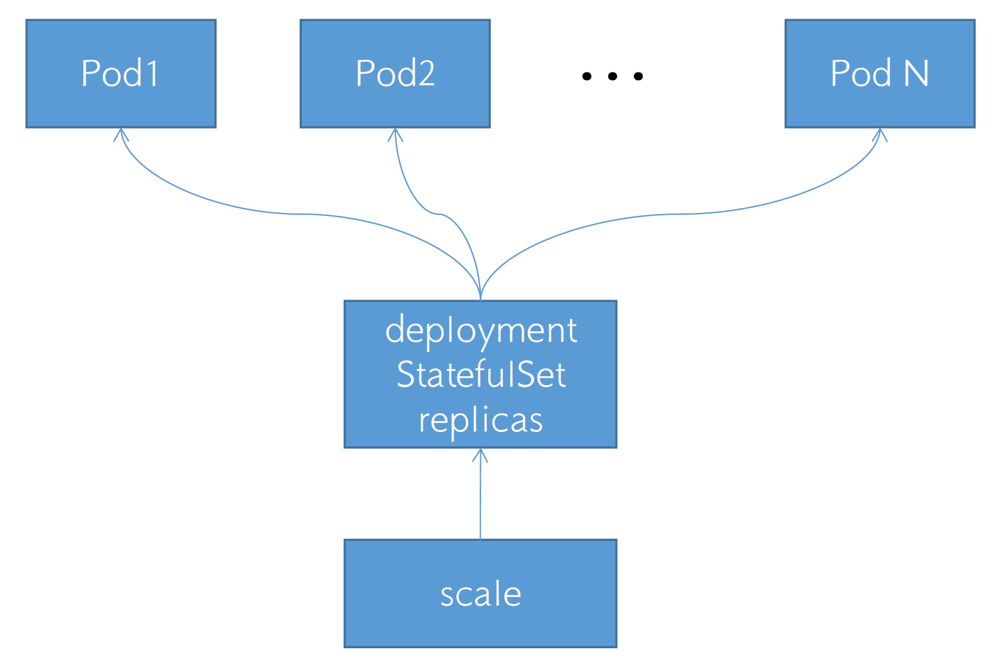
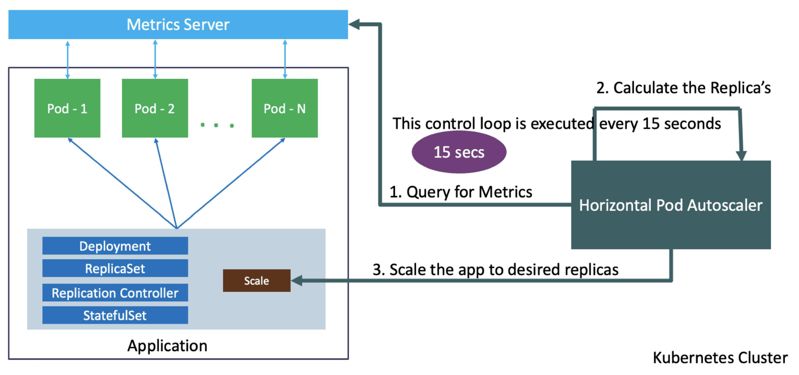
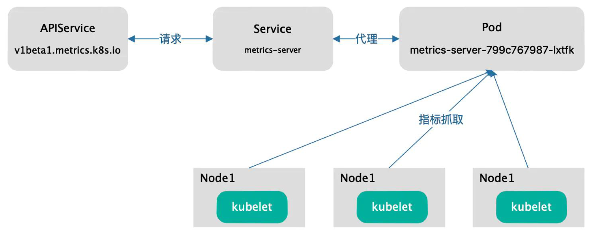
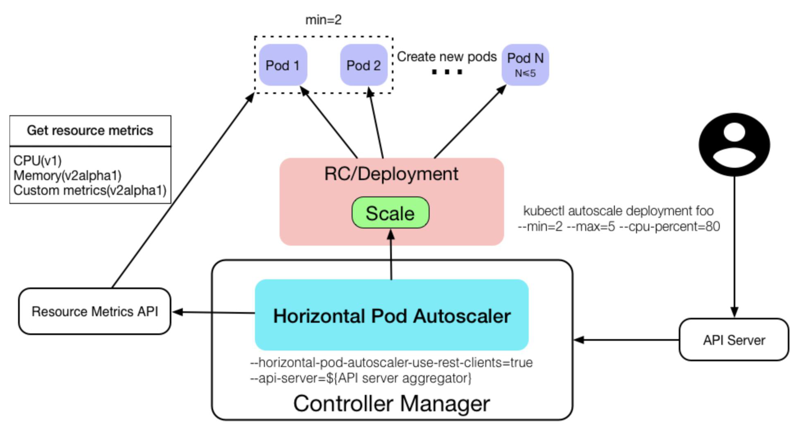
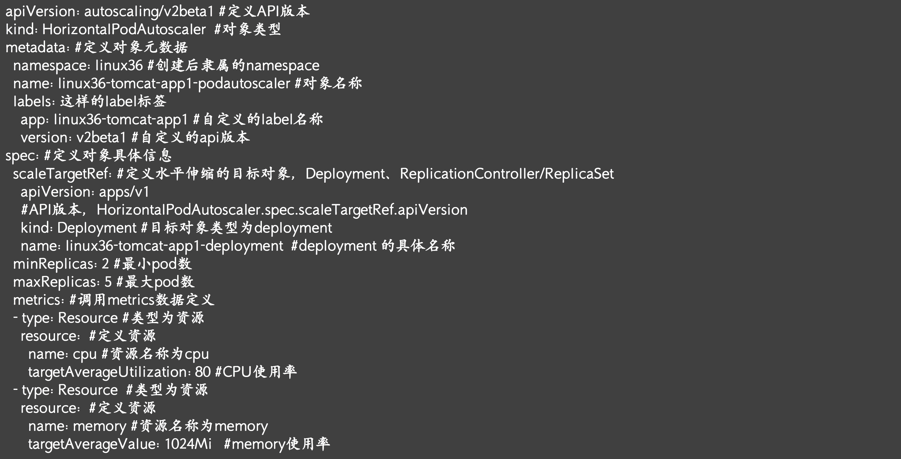

# 一：k8s的HPA控制器

## 1.1：Pod伸缩简介



```sh
## Pod伸缩简介
1. 根据当前pod的负载，动态调整pod副本数量，业务高峰期自动扩容pod的副本数以尽快响应pod的请求。
某个时段，负载量增加。有的时候是pod级别，有的是node级别。
pod是k8s实现的。HPA控制器主要是判断CPU和内存。
比如，CPU超过30%，pod副本数就会增加。

2. 在业务低峰期对pod进行缩容，实现降本增效的目的。
白天扩到30个pod，晚上用不了30个pod，就可以少开点儿。pod少了，node利用率就下去了，在公有云上，又会把node数量缩减了。这缩减，至少降低三分之一左右的支出，因为晚上8小时访问量很小。

3. 公有云支持node级别的弹性伸缩。
最小是5个node，最大是30个node。云平台会自动维持node副本数。

```

## 1.2：调整pod数量的方式

> HPA控制器可以通过k8s的API，拿到pod的利用率，进行统计，他发现如果这个值超过30%，那就告诉控制器，副本数需要调整。会有个数学计算公式。

### 1.2.1：dashboard调整

```sh
## 调整的方式有种是手动，但是不推荐。比如，可以在dashboard中调整。
```

### 1.2.2：命令行调整

```sh
## 通过命令行，依靠任务计划来调整pod数，需要有人去执行。kubectl scale命令。

[root@k8s-master1:~]# kubectl get deployments -n magedu
NAME                            READY   UP-TO-DATE   AVAILABLE   AGE
deploy-devops-redis             1/1     1            1           2d6h
magedu-consumer-deployment      2/2     2            2           4h52m
magedu-dubboadmin-deployment    1/1     1            1           3h12m
magedu-jenkins-deployment       1/1     1            1           24h
magedu-nginx-deployment         1/1     1            1           3d1h
magedu-provider-deployment      1/1     1            1           5h24m
magedu-tomcat-app1-deployment   2/2     2            2           3d3h
wordpress-app-deployment        1/1     1            1           10h
zookeeper1                      1/1     1            1           2d8h
zookeeper2                      1/1     1            1           2d8h
zookeeper3                      1/1     1            1           2d8h

# 命令行方式调整
[root@k8s-master1:~]# kubectl scale deployment -n magedu magedu-provider-deployment --replicas=2
deployment.apps/magedu-provider-deployment scaled

[root@k8s-master1:~]# kubectl get deployments -n magedu
NAME                            READY   UP-TO-DATE   AVAILABLE   AGE
deploy-devops-redis             1/1     1            1           2d6h
magedu-consumer-deployment      2/2     2            2           4h54m
magedu-dubboadmin-deployment    1/1     1            1           3h14m
magedu-jenkins-deployment       1/1     1            1           24h
magedu-nginx-deployment         1/1     1            1           3d1h
magedu-provider-deployment      2/2     2            2           5h26m
magedu-tomcat-app1-deployment   2/2     2            2           3d3h
wordpress-app-deployment        1/1     1            1           10h
zookeeper1                      1/1     1            1           2d8h
zookeeper2                      1/1     1            1           2d8h
zookeeper3                      1/1     1            1           2d8h
```

### 1.2.3：动态伸缩调整

## 1.3：动态伸缩器分类

```sh
## 动态伸缩控制器类型
1. 水平pod自动缩放器（HPA，Horizontal Pod Autoscaler）
基于pod资源利用率横向调整pod副本数量。

2. 垂直pod自动缩放器（VPA）
基于pod资源利用率，调整对单个pod的最大资源限制，不能与HPA同时使用。
使用场景非常少。
如果当前内存不足了，VPA控制器会观察这个pod，然后会分配推荐值，在资源够的主机上重建pod。会把它调度到有资源的主机上。不推荐这么做。几乎没有人用。

3. 集群伸缩（Cluster Autoscaler,CA）
基于集群中node资源分配情况，动态伸缩node节点，从而保证有足够的宿主机资源，也就是有足够的CPU和内存资源用于创建pod。
主要是公有云提供商实现的。

## k8s要始终知道当前k8s环境中，node的负载和pod的负载情况
这个数据如何而来？需要部署一个Metrics Server。收集CPU和内存的利用率，根据他们的值进行判断，看是否超出阈值，因而后续操作。
到达条件后，要通过HPA告知那个控制器，实行伸缩。一个是条件，触发条件，比如CPU利用率等；一个，目的是什么类型的控制器，然后HPA控制器会计算出一个新值，告知他们维持新的副本数。
```

## 1.4：HPA控制器



```sh
## Horizontal Pod Autoscaler(HPA)控制器，根据预定义好的阈值及pod当前的资源利用率，自动控制在k8s集群中运行的pod数量（自动弹性水平自动伸缩）

--horizontal-pod-autoscaler-sync-period 默认每隔15s（可以通过--horizontal-pod-autoscaler-sync-period修改）查询metrics的资源使用情况，查有没有超出指定的值。

[root@k8s-master1:~]# kube-controller-manager --help | grep horizontal-pod-autoscaler-sync-period
      --horizontal-pod-autoscaler-sync-period duration                 The period for syncing the number of pods in horizontal pod autoscaler. (default 15s)
      
# hpa.yaml
-----------------------------------------
#apiVersion: autoscaling/v2beta1
apiVersion: autoscaling/v1 
kind: HorizontalPodAutoscaler
metadata:
  namespace: magedu
  name: magedu-tomcat-app1-podautoscaler
  labels:
    app: magedu-tomcat-app1
    version: v2beta1
spec:
  scaleTargetRef:
    apiVersion: apps/v1
    #apiVersion: extensions/v1beta1 
    kind: Deployment
    name: magedu-tomcat-app1-deployment 
  minReplicas: 3
  maxReplicas: 10
  targetCPUUtilizationPercentage: 60
  #metrics:
  #- type: Resource
  #  resource:
  #    name: cpu
  #    targetAverageUtilization: 60
  #- type: Resource
  #  resource:
  #    name: memory
------------------------------------------

PS：HPA会去监测minReplicas，maxReplicas，targetCPUUtilizationPercentage
如果触发更新，不会立即更新，会有一段间隔周期。
-----------------------------------------------------------------------------------------

--horizontal-pod-autoscaler-downscale-stabilization 缩容间隔周期，默认5分钟
达到了缩容的条件，持续了5分钟，那就开始缩容。
和它相对应的扩容间隔周期，现在取消了这个参数。

--horizontal-pod-autoscaler-sync-period HPA控制器同步pod副本数的间隔周期，默认是15s

--horizontal-pod-autoscaler-cpu-initialization-period 初始化延迟时间，在此时间内pod的CPU资源指标将不会生效，默认为5分钟。pod刚启动，可能CPU资源利用率会比较高，所以这个值5分钟内是不生效的。

--horizontal-pod-autoscaler-initial-readiness-delay 用于设置pod准备时间，在此时间内的pod统统被认为未就绪及不采集数据，默认为30秒。pod创建30秒内是不采集数据的，还要结合上面的指标5分钟。
总计时间：5分30秒。

--horizontal-pod-autoscaler-tolerance HPA控制器能容忍的数据差异（浮点数，默认为0.1）。即新的指标要与当前的阈值差异在0.1或以上，即要大于1+0.1=1.1，或小于1-0.1=0.9，比如阈值为CPU利用率50%，当前为80%，那么80/50=1.6>1.1则会触发扩容，反之会缩容。
即触发条件：avg(CurrentPodsConsumption)/Target>1.1 或 <0.9=把N个pod的数据相加后根据pod的数量计算出平均数除以阈值，大于1.1就扩容，小于0.9就缩容。

计算公式：TargetNumPods = ceil(sum(CurrentPodsCPUUnilization)/Target) 
ceil是一个向上取整的目的pod整数。

## 指标数据需要部署metrics-server，即HPA使用metrics-server作为数据源
在k8s1.1引入HPA控制器，早期使用Heapster组件采集pod指标数据，在k8s1.11版本开始使用Metircs Server完成数据采集，然后将采集到的数据通过API(Aggregated API，汇总API)，例如metrics.k8s.io、custom.metrics.k8s.io、external.metrics.k8s.io，（就是不同的API），然后再把数据提供给HPA控制器进行查询，以实现基于某个资源利用率对pod进行扩缩容的目的。
```

## 1.5：部署metrics-server

### 1.5.1：metrics-server介绍



```sh
## metrics-server部署
Metrics Server是kubernetes内置的容器资源指标来源。
Metrics Server从node节点上的Kuberlet收集资源指标，并通过Metrics API在kubernetes apiserver中公开指标数据，以供Horizontal Pod Autoscaler和Vertical Pod Autoscaler使用，也可以通过访问kubectl top node/pod查看指标数据。

PS：
当没有部署Metrics的时候，
kubectl top pod
kubectl top node
命令会报错。

## 官方直接提供metrics-server组件
https://github.com/kubernetes-sigs/metrics-server

在使用HPA控制器的时候，建立的业务容器一定要加上资源限制。否则HPA控制器就采集不到数据。
```

### 1.5.2：部署metrics-server

```sh
# 下载yaml文件
[root@k8s-master1:~]# wget https://github.com/kubernetes-sigs/metrics-server/releases/download/v0.6.1/components.yaml

# 通过helm部署也可以

# components.yaml
[root@k8s-master1:~]# vim components.yaml 
apiVersion: v1
kind: ServiceAccount
metadata:
  labels:
    k8s-app: metrics-server
  name: metrics-server
  namespace: kube-system
---
apiVersion: rbac.authorization.k8s.io/v1
kind: ClusterRole
metadata:
  labels:
    k8s-app: metrics-server
    rbac.authorization.k8s.io/aggregate-to-admin: "true"
    rbac.authorization.k8s.io/aggregate-to-edit: "true"
    rbac.authorization.k8s.io/aggregate-to-view: "true"
  name: system:aggregated-metrics-reader
rules:
- apiGroups:
  - metrics.k8s.io
  resources:
  - pods
  - nodes
  verbs:
  - get
  - list
  - watch
---
apiVersion: rbac.authorization.k8s.io/v1
kind: ClusterRole
metadata:
  labels:
    k8s-app: metrics-server
  name: system:metrics-server
rules:
- apiGroups:
  - ""
  resources:
  - nodes/metrics
  verbs:
  - get
- apiGroups:
  - ""
  resources:
  - pods
  - nodes
  verbs:
  - get
  - list
  - watch
---
apiVersion: rbac.authorization.k8s.io/v1
kind: RoleBinding
metadata:
  labels:
    k8s-app: metrics-server
  name: metrics-server-auth-reader
  namespace: kube-system
roleRef:
  apiGroup: rbac.authorization.k8s.io
  kind: Role
  name: extension-apiserver-authentication-reader
subjects:
- kind: ServiceAccount
  name: metrics-server
  namespace: kube-system
---
apiVersion: rbac.authorization.k8s.io/v1
kind: ClusterRoleBinding
metadata:
  labels:
    k8s-app: metrics-server
  name: metrics-server:system:auth-delegator
roleRef:
  apiGroup: rbac.authorization.k8s.io
  kind: ClusterRole
  name: system:auth-delegator
subjects:
- kind: ServiceAccount
  name: metrics-server
  namespace: kube-system
---
apiVersion: rbac.authorization.k8s.io/v1
kind: ClusterRoleBinding
metadata:
  labels:
    k8s-app: metrics-server
  name: system:metrics-server
roleRef:
  apiGroup: rbac.authorization.k8s.io
  kind: ClusterRole
  name: system:metrics-server
subjects:
- kind: ServiceAccount
  name: metrics-server
  namespace: kube-system
---
apiVersion: v1
kind: Service
metadata:
  labels:
    k8s-app: metrics-server
  name: metrics-server
  namespace: kube-system
spec:
  ports:
  - name: https
    port: 443
    protocol: TCP
    targetPort: https
  selector:
    k8s-app: metrics-server
---
apiVersion: apps/v1
kind: Deployment
metadata:
  labels:
    k8s-app: metrics-server
  name: metrics-server
  namespace: kube-system
spec:
  selector:
    matchLabels:
      k8s-app: metrics-server
  strategy:
    rollingUpdate:
      maxUnavailable: 0
  template:
    metadata:
      labels:
        k8s-app: metrics-server
    spec:
      containers:
      - args:
        - --cert-dir=/tmp
        - --secure-port=4443
        - --kubelet-preferred-address-types=InternalIP,ExternalIP,Hostname
        - --kubelet-use-node-status-port
        - --metric-resolution=15s
        image: k8s.gcr.io/metrics-server/metrics-server:v0.6.1
        imagePullPolicy: IfNotPresent
        livenessProbe:
          failureThreshold: 3
          httpGet:
            path: /livez
            port: https
            scheme: HTTPS
          periodSeconds: 10
        name: metrics-server
        ports:
        - containerPort: 4443
          name: https
          protocol: TCP
        readinessProbe:
          failureThreshold: 3
          httpGet:
            path: /readyz
            port: https
            scheme: HTTPS
          initialDelaySeconds: 20
          periodSeconds: 10
        resources:
          requests:
            cpu: 100m
            memory: 200Mi
        securityContext:
          allowPrivilegeEscalation: false
          readOnlyRootFilesystem: true
          runAsNonRoot: true
          runAsUser: 1000
        volumeMounts:
        - mountPath: /tmp
          name: tmp-dir
      nodeSelector:
        kubernetes.io/os: linux
      priorityClassName: system-cluster-critical
      serviceAccountName: metrics-server
      volumes:
      - emptyDir: {}
        name: tmp-dir
---
apiVersion: apiregistration.k8s.io/v1
kind: APIService
metadata:
  labels:
    k8s-app: metrics-server
  name: v1beta1.metrics.k8s.io
spec:
  group: metrics.k8s.io
  groupPriorityMinimum: 100
  insecureSkipTLSVerify: true
  service:
    name: metrics-server
    namespace: kube-system
  version: v1beta1
  versionPriority: 100

-----------------------------------------------------------------------------------------

[root@k8s-master1:~/yaml/20240709]# ll
total 68516
drwxr-xr-x 2 root root      116 Jul  9 08:41 ./
drwxr-xr-x 6 root root       70 Jul  9 08:40 ../
-rw-r--r-- 1 root root      596 Jul  9 08:41 hpa.yaml
-rw-r--r-- 1 root root 70143488 Jul  9 08:41 metrics-server-v0.6.1.tar.gz
-rw-r--r-- 1 root root     4181 Jul  9 08:41 metrics-server-v0.6.1.yaml
-rw-r--r-- 1 root root     1418 Jul  9 08:41 tomcat-app1.yaml

# 导入到本地镜像仓库
[root@k8s-master1:~/yaml/20240709]# docker load -i metrics-server-v0.6.1.tar.gz

# apply
[root@k8s-master1:~/yaml/20240709]# kubectl apply -f metrics-server-v0.6.1.yaml 
serviceaccount/metrics-server created
clusterrole.rbac.authorization.k8s.io/system:aggregated-metrics-reader created
clusterrole.rbac.authorization.k8s.io/system:metrics-server created
rolebinding.rbac.authorization.k8s.io/metrics-server-auth-reader created
clusterrolebinding.rbac.authorization.k8s.io/metrics-server:system:auth-delegator created
clusterrolebinding.rbac.authorization.k8s.io/system:metrics-server created
service/metrics-server created
deployment.apps/metrics-server created
apiservice.apiregistration.k8s.io/v1beta1.metrics.k8s.io created

[root@k8s-master1:~/yaml/20240709]# kubectl get pods -n kube-system 
NAME                                       READY   STATUS    RESTARTS       AGE
calico-kube-controllers-754966f84c-c2jzd   1/1     Running   20 (73m ago)   11d
calico-node-2rct4                          1/1     Running   19 (74m ago)   10d
calico-node-jc27c                          1/1     Running   18 (74m ago)   10d
calico-node-n6vlx                          1/1     Running   18 (72m ago)   10d
calico-node-sg5sl                          1/1     Running   18 (73m ago)   10d
calico-node-twlwk                          1/1     Running   21 (74m ago)   10d
calico-node-x2d97                          1/1     Running   18 (73m ago)   10d
coredns-5c8ffdf657-h7gdq                   1/1     Running   19 (73m ago)   11d
coredns-5c8ffdf657-lxqb4                   1/1     Running   20 (73m ago)   11d
metrics-server-847dcc659d-ggxl8            1/1     Running   0              2m11s

# 目前metrics-server可以使用
[root@k8s-master1:~/yaml/20240709]# kubectl top node
NAME           CPU(cores)   CPU%   MEMORY(bytes)   MEMORY%   
172.31.8.101   118m         2%     916Mi           25%       
172.31.8.102   103m         2%     802Mi           22%       
172.31.8.103   153m         3%     895Mi           24%       
172.31.8.111   244m         6%     2358Mi          65%       
172.31.8.112   161m         4%     1383Mi          38%       
172.31.8.113   120m         3%     1155Mi          32%  

[root@k8s-master1:~/yaml/20240709]# kubectl top pod -n magedu
NAME                                             CPU(cores)   MEMORY(bytes)   
deploy-devops-redis-75d6c9ff6-q78gm              1m           5Mi             
magedu-jenkins-deployment-67d564f976-722nf       1m           515Mi           
magedu-nginx-deployment-5f5cbff96f-hlhts         0m           4Mi             
magedu-tomcat-app1-deployment-595f5b7cf8-lmpbd   2m           105Mi           
magedu-tomcat-app1-deployment-595f5b7cf8-xrdmx   2m           112Mi           
mysql-0                                          12m          208Mi           
mysql-1                                          10m          209Mi           
wordpress-app-deployment-558b444569-qdndw        1m           15Mi            

```

## 1.6：实战案例 -- HPA监控tomcat服务

### 1.6.1：tomcat服务部署，增加CPU和内存利用率测试

```sh
[root@k8s-master1:~/yaml/20240709]# ll
total 68516
drwxr-xr-x 2 root root      116 Jul  9 08:43 ./
drwxr-xr-x 6 root root       70 Jul  9 08:40 ../
-rw-r--r-- 1 root root      596 Jul  9 08:41 hpa.yaml
-rw-r--r-- 1 root root 70143488 Jul  9 08:41 metrics-server-v0.6.1.tar.gz
-rw-r--r-- 1 root root     4181 Jul  9 08:41 metrics-server-v0.6.1.yaml
-rw-r--r-- 1 root root     1418 Jul  9 08:41 tomcat-app1.yaml

#　编辑yaml文件
[root@k8s-master1:~/yaml/20240709]# vim tomcat-app1.yaml 
kind: Deployment
#apiVersion: extensions/v1beta1
apiVersion: apps/v1
metadata:
  labels:
    app: magedu-tomcat-app1-deployment-label
  name: magedu-tomcat-app1-deployment
  namespace: magedu
spec:
  replicas: 2
  selector:
    matchLabels:
      app: magedu-tomcat-app1-selector
  template:
    metadata:
      labels:
        app: magedu-tomcat-app1-selector
    spec:
      containers:
      - name: magedu-tomcat-app1-container
        #image: harbor.magedu.local/magedu/tomcat-app1:v7
        image: tomcat:7.0.93-alpine 
        #image: lorel/docker-stress-ng 
        #args: ["--vm", "2", "--vm-bytes", "256M"]
        ##command: ["/apps/tomcat/bin/run_tomcat.sh"]
        imagePullPolicy: IfNotPresent
        ##imagePullPolicy: Always
        ports:
        - containerPort: 8080
          protocol: TCP
          name: http
        env:
        - name: "password"
          value: "123456"
        - name: "age"
          value: "18"
        resources:
          limits:
            cpu: 1
            memory: "512Mi"
          requests:
            cpu: 500m
            memory: "512Mi"

---
kind: Service
apiVersion: v1
metadata:
  labels:
    app: magedu-tomcat-app1-service-label
  name: magedu-tomcat-app1-service
  namespace: magedu
spec:
  type: NodePort
  ports:
  - name: http
    port: 80
    protocol: TCP
    targetPort: 8080
    nodePort: 40003
  selector:
    app: magedu-tomcat-app1-selector

PS：
部署tomcat
在使用HPA的时候，一定要加上资源限制。否则不能采集数据。
        resources:    # 硬性要求
          limits:
            cpu: 1
            memory: "512Mi"
          requests:   # 调度
            cpu: 500m
            memory: "512Mi"
对于HPA控制器来说，service没用。

# apply
[root@k8s-master1:~/yaml/20240709]# kubectl apply -f tomcat-app1.yaml 
deployment.apps/magedu-tomcat-app1-deployment configured
service/magedu-tomcat-app1-service configured

[root@k8s-master1:~/yaml/20240709]# kubectl get pods -n magedu
NAME                                             READY   STATUS    RESTARTS      AGE
deploy-devops-redis-75d6c9ff6-q78gm              1/1     Running   4 (83m ago)   2d16h
magedu-jenkins-deployment-67d564f976-722nf       1/1     Running   3 (83m ago)   35h
magedu-nginx-deployment-5f5cbff96f-hlhts         1/1     Running   9 (81m ago)   3d9h
magedu-tomcat-app1-deployment-6bf7b7bf7d-dp6lw   1/1     Running   0             69s
magedu-tomcat-app1-deployment-6bf7b7bf7d-frjfh   1/1     Running   0             50s
mysql-0                                          2/2     Running   6 (83m ago)   38h
mysql-1                                          2/2     Running   7 (82m ago)   38h
wordpress-app-deployment-558b444569-qdndw        2/2     Running   4 (83m ago)   21h

PS：
目前是没有使用HPA控制器的情况，如果CPU的使用率达到100%，也不会扩容。

# 实验，修改yaml文件的镜像
[root@k8s-master1:~/yaml/20240709]# vim tomcat-app1.yaml 
kind: Deployment
#apiVersion: extensions/v1beta1
apiVersion: apps/v1
metadata:
  labels:
    app: magedu-tomcat-app1-deployment-label
  name: magedu-tomcat-app1-deployment
  namespace: magedu
spec:
  replicas: 2
  selector:
    matchLabels:
      app: magedu-tomcat-app1-selector
  template:
    metadata:
      labels:
        app: magedu-tomcat-app1-selector
    spec:
      containers:
      - name: magedu-tomcat-app1-container
        #image: harbor.magedu.local/magedu/tomcat-app1:v7
        #image: tomcat:7.0.93-alpine 
        image: lorel/docker-stress-ng 
        args: ["--vm", "2", "--vm-bytes", "256M"]
        ##command: ["/apps/tomcat/bin/run_tomcat.sh"]
        imagePullPolicy: IfNotPresent
        ##imagePullPolicy: Always
        ports:
        - containerPort: 8080
          protocol: TCP
          name: http
        env:
        - name: "password"
          value: "123456"
        - name: "age"
          value: "18"
        resources:
          limits:
            cpu: 1
            memory: "512Mi"
          requests:
            cpu: 500m
            memory: "512Mi"

---
kind: Service
apiVersion: v1
metadata:
  labels:
    app: magedu-tomcat-app1-service-label
  name: magedu-tomcat-app1-service
  namespace: magedu
spec:
  type: NodePort
  ports:
  - name: http
    port: 80
    protocol: TCP
    targetPort: 8080
    nodePort: 40003
  selector:
    app: magedu-tomcat-app1-selector

PS：
        image: lorel/docker-stress-ng 
        args: ["--vm", "2", "--vm-bytes", "256M"]
镜像修改为一个压力测试镜像，CPU 200% ，内存512M，直接占用

[root@k8s-master1:~/yaml/20240709]# kubectl apply -f tomcat-app1.yaml 
deployment.apps/magedu-tomcat-app1-deployment configured
service/magedu-tomcat-app1-service unchanged

[root@k8s-master1:~/yaml/20240709]# kubectl get pods -n magedu
NAME                                             READY   STATUS    RESTARTS      AGE
deploy-devops-redis-75d6c9ff6-q78gm              1/1     Running   4 (92m ago)   2d16h
magedu-jenkins-deployment-67d564f976-722nf       1/1     Running   3 (92m ago)   36h
magedu-nginx-deployment-5f5cbff96f-hlhts         1/1     Running   9 (90m ago)   3d9h
magedu-tomcat-app1-deployment-7594ccd998-q455k   1/1     Running   0             26s
magedu-tomcat-app1-deployment-7594ccd998-x6xtj   1/1     Running   0             16s
mysql-0                                          2/2     Running   6 (91m ago)   38h
mysql-1                                          2/2     Running   7 (91m ago)   38h
wordpress-app-deployment-558b444569-qdndw        2/2     Running   4 (92m ago)   21h

[root@k8s-master1:~/yaml/20240709]# kubectl top pod -n magedu
NAME                                             CPU(cores)   MEMORY(bytes)   
deploy-devops-redis-75d6c9ff6-q78gm              2m           5Mi             
magedu-jenkins-deployment-67d564f976-722nf       2m           526Mi           
magedu-nginx-deployment-5f5cbff96f-hlhts         0m           4Mi             
magedu-tomcat-app1-deployment-7594ccd998-q455k   1001m        467Mi           
magedu-tomcat-app1-deployment-7594ccd998-x6xtj   1003m        387Mi           
mysql-0                                          16m          208Mi           
mysql-1                                          20m          209Mi           
wordpress-app-deployment-558b444569-qdndw        1m           17Mi            

PS：
消耗了1CPU。
内存还会增长。
基本上把分配的资源全部占用完。
但是它不会自己扩容。因为pod没有配置弹性伸缩器。
有服务的话，访问一定很慢！
需要配置一个HPA控制器。


```

### 1.6.2：使用HPA控制器





```sh
所有pod利用率加起来，比如，95% 98%
193/80=2.4
向上取整就是3，当前是2，发现少1个。就扩容。

# 方式
1. 命令行

2. yaml文件

[root@k8s-master1:~/yaml/20240709]# vim hpa.yaml 
#apiVersion: autoscaling/v2beta1
apiVersion: autoscaling/v1 
kind: HorizontalPodAutoscaler
metadata:
  namespace: magedu
  name: magedu-tomcat-app1-podautoscaler
  labels:
    app: magedu-tomcat-app1
    version: v2beta1
spec:
  scaleTargetRef:
    apiVersion: apps/v1
    #apiVersion: extensions/v1beta1 
    kind: Deployment
    name: magedu-tomcat-app1-deployment 
  minReplicas: 3
  maxReplicas: 10
  targetCPUUtilizationPercentage: 60
  #metrics:
  #- type: Resource
  #  resource:
  #    name: cpu
  #    targetAverageUtilization: 60
  #- type: Resource
  #  resource:
  #    name: memory

PS：
namespace必须和pod在一起。
labels是让别的组件调用它，通过这个label来筛选这个HPA。
spec就是HPA的具体配置。
  minReplicas: 3
  maxReplicas: 10
  targetCPUUtilizationPercentage: 60

PS：查参数
kubectl explain HorizontalPodAutoscaler.spec.
注意v2的版本参数可能有变化。

# apply
[root@k8s-master1:~/yaml/20240709]# kubectl apply -f hpa.yaml 
horizontalpodautoscaler.autoscaling/magedu-tomcat-app1-podautoscaler created

[root@k8s-master1:~/yaml/20240709]# kubectl get hpa -n magedu
NAME                               REFERENCE                                  TARGETS         MINPODS   MAXPODS   REPLICAS   AGE
magedu-tomcat-app1-podautoscaler   Deployment/magedu-tomcat-app1-deployment   <unknown>/60%   3         10        0          10s

[root@k8s-master1:~/yaml/20240709]# kubectl get hpa -n magedu
NAME                               REFERENCE                                  TARGETS    MINPODS   MAXPODS   REPLICAS   AGE
magedu-tomcat-app1-podautoscaler   Deployment/magedu-tomcat-app1-deployment   200%/60%   3         10        7          66s

[root@k8s-master1:~/yaml/20240709]# kubectl get pod -n magedu
NAME                                             READY   STATUS    RESTARTS       AGE
deploy-devops-redis-75d6c9ff6-q78gm              1/1     Running   4 (136m ago)   2d17h
magedu-jenkins-deployment-67d564f976-722nf       1/1     Running   3 (136m ago)   36h
magedu-nginx-deployment-5f5cbff96f-hlhts         1/1     Running   9 (134m ago)   3d10h
magedu-tomcat-app1-deployment-7594ccd998-6cr9n   1/1     Running   0              103s
magedu-tomcat-app1-deployment-7594ccd998-9f6x6   1/1     Running   0              103s
magedu-tomcat-app1-deployment-7594ccd998-9jqpq   1/1     Running   0              58s
magedu-tomcat-app1-deployment-7594ccd998-bnbsw   1/1     Running   0              119s
magedu-tomcat-app1-deployment-7594ccd998-dq9kt   1/1     Running   0              58s
magedu-tomcat-app1-deployment-7594ccd998-q455k   1/1     Running   0              44m
magedu-tomcat-app1-deployment-7594ccd998-s4q4b   1/1     Running   0              58s
magedu-tomcat-app1-deployment-7594ccd998-wj2vg   1/1     Running   0              103s
magedu-tomcat-app1-deployment-7594ccd998-wp8w2   1/1     Running   0              88s
magedu-tomcat-app1-deployment-7594ccd998-x6xtj   1/1     Running   0              44m
mysql-0                                          2/2     Running   6 (136m ago)   39h
mysql-1                                          2/2     Running   7 (136m ago)   39h
wordpress-app-deployment-558b444569-qdndw        2/2     Running   4 (136m ago)   22h

PS：
注意，pod扩容到10个。

# 查看扩容过程
[root@k8s-master1:~/yaml/20240709]# kubectl describe hpa -n magedu magedu-tomcat-app1-podautoscaler 
Warning: autoscaling/v2beta2 HorizontalPodAutoscaler is deprecated in v1.23+, unavailable in v1.26+; use autoscaling/v2 HorizontalPodAutoscaler
Name:                                                  magedu-tomcat-app1-podautoscaler
Namespace:                                             magedu
Labels:                                                app=magedu-tomcat-app1
                                                       version=v2beta1
Annotations:                                           <none>
CreationTimestamp:                                     Tue, 09 Jul 2024 09:48:37 -0400
Reference:                                             Deployment/magedu-tomcat-app1-deployment
Metrics:                                               ( current / target )
  resource cpu on pods  (as a percentage of request):  187% (935m) / 60%
Min replicas:                                          3
Max replicas:                                          10
Deployment pods:                                       10 current / 10 desired
Conditions:
  Type            Status  Reason            Message
  ----            ------  ------            -------
  AbleToScale     True    ReadyForNewScale  recommended size matches current size
  ScalingActive   True    ValidMetricFound  the HPA was able to successfully calculate a replica count from cpu resource utilization (percentage of request)
  ScalingLimited  True    TooManyReplicas   the desired replica count is more than the maximum replica count
Events:
  Type    Reason             Age    From                       Message
  ----    ------             ----   ----                       -------
  Normal  SuccessfulRescale  5m32s  horizontal-pod-autoscaler  New size: 3; reason: Current number of replicas below Spec.MinReplicas
  Normal  SuccessfulRescale  5m17s  horizontal-pod-autoscaler  New size: 6; reason: cpu resource utilization (percentage of request) above target
  Normal  SuccessfulRescale  5m1s   horizontal-pod-autoscaler  New size: 7; reason: cpu resource utilization (percentage of request) above target
  Normal  SuccessfulRescale  4m31s  horizontal-pod-autoscaler  New size: 10; reason: cpu resource utilization (percentage of request) above target


[root@k8s-master1:~/yaml/20240709]# kubectl top pod -n magedu
NAME                                             CPU(cores)   MEMORY(bytes)   
deploy-devops-redis-75d6c9ff6-q78gm              3m           4Mi             
magedu-jenkins-deployment-67d564f976-722nf       2m           509Mi           
magedu-nginx-deployment-5f5cbff96f-hlhts         0m           4Mi             
magedu-tomcat-app1-deployment-7594ccd998-6cr9n   945m         451Mi           
magedu-tomcat-app1-deployment-7594ccd998-9f6x6   790m         442Mi           
magedu-tomcat-app1-deployment-7594ccd998-9jqpq   816m         307Mi           
magedu-tomcat-app1-deployment-7594ccd998-bnbsw   920m         406Mi           
magedu-tomcat-app1-deployment-7594ccd998-dq9kt   941m         382Mi           
magedu-tomcat-app1-deployment-7594ccd998-q455k   923m         473Mi           
magedu-tomcat-app1-deployment-7594ccd998-s4q4b   943m         467Mi           
magedu-tomcat-app1-deployment-7594ccd998-wj2vg   894m         434Mi           
magedu-tomcat-app1-deployment-7594ccd998-wp8w2   791m         309Mi           
magedu-tomcat-app1-deployment-7594ccd998-x6xtj   815m         401Mi           
mysql-0                                          38m          209Mi           
mysql-1                                          78m          211Mi           
wordpress-app-deployment-558b444569-qdndw        1m           17Mi       

[root@k8s-master1:~/yaml/20240709]# kubectl top node
NAME           CPU(cores)   CPU%   MEMORY(bytes)   MEMORY%   
172.31.8.101   1201m        30%    972Mi           27%       
172.31.8.102   889m         22%    816Mi           22%       
172.31.8.103   1036m        25%    915Mi           25%       
172.31.8.111   3999m        99%    2766Mi          77%       
172.31.8.112   3714m        92%    2180Mi          60%       
172.31.8.113   3702m        92%    2075Mi          57% 


# 换回原来的镜像
[root@k8s-master1:~/yaml/20240709]# vim tomcat-app1.yaml
......
        image: tomcat:7.0.93-alpine 
        #image: lorel/docker-stress-ng 
        #args: ["--vm", "2", "--vm-bytes", "256M"]
......

[root@k8s-master1:~/yaml/20240709]# kubectl apply -f tomcat-app1.yaml 
deployment.apps/magedu-tomcat-app1-deployment configured
service/magedu-tomcat-app1-service unchanged

[root@k8s-master1:~/yaml/20240709]# kubectl get pods -n magedu
NAME                                             READY   STATUS    RESTARTS       AGE
deploy-devops-redis-75d6c9ff6-q78gm              1/1     Running   4 (143m ago)   2d17h
magedu-jenkins-deployment-67d564f976-722nf       1/1     Running   3 (143m ago)   36h
magedu-nginx-deployment-5f5cbff96f-hlhts         1/1     Running   9 (141m ago)   3d10h
magedu-tomcat-app1-deployment-6bf7b7bf7d-4zcx8   1/1     Running   0              34s
magedu-tomcat-app1-deployment-6bf7b7bf7d-ch5xp   1/1     Running   0              39s
magedu-tomcat-app1-deployment-6bf7b7bf7d-l477n   1/1     Running   0              44s
mysql-0                                          2/2     Running   6 (143m ago)   39h
mysql-1                                          2/2     Running   7 (143m ago)   39h
wordpress-app-deployment-558b444569-qdndw        2/2     Running   4 (143m ago)   22h

[root@k8s-master1:~/yaml/20240709]# kubectl top pod -n magedu
NAME                                             CPU(cores)   MEMORY(bytes)   
deploy-devops-redis-75d6c9ff6-q78gm              1m           4Mi             
magedu-jenkins-deployment-67d564f976-722nf       1m           509Mi           
magedu-nginx-deployment-5f5cbff96f-hlhts         0m           4Mi             
magedu-tomcat-app1-deployment-6bf7b7bf7d-4zcx8   1m           126Mi           
magedu-tomcat-app1-deployment-6bf7b7bf7d-5zmbs   1m           133Mi           
magedu-tomcat-app1-deployment-6bf7b7bf7d-ch5xp   1m           132Mi           
magedu-tomcat-app1-deployment-6bf7b7bf7d-cttzb   2m           134Mi           
magedu-tomcat-app1-deployment-6bf7b7bf7d-g9tz7   1m           141Mi           
magedu-tomcat-app1-deployment-6bf7b7bf7d-gmwhx   1m           134Mi           
magedu-tomcat-app1-deployment-6bf7b7bf7d-l477n   1m           145Mi           
magedu-tomcat-app1-deployment-6bf7b7bf7d-p5s2z   1m           132Mi           
magedu-tomcat-app1-deployment-6bf7b7bf7d-sff2z   2m           133Mi           
magedu-tomcat-app1-deployment-6bf7b7bf7d-zwkkv   2m           134Mi           
mysql-0                                          11m          209Mi           
mysql-1                                          11m          210Mi           
wordpress-app-deployment-558b444569-qdndw        1m           17Mi       

PS：
压力上来以后，又扩容了。
注意扩容的过程。
开始是2 ----> 3 ----> 6 ---->　10

# 缩容也是如此。

# 恢复环境
[root@k8s-master1:~/yaml/20240709]# kubectl delete -f tomcat-app1.yaml 
deployment.apps "magedu-tomcat-app1-deployment" deleted
service "magedu-tomcat-app1-service" deleted

[root@k8s-master1:~/yaml/20240709]# kubectl delete -f hpa.yaml 
horizontalpodautoscaler.autoscaling "magedu-tomcat-app1-podautoscaler" deleted
```

## 1.7：恢复环境

```sh
[root@k8s-master1:/opt/k8s-data/yaml/magedu/mysql]# ll
total 16
drwxr-xr-x  3 root root  101 Jul  7 18:50 ./
drwxr-xr-x 12 root root  166 Jul  5 12:13 ../
-rw-r--r--  1 root root  384 Jul  5 12:13 mysql-configmap.yaml
-rw-r--r--  1 root root  569 Jul  5 12:13 mysql-services.yaml
-rw-r--r--  1 root root 5542 Jul  7 18:50 mysql-statefulset.yaml
drwxr-xr-x  2 root root   41 Jul  7 16:56 pv/
[root@k8s-master1:/opt/k8s-data/yaml/magedu/mysql]# kubectl delete -f mysql-statefulset.yaml 
statefulset.apps "mysql" deleted
[root@k8s-master1:/opt/k8s-data/yaml/magedu/mysql]# kubectl delete -f services.yaml
error: the path "services.yaml" does not exist
[root@k8s-master1:/opt/k8s-data/yaml/magedu/mysql]# kubectl delete -f mysql-services.yaml 
service "mysql" deleted
service "mysql-read" deleted
[root@k8s-master1:/opt/k8s-data/yaml/magedu/mysql]# kubectl delete -f mysql-configmap.yaml 
configmap "mysql" deleted
[root@k8s-master1:/opt/k8s-data/yaml/magedu/mysql]# kubectl delete -f pv/
persistentvolume "mysql-datadir-1" deleted
persistentvolume "mysql-datadir-2" deleted
persistentvolume "mysql-datadir-3" deleted
persistentvolume "mysql-datadir-4" deleted
persistentvolume "mysql-datadir-5" deleted
persistentvolume "mysql-datadir-6" deleted


[root@k8s-master1:~/yaml/20240709]# kubectl get pods -n magedu
NAME                                         READY   STATUS    RESTARTS       AGE
deploy-devops-redis-75d6c9ff6-q78gm          1/1     Running   4 (160m ago)   2d17h
magedu-jenkins-deployment-67d564f976-722nf   1/1     Running   3 (160m ago)   37h
magedu-nginx-deployment-5f5cbff96f-hlhts     1/1     Running   9 (158m ago)   3d10h
wordpress-app-deployment-558b444569-qdndw    2/2     Running   4 (160m ago)   22h
```

