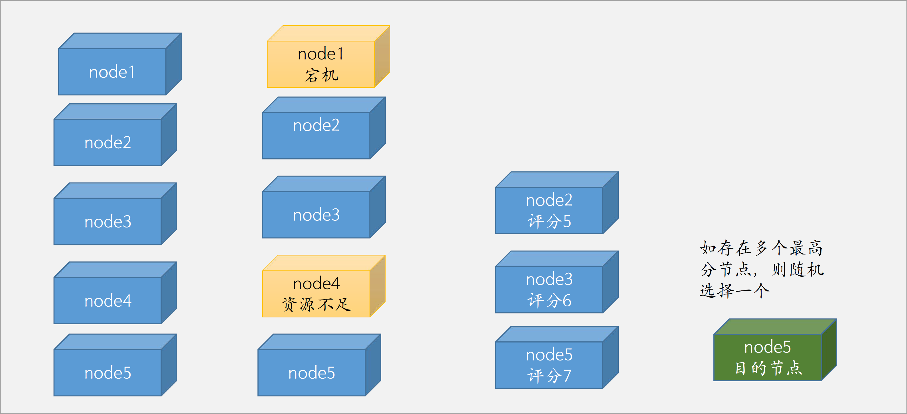

# 一：k8s资源限制

```sh
## 内容：
1、kubernetes Container、Pod、Namespace内存及CPU限制
2、nodeSelector、nodeName、node亲和与反亲和、pod亲和与反亲和、污点与容忍、驱逐
3、Kubernetes RBAC简介及账户授权
4、kubernetes 日志收集流程简介、pod日志收集的几种方式、实现基于ELK的日志收集与展示
5、持续集成与持续部署简介、代码更新流程、deployment更新与暂停、kubernetes重建更新简介与滚动更新详解、Jenkins环境准备
6、持续集成-kubernetes通过命令行实现镜像更新与回滚、灰度部署实现及流程
测试镜像：registry-cn-hangzhou.aliyuncs.com/zhangshijie/tomcat-app1:v1 ~ registry.cn-hangzhou.aliyuncs.com/zhangshijie/tomcat-app1:v5
7、持续集成-持续部署与回滚实现案例

prometheus
skywalking
ceph

PS：
一个pod内几个container，可以对每个container进行单独的资源限制
pod最大可以占用多少CPU和内存，无论里面多少containers。限制超大pod的出现。
公司里k8s跑了很多项目，由不同负责人采购。给ns做资源做限制。超过就不能调度pod。
```

## 1.1：k8s中资源限制概括


```sh
## 面试：你维护的k8s集群有多少node，多少个pod?
不同node数量，k8s环境的压力是不一样的。
node数量要相对大一些。企业一般情况下，需要2个环境，生产和测试。
测试的node数量会少一些，有这些功能就可以，比如，CI/CD，代码部署和回滚。10几个node节点就足够。
生产的node需要考虑高可用，pod多副本，所以数量会高。20-30个左右的node，700-800个pod。

一个k8s环境不跑几百个pod，那就不是合格的k8s环境。
随便一个node都能跑几十个pod。
如果一个公司只有五、六个node，几十个pod，这个k8s环境规模就非常小。

老师的k8s生产环境，300多个node，每个node配置还不一样。node还分组，有些大数据，大内存，GPU的，有的做运算的。再低就拿不出手了。node的分组就是通过label进行分组。

如果不进行资源限制的话，所有的pod就都会争抢资源。
```

```sh
## k8s中资源限制概括
1. 如果运行的容器没有定义资源（memory，CPU）等限制，但是在namespace定义了LimitRange限制，那么该容器会继承LimitRange中的默认限制。

2. 如果namespace没有定义LimitRange限制，那么该容器可以只要宿主机的最大可用资源，直到无资源可用而触发宿主机（OOM Killer）。

https://kubernetes.io/zh/docs/tasks/configure-pod-container/assign-cpu-resource/
CPU以核心为单位进行限制，单位可以是整核、浮点核心数或豪核（m/milli）：
2=2核心=200%  0.5=500m=50%  1.2=1200m=120%

PS：
一个pod通常1核或者0.5核就够了。
如果是pod只是运行一个job，只能使用CPU的一半，0.5核就够了。

https://kubernetes.io/zh/docs/tasks/configure-pod-container/assign-memory-resource/
memory以字节为单位，单位可以是E、P、T、G、M、K、Ei、Pi、Ti、Gi、Mi、Ki
1536Mi=1.5Gi

requests（请求）为kubernetes scheduler执行pod调度时node节点至少需要拥有的资源
limits（限制）为pod运行成功后最多可以使用的资源上限。
```


```sh
[root@k8s-master1:~/yaml/20240710/magedu-limit-case]# ll
total 32
drwxr-xr-x 2 root root  309 Jul 10 13:03 ./
drwxr-xr-x 6 root root   92 Jul 10 13:03 ../
-rw-r--r-- 1 root root  715 Jul 10 13:03 case1-pod-memory-limit.yml
-rw-r--r-- 1 root root  762 Jul 10 13:03 case2-pod-memory-and-cpu-limit.yml
-rw-r--r-- 1 root root 1165 Jul 10 13:03 case3-LimitRange.yaml
-rw-r--r-- 1 root root 1591 Jul 10 13:03 case4-pod-RequestRatio-limit.yaml
-rw-r--r-- 1 root root 1596 Jul 10 13:03 case5-pod-cpu-limit.yaml
-rw-r--r-- 1 root root  254 Jul 10 13:03 case6-ResourceQuota-magedu.yaml
-rw-r--r-- 1 root root 1078 Jul 10 13:03 case7-namespace-pod-limit-test.yaml
-rw-r--r-- 1 root root 1074 Jul 10 13:03 case8-namespace-cpu-limit-test.yaml

[root@k8s-master1:~/yaml/20240710/magedu-limit-case]# cat case1-pod-memory-limit.yml 
#apiVersion: extensions/v1beta1
apiVersion: apps/v1
kind: Deployment
metadata:
  name: limit-test-deployment
  namespace: magedu
spec:
  replicas: 1
  selector:
    matchLabels: #rs or deployment
      app: limit-test-pod
#    matchExpressions:
#      - {key: app, operator: In, values: [ng-deploy-80,ng-rs-81]}
  template:
    metadata:
      labels:
        app: limit-test-pod
    spec:
      containers:
      - name: limit-test-container
        image: lorel/docker-stress-ng
        resources:
          limits:
            memory: "256Mi"
          requests:
            memory: "100Mi"
        #command: ["stress"]
        args: ["--vm", "2", "--vm-bytes", "256M"]
      #nodeSelector:
      #  env: group1

PS：
          limits:
            memory: "256Mi"
          requests:
            memory: "100Mi"
limits是硬限制
requests是调度限制，申请值。
第一阶段：先过滤不符合条件的node节点；
第二阶段：然后看哪个node节点的评分比较高。
通常limits值比requests值大。设置反了不行。100<实际<256。
requests值可以和limits值是一样的。

PS：
requests值过小，会出现什么后果？
pod运行一段时间后，额外占用node的内存。导致node节点上实际上没有那么多内存，就会出现OOM。
生产环境这两个值不要差太多，最好一样，或者requests比limits小一些就行。
建议requests和limits值设置一样，避免出现OOM。
```


## 1.2：k8s对单个容器的CPU及memory实现资源限制


### 1.2.1：memory

```sh
[root@k8s-master1:~/yaml/20240710/magedu-limit-case]# vim case1-pod-memory-limit.yml 
#apiVersion: extensions/v1beta1
apiVersion: apps/v1
kind: Deployment
metadata:
  name: limit-test-deployment
  namespace: magedu
spec:
  replicas: 1
  selector:
    matchLabels: #rs or deployment
      app: limit-test-pod
#    matchExpressions:
#      - {key: app, operator: In, values: [ng-deploy-80,ng-rs-81]}
  template:
    metadata:
      labels:
        app: limit-test-pod
    spec:
      containers:
      - name: limit-test-container
        image: lorel/docker-stress-ng
        resources:
          limits:
            memory: "256Mi"
          requests:
            memory: "100Mi"
        #command: ["stress"]
        args: ["--vm", "2", "--vm-bytes", "256M"]
      #nodeSelector:
      #  env: group1

PS：
lorel/docker-stress-ng 这个镜像是做压力测试用的。有多少资源，它都能占用完。
args: ["--vm", "2", "--vm-bytes", "256M"] 启动两个worker进程，每个进程占用256M。
每个进程会占用1核CPU。综合计算，这个容器会占用200%CPU，512M内存。

[root@k8s-master1:~/yaml/20240710/magedu-limit-case]# kubectl get pods -n magedu
NAME                                         READY   STATUS    RESTARTS        AGE
deploy-devops-redis-75d6c9ff6-q78gm          1/1     Running   5 (3h13m ago)   3d21h
limit-test-deployment-797f886f68-2v76h       1/1     Running   0               12m
magedu-jenkins-deployment-67d564f976-722nf   1/1     Running   4 (3h13m ago)   2d16h
wordpress-app-deployment-558b444569-qdndw    2/2     Running   6 (3h13m ago)   2d2h
        
[root@k8s-master1:~/yaml/20240710/magedu-limit-case]# kubectl top pod -n magedu
NAME                                         CPU(cores)   MEMORY(bytes)   
deploy-devops-redis-75d6c9ff6-q78gm          1m           5Mi             
limit-test-deployment-797f886f68-2v76h       1968m        233Mi           
magedu-jenkins-deployment-67d564f976-722nf   2m           573Mi           
wordpress-app-deployment-558b444569-qdndw    1m           18Mi            

# 改动：
[root@k8s-master1:~/yaml/20240710/magedu-limit-case]# vim case1-pod-memory-limit.yml 
#apiVersion: extensions/v1beta1
apiVersion: apps/v1
kind: Deployment
metadata:
  name: limit-test-deployment
  namespace: magedu
spec:
  replicas: 1
  selector:
    matchLabels: #rs or deployment
      app: limit-test-pod
#    matchExpressions:
#      - {key: app, operator: In, values: [ng-deploy-80,ng-rs-81]}
  template:
    metadata:
      labels:
        app: limit-test-pod
    spec:
      containers:
      - name: limit-test-container
        image: lorel/docker-stress-ng
        resources:
          limits:
            memory: "200Mi"
          requests:
            memory: "100Mi"
        #command: ["stress"]
        args: ["--vm", "2", "--vm-bytes", "256M"]
      #nodeSelector:
      #  env: group1

PS：
          limits:
            memory: "200Mi"
          requests:
            memory: "100Mi"
修改内存的limits值是200Mi。

# apply
[root@k8s-master1:~/yaml/20240710/magedu-limit-case]# kubectl apply -f case1-pod-memory-limit.yml 
deployment.apps/limit-test-deployment configured

[root@k8s-master1:~/yaml/20240710/magedu-limit-case]# kubectl top pod -n magedu
NAME                                         CPU(cores)   MEMORY(bytes)   
deploy-devops-redis-75d6c9ff6-q78gm          1m           5Mi             
limit-test-deployment-59b49674cf-2jbdl       1975m        198Mi           
magedu-jenkins-deployment-67d564f976-722nf   2m           573Mi           
wordpress-app-deployment-558b444569-qdndw    1m           18Mi 

PS：
注意这里的memory不会超过200Mi，因为已经在limits里做了限制。
但是CPU还是可以使用尽可能多的CPU，因为没有限制。

# 恢复环境
[root@k8s-master1:~/yaml/20240710/magedu-limit-case]# kubectl delete -f case1-pod-memory-limit.yml 
deployment.apps "limit-test-deployment" deleted
```

### 1.2.2：CPU

```sh
[root@k8s-master1:~/yaml/20240710/magedu-limit-case]# vim case2-pod-memory-and-cpu-limit.yml 
#apiVersion: extensions/v1beta1
apiVersion: apps/v1
kind: Deployment
metadata:
  name: limit-test-deployment
  namespace: magedu
spec:
  replicas: 1
  selector:
    matchLabels: #rs or deployment
      app: limit-test-pod
#    matchExpressions:
#      - {key: app, operator: In, values: [ng-deploy-80,ng-rs-81]}
  template:
    metadata:
      labels:
        app: limit-test-pod
    spec:
      containers:
      - name: limit-test-container
        image: lorel/docker-stress-ng
        resources:
          limits:
            cpu: "1.3"
            memory: "512Mi"
          requests:
            memory: "100Mi"
            cpu: "500m"
        #command: ["stress"]
        args: ["--vm", "2", "--vm-bytes", "256M"]
      #nodeSelector:
      #  env: group1

PS：
增加了cpu的限制

[root@k8s-master1:~/yaml/20240710/magedu-limit-case]# kubectl apply -f case2-pod-memory-and-cpu-limit.yml 
deployment.apps/limit-test-deployment created

[root@k8s-master1:~/yaml/20240710/magedu-limit-case]# kubectl get pods -n magedu
NAME                                         READY   STATUS    RESTARTS        AGE
deploy-devops-redis-75d6c9ff6-q78gm          1/1     Running   5 (3h24m ago)   3d21h
limit-test-deployment-77788d7d46-mnglp       1/1     Running   0               12s
magedu-jenkins-deployment-67d564f976-722nf   1/1     Running   4 (3h24m ago)   2d16h
wordpress-app-deployment-558b444569-qdndw    2/2     Running   6 (3h24m ago)   2d2h

[root@k8s-master1:~/yaml/20240710/magedu-limit-case]# kubectl top pod -n magedu
NAME                                         CPU(cores)   MEMORY(bytes)   
deploy-devops-redis-75d6c9ff6-q78gm          1m           5Mi             
limit-test-deployment-77788d7d46-mnglp       1299m        324Mi           
magedu-jenkins-deployment-67d564f976-722nf   2m           573Mi           
wordpress-app-deployment-558b444569-qdndw    1m           18Mi     

PS：
现在CPU不超过1.3。

PS：
公司里更关心的是如何设置资源限制。

# 恢复环境
[root@k8s-master1:~/yaml/20240710/magedu-limit-case]# kubectl delete -f case2-pod-memory-and-cpu-limit.yml
deployment.apps "limit-test-deployment" deleted
```


## 1.3：k8s对单个pod的CPU及memory实现资源限制

### 1.3.1：Limit Range

```sh
`Limit Range是对具体某个pod或者容器的资源使用进行限制
https://kubernetes.io/zh/docs/concepts/policy/limit-range/

限制namespace中每个pod或容器的最小与最大计算资源。
限制namespace中每个pod或容器计算资源requests，limits之间的比例。
限制namespace中每个存储卷声明（PersistentVolumeClaim）可使用的最小与最大存储空间。
限制namespace中容器默认计算资源的requests，limits，并在运行时自动注入到容器中。
```

### 1.3.2：Limit Range实例

```sh
[root@k8s-master1:~/yaml/20240710/magedu-limit-case]# vim case3-LimitRange.yaml 
apiVersion: v1
kind: LimitRange
metadata:
  name: limitrange-magedu
  namespace: magedu
spec:
  limits:
  - type: Container       #限制的资源类型
    max:
      cpu: "2"            #限制单个容器的最大CPU
      memory: "2Gi"       #限制单个容器的最大内存
    min:
      cpu: "500m"         #限制单个容器的最小CPU
      memory: "512Mi"     #限制单个容器的最小内存
    default:
      cpu: "500m"         #默认单个容器的CPU限制
      memory: "512Mi"     #默认单个容器的内存限制
    defaultRequest:
      cpu: "500m"         #默认单个容器的CPU创建请求
      memory: "512Mi"     #默认单个容器的内存创建请求
    maxLimitRequestRatio:
      cpu: 2              #限制CPU limit/request比值最大为2  
      memory: 2         #限制内存limit/request比值最大为1.5
  - type: Pod
    max:
      cpu: "4"            #限制单个Pod的最大CPU
      memory: "4Gi"       #限制单个Pod最大内存
  - type: PersistentVolumeClaim
    max:
      storage: 50Gi        #限制PVC最大的requests.storage
    min:
      storage: 30Gi        #限制PVC最小的requests.storage

PS：
针对容器的限制 ---- 限制开发人员乱操作。防止别人在k8s中创建资源分配过多的pod。
针对pod的限制
针对PVC的限制
还可以有别的。

PS：
    default:
      cpu: "500m"         #默认单个容器的CPU限制
      memory: "512Mi"     #默认单个容器的内存限制
这个是默认的limits设置。你不设置，会继承这里的设置。
    defaultRequest:
      cpu: "500m"         #默认单个容器的CPU创建请求
      memory: "512Mi"     #默认单个容器的内存创建请求
这是默认的requests设置。
    maxLimitRequestRatio:
      cpu: 2              #限制CPU limit/request比值最大为2  
      memory: 2         #限制内存limit/request比值最大为1.5
尽可能差距不要太大，最多就是2倍。
一旦这个资源创建，就会生效！！！就会限制pod本身的设置。
很多公司都不加。

# apply
[root@k8s-master1:~/yaml/20240710/magedu-limit-case]# kubectl apply -f case3-LimitRange.yaml 
limitrange/limitrange-magedu created

[root@k8s-master1:~/yaml/20240710/magedu-limit-case]# kubectl get limitrange -n magedu
NAME                CREATED AT
limitrange-magedu   2024-07-10T18:43:25Z

[root@k8s-master1:~/yaml/20240710/magedu-limit-case]# kubectl describe limitranges -n magedu limitrange-magedu 
Name:                  limitrange-magedu
Namespace:             magedu
Type                   Resource  Min    Max   Default Request  Default Limit  Max Limit/Request Ratio
----                   --------  ---    ---   ---------------  -------------  -----------------------
Container              cpu       500m   2     500m             500m           2
Container              memory    512Mi  2Gi   512Mi            512Mi          2
Pod                    memory    -      4Gi   -                -              -
Pod                    cpu       -      4     -                -              -
PersistentVolumeClaim  storage   30Gi   50Gi  -                -              -

PS：
此时，一旦创建容器，就会受这个限制了。
这里我们关注Max Limit/Request Ratio的值，是2
```

### 1.3.3：限制案例1

```sh
[root@k8s-master1:~/yaml/20240710/magedu-limit-case]# vim case4-pod-RequestRatio-limit.yaml 
kind: Deployment
apiVersion: apps/v1
metadata:
  labels:
    app: magedu-wordpress-deployment-label
  name: magedu-wordpress-deployment
  namespace: magedu
spec:
  replicas: 1
  selector:
    matchLabels:
      app: magedu-wordpress-selector
  template:
    metadata:
      labels:
        app: magedu-wordpress-selector
    spec:
      containers:
      - name: magedu-wordpress-nginx-container
        image: nginx:1.16.1
        imagePullPolicy: Always
        ports:
        - containerPort: 80
          protocol: TCP
          name: http
        env:
        - name: "password"
          value: "123456"
        - name: "age"
          value: "18"
        resources:
          limits:
            cpu: 2
            memory: 1Gi
          requests:
            cpu: 500m 
            memory: 512Mi

      - name: magedu-wordpress-php-container
        image: php:5.6-fpm-alpine 
        imagePullPolicy: Always
        ports:
        - containerPort: 80
          protocol: TCP
          name: http
        env:
        - name: "password"
          value: "123456"
        - name: "age"
          value: "18"
        resources:
          limits:
            cpu: 1
            #cpu: 2
            memory: 1Gi
          requests:
            cpu: 1
            memory: 512Mi


---
kind: Service
apiVersion: v1
metadata:
  labels:
    app: magedu-wordpress-service-label
  name: magedu-wordpress-service
  namespace: magedu
spec:
  type: NodePort
  ports:
  - name: http
    port: 80
    protocol: TCP
    targetPort: 8080
    nodePort: 30036
  selector:
    app: magedu-wordpress-selector

PS：
第一种情况，CPU的limits/requests ratio 是4，超出了LimitsRanges的限制

# apply
[root@k8s-master1:~/yaml/20240710/magedu-limit-case]# kubectl apply -f case4-pod-RequestRatio-limit.yaml 
deployment.apps/magedu-wordpress-deployment created
service/magedu-wordpress-service created

[root@k8s-master1:~/yaml/20240710/magedu-limit-case]# kubectl get pods -n magedu
NAME                                         READY   STATUS    RESTARTS       AGE
deploy-devops-redis-75d6c9ff6-q78gm          1/1     Running   6 (105m ago)   4d23h
magedu-jenkins-deployment-67d564f976-722nf   1/1     Running   5 (105m ago)   3d18h
wordpress-app-deployment-558b444569-qdndw    2/2     Running   8 (105m ago)   3d4h

PS：
发现pod并没有创建，找不到。说明没有创建。
很诡异！！！

# 查看问题原因
[root@k8s-master1:~/yaml/20240710/magedu-limit-case]# kubectl get deploy -n magedu
NAME                          READY   UP-TO-DATE   AVAILABLE   AGE
deploy-devops-redis           1/1     1            1           5d1h
magedu-jenkins-deployment     1/1     1            1           3d18h
magedu-wordpress-deployment   0/1     0            0           2m3s
wordpress-app-deployment      1/1     1            1           3d4h

[root@k8s-master1:~/yaml/20240710/magedu-limit-case]# kubectl get deploy -n magedu -o json
{
    "apiVersion": "v1",
    "items": [
        {
            "apiVersion": "apps/v1",
            "kind": "Deployment",
            "metadata": {
                "annotations": {
                    "deployment.kubernetes.io/revision": "1",
                    "kubectl.kubernetes.io/last-applied-configuration": "{\"apiVersion\":\"apps/v1\",\"kind\":\"Deployment\",\"metadata\":{\"annotations\":{},\"labels\":{\"app\":\"devops-redis\"},\"name\":\"deploy-devops-redis\",\"namespace\":\"magedu\"},\"spec\":{\"replicas\":1,\"selector\":{\"matchLabels\":{\"app\":\"devops-redis\"}},\"template\":{\"metadata\":{\"labels\":{\"app\":\"devops-redis\"}},\"spec\":{\"containers\":[{\"image\":\"harbor.sunnycreek.local/magedu/redis:4.0.14\",\"imagePullPolicy\":\"Always\",\"name\":\"redis-container\",\"volumeMounts\":[{\"mountPath\":\"/data/redis-data/\",\"name\":\"redis-datadir\"}]}],\"volumes\":[{\"name\":\"redis-datadir\",\"persistentVolumeClaim\":{\"claimName\":\"redis-datadir-pvc-1\"}}]}}}}\n"
                },
                "creationTimestamp": "2024-07-06T19:02:15Z",
                "generation": 3,
                "labels": {
                    "app": "devops-redis"
                },
                "name": "deploy-devops-redis",
                "namespace": "magedu",
                "resourceVersion": "913071",
                "uid": "8019e10f-353b-4067-9789-ecbd4ac2f0ce"
            },
            "spec": {
                "progressDeadlineSeconds": 600,
                "replicas": 1,
                "revisionHistoryLimit": 10,
                "selector": {
                    "matchLabels": {
                        "app": "devops-redis"
                    }
                },
                "strategy": {
                    "rollingUpdate": {
                        "maxSurge": "25%",
                        "maxUnavailable": "25%"
                    },
                    "type": "RollingUpdate"
                },
                "template": {
                    "metadata": {
                        "creationTimestamp": null,
                        "labels": {
                            "app": "devops-redis"
                        }
                    },
                    "spec": {
                        "containers": [
                            {
                                "image": "harbor.sunnycreek.local/magedu/redis:4.0.14",
                                "imagePullPolicy": "Always",
                                "name": "redis-container",
                                "resources": {},
                                "terminationMessagePath": "/dev/termination-log",
                                "terminationMessagePolicy": "File",
                                "volumeMounts": [
                                    {
                                        "mountPath": "/data/redis-data/",
                                        "name": "redis-datadir"
                                    }
                                ]
                            }
                        ],
                        "dnsPolicy": "ClusterFirst",
                        "restartPolicy": "Always",
                        "schedulerName": "default-scheduler",
                        "securityContext": {},
                        "terminationGracePeriodSeconds": 30,
                        "volumes": [
                            {
                                "name": "redis-datadir",
                                "persistentVolumeClaim": {
                                    "claimName": "redis-datadir-pvc-1"
                                }
                            }
                        ]
                    }
                }
            },
            "status": {
                "availableReplicas": 1,
                "conditions": [
                    {
                        "lastTransitionTime": "2024-07-06T19:02:15Z",
                        "lastUpdateTime": "2024-07-06T19:02:17Z",
                        "message": "ReplicaSet \"deploy-devops-redis-75d6c9ff6\" has successfully progressed.",
                        "reason": "NewReplicaSetAvailable",
                        "status": "True",
                        "type": "Progressing"
                    },
                    {
                        "lastTransitionTime": "2024-07-11T18:18:36Z",
                        "lastUpdateTime": "2024-07-11T18:18:36Z",
                        "message": "Deployment has minimum availability.",
                        "reason": "MinimumReplicasAvailable",
                        "status": "True",
                        "type": "Available"
                    }
                ],
                "observedGeneration": 3,
                "readyReplicas": 1,
                "replicas": 1,
                "updatedReplicas": 1
            }
        },
        {
            "apiVersion": "apps/v1",
            "kind": "Deployment",
            "metadata": {
                "annotations": {
                    "deployment.kubernetes.io/revision": "1",
                    "kubectl.kubernetes.io/last-applied-configuration": "{\"apiVersion\":\"apps/v1\",\"kind\":\"Deployment\",\"metadata\":{\"annotations\":{},\"labels\":{\"app\":\"magedu-jenkins\"},\"name\":\"magedu-jenkins-deployment\",\"namespace\":\"magedu\"},\"spec\":{\"replicas\":1,\"selector\":{\"matchLabels\":{\"app\":\"magedu-jenkins\"}},\"template\":{\"metadata\":{\"labels\":{\"app\":\"magedu-jenkins\"}},\"spec\":{\"containers\":[{\"image\":\"harbor.sunnycreek.local/magedu/jenkins:v2.319.2\",\"imagePullPolicy\":\"Always\",\"name\":\"magedu-jenkins-container\",\"ports\":[{\"containerPort\":8080,\"name\":\"http\",\"protocol\":\"TCP\"}],\"volumeMounts\":[{\"mountPath\":\"/apps/jenkins/jenkins-data/\",\"name\":\"jenkins-datadir-magedu\"},{\"mountPath\":\"/root/.jenkins\",\"name\":\"jenkins-root-datadir\"}]}],\"volumes\":[{\"name\":\"jenkins-datadir-magedu\",\"persistentVolumeClaim\":{\"claimName\":\"jenkins-datadir-pvc\"}},{\"name\":\"jenkins-root-datadir\",\"persistentVolumeClaim\":{\"claimName\":\"jenkins-root-data-pvc\"}}]}}}}\n"
                },
                "creationTimestamp": "2024-07-08T01:06:10Z",
                "generation": 1,
                "labels": {
                    "app": "magedu-jenkins"
                },
                "name": "magedu-jenkins-deployment",
                "namespace": "magedu",
                "resourceVersion": "913034",
                "uid": "ea9c8f31-ded2-4a4f-b30b-afe8f4ef2d8d"
            },
            "spec": {
                "progressDeadlineSeconds": 600,
                "replicas": 1,
                "revisionHistoryLimit": 10,
                "selector": {
                    "matchLabels": {
                        "app": "magedu-jenkins"
                    }
                },
                "strategy": {
                    "rollingUpdate": {
                        "maxSurge": "25%",
                        "maxUnavailable": "25%"
                    },
                    "type": "RollingUpdate"
                },
                "template": {
                    "metadata": {
                        "creationTimestamp": null,
                        "labels": {
                            "app": "magedu-jenkins"
                        }
                    },
                    "spec": {
                        "containers": [
                            {
                                "image": "harbor.sunnycreek.local/magedu/jenkins:v2.319.2",
                                "imagePullPolicy": "Always",
                                "name": "magedu-jenkins-container",
                                "ports": [
                                    {
                                        "containerPort": 8080,
                                        "name": "http",
                                        "protocol": "TCP"
                                    }
                                ],
                                "resources": {},
                                "terminationMessagePath": "/dev/termination-log",
                                "terminationMessagePolicy": "File",
                                "volumeMounts": [
                                    {
                                        "mountPath": "/apps/jenkins/jenkins-data/",
                                        "name": "jenkins-datadir-magedu"
                                    },
                                    {
                                        "mountPath": "/root/.jenkins",
                                        "name": "jenkins-root-datadir"
                                    }
                                ]
                            }
                        ],
                        "dnsPolicy": "ClusterFirst",
                        "restartPolicy": "Always",
                        "schedulerName": "default-scheduler",
                        "securityContext": {},
                        "terminationGracePeriodSeconds": 30,
                        "volumes": [
                            {
                                "name": "jenkins-datadir-magedu",
                                "persistentVolumeClaim": {
                                    "claimName": "jenkins-datadir-pvc"
                                }
                            },
                            {
                                "name": "jenkins-root-datadir",
                                "persistentVolumeClaim": {
                                    "claimName": "jenkins-root-data-pvc"
                                }
                            }
                        ]
                    }
                }
            },
            "status": {
                "availableReplicas": 1,
                "conditions": [
                    {
                        "lastTransitionTime": "2024-07-08T01:06:10Z",
                        "lastUpdateTime": "2024-07-08T01:06:13Z",
                        "message": "ReplicaSet \"magedu-jenkins-deployment-67d564f976\" has successfully progressed.",
                        "reason": "NewReplicaSetAvailable",
                        "status": "True",
                        "type": "Progressing"
                    },
                    {
                        "lastTransitionTime": "2024-07-11T18:18:33Z",
                        "lastUpdateTime": "2024-07-11T18:18:33Z",
                        "message": "Deployment has minimum availability.",
                        "reason": "MinimumReplicasAvailable",
                        "status": "True",
                        "type": "Available"
                    }
                ],
                "observedGeneration": 1,
                "readyReplicas": 1,
                "replicas": 1,
                "updatedReplicas": 1
            }
        },
        {
            "apiVersion": "apps/v1",
            "kind": "Deployment",
            "metadata": {
                "annotations": {
                    "deployment.kubernetes.io/revision": "1",
                    "kubectl.kubernetes.io/last-applied-configuration": "{\"apiVersion\":\"apps/v1\",\"kind\":\"Deployment\",\"metadata\":{\"annotations\":{},\"labels\":{\"app\":\"magedu-wordpress-deployment-label\"},\"name\":\"magedu-wordpress-deployment\",\"namespace\":\"magedu\"},\"spec\":{\"replicas\":1,\"selector\":{\"matchLabels\":{\"app\":\"magedu-wordpress-selector\"}},\"template\":{\"metadata\":{\"labels\":{\"app\":\"magedu-wordpress-selector\"}},\"spec\":{\"containers\":[{\"env\":[{\"name\":\"password\",\"value\":\"123456\"},{\"name\":\"age\",\"value\":\"18\"}],\"image\":\"nginx:1.16.1\",\"imagePullPolicy\":\"Always\",\"name\":\"magedu-wordpress-nginx-container\",\"ports\":[{\"containerPort\":80,\"name\":\"http\",\"protocol\":\"TCP\"}],\"resources\":{\"limits\":{\"cpu\":2,\"memory\":\"1Gi\"},\"requests\":{\"cpu\":\"500m\",\"memory\":\"512Mi\"}}},{\"env\":[{\"name\":\"password\",\"value\":\"123456\"},{\"name\":\"age\",\"value\":\"18\"}],\"image\":\"php:5.6-fpm-alpine\",\"imagePullPolicy\":\"Always\",\"name\":\"magedu-wordpress-php-container\",\"ports\":[{\"containerPort\":80,\"name\":\"http\",\"protocol\":\"TCP\"}],\"resources\":{\"limits\":{\"cpu\":1,\"memory\":\"1Gi\"},\"requests\":{\"cpu\":1,\"memory\":\"512Mi\"}}}]}}}}\n"
                },
                "creationTimestamp": "2024-07-11T20:03:20Z",
                "generation": 1,
                "labels": {
                    "app": "magedu-wordpress-deployment-label"
                },
                "name": "magedu-wordpress-deployment",
                "namespace": "magedu",
                "resourceVersion": "925805",
                "uid": "10514df9-72fc-4796-94c2-d44ec27a4d77"
            },
            "spec": {
                "progressDeadlineSeconds": 600,
                "replicas": 1,
                "revisionHistoryLimit": 10,
                "selector": {
                    "matchLabels": {
                        "app": "magedu-wordpress-selector"
                    }
                },
                "strategy": {
                    "rollingUpdate": {
                        "maxSurge": "25%",
                        "maxUnavailable": "25%"
                    },
                    "type": "RollingUpdate"
                },
                "template": {
                    "metadata": {
                        "creationTimestamp": null,
                        "labels": {
                            "app": "magedu-wordpress-selector"
                        }
                    },
                    "spec": {
                        "containers": [
                            {
                                "env": [
                                    {
                                        "name": "password",
                                        "value": "123456"
                                    },
                                    {
                                        "name": "age",
                                        "value": "18"
                                    }
                                ],
                                "image": "nginx:1.16.1",
                                "imagePullPolicy": "Always",
                                "name": "magedu-wordpress-nginx-container",
                                "ports": [
                                    {
                                        "containerPort": 80,
                                        "name": "http",
                                        "protocol": "TCP"
                                    }
                                ],
                                "resources": {
                                    "limits": {
                                        "cpu": "2",
                                        "memory": "1Gi"
                                    },
                                    "requests": {
                                        "cpu": "500m",
                                        "memory": "512Mi"
                                    }
                                },
                                "terminationMessagePath": "/dev/termination-log",
                                "terminationMessagePolicy": "File"
                            },
                            {
                                "env": [
                                    {
                                        "name": "password",
                                        "value": "123456"
                                    },
                                    {
                                        "name": "age",
                                        "value": "18"
                                    }
                                ],
                                "image": "php:5.6-fpm-alpine",
                                "imagePullPolicy": "Always",
                                "name": "magedu-wordpress-php-container",
                                "ports": [
                                    {
                                        "containerPort": 80,
                                        "name": "http",
                                        "protocol": "TCP"
                                    }
                                ],
                                "resources": {
                                    "limits": {
                                        "cpu": "1",
                                        "memory": "1Gi"
                                    },
                                    "requests": {
                                        "cpu": "1",
                                        "memory": "512Mi"
                                    }
                                },
                                "terminationMessagePath": "/dev/termination-log",
                                "terminationMessagePolicy": "File"
                            }
                        ],
                        "dnsPolicy": "ClusterFirst",
                        "restartPolicy": "Always",
                        "schedulerName": "default-scheduler",
                        "securityContext": {},
                        "terminationGracePeriodSeconds": 30
                    }
                }
            },
            "status": {
                "conditions": [
                    {
                        "lastTransitionTime": "2024-07-11T20:03:20Z",
                        "lastUpdateTime": "2024-07-11T20:03:20Z",
                        "message": "Created new replica set \"magedu-wordpress-deployment-6666768d65\"",
                        "reason": "NewReplicaSetCreated",
                        "status": "True",
                        "type": "Progressing"
                    },
                    {
                        "lastTransitionTime": "2024-07-11T20:03:20Z",
                        "lastUpdateTime": "2024-07-11T20:03:20Z",
                        "message": "Deployment does not have minimum availability.",
                        "reason": "MinimumReplicasUnavailable",
                        "status": "False",
                        "type": "Available"
                    },
                    {
                        "lastTransitionTime": "2024-07-11T20:03:20Z",
                        "lastUpdateTime": "2024-07-11T20:03:20Z",
`显示原因`               "message": "pods \"magedu-wordpress-deployment-6666768d65-tg94x\" is forbidden: cpu max limit to request ratio per Container is 2, but provided ratio is 4.000000",
                        "reason": "FailedCreate",
                        "status": "True",
                        "type": "ReplicaFailure"
                    }
                ],
                "observedGeneration": 1,
                "unavailableReplicas": 1
            }
        },
        {
            "apiVersion": "apps/v1",
            "kind": "Deployment",
            "metadata": {
                "annotations": {
                    "deployment.kubernetes.io/revision": "1",
                    "kubectl.kubernetes.io/last-applied-configuration": "{\"apiVersion\":\"apps/v1\",\"kind\":\"Deployment\",\"metadata\":{\"annotations\":{},\"labels\":{\"app\":\"wordpress-app\"},\"name\":\"wordpress-app-deployment\",\"namespace\":\"magedu\"},\"spec\":{\"replicas\":1,\"selector\":{\"matchLabels\":{\"app\":\"wordpress-app\"}},\"template\":{\"metadata\":{\"labels\":{\"app\":\"wordpress-app\"}},\"spec\":{\"containers\":[{\"image\":\"harbor.sunnycreek.local/magedu/wordpress-nginx:v1.20.0\",\"imagePullPolicy\":\"Always\",\"name\":\"wordpress-app-nginx\",\"ports\":[{\"containerPort\":80,\"name\":\"http\",\"protocol\":\"TCP\"},{\"containerPort\":443,\"name\":\"https\",\"protocol\":\"TCP\"}],\"volumeMounts\":[{\"mountPath\":\"/home/nginx/wordpress\",\"name\":\"wordpress\",\"readOnly\":false}]},{\"image\":\"harbor.sunnycreek.local/magedu/wordpress-php-5.6:v1\",\"imagePullPolicy\":\"Always\",\"name\":\"wordpress-app-php\",\"ports\":[{\"containerPort\":9000,\"name\":\"http\",\"protocol\":\"TCP\"}],\"volumeMounts\":[{\"mountPath\":\"/home/nginx/wordpress\",\"name\":\"wordpress\",\"readOnly\":false}]}],\"volumes\":[{\"name\":\"wordpress\",\"nfs\":{\"path\":\"/data/k8sdata/magedu/wordpress\",\"server\":\"172.31.8.109\"}}]}}}}\n"
                },
                "creationTimestamp": "2024-07-08T15:34:50Z",
                "generation": 1,
                "labels": {
                    "app": "wordpress-app"
                },
                "name": "wordpress-app-deployment",
                "namespace": "magedu",
                "resourceVersion": "913059",
                "uid": "17079104-ca32-4528-9609-03f773fe123f"
            },
            "spec": {
                "progressDeadlineSeconds": 600,
                "replicas": 1,
                "revisionHistoryLimit": 10,
                "selector": {
                    "matchLabels": {
                        "app": "wordpress-app"
                    }
                },
                "strategy": {
                    "rollingUpdate": {
                        "maxSurge": "25%",
                        "maxUnavailable": "25%"
                    },
                    "type": "RollingUpdate"
                },
                "template": {
                    "metadata": {
                        "creationTimestamp": null,
                        "labels": {
                            "app": "wordpress-app"
                        }
                    },
                    "spec": {
                        "containers": [
                            {
                                "image": "harbor.sunnycreek.local/magedu/wordpress-nginx:v1.20.0",
                                "imagePullPolicy": "Always",
                                "name": "wordpress-app-nginx",
                                "ports": [
                                    {
                                        "containerPort": 80,
                                        "name": "http",
                                        "protocol": "TCP"
                                    },
                                    {
                                        "containerPort": 443,
                                        "name": "https",
                                        "protocol": "TCP"
                                    }
                                ],
                                "resources": {},
                                "terminationMessagePath": "/dev/termination-log",
                                "terminationMessagePolicy": "File",
                                "volumeMounts": [
                                    {
                                        "mountPath": "/home/nginx/wordpress",
                                        "name": "wordpress"
                                    }
                                ]
                            },
                            {
                                "image": "harbor.sunnycreek.local/magedu/wordpress-php-5.6:v1",
                                "imagePullPolicy": "Always",
                                "name": "wordpress-app-php",
                                "ports": [
                                    {
                                        "containerPort": 9000,
                                        "name": "http",
                                        "protocol": "TCP"
                                    }
                                ],
                                "resources": {},
                                "terminationMessagePath": "/dev/termination-log",
                                "terminationMessagePolicy": "File",
                                "volumeMounts": [
                                    {
                                        "mountPath": "/home/nginx/wordpress",
                                        "name": "wordpress"
                                    }
                                ]
                            }
                        ],
                        "dnsPolicy": "ClusterFirst",
                        "restartPolicy": "Always",
                        "schedulerName": "default-scheduler",
                        "securityContext": {},
                        "terminationGracePeriodSeconds": 30,
                        "volumes": [
                            {
                                "name": "wordpress",
                                "nfs": {
                                    "path": "/data/k8sdata/magedu/wordpress",
                                    "server": "172.31.8.109"
                                }
                            }
                        ]
                    }
                }
            },
            "status": {
                "availableReplicas": 1,
                "conditions": [
                    {
                        "lastTransitionTime": "2024-07-08T15:34:50Z",
                        "lastUpdateTime": "2024-07-08T15:34:59Z",
                        "message": "ReplicaSet \"wordpress-app-deployment-558b444569\" has successfully progressed.",
                        "reason": "NewReplicaSetAvailable",
                        "status": "True",
                        "type": "Progressing"
                    },
                    {
                        "lastTransitionTime": "2024-07-11T18:18:35Z",
                        "lastUpdateTime": "2024-07-11T18:18:35Z",
                        "message": "Deployment has minimum availability.",
                        "reason": "MinimumReplicasAvailable",
                        "status": "True",
                        "type": "Available"
                    }
                ],
                "observedGeneration": 1,
                "readyReplicas": 1,
                "replicas": 1,
                "updatedReplicas": 1
            }
        }
    ],
    "kind": "List",
    "metadata": {
        "resourceVersion": "",
        "selfLink": ""
    }
}
[root@k8s-master1:~/yaml/20240710/magedu-limit-case]# 

PS：
绿色字体部分。
这个创建被拒绝调度！

# 修改yaml文件
[root@k8s-master1:~/yaml/20240710/magedu-limit-case]# vim case4-pod-RequestRatio-limit.yaml 
kind: Deployment
apiVersion: apps/v1
metadata:
  labels:
    app: magedu-wordpress-deployment-label
  name: magedu-wordpress-deployment
  namespace: magedu
spec:
  replicas: 1
  selector:
    matchLabels:
      app: magedu-wordpress-selector
  template:
    metadata:
      labels:
        app: magedu-wordpress-selector
    spec:
      containers:
      - name: magedu-wordpress-nginx-container
        image: nginx:1.16.1
        imagePullPolicy: Always
        ports:
        - containerPort: 80
          protocol: TCP
          name: http
        env:
        - name: "password"
          value: "123456"
        - name: "age"
          value: "18"
        resources:
          limits:
            cpu: 2
            memory: 1Gi
          requests:
            cpu: 1.2 
            memory: 512Mi

      - name: magedu-wordpress-php-container
        image: php:5.6-fpm-alpine 
        imagePullPolicy: Always
        ports:
        - containerPort: 80
          protocol: TCP
          name: http
        env:
        - name: "password"
          value: "123456"
        - name: "age"
          value: "18"
        resources:
          limits:
            cpu: 1
            #cpu: 2
            memory: 1Gi
          requests:
            cpu: 1
            memory: 512Mi


---
kind: Service
apiVersion: v1
metadata:
  labels:
    app: magedu-wordpress-service-label
  name: magedu-wordpress-service
  namespace: magedu
spec:
  type: NodePort
  ports:
  - name: http
    port: 80
    protocol: TCP
    targetPort: 8080
    nodePort: 30036
  selector:
    app: magedu-wordpress-selector

PS：
此时比率不到2。

# apply
[root@k8s-master1:~/yaml/20240710/magedu-limit-case]# kubectl apply -f case4-pod-RequestRatio-limit.yaml 
deployment.apps/magedu-wordpress-deployment configured
service/magedu-wordpress-service unchanged

[root@k8s-master1:~/yaml/20240710/magedu-limit-case]# kubectl get pods -n magedu
NAME                                           READY   STATUS              RESTARTS       AGE
deploy-devops-redis-75d6c9ff6-q78gm            1/1     Running             6 (114m ago)   4d23h
magedu-jenkins-deployment-67d564f976-722nf     1/1     Running             5 (114m ago)   3d19h
magedu-wordpress-deployment-6f9867657f-7kzlm   0/2     ContainerCreating   0              43s
wordpress-app-deployment-558b444569-qdndw      2/2     Running             8 (114m ago)   3d4h

PS：
开始调度了。

# 恢复环境
[root@k8s-master1:~/yaml/20240710/magedu-limit-case]# kubectl delete -f case4-pod-RequestRatio-limit.yaml 
deployment.apps "magedu-wordpress-deployment" deleted
service "magedu-wordpress-service" deleted

[root@k8s-master1:~/yaml/20240710/magedu-limit-case]# kubectl delete -f case3-LimitRange.yaml 
limitrange "limitrange-magedu" deleted
```

## 1.4：k8s对整个namespace的CPU及memory实现资源限制

### 1.4.1：namespace的CPU及memory资源限制

```sh
`namespace主要是区分公司内不同项目的资源，给不同的主机打上label标签，在创建pod的时候，通过标签选择器，把pod调度到指定的节点，然后再给namespace加上限制`
https://kubernetes.io/zh/docs/concepts/policy/resource-quotas/

限定某个对象类型（如pod，service）可创建对象的总数。通常不限制这个。
限定某个对象类型可消耗的计算资源（CPU、memory）与存储资源（pvc）总数。主要看CPU和memory。
```

### 1.4.2：ResourceQuota

```sh
[root@k8s-master1:~/yaml/20240710/magedu-limit-case]# vim case6-ResourceQuota-magedu.yaml 
apiVersion: v1
kind: ResourceQuota
metadata:
  name: quota-magedu
  namespace: magedu
spec:
  hard:
    requests.cpu: "8"
    limits.cpu: "8"
    requests.memory: 4Gi
    limits.memory: 4Gi
    requests.nvidia.com/gpu: 4
    pods: "2"
    services: "6"

PS：
ResourceQuota 资源限额
hard是硬限制
    requests.cpu: "8"
    limits.cpu: "8"
这二者的值可以是一样，一般等于宿主机的最大值。内存也是一样。
    requests.nvidia.com/gpu: 4
    pods: "2"
    services: "6"
后三项一般不加。
一般是数量不加限制。主要就是限制CPU和内存。

[root@k8s-master1:~/yaml/20240710/magedu-limit-case]# kubectl apply -f case6-ResourceQuota-magedu.yaml 
resourcequota/quota-magedu created

[root@k8s-master1:~/yaml/20240710/magedu-limit-case]# kubectl get resourcequotas -n magedu
NAME           AGE   REQUEST                                                                                             LIMIT
quota-magedu   14s   pods: 3/2, requests.cpu: 0/8, requests.memory: 0/4Gi, requests.nvidia.com/gpu: 0/4, services: 3/6   limits.cpu: 0/8, limits.memory: 0/4Gi

[root@k8s-master1:~/yaml/20240710/magedu-limit-case]# kubectl describe resourcequotas -n magedu quota-magedu 
Name:                    quota-magedu
Namespace:               magedu
Resource                 Used  Hard
--------                 ----  ----
limits.cpu               0     8
limits.memory            0     4Gi
pods                     3     2
requests.cpu             0     8
requests.memory          0     4Gi
requests.nvidia.com/gpu  0     4
services                 3     6

PS：
之前就已经有3个pod了，但是这是以前创建的，不受影响。
```

### 1.4.3：限制案例1

```sh
[root@k8s-master1:~/yaml/20240710/magedu-limit-case]# vim case7-namespace-pod-limit-test.yaml 
[root@k8s-master1:~/yaml/20240710/magedu-limit-case]# cat case7-namespace-pod-limit-test.yaml 
kind: Deployment
apiVersion: apps/v1
metadata:
  labels:
    app: magedu-nginx-deployment-label
  name: magedu-nginx-deployment
  namespace: magedu
spec:
  replicas: 5
  selector:
    matchLabels:
      app: magedu-nginx-selector
  template:
    metadata:
      labels:
        app: magedu-nginx-selector
    spec:
      containers:
      - name: magedu-nginx-container
        image: nginx:1.16.1
        imagePullPolicy: Always
        ports:
        - containerPort: 80
          protocol: TCP
          name: http
        env:
        - name: "password"
          value: "123456"
        - name: "age"
          value: "18"
        resources:
          limits:
            cpu: 1
            memory: 1Gi
          requests:
            cpu: 500m
            memory: 512Mi

---
kind: Service
apiVersion: v1
metadata:
  labels:
    app: magedu-nginx-service-label
  name: magedu-nginx-service
  namespace: magedu
spec:
  type: NodePort
  ports:
  - name: http
    port: 80
    protocol: TCP
    targetPort: 8080
    #nodePort: 30033
  selector:
    app: magedu-nginx-selector

# apply
[root@k8s-master1:~/yaml/20240710/magedu-limit-case]# kubectl apply -f case7-namespace-pod-limit-test.yaml 
deployment.apps/magedu-nginx-deployment created
service/magedu-nginx-service created

[root@k8s-master1:~/yaml/20240710/magedu-limit-case]# kubectl get pods -n magedu
NAME                                         READY   STATUS    RESTARTS       AGE
deploy-devops-redis-75d6c9ff6-q78gm          1/1     Running   6 (137m ago)   5d
magedu-jenkins-deployment-67d564f976-722nf   1/1     Running   5 (137m ago)   3d19h
wordpress-app-deployment-558b444569-qdndw    2/2     Running   8 (137m ago)   3d5h

[root@k8s-master1:~/yaml/20240710/magedu-limit-case]# kubectl get deploy -n magedu -o json
{
    "apiVersion": "v1",
    "items": [
        {
            "apiVersion": "apps/v1",
            "kind": "Deployment",
            "metadata": {
                "annotations": {
                    "deployment.kubernetes.io/revision": "1",
                    "kubectl.kubernetes.io/last-applied-configuration": "{\"apiVersion\":\"apps/v1\",\"kind\":\"Deployment\",\"metadata\":{\"annotations\":{},\"labels\":{\"app\":\"devops-redis\"},\"name\":\"deploy-devops-redis\",\"namespace\":\"magedu\"},\"spec\":{\"replicas\":1,\"selector\":{\"matchLabels\":{\"app\":\"devops-redis\"}},\"template\":{\"metadata\":{\"labels\":{\"app\":\"devops-redis\"}},\"spec\":{\"containers\":[{\"image\":\"harbor.sunnycreek.local/magedu/redis:4.0.14\",\"imagePullPolicy\":\"Always\",\"name\":\"redis-container\",\"volumeMounts\":[{\"mountPath\":\"/data/redis-data/\",\"name\":\"redis-datadir\"}]}],\"volumes\":[{\"name\":\"redis-datadir\",\"persistentVolumeClaim\":{\"claimName\":\"redis-datadir-pvc-1\"}}]}}}}\n"
                },
                "creationTimestamp": "2024-07-06T19:02:15Z",
                "generation": 3,
                "labels": {
                    "app": "devops-redis"
                },
                "name": "deploy-devops-redis",
                "namespace": "magedu",
                "resourceVersion": "913071",
                "uid": "8019e10f-353b-4067-9789-ecbd4ac2f0ce"
            },
            "spec": {
                "progressDeadlineSeconds": 600,
                "replicas": 1,
                "revisionHistoryLimit": 10,
                "selector": {
                    "matchLabels": {
                        "app": "devops-redis"
                    }
                },
                "strategy": {
                    "rollingUpdate": {
                        "maxSurge": "25%",
                        "maxUnavailable": "25%"
                    },
                    "type": "RollingUpdate"
                },
                "template": {
                    "metadata": {
                        "creationTimestamp": null,
                        "labels": {
                            "app": "devops-redis"
                        }
                    },
                    "spec": {
                        "containers": [
                            {
                                "image": "harbor.sunnycreek.local/magedu/redis:4.0.14",
                                "imagePullPolicy": "Always",
                                "name": "redis-container",
                                "resources": {},
                                "terminationMessagePath": "/dev/termination-log",
                                "terminationMessagePolicy": "File",
                                "volumeMounts": [
                                    {
                                        "mountPath": "/data/redis-data/",
                                        "name": "redis-datadir"
                                    }
                                ]
                            }
                        ],
                        "dnsPolicy": "ClusterFirst",
                        "restartPolicy": "Always",
                        "schedulerName": "default-scheduler",
                        "securityContext": {},
                        "terminationGracePeriodSeconds": 30,
                        "volumes": [
                            {
                                "name": "redis-datadir",
                                "persistentVolumeClaim": {
                                    "claimName": "redis-datadir-pvc-1"
                                }
                            }
                        ]
                    }
                }
            },
            "status": {
                "availableReplicas": 1,
                "conditions": [
                    {
                        "lastTransitionTime": "2024-07-06T19:02:15Z",
                        "lastUpdateTime": "2024-07-06T19:02:17Z",
                        "message": "ReplicaSet \"deploy-devops-redis-75d6c9ff6\" has successfully progressed.",
                        "reason": "NewReplicaSetAvailable",
                        "status": "True",
                        "type": "Progressing"
                    },
                    {
                        "lastTransitionTime": "2024-07-11T18:18:36Z",
                        "lastUpdateTime": "2024-07-11T18:18:36Z",
                        "message": "Deployment has minimum availability.",
                        "reason": "MinimumReplicasAvailable",
                        "status": "True",
                        "type": "Available"
                    }
                ],
                "observedGeneration": 3,
                "readyReplicas": 1,
                "replicas": 1,
                "updatedReplicas": 1
            }
        },
        {
            "apiVersion": "apps/v1",
            "kind": "Deployment",
            "metadata": {
                "annotations": {
                    "deployment.kubernetes.io/revision": "1",
                    "kubectl.kubernetes.io/last-applied-configuration": "{\"apiVersion\":\"apps/v1\",\"kind\":\"Deployment\",\"metadata\":{\"annotations\":{},\"labels\":{\"app\":\"magedu-jenkins\"},\"name\":\"magedu-jenkins-deployment\",\"namespace\":\"magedu\"},\"spec\":{\"replicas\":1,\"selector\":{\"matchLabels\":{\"app\":\"magedu-jenkins\"}},\"template\":{\"metadata\":{\"labels\":{\"app\":\"magedu-jenkins\"}},\"spec\":{\"containers\":[{\"image\":\"harbor.sunnycreek.local/magedu/jenkins:v2.319.2\",\"imagePullPolicy\":\"Always\",\"name\":\"magedu-jenkins-container\",\"ports\":[{\"containerPort\":8080,\"name\":\"http\",\"protocol\":\"TCP\"}],\"volumeMounts\":[{\"mountPath\":\"/apps/jenkins/jenkins-data/\",\"name\":\"jenkins-datadir-magedu\"},{\"mountPath\":\"/root/.jenkins\",\"name\":\"jenkins-root-datadir\"}]}],\"volumes\":[{\"name\":\"jenkins-datadir-magedu\",\"persistentVolumeClaim\":{\"claimName\":\"jenkins-datadir-pvc\"}},{\"name\":\"jenkins-root-datadir\",\"persistentVolumeClaim\":{\"claimName\":\"jenkins-root-data-pvc\"}}]}}}}\n"
                },
                "creationTimestamp": "2024-07-08T01:06:10Z",
                "generation": 1,
                "labels": {
                    "app": "magedu-jenkins"
                },
                "name": "magedu-jenkins-deployment",
                "namespace": "magedu",
                "resourceVersion": "913034",
                "uid": "ea9c8f31-ded2-4a4f-b30b-afe8f4ef2d8d"
            },
            "spec": {
                "progressDeadlineSeconds": 600,
                "replicas": 1,
                "revisionHistoryLimit": 10,
                "selector": {
                    "matchLabels": {
                        "app": "magedu-jenkins"
                    }
                },
                "strategy": {
                    "rollingUpdate": {
                        "maxSurge": "25%",
                        "maxUnavailable": "25%"
                    },
                    "type": "RollingUpdate"
                },
                "template": {
                    "metadata": {
                        "creationTimestamp": null,
                        "labels": {
                            "app": "magedu-jenkins"
                        }
                    },
                    "spec": {
                        "containers": [
                            {
                                "image": "harbor.sunnycreek.local/magedu/jenkins:v2.319.2",
                                "imagePullPolicy": "Always",
                                "name": "magedu-jenkins-container",
                                "ports": [
                                    {
                                        "containerPort": 8080,
                                        "name": "http",
                                        "protocol": "TCP"
                                    }
                                ],
                                "resources": {},
                                "terminationMessagePath": "/dev/termination-log",
                                "terminationMessagePolicy": "File",
                                "volumeMounts": [
                                    {
                                        "mountPath": "/apps/jenkins/jenkins-data/",
                                        "name": "jenkins-datadir-magedu"
                                    },
                                    {
                                        "mountPath": "/root/.jenkins",
                                        "name": "jenkins-root-datadir"
                                    }
                                ]
                            }
                        ],
                        "dnsPolicy": "ClusterFirst",
                        "restartPolicy": "Always",
                        "schedulerName": "default-scheduler",
                        "securityContext": {},
                        "terminationGracePeriodSeconds": 30,
                        "volumes": [
                            {
                                "name": "jenkins-datadir-magedu",
                                "persistentVolumeClaim": {
                                    "claimName": "jenkins-datadir-pvc"
                                }
                            },
                            {
                                "name": "jenkins-root-datadir",
                                "persistentVolumeClaim": {
                                    "claimName": "jenkins-root-data-pvc"
                                }
                            }
                        ]
                    }
                }
            },
            "status": {
                "availableReplicas": 1,
                "conditions": [
                    {
                        "lastTransitionTime": "2024-07-08T01:06:10Z",
                        "lastUpdateTime": "2024-07-08T01:06:13Z",
                        "message": "ReplicaSet \"magedu-jenkins-deployment-67d564f976\" has successfully progressed.",
                        "reason": "NewReplicaSetAvailable",
                        "status": "True",
                        "type": "Progressing"
                    },
                    {
                        "lastTransitionTime": "2024-07-11T18:18:33Z",
                        "lastUpdateTime": "2024-07-11T18:18:33Z",
                        "message": "Deployment has minimum availability.",
                        "reason": "MinimumReplicasAvailable",
                        "status": "True",
                        "type": "Available"
                    }
                ],
                "observedGeneration": 1,
                "readyReplicas": 1,
                "replicas": 1,
                "updatedReplicas": 1
            }
        },
        {
            "apiVersion": "apps/v1",
            "kind": "Deployment",
            "metadata": {
                "annotations": {
                    "deployment.kubernetes.io/revision": "1",
                    "kubectl.kubernetes.io/last-applied-configuration": "{\"apiVersion\":\"apps/v1\",\"kind\":\"Deployment\",\"metadata\":{\"annotations\":{},\"labels\":{\"app\":\"magedu-nginx-deployment-label\"},\"name\":\"magedu-nginx-deployment\",\"namespace\":\"magedu\"},\"spec\":{\"replicas\":5,\"selector\":{\"matchLabels\":{\"app\":\"magedu-nginx-selector\"}},\"template\":{\"metadata\":{\"labels\":{\"app\":\"magedu-nginx-selector\"}},\"spec\":{\"containers\":[{\"env\":[{\"name\":\"password\",\"value\":\"123456\"},{\"name\":\"age\",\"value\":\"18\"}],\"image\":\"nginx:1.16.1\",\"imagePullPolicy\":\"Always\",\"name\":\"magedu-nginx-container\",\"ports\":[{\"containerPort\":80,\"name\":\"http\",\"protocol\":\"TCP\"}],\"resources\":{\"limits\":{\"cpu\":1,\"memory\":\"1Gi\"},\"requests\":{\"cpu\":\"500m\",\"memory\":\"512Mi\"}}}]}}}}\n"
                },
                "creationTimestamp": "2024-07-11T20:35:17Z",
                "generation": 1,
                "labels": {
                    "app": "magedu-nginx-deployment-label"
                },
                "name": "magedu-nginx-deployment",
                "namespace": "magedu",
                "resourceVersion": "929765",
                "uid": "d4ddd112-38b1-4782-8bd3-b585c98f7092"
            },
            "spec": {
                "progressDeadlineSeconds": 600,
                "replicas": 5,
                "revisionHistoryLimit": 10,
                "selector": {
                    "matchLabels": {
                        "app": "magedu-nginx-selector"
                    }
                },
                "strategy": {
                    "rollingUpdate": {
                        "maxSurge": "25%",
                        "maxUnavailable": "25%"
                    },
                    "type": "RollingUpdate"
                },
                "template": {
                    "metadata": {
                        "creationTimestamp": null,
                        "labels": {
                            "app": "magedu-nginx-selector"
                        }
                    },
                    "spec": {
                        "containers": [
                            {
                                "env": [
                                    {
                                        "name": "password",
                                        "value": "123456"
                                    },
                                    {
                                        "name": "age",
                                        "value": "18"
                                    }
                                ],
                                "image": "nginx:1.16.1",
                                "imagePullPolicy": "Always",
                                "name": "magedu-nginx-container",
                                "ports": [
                                    {
                                        "containerPort": 80,
                                        "name": "http",
                                        "protocol": "TCP"
                                    }
                                ],
                                "resources": {
                                    "limits": {
                                        "cpu": "1",
                                        "memory": "1Gi"
                                    },
                                    "requests": {
                                        "cpu": "500m",
                                        "memory": "512Mi"
                                    }
                                },
                                "terminationMessagePath": "/dev/termination-log",
                                "terminationMessagePolicy": "File"
                            }
                        ],
                        "dnsPolicy": "ClusterFirst",
                        "restartPolicy": "Always",
                        "schedulerName": "default-scheduler",
                        "securityContext": {},
                        "terminationGracePeriodSeconds": 30
                    }
                }
            },
            "status": {
                "conditions": [
                    {
                        "lastTransitionTime": "2024-07-11T20:35:17Z",
                        "lastUpdateTime": "2024-07-11T20:35:17Z",
                        "message": "Created new replica set \"magedu-nginx-deployment-5c6b6b7b85\"",
                        "reason": "NewReplicaSetCreated",
                        "status": "True",
                        "type": "Progressing"
                    },
                    {
                        "lastTransitionTime": "2024-07-11T20:35:17Z",
                        "lastUpdateTime": "2024-07-11T20:35:17Z",
                        "message": "Deployment does not have minimum availability.",
                        "reason": "MinimumReplicasUnavailable",
                        "status": "False",
                        "type": "Available"
                    },
                    {
                        "lastTransitionTime": "2024-07-11T20:35:17Z",
                        "lastUpdateTime": "2024-07-11T20:35:17Z",
`这里显示有限制`          "message": "pods \"magedu-nginx-deployment-5c6b6b7b85-gbg7p\" is forbidden: exceeded quota: quota-magedu, requested: pods=1, used: pods=3, limited: pods=2",
                        "reason": "FailedCreate",
                        "status": "True",
                        "type": "ReplicaFailure"
                    }
                ],
                "observedGeneration": 1,
                "unavailableReplicas": 5
            }
        },
        {
            "apiVersion": "apps/v1",
            "kind": "Deployment",
            "metadata": {
                "annotations": {
                    "deployment.kubernetes.io/revision": "1",
                    "kubectl.kubernetes.io/last-applied-configuration": "{\"apiVersion\":\"apps/v1\",\"kind\":\"Deployment\",\"metadata\":{\"annotations\":{},\"labels\":{\"app\":\"wordpress-app\"},\"name\":\"wordpress-app-deployment\",\"namespace\":\"magedu\"},\"spec\":{\"replicas\":1,\"selector\":{\"matchLabels\":{\"app\":\"wordpress-app\"}},\"template\":{\"metadata\":{\"labels\":{\"app\":\"wordpress-app\"}},\"spec\":{\"containers\":[{\"image\":\"harbor.sunnycreek.local/magedu/wordpress-nginx:v1.20.0\",\"imagePullPolicy\":\"Always\",\"name\":\"wordpress-app-nginx\",\"ports\":[{\"containerPort\":80,\"name\":\"http\",\"protocol\":\"TCP\"},{\"containerPort\":443,\"name\":\"https\",\"protocol\":\"TCP\"}],\"volumeMounts\":[{\"mountPath\":\"/home/nginx/wordpress\",\"name\":\"wordpress\",\"readOnly\":false}]},{\"image\":\"harbor.sunnycreek.local/magedu/wordpress-php-5.6:v1\",\"imagePullPolicy\":\"Always\",\"name\":\"wordpress-app-php\",\"ports\":[{\"containerPort\":9000,\"name\":\"http\",\"protocol\":\"TCP\"}],\"volumeMounts\":[{\"mountPath\":\"/home/nginx/wordpress\",\"name\":\"wordpress\",\"readOnly\":false}]}],\"volumes\":[{\"name\":\"wordpress\",\"nfs\":{\"path\":\"/data/k8sdata/magedu/wordpress\",\"server\":\"172.31.8.109\"}}]}}}}\n"
                },
                "creationTimestamp": "2024-07-08T15:34:50Z",
                "generation": 1,
                "labels": {
                    "app": "wordpress-app"
                },
                "name": "wordpress-app-deployment",
                "namespace": "magedu",
                "resourceVersion": "913059",
                "uid": "17079104-ca32-4528-9609-03f773fe123f"
            },
            "spec": {
                "progressDeadlineSeconds": 600,
                "replicas": 1,
                "revisionHistoryLimit": 10,
                "selector": {
                    "matchLabels": {
                        "app": "wordpress-app"
                    }
                },
                "strategy": {
                    "rollingUpdate": {
                        "maxSurge": "25%",
                        "maxUnavailable": "25%"
                    },
                    "type": "RollingUpdate"
                },
                "template": {
                    "metadata": {
                        "creationTimestamp": null,
                        "labels": {
                            "app": "wordpress-app"
                        }
                    },
                    "spec": {
                        "containers": [
                            {
                                "image": "harbor.sunnycreek.local/magedu/wordpress-nginx:v1.20.0",
                                "imagePullPolicy": "Always",
                                "name": "wordpress-app-nginx",
                                "ports": [
                                    {
                                        "containerPort": 80,
                                        "name": "http",
                                        "protocol": "TCP"
                                    },
                                    {
                                        "containerPort": 443,
                                        "name": "https",
                                        "protocol": "TCP"
                                    }
                                ],
                                "resources": {},
                                "terminationMessagePath": "/dev/termination-log",
                                "terminationMessagePolicy": "File",
                                "volumeMounts": [
                                    {
                                        "mountPath": "/home/nginx/wordpress",
                                        "name": "wordpress"
                                    }
                                ]
                            },
                            {
                                "image": "harbor.sunnycreek.local/magedu/wordpress-php-5.6:v1",
                                "imagePullPolicy": "Always",
                                "name": "wordpress-app-php",
                                "ports": [
                                    {
                                        "containerPort": 9000,
                                        "name": "http",
                                        "protocol": "TCP"
                                    }
                                ],
                                "resources": {},
                                "terminationMessagePath": "/dev/termination-log",
                                "terminationMessagePolicy": "File",
                                "volumeMounts": [
                                    {
                                        "mountPath": "/home/nginx/wordpress",
                                        "name": "wordpress"
                                    }
                                ]
                            }
                        ],
                        "dnsPolicy": "ClusterFirst",
                        "restartPolicy": "Always",
                        "schedulerName": "default-scheduler",
                        "securityContext": {},
                        "terminationGracePeriodSeconds": 30,
                        "volumes": [
                            {
                                "name": "wordpress",
                                "nfs": {
                                    "path": "/data/k8sdata/magedu/wordpress",
                                    "server": "172.31.8.109"
                                }
                            }
                        ]
                    }
                }
            },
            "status": {
                "availableReplicas": 1,
                "conditions": [
                    {
                        "lastTransitionTime": "2024-07-08T15:34:50Z",
                        "lastUpdateTime": "2024-07-08T15:34:59Z",
                        "message": "ReplicaSet \"wordpress-app-deployment-558b444569\" has successfully progressed.",
                        "reason": "NewReplicaSetAvailable",
                        "status": "True",
                        "type": "Progressing"
                    },
                    {
                        "lastTransitionTime": "2024-07-11T18:18:35Z",
                        "lastUpdateTime": "2024-07-11T18:18:35Z",
                        "message": "Deployment has minimum availability.",
                        "reason": "MinimumReplicasAvailable",
                        "status": "True",
                        "type": "Available"
                    }
                ],
                "observedGeneration": 1,
                "readyReplicas": 1,
                "replicas": 1,
                "updatedReplicas": 1
            }
        }
    ],
    "kind": "List",
    "metadata": {
        "resourceVersion": "",
        "selfLink": ""
    }
}
[root@k8s-master1:~/yaml/20240710/magedu-limit-case]# 

# 恢复环境
[root@k8s-master1:~/yaml/20240710/magedu-limit-case]# kubectl delete -f case7-namespace-pod-limit-test.yaml 
deployment.apps "magedu-nginx-deployment" deleted
service "magedu-nginx-service" deleted
```

### 1.4.4：限制案例2

```sh
[root@k8s-master1:~/yaml/20240710/magedu-limit-case]# vim case8-namespace-cpu-limit-test.yaml 
kind: Deployment
apiVersion: apps/v1
metadata:
  labels:
    app: magedu-nginx-deployment-label
  name: magedu-nginx-deployment
  namespace: magedu
spec:
  replicas: 4
  selector:
    matchLabels:
      app: magedu-nginx-selector
  template:
    metadata:
      labels:
        app: magedu-nginx-selector
    spec:
      containers:
      - name: magedu-nginx-container
        image: nginx:1.16.1
        imagePullPolicy: Always
        ports:
        - containerPort: 80
          protocol: TCP
          name: http
        env:
        - name: "password"
          value: "123456"
        - name: "age"
          value: "18"
        resources:
          limits:
            cpu: 1
            memory: 2Gi
          requests:
            cpu: 1
            memory: 512Mi

---
kind: Service
apiVersion: v1
metadata:
  labels:
    app: magedu-nginx-service-label
  name: magedu-nginx-service
  namespace: magedu
spec:
  type: NodePort
  ports:
  - name: http
    port: 80
    protocol: TCP
    targetPort: 8080
    nodePort: 30087
  selector:
    app: magedu-nginx-selector

PS：
每个pod的内存limits是2G。说明第三个pod就创建不了。

# apply
[root@k8s-master1:~/yaml/20240710/magedu-limit-case]# kubectl apply -f case8-namespace-cpu-limit-test.yaml 
deployment.apps/magedu-nginx-deployment configured
service/magedu-nginx-service created

[root@k8s-master1:~/yaml/20240710/magedu-limit-case]# kubectl get pods -n magedu
NAME                                         READY   STATUS              RESTARTS       AGE
deploy-devops-redis-75d6c9ff6-q78gm          1/1     Running             6 (148m ago)   5d
magedu-jenkins-deployment-67d564f976-722nf   1/1     Running             5 (148m ago)   3d19h
magedu-nginx-deployment-644d8547fc-kpxh6     0/1     ContainerCreating   0              0s
magedu-nginx-deployment-644d8547fc-vqzvm     0/1     ContainerCreating   0              0s
wordpress-app-deployment-558b444569-qdndw    2/2     Running             8 (148m ago)   3d5h

[root@k8s-master1:~/yaml/20240710/magedu-limit-case]# kubectl get deploy -n magedu -o json
{
    "apiVersion": "v1",
    "items": [
        {
            "apiVersion": "apps/v1",
            "kind": "Deployment",
            "metadata": {
                "annotations": {
                    "deployment.kubernetes.io/revision": "1",
                    "kubectl.kubernetes.io/last-applied-configuration": "{\"apiVersion\":\"apps/v1\",\"kind\":\"Deployment\",\"metadata\":{\"annotations\":{},\"labels\":{\"app\":\"devops-redis\"},\"name\":\"deploy-devops-redis\",\"namespace\":\"magedu\"},\"spec\":{\"replicas\":1,\"selector\":{\"matchLabels\":{\"app\":\"devops-redis\"}},\"template\":{\"metadata\":{\"labels\":{\"app\":\"devops-redis\"}},\"spec\":{\"containers\":[{\"image\":\"harbor.sunnycreek.local/magedu/redis:4.0.14\",\"imagePullPolicy\":\"Always\",\"name\":\"redis-container\",\"volumeMounts\":[{\"mountPath\":\"/data/redis-data/\",\"name\":\"redis-datadir\"}]}],\"volumes\":[{\"name\":\"redis-datadir\",\"persistentVolumeClaim\":{\"claimName\":\"redis-datadir-pvc-1\"}}]}}}}\n"
                },
                "creationTimestamp": "2024-07-06T19:02:15Z",
                "generation": 3,
                "labels": {
                    "app": "devops-redis"
                },
                "name": "deploy-devops-redis",
                "namespace": "magedu",
                "resourceVersion": "913071",
                "uid": "8019e10f-353b-4067-9789-ecbd4ac2f0ce"
            },
            "spec": {
                "progressDeadlineSeconds": 600,
                "replicas": 1,
                "revisionHistoryLimit": 10,
                "selector": {
                    "matchLabels": {
                        "app": "devops-redis"
                    }
                },
                "strategy": {
                    "rollingUpdate": {
                        "maxSurge": "25%",
                        "maxUnavailable": "25%"
                    },
                    "type": "RollingUpdate"
                },
                "template": {
                    "metadata": {
                        "creationTimestamp": null,
                        "labels": {
                            "app": "devops-redis"
                        }
                    },
                    "spec": {
                        "containers": [
                            {
                                "image": "harbor.sunnycreek.local/magedu/redis:4.0.14",
                                "imagePullPolicy": "Always",
                                "name": "redis-container",
                                "resources": {},
                                "terminationMessagePath": "/dev/termination-log",
                                "terminationMessagePolicy": "File",
                                "volumeMounts": [
                                    {
                                        "mountPath": "/data/redis-data/",
                                        "name": "redis-datadir"
                                    }
                                ]
                            }
                        ],
                        "dnsPolicy": "ClusterFirst",
                        "restartPolicy": "Always",
                        "schedulerName": "default-scheduler",
                        "securityContext": {},
                        "terminationGracePeriodSeconds": 30,
                        "volumes": [
                            {
                                "name": "redis-datadir",
                                "persistentVolumeClaim": {
                                    "claimName": "redis-datadir-pvc-1"
                                }
                            }
                        ]
                    }
                }
            },
            "status": {
                "availableReplicas": 1,
                "conditions": [
                    {
                        "lastTransitionTime": "2024-07-06T19:02:15Z",
                        "lastUpdateTime": "2024-07-06T19:02:17Z",
                        "message": "ReplicaSet \"deploy-devops-redis-75d6c9ff6\" has successfully progressed.",
                        "reason": "NewReplicaSetAvailable",
                        "status": "True",
                        "type": "Progressing"
                    },
                    {
                        "lastTransitionTime": "2024-07-11T18:18:36Z",
                        "lastUpdateTime": "2024-07-11T18:18:36Z",
                        "message": "Deployment has minimum availability.",
                        "reason": "MinimumReplicasAvailable",
                        "status": "True",
                        "type": "Available"
                    }
                ],
                "observedGeneration": 3,
                "readyReplicas": 1,
                "replicas": 1,
                "updatedReplicas": 1
            }
        },
        {
            "apiVersion": "apps/v1",
            "kind": "Deployment",
            "metadata": {
                "annotations": {
                    "deployment.kubernetes.io/revision": "1",
                    "kubectl.kubernetes.io/last-applied-configuration": "{\"apiVersion\":\"apps/v1\",\"kind\":\"Deployment\",\"metadata\":{\"annotations\":{},\"labels\":{\"app\":\"magedu-jenkins\"},\"name\":\"magedu-jenkins-deployment\",\"namespace\":\"magedu\"},\"spec\":{\"replicas\":1,\"selector\":{\"matchLabels\":{\"app\":\"magedu-jenkins\"}},\"template\":{\"metadata\":{\"labels\":{\"app\":\"magedu-jenkins\"}},\"spec\":{\"containers\":[{\"image\":\"harbor.sunnycreek.local/magedu/jenkins:v2.319.2\",\"imagePullPolicy\":\"Always\",\"name\":\"magedu-jenkins-container\",\"ports\":[{\"containerPort\":8080,\"name\":\"http\",\"protocol\":\"TCP\"}],\"volumeMounts\":[{\"mountPath\":\"/apps/jenkins/jenkins-data/\",\"name\":\"jenkins-datadir-magedu\"},{\"mountPath\":\"/root/.jenkins\",\"name\":\"jenkins-root-datadir\"}]}],\"volumes\":[{\"name\":\"jenkins-datadir-magedu\",\"persistentVolumeClaim\":{\"claimName\":\"jenkins-datadir-pvc\"}},{\"name\":\"jenkins-root-datadir\",\"persistentVolumeClaim\":{\"claimName\":\"jenkins-root-data-pvc\"}}]}}}}\n"
                },
                "creationTimestamp": "2024-07-08T01:06:10Z",
                "generation": 1,
                "labels": {
                    "app": "magedu-jenkins"
                },
                "name": "magedu-jenkins-deployment",
                "namespace": "magedu",
                "resourceVersion": "913034",
                "uid": "ea9c8f31-ded2-4a4f-b30b-afe8f4ef2d8d"
            },
            "spec": {
                "progressDeadlineSeconds": 600,
                "replicas": 1,
                "revisionHistoryLimit": 10,
                "selector": {
                    "matchLabels": {
                        "app": "magedu-jenkins"
                    }
                },
                "strategy": {
                    "rollingUpdate": {
                        "maxSurge": "25%",
                        "maxUnavailable": "25%"
                    },
                    "type": "RollingUpdate"
                },
                "template": {
                    "metadata": {
                        "creationTimestamp": null,
                        "labels": {
                            "app": "magedu-jenkins"
                        }
                    },
                    "spec": {
                        "containers": [
                            {
                                "image": "harbor.sunnycreek.local/magedu/jenkins:v2.319.2",
                                "imagePullPolicy": "Always",
                                "name": "magedu-jenkins-container",
                                "ports": [
                                    {
                                        "containerPort": 8080,
                                        "name": "http",
                                        "protocol": "TCP"
                                    }
                                ],
                                "resources": {},
                                "terminationMessagePath": "/dev/termination-log",
                                "terminationMessagePolicy": "File",
                                "volumeMounts": [
                                    {
                                        "mountPath": "/apps/jenkins/jenkins-data/",
                                        "name": "jenkins-datadir-magedu"
                                    },
                                    {
                                        "mountPath": "/root/.jenkins",
                                        "name": "jenkins-root-datadir"
                                    }
                                ]
                            }
                        ],
                        "dnsPolicy": "ClusterFirst",
                        "restartPolicy": "Always",
                        "schedulerName": "default-scheduler",
                        "securityContext": {},
                        "terminationGracePeriodSeconds": 30,
                        "volumes": [
                            {
                                "name": "jenkins-datadir-magedu",
                                "persistentVolumeClaim": {
                                    "claimName": "jenkins-datadir-pvc"
                                }
                            },
                            {
                                "name": "jenkins-root-datadir",
                                "persistentVolumeClaim": {
                                    "claimName": "jenkins-root-data-pvc"
                                }
                            }
                        ]
                    }
                }
            },
            "status": {
                "availableReplicas": 1,
                "conditions": [
                    {
                        "lastTransitionTime": "2024-07-08T01:06:10Z",
                        "lastUpdateTime": "2024-07-08T01:06:13Z",
                        "message": "ReplicaSet \"magedu-jenkins-deployment-67d564f976\" has successfully progressed.",
                        "reason": "NewReplicaSetAvailable",
                        "status": "True",
                        "type": "Progressing"
                    },
                    {
                        "lastTransitionTime": "2024-07-11T18:18:33Z",
                        "lastUpdateTime": "2024-07-11T18:18:33Z",
                        "message": "Deployment has minimum availability.",
                        "reason": "MinimumReplicasAvailable",
                        "status": "True",
                        "type": "Available"
                    }
                ],
                "observedGeneration": 1,
                "readyReplicas": 1,
                "replicas": 1,
                "updatedReplicas": 1
            }
        },
        {
            "apiVersion": "apps/v1",
            "kind": "Deployment",
            "metadata": {
                "annotations": {
                    "deployment.kubernetes.io/revision": "1",
                    "kubectl.kubernetes.io/last-applied-configuration": "{\"apiVersion\":\"apps/v1\",\"kind\":\"Deployment\",\"metadata\":{\"annotations\":{},\"labels\":{\"app\":\"magedu-nginx-deployment-label\"},\"name\":\"magedu-nginx-deployment\",\"namespace\":\"magedu\"},\"spec\":{\"replicas\":4,\"selector\":{\"matchLabels\":{\"app\":\"magedu-nginx-selector\"}},\"template\":{\"metadata\":{\"labels\":{\"app\":\"magedu-nginx-selector\"}},\"spec\":{\"containers\":[{\"env\":[{\"name\":\"password\",\"value\":\"123456\"},{\"name\":\"age\",\"value\":\"18\"}],\"image\":\"nginx:1.16.1\",\"imagePullPolicy\":\"Always\",\"name\":\"magedu-nginx-container\",\"ports\":[{\"containerPort\":80,\"name\":\"http\",\"protocol\":\"TCP\"}],\"resources\":{\"limits\":{\"cpu\":1,\"memory\":\"2Gi\"},\"requests\":{\"cpu\":1,\"memory\":\"512Mi\"}}}]}}}}\n"
                },
                "creationTimestamp": "2024-07-11T20:43:22Z",
                "generation": 1,
                "labels": {
                    "app": "magedu-nginx-deployment-label"
                },
                "name": "magedu-nginx-deployment",
                "namespace": "magedu",
                "resourceVersion": "931239",
                "uid": "62155bae-65ce-41cd-b77b-860f9ea4a826"
            },
            "spec": {
                "progressDeadlineSeconds": 600,
                "replicas": 4,
                "revisionHistoryLimit": 10,
                "selector": {
                    "matchLabels": {
                        "app": "magedu-nginx-selector"
                    }
                },
                "strategy": {
                    "rollingUpdate": {
                        "maxSurge": "25%",
                        "maxUnavailable": "25%"
                    },
                    "type": "RollingUpdate"
                },
                "template": {
                    "metadata": {
                        "creationTimestamp": null,
                        "labels": {
                            "app": "magedu-nginx-selector"
                        }
                    },
                    "spec": {
                        "containers": [
                            {
                                "env": [
                                    {
                                        "name": "password",
                                        "value": "123456"
                                    },
                                    {
                                        "name": "age",
                                        "value": "18"
                                    }
                                ],
                                "image": "nginx:1.16.1",
                                "imagePullPolicy": "Always",
                                "name": "magedu-nginx-container",
                                "ports": [
                                    {
                                        "containerPort": 80,
                                        "name": "http",
                                        "protocol": "TCP"
                                    }
                                ],
                                "resources": {
                                    "limits": {
                                        "cpu": "1",
                                        "memory": "2Gi"
                                    },
                                    "requests": {
                                        "cpu": "1",
                                        "memory": "512Mi"
                                    }
                                },
                                "terminationMessagePath": "/dev/termination-log",
                                "terminationMessagePolicy": "File"
                            }
                        ],
                        "dnsPolicy": "ClusterFirst",
                        "restartPolicy": "Always",
                        "schedulerName": "default-scheduler",
                        "securityContext": {},
                        "terminationGracePeriodSeconds": 30
                    }
                }
            },
            "status": {
                "availableReplicas": 2,
                "conditions": [
                    {
                        "lastTransitionTime": "2024-07-11T20:43:22Z",
                        "lastUpdateTime": "2024-07-11T20:43:22Z",
                        "message": "Deployment does not have minimum availability.",
                        "reason": "MinimumReplicasUnavailable",
                        "status": "False",
                        "type": "Available"
                    },
                    {
                        "lastTransitionTime": "2024-07-11T20:43:22Z",
                        "lastUpdateTime": "2024-07-11T20:43:22Z",
`这里限制`                "message": "pods \"magedu-nginx-deployment-644d8547fc-f8n5h\" is forbidden: exceeded quota: quota-magedu, requested: pods=1, used: pods=3, limited: pods=2",
                        "reason": "FailedCreate",
                        "status": "True",
                        "type": "ReplicaFailure"
                    },
                    {
                        "lastTransitionTime": "2024-07-11T20:43:22Z",
                        "lastUpdateTime": "2024-07-11T20:46:36Z",
                        "message": "ReplicaSet \"magedu-nginx-deployment-644d8547fc\" is progressing.",
                        "reason": "ReplicaSetUpdated",
                        "status": "True",
                        "type": "Progressing"
                    }
                ],
                "observedGeneration": 1,
                "readyReplicas": 2,
                "replicas": 2,
                "unavailableReplicas": 2,
                "updatedReplicas": 2
            }
        },
        {
            "apiVersion": "apps/v1",
            "kind": "Deployment",
            "metadata": {
                "annotations": {
                    "deployment.kubernetes.io/revision": "1",
                    "kubectl.kubernetes.io/last-applied-configuration": "{\"apiVersion\":\"apps/v1\",\"kind\":\"Deployment\",\"metadata\":{\"annotations\":{},\"labels\":{\"app\":\"wordpress-app\"},\"name\":\"wordpress-app-deployment\",\"namespace\":\"magedu\"},\"spec\":{\"replicas\":1,\"selector\":{\"matchLabels\":{\"app\":\"wordpress-app\"}},\"template\":{\"metadata\":{\"labels\":{\"app\":\"wordpress-app\"}},\"spec\":{\"containers\":[{\"image\":\"harbor.sunnycreek.local/magedu/wordpress-nginx:v1.20.0\",\"imagePullPolicy\":\"Always\",\"name\":\"wordpress-app-nginx\",\"ports\":[{\"containerPort\":80,\"name\":\"http\",\"protocol\":\"TCP\"},{\"containerPort\":443,\"name\":\"https\",\"protocol\":\"TCP\"}],\"volumeMounts\":[{\"mountPath\":\"/home/nginx/wordpress\",\"name\":\"wordpress\",\"readOnly\":false}]},{\"image\":\"harbor.sunnycreek.local/magedu/wordpress-php-5.6:v1\",\"imagePullPolicy\":\"Always\",\"name\":\"wordpress-app-php\",\"ports\":[{\"containerPort\":9000,\"name\":\"http\",\"protocol\":\"TCP\"}],\"volumeMounts\":[{\"mountPath\":\"/home/nginx/wordpress\",\"name\":\"wordpress\",\"readOnly\":false}]}],\"volumes\":[{\"name\":\"wordpress\",\"nfs\":{\"path\":\"/data/k8sdata/magedu/wordpress\",\"server\":\"172.31.8.109\"}}]}}}}\n"
                },
                "creationTimestamp": "2024-07-08T15:34:50Z",
                "generation": 1,
                "labels": {
                    "app": "wordpress-app"
                },
                "name": "wordpress-app-deployment",
                "namespace": "magedu",
                "resourceVersion": "913059",
                "uid": "17079104-ca32-4528-9609-03f773fe123f"
            },
            "spec": {
                "progressDeadlineSeconds": 600,
                "replicas": 1,
                "revisionHistoryLimit": 10,
                "selector": {
                    "matchLabels": {
                        "app": "wordpress-app"
                    }
                },
                "strategy": {
                    "rollingUpdate": {
                        "maxSurge": "25%",
                        "maxUnavailable": "25%"
                    },
                    "type": "RollingUpdate"
                },
                "template": {
                    "metadata": {
                        "creationTimestamp": null,
                        "labels": {
                            "app": "wordpress-app"
                        }
                    },
                    "spec": {
                        "containers": [
                            {
                                "image": "harbor.sunnycreek.local/magedu/wordpress-nginx:v1.20.0",
                                "imagePullPolicy": "Always",
                                "name": "wordpress-app-nginx",
                                "ports": [
                                    {
                                        "containerPort": 80,
                                        "name": "http",
                                        "protocol": "TCP"
                                    },
                                    {
                                        "containerPort": 443,
                                        "name": "https",
                                        "protocol": "TCP"
                                    }
                                ],
                                "resources": {},
                                "terminationMessagePath": "/dev/termination-log",
                                "terminationMessagePolicy": "File",
                                "volumeMounts": [
                                    {
                                        "mountPath": "/home/nginx/wordpress",
                                        "name": "wordpress"
                                    }
                                ]
                            },
                            {
                                "image": "harbor.sunnycreek.local/magedu/wordpress-php-5.6:v1",
                                "imagePullPolicy": "Always",
                                "name": "wordpress-app-php",
                                "ports": [
                                    {
                                        "containerPort": 9000,
                                        "name": "http",
                                        "protocol": "TCP"
                                    }
                                ],
                                "resources": {},
                                "terminationMessagePath": "/dev/termination-log",
                                "terminationMessagePolicy": "File",
                                "volumeMounts": [
                                    {
                                        "mountPath": "/home/nginx/wordpress",
                                        "name": "wordpress"
                                    }
                                ]
                            }
                        ],
                        "dnsPolicy": "ClusterFirst",
                        "restartPolicy": "Always",
                        "schedulerName": "default-scheduler",
                        "securityContext": {},
                        "terminationGracePeriodSeconds": 30,
                        "volumes": [
                            {
                                "name": "wordpress",
                                "nfs": {
                                    "path": "/data/k8sdata/magedu/wordpress",
                                    "server": "172.31.8.109"
                                }
                            }
                        ]
                    }
                }
            },
            "status": {
                "availableReplicas": 1,
                "conditions": [
                    {
                        "lastTransitionTime": "2024-07-08T15:34:50Z",
                        "lastUpdateTime": "2024-07-08T15:34:59Z",
                        "message": "ReplicaSet \"wordpress-app-deployment-558b444569\" has successfully progressed.",
                        "reason": "NewReplicaSetAvailable",
                        "status": "True",
                        "type": "Progressing"
                    },
                    {
                        "lastTransitionTime": "2024-07-11T18:18:35Z",
                        "lastUpdateTime": "2024-07-11T18:18:35Z",
                        "message": "Deployment has minimum availability.",
                        "reason": "MinimumReplicasAvailable",
                        "status": "True",
                        "type": "Available"
                    }
                ],
                "observedGeneration": 1,
                "readyReplicas": 1,
                "replicas": 1,
                "updatedReplicas": 1
            }
        }
    ],
    "kind": "List",
    "metadata": {
        "resourceVersion": "",
        "selfLink": ""
    }
}
[root@k8s-master1:~/yaml/20240710/magedu-limit-case]# 

# 恢复环境
[root@k8s-master1:~/yaml/20240710/magedu-limit-case]# kubectl delete -f case8-namespace-cpu-limit-test.yaml 
deployment.apps "magedu-nginx-deployment" deleted
service "magedu-nginx-service" deleted

[root@k8s-master1:~/yaml/20240710/magedu-limit-case]# kuectl delete -f .
PS：
删除当前目录下的所有yaml
```

# 二：k8s亲和与反亲和

## 2.1：pod调度流程


```sh
`用户通过命令行工具或者是API创建一个pod，发给API Server，API Server把事件写入到etcd。``
`kube-scheduler获取当前的事件，进行调度。它会进行筛选，亲和与反亲和就是发生在这个阶段，如何把node选出来。默认情况下是基于资源评分来调度的，也可以人工干预。然后把筛选结果返回给API Server，添加绑定事件到etcd。绑定后，由绑定node的kubelet获取这个事件，最后kubelet再调用runtime来运行容器`
```



```sh
`node宕机，或者node资源不足，比如只有1C和4G。直接过滤出去。`
`对其余节点进行评分，选择评分最高的node`
`多个node评分一样，scheduler会随机选择一个node`
```

## 2.2：nodeSelector

### 2.2.1：简介

```sh
## nodeSelector简介
基于node标签选择器，将pod调度到指定的目的节点上。这个方法比较简单，是基于业务需求。
https://kubernetes.io/zh/docs/concepts/scheduling-eviction/assign-pod-node/

-- 可用于基于服务类型来干预pod调度结果，如对磁盘I/O要求高的pod调度到ssd节点，对内存要求比较高的pod调度到内存较高的节点。
`维护一个excel表，记录当前k8s环境中一共有哪些服务器。
`每个服务器在加入到k8s后，会有一些默认的label。

-- 也可以用于区分不同项目的pod，比如，将node添加不同项目的标签，然后区分调度。

kubectl label node 172.31.7.112 disktype=hdd
kubectl label node 172.31.7.112 disktype-

nodeSelector的作用域是整个pod，和containers是平级的。

k8s中有不同的主机类型，给他们打上不同的标签就可以区分。
```

### 2.2.2：默认node label

```sh
[root@k8s-master1:~]# kubectl get nodes
NAME           STATUS                     ROLES    AGE   VERSION
172.31.8.101   Ready,SchedulingDisabled   master   14d   v1.23.5
172.31.8.102   Ready,SchedulingDisabled   master   14d   v1.23.5
172.31.8.103   Ready,SchedulingDisabled   master   12d   v1.23.5
172.31.8.111   Ready                      node     14d   v1.23.5
172.31.8.112   Ready                      node     14d   v1.23.5
172.31.8.113   Ready                      node     12d   v1.23.5

[root@k8s-master1:~]# kubectl describe nodes 172.31.8.112
Name:               172.31.8.112
Roles:              node
Labels:             beta.kubernetes.io/arch=amd64
                    beta.kubernetes.io/os=linux
                    kubernetes.io/arch=amd64
                    kubernetes.io/hostname=172.31.8.112
                    kubernetes.io/os=linux
                    kubernetes.io/role=node
Annotations:        node.alpha.kubernetes.io/ttl: 0
                    volumes.kubernetes.io/controller-managed-attach-detach: true
CreationTimestamp:  Thu, 27 Jun 2024 11:16:52 -0400
Taints:             <none>
Unschedulable:      false
Lease:
  HolderIdentity:  172.31.8.112
  AcquireTime:     <unset>
  RenewTime:       Thu, 11 Jul 2024 18:14:02 -0400
Conditions:
  Type                 Status  LastHeartbeatTime                 LastTransitionTime                Reason                       Message
  ----                 ------  -----------------                 ------------------                ------                       -------
  NetworkUnavailable   False   Thu, 11 Jul 2024 14:18:27 -0400   Thu, 11 Jul 2024 14:18:27 -0400   CalicoIsUp                   Calico is running on this node
  MemoryPressure       False   Thu, 11 Jul 2024 18:14:00 -0400   Fri, 28 Jun 2024 20:28:45 -0400   KubeletHasSufficientMemory   kubelet has sufficient memory available
  DiskPressure         False   Thu, 11 Jul 2024 18:14:00 -0400   Fri, 28 Jun 2024 20:28:45 -0400   KubeletHasNoDiskPressure     kubelet has no disk pressure
  PIDPressure          False   Thu, 11 Jul 2024 18:14:00 -0400   Fri, 28 Jun 2024 20:28:45 -0400   KubeletHasSufficientPID      kubelet has sufficient PID available
  Ready                True    Thu, 11 Jul 2024 18:14:00 -0400   Thu, 11 Jul 2024 14:18:08 -0400   KubeletReady                 kubelet is posting ready status. AppArmor enabled
Addresses:
  InternalIP:  172.31.8.112
  Hostname:    172.31.8.112
Capacity:
  cpu:                4
  ephemeral-storage:  102350Mi
  hugepages-1Gi:      0
  hugepages-2Mi:      0
  memory:             3981688Ki
  pods:               500
Allocatable:
  cpu:                4
  ephemeral-storage:  96589578081
  hugepages-1Gi:      0
  hugepages-2Mi:      0
  memory:             3674488Ki
  pods:               500
System Info:
  Machine ID:                 8087270138a04753b2be9beab7c68fd4
  System UUID:                41d44d56-aec6-48dd-c1f2-4130a0e988ef
  Boot ID:                    617609d6-e309-4ad7-b3e2-aad675f22425
  Kernel Version:             5.4.0-187-generic
  OS Image:                   Ubuntu 20.04.5 LTS
  Operating System:           linux
  Architecture:               amd64
  Container Runtime Version:  containerd://1.5.8
  Kubelet Version:            v1.23.5
  Kube-Proxy Version:         v1.23.5
PodCIDR:                      10.200.2.0/24
PodCIDRs:                     10.200.2.0/24
Non-terminated Pods:          (8 in total)
  Namespace                   Name                                         CPU Requests  CPU Limits  Memory Requests  Memory Limits  Age
  ---------                   ----                                         ------------  ----------  ---------------  -------------  ---
  default                     net-test2                                    0 (0%)        0 (0%)      0 (0%)           0 (0%)         14d
  kube-system                 calico-kube-controllers-754966f84c-c2jzd     0 (0%)        0 (0%)      0 (0%)           0 (0%)         14d
  kube-system                 calico-node-x2d97                            250m (6%)     0 (0%)      0 (0%)           0 (0%)         12d
  kube-system                 coredns-5c8ffdf657-h7gdq                     100m (2%)     0 (0%)      70Mi (1%)        200Mi (5%)     14d
  kube-system                 coredns-5c8ffdf657-lxqb4                     100m (2%)     0 (0%)      70Mi (1%)        200Mi (5%)     14d
  kubernetes-dashboard        dashboard-metrics-scraper-bd465845c-5zw5k    0 (0%)        0 (0%)      0 (0%)           0 (0%)         12d
  kubernetes-dashboard        kubernetes-dashboard-7795d95649-dptm5        0 (0%)        0 (0%)      0 (0%)           0 (0%)         12d
  velero-system               velero-6755cb8697-2spwv                      500m (12%)    1 (25%)     128Mi (3%)       512Mi (14%)    12d
Allocated resources:
  (Total limits may be over 100 percent, i.e., overcommitted.)
  Resource           Requests    Limits
  --------           --------    ------
  cpu                950m (23%)  1 (25%)
  memory             268Mi (7%)  912Mi (25%)
  ephemeral-storage  0 (0%)      0 (0%)
  hugepages-1Gi      0 (0%)      0 (0%)
  hugepages-2Mi      0 (0%)      0 (0%)
Events:              <none>

PS：
默认的label，不要动它。

# 
```

### 2.2.3：案例

#### 2.2.3.1：为node节点打标签

```sh
# 为node节点打标签
[root@k8s-master1:~]# kubectl label node 172.31.8.111 project=magedu
node/172.31.8.111 labeled

[root@k8s-master1:~]# kubectl label node 172.31.8.111 disktype=ssd
node/172.31.8.111 labeled

[root@k8s-master1:~]# kubectl describe nodes 172.31.8.111
Name:               172.31.8.111
Roles:              node
Labels:             beta.kubernetes.io/arch=amd64
                    beta.kubernetes.io/os=linux
                    disktype=ssd
                    kubernetes.io/arch=amd64
                    kubernetes.io/hostname=172.31.8.111
                    kubernetes.io/os=linux
                    kubernetes.io/role=node
                    project=magedu
Annotations:        node.alpha.kubernetes.io/ttl: 0
                    volumes.kubernetes.io/controller-managed-attach-detach: true
CreationTimestamp:  Thu, 27 Jun 2024 11:16:52 -0400
Taints:             <none>
Unschedulable:      false
Lease:
  HolderIdentity:  172.31.8.111
  AcquireTime:     <unset>
  RenewTime:       Thu, 11 Jul 2024 18:20:48 -0400
Conditions:
  Type                 Status  LastHeartbeatTime                 LastTransitionTime                Reason                       Message
  ----                 ------  -----------------                 ------------------                ------                       -------
  NetworkUnavailable   False   Thu, 11 Jul 2024 14:18:23 -0400   Thu, 11 Jul 2024 14:18:23 -0400   CalicoIsUp                   Calico is running on this node
  MemoryPressure       False   Thu, 11 Jul 2024 18:20:26 -0400   Fri, 28 Jun 2024 20:22:46 -0400   KubeletHasSufficientMemory   kubelet has sufficient memory available
  DiskPressure         False   Thu, 11 Jul 2024 18:20:26 -0400   Fri, 28 Jun 2024 20:22:46 -0400   KubeletHasNoDiskPressure     kubelet has no disk pressure
  PIDPressure          False   Thu, 11 Jul 2024 18:20:26 -0400   Fri, 28 Jun 2024 20:22:46 -0400   KubeletHasSufficientPID      kubelet has sufficient PID available
  Ready                True    Thu, 11 Jul 2024 18:20:26 -0400   Thu, 11 Jul 2024 14:18:02 -0400   KubeletReady                 kubelet is posting ready status. AppArmor enabled
Addresses:
  InternalIP:  172.31.8.111
  Hostname:    172.31.8.111
Capacity:
  cpu:                4
  ephemeral-storage:  102350Mi
  hugepages-1Gi:      0
  hugepages-2Mi:      0
  memory:             3981652Ki
  pods:               500
Allocatable:
  cpu:                4
  ephemeral-storage:  96589578081
  hugepages-1Gi:      0
  hugepages-2Mi:      0
  memory:             3674452Ki
  pods:               500
System Info:
  Machine ID:                 8087270138a04753b2be9beab7c68fd4
  System UUID:                e6264d56-f56a-21d4-9d71-11c4824db886
  Boot ID:                    ab3435ff-8740-41b1-89c6-f009d3d9b06b
  Kernel Version:             5.4.0-187-generic
  OS Image:                   Ubuntu 20.04.5 LTS
  Operating System:           linux
  Architecture:               amd64
  Container Runtime Version:  containerd://1.5.8
  Kubelet Version:            v1.23.5
  Kube-Proxy Version:         v1.23.5
PodCIDR:                      10.200.3.0/24
PodCIDRs:                     10.200.3.0/24
Non-terminated Pods:          (7 in total)
  Namespace                   Name                                          CPU Requests  CPU Limits  Memory Requests  Memory Limits  Age
  ---------                   ----                                          ------------  ----------  ---------------  -------------  ---
  default                     net-test1                                     0 (0%)        0 (0%)      0 (0%)           0 (0%)         12d
  kube-system                 calico-node-sg5sl                             250m (6%)     0 (0%)      0 (0%)           0 (0%)         12d
  kube-system                 metrics-server-847dcc659d-ggxl8               100m (2%)     0 (0%)      200Mi (5%)       0 (0%)         2d9h
  magedu                      deploy-devops-redis-75d6c9ff6-q78gm           0 (0%)        0 (0%)      0 (0%)           0 (0%)         5d1h
  magedu                      magedu-jenkins-deployment-67d564f976-722nf    0 (0%)        0 (0%)      0 (0%)           0 (0%)         3d21h
  magedu                      wordpress-app-deployment-558b444569-qdndw     0 (0%)        0 (0%)      0 (0%)           0 (0%)         3d6h
  myserver                    net-test-myserver                             0 (0%)        0 (0%)      0 (0%)           0 (0%)         10d
Allocated resources:
  (Total limits may be over 100 percent, i.e., overcommitted.)
  Resource           Requests    Limits
  --------           --------    ------
  cpu                350m (8%)   0 (0%)
  memory             200Mi (5%)  0 (0%)
  ephemeral-storage  0 (0%)      0 (0%)
  hugepages-1Gi      0 (0%)      0 (0%)
  hugepages-2Mi      0 (0%)      0 (0%)
Events:              <none>

# 添加另外一个node的标签，去掉标签；继续添加标签
[root@k8s-master1:~]# kubectl label node 172.31.8.112 disktype=ssd
node/172.31.8.112 labeled

[root@k8s-master1:~]# kubectl label node 172.31.8.112 disktype-
node/172.31.8.112 unlabeled

[root@k8s-master1:~]# kubectl label node 172.31.8.112 disktype=hdd
node/172.31.8.112 labeled

[root@k8s-master1:~]# kubectl label node 172.31.8.112 project=magedu
node/172.31.8.112 labeled

PS：
后面希望将pod调度到project=magedu的node上。只是磁盘类型不一样。
```

#### 2.2.3.2：将pod调度到目的node，yaml文件中指定的key与value必须精确匹配

```sh
[root@k8s-master1:~/yaml/20240710/Affinit-case]# ll
total 56
drwxr-xr-x 2 root root 4096 Jul 10 13:03 ./
drwxr-xr-x 6 root root   92 Jul 10 13:03 ../
-rw-r--r-- 1 root root  960 Jul 10 13:03 case1-nodeSelector.yaml
-rw-r--r-- 1 root root  923 Jul 10 13:03 case2-nodename.yaml
-rw-r--r-- 1 root root 1347 Jul 10 13:03 case3-1.1-nodeAffinity-requiredDuring-matchExpressions.yaml
-rw-r--r-- 1 root root 1166 Jul 10 13:03 case3-1.2-nodeAffinity-requiredDuring-matchExpressions.yaml
-rw-r--r-- 1 root root 1115 Jul 10 13:03 case3-2.1-nodeAffinity-preferredDuring.yaml
-rw-r--r-- 1 root root 1516 Jul 10 13:03 case3-2.2-nodeAffinity-requiredDuring-preferredDuring.yaml
-rw-r--r-- 1 root root 1116 Jul 10 13:03 case3-3.1-nodeantiaffinity.yaml
-rw-r--r-- 1 root root 1487 Jul 10 13:03 case4-4.1-nginx.yaml
-rw-r--r-- 1 root root 1121 Jul 10 13:03 case4-4.2-podaffinity-preferredDuring.yaml
-rw-r--r-- 1 root root  989 Jul 10 13:03 case4-4.3-podaffinity-requiredDuring.yaml
-rw-r--r-- 1 root root  993 Jul 10 13:03 case4-4.4-podAntiAffinity-requiredDuring.yaml
-rw-r--r-- 1 root root 1066 Jul 10 13:03 case4-4.5-podAntiAffinity-preferredDuring.yaml
-rw-r--r-- 1 root root 1425 Jul 10 13:03 case5.1-taint-tolerations.yaml

[root@k8s-master1:~/yaml/20240710/Affinit-case]# vim case1-nodeSelector.yaml 
[root@k8s-master1:~/yaml/20240710/Affinit-case]# cat case1-nodeSelector.yaml 
kind: Deployment
#apiVersion: extensions/v1beta1
apiVersion: apps/v1
metadata:
  labels:
    app: magedu-tomcat-app2-deployment-label
  name: magedu-tomcat-app2-deployment
  namespace: magedu
spec:
  replicas: 1
  selector:
    matchLabels:
      app: magedu-tomcat-app2-selector
  template:
    metadata:
      labels:
        app: magedu-tomcat-app2-selector
    spec:
      containers:
      - name: magedu-tomcat-app2-container
        image: tomcat:7.0.94-alpine 
        imagePullPolicy: IfNotPresent
        #imagePullPolicy: Always
        ports:
        - containerPort: 8080
          protocol: TCP
          name: http
        env:
        - name: "password"
          value: "123456"
        - name: "age"
          value: "18"
        resources:
          limits:
            cpu: 1
            memory: "512Mi"
          requests:
            cpu: 500m
            memory: "512Mi"
      nodeSelector:
        project: magedu
        #disktype: hdd

PS：
containers和nodeSelector是平级的，是作用在pod上，无论pod中有几个容器。

[root@k8s-master1:~/yaml/20240710/Affinit-case]# kubectl apply -f case1-nodeSelector.yaml 
deployment.apps/magedu-tomcat-app2-deployment created

[root@k8s-master1:~/yaml/20240710/Affinit-case]# kubectl get pods -n magedu -o wide
NAME                                             READY   STATUS    RESTARTS        AGE     IP               NODE           NOMINATED NODE   READINESS GATES
deploy-devops-redis-75d6c9ff6-q78gm              1/1     Running   6 (4h12m ago)   5d2h    10.200.155.180   172.31.8.111   <none>           <none>
magedu-jenkins-deployment-67d564f976-722nf       1/1     Running   5 (4h12m ago)   3d21h   10.200.155.163   172.31.8.111   <none>           <none>
magedu-tomcat-app2-deployment-74ccd8df9d-brvc8   1/1     Running   0               10s     10.200.155.185   172.31.8.111   <none>           <none>
wordpress-app-deployment-558b444569-qdndw        2/2     Running   8 (4h12m ago)   3d6h    10.200.155.170   172.31.8.111   <none>           <none>

PS：
该pod调度到node1上。
根据yaml文件写法，这个pod要么调度到node1，要么调度到node2，绝对不会调度到node3。

# 如果就想让这个pod调度到node2上
[root@k8s-master1:~/yaml/20240710/Affinit-case]# vim case1-nodeSelector.yaml
......
      nodeSelector:
        project: magedu
        disktype: hdd

PS：
改动nodeSelector

[root@k8s-master1:~/yaml/20240710/Affinit-case]# kubectl apply -f case1-nodeSelector.yaml 
deployment.apps/magedu-tomcat-app2-deployment configured

[root@k8s-master1:~/yaml/20240710/Affinit-case]# kubectl get pods -n magedu -o wide
NAME                                             READY   STATUS    RESTARTS        AGE     IP               NODE           NOMINATED NODE   READINESS GATES
deploy-devops-redis-75d6c9ff6-q78gm              1/1     Running   6 (4h16m ago)   5d2h    10.200.155.180   172.31.8.111   <none>           <none>
magedu-jenkins-deployment-67d564f976-722nf       1/1     Running   5 (4h16m ago)   3d21h   10.200.155.163   172.31.8.111   <none>           <none>
magedu-tomcat-app2-deployment-66f587c45f-gmf2k   1/1     Running   0               11s     10.200.55.182    172.31.8.112   <none>           <none>
wordpress-app-deployment-558b444569-qdndw        2/2     Running   8 (4h16m ago)   3d6h    10.200.155.170   172.31.8.111   <none>           <none>

PS：
可以看到该pod调度到node2上了。

[root@k8s-master1:~/yaml/20240710/Affinit-case]# kubectl describe pods -n magedu magedu-tomcat-app2-deployment-66f587c45f-gmf2k 
Name:         magedu-tomcat-app2-deployment-66f587c45f-gmf2k
Namespace:    magedu
Priority:     0
Node:         172.31.8.112/172.31.8.112
Start Time:   Thu, 11 Jul 2024 18:33:40 -0400
Labels:       app=magedu-tomcat-app2-selector
              pod-template-hash=66f587c45f
Annotations:  <none>
Status:       Running
IP:           10.200.55.182
IPs:
  IP:           10.200.55.182
Controlled By:  ReplicaSet/magedu-tomcat-app2-deployment-66f587c45f
Containers:
  magedu-tomcat-app2-container:
    Container ID:   containerd://c11898ca2122a75a658e420d13522acd4f2d35831e287890d3c62872d2e24d01
    Image:          tomcat:7.0.94-alpine
    Image ID:       docker.io/library/tomcat@sha256:8eaa7fb99223ad7d00503080adf6de6f1da02993050d7a43ed2f84ab06d79ef8
    Port:           8080/TCP
    Host Port:      0/TCP
    State:          Running
      Started:      Thu, 11 Jul 2024 18:33:41 -0400
    Ready:          True
    Restart Count:  0
    Limits:
      cpu:     1
      memory:  512Mi
    Requests:
      cpu:     500m
      memory:  512Mi
    Environment:
      password:  123456
      age:       18
    Mounts:
      /var/run/secrets/kubernetes.io/serviceaccount from kube-api-access-hpd4n (ro)
Conditions:
  Type              Status
  Initialized       True 
  Ready             True 
  ContainersReady   True 
  PodScheduled      True 
Volumes:
  kube-api-access-hpd4n:
    Type:                    Projected (a volume that contains injected data from multiple sources)
    TokenExpirationSeconds:  3607
    ConfigMapName:           kube-root-ca.crt
    ConfigMapOptional:       <nil>
    DownwardAPI:             true
QoS Class:                   Burstable
Node-Selectors:              disktype=hdd
                             project=magedu
Tolerations:                 node.kubernetes.io/not-ready:NoExecute op=Exists for 300s
                             node.kubernetes.io/unreachable:NoExecute op=Exists for 300s
Events:
  Type    Reason     Age    From               Message
  ----    ------     ----   ----               -------
  Normal  Scheduled  2m21s  default-scheduler  Successfully assigned magedu/magedu-tomcat-app2-deployment-66f587c45f-gmf2k to 172.31.8.112
  Normal  Pulled     2m21s  kubelet            Container image "tomcat:7.0.94-alpine" already present on machine
  Normal  Created    2m21s  kubelet            Created container magedu-tomcat-app2-container
  Normal  Started    2m20s  kubelet            Started container magedu-tomcat-app2-container

PS：
调度的时候进行了节点匹配。
一定会找某个node具有这两个label的，这就是模糊匹配（一个标签）和精确匹配（多个标签）的意思。

这种是用的比较多的机制，因为简单。

# 恢复环境
[root@k8s-master1:~/yaml/20240710/Affinit-case]# kubectl delete -f case1-nodeSelector.yaml 
deployment.apps "magedu-tomcat-app2-deployment" deleted
```

## 2.3：nodeName

### 2.3.1：简介


```sh
调度到目的主机，一步到位。
因为nodeName在k8s中是唯一的。

[root@k8s-master1:~]# kubectl get nodes
NAME           STATUS                     ROLES    AGE   VERSION
172.31.8.101   Ready,SchedulingDisabled   master   14d   v1.23.5
172.31.8.102   Ready,SchedulingDisabled   master   14d   v1.23.5
172.31.8.103   Ready,SchedulingDisabled   master   12d   v1.23.5
172.31.8.111   Ready                      node     14d   v1.23.5
172.31.8.112   Ready                      node     14d   v1.23.5
172.31.8.113   Ready                      node     12d   v1.23.5

PS：
节点名称在k8s中唯一。如果主机挂了，调度肯定失败。
用的场景比较少。
MySQL或者大数据的服务。

```

### 2.3.2：案例

```sh
[root@k8s-master1:~/yaml/20240710/Affinit-case]# vim case2-nodename.yaml 
kind: Deployment
#apiVersion: extensions/v1beta1
apiVersion: apps/v1
metadata:
  labels:
    app: magedu-tomcat-app2-deployment-label
  name: magedu-tomcat-app2-deployment
  namespace: magedu
spec:
  replicas: 1
  selector:
    matchLabels:
      app: magedu-tomcat-app2-selector
  template:
    metadata:
      labels:
        app: magedu-tomcat-app2-selector
    spec:
      nodeName: 172.31.8.113
      containers:
      - name: magedu-tomcat-app2-container
        image: tomcat:7.0.94-alpine 
        imagePullPolicy: IfNotPresent
        #imagePullPolicy: Always
        ports:
        - containerPort: 8080
          protocol: TCP
          name: http
        env:
        - name: "password"
          value: "123456"
        - name: "age"
          value: "18"
        resources:
          limits:
            cpu: 1
            memory: "512Mi"
          requests:
            cpu: 500m
            memory: "512Mi"

PS：
    spec:
      nodeName: 172.31.8.113

# apply
[root@k8s-master1:~/yaml/20240710/Affinit-case]# kubectl apply -f case2-nodename.yaml 
deployment.apps/magedu-tomcat-app2-deployment created

[root@k8s-master1:~/yaml/20240710/Affinit-case]# kubectl get pods -n magedu -o wide
NAME                                             READY   STATUS    RESTARTS        AGE     IP               NODE           NOMINATED NODE   READINESS GATES
deploy-devops-redis-75d6c9ff6-q78gm              1/1     Running   6 (4h27m ago)   5d2h    10.200.155.180   172.31.8.111   <none>           <none>
magedu-jenkins-deployment-67d564f976-722nf       1/1     Running   5 (4h27m ago)   3d21h   10.200.155.163   172.31.8.111   <none>           <none>
magedu-tomcat-app2-deployment-7cd5c647dd-zcv7m   1/1     Running   0               6s      10.200.70.97     172.31.8.113   <none>           <none>
wordpress-app-deployment-558b444569-qdndw        2/2     Running   8 (4h27m ago)   3d7h    10.200.155.170   172.31.8.111   <none>           <none>

PS：
绝对在node3上。

# 恢复环境
[root@k8s-master1:~/yaml/20240710/Affinit-case]# kubectl delete -f case2-nodename.yaml 
deployment.apps "magedu-tomcat-app2-deployment" deleted
```

## 2.4：node affinity

### 2.4.1：简介

```sh
## node affinity 这个才是主要内容
affinity是kubernetes 1.2版本后引入的新特性，类似于nodeSelector，允许使用者指定一些pod在node间调度的约束条件，目前支持两种形式：
`requiredDuringSchedulingIgnoredDuringExecution #这是硬匹配。必须满足pod调度匹配条件，如果不满足则不进行调度。
`preferredDuringSchedulingIgnoreDuringExecution #倾向满足pod调度匹配条件，不满足的情况下会调度到不符合条件的node上；如果一个也不满足，有可能也调度到不匹配的节点上。保证pod最终调度成功。

`IgnoreDuringExecution表示如果在Pod运行期间node标签发生变化，导致亲和性策略不能满足，也会继续运行当前的pod。以前是满足的，现在不满足了，也会继续运行当前pod，直到下一次pod重建，才会调度到满足的节点上。
`Affinity与anti-affinity的目的也是控制pod的调度结果，但是相对于nodeSelector，亲和与反亲和功能更加强大。

1. 标签选择器不仅仅支持and，还支持In、NotIn、Exists、DoesNotExist、Gt、Lt。

2. 可以设置软匹配和硬匹配，在软匹配情况下如果调度器无法匹配节点，仍然将pod调度到其它不符合条件的节点。

3. 还可以对pod定义亲和策略，比如允许哪些pod可以或者不可以被调度至同一台node。
比如两个pod，一个是nginx，一个是tomcat，你可以让两个pod运行到一个主机上，这样就可以调度开销比较小，不用跨主机。
反亲和，redis集群，分别运行到不同节点上。
亲和和反亲和根据不同场景使用。

In：标签的值存在匹配列表中（匹配成功就调度到目的的node，实现node亲和）
NotIn：标签的值不存在指定的匹配列表中（不会调度到目的node，实现反亲和）
Gt：标签的值大于某个值（字符串）
Lt：标签的值小于某个值（字符串）
Exists：指定的标签存在

`PS：
`如果定义一个nodeSelectorTerms（条件）中通过一个matchExpressions基于列表指定了多个operator条件，则只要满足一个条件，就会被调度到相应的节点上，即or的关系，即如果nodeSelectorTerms下面有多个条件的话，只要满足任何一个条件就可以了。一个matchExpressions里一个key；不同的matchExpressions里有不同的key。多个matchExpressions，只有有一个匹配成功就可以。

`如果定义一个nodeSelectorTerms中都通过一个matchExpresssions（匹配表达式）指定key匹配多个条件，则所有的目的条件都必须满足才会调度到对应的节点，即and关系，即如果matchExpressions有多个选项的话，则必须同时满足所有这些条件才能正常调度。一个matchExpressions里有多个key。

`注意上面的说法不同`
```

### 2.4.2：案例 -- required

```sh
# 匹配一个就可以：matchExpressions里只有一个key，但是有多个matchExpressions
[root@k8s-master1:~/yaml/20240710/Affinit-case]# vim case3-1.1-nodeAffinity-requiredDuring-matchExpressions.yaml 
kind: Deployment
#apiVersion: extensions/v1beta1
apiVersion: apps/v1
metadata:
  labels:
    app: magedu-tomcat-app2-deployment-label
  name: magedu-tomcat-app2-deployment
  namespace: magedu
spec:
  replicas: 1
  selector:
    matchLabels:
      app: magedu-tomcat-app2-selector
  template:
    metadata:
      labels:
        app: magedu-tomcat-app2-selector
    spec:
      containers:
      - name: magedu-tomcat-app2-container
        image: tomcat:7.0.94-alpine
        imagePullPolicy: IfNotPresent
        #imagePullPolicy: Always
        ports:
        - containerPort: 8080
          protocol: TCP
          name: http
      affinity:
        nodeAffinity:
          requiredDuringSchedulingIgnoredDuringExecution:
            nodeSelectorTerms:
            - matchExpressions: #匹配条件1,多个values可以调度
              - key: disktype
                operator: In
                values:
                - hdd # 只有一个value是匹配成功也可以调度
                - xxx
            - matchExpressions: #匹配条件2,多个matchExpressions加上以及每个matchExpressions values只有其中一个value匹配成功就可以调度
              - key: project
                operator: In
                values:
                - mmm #即使这俩条件2的都匹配不上也可以调度
                - nnn

# apply
[root@k8s-master1:~/yaml/20240710/Affinit-case]# kubectl apply -f case3-1.1-nodeAffinity-requiredDuring-matchExpressions.yaml 
deployment.apps/magedu-tomcat-app2-deployment created

[root@k8s-master1:~/yaml/20240710/Affinit-case]# kubectl get pods -n magedu -o wide
NAME                                             READY   STATUS    RESTARTS       AGE     IP               NODE           NOMINATED NODE   READINESS GATES
deploy-devops-redis-75d6c9ff6-q78gm              1/1     Running   6 (6h2m ago)   5d3h    10.200.155.180   172.31.8.111   <none>           <none>
magedu-jenkins-deployment-67d564f976-722nf       1/1     Running   5 (6h2m ago)   3d23h   10.200.155.163   172.31.8.111   <none>           <none>
magedu-tomcat-app2-deployment-85f7f598b5-2jzmz   1/1     Running   0              7s      10.200.55.129    172.31.8.112   <none>           <none>
wordpress-app-deployment-558b444569-qdndw        2/2     Running   8 (6h2m ago)   3d8h    10.200.155.170   172.31.8.111   <none>           <none>

PS：
pod调度到了node2。
条件匹配一个就行。
这是硬匹配。如果没有条件匹配成功，一定会调度失败。

# 恢复环境
[root@k8s-master1:~/yaml/20240710/Affinit-case]# kubectl delete -f case3-1.1-nodeAffinity-requiredDuring-matchExpressions.yaml 
deployment.apps "magedu-tomcat-app2-deployment" deleted

-----------------------------------------------------------------------------------------
# 另一种写法
[root@k8s-master1:~/yaml/20240710/Affinit-case]# cat case3-1.2-nodeAffinity-requiredDuring-matchExpressions.yaml 
kind: Deployment
#apiVersion: extensions/v1beta1
apiVersion: apps/v1
metadata:
  labels:
    app: magedu-tomcat-app2-deployment-label
  name: magedu-tomcat-app2-deployment
  namespace: magedu
spec:
  replicas: 1
  selector:
    matchLabels:
      app: magedu-tomcat-app2-selector
  template:
    metadata:
      labels:
        app: magedu-tomcat-app2-selector
    spec:
      containers:
      - name: magedu-tomcat-app2-container
        image: tomcat:7.0.94-alpine
        imagePullPolicy: IfNotPresent
        #imagePullPolicy: Always
        ports:
        - containerPort: 8080
          protocol: TCP
          name: http
      affinity:
        nodeAffinity:
          requiredDuringSchedulingIgnoredDuringExecution:
            nodeSelectorTerms:
            - matchExpressions: #硬亲和匹配条件1
              - key: disktype
                operator: In
                values:
                - ssd
                - xxx #同个key的多个value只有有一个匹配成功就行
              - key: project #硬亲和条件1和条件2必须同时满足,否则不调度
                operator: In
                values:
                - magedu

PS：
两个key条件都必须同时匹配

[root@k8s-master1:~/yaml/20240710/Affinit-case]# kubectl apply -f case3-1.2-nodeAffinity-requiredDuring-matchExpressions.yaml 
deployment.apps/magedu-tomcat-app2-deployment created

[root@k8s-master1:~/yaml/20240710/Affinit-case]# kubectl get pods -n magedu -o wide
NAME                                             READY   STATUS    RESTARTS        AGE     IP               NODE           NOMINATED NODE   READINESS GATES
deploy-devops-redis-75d6c9ff6-q78gm              1/1     Running   6 (6h10m ago)   5d4h    10.200.155.180   172.31.8.111   <none>           <none>
magedu-jenkins-deployment-67d564f976-722nf       1/1     Running   5 (6h10m ago)   3d23h   10.200.155.163   172.31.8.111   <none>           <none>
magedu-tomcat-app2-deployment-77c4764948-5bf8d   1/1     Running   0               8s      10.200.155.129   172.31.8.111   <none>           <none>
wordpress-app-deployment-558b444569-qdndw        2/2     Running   8 (6h10m ago)   3d8h    10.200.155.170   172.31.8.111   <none>           <none>

PS：
由于同时匹配的节点只有node1，所以调度到node1上。

`总结`
`只有一个matchExpressions，下面的key必须都匹配，这是and的关系。
`多个matchExpressions，是or的关系。只要一个匹配成功就可以。
相对于nodeSelector，功能更丰富一些。

# 恢复环境
[root@k8s-master1:~/yaml/20240710/Affinit-case]# kubectl delete -f case3-1.2-nodeAffinity-requiredDuring-matchExpressions.yaml 
deployment.apps "magedu-tomcat-app2-deployment" deleted
```

### 2.4.3：案例 -- preferred

```sh
# 软亲和和硬亲和不一样。软亲和有权重。软亲和和硬亲和的指令不兼容。
# 软亲和是基于权重定义的。权重越大，优先级越高，匹配成功，低优先级的就不匹配了。

[root@k8s-master1:~/yaml/20240710/Affinit-case]# vim case3-2.1-nodeAffinity-preferredDuring.yaml 
kind: Deployment
#apiVersion: extensions/v1beta1
apiVersion: apps/v1
metadata:
  labels:
    app: magedu-tomcat-app2-deployment-label
  name: magedu-tomcat-app2-deployment
  namespace: magedu
spec:
  replicas: 1
  selector:
    matchLabels:
      app: magedu-tomcat-app2-selector
  template:
    metadata:
      labels:
        app: magedu-tomcat-app2-selector
    spec:
      containers:
      - name: magedu-tomcat-app2-container
        image: tomcat:7.0.94-alpine
        imagePullPolicy: IfNotPresent
        #imagePullPolicy: Always
        ports:
        - containerPort: 8080
          protocol: TCP
          name: http
      affinity:
        nodeAffinity:
          preferredDuringSchedulingIgnoredDuringExecution:
          - weight: 80 
            preference: 
              matchExpressions: 
              - key: project 
                operator: In 
                values: 
                  - magedu
          - weight: 60 
            preference: 
              matchExpressions: 
              - key: disktype
                operator: In 
                values: 
                  - hddxx

PS：
weight: 80
这个里面的条件匹配成功，就不往下走了。如果匹配失败，再去匹配weight: 60的。就算最后都失败，k8s会按默认策略调度到默认的一个节点上，因为这个是preferred。

[root@k8s-master1:~/yaml/20240710/Affinit-case]# kubectl apply -f case3-2.1-nodeAffinity-preferredDuring.yaml 
deployment.apps/magedu-tomcat-app2-deployment created

[root@k8s-master1:~/yaml/20240710/Affinit-case]# kubectl get pods -n magedu -o wide
NAME                                             READY   STATUS    RESTARTS        AGE     IP               NODE           NOMINATED NODE   READINESS GATES
deploy-devops-redis-75d6c9ff6-q78gm              1/1     Running   6 (6h24m ago)   5d4h    10.200.155.180   172.31.8.111   <none>           <none>
magedu-jenkins-deployment-67d564f976-722nf       1/1     Running   5 (6h24m ago)   3d23h   10.200.155.163   172.31.8.111   <none>           <none>
magedu-tomcat-app2-deployment-7696d79d84-l7ntr   1/1     Running   0               34s     10.200.155.184   172.31.8.111   <none>           <none>
wordpress-app-deployment-558b444569-qdndw        2/2     Running   8 (6h24m ago)   3d9h    10.200.155.170   172.31.8.111   <none>           <none>

PS：
调度到node1上

# 修改条件
[root@k8s-master1:~/yaml/20240710/Affinit-case]# vim case3-2.1-nodeAffinity-preferredDuring.yaml
......
      affinity:
        nodeAffinity:
          preferredDuringSchedulingIgnoredDuringExecution:
          - weight: 80 
            preference: 
              matchExpressions: 
              - key: project 
                operator: In 
                values: 
                  - mageduxxx      

PS：
这个条件不匹配了。

[root@k8s-master1:~/yaml/20240710/Affinit-case]# kubectl apply -f case3-2.1-nodeAffinity-preferredDuring.yaml 
deployment.apps/magedu-tomcat-app2-deployment configured

[root@k8s-master1:~/yaml/20240710/Affinit-case]# kubectl get pods -n magedu -o wide
NAME                                            READY   STATUS    RESTARTS        AGE     IP               NODE           NOMINATED NODE   READINESS GATES
deploy-devops-redis-75d6c9ff6-q78gm             1/1     Running   6 (6h27m ago)   5d4h    10.200.155.180   172.31.8.111   <none>           <none>
magedu-jenkins-deployment-67d564f976-722nf      1/1     Running   5 (6h27m ago)   3d23h   10.200.155.163   172.31.8.111   <none>           <none>
magedu-tomcat-app2-deployment-86bc9dc56-xbgj8   1/1     Running   0               12s     10.200.70.98     172.31.8.113   <none>           <none>
wordpress-app-deployment-558b444569-qdndw       2/2     Running   8 (6h27m ago)   3d9h    10.200.155.170   172.31.8.111   <none>           <none>

PS：
看，这时候调度到node3上了。因为条件都不满足，k8s会按默认策略调度pod。
在硬匹配时，pod是pending。而软匹配，k8s会按默认策略调度。

# 恢复环境
[root@k8s-master1:~/yaml/20240710/Affinit-case]# kubectl delete -f case3-2.1-nodeAffinity-preferredDuring.yaml 
deployment.apps "magedu-tomcat-app2-deployment" deleted
```

### 2.4.4：硬亲和与软亲和结合使用

#### 2.4.4.1：场景

```sh
`基于硬亲和与软亲和实现pod调度：
1. 绝对不会调度在哪些node
2. 倾向于调度到哪些node

场景：
一些分布式服务，绝对不会调度到master上，但是master本身也不会调度pod到它上面。
```

#### 2.4.4.2：案例

```sh
[root@k8s-master1:~/yaml/20240710/Affinit-case]# vim case3-2.2-nodeAffinity-requiredDuring-preferredDuring.yaml 
kind: Deployment
#apiVersion: extensions/v1beta1
apiVersion: apps/v1
metadata:
  labels:
    app: magedu-tomcat-app2-deployment-label
  name: magedu-tomcat-app2-deployment
  namespace: magedu
spec:
  replicas: 1
  selector:
    matchLabels:
      app: magedu-tomcat-app2-selector
  template:
    metadata:
      labels:
        app: magedu-tomcat-app2-selector
    spec:
      containers:
      - name: magedu-tomcat-app2-container
        image: tomcat:7.0.94-alpine
        imagePullPolicy: IfNotPresent
        #imagePullPolicy: Always
        ports:
        - containerPort: 8080
          protocol: TCP
          name: http
      affinity:
        nodeAffinity:
          requiredDuringSchedulingIgnoredDuringExecution: #硬亲和
            nodeSelectorTerms:
            - matchExpressions: #硬匹配条件1
              - key: "kubernetes.io/role" 
                operator: NotIn
                values:
                - "master" #硬性匹配key 的值kubernetes.io/role不包含master的节点,即绝对不会调度到master节点(node反亲和)
          preferredDuringSchedulingIgnoredDuringExecution: #软亲和
          - weight: 80 
            preference: 
              matchExpressions: 
              - key: project 
                operator: In 
                values: 
                  - magedu
          - weight: 60 
            preference: 
              matchExpressions: 
              - key: disktype
                operator: In 
                values: 
                  - ssd

PS：
先把master过滤掉。硬亲和。
再通过软亲和把pod调度到哪个项目上。
```

## 2.5：node antiaffinity

```sh
# 反亲和：就是pod绝对不会调度到哪些节点上。

[root@k8s-master1:~/yaml/20240710/Affinit-case]# vim case3-3.1-nodeantiaffinity.yaml 
kind: Deployment
#apiVersion: extensions/v1beta1
apiVersion: apps/v1
metadata:
  labels:
    app: magedu-tomcat-app2-deployment-label
  name: magedu-tomcat-app2-deployment
  namespace: magedu
spec:
  replicas: 1
  selector:
    matchLabels:
      app: magedu-tomcat-app2-selector
  template:
    metadata:
      labels:
        app: magedu-tomcat-app2-selector
    spec:
      containers:
      - name: magedu-tomcat-app2-container
        image: tomcat:7.0.94-alpine
        imagePullPolicy: IfNotPresent
        #imagePullPolicy: Always
        ports:
        - containerPort: 8080
          protocol: TCP
          name: http
      affinity:
        nodeAffinity:
          requiredDuringSchedulingIgnoredDuringExecution:
            nodeSelectorTerms:
            - matchExpressions: #匹配条件1
              - key: disktype
                operator: NotIn #调度的目的节点没有key为disktype且值为hdd的标签
                values:
                - hdd #绝对不会调度到含有label的key为disktype且值为hdd的hdd的节点,即会调度到没有key为disktype且值为hdd的hdd的节点

PS：
反亲和主要是基于NotIn这个操作符。
      affinity:
        nodeAffinity:
          requiredDuringSchedulingIgnoredDuringExecution:
            nodeSelectorTerms:
            - matchExpressions: #匹配条件1
              - key: disktype
                operator: NotIn #调度的目的节点没有key为disktype且值为hdd的标签
                values:
                - hdd
反亲和取值范围比较大。它会调度到取反到的那些目的主机上。

所以，这里绝对不会调度到node2上。因为只有node2有这个标签。
这个pod可能调度到node1，也可能调度到node3。

# 查看标签的另外一种方法，常用。
[root@k8s-master1:~/yaml/20240710/Affinit-case]# kubectl get nodes --show-labels
NAME           STATUS                     ROLES    AGE   VERSION   LABELS
172.31.8.101   Ready,SchedulingDisabled   master   14d   v1.23.5   beta.kubernetes.io/arch=amd64,beta.kubernetes.io/os=linux,kubernetes.io/arch=amd64,kubernetes.io/hostname=172.31.8.101,kubernetes.io/os=linux,kubernetes.io/role=master
172.31.8.102   Ready,SchedulingDisabled   master   14d   v1.23.5   beta.kubernetes.io/arch=amd64,beta.kubernetes.io/os=linux,kubernetes.io/arch=amd64,kubernetes.io/hostname=172.31.8.102,kubernetes.io/os=linux,kubernetes.io/role=master
172.31.8.103   Ready,SchedulingDisabled   master   13d   v1.23.5   beta.kubernetes.io/arch=amd64,beta.kubernetes.io/os=linux,kubernetes.io/arch=amd64,kubernetes.io/hostname=172.31.8.103,kubernetes.io/os=linux,kubernetes.io/role=master
172.31.8.111   Ready                      node     14d   v1.23.5   beta.kubernetes.io/arch=amd64,beta.kubernetes.io/os=linux,disktype=ssd,kubernetes.io/arch=amd64,kubernetes.io/hostname=172.31.8.111,kubernetes.io/os=linux,kubernetes.io/role=node,project=magedu
172.31.8.112   Ready                      node     14d   v1.23.5   beta.kubernetes.io/arch=amd64,beta.kubernetes.io/os=linux,disktype=hdd,kubernetes.io/arch=amd64,kubernetes.io/hostname=172.31.8.112,kubernetes.io/os=linux,kubernetes.io/role=node,project=magedu
172.31.8.113   Ready                      node     13d   v1.23.5   beta.kubernetes.io/arch=amd64,beta.kubernetes.io/os=linux,kubernetes.io/arch=amd64,kubernetes.io/hostname=172.31.8.113,kubernetes.io/os=linux,kubernetes.io/role=node

# 还一种是用kubectl describe node 172.31.8.111来查看标签。
```

## 2.6：Pod Affinity与anti-Affinity

### 2.6.1：简介

```sh
## 场景：有些服务是相互关联的，比如nginx调用tomcat。这种情况就要实现亲和性。一定是后面亲和前面的，就是tomcat亲和nginx。

`Pod亲和性与反亲和性，可以基于已经在node节点上运行的pod的标签来约束新创建的pod可以调度到的目的节点，注意不是基于node上的标签而是使用的已经运行在node上的pod标签匹配。
node A上调度了一些pod，这些pod的标签是满足pod B需求。类似于nginx调tomcat这种。让nginx和tomcat调度到一个节点上，减少网络开销。

`其规则的格式为如果node节点A已经运行了一个或多个满足新创建的pod B的规则，那么新的pod B在亲和的条件下会调度到A节点之上，而在反亲和性的情况下则不会调度到A节点之上。
zookeeper这种分布式服务的调度。三个节点分别运行到不同的node上。将pod打散，以实现高可用。

PS：
反亲和用来实现高可用
亲和用来实现减少网络流量

`其中规则表示一个具有可选的关联命令空间列表的LabelSelector，之所以pod亲和与反亲和需要通过LabelSelector选择namespace，是因为pod是命令空间限定的而node不属于任何namespace，所以node的亲和与反亲和不需要namespace，因此作用于pod标签的标签选择符必须指定选择符应用在哪个命令空间。
node的亲和与反亲和不需要指定namespace，而pod的亲和与反亲和是需要制定namespace的。

`从概念上讲，node节点是一个拓扑域（具有拓扑结构的域），比如k8s集群中的单台node节点、一个机架、云供应商可用区、云供应商地理区域等，可以使用topologyKey来定义亲和或者反亲和的颗粒度是node级别还是可用区级别，以便kubernetes调度系统用来识别并选择正确的目的拓扑域。
一个机房里就是一个拓扑域。打散了这种颗粒度。通常是以节点为单位。有些公有云是以可用区为单位。

## pod亲和性与反亲和性的合法操作符（operator）有In、NotIn、Exists、DoesNotExist

在Pod亲和性配置中，在requiredDuringSchedulingIgnoredDuringExecution和preferredDuringSchedulingIgnoreDuringExecution中，topologyKey不允许为空（Empty topologyKey is not allowed.）

在pod反亲和配置中，在requiredDuringSchedulingIgnoredDuringExecution和preferredDuringSchedulingIgnoreDuringExecution中，topologyKey也不可以为空（Empty topologyKey is not allowed.）

对于requiredDuringSchedulingIgnoredDuringExecution要求的pod反亲和性，准入控制器LimitPodHardAntiAffinity Topology被引入以确保topologyKey只能是kubernetes.io/hostname，如果希望topologyKey也可用于其他定制拓扑逻辑，可以更改准入控制器或者禁用。

除上述情况外，topologyKey可以是任何合法的标签键。
```

### 2.6.2：案例

#### 2.6.2.1：部署web服务

```sh
# 部署web服务

1. 编写yaml文件，在magedu namespace部署一个nginx服务，且label如下：
	app: python-nginx-selector
	project: python
	
2. nginx pod将用于后续的pod亲和及反亲和测试

3. 部署nginx web服务

# 
[root@k8s-master1:~/yaml/20240710/Affinit-case]# vim case4-4.1-nginx.yaml 
kind: Deployment
#apiVersion: extensions/v1beta1
apiVersion: apps/v1
metadata:
  labels:
    app: python-nginx-deployment-label
  name: python-nginx-deployment
  namespace: magedu
spec:
  replicas: 1
  selector:
    matchLabels:
      app: python-nginx-selector
  template:
    metadata:
      labels:
        app: python-nginx-selector
        project: python
    spec:
      containers:
      - name: python-nginx-container
        image: nginx:1.20.2-alpine
        #command: ["/apps/tomcat/bin/run_tomcat.sh"]
        #imagePullPolicy: IfNotPresent
        imagePullPolicy: Always
        ports:
        - containerPort: 80
          protocol: TCP
          name: http
        - containerPort: 443
          protocol: TCP
          name: https
        env:
        - name: "password"
          value: "123456"
        - name: "age"
          value: "18"
#        resources:
#          limits:
#            cpu: 2
#            memory: 2Gi
#          requests:
#            cpu: 500m
#            memory: 1Gi


---
kind: Service
apiVersion: v1
metadata:
  labels:
    app: python-nginx-service-label
  name: python-nginx-service
  namespace: magedu
spec:
  type: NodePort
  ports:
  - name: http
    port: 80
    protocol: TCP
    targetPort: 80
    nodePort: 30014
  - name: https
    port: 443
    protocol: TCP
    targetPort: 443
    nodePort: 30453
  selector:
    app: python-nginx-selector
    project: python #一个或多个selector，至少能匹配目标pod的一个标签 

PS：
注意这里的标签
  template:
    metadata:
      labels:
        app: python-nginx-selector
        project: python

[root@k8s-master1:~/yaml/20240710/Affinit-case]# kubectl apply -f case4-4.1-nginx.yaml 
deployment.apps/python-nginx-deployment created
service/python-nginx-service created

[root@k8s-master1:~/yaml/20240710/Affinit-case]# kubectl get pods -n magedu
NAME                                         READY   STATUS    RESTARTS        AGE
deploy-devops-redis-75d6c9ff6-q78gm          1/1     Running   6 (7h42m ago)   5d5h
magedu-jenkins-deployment-67d564f976-722nf   1/1     Running   5 (7h42m ago)   4d
python-nginx-deployment-5f9bcc696-wbk4n      1/1     Running   0               10s
wordpress-app-deployment-558b444569-qdndw    2/2     Running   8 (7h42m ago)   3d10h

PS：
也可以先用node亲和。

[root@k8s-master1:~/yaml/20240710/Affinit-case]# kubectl get pods -n magedu -o wide
NAME                                         READY   STATUS    RESTARTS        AGE     IP               NODE           NOMINATED NODE   READINESS GATES
deploy-devops-redis-75d6c9ff6-q78gm          1/1     Running   6 (7h44m ago)   5d5h    10.200.155.180   172.31.8.111   <none>           <none>
magedu-jenkins-deployment-67d564f976-722nf   1/1     Running   5 (7h44m ago)   4d      10.200.155.163   172.31.8.111   <none>           <none>
python-nginx-deployment-5f9bcc696-wbk4n      1/1     Running   0               2m44s   10.200.70.99     172.31.8.113   <none>           <none>
wordpress-app-deployment-558b444569-qdndw    2/2     Running   8 (7h44m ago)   3d10h   10.200.155.170   172.31.8.111   <none>           <none>

PS：
当前pod在node3上，后面再启动pod，就想和这个pod都在node3上。
```

#### 2.6.2.2：Pod Affinity -- 实现软亲和调度

```sh
# 
[root@k8s-master1:~/yaml/20240710/Affinit-case]# cat case4-4.2-podaffinity-preferredDuring.yaml 
kind: Deployment
#apiVersion: extensions/v1beta1
apiVersion: apps/v1
metadata:
  labels:
    app: magedu-tomcat-app2-deployment-label
  name: magedu-tomcat-app2-deployment
  namespace: magedu
spec:
  replicas: 1
  selector:
    matchLabels:
      app: magedu-tomcat-app2-selector
  template:
    metadata:
      labels:
        app: magedu-tomcat-app2-selector
    spec:
      containers:
      - name: magedu-tomcat-app2-container
        image: tomcat:7.0.94-alpine
        imagePullPolicy: IfNotPresent
        #imagePullPolicy: Always
        ports:
        - containerPort: 8080
          protocol: TCP
          name: http
      affinity:
        podAffinity:
          #requiredDuringSchedulingIgnoredDuringExecution:
          preferredDuringSchedulingIgnoredDuringExecution:
          - weight: 100
            podAffinityTerm:
              labelSelector:
                matchExpressions:
                - key: project 
                  operator: In
                  values:
                    - python
              topologyKey: kubernetes.io/hostname 
              namespaces: 
                - magedu

PS：
      affinity:
        podAffinity:
          #requiredDuringSchedulingIgnoredDuringExecution:
          preferredDuringSchedulingIgnoredDuringExecution:
          - weight: 100
            podAffinityTerm:
              labelSelector:
                matchExpressions:
                - key: project 
                  operator: In
                  values:
                    - python
              topologyKey: kubernetes.io/hostname 
              namespaces: 
                - magedu
topologyKey: kubernetes.io/hostname 以hostname为颗粒度，它们都在同一个主机。
如果以region为颗粒度，那就是同一个区域，在同一个区域里可能有多个服务器，就不一定在同一个服务器了。
在公有云里会有region的label。

[root@k8s-master1:~/yaml/20240710/Affinit-case]# kubectl apply -f case4-4.2-podaffinity-preferredDuring.yaml 
deployment.apps/magedu-tomcat-app2-deployment created

[root@k8s-master1:~/yaml/20240710/Affinit-case]# kubectl get pods -n magedu -o wide
NAME                                             READY   STATUS    RESTARTS        AGE     IP               NODE           NOMINATED NODE   READINESS GATES
deploy-devops-redis-75d6c9ff6-q78gm              1/1     Running   6 (7h52m ago)   5d5h    10.200.155.180   172.31.8.111   <none>           <none>
magedu-jenkins-deployment-67d564f976-722nf       1/1     Running   5 (7h52m ago)   4d1h    10.200.155.163   172.31.8.111   <none>           <none>
magedu-tomcat-app2-deployment-78d89b446f-kf426   1/1     Running   0               29s     10.200.70.102    172.31.8.113   <none>           <none>
python-nginx-deployment-5f9bcc696-wbk4n          1/1     Running   0               10m     10.200.70.99     172.31.8.113   <none>           <none>
wordpress-app-deployment-558b444569-qdndw        2/2     Running   8 (7h52m ago)   3d10h   10.200.155.170   172.31.8.111   <none>           <none>

PS：
在软亲和情况下，尽量在同一个主机。如果主机资源不够的话，也可以在别的主机。
这里tomcat也在node3上，和nginx实现了软亲和。

# 恢复环境
[root@k8s-master1:~/yaml/20240710/Affinit-case]# kubectl delete -f case4-4.2-podaffinity-preferredDuring.yaml 
deployment.apps "magedu-tomcat-app2-deployment" deleted

```

#### 2.6.2.3：Pod Affinity -- 实现硬亲和调度

```sh
[root@k8s-master1:~/yaml/20240710/Affinit-case]# vim case4-4.3-podaffinity-requiredDuring.yaml 
kind: Deployment
#apiVersion: extensions/v1beta1
apiVersion: apps/v1
metadata:
  labels:
    app: magedu-tomcat-app2-deployment-label
  name: magedu-tomcat-app2-deployment
  namespace: magedu
spec:
  replicas: 3
  selector:
    matchLabels:
      app: magedu-tomcat-app2-selector
  template:
    metadata:
      labels:
        app: magedu-tomcat-app2-selector
    spec:
      containers:
      - name: magedu-tomcat-app2-container
        image: tomcat:7.0.94-alpine
        imagePullPolicy: IfNotPresent
        #imagePullPolicy: Always
        ports:
        - containerPort: 8080
          protocol: TCP
          name: http
      affinity:
        podAffinity:
          requiredDuringSchedulingIgnoredDuringExecution:
          - labelSelector:
              matchExpressions:
              - key: project
                operator: In
                values:
                  - python
            topologyKey: "kubernetes.io/hostname"
            namespaces:
              - magedu

PS：
      affinity:
        podAffinity:
          requiredDuringSchedulingIgnoredDuringExecution:
          - labelSelector:
              matchExpressions:
              - key: project
                operator: In
                values:
                  - python
            topologyKey: "kubernetes.io/hostname"
            namespaces:
              - magedu
这是硬亲和，必须和nginx在一起。

[root@k8s-master1:~/yaml/20240710/Affinit-case]# kubectl apply -f case4-4.3-podaffinity-requiredDuring.yaml 
deployment.apps/magedu-tomcat-app2-deployment created
[root@k8s-master1:~/yaml/20240710/Affinit-case]# kubectl get pods -n magedu -o wide
NAME                                             READY   STATUS    RESTARTS        AGE     IP               NODE           NOMINATED NODE   READINESS GATES
deploy-devops-redis-75d6c9ff6-q78gm              1/1     Running   6 (7h57m ago)   5d5h    10.200.155.180   172.31.8.111   <none>           <none>
magedu-jenkins-deployment-67d564f976-722nf       1/1     Running   5 (7h57m ago)   4d1h    10.200.155.163   172.31.8.111   <none>           <none>
magedu-tomcat-app2-deployment-684d44c7c7-469zh   1/1     Running   0               25s     10.200.70.101    172.31.8.113   <none>           <none>
magedu-tomcat-app2-deployment-684d44c7c7-hrfv4   1/1     Running   0               25s     10.200.70.100    172.31.8.113   <none>           <none>
magedu-tomcat-app2-deployment-684d44c7c7-l4xmv   1/1     Running   0               25s     10.200.70.104    172.31.8.113   <none>           <none>
python-nginx-deployment-5f9bcc696-wbk4n          1/1     Running   0               15m     10.200.70.99     172.31.8.113   <none>           <none>
wordpress-app-deployment-558b444569-qdndw        2/2     Running   8 (7h57m ago)   3d10h   10.200.155.170   172.31.8.111   <none>           <none>

PS：
tomcat是多副本，也都在node3。

# 恢复环境
[root@k8s-master1:~/yaml/20240710/Affinit-case]# kubectl delete -f case4-4.3-podaffinity-requiredDuring.yaml 
deployment.apps "magedu-tomcat-app2-deployment" deleted
```

#### 2.6.2.4： Pod Antiaffinity -- 实现硬反亲和

```sh
[root@k8s-master1:~/yaml/20240710/Affinit-case]# vim case4-4.4-podAntiAffinity-requiredDuring.yaml 
kind: Deployment
#apiVersion: extensions/v1beta1
apiVersion: apps/v1
metadata:
  labels:
    app: magedu-tomcat-app2-deployment-label
  name: magedu-tomcat-app2-deployment
  namespace: magedu
spec:
  replicas: 1
  selector:
    matchLabels:
      app: magedu-tomcat-app2-selector
  template:
    metadata:
      labels:
        app: magedu-tomcat-app2-selector
    spec:
      containers:
      - name: magedu-tomcat-app2-container
        image: tomcat:7.0.94-alpine
        imagePullPolicy: IfNotPresent
        #imagePullPolicy: Always
        ports:
        - containerPort: 8080
          protocol: TCP
          name: http
      affinity:
        podAntiAffinity:
          requiredDuringSchedulingIgnoredDuringExecution:
          - labelSelector:
              matchExpressions:
              - key: project
                operator: In
                values:
                  - python
            topologyKey: "kubernetes.io/hostname"
            namespaces:
              - magedu

PS：
      affinity:
        podAntiAffinity:
          requiredDuringSchedulingIgnoredDuringExecution:
          - labelSelector:
              matchExpressions:
              - key: project
                operator: In
                values:
                  - python
            topologyKey: "kubernetes.io/hostname"
            namespaces:
              - magedu
绝对不会和这个project: python在一起。

[root@k8s-master1:~/yaml/20240710/Affinit-case]# kubectl apply -f case4-4.4-podAntiAffinity-requiredDuring.yaml 
deployment.apps/magedu-tomcat-app2-deployment created

[root@k8s-master1:~/yaml/20240710/Affinit-case]# kubectl get pods -n magedu -o wide
NAME                                             READY   STATUS    RESTARTS     AGE     IP               NODE           NOMINATED NODE   READINESS GATES
deploy-devops-redis-75d6c9ff6-q78gm              1/1     Running   6 (8h ago)   5d5h    10.200.155.180   172.31.8.111   <none>           <none>
magedu-jenkins-deployment-67d564f976-722nf       1/1     Running   5 (8h ago)   4d1h    10.200.155.163   172.31.8.111   <none>           <none>
magedu-tomcat-app2-deployment-7c47b45659-w9s4l   1/1     Running   0            9s      10.200.155.183   172.31.8.111   <none>           <none>
python-nginx-deployment-5f9bcc696-wbk4n          1/1     Running   0            19m     10.200.70.99     172.31.8.113   <none>           <none>
wordpress-app-deployment-558b444569-qdndw        2/2     Running   8 (8h ago)   3d10h   10.200.155.170   172.31.8.111   <none>           <none>

PS：
tomcat在node1上了，就不会和nginx在一起。nginx在node3上。

# 恢复环境
[root@k8s-master1:~/yaml/20240710/Affinit-case]# kubectl delete -f case4-4.4-podAntiAffinity-requiredDuring.yaml 
deployment.apps "magedu-tomcat-app2-deployment" deleted
```

#### 2.6.2.5：Pod Antiaffinity -- 实现软反亲和

```sh
# 软反亲和：就是能不在一起就不在一起。
[root@k8s-master1:~/yaml/20240710/Affinit-case]# vim case4-4.5-podAntiAffinity-preferredDuring.yaml 
kind: Deployment
#apiVersion: extensions/v1beta1
apiVersion: apps/v1
metadata:
  labels:
    app: magedu-tomcat-app2-deployment-label
  name: magedu-tomcat-app2-deployment
  namespace: magedu
spec:
  replicas: 1
  selector:
    matchLabels:
      app: magedu-tomcat-app2-selector
  template:
    metadata:
      labels:
        app: magedu-tomcat-app2-selector
    spec:
      containers:
      - name: magedu-tomcat-app2-container
        image: tomcat:7.0.94-alpine
        imagePullPolicy: IfNotPresent
        #imagePullPolicy: Always
        ports:
        - containerPort: 8080
          protocol: TCP
          name: http
      affinity:
        podAntiAffinity:
          preferredDuringSchedulingIgnoredDuringExecution:
          - weight: 100
            podAffinityTerm:
              labelSelector:
                matchExpressions:
                - key: project 
                  operator: In
                  values:
                    - python
              topologyKey: kubernetes.io/hostname 
              namespaces: 
                - magedu

PS：
      affinity:
        podAntiAffinity:
          preferredDuringSchedulingIgnoredDuringExecution:
          - weight: 100
            podAffinityTerm:
              labelSelector:
                matchExpressions:
                - key: project 
                  operator: In
                  values:
                    - python
              topologyKey: kubernetes.io/hostname 
              namespaces: 
                - magedu


PS：
如果实在是没有资源了，那也是有可能在一起。因为这里是软反亲和。
```

### 2.6.3：总结

```sh
`硬亲和--绝对会在一起
`硬反亲和--绝对不会在一起
`软亲和--能在一起就在一起
`软反亲和--能不在一起就不在一起，如果匹配失败也会在一起
就这几个使用场景。

# 软的会把pod启动，不影响业务。
```

# 三：k8s污点和容忍

## 3.1：污点简介

```sh
## 污点和容忍
`污点（taints），用于node节点排斥Pod调度，与亲和的作用是完全相反的，即taint的node和pod是排斥调度关系。
有些时候，需要node节点不参与调度，就可以打些污点。用于排斥调度的。
`容忍（toleration），用于Pod容忍node节点的污点信息，即node即使有污点信息也会将新的pod调度到node。
https://kubernetes.io/zh/docs/concepts/scheduling-eviction/taint-and-toleration/

污点的三种类型：
1. NoSchedule 表示k8s将不会将Pod调度到具有该污点的node上。
这是硬限制，除非你加了容忍。这个设置的比较多。
---- kubectl taint nodes 172.31.8.111 key1=value1:NoSchedule # 设置污点
---- kubectl describe node 172.31.8.111 # 查看污点
     Taint:      key1=value1:NoSchedule
---- kubectl taint node 172.31.8.111 key1:NoSchedule # 取消污点

2. PreferNoSchedule 表示k8s将尽量避免将pod调度到具有该污点的node上
这也是个软限制。

3. NoExecute 表示k8s将不会将pod调度到具有该污点的node上，同时立即会将node上已经存在的pod强制驱逐出去。
这种场景是用于node要下线的操作。
---- kubectl taint nodes 172.31.8.31 key1=value1:NoExecute

PS：
cordon是没法设置容忍的。
[root@k8s-master1:~]# kubectl get nodes
NAME           STATUS                     ROLES    AGE   VERSION
172.31.8.101   Ready,SchedulingDisabled   master   14d   v1.23.5
172.31.8.102   Ready,SchedulingDisabled   master   14d   v1.23.5
172.31.8.103   Ready,SchedulingDisabled   master   12d   v1.23.5
172.31.8.111   Ready                      node     14d   v1.23.5
172.31.8.112   Ready                      node     14d   v1.23.5
172.31.8.113   Ready                      node     12d   v1.23.5
这是cordon导致的。
```

## 3.2：污点案例

```sh
[root@k8s-master1:~/yaml/20240710/Affinit-case]# kubectl taint nodes 172.31.8.111 key1=value1:NoSchedule
node/172.31.8.111 tainted

[root@k8s-master1:~/yaml/20240710/Affinit-case]# kubectl get nodes
NAME           STATUS                     ROLES    AGE   VERSION
172.31.8.101   Ready,SchedulingDisabled   master   14d   v1.23.5
172.31.8.102   Ready,SchedulingDisabled   master   14d   v1.23.5
172.31.8.103   Ready,SchedulingDisabled   master   13d   v1.23.5
172.31.8.111   Ready                      node     14d   v1.23.5
172.31.8.112   Ready                      node     14d   v1.23.5
172.31.8.113   Ready                      node     13d   v1.23.5

PS：
这个和cordon不一样。

[root@k8s-master1:~/yaml/20240710/Affinit-case]# kubectl describe node 172.31.8.111
Name:               172.31.8.111
Roles:              node
Labels:             beta.kubernetes.io/arch=amd64
                    beta.kubernetes.io/os=linux
                    disktype=ssd
                    kubernetes.io/arch=amd64
                    kubernetes.io/hostname=172.31.8.111
                    kubernetes.io/os=linux
                    kubernetes.io/role=node
                    project=magedu
Annotations:        node.alpha.kubernetes.io/ttl: 0
                    volumes.kubernetes.io/controller-managed-attach-detach: true
CreationTimestamp:  Thu, 27 Jun 2024 11:16:52 -0400
Taints:             key1=value1:NoSchedule
Unschedulable:      false
Lease:
  HolderIdentity:  172.31.8.111
  AcquireTime:     <unset>
  RenewTime:       Thu, 11 Jul 2024 22:42:00 -0400
Conditions:
  Type                 Status  LastHeartbeatTime                 LastTransitionTime                Reason                       Message
  ----                 ------  -----------------                 ------------------                ------                       -------
  NetworkUnavailable   False   Thu, 11 Jul 2024 14:18:23 -0400   Thu, 11 Jul 2024 14:18:23 -0400   CalicoIsUp                   Calico is running on this node
  MemoryPressure       False   Thu, 11 Jul 2024 22:41:53 -0400   Fri, 28 Jun 2024 20:22:46 -0400   KubeletHasSufficientMemory   kubelet has sufficient memory available
  DiskPressure         False   Thu, 11 Jul 2024 22:41:53 -0400   Fri, 28 Jun 2024 20:22:46 -0400   KubeletHasNoDiskPressure     kubelet has no disk pressure
  PIDPressure          False   Thu, 11 Jul 2024 22:41:53 -0400   Fri, 28 Jun 2024 20:22:46 -0400   KubeletHasSufficientPID      kubelet has sufficient PID available
  Ready                True    Thu, 11 Jul 2024 22:41:53 -0400   Thu, 11 Jul 2024 14:18:02 -0400   KubeletReady                 kubelet is posting ready status. AppArmor enabled
Addresses:
  InternalIP:  172.31.8.111
  Hostname:    172.31.8.111
Capacity:
  cpu:                4
  ephemeral-storage:  102350Mi
  hugepages-1Gi:      0
  hugepages-2Mi:      0
  memory:             3981652Ki
  pods:               500
Allocatable:
  cpu:                4
  ephemeral-storage:  96589578081
  hugepages-1Gi:      0
  hugepages-2Mi:      0
  memory:             3674452Ki
  pods:               500
System Info:
  Machine ID:                 8087270138a04753b2be9beab7c68fd4
  System UUID:                e6264d56-f56a-21d4-9d71-11c4824db886
  Boot ID:                    ab3435ff-8740-41b1-89c6-f009d3d9b06b
  Kernel Version:             5.4.0-187-generic
  OS Image:                   Ubuntu 20.04.5 LTS
  Operating System:           linux
  Architecture:               amd64
  Container Runtime Version:  containerd://1.5.8
  Kubelet Version:            v1.23.5
  Kube-Proxy Version:         v1.23.5
PodCIDR:                      10.200.3.0/24
PodCIDRs:                     10.200.3.0/24
Non-terminated Pods:          (7 in total)
  Namespace                   Name                                          CPU Requests  CPU Limits  Memory Requests  Memory Limits  Age
  ---------                   ----                                          ------------  ----------  ---------------  -------------  ---
  default                     net-test1                                     0 (0%)        0 (0%)      0 (0%)           0 (0%)         13d
  kube-system                 calico-node-sg5sl                             250m (6%)     0 (0%)      0 (0%)           0 (0%)         13d
  kube-system                 metrics-server-847dcc659d-ggxl8               100m (2%)     0 (0%)      200Mi (5%)       0 (0%)         2d13h
  magedu                      deploy-devops-redis-75d6c9ff6-q78gm           0 (0%)        0 (0%)      0 (0%)           0 (0%)         5d6h
  magedu                      magedu-jenkins-deployment-67d564f976-722nf    0 (0%)        0 (0%)      0 (0%)           0 (0%)         4d1h
  magedu                      wordpress-app-deployment-558b444569-qdndw     0 (0%)        0 (0%)      0 (0%)           0 (0%)         3d11h
  myserver                    net-test-myserver                             0 (0%)        0 (0%)      0 (0%)           0 (0%)         10d
Allocated resources:
  (Total limits may be over 100 percent, i.e., overcommitted.)
  Resource           Requests    Limits
  --------           --------    ------
  cpu                350m (8%)   0 (0%)
  memory             200Mi (5%)  0 (0%)
  ephemeral-storage  0 (0%)      0 (0%)
  hugepages-1Gi      0 (0%)      0 (0%)
  hugepages-2Mi      0 (0%)      0 (0%)
Events:              <none>

PS：
Taints:             key1=value1:NoSchedule
污点信息，默认是没有的。
此时再创建pod，绝对不会向node1调度，除非设置了容忍。


[root@k8s-master1:~/yaml/20240710/Affinit-case]# cat case5.1-taint-tolerations.yaml 
kind: Deployment
#apiVersion: extensions/v1beta1
apiVersion: apps/v1
metadata:
  labels:
    app: magedu-tomcat-app1-deployment-label
  name: magedu-tomcat-app1-deployment
  namespace: magedu
spec:
  replicas: 10
  selector:
    matchLabels:
      app: magedu-tomcat-app1-selector
  template:
    metadata:
      labels:
        app: magedu-tomcat-app1-selector
    spec:
      containers:
      - name: magedu-tomcat-app1-container
        #image: harbor.magedu.local/magedu/tomcat-app1:v7
        image: tomcat:7.0.93-alpine 
        #command: ["/apps/tomcat/bin/run_tomcat.sh"]
        imagePullPolicy: IfNotPresent
        ports:
        - containerPort: 8080
          protocol: TCP
          name: http
#        env:
#        - name: "password"
#          value: "123456"
#        - name: "age"
#          value: "18"
#        resources:
#          limits:
#            cpu: 1
#            memory: "512Mi"
#          requests:
#            cpu: 500m
#            memory: "512Mi"

#      tolerations: 
#      - key: "key1"
#        operator: "Equal"
#        value: "value1"
#        effect: "NoSchedule"

---
kind: Service
apiVersion: v1
metadata:
  labels:
    app: magedu-tomcat-app1-service-label
  name: magedu-tomcat-app1-service
  namespace: magedu
spec:
  type: NodePort
  ports:
  - name: http
    port: 80
    protocol: TCP
    targetPort: 8080
    #nodePort: 40003
  selector:
    app: magedu-tomcat-app1-selector

# apply
[root@k8s-master1:~/yaml/20240710/Affinit-case]# kubectl apply -f case5.1-taint-tolerations.yaml 
deployment.apps/magedu-tomcat-app1-deployment created
service/magedu-tomcat-app1-service created

[root@k8s-master1:~/yaml/20240710/Affinit-case]# kubectl get pods -n magedu -o wide 
NAME                                             READY   STATUS    RESTARTS     AGE     IP               NODE           NOMINATED NODE   READINESS GATES
deploy-devops-redis-75d6c9ff6-q78gm              1/1     Running   6 (8h ago)   5d6h    10.200.155.180   172.31.8.111   <none>           <none>
magedu-jenkins-deployment-67d564f976-722nf       1/1     Running   5 (8h ago)   4d1h    10.200.155.163   172.31.8.111   <none>           <none>
magedu-tomcat-app1-deployment-85df788d58-742sh   1/1     Running   0            19s     10.200.55.183    172.31.8.112   <none>           <none>
magedu-tomcat-app1-deployment-85df788d58-8d9t2   1/1     Running   0            19s     10.200.55.188    172.31.8.112   <none>           <none>
magedu-tomcat-app1-deployment-85df788d58-9ld8j   1/1     Running   0            19s     10.200.55.189    172.31.8.112   <none>           <none>
magedu-tomcat-app1-deployment-85df788d58-cwm67   1/1     Running   0            19s     10.200.70.114    172.31.8.113   <none>           <none>
magedu-tomcat-app1-deployment-85df788d58-fkssb   1/1     Running   0            19s     10.200.70.110    172.31.8.113   <none>           <none>
magedu-tomcat-app1-deployment-85df788d58-ft5c8   1/1     Running   0            19s     10.200.55.133    172.31.8.112   <none>           <none>
magedu-tomcat-app1-deployment-85df788d58-h886r   1/1     Running   0            19s     10.200.55.132    172.31.8.112   <none>           <none>
magedu-tomcat-app1-deployment-85df788d58-nt8z4   1/1     Running   0            19s     10.200.70.107    172.31.8.113   <none>           <none>
magedu-tomcat-app1-deployment-85df788d58-pf7fv   1/1     Running   0            19s     10.200.70.106    172.31.8.113   <none>           <none>
magedu-tomcat-app1-deployment-85df788d58-qvms9   1/1     Running   0            19s     10.200.70.105    172.31.8.113   <none>           <none>
python-nginx-deployment-5f9bcc696-wbk4n          1/1     Running   0            48m     10.200.70.99     172.31.8.113   <none>           <none>
wordpress-app-deployment-558b444569-qdndw        2/2     Running   8 (8h ago)   3d11h   10.200.155.170   172.31.8.111   <none>           <none>

PS：
此时做了node1有污点，可以看到tomcat的10个副本绝对不对调度到node1上。

```

## 3.2：容忍简介

```sh
## tolerations容忍：
定义pod的容忍度，可以调度至含有污点的node。


## 基于operator的污点匹配：
1. 如果operator是Exists，则容忍度不需要value而是直接匹配污点类型。

2. 如果operator是Equals，则需要指定value并且value的值需要等于tolerations的key。
通常配置Equals比较多
```

## 3.3：容忍案例

```sh
[root@k8s-master1:~/yaml/20240710/Affinit-case]# vim case5.1-taint-tolerations.yaml 
kind: Deployment
#apiVersion: extensions/v1beta1
apiVersion: apps/v1
metadata:
  labels:
    app: magedu-tomcat-app1-deployment-label
  name: magedu-tomcat-app1-deployment
  namespace: magedu
spec:
  replicas: 10
  selector:
    matchLabels:
      app: magedu-tomcat-app1-selector
  template:
    metadata:
      labels:
        app: magedu-tomcat-app1-selector
    spec:
      containers:
      - name: magedu-tomcat-app1-container
        #image: harbor.magedu.local/magedu/tomcat-app1:v7
        image: tomcat:7.0.93-alpine 
        #command: ["/apps/tomcat/bin/run_tomcat.sh"]
        imagePullPolicy: IfNotPresent
        ports:
        - containerPort: 8080
          protocol: TCP
          name: http
#        env:
#        - name: "password"
#          value: "123456"
#        - name: "age"
#          value: "18"
#        resources:
#          limits:
#            cpu: 1
#            memory: "512Mi"
#          requests:
#            cpu: 500m
#            memory: "512Mi"

      tolerations: 
      - key: "key1"
        operator: "Equal"
        value: "value1"
        effect: "NoSchedule"

---
kind: Service
apiVersion: v1
metadata:
  labels:
    app: magedu-tomcat-app1-service-label
  name: magedu-tomcat-app1-service
  namespace: magedu
spec:
  type: NodePort
  ports:
  - name: http
    port: 80
    protocol: TCP
    targetPort: 8080
    #nodePort: 40003
  selector:
    app: magedu-tomcat-app1-selector

PS：
配置了容忍

[root@k8s-master1:~/yaml/20240710/Affinit-case]# kubectl apply -f case5.1-taint-tolerations.yaml 
deployment.apps/magedu-tomcat-app1-deployment configured
service/magedu-tomcat-app1-service unchanged

[root@k8s-master1:~/yaml/20240710/Affinit-case]# kubectl get pods -n magedu -o wide
NAME                                           READY   STATUS    RESTARTS     AGE     IP               NODE           NOMINATED NODE   READINESS GATES
deploy-devops-redis-75d6c9ff6-q78gm            1/1     Running   6 (8h ago)   5d6h    10.200.155.180   172.31.8.111   <none>           <none>
magedu-jenkins-deployment-67d564f976-722nf     1/1     Running   5 (8h ago)   4d1h    10.200.155.163   172.31.8.111   <none>           <none>
magedu-tomcat-app1-deployment-57cd56bf-24hrs   1/1     Running   0            15s     10.200.155.134   172.31.8.111   <none>           <none>
magedu-tomcat-app1-deployment-57cd56bf-45x7j   1/1     Running   0            20s     10.200.155.137   172.31.8.111   <none>           <none>
magedu-tomcat-app1-deployment-57cd56bf-86xcc   1/1     Running   0            20s     10.200.70.108    172.31.8.113   <none>           <none>
magedu-tomcat-app1-deployment-57cd56bf-bkxxk   1/1     Running   0            20s     10.200.55.131    172.31.8.112   <none>           <none>
magedu-tomcat-app1-deployment-57cd56bf-d76kw   1/1     Running   0            17s     10.200.55.190    172.31.8.112   <none>           <none>
magedu-tomcat-app1-deployment-57cd56bf-f6tt5   1/1     Running   0            20s     10.200.155.189   172.31.8.111   <none>           <none>
magedu-tomcat-app1-deployment-57cd56bf-h7xzt   1/1     Running   0            16s     10.200.155.141   172.31.8.111   <none>           <none>
magedu-tomcat-app1-deployment-57cd56bf-rpj4k   1/1     Running   0            15s     10.200.55.185    172.31.8.112   <none>           <none>
magedu-tomcat-app1-deployment-57cd56bf-wrpqj   1/1     Running   0            20s     10.200.70.115    172.31.8.113   <none>           <none>
magedu-tomcat-app1-deployment-57cd56bf-zf2qp   1/1     Running   0            16s     10.200.70.109    172.31.8.113   <none>           <none>
python-nginx-deployment-5f9bcc696-wbk4n        1/1     Running   0            54m     10.200.70.99     172.31.8.113   <none>           <none>
wordpress-app-deployment-558b444569-qdndw      2/2     Running   8 (8h ago)   3d11h   10.200.155.170   172.31.8.111   <none>           <none>

PS：
可以看到有几个pod调度到node1上了，产生了容忍。

# 恢复环境
[root@k8s-master1:~/yaml/20240710/Affinit-case]# kubectl delete -f case5.1-taint-tolerations.yaml 
deployment.apps "magedu-tomcat-app1-deployment" deleted
service "magedu-tomcat-app1-service" deleted

```

## 3.4：删除污点

```sh
[root@k8s-master1:~/yaml/20240710/Affinit-case]# kubectl taint nodes 172.31.8.111 key1:NoSchedule-
node/172.31.8.111 untainted
```

## 3.5：总结

```sh
`污点和容忍：
`通过污点拒绝大部分pod调度到某个节点，通过容忍允许小部分pod调度到某个节点。
场景：拒绝大部分，允许小部分。
```

# 四：k8s的pod驱逐

## 4.1：驱逐简介

```sh
## kubernetes pod驱逐：
节点压力驱逐是由各kubelet进程主动终止Pod，以回收节点上的内存、磁盘空间等资源的过程，kubelet监控当前node节点的CPU、内存、磁盘空间和文件系统的inode等资源，当这些资源中的一个或者多个达到特定的消耗水平，kubelet就会主动地将节点上一个或者多个pod强制驱逐，以防止当前node节点资源无法正常分配而引发OOM。

https://kubernetes.io/zh/docs/concepts/scheduling-eviction/node-pressure-eviction/

1. 宿主机内存
memory.available  #node节点可用内存，默认<100Mi

2. nodefs是节点的主要文件系统，用于保存本地磁盘卷、emptyDir、日志存储等数据，默认是/var/lib/kubelet，或者是通过kubelet通过--root-dir所指定的磁盘挂载目录
nodefs.inodesFree #nodefs的可用inode，默认<5%
nodefs.availabeld #nodefs的可用空间，默认<10%

3. imagefs是可选文件系统，用于给容器提供运行时存储容器镜像和容器可写层
imagefs.inodesfFree #imagefs的inode可用百分比
imagefs.available #imagefs的磁盘空间可用百分比，默认<15%
pid.available #可用pid百分比

PS：
requests配置比较小，limits配置比较大。导致节点压力驱逐。

PS：
以上这些配置都是默认的。不需要你去配置。

配置示例：
evictionHard:
  imagefs.inodesFree: 5%
  imagefs.available: 15%
  memory.available: 300Mi
  nodefs.available: 10%
  nodefs.inodesFree: 5%
  pid.available: 5%

PS：这些在kubelet里面去配置，低于这个指标，立即发生驱逐。
[root@k8s-node2:~]# cat /etc/systemd/system/kubelet.service
[Unit]
Description=Kubernetes Kubelet
Documentation=https://github.com/GoogleCloudPlatform/kubernetes

[Service]
WorkingDirectory=/var/lib/kubelet
ExecStart=/usr/local/bin/kubelet \
  --config=/var/lib/kubelet/config.yaml \
  --cni-bin-dir=/usr/local/bin \
  --cni-conf-dir=/etc/cni/net.d \
  --container-runtime=remote \
  --container-runtime-endpoint=unix:///run/containerd/containerd.sock \
  --hostname-override=172.31.8.112 \
  --image-pull-progress-deadline=5m \
  --kubeconfig=/etc/kubernetes/kubelet.kubeconfig \
  --network-plugin=cni \
  --pod-infra-container-image=easzlab/pause:3.6 \
  --root-dir=/var/lib/kubelet \
  --v=2
Restart=always
RestartSec=5

[Install]
WantedBy=multi-user.target

[root@k8s-node2:~]# cat /var/lib/kubelet/config.yaml
kind: KubeletConfiguration
apiVersion: kubelet.config.k8s.io/v1beta1
address: 0.0.0.0
authentication:
  anonymous:
    enabled: false
  webhook:
    cacheTTL: 2m0s
    enabled: true
  x509:
    clientCAFile: /etc/kubernetes/ssl/ca.pem
authorization:
  mode: Webhook
  webhook:
    cacheAuthorizedTTL: 5m0s
    cacheUnauthorizedTTL: 30s
cgroupDriver: systemd 
cgroupsPerQOS: true
clusterDNS:
- 10.100.0.2
clusterDomain: sunnycreek.local
configMapAndSecretChangeDetectionStrategy: Watch
containerLogMaxFiles: 3 
containerLogMaxSize: 10Mi
enforceNodeAllocatable:
- pods
eventBurst: 10
eventRecordQPS: 5
evictionHard:
  imagefs.available: 15%
  memory.available: 300Mi
  nodefs.available: 10%
  nodefs.inodesFree: 5%
evictionPressureTransitionPeriod: 5m0s
failSwapOn: true
fileCheckFrequency: 40s
hairpinMode: hairpin-veth 
healthzBindAddress: 0.0.0.0
healthzPort: 10248
httpCheckFrequency: 40s
imageGCHighThresholdPercent: 85
imageGCLowThresholdPercent: 80
imageMinimumGCAge: 2m0s
kubeAPIBurst: 100
kubeAPIQPS: 50
makeIPTablesUtilChains: true
maxOpenFiles: 1000000
maxPods: 500
nodeLeaseDurationSeconds: 40
nodeStatusReportFrequency: 1m0s
nodeStatusUpdateFrequency: 10s
oomScoreAdj: -999
podPidsLimit: -1
port: 10250
# disable readOnlyPort 
readOnlyPort: 0
resolvConf: /run/systemd/resolve/resolv.conf
runtimeRequestTimeout: 2m0s
serializeImagePulls: true
streamingConnectionIdleTimeout: 4h0m0s
syncFrequency: 1m0s
tlsCertFile: /etc/kubernetes/ssl/kubelet.pem
tlsPrivateKeyFile: /etc/kubernetes/ssl/kubelet-key.pem

PS：
配置都在这个文件里。
这些参数可以自己定。

-----------------------------------------------------------------------------------------

1. kube-controller-manager 实现 eviction
node宕机后的驱逐

2. kubelet实现的eviction
基于node负载、资源利用率等进行pod驱逐
这是存活情况下，由kubelet发起驱逐的。

-----------------------------------------------------------------------------------------

驱逐（eviction，节点驱逐），用于当node节点资源不足的时候自动将pod进行强制驱逐，以保证当前node节点的正常运行。kubernetes基于是QoS（服务质量等级）驱逐pod，QoS等级包括目前以下三个：

`1. Guaranteed：limits和requests的值相等，等级最高，最后被驱逐
   resources:
     limits:
       cpu: 500m
       memory: 256Mi
     requests:
       cpu: 500m
       memory: 256Mi

`2. Burstable：limits和requests不相等，等级折中，中间被驱逐
   resources:
     limits:
       cpu: 500m
       memory: 256Mi
     requests:
       cpu: 256m
       memory: 128Mi
       
`3. BestEffort：没有限制，即resources为空，等级最低，最先被驱逐

-----------------------------------------------------------------------------------------

驱逐条件：

1. eviction-signal：kubelet捕获node节点驱逐触发信号，进行判断是否驱逐，比如通过cgroupfs 获取memory.available的值来进行下一步匹配。

2. operator：操作符，通过操作符对比条件是否匹配资源量是否触发驱逐。

3. quantity：使用量，即基于指定的资源使用值进行判断，如memory.available: 300Mi、nodefs.available: 10%等。
比如：nodefs.available<10%
以上公式为当node节点磁盘空间可用率低于10%就会触发驱逐信号。

-----------------------------------------------------------------------------------------

软驱逐：


硬驱逐：硬驱逐条件没有宽限期，当达到硬驱逐条件时，kubelet会强制立即杀死pod并驱逐。

```

## 4.2：手动驱逐pod

```sh
[root@k8s-master1:~/yaml/20240710/Affinit-case]# kubectl get pods -n magedu -o wide
NAME                                         READY   STATUS    RESTARTS     AGE     IP               NODE           NOMINATED NODE   READINESS GATES
deploy-devops-redis-75d6c9ff6-q78gm          1/1     Running   6 (8h ago)   5d6h    10.200.155.180   172.31.8.111   <none>           <none>
magedu-jenkins-deployment-67d564f976-722nf   1/1     Running   5 (8h ago)   4d2h    10.200.155.163   172.31.8.111   <none>           <none>
python-nginx-deployment-5f9bcc696-wbk4n      1/1     Running   0            69m     10.200.70.99     172.31.8.113   <none>           <none>
wordpress-app-deployment-558b444569-qdndw    2/2     Running   8 (8h ago)   3d11h   10.200.155.170   172.31.8.111   <none>           <none>


[root@k8s-master1:~/yaml/20240710/Affinit-case]# kubectl taint nodes 172.31.8.111 key1=values:NoExecute
node/172.31.8.111 tainted

[root@k8s-master1:~/yaml/20240710/Affinit-case]# kubectl get pods -n magedu -o wide
NAME                                         READY   STATUS    RESTARTS   AGE   IP              NODE           NOMINATED NODE   READINESS GATES
deploy-devops-redis-75d6c9ff6-vn4t6          1/1     Running   0          61s   10.200.70.124   172.31.8.113   <none>           <none>
magedu-jenkins-deployment-67d564f976-jmlv8   1/1     Running   0          61s   10.200.70.119   172.31.8.113   <none>           <none>
python-nginx-deployment-5f9bcc696-wbk4n      1/1     Running   0          71m   10.200.70.99    172.31.8.113   <none>           <none>
wordpress-app-deployment-558b444569-6nn6n    2/2     Running   0          61s   10.200.70.122   172.31.8.113   <none>           <none>

PS：
pod都不在node1了。人为驱逐。
这时候只有daemonset还在，比如calico容器。
这个命令不会给node打标签，但是会立即驱逐pod。但是会配置污点。

PS：
也可以通过kubectl drain去做。要加一些参数。daemonset不用驱逐。--delete-empty-dir等参数。

[root@k8s-master1:~/yaml/20240710/Affinit-case]# kubectl drain 172.31.8.111 --ignore-daemonsets
node/172.31.8.111 cordoned
WARNING: ignoring DaemonSet-managed Pods: kube-system/calico-node-sg5sl
node/172.31.8.111 drained

[root@k8s-master1:~/yaml/20240710/Affinit-case]# kubectl get nodes
NAME           STATUS                     ROLES    AGE   VERSION
172.31.8.101   Ready,SchedulingDisabled   master   14d   v1.23.5
172.31.8.102   Ready,SchedulingDisabled   master   14d   v1.23.5
172.31.8.103   Ready,SchedulingDisabled   master   13d   v1.23.5
172.31.8.111   Ready,SchedulingDisabled   node     14d   v1.23.5
172.31.8.112   Ready                      node     14d   v1.23.5
172.31.8.113   Ready                      node     13d   v1.23.5

PS：
这个命令是驱逐pod，并打标签！！！

PS：
手动驱逐pod，node因为硬件故障或其它原因要下线。
然后delete node，关机，下线。

# 恢复环境
[root@k8s-master1:~/yaml/20240710/Affinit-case]# kubectl uncordon 172.31.8.111
node/172.31.8.111 uncordoned

[root@k8s-master1:~/yaml/20240710/Affinit-case]# kubectl taint nodes 172.31.8.111 key1-
node/172.31.8.111 untainted

```

