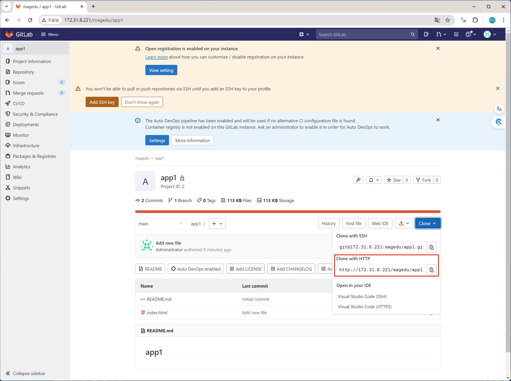

# 一：k8s CI/CD

## 1.1：CI/CD简介

```sh
公司里在虚拟机或者服务器上做过代码部署和回滚。
CI：持续集成。反复把代码进行提交和合并的操作，就是CI。通常的工具就是svn和gitlab。公司内部安装gitlab，创建一些账号，让开发把代码提交到gitlab上。
CD：持续部署。指的是运维把开发测试后并提交的代码通过一种工具部署到业务环境里去。这个环境有可能是测试、生产或者灰度。总之，执行的这个部署操作就称为CD。通常会使用jenkins。

gitlab实现持续继承
jenkins实现持续部署
```

## 1.2：镜像更新方式简介和示例

### 1.2.1：简介

```sh
## 更新方式
1、更新yaml文件。
这是最原始的升级方式。
通过更新yaml文件中image的版本，然后kubectl apply -f app.yaml

2、kubectl set image 
直接对deployment控制器指定新的镜像，一旦执行完kubectl set image的命令，就会起到更新镜像的目的。

使用kubectl命令实现镜像更新及回滚。
kubectl set image --help
deployment 四个参数

3、开发devops平台，调用API更新
公司自己开发的devops工具，通过调用k8s的API，达到镜像更新的目的。
```

### 1.2.2：示例

#### 1.2.2.1：清理环境

```sh
# 当前环境
[root@k8s-master1:~]# kubectl get pods -n magedu
NAME                                         READY   STATUS    RESTARTS      AGE
deploy-devops-redis-75d6c9ff6-vn4t6          1/1     Running   2 (32m ago)   2d12h
magedu-jenkins-deployment-67d564f976-jmlv8   1/1     Running   2 (32m ago)   2d12h
wordpress-app-deployment-558b444569-6nn6n    2/2     Running   4 (32m ago)   2d12h

# 删除jenkins
[root@k8s-master1:/opt/k8s-data/yaml/magedu]# cd tomcat-app1
[root@k8s-master1:/opt/k8s-data/yaml/magedu/tomcat-app1]# ll
total 8
drwxr-xr-x  2 root root   46 Jul  5 22:55 ./
drwxr-xr-x 12 root root  166 Jul  5 12:13 ../
-rw-r--r--  1 root root  596 Jul  5 12:13 hpa.yaml
-rw-r--r--  1 root root 1868 Jul  5 22:55 tomcat-app1.yaml
[root@k8s-master1:/opt/k8s-data/yaml/magedu/tomcat-app1]# kubectl delete -f ../jenkins/jenkins.yaml 
deployment.apps "magedu-jenkins-deployment" deleted
service "magedu-jenkins-service" deleted
[root@k8s-master1:/opt/k8s-data/yaml/magedu/tomcat-app1]# kubectl delete -f ../jenkins/pv/
persistentvolume "jenkins-datadir-pv" deleted
persistentvolume "jenkins-root-datadir-pv" deleted
persistentvolumeclaim "jenkins-datadir-pvc" deleted
persistentvolumeclaim "jenkins-root-data-pvc" deleted

PS：
要删除pod，后删除PV和PVC。

[root@k8s-master1:/opt/k8s-data/yaml/magedu/tomcat-app1]# kubectl delete -f ../wordpress/wordpress.yaml 
deployment.apps "wordpress-app-deployment" deleted
service "wordpress-app-spec" deleted

[root@k8s-master1:/opt/k8s-data/yaml/magedu/tomcat-app1]# kubectl delete -f ../redis/redis.yaml 
deployment.apps "deploy-devops-redis" deleted
service "srv-devops-redis" deleted
[root@k8s-master1:/opt/k8s-data/yaml/magedu/tomcat-app1]# kubectl delete -f ../redis/pv/
persistentvolume "redis-datadir-pv-1" deleted
persistentvolumeclaim "redis-datadir-pvc-1" deleted


# 清理干净
[root@k8s-master1:/opt/k8s-data/yaml/magedu/tomcat-app1]# kubectl get pods -n magedu
No resources found in magedu namespace.
```

#### 1.2.2.2：准备升级前初始环境

```sh
# 准备几个镜像
registry.cn-hangzhou.aliyuncs.com/zhangshijie/tomcat-app1:v1 ~ v5

# 修改yaml文件中的镜像为v1
[root@k8s-master1:/opt/k8s-data/yaml/magedu/tomcat-app1]# vim tomcat-app1.yaml 
kind: Deployment
#apiVersion: extensions/v1beta1
apiVersion: apps/v1
metadata:
  labels:
    app: magedu-tomcat-app1-deployment-label
  name: magedu-tomcat-app1-deployment
  namespace: magedu
spec:
  replicas: 2 
  selector:
    matchLabels:
      app: magedu-tomcat-app1-selector
  template:
    metadata:
      labels:
        app: magedu-tomcat-app1-selector
    spec:
      containers:
      - name: magedu-tomcat-app1-container
        image: registry.cn-hangzhou.aliyuncs.com/zhangshijie/tomcat-app1:v1
        #command: ["/apps/tomcat/bin/run_tomcat.sh"]
        imagePullPolicy: IfNotPresent
        #imagePullPolicy: Always
        ports:
        - containerPort: 8080
          protocol: TCP
          name: http
        env:
        - name: "password"
          value: "123456"
        - name: "age"
          value: "18"
        resources:
          limits:
            cpu: 1
            memory: "512Mi"
          requests:
            cpu: 500m
            memory: "512Mi"
        volumeMounts:
        - name: magedu-images
          mountPath: /usr/local/nginx/html/webapp/images
          readOnly: false
        - name: magedu-static
          mountPath: /usr/local/nginx/html/webapp/static
          readOnly: false
      volumes:
      - name: magedu-images
        nfs:
          server: 172.31.8.109
          path: /data/k8sdata/magedu/images
      - name: magedu-static
        nfs:
          server: 172.31.8.109
          path: /data/k8sdata/magedu/static
#      nodeSelector:
#        project: magedu
#        app: tomcat
---
kind: Service
apiVersion: v1
metadata:
  labels:
    app: magedu-tomcat-app1-service-label
  name: magedu-tomcat-app1-service
  namespace: magedu
spec:
  type: NodePort
  ports:
  - name: http
    port: 80
    protocol: TCP
    targetPort: 8080
    nodePort: 30092
  selector:
    app: magedu-tomcat-app1-selector

# apply
[root@k8s-master1:/opt/k8s-data/yaml/magedu/tomcat-app1]# kubectl get pods -n magedu
NAME                                             READY   STATUS    RESTARTS   AGE
magedu-tomcat-app1-deployment-568987ff77-6rzrl   1/1     Running   0          2m33s
magedu-tomcat-app1-deployment-568987ff77-fnblh   1/1     Running   0          2m33s

# 从其他主机访问
[root@k8s-ha1:~]# while true;do curl http://172.31.8.112:30092/myapp/index.html;sleep 0.5;done
tomcat app1 v1
tomcat app1 v1
tomcat app1 v1
tomcat app1 v1
tomcat app1 v1
tomcat app1 v1
......
```

#### 1.2.2.3：第一种方式升级 -- 改yaml文件

```sh
# [root@k8s-master1:/opt/k8s-data/yaml/magedu/tomcat-app1]# vim tomcat-app1.yaml
kind: Deployment
#apiVersion: extensions/v1beta1
apiVersion: apps/v1
metadata:
  labels:
    app: magedu-tomcat-app1-deployment-label
  name: magedu-tomcat-app1-deployment
  namespace: magedu
spec:
  replicas: 2 
  selector:
    matchLabels:
      app: magedu-tomcat-app1-selector
  template:
    metadata:
      labels:
        app: magedu-tomcat-app1-selector
    spec:
      containers:
      - name: magedu-tomcat-app1-container
        image: registry.cn-hangzhou.aliyuncs.com/zhangshijie/tomcat-app1:v2    
......

PS：
修改yaml中镜像为v2版本

[root@k8s-master1:/opt/k8s-data/yaml/magedu/tomcat-app1]# kubectl apply -f tomcat-app1.yaml 
deployment.apps/magedu-tomcat-app1-deployment configured
service/magedu-tomcat-app1-service unchanged

[root@k8s-master1:/opt/k8s-data/yaml/magedu/tomcat-app1]# kubectl get pods -n magedu
NAME                                             READY   STATUS        RESTARTS   AGE
magedu-tomcat-app1-deployment-568987ff77-6rzrl   1/1     Terminating   0          7m36s
magedu-tomcat-app1-deployment-568987ff77-fnblh   1/1     Terminating   0          7m36s
magedu-tomcat-app1-deployment-5f777cfdbb-c972r   1/1     Running       0          23s
magedu-tomcat-app1-deployment-5f777cfdbb-ng4cn   1/1     Running       0          39s

[root@k8s-master1:/opt/k8s-data/yaml/magedu/tomcat-app1]# kubectl get pods -n magedu
NAME                                             READY   STATUS    RESTARTS   AGE
magedu-tomcat-app1-deployment-5f777cfdbb-c972r   1/1     Running   0          59s
magedu-tomcat-app1-deployment-5f777cfdbb-ng4cn   1/1     Running   0          75s

PS：
可以看到容器重新创建的过程。

[root@k8s-ha1:~]# while true;do curl http://172.31.8.112:30092/myapp/index.html;sleep 0.5;done
tomcat app1 v1
tomcat app1 v1
tomcat app1 v1
tomcat app1 v1
tomcat app1 v1
tomcat app1 v1
......
curl: (7) Failed to connect to 172.31.8.112 port 30092: Connection refused
tomcat app1 v1
tomcat app1 v2
tomcat app1 v1
tomcat app1 v2
tomcat app1 v1
tomcat app1 v2
......
curl: (7) Failed to connect to 172.31.8.112 port 30092: Connection refused
tomcat app1 v2
tomcat app1 v2
tomcat app1 v2
tomcat app1 v2
tomcat app1 v2
tomcat app1 v2
......

PS：
由于没有加就绪探针，所以会报错。在公司里面，尽量加上探针，否则pod一旦启动，就会加到service后面，由于java服务启动比较慢，就会导致报错。
最后还是升级成功，这是一种最原始的升级方式
```

#### 1.2.2.4：第二种方式升级 -- kubectl set image

```sh
# 找到yaml中的container名字
[root@k8s-master1:/opt/k8s-data/yaml/magedu/tomcat-app1]# vim tomcat-app1.yaml 
kind: Deployment
#apiVersion: extensions/v1beta1
apiVersion: apps/v1
metadata:
  labels:
    app: magedu-tomcat-app1-deployment-label
  name: magedu-tomcat-app1-deployment
  namespace: magedu
spec:
  replicas: 2 
  selector:
    matchLabels:
      app: magedu-tomcat-app1-selector
  template:
    metadata:
      labels:
        app: magedu-tomcat-app1-selector
    spec:
      containers:
      - name: magedu-tomcat-app1-container
......

PS：
容器名字是 magedu-tomcat-app1-container
控制器名字是 magedu-tomcat-app1-deployment

PS：
命令
kubectl set image deployment magedu-tomcat-app1-deployment magedu-tomcat-app1-container=registry.cn-hangzhou.aliyuncs.com/zhangshijie/tomcat-app1:v3 -n magedu
注意这个命令有四个参数
`控制器名字
`容器名字
`新镜像名字
`命令空间

[root@k8s-master1:~/yaml/20240710/4.CICD-case]# kubectl set image deployment magedu-tomcat-app1-deployment magedu-tomcat-app1-container=registry.cn-hangzhou.aliyuncs.com/zhangshijie/tomcat-app1:v3 -n magedu
deployment.apps/magedu-tomcat-app1-deployment image updated

[root@k8s-master1:~/yaml/20240710/4.CICD-case]# kubectl get pods -n magedu
NAME                                             READY   STATUS        RESTARTS   AGE
magedu-tomcat-app1-deployment-5974b46c4c-bhx7x   1/1     Running       0          63s
magedu-tomcat-app1-deployment-5974b46c4c-gbtn8   1/1     Running       0          28s
magedu-tomcat-app1-deployment-5f777cfdbb-c972r   1/1     Terminating   0          15m
magedu-tomcat-app1-deployment-5f777cfdbb-ng4cn   1/1     Terminating   0          16m

[root@k8s-master1:~/yaml/20240710/4.CICD-case]# kubectl get pods -n magedu
NAME                                             READY   STATUS    RESTARTS   AGE
magedu-tomcat-app1-deployment-5974b46c4c-bhx7x   1/1     Running   0          96s
magedu-tomcat-app1-deployment-5974b46c4c-gbtn8   1/1     Running   0          61s


[root@k8s-ha1:~]# while true;do curl http://172.31.8.112:30092/myapp/index.html;sleep 0.5;done
tomcat app1 v2
tomcat app1 v2
tomcat app1 v2
tomcat app1 v2
tomcat app1 v2
tomcat app1 v2
......
curl: (7) Failed to connect to 172.31.8.112 port 30092: Connection refused
tomcat app1 v2
tomcat app1 v3
tomcat app1 v2
tomcat app1 v3
tomcat app1 v2
tomcat app1 v3
......
curl: (7) Failed to connect to 172.31.8.112 port 30092: Connection refused
tomcat app1 v3
tomcat app1 v3
tomcat app1 v3
tomcat app1 v3
tomcat app1 v3
tomcat app1 v3
......

PS：
旧版本的pod会被删除，删除的一瞬间就会报错。加上探针就不会有报错了。
升级成功。

## 回退到上一个版本
# 1. 重新set image
# 2. k8s内部维护自己版本

# 查看历史版本信息
[root@k8s-master1:~/yaml/20240710/4.CICD-case]# kubectl rollout history deployment magedu-tomcat-app1-deployment -n magedu
deployment.apps/magedu-tomcat-app1-deployment 
REVISION  CHANGE-CAUSE
1         <none>
2         <none>
3         <none>

PS：
这里的123就是曾经部署的不同版本。

PS：查看kubectl rollout帮助
[root@k8s-master1:~/yaml/20240710/4.CICD-case]# kubectl rollout --help


# 
[root@k8s-master1:~/yaml/20240710/4.CICD-case]# kubectl rollout undo deployment magedu-tomcat-app1-deployment -n magedu
deployment.apps/magedu-tomcat-app1-deployment rolled back

[root@k8s-master1:~/yaml/20240710/4.CICD-case]# kubectl get pods -n magedu
NAME                                             READY   STATUS        RESTARTS   AGE
magedu-tomcat-app1-deployment-5974b46c4c-bhx7x   1/1     Terminating   0          9m43s
magedu-tomcat-app1-deployment-5974b46c4c-gbtn8   1/1     Terminating   0          9m8s
magedu-tomcat-app1-deployment-5f777cfdbb-94cxq   1/1     Running       0          30s
magedu-tomcat-app1-deployment-5f777cfdbb-x9dwz   1/1     Running       0          31s

[root@k8s-master1:~/yaml/20240710/4.CICD-case]# kubectl get pods -n magedu
NAME                                             READY   STATUS    RESTARTS   AGE
magedu-tomcat-app1-deployment-5f777cfdbb-94cxq   1/1     Running   0          94s
magedu-tomcat-app1-deployment-5f777cfdbb-x9dwz   1/1     Running   0          95s

[root@k8s-ha1:~]# while true;do curl http://172.31.8.112:30092/myapp/index.html;sleep 0.5;done
tomcat app1 v3
tomcat app1 v3
tomcat app1 v3
tomcat app1 v3
tomcat app1 v3
tomcat app1 v3
......
curl: (7) Failed to connect to 172.31.8.112 port 30092: Connection refused
tomcat app1 v3
curl: (7) Failed to connect to 172.31.8.112 port 30092: Connection refused
tomcat app1 v2
tomcat app1 v2
tomcat app1 v2
tomcat app1 v2
tomcat app1 v2
tomcat app1 v2
......

PS：
这种回滚要比在虚拟机里回滚简化很多了。

[root@k8s-master1:~/yaml/20240710/4.CICD-case]# kubectl rollout history deployment magedu-tomcat-app1-deployment -n magedu
deployment.apps/magedu-tomcat-app1-deployment 
REVISION  CHANGE-CAUSE
1         <none>
3         <none>
4         <none>

PS：
相当于把2重新执行了一次，变成4。就没有2了。

[root@k8s-master1:~/yaml/20240710/4.CICD-case]# kubectl rollout undo deployment magedu-tomcat-app1-deployment -n magedu
deployment.apps/magedu-tomcat-app1-deployment rolled back

[root@k8s-master1:~/yaml/20240710/4.CICD-case]# kubectl rollout history deployment magedu-tomcat-app1-deployment -n magedu
deployment.apps/magedu-tomcat-app1-deployment 
REVISION  CHANGE-CAUSE
1         <none>
4         <none>
5         <none>

[root@k8s-ha1:~]# while true;do curl http://172.31.8.112:30092/myapp/index.html;sleep 0.5;done
tomcat app1 v3
tomcat app1 v3
tomcat app1 v3
tomcat app1 v3
tomcat app1 v3
tomcat app1 v3
......

PS：
实际上又是回到版本3了。
如果再执行一次，那就是回到版本2了。
所以，就是在最近的两个版本上进行操作。

## 回退到指定版本
公司场景：
v1 ----> v2 ----> v3
想回退到v1
两种方式：
1. kubectl set image 指定到需要的镜像
2. kubectl rollout 回退到指定的版本，自己要去查

[root@k8s-master1:~/yaml/20240710/4.CICD-case]# kubectl rollout history deployment magedu-tomcat-app1-deployment -n magedu
deployment.apps/magedu-tomcat-app1-deployment 
REVISION  CHANGE-CAUSE
1         <none>
4         <none>
5         <none>

[root@k8s-master1:~/yaml/20240710/4.CICD-case]# kubectl rollout undo deployment/magedu-tomcat-app1-deployment --to-revision=1 -n magedu
deployment.apps/magedu-tomcat-app1-deployment rolled back

[root@k8s-master1:~/yaml/20240710/4.CICD-case]# kubectl get pods -n magedu
NAME                                             READY   STATUS        RESTARTS   AGE
magedu-tomcat-app1-deployment-568987ff77-bg7kg   1/1     Running       0          25s
magedu-tomcat-app1-deployment-568987ff77-crw4s   1/1     Running       0          26s
magedu-tomcat-app1-deployment-5974b46c4c-7p5m8   1/1     Terminating   0          6m51s
magedu-tomcat-app1-deployment-5974b46c4c-88lfm   1/1     Terminating   0          6m52s

[root@k8s-master1:~/yaml/20240710/4.CICD-case]# kubectl get pods -n magedu
NAME                                             READY   STATUS    RESTARTS   AGE
magedu-tomcat-app1-deployment-568987ff77-bg7kg   1/1     Running   0          40s
magedu-tomcat-app1-deployment-568987ff77-crw4s   1/1     Running   0          41s

[root@k8s-ha1:~]# while true;do curl http://172.31.8.112:30092/myapp/index.html;sleep 0.5;done
tomcat app1 v3
tomcat app1 v3
tomcat app1 v3
tomcat app1 v3
tomcat app1 v3
tomcat app1 v3
......
curl: (7) Failed to connect to 172.31.8.112 port 30092: Connection refused
tomcat app1 v3
tomcat app1 v1
tomcat app1 v1
tomcat app1 v1
tomcat app1 v1
tomcat app1 v1
tomcat app1 v1
......

[root@k8s-master1:~/yaml/20240710/4.CICD-case]# kubectl rollout history deployment magedu-tomcat-app1-deployment -n magedu
deployment.apps/magedu-tomcat-app1-deployment 
REVISION  CHANGE-CAUSE
4         <none>
5         <none>
6         <none>

PS：
在history里，把版本1改成版本6了。
```

#### 1.2.2.5：第三种方式升级 -- 调用API

```sh
`在jenkins服务器上，通过ansible，或者某些python脚本，go脚本，直接调用k8s的API。这是不使用SSH。

# 使用python脚本调用API，SSH方式
[root@jenkins-server:~]# apt update

[root@jenkins-server:~]# apt install python3-pip

[root@jenkins-server:~]# pip3 install kubernetes

PS：这样的话，jenkins服务器在装上kubernetes模块后，就可以远程调用k8s的API了。

# python脚本
[root@jenkins-server:~/jenkins_python]# ll
total 12
drwxr-xr-x 2 root root   91 Jul 14 19:37 ./
drwx------ 6 root root  188 Jul 14 19:37 ../
-rw-r--r-- 1 root root 1761 Jul 14 19:37 1.update-image.py
-rw-r--r-- 1 root root  128 Jul 14 19:37 2.magedu-app1-test.sh
-rw-r--r-- 1 root root 4028 Jul 14 19:37 3.magedu-app1_deploy.sh

[root@jenkins-server:~/jenkins_python]# vim 1.update-image.py 
#!/usr/bin/env python
#coding:utf-8
#Author:Zhang ShiJie


import os
from kubernetes import client, config
from kubernetes.client.rest import ApiException

#拼接要更新的namespace、deployment name及目的镜像为一个请求body
def update_deployment_image(namespace,deployment_name,update_image):
    body = api_instance.read_namespaced_deployment(deployment_name,namespace)
    #指定deployment下pod中第一个container的镜像
    body.spec.template.spec.containers[0].image = update_image
    return body

#执行镜像更新并打印response信息
def replace_deployment(deployment_name,namespace,body):
    try:
        api_response = api_instance.replace_namespaced_deployment(deployment_name,namespace,body)
        #print(api_response)
        print("\033[0;32mnamespace:{}, deployment:{},当前镜像版本:{}, 更新完成!!!\033[0m".format(namespace,deployment_name,update_image))
    except ApiException as e:
        print("Exception when calling AppsV1Api->replace_namespaced_deployment: %s\n" % e)


if __name__ == "__main__":
    #kubernetes的认证文件,一般位于master节点的/root/.kube/config
    kube_conf = os.path.join('/data/.kube/config')
    config.load_kube_config(kube_conf)
    api_instance = client.AppsV1Api()

    #配置更新参数，指定要更新的namespace、deployment name及目的镜像名称
    namespace = 'magedu'
    deployment_name = 'magedu-tomcat-app1-deployment'
    update_image = 'registry.cn-hangzhou.aliyuncs.com/zhangshijie/tomcat-app1:v4'

    #调用update_deployment_image函数
    body = update_deployment_image(namespace,deployment_name,update_image)

    #调用replace_deployment执行镜像更新并打印response信息
    replace_deployment(deployment_name, namespace, body)

PS：
如果是在jenkins的运维平台上，这些都是参数配置。
这里写死了。
这里更新到v4的镜像。

# 创建目录并拷贝k8s认证文件
[root@jenkins-server:~]# mkdir -p /data/.kube/

[root@k8s-master1:~/yaml/20240710/4.CICD-case]# scp /root/.kube/config 172.31.8.222:/data/.kube/

[root@jenkins-server:~]# cat /data/.kube/config
apiVersion: v1
clusters:
- cluster:
    certificate-authority-data: LS0tLS1CRUdJTiBDRVJUSUZJQ0FURS0tLS0tCk1JSURsRENDQW55Z0F3SUJBZ0lVYUJEM3VmVDMxd3k3M0I5L3ZZTCs3MWxYNktRd0RRWUpLb1pJaHZjTkFRRUwKQlFBd1lURUxNQWtHQTFVRUJoTUNRMDR4RVRBUEJnTlZCQWdUQ0VoaGJtZGFhRzkxTVFzd0NRWURWUVFIRXdKWQpVekVNTUFvR0ExVUVDaE1EYXpoek1ROHdEUVlEVlFRTEV3WlRlWE4wWlcweEV6QVJCZ05WQkFNVENtdDFZbVZ5CmJtVjBaWE13SUJjTk1qUXdOakkzTVRVd01qQXdXaGdQTWpFeU5EQTJNRE14TlRBeU1EQmFNR0V4Q3pBSkJnTlYKQkFZVEFrTk9NUkV3RHdZRFZRUUlFd2hJWVc1bldtaHZkVEVMTUFrR0ExVUVCeE1DV0ZNeEREQUtCZ05WQkFvVApBMnM0Y3pFUE1BMEdBMVVFQ3hNR1UzbHpkR1Z0TVJNd0VRWURWUVFERXdwcmRXSmxjbTVsZEdWek1JSUJJakFOCkJna3Foa2lHOXcwQkFRRUZBQU9DQVE4QU1JSUJDZ0tDQVFFQXhvcnR2U1BZUEFQKzFTbnc1bVp3YlRrKy9DWW8KbmFiNE9LM1lnK3B3cnRydlFicnlWTC9nQ0ZxdXNIV1pQU3pqNDc2ZmdZOU12ZDZmZmZXUzNmaTJYWmNweUNFRwpoYlBWMlRrdXFMdlZ0YmNHUzNvS09TMWlORkVjV3RuNjgyRm8xSXdYOHQ3cUFEOW1mcnRvT3NyeDBlOG9LR3dMCjdEOEZ6cWxYczRWY3lSeWpZdVNoYU10dENrbFkwZzhTV2pDOW5NV3NsRHBpVk9zMnJqcFZUUVJ6OVZRekZWWHQKQkxXT01BdEpHVGVqODhIZEJIS3lPc21FM2crMVZmQ2ZTRHlnQXdlaHlPeko5bE96QzhCMmtrTFh6L3pOSlhnNApBbU5JZmtyOVY0UzZOZEphSWZBbjBkdmRDajBHck16bmpRbUMxc0xqU3ZtQThlb2UzRGZhNmRXTSt3SURBUUFCCm8wSXdRREFPQmdOVkhROEJBZjhFQkFNQ0FRWXdEd1lEVlIwVEFRSC9CQVV3QXdFQi96QWRCZ05WSFE0RUZnUVUKZmozdm52VUJlSS9sMVBQZkwvd243dnM0Y2FBd0RRWUpLb1pJaHZjTkFRRUxCUUFEZ2dFQkFLSW1GajJRVGd3ZgpkbXlCRWlpZm5WM0tuSGVPaTdrbVBSSGtwR3dDbThYQVV0K2ordUo0Y1VZSFcrMTY4V3NhNjBJcEtockJob1ZLCkF1aVppMVkzVW5BNHBac2hvM3pzektFR3Npd0prRTUwYjVQb0ljVk1BdzlUTzFaR3A2K2xXWXdLV0lmWmxjL1oKQkorOTViL25hb2YxWGxxSklqU3ZxZG0yanQ3SnhGUGlEN2d0NHE1NzFPNVI1eldLZmJjeGF6cGgyQXk0VGVhQgp6VWxLYzU0Z0FvdFlldk8va3VqZXFVRnkybXRrNVljZWsyTDJmOFlyUFpGeU5GWkVXSTVJTjJ0YXJvU1lIVGIxCi96QW1TTzJUcSt2VWxJQnVDdTFOUlR4cHowZkZRVElnaVkzKzh0cWdoQzczU1NvWmErNGgzN1pNWVBnbm8wanEKNGpGcHlocmkzOFU9Ci0tLS0tRU5EIENFUlRJRklDQVRFLS0tLS0K
    server: https://172.31.8.188:6443
  name: cluster1
contexts:
- context:
    cluster: cluster1
    user: admin
  name: context-cluster1
current-context: context-cluster1
kind: Config
preferences: {}
users:
- name: admin
  user:
    client-certificate-data: LS0tLS1CRUdJTiBDRVJUSUZJQ0FURS0tLS0tCk1JSUQxekNDQXIrZ0F3SUJBZ0lVRUVHczd6SW9UOXYwclF6YTF0MVJZTzJRR2hZd0RRWUpLb1pJaHZjTkFRRUwKQlFBd1lURUxNQWtHQTFVRUJoTUNRMDR4RVRBUEJnTlZCQWdUQ0VoaGJtZGFhRzkxTVFzd0NRWURWUVFIRXdKWQpVekVNTUFvR0ExVUVDaE1EYXpoek1ROHdEUVlEVlFRTEV3WlRlWE4wWlcweEV6QVJCZ05WQkFNVENtdDFZbVZ5CmJtVjBaWE13SUJjTk1qUXdOakkzTVRVd05UQXdXaGdQTWpBM05EQTJNVFV4TlRBMU1EQmFNR2N4Q3pBSkJnTlYKQkFZVEFrTk9NUkV3RHdZRFZRUUlFd2hJWVc1bldtaHZkVEVMTUFrR0ExVUVCeE1DV0ZNeEZ6QVZCZ05WQkFvVApEbk41YzNSbGJUcHRZWE4wWlhKek1ROHdEUVlEVlFRTEV3WlRlWE4wWlcweERqQU1CZ05WQkFNVEJXRmtiV2x1Ck1JSUJJakFOQmdrcWhraUc5dzBCQVFFRkFBT0NBUThBTUlJQkNnS0NBUUVBdjlpSDhuMkIwanpOWTFpMTY2b0gKVHRySnczRnBBS2FTZjNIOGJGVlZOUmZQSGNSOEplaTBSQ2xtZVBTbzEwM0FrM2ViV01FRWtrdnFaWVl4UFJhTQpROHhZbE5QNlVxdGZ3OEVuYUVzc21rSkZlckJoMC9VYXZWTmpqWjFJclRGT0xpQWltY0hjNDB4V0c5YmJEdWZnCjdESjRQUG90SXF2Wmp0S2xFYlN1eENaMS9tUFo1S2FTUFhXbUNVSkhvbmxGSmc3UmNWcWtqSFo4dkQ0MVZCODYKU1FEbGpIYUh2NWlpbUpMbmlHcm53UEhhcldXUHRvUUs4QzUrUldUaGJTOUtxMjc1SWd3M254Sk9JVUp3Znhocwp0ZGZrZktiQ2JGNVhWMEozKzkvM0hJUzBXZ0RPWFp0SlVxZGhyVTNVQXFGYVd0RlNXV0FDSTRpU3lDbUE4eVcyCkh3SURBUUFCbzM4d2ZUQU9CZ05WSFE4QkFmOEVCQU1DQmFBd0hRWURWUjBsQkJZd0ZBWUlLd1lCQlFVSEF3RUcKQ0NzR0FRVUZCd01DTUF3R0ExVWRFd0VCL3dRQ01BQXdIUVlEVlIwT0JCWUVGS0t3NDF6NVdnbXVvdHBvRzFrYgpWdXdDSThOZ01COEdBMVVkSXdRWU1CYUFGSDQ5NzU3MUFYaVA1ZFR6M3kvOEorNzdPSEdnTUEwR0NTcUdTSWIzCkRRRUJDd1VBQTRJQkFRQzJvdkx4Q2gwMlV3TUk4MndFSFhaSkVGRExONGthMm1yMjdGUWIwdWVnWG5IV1drSjkKcHJFQk5QUXgydGIwSkVZV0RwbjRTM0JkeDdkVzdYMC8wYUw2VU92RVhtWEJpNmYzUDVzVC9nTWU5NE5pRGNxRwpIa1pQOTNGQUFiM2l5eVQ1V3VtWDBZQWV4Wk15N3E5d1hWUXFNaUdubWFQaEx6clpRdWpvWEZKNXVCS3ByRHhuCnUwU0ZVTnphQmZOQjFkMEJQT3FvMmhDNytsWldnbmwxaDI4bVBJMFZGZ21iSGFyRmxSUVNUSmN0bzM3NnBCdDIKbXRTc1VtQ2w1OTdJOHZTYzFSd2hMZVE0Q3UzdHFqTHJrcmR1VkJhTDVUSXoybzJORDJOS21HZlNSQ3pXQlFQZwppTUtvWkpHYzNCWjhTQldyR3lDNkdNSC9WdlBNcnR4Q0prckMKLS0tLS1FTkQgQ0VSVElGSUNBVEUtLS0tLQo=
    client-key-data: LS0tLS1CRUdJTiBSU0EgUFJJVkFURSBLRVktLS0tLQpNSUlFcEFJQkFBS0NBUUVBdjlpSDhuMkIwanpOWTFpMTY2b0hUdHJKdzNGcEFLYVNmM0g4YkZWVk5SZlBIY1I4CkplaTBSQ2xtZVBTbzEwM0FrM2ViV01FRWtrdnFaWVl4UFJhTVE4eFlsTlA2VXF0Znc4RW5hRXNzbWtKRmVyQmgKMC9VYXZWTmpqWjFJclRGT0xpQWltY0hjNDB4V0c5YmJEdWZnN0RKNFBQb3RJcXZaanRLbEViU3V4Q1oxL21QWgo1S2FTUFhXbUNVSkhvbmxGSmc3UmNWcWtqSFo4dkQ0MVZCODZTUURsakhhSHY1aWltSkxuaUdybndQSGFyV1dQCnRvUUs4QzUrUldUaGJTOUtxMjc1SWd3M254Sk9JVUp3Znhoc3RkZmtmS2JDYkY1WFYwSjMrOS8zSElTMFdnRE8KWFp0SlVxZGhyVTNVQXFGYVd0RlNXV0FDSTRpU3lDbUE4eVcySHdJREFRQUJBb0lCQUVaVUFacFNpam5oRWtZZQpLaXFuWFNCNk1rYlVsM0ttbmNQY3JIV21YcU1sQkVkY1ZVcXNZUkV2d0NJTlJxd1BFODY3cFJaSFEvN0JsNzc2CkQ2amVVRE0yZ1M2bCt2azlXOUR1U1IwQm1lcys2aXVNNTRBRk5YVThVWjJEa0RYMWdqeUVpVXFtZCt4WGVxV2cKQVJRWXl5cXJZY3F3eDhVVERLRS85VVZsWUVBRldzY2YzRDlPK0pSc3RNWThzTDVEZ2Q4NzBjRHVwM3dWdTFoSgpRTDRFQW5sUVBsTVVwNnU2YnZ1Q00yQ3hMdW1hRjM0aEEvVURxSFB5cXBhV1RlYUNtZTh0aUp3bFErOWxSZksyCkV3Y1d2OEJTNjBha0d1Q1VsTjFvRjdQaXJ6N0xobEdSc2tLSnZzZXB2Z3lqTTl4UjRlYTBqK3NVd1lidUExTzcKNjBpVEJ5a0NnWUVBNkdzM00wSDJ3V3FqUG9CeGo4WG9BL0RtWTM1ZjdONlVUL3Y5Tk9GdSsxckI5akZDOEtnSApJSTJCaE5wcWlMQ2pUSVRqTVVQcnFCYVd5dnFZV1Qyd1U1V1Y0RGlDbG5yTGZsbFlpcTE1a0lNWGRUekZMWmdmCndwTVVvcko5V2I0cWtaVWpabi9XamJLV1BxcFFralJvazhxUHc4RXpaTFJhWnZWd1dnSGtrUU1DZ1lFQTAwOTcKdzdrd1l4RWtySWVqWTc4OW1LNlUxdUNOTWZSam1uaWU3aVpIc0N5d3d2anM2aHNDVDViNU93S1p4ZW5jak9ZRwpGTnduUmJZUXprcHFuNWtJdEhnV1hueGlJTitrVWp5NFFaZnZCaEF0aW9zS252OXlxU2xFMDZLaDBuaUdUVXRiCitYQ3RQcUdRVmRob0xpd2toeGU1M01SNUVxWWRYVmVkNnBMSFpiVUNnWUVBZ0JoWFhCREhCdUxYQmVPVXMwREkKRnlQMlZtK1lQdHlOc1dlWXJrUncvbWVPN3psSFE0dllJY0RiMlhUbnNsNW9JZ3c3aXpONzlqQTgrN0lSdFYyaQppTzZ3bzl1QlhaNWYrVXNVMlpteW5rc2g2cU9McVExbXM3Nk1hUDhteHdkZ1BzeUxyanBXN2RHM3JPSUJkaE1jCmNCZjhGRSt2RzVtckdZTzhZRjhhc2pFQ2dZRUF3aU5OVHdXdVNlWXZMbit6Z21ucU9vTnk1WFFLNVBGbUxUNVMKcmZQbmV4bWtFSTFJaE5EcHI1dkNRUS9qbld4OW44bVpuc0toSmkvZWd0amwydGxyb1BxUGVxR0dPak9lTVp2dApvUDNvc1VaZHdPSjdrSmFham9ZRzRQV1MvTjZVYlNFbVVDYlFWREYxZlJsRXBkOFNkRGM5SUhJMTFnZGVCU3NCClA4azRmdDBDZ1lCMHBBcTVyay82VXppVzJoaDFabHBhaGhKYzBYR3ZTdC9NVWs1eHhBOWFTQmhNZWt5UXhIRUYKbE13elNnWDd3VTdGeTlNTE53LzJ0Q2JleXRUT2VoNTc3cGN0ZzgxNVZFZjhRQ2loOS9RWkxMZS81WDcySmJ1Rgo2SFlCNWsreVg1UzQyeVF1aHZHeTdDRkFMTDdRSStnT3BiMDNjdWtrZDFyOWo5anc0T3VrdGc9PQotLS0tLUVORCBSU0EgUFJJVkFURSBLRVktLS0tLQo=

# 执行更新操作
[root@jenkins-server:~/jenkins_python]# python3 1.update-image.py 
namespace:magedu, deployment:magedu-tomcat-app1-deployment,当前镜像版本:registry.cn-hangzhou.aliyuncs.com/zhangshijie/tomcat-app1:v4, 更新完成!!!

# 
[root@k8s-master1:~/yaml/20240710/4.CICD-case]# kubectl get pods -n magedu
NAME                                             READY   STATUS        RESTARTS   AGE
magedu-tomcat-app1-deployment-568987ff77-bg7kg   1/1     Terminating   0          120m
magedu-tomcat-app1-deployment-568987ff77-crw4s   1/1     Terminating   0          120m
magedu-tomcat-app1-deployment-775c84b4c6-q8fcl   1/1     Running       0          37s
magedu-tomcat-app1-deployment-775c84b4c6-qdt5b   1/1     Running       0          22s

[root@k8s-master1:~/yaml/20240710/4.CICD-case]# kubectl get pods -n magedu
NAME                                             READY   STATUS    RESTARTS   AGE
magedu-tomcat-app1-deployment-775c84b4c6-q8fcl   1/1     Running   0          68s
magedu-tomcat-app1-deployment-775c84b4c6-qdt5b   1/1     Running   0          53s

[root@k8s-ha1:~]# while true;do curl http://172.31.8.112:30092/myapp/index.html;sleep 0.5;done
tomcat app1 v1
tomcat app1 v1
tomcat app1 v1
tomcat app1 v1
tomcat app1 v1
tomcat app1 v1
......
tomcat app1 v1
tomcat app1 v4
tomcat app1 v1
tomcat app1 v4
tomcat app1 v1
tomcat app1 v4
......
curl: (7) Failed to connect to 172.31.8.112 port 30092: Connection refused
tomcat app1 v4
tomcat app1 v4
tomcat app1 v4
tomcat app1 v4
tomcat app1 v4
tomcat app1 v4
......

PS：
镜像更新成功。
这里的脚本是手动执行的。
实际上，工作中是jenkins执行的。或者是代码部署工具传递一些参数，主要是镜像。因为你的容器名字不会变，你的namespace，service和deployment都不会变。

PS：
[root@k8s-master1:~/yaml/20240710/4.CICD-case]# kubectl rollout history deployment magedu-tomcat-app1-deployment -n magedu
deployment.apps/magedu-tomcat-app1-deployment 
REVISION  CHANGE-CAUSE
4         <none>
5         <none>
6         <none>
7         <none>

PS：注意7。
```

#### 1.2.2.6：暂停更新与恢复更新

```sh
https://kubernetes.io/zh/docs/concepts/workloads/controllers/deployment/#pausing-and-resuming-a-deployment
这个方法用的不多。
为什么要暂停呢？主要就是观察下已经更新的pod是不是正常的。

起码有几个pod，更新是分批次更新的。

命令：
kubectl rollout pause deployment magedu-tomcat-app1-deployment -n magedu
kubectl rollout resume deployment magedu-tomcat-app1-deployment -n magedu

[root@k8s-master1:~/yaml/20240710/4.CICD-case]# kubectl set image deployment magedu-tomcat-app1-deployment magedu-tomcat-app1-container=registry.cn-hangzhou.aliyuncs.com/zhangshijie/tomcat-app1:v3 -n magedu
deployment.apps/magedu-tomcat-app1-deployment image updated

[root@k8s-master1:~/yaml/20240710/4.CICD-case]# kubectl rollout pause deployment magedu-tomcat-app1-deployment -n magedudeployment.apps/magedu-tomcat-app1-deployment paused

[root@k8s-master1:~/yaml/20240710/4.CICD-case]# kubectl rollout resume deployment magedu-tomcat-app1-deployment -n magedu
deployment.apps/magedu-tomcat-app1-deployment resumed

PS：
按批次更新，起到一定的灰度效果。


# 恢复环境
[root@k8s-master1:~/yaml/20240710/4.CICD-case]# kubectl delete -f /opt/k8s-data/yaml/magedu/tomcat-app1/tomcat-app1.yaml 
deployment.apps "magedu-tomcat-app1-deployment" deleted
service "magedu-tomcat-app1-service" deleted

[root@k8s-master1:~/yaml/20240710/4.CICD-case]# kubectl get pods -n magedu
No resources found in magedu namespace.
```

## 1.3：镜像更新类型 - Recreate简介

### 1.3.1：Recreate简介


```sh
## Recreate（重建更新）：
先删除现有的pod，然后基于新版本的镜像重建，Pod重建期间服务是不可用的，其优势是同时只有一个版本在线，不会产生多版本在线问题，缺点是pod删除后到pod重建成功中间的时间会导致服务无法访问，因此较少使用。

具体流程为先删除旧版本pod，然后deployment控制器再新建一个ReplicaSet控制器并基于新版本镜像创建新的pod，旧版本的ReplicaSet控制器会保留用于版本回退。

```

### 1.3.2：示例

```sh
[root@k8s-master1:~/yaml/20240710/4.CICD-case]# ll
total 8
drwxr-xr-x 4 root root  136 Jul 10 13:03 ./
drwxr-xr-x 6 root root   92 Jul 10 13:03 ../
-rw-r--r-- 1 root root 2762 Jul 10 13:03 1.tomcat-app1-Recreate.yaml
-rw-r--r-- 1 root root 2836 Jul 10 13:03 2.tomcat-app1-RollingUpdate.yaml
drwxr-xr-x 2 root root   91 Jul 10 13:03 3.Blue-Green-Deploy-Cases/
drwxr-xr-x 2 root root   91 Jul 10 13:03 4.Canary-cases/

[root@k8s-master1:~/yaml/20240710/4.CICD-case]# vim 1.tomcat-app1-Recreate.yaml 
kind: Deployment
#apiVersion: extensions/v1beta1
apiVersion: apps/v1
metadata:
  labels:
    app: magedu-tomcat-app1-deployment-label
  name: magedu-tomcat-app1-deployment
  namespace: magedu
spec:
  replicas: 2
  strategy:
    type: Recreate 
  selector:
    matchLabels:
      app: magedu-tomcat-app1-selector
  template:
    metadata:
      labels:
        app: magedu-tomcat-app1-selector
    spec:
      containers:
      - name: magedu-tomcat-app1-container
        image: registry.cn-hangzhou.aliyuncs.com/zhangshijie/tomcat-app1:v1 
        #command: ["/apps/tomcat/bin/run_tomcat.sh"]
        #imagePullPolicy: IfNotPresent
        imagePullPolicy: Always
        ports:
        - containerPort: 8080
          protocol: TCP
          name: http
        env:
        - name: "password"
          value: "123456"
        - name: "age"
          value: "18"
        resources:
          limits:
            cpu: 1
            memory: "512Mi"
          requests:
            cpu: 500m
            memory: "512Mi"
        startupProbe:
          httpGet:
            path: /myapp/index.html
            port: 8080
          initialDelaySeconds: 5 #首次检测延迟5s
          failureThreshold: 3  #从成功转为失败的次数
          periodSeconds: 3 #探测间隔周期
        readinessProbe:
          httpGet:
            #path: /monitor/monitor.html
            path: /myapp/index.html
            port: 8080
          initialDelaySeconds: 5
          periodSeconds: 3
          timeoutSeconds: 5
          successThreshold: 1
          failureThreshold: 3
        livenessProbe:
          httpGet:
            #path: /monitor/monitor.html
            path: /myapp/index.html
            port: 8080
          initialDelaySeconds: 5
          periodSeconds: 3
          timeoutSeconds: 5
          successThreshold: 1
          failureThreshold: 3
#        volumeMounts:
#        - name: magedu-images
#          mountPath: /usr/local/nginx/html/webapp/images
#          readOnly: false
#        - name: magedu-static
#          mountPath: /usr/local/nginx/html/webapp/static
#          readOnly: false
#      volumes:
#      - name: magedu-images
#        nfs:
#          server: 172.31.7.109
#          path: /data/k8sdata/magedu/images
#      - name: magedu-static
#        nfs:
#          server: 172.31.7.109
#          path: /data/k8sdata/magedu/static

#      nodeSelector:
#        project: magedu
#        app: tomcat
---
kind: Service
apiVersion: v1
metadata:
  labels:
    app: magedu-tomcat-app1-service-label
  name: magedu-tomcat-app1-service
  namespace: magedu
spec:
  type: NodePort
  ports:
  - name: http
    port: 80
    protocol: TCP
    targetPort: 8080
    nodePort: 30092
  selector:
    app: magedu-tomcat-app1-selector

PS：
  strategy:
    type: Recreate 
使用Recreate更新策略。

PS：
[root@k8s-master1:~/yaml/20240710/4.CICD-case]# kubectl explain Deployment.spec.strategy.type
KIND:     Deployment
VERSION:  apps/v1

FIELD:    type <string>

DESCRIPTION:
     Type of deployment. Can be "Recreate" or "RollingUpdate". Default is
     RollingUpdate.

PS：
这里使用探针。就不会出现更新过程中无法访问的情况了。但是Recreate还会出现的。如果是Rollingup就不会出现。

# apply
[root@k8s-master1:~/yaml/20240710/4.CICD-case]# kubectl apply -f 1.tomcat-app1-Recreate.yaml 
deployment.apps/magedu-tomcat-app1-deployment created
service/magedu-tomcat-app1-service created

[root@k8s-master1:~/yaml/20240710/4.CICD-case]# kubectl get pods -n magedu
NAME                                             READY   STATUS    RESTARTS   AGE
magedu-tomcat-app1-deployment-69445dd7c5-kmq7w   0/1     Running   0          6s
magedu-tomcat-app1-deployment-69445dd7c5-xgfcb   0/1     Running   0          6s

# 使用python调用API，镜像改为v2
[root@jenkins-server:~/jenkins_python]# vim 1.update-image.py 
镜像改为v2

[root@jenkins-server:~/jenkins_python]# python3 1.update-image.py 
namespace:magedu, deployment:magedu-tomcat-app1-deployment,当前镜像版本:registry.cn-hangzhou.aliyuncs.com/zhangshijie/tomcat-app1:v2, 更新完成!!!

# 观察现象
[root@k8s-master1:~/yaml/20240710/4.CICD-case]# kubectl get pods -n magedu
NAME                                             READY   STATUS        RESTARTS   AGE
magedu-tomcat-app1-deployment-69445dd7c5-kmq7w   1/1     Terminating   0          90s
magedu-tomcat-app1-deployment-69445dd7c5-xgfcb   1/1     Terminating   0          90s

[root@k8s-master1:~/yaml/20240710/4.CICD-case]# kubectl get pods -n magedu
NAME                                             READY   STATUS    RESTARTS   AGE
magedu-tomcat-app1-deployment-7b7c479d76-5bp8r   1/1     Running   0          24s
magedu-tomcat-app1-deployment-7b7c479d76-v5qhl   1/1     Running   0          24s

[root@k8s-ha1:~]# while true;do curl http://172.31.8.112:30092/myapp/index.html;sleep 0.5;done
tomcat app1 v1
tomcat app1 v1
tomcat app1 v1
tomcat app1 v1
tomcat app1 v1
tomcat app1 v1
......
curl: (7) Failed to connect to 172.31.8.112 port 30092: Connection refused
curl: (7) Failed to connect to 172.31.8.112 port 30092: Connection refused
curl: (7) Failed to connect to 172.31.8.112 port 30092: Connection refused
curl: (7) Failed to connect to 172.31.8.112 port 30092: Connection refused
curl: (7) Failed to connect to 172.31.8.112 port 30092: Connection refused
curl: (7) Failed to connect to 172.31.8.112 port 30092: Connection refused
......
tomcat app1 v2
tomcat app1 v2
tomcat app1 v2
tomcat app1 v2
tomcat app1 v2
tomcat app1 v2
......

PS：
更新过程中无法访问服务。
这种机制用的很少。

# 恢复环境
[root@k8s-master1:~/yaml/20240710/4.CICD-case]# kubectl delete -f 1.tomcat-app1-Recreate.yaml 
deployment.apps "magedu-tomcat-app1-deployment" deleted
service "magedu-tomcat-app1-service" deleted
```

## 1.4：镜像更新类型 -- RollingUpdate简介

### 1.4.1：RollingUpdate简介


```sh
## RollingUpdate（滚动更新）：
滚动更新是默认的更新策略。滚动更新是新建一个ReplicaSet并基于新版本镜像创建一部分新版本的pod（默认是25%），然后删除一部分旧版本的pod，然后再创建一部分新版本pod，再删除一部分旧版本pod，直到旧版本pod删除完成。滚动更新优势是在升级过程当中不会导致服务不可用，缺点是升级过程中会导致新版本和旧版本两个版本在短时间内的并存。

具体升级过程是在执行更新操作后k8s会再创建一个新版本的ReplicaSet控制器，再删除旧版本的ReplicaSet控制器下的一部分pod的同时会在新版本的ReplicaSet控制器下创建新的pod，直到旧版本的pod全部被删除完成。

旧版本的ReplicaSet控制器会保留用于版本回退。

## RollingUpdate（更新过程）：
在执行滚动更新的同时，为了保证服务的可用性，当前控制器内不可用的pod（pod需要拉取镜像执行创建和执行探针探测期间是不可用的）不能超出一定范围，因此需要至少保留一定数量的pod以保证服务可以被客户端正常访问，可以通过以下参数指定：

`kubectl explain deployment.spec.strategy
deployment.spec.strategy.rollingUpdate.maxSurge # 指定在升级期间pod总数可以超出定义好的期望的pod数的个数或者百分比，maxSurge是如果是百分比会向上取pod整数，默认为25%，如果设置为10%，假如当前是100个pod，那么升级时最多将创建110个pod，即额外有10%的pod临时会超出当前（replicas）指定的副本数限制。
如果是5个pod，那就是2个maxSurge。向上取整导致。

deployment.spec.strategy.rollingUpdate.maxUnavailable # 指定在升级期间最大不可用的pod数，可以是整数或者当前pod的百分比，而maxUnavailable如果是百分比则向下取pod整数，默认是25%，假如当前是100个pod，那么升级时最多可以有25个（25%）pod不可用，即还要75个（75%）pod是可用的。
如果是10个pod，那就是2个maxUnavailable。

【如果是10个pod，升级过程中最多可以创建13个pod。在这13个pod当中，最极端情况是8个可用pod，2个不可用pod，然后有额外的3个pod是不可用的。最终都升级成10个可用pod。】

# 注意：以上两个值不能同时为0，如果maxUnavailable最大不可用pod为0，maxSurge超出pod数也为0，那么将会导致pod无法进行滚动更新。

`假如副本数正好是10个，maxSurge和maxUnavailable的值都是默认的25%。
1. 那么在代码部署过程中pod最多可以有当前的副本数（replica 10）+（10 X maxSurge的25%）= 10+3（往上取整）= 13个
当前副本数 + 可以超出的副本数（maxSurge）= 升级过程中总副本数

2. maxUnavailable也是25%，那么包含两层含义：
2.1. 更新期间不可用的pod最多是（maxUnavailable）个，即用当前的副本数10 X 25% = 2（往下取整）
     maxUnavailable = 当前副本数 X 25% = 2（往下取整）
2.2. 更新期间可用的pod是当前副本数10 - （10 X 25%=2） = 8个
     可用副本数 = 当前副本数 - maxUnavailable
     
3. 10个pod，在基于RollingUpdate升级过程中会出现13个pod，其中8个可用的以及5个不可用的，直到滚动全部更新后恢复10个。
```

### 1.4.2：示例

```sh
[root@k8s-master1:~/yaml/20240710/4.CICD-case]# vim 2.tomcat-app1-RollingUpdate.yaml 
kind: Deployment
#apiVersion: extensions/v1beta1
apiVersion: apps/v1
metadata:
  labels:
    app: magedu-tomcat-app1-deployment-label
  name: magedu-tomcat-app1-deployment
  namespace: magedu
spec:
  replicas: 10
  strategy:
    type: RollingUpdate
    rollingUpdate:
      maxSurge: 25%
      maxUnavailable: 25%  
  selector:
    matchLabels:
      app: magedu-tomcat-app1-selector
  template:
    metadata:
      labels:
        app: magedu-tomcat-app1-selector
    spec:
      containers:
      - name: magedu-tomcat-app1-container
        image: registry.cn-hangzhou.aliyuncs.com/zhangshijie/tomcat-app1:v1 
        #command: ["/apps/tomcat/bin/run_tomcat.sh"]
        #imagePullPolicy: IfNotPresent
        imagePullPolicy: Always
        ports:
        - containerPort: 8080
          protocol: TCP
          name: http
        env:
        - name: "password"
          value: "123456"
        - name: "age"
          value: "18"
        resources:
          limits:
            cpu: 1
            memory: "512Mi"
          requests:
            cpu: 500m
            memory: "512Mi"
        startupProbe:
          httpGet:
            path: /myapp/index.html
            port: 8080
          initialDelaySeconds: 15 #首次检测延迟15s
          failureThreshold: 3  #从成功转为失败的次数
          periodSeconds: 3 #探测间隔周期
        readinessProbe:
          httpGet:
            #path: /monitor/monitor.html
            path: /myapp/index.html
            port: 8080
          initialDelaySeconds: 15
          periodSeconds: 3
          timeoutSeconds: 5
          successThreshold: 1
          failureThreshold: 3
        livenessProbe:
          httpGet:
            #path: /monitor/monitor.html
            path: /myapp/index.html
            port: 8080
          initialDelaySeconds: 15
          periodSeconds: 3
          timeoutSeconds: 5
          successThreshold: 1
          failureThreshold: 3
#        volumeMounts:
#        - name: magedu-images
#          mountPath: /usr/local/nginx/html/webapp/images
#          readOnly: false
#        - name: magedu-static
#          mountPath: /usr/local/nginx/html/webapp/static
#          readOnly: false
#      volumes:
#      - name: magedu-images
#        nfs:
#          server: 172.31.7.109
#          path: /data/k8sdata/magedu/images
#      - name: magedu-static
#        nfs:
#          server: 172.31.7.109
#          path: /data/k8sdata/magedu/static

#      nodeSelector:
#        project: magedu
#        app: tomcat
---
kind: Service
apiVersion: v1
metadata:
  labels:
    app: magedu-tomcat-app1-service-label
  name: magedu-tomcat-app1-service
  namespace: magedu
spec:
  type: NodePort
  ports:
  - name: http
    port: 80
    protocol: TCP
    targetPort: 8080
    nodePort: 30092
  selector:
    app: magedu-tomcat-app1-selector

PS：
  strategy:
    type: RollingUpdate
    rollingUpdate:
      maxSurge: 25%
      maxUnavailable: 25%  
使用RollingUpdate策略。默认都是25%。不写也是25%。

# apply
[root@k8s-master1:~/yaml/20240710/4.CICD-case]# kubectl apply -f 2.tomcat-app1-RollingUpdate.yaml 
deployment.apps/magedu-tomcat-app1-deployment created
service/magedu-tomcat-app1-service created

[root@k8s-master1:~/yaml/20240710/4.CICD-case]# kubectl get pods -n magedu
NAME                                             READY   STATUS    RESTARTS   AGE
magedu-tomcat-app1-deployment-5f97d4bd64-59qzp   1/1     Running   0          66s
magedu-tomcat-app1-deployment-5f97d4bd64-bf68h   1/1     Running   0          66s
magedu-tomcat-app1-deployment-5f97d4bd64-kwwxs   1/1     Running   0          66s
magedu-tomcat-app1-deployment-5f97d4bd64-mrswl   1/1     Running   0          66s
magedu-tomcat-app1-deployment-5f97d4bd64-thsj6   1/1     Running   0          66s
magedu-tomcat-app1-deployment-5f97d4bd64-tj625   1/1     Running   0          66s
magedu-tomcat-app1-deployment-5f97d4bd64-vcbw6   1/1     Running   0          66s
magedu-tomcat-app1-deployment-5f97d4bd64-vwcrw   1/1     Running   0          66s
magedu-tomcat-app1-deployment-5f97d4bd64-wmqbb   0/1     Running   0          66s
magedu-tomcat-app1-deployment-5f97d4bd64-zs2cc   1/1     Running   0          66s

PS：
目前版本是v1

# 升级
[root@jenkins-server:~/jenkins_python]# python3 1.update-image.py 
namespace:magedu, deployment:magedu-tomcat-app1-deployment,当前镜像版本:registry.cn-hangzhou.aliyuncs.com/zhangshijie/tomcat-app1:v2, 更新完成!!!

# 观察现象
[root@k8s-master1:~/yaml/20240710/4.CICD-case]# kubectl get pods -n magedu
NAME                                             READY   STATUS              RESTARTS   AGE
magedu-tomcat-app1-deployment-5f97d4bd64-59qzp   1/1     Terminating         0          6m13s
magedu-tomcat-app1-deployment-5f97d4bd64-bf68h   1/1     Running             0          6m13s
magedu-tomcat-app1-deployment-5f97d4bd64-kwwxs   1/1     Running             0          6m13s
magedu-tomcat-app1-deployment-5f97d4bd64-mrswl   1/1     Running             0          6m13s
magedu-tomcat-app1-deployment-5f97d4bd64-thsj6   1/1     Running             0          6m13s
magedu-tomcat-app1-deployment-5f97d4bd64-tj625   1/1     Running             0          6m13s
magedu-tomcat-app1-deployment-5f97d4bd64-vcbw6   1/1     Terminating         0          6m13s
magedu-tomcat-app1-deployment-5f97d4bd64-vwcrw   1/1     Running             0          6m13s
magedu-tomcat-app1-deployment-5f97d4bd64-wmqbb   1/1     Running             0          6m13s
magedu-tomcat-app1-deployment-5f97d4bd64-zs2cc   1/1     Running             0          6m13s
magedu-tomcat-app1-deployment-6fd4fcbf89-bbmzx   0/1     ContainerCreating   0          1s
magedu-tomcat-app1-deployment-6fd4fcbf89-fs4vm   0/1     ContainerCreating   0          1s
magedu-tomcat-app1-deployment-6fd4fcbf89-kd68s   0/1     ContainerCreating   0          1s
magedu-tomcat-app1-deployment-6fd4fcbf89-qqcdm   0/1     ContainerCreating   0          1s
magedu-tomcat-app1-deployment-6fd4fcbf89-zt74n   0/1     ContainerCreating   0          1s

[root@k8s-master1:~/yaml/20240710/4.CICD-case]# kubectl get pods -n magedu
NAME                                             READY   STATUS              RESTARTS   AGE
magedu-tomcat-app1-deployment-5f97d4bd64-59qzp   1/1     Terminating         0          6m16s
magedu-tomcat-app1-deployment-5f97d4bd64-bf68h   1/1     Running             0          6m16s
magedu-tomcat-app1-deployment-5f97d4bd64-kwwxs   1/1     Running             0          6m16s
magedu-tomcat-app1-deployment-5f97d4bd64-mrswl   1/1     Running             0          6m16s
magedu-tomcat-app1-deployment-5f97d4bd64-thsj6   1/1     Running             0          6m16s
magedu-tomcat-app1-deployment-5f97d4bd64-tj625   1/1     Running             0          6m16s
magedu-tomcat-app1-deployment-5f97d4bd64-vcbw6   1/1     Terminating         0          6m16s
magedu-tomcat-app1-deployment-5f97d4bd64-vwcrw   1/1     Running             0          6m16s
magedu-tomcat-app1-deployment-5f97d4bd64-wmqbb   1/1     Running             0          6m16s
magedu-tomcat-app1-deployment-5f97d4bd64-zs2cc   1/1     Running             0          6m16s
magedu-tomcat-app1-deployment-6fd4fcbf89-bbmzx   0/1     Running             0          4s
magedu-tomcat-app1-deployment-6fd4fcbf89-fs4vm   0/1     ContainerCreating   0          4s
magedu-tomcat-app1-deployment-6fd4fcbf89-kd68s   0/1     ContainerCreating   0          4s
magedu-tomcat-app1-deployment-6fd4fcbf89-qqcdm   0/1     ContainerCreating   0          4s
magedu-tomcat-app1-deployment-6fd4fcbf89-zt74n   0/1     ContainerCreating   0          4s

[root@k8s-master1:~/yaml/20240710/4.CICD-case]# kubectl get pods -n magedu
NAME                                             READY   STATUS              RESTARTS   AGE
magedu-tomcat-app1-deployment-5f97d4bd64-bf68h   1/1     Terminating         0          6m46s
magedu-tomcat-app1-deployment-5f97d4bd64-kwwxs   1/1     Running             0          6m46s
magedu-tomcat-app1-deployment-5f97d4bd64-mrswl   1/1     Running             0          6m46s
magedu-tomcat-app1-deployment-5f97d4bd64-thsj6   1/1     Terminating         0          6m46s
magedu-tomcat-app1-deployment-5f97d4bd64-tj625   1/1     Terminating         0          6m46s
magedu-tomcat-app1-deployment-5f97d4bd64-vwcrw   1/1     Terminating         0          6m46s
magedu-tomcat-app1-deployment-5f97d4bd64-wmqbb   1/1     Terminating         0          6m46s
magedu-tomcat-app1-deployment-5f97d4bd64-zs2cc   1/1     Running             0          6m46s
magedu-tomcat-app1-deployment-6fd4fcbf89-2bjd2   0/1     Running             0          10s
magedu-tomcat-app1-deployment-6fd4fcbf89-97s7t   0/1     ContainerCreating   0          10s
magedu-tomcat-app1-deployment-6fd4fcbf89-bbmzx   1/1     Running             0          34s
magedu-tomcat-app1-deployment-6fd4fcbf89-cgtcj   0/1     Running             0          13s
magedu-tomcat-app1-deployment-6fd4fcbf89-fs4vm   1/1     Running             0          34s
magedu-tomcat-app1-deployment-6fd4fcbf89-k5brz   0/1     ContainerCreating   0          4s
magedu-tomcat-app1-deployment-6fd4fcbf89-kd68s   1/1     Running             0          34s
magedu-tomcat-app1-deployment-6fd4fcbf89-qqcdm   1/1     Running             0          34s
magedu-tomcat-app1-deployment-6fd4fcbf89-w4t7s   0/1     Running             0          13s
magedu-tomcat-app1-deployment-6fd4fcbf89-zt74n   1/1     Running             0          34s

[root@k8s-master1:~/yaml/20240710/4.CICD-case]# kubectl get pods -n magedu
NAME                                             READY   STATUS        RESTARTS   AGE
magedu-tomcat-app1-deployment-5f97d4bd64-kwwxs   1/1     Terminating   0          7m23s
magedu-tomcat-app1-deployment-5f97d4bd64-mrswl   1/1     Terminating   0          7m23s
magedu-tomcat-app1-deployment-5f97d4bd64-zs2cc   1/1     Terminating   0          7m23s
magedu-tomcat-app1-deployment-6fd4fcbf89-2bjd2   1/1     Running       0          47s
magedu-tomcat-app1-deployment-6fd4fcbf89-97s7t   1/1     Running       0          47s
magedu-tomcat-app1-deployment-6fd4fcbf89-bbmzx   1/1     Running       0          71s
magedu-tomcat-app1-deployment-6fd4fcbf89-cgtcj   1/1     Running       0          50s
magedu-tomcat-app1-deployment-6fd4fcbf89-fs4vm   1/1     Running       0          71s
magedu-tomcat-app1-deployment-6fd4fcbf89-k5brz   1/1     Running       0          41s
magedu-tomcat-app1-deployment-6fd4fcbf89-kd68s   1/1     Running       0          71s
magedu-tomcat-app1-deployment-6fd4fcbf89-qqcdm   1/1     Running       0          71s
magedu-tomcat-app1-deployment-6fd4fcbf89-w4t7s   1/1     Running       0          50s
magedu-tomcat-app1-deployment-6fd4fcbf89-zt74n   1/1     Running       0          71s

[root@k8s-master1:~/yaml/20240710/4.CICD-case]# kubectl get pods -n magedu
NAME                                             READY   STATUS    RESTARTS   AGE
magedu-tomcat-app1-deployment-6fd4fcbf89-2bjd2   1/1     Running   0          4m39s
magedu-tomcat-app1-deployment-6fd4fcbf89-97s7t   1/1     Running   0          4m39s
magedu-tomcat-app1-deployment-6fd4fcbf89-bbmzx   1/1     Running   0          5m3s
magedu-tomcat-app1-deployment-6fd4fcbf89-cgtcj   1/1     Running   0          4m42s
magedu-tomcat-app1-deployment-6fd4fcbf89-fs4vm   1/1     Running   0          5m3s
magedu-tomcat-app1-deployment-6fd4fcbf89-k5brz   1/1     Running   0          4m33s
magedu-tomcat-app1-deployment-6fd4fcbf89-kd68s   1/1     Running   0          5m3s
magedu-tomcat-app1-deployment-6fd4fcbf89-qqcdm   1/1     Running   0          5m3s
magedu-tomcat-app1-deployment-6fd4fcbf89-w4t7s   1/1     Running   0          4m42s
magedu-tomcat-app1-deployment-6fd4fcbf89-zt74n   1/1     Running   0          5m3s


[root@k8s-ha1:~]# while true;do curl http://172.31.8.112:30092/myapp/index.html;sleep 0.5;done
tomcat app1 v1
tomcat app1 v1
tomcat app1 v1
tomcat app1 v1
tomcat app1 v1
tomcat app1 v1
......
tomcat app1 v2
tomcat app1 v2
tomcat app1 v1
tomcat app1 v1
tomcat app1 v1
tomcat app1 v1
tomcat app1 v1
tomcat app1 v2
tomcat app1 v2
tomcat app1 v2
tomcat app1 v2
tomcat app1 v1
tomcat app1 v1
tomcat app1 v1
tomcat app1 v1
tomcat app1 v2
tomcat app1 v2
tomcat app1 v2
tomcat app1 v2
tomcat app1 v2
tomcat app1 v1
tomcat app1 v1
tomcat app1 v1
tomcat app1 v2
tomcat app1 v2
tomcat app1 v2
tomcat app1 v2
tomcat app1 v2
tomcat app1 v1
tomcat app1 v1
tomcat app1 v1
tomcat app1 v2
tomcat app1 v2
tomcat app1 v2
tomcat app1 v2
tomcat app1 v2
tomcat app1 v1
tomcat app1 v1
tomcat app1 v1
tomcat app1 v2
tomcat app1 v2
tomcat app1 v2
tomcat app1 v2
tomcat app1 v2
tomcat app1 v2
......

PS：
新建和删除交替出现，删除过程中访问不受影响。因为加了探针，只有探针通过之后才会加到service里面。
短时间内会有两个版本同时共存。

# 查看deployment的升级过程描述
[root@k8s-master1:~/yaml/20240710/4.CICD-case]# kubectl get deployment -n magedu
NAME                            READY   UP-TO-DATE   AVAILABLE   AGE
magedu-tomcat-app1-deployment   10/10   10           10          29m

[root@k8s-master1:~/yaml/20240710/4.CICD-case]# kubectl describe deployment -n magedu magedu-tomcat-app1-deployment 
Name:                   magedu-tomcat-app1-deployment
Namespace:              magedu
CreationTimestamp:      Sun, 14 Jul 2024 17:24:15 -0400
Labels:                 app=magedu-tomcat-app1-deployment-label
Annotations:            deployment.kubernetes.io/revision: 2
Selector:               app=magedu-tomcat-app1-selector
Replicas:               10 desired | 10 updated | 10 total | 10 available | 0 unavailable
StrategyType:           RollingUpdate
MinReadySeconds:        0
RollingUpdateStrategy:  25% max unavailable, 25% max surge
Pod Template:
  Labels:  app=magedu-tomcat-app1-selector
  Containers:
   magedu-tomcat-app1-container:
    Image:      registry.cn-hangzhou.aliyuncs.com/zhangshijie/tomcat-app1:v2
    Port:       8080/TCP
    Host Port:  0/TCP
    Limits:
      cpu:     1
      memory:  512Mi
    Requests:
      cpu:      500m
      memory:   512Mi
    Liveness:   http-get http://:8080/myapp/index.html delay=15s timeout=5s period=3s #success=1 #failure=3
    Readiness:  http-get http://:8080/myapp/index.html delay=15s timeout=5s period=3s #success=1 #failure=3
    Startup:    http-get http://:8080/myapp/index.html delay=15s timeout=1s period=3s #success=1 #failure=3
    Environment:
      password:  123456
      age:       18
    Mounts:      <none>
  Volumes:       <none>
Conditions:
  Type           Status  Reason
  ----           ------  ------
  Available      True    MinimumReplicasAvailable
  Progressing    True    NewReplicaSetAvailable
OldReplicaSets:  <none>
NewReplicaSet:   magedu-tomcat-app1-deployment-6fd4fcbf89 (10/10 replicas created)
Events:
  Type    Reason             Age                From                   Message
  ----    ------             ----               ----                   -------
  Normal  ScalingReplicaSet  29m                deployment-controller  Scaled up replica set magedu-tomcat-app1-deployment-5f97d4bd64 to 10
  Normal  ScalingReplicaSet  23m                deployment-controller  Scaled up replica set magedu-tomcat-app1-deployment-6fd4fcbf89 to 3
  Normal  ScalingReplicaSet  23m                deployment-controller  Scaled down replica set magedu-tomcat-app1-deployment-5f97d4bd64 to 8
  Normal  ScalingReplicaSet  23m                deployment-controller  Scaled up replica set magedu-tomcat-app1-deployment-6fd4fcbf89 to 5
  Normal  ScalingReplicaSet  23m                deployment-controller  Scaled down replica set magedu-tomcat-app1-deployment-5f97d4bd64 to 7
  Normal  ScalingReplicaSet  23m                deployment-controller  Scaled up replica set magedu-tomcat-app1-deployment-6fd4fcbf89 to 6
  Normal  ScalingReplicaSet  23m                deployment-controller  Scaled down replica set magedu-tomcat-app1-deployment-5f97d4bd64 to 6
  Normal  ScalingReplicaSet  23m                deployment-controller  Scaled up replica set magedu-tomcat-app1-deployment-6fd4fcbf89 to 7
  Normal  ScalingReplicaSet  23m                deployment-controller  Scaled down replica set magedu-tomcat-app1-deployment-5f97d4bd64 to 5
  Normal  ScalingReplicaSet  23m (x8 over 23m)  deployment-controller  (combined from similar events): Scaled down replica set magedu-tomcat-app1-deployment-5f97d4bd64 to 0

```

## 1.5：CI/CD实例


```sh
# 核心内容：jenkins把代码从gitlab上拉下来，然后部署到k8s上去。

代码克隆下来
打成镜像后，上传harbor
```

### 1.5.1：安装gitlab服务器

#### 1.5.1.1：安装gitlab服务器，创建项目和服务

```sh
# 下载某版本的gitlab安装包
# https://mirrors.tuna.tsinghua.edu.cn/
[root@gitlba-server:~]# wget https://mirrors.tuna.tsinghua.edu.cn/gitlab-ce/ubuntu/pool/focal/main/g/gitlab-ce/gitlab-ce_14.2.5-ce.0_amd64.deb

# 安装
[root@gitlba-server:~]# dpkg -i gitlab-ce_14.2.5-ce.0_amd64.deb

# 配置
[root@gitlba-server:~]# vim /etc/gitlab/gitlab.rb 
external_url 'http://172.31.8.221'

PS：
这里不做解析，直接使用IP地址。

# 配置邮件告警
[root@gitlba-server:~]# vim /etc/gitlab/gitlab.rb
gitlab_rails['smtp_enable'] = true
gitlab_rails['smtp_address'] = "smtp.126.com"
gitlab_rails['smtp_port'] = 465
gitlab_rails['smtp_user_name'] = "pythonwang@126.com"
gitlab_rails['smtp_password'] = "OKVOOKFYIIVITSIV"
gitlab_rails['smtp_domain'] = "126.com"
gitlab_rails['smtp_authentication'] = "login"
gitlab_rails['smtp_enable_starttls_auto'] = true
gitlab_rails['smtp_tls'] = true
gitlab_rails['gitlab_email_from'] = "pythonwang@126.com"
gitlab_rails['initial_root_password'] = "12345678"

# 重新配置gitlab，执行初始化
[root@gitlba-server:~]# gitlab-ctl reconfigure

PS：
初始化时间较久，会持续几分钟。
初始化就是加载配置文件，生成很多运行环境，包括把各个服务都运行起来
gitlab服务器内存不能小于2G。
这里设置了root密码是12345678

# 登录
http://172.31.8.221

1. group ----> 项目magedu
在一定程度上，group和k8s的namespace功能是一样的。
通过group来隔离不同项目的代码。
使用private，必须是项目的成员才可以，是管理员添加的。
一个group里会有N多project。

2. project ----> 项目中的不同服务
创建一个project app1
```


#### 1.5.1.2：验证git环境是否正常



```sh
# 安装git
[root@jenkins-server:~/jenkins_python]# apt install git

# 克隆项目代码
[root@jenkins-server:/opt]# git clone http://172.31.8.221/magedu/app1.git
Cloning into 'app1'...
Username for 'http://172.31.8.221': root
Password for 'http://root@172.31.8.221': 
remote: Enumerating objects: 6, done.
remote: Counting objects: 100% (6/6), done.
remote: Compressing objects: 100% (4/4), done.
remote: Total 6 (delta 0), reused 0 (delta 0), pack-reused 0
Unpacking objects: 100% (6/6), 571 bytes | 571.00 KiB/s, done.

[root@jenkins-server:/opt]# ls
app1
[root@jenkins-server:/opt]# cd app1/
[root@jenkins-server:/opt/app1]# ls
index.html  README.md
[root@jenkins-server:/opt/app1]# cat index.html
<!DOCTYPE html>
<html lang="en">
<head>
    <meta charset="UTF-8">
    <title>magedu 官网</title>
</head>
<body>
    <h1>当前版本v1111111111</h1>
</body>
</html>

PS：
验证可以克隆成功。

# 修改index.html
[root@jenkins-server:/opt/app1]# vim index.html
<!DOCTYPE html>
<html lang="en">
<head>
    <meta charset="UTF-8">
    <title>magedu 官网</title>
</head>
<body>
    <h1>当前版本v1111111111</h1>
    <h1>当前版本v2222222222</h1>
</body>
</html>

# 提交代码
[root@jenkins-server:/opt/app1]# git commit -m "v2"
[main a9c070a] v2
 Committer: root <root@jenkins-server.magedu.com>
Your name and email address were configured automatically based
on your username and hostname. Please check that they are accurate.
You can suppress this message by setting them explicitly. Run the
following command and follow the instructions in your editor to edit
your configuration file:

    git config --global --edit

After doing this, you may fix the identity used for this commit with:

    git commit --amend --reset-author

 1 file changed, 1 insertion(+)
 
[root@jenkins-server:/opt/app1]# git push
Username for 'http://172.31.8.221': root
Password for 'http://root@172.31.8.221': 
Enumerating objects: 5, done.
Counting objects: 100% (5/5), done.
Delta compression using up to 4 threads
Compressing objects: 100% (3/3), done.
Writing objects: 100% (3/3), 327 bytes | 327.00 KiB/s, done.
Total 3 (delta 1), reused 0 (delta 0)
To http://172.31.8.221/magedu/app1.git
   643576e..a9c070a  main -> main

PS：
现在不考虑数据安全情况下，gitlab能用了。
```


### 1.5.2：安装jenkins服务器

#### 1.5.2.1：安装jenkins服务，并配置

```sh
# https://jenkins.io/zh/download

# jenkins依赖java，需要先安装java。java8后者java11。
[root@jenkins-server:~]# apt install openjdk-11-jdk

[root@jenkins-server:~]# java --version
openjdk 11.0.23 2024-04-16
OpenJDK Runtime Environment (build 11.0.23+9-post-Ubuntu-1ubuntu120.04.2)
OpenJDK 64-Bit Server VM (build 11.0.23+9-post-Ubuntu-1ubuntu120.04.2, mixed mode, sharing)

# 下载某版本的jenkins安装包
# https://mirrors.tuna.tsinghua.edu.cn/
[root@jenkins-server:~]# wget https://mirrors.tuna.tsinghua.edu.cn/jenkins/debian-stable/jenkins_2.452.3_all.deb

# 安装jenkins依赖包daemon和net-tools
[root@jenkins-server:~]# apt install daemon net-tools

# 安装jenkins
[root@jenkins-server:~]# dpkg -i jenkins_2.452.3_all.deb 

# 停止jenkins
[root@jenkins-server:~]# systemctl stop jenkins

PS：
centos安装jenkins后，服务不会自动启动。
ubuntu安装jenkins后，服务会自动启动，需要先停止，改配置。

# 修改配置文件
[root@jenkins-server:~]# vim /etc/default/jenkins
JENKINS_USER=root
JENKINS_GROUP=root
JENKINS_ARGS="--webroot=/var/cache/$NAME/war --httpPort=$HTTP_PORT -Dhudson.security.csrf.GlobalCrumblssuerConfiguration.DISABLE_CSRF_PROTECTION=true"

PS：
默认是拿jenkins用户启动jenkins，这里改为root用户启动jenkins。
如果使用jenkins用户，以后做代码部署的时候涉及到jenkins用户密钥的拷贝等，用户身份切换等，比较麻烦。
webhook功能，一旦有人做代码提交，就让jenkins执行代码构建，那么gitlab就会远程触发jenkins。新版的jenkins里要加一个参数，要不然会拒绝，报403错误。不启用这个功能，就可以远程触发。

# 修改启动文件
[root@jenkins-server:~]# vim /lib/systemd/system/jenkins.service
User=root                                                                                 Group=root

# 重启jenkins
[root@jenkins-server:~]# systemctl daemon-reload
[root@jenkins-server:~]# systemctl restart jenkins

# 查看登录密码
[root@jenkins-server:~]# cat /var/lib/jenkins/secrets/initialAdminPassword
5c5c18698e634fa3aab6d26bdb8bdc64

# 登录jenkins服务器
```


#### 1.5.2.2：重启jenkins服务，让插件生效

```sh
[root@jenkins-server:~]# systemctl restart jenkins

# jenkins插件位置
[root@jenkins-server:~]# ls /var/lib/jenkins/plugins/
ant                                     ionicons-api.jpi             pipeline-model-api
antisamy-markup-formatter               jackson2-api                 pipeline-model-api.jpi
antisamy-markup-formatter.jpi           jackson2-api.jpi             pipeline-model-definition
ant.jpi                                 jakarta-activation-api       pipeline-model-definition.jpi
apache-httpcomponents-client-4-api      jakarta-activation-api.jpi   pipeline-model-extensions
apache-httpcomponents-client-4-api.jpi  jakarta-mail-api             pipeline-model-extensions.jpi
asm-api                                 jakarta-mail-api.jpi         pipeline-stage-step
asm-api.jpi                             javax-activation-api         pipeline-stage-step.jpi
bootstrap5-api                          javax-activation-api.jpi     pipeline-stage-tags-metadata
bootstrap5-api.jpi                      javax-mail-api               pipeline-stage-tags-metadata.jpi
bouncycastle-api                        javax-mail-api.jpi           plain-credentials
bouncycastle-api.jpi                    jaxb                         plain-credentials.jpi
branch-api                              jaxb.jpi                     plugin-util-api
branch-api.jpi                          jjwt-api                     plugin-util-api.jpi
build-timeout                           jjwt-api.jpi                 resource-disposer
build-timeout.jpi                       joda-time-api                resource-disposer.jpi
caffeine-api                            joda-time-api.jpi            scm-api
caffeine-api.jpi                        jquery3-api                  scm-api.jpi
checks-api                              jquery3-api.jpi              script-security
checks-api.jpi                          json-api                     script-security.jpi
cloudbees-folder                        json-api.jpi                 snakeyaml-api
cloudbees-folder.jpi                    json-path-api                snakeyaml-api.jpi
commons-lang3-api                       json-path-api.jpi            ssh-credentials
commons-lang3-api.jpi                   junit                        ssh-credentials.jpi
commons-text-api                        junit.jpi                    ssh-slaves
commons-text-api.jpi                    ldap                         ssh-slaves.jpi
credentials                             ldap.jpi                     structs
credentials-binding                     localization-support         structs.jpi
credentials-binding.jpi                 localization-support.jpi     theme-manager
credentials.jpi                         localization-zh-cn           theme-manager.jpi
dark-theme                              localization-zh-cn.jpi       timestamper
dark-theme.jpi                          mailer                       timestamper.jpi
display-url-api                         mailer.jpi                   token-macro
display-url-api.jpi                     matrix-auth                  token-macro.jpi
durable-task                            matrix-auth.jpi              trilead-api
durable-task.jpi                        matrix-project               trilead-api.jpi
echarts-api                             matrix-project.jpi           variant
echarts-api.jpi                         metrics                      variant.jpi
eddsa-api                               metrics.jpi                  workflow-aggregator
eddsa-api.jpi                           mina-sshd-api-common         workflow-aggregator.jpi
email-ext                               mina-sshd-api-common.jpi     workflow-api
email-ext.jpi                           mina-sshd-api-core           workflow-api.jpi
font-awesome-api                        mina-sshd-api-core.jpi       workflow-basic-steps
font-awesome-api.jpi                    okhttp-api                   workflow-basic-steps.jpi
git                                     okhttp-api.jpi               workflow-cps
git-client                              pam-auth                     workflow-cps.jpi
git-client.jpi                          pam-auth.jpi                 workflow-durable-task-step
github                                  pipeline-build-step          workflow-durable-task-step.jpi
github-api                              pipeline-build-step.jpi      workflow-job
github-api.jpi                          pipeline-github-lib          workflow-job.jpi
github-branch-source                    pipeline-github-lib.jpi      workflow-multibranch
github-branch-source.jpi                pipeline-graph-analysis      workflow-multibranch.jpi
github.jpi                              pipeline-graph-analysis.jpi  workflow-scm-step
git.jpi                                 pipeline-graph-view          workflow-scm-step.jpi
gradle                                  pipeline-graph-view.jpi      workflow-step-api
gradle.jpi                              pipeline-groovy-lib          workflow-step-api.jpi
gson-api                                pipeline-groovy-lib.jpi      workflow-support
gson-api.jpi                            pipeline-input-step          workflow-support.jpi
instance-identity                       pipeline-input-step.jpi      ws-cleanup
instance-identity.jpi                   pipeline-milestone-step      ws-cleanup.jpi
ionicons-api                            pipeline-milestone-step.jpi

PS：
可以将这些插件拷贝到不能上网的jenkins服务器上，算是安装插件了。也可以使用这些插件。
不过版本最好保持一致。
```


### 1.5.3：jenkins中创建任务

#### 1.5.3.1：使用python脚本 -- 更新镜像

```sh
# 准备目录和脚本
[root@jenkins-server:~]# mkdir -p /data/scripts/
[root@jenkins-server:/data/scripts]# chmod a+x /data/scripts/*
[root@jenkins-server:/data/scripts]# ll
total 12
drwxr-xr-x 2 root root   91 Jul 15 02:15 ./
drwxr-xr-x 4 root root   34 Jul 15 02:08 ../
-rwxr-xr-x 1 root root 1761 Jul 15 02:15 1.update-image.py*
-rwxr-xr-x 1 root root  128 Jul 15 02:10 2.magedu-app1-test.sh*
-rwxr-xr-x 1 root root 4028 Jul 15 02:12 3.magedu-app1_deploy.sh*

# python脚本路径
[root@jenkins-server:/data/scripts]# ls /data/scripts/1.update-image.py 
/data/scripts/1.update-image.py

PS：
这个脚本只是更新镜像版本。并没有涉及到代码的克隆及后续操作。

# 当前k8s环境情况
[root@k8s-master1:~/yaml/20240710/4.CICD-case]# kubectl get pods -n magedu
NAME                                             READY   STATUS    RESTARTS   AGE
magedu-tomcat-app1-deployment-6fd4fcbf89-2bjd2   1/1     Running   0          4h54m
magedu-tomcat-app1-deployment-6fd4fcbf89-97s7t   1/1     Running   0          4h54m
magedu-tomcat-app1-deployment-6fd4fcbf89-bbmzx   1/1     Running   0          4h54m
magedu-tomcat-app1-deployment-6fd4fcbf89-cgtcj   1/1     Running   0          4h54m
magedu-tomcat-app1-deployment-6fd4fcbf89-fs4vm   1/1     Running   0          4h54m
magedu-tomcat-app1-deployment-6fd4fcbf89-k5brz   1/1     Running   0          4h53m
magedu-tomcat-app1-deployment-6fd4fcbf89-kd68s   1/1     Running   0          4h54m
magedu-tomcat-app1-deployment-6fd4fcbf89-qqcdm   1/1     Running   0          4h54m
magedu-tomcat-app1-deployment-6fd4fcbf89-w4t7s   1/1     Running   0          4h54m
magedu-tomcat-app1-deployment-6fd4fcbf89-zt74n   1/1     Running   0          4h54m

# 
[root@k8s-ha1:~]# while true;do curl http://172.31.8.112:30092/myapp/index.html;sleep 0.5;done
tomcat app1 v2
tomcat app1 v2
tomcat app1 v2
tomcat app1 v2
tomcat app1 v2
tomcat app1 v2
......

PS：
部署的是v2版本

# 准备部署到v3版本，修改脚本中镜像版本
[root@jenkins-server:/data/scripts]# vim 1.update-image.py 
#!/usr/bin/env python
#coding:utf-8
#Author:Zhang ShiJie


import os
from kubernetes import client, config
from kubernetes.client.rest import ApiException

#拼接要更新的namespace、deployment name及目的镜像为一个请求body
def update_deployment_image(namespace,deployment_name,update_image):
    body = api_instance.read_namespaced_deployment(deployment_name,namespace)
    #指定deployment下pod中第一个container的镜像
    body.spec.template.spec.containers[0].image = update_image
    return body

#执行镜像更新并打印response信息
def replace_deployment(deployment_name,namespace,body):
    try:
        api_response = api_instance.replace_namespaced_deployment(deployment_name,namespace,body)
        #print(api_response)
        print("\033[0;32mnamespace:{}, deployment:{},当前镜像版本:{}, 更新完成!!!\033[0m".format(namespace,deployment_name,update_image))
    except ApiException as e:
        print("Exception when calling AppsV1Api->replace_namespaced_deployment: %s\n" % e)


if __name__ == "__main__":
    #kubernetes的认证文件,一般位于master节点的/root/.kube/config
    kube_conf = os.path.join('/data/.kube/config')
    config.load_kube_config(kube_conf)
    api_instance = client.AppsV1Api()

    #配置更新参数，指定要更新的namespace、deployment name及目的镜像名称
    namespace = 'magedu'
    deployment_name = 'magedu-tomcat-app1-deployment'
    update_image = 'registry.cn-hangzhou.aliyuncs.com/zhangshijie/tomcat-app1:v3'

    #调用update_deployment_image函数
    body = update_deployment_image(namespace,deployment_name,update_image)

    #调用replace_deployment执行镜像更新并打印response信息
    replace_deployment(deployment_name, namespace, body)

# 在jenkins中创建job
```


```sh
# 执行构建后结果

[root@k8s-master1:~/yaml/20240710/4.CICD-case]# kubectl get pods -n magedu
NAME                                             READY   STATUS              RESTARTS   AGE
magedu-tomcat-app1-deployment-6fd4fcbf89-2bjd2   1/1     Running             0          4h58m
magedu-tomcat-app1-deployment-6fd4fcbf89-97s7t   1/1     Running             0          4h58m
magedu-tomcat-app1-deployment-6fd4fcbf89-bbmzx   1/1     Terminating         0          4h58m
magedu-tomcat-app1-deployment-6fd4fcbf89-cgtcj   1/1     Terminating         0          4h58m
magedu-tomcat-app1-deployment-6fd4fcbf89-fs4vm   1/1     Running             0          4h58m
magedu-tomcat-app1-deployment-6fd4fcbf89-k5brz   1/1     Running             0          4h58m
magedu-tomcat-app1-deployment-6fd4fcbf89-kd68s   1/1     Running             0          4h58m
magedu-tomcat-app1-deployment-6fd4fcbf89-qqcdm   1/1     Running             0          4h58m
magedu-tomcat-app1-deployment-6fd4fcbf89-w4t7s   1/1     Running             0          4h58m
magedu-tomcat-app1-deployment-6fd4fcbf89-zt74n   1/1     Running             0          4h58m
magedu-tomcat-app1-deployment-8464c44598-5gtt4   0/1     Running             0          10s
magedu-tomcat-app1-deployment-8464c44598-6s4qg   0/1     Running             0          10s
magedu-tomcat-app1-deployment-8464c44598-9khww   0/1     Running             0          10s
magedu-tomcat-app1-deployment-8464c44598-lkhp4   0/1     Running             0          11s
magedu-tomcat-app1-deployment-8464c44598-qhfsj   0/1     ContainerCreating   0          10s

[root@k8s-master1:~/yaml/20240710/4.CICD-case]# kubectl get pods -n magedu
NAME                                             READY   STATUS        RESTARTS   AGE
magedu-tomcat-app1-deployment-6fd4fcbf89-2bjd2   1/1     Terminating   0          4h59m
magedu-tomcat-app1-deployment-6fd4fcbf89-97s7t   1/1     Terminating   0          4h59m
magedu-tomcat-app1-deployment-6fd4fcbf89-fs4vm   1/1     Terminating   0          4h59m
magedu-tomcat-app1-deployment-6fd4fcbf89-k5brz   1/1     Terminating   0          4h59m
magedu-tomcat-app1-deployment-6fd4fcbf89-kd68s   1/1     Terminating   0          4h59m
magedu-tomcat-app1-deployment-6fd4fcbf89-qqcdm   1/1     Terminating   0          4h59m
magedu-tomcat-app1-deployment-6fd4fcbf89-w4t7s   1/1     Terminating   0          4h59m
magedu-tomcat-app1-deployment-6fd4fcbf89-zt74n   1/1     Terminating   0          4h59m
magedu-tomcat-app1-deployment-8464c44598-5gtt4   1/1     Running       0          49s
magedu-tomcat-app1-deployment-8464c44598-6s4qg   1/1     Running       0          49s
magedu-tomcat-app1-deployment-8464c44598-9khww   1/1     Running       0          49s
magedu-tomcat-app1-deployment-8464c44598-9vrsk   0/1     Running       0          19s
magedu-tomcat-app1-deployment-8464c44598-kz556   1/1     Running       0          25s
magedu-tomcat-app1-deployment-8464c44598-lkhp4   1/1     Running       0          50s
magedu-tomcat-app1-deployment-8464c44598-m6dcs   1/1     Running       0          28s
magedu-tomcat-app1-deployment-8464c44598-n7vl8   1/1     Running       0          28s
magedu-tomcat-app1-deployment-8464c44598-qhfsj   1/1     Running       0          49s
magedu-tomcat-app1-deployment-8464c44598-xx92f   0/1     Running       0          25s

[root@k8s-master1:~/yaml/20240710/4.CICD-case]# kubectl get pods -n magedu
NAME                                             READY   STATUS    RESTARTS   AGE
magedu-tomcat-app1-deployment-8464c44598-5gtt4   1/1     Running   0          117s
magedu-tomcat-app1-deployment-8464c44598-6s4qg   1/1     Running   0          117s
magedu-tomcat-app1-deployment-8464c44598-9khww   1/1     Running   0          117s
magedu-tomcat-app1-deployment-8464c44598-9vrsk   1/1     Running   0          87s
magedu-tomcat-app1-deployment-8464c44598-kz556   1/1     Running   0          93s
magedu-tomcat-app1-deployment-8464c44598-lkhp4   1/1     Running   0          118s
magedu-tomcat-app1-deployment-8464c44598-m6dcs   1/1     Running   0          96s
magedu-tomcat-app1-deployment-8464c44598-n7vl8   1/1     Running   0          96s
magedu-tomcat-app1-deployment-8464c44598-qhfsj   1/1     Running   0          117s
magedu-tomcat-app1-deployment-8464c44598-xx92f   1/1     Running   0          93s

[root@k8s-ha1:~]# while true;do curl http://172.31.8.112:30092/myapp/index.html;sleep 0.5;done
tomcat app1 v2
tomcat app1 v2
tomcat app1 v2
tomcat app1 v2
tomcat app1 v2
tomcat app1 v2
......
tomcat app1 v3
tomcat app1 v3
tomcat app1 v2
tomcat app1 v2
tomcat app1 v2
tomcat app1 v2
tomcat app1 v3
tomcat app1 v3
tomcat app1 v3
tomcat app1 v3
tomcat app1 v2
tomcat app1 v2
tomcat app1 v2
tomcat app1 v2
tomcat app1 v3
tomcat app1 v3
tomcat app1 v3
tomcat app1 v3
tomcat app1 v2
tomcat app1 v2
tomcat app1 v2
tomcat app1 v3
tomcat app1 v3
tomcat app1 v3
tomcat app1 v3
tomcat app1 v3
tomcat app1 v2
tomcat app1 v2
tomcat app1 v2
tomcat app1 v3
tomcat app1 v3
tomcat app1 v3
tomcat app1 v3
tomcat app1 v3
tomcat app1 v2
tomcat app1 v2
tomcat app1 v2
tomcat app1 v3
tomcat app1 v3
tomcat app1 v3
tomcat app1 v3
tomcat app1 v3
tomcat app1 v2
tomcat app1 v3
tomcat app1 v3
tomcat app1 v3
tomcat app1 v3
tomcat app1 v3
tomcat app1 v3
......

PS：
升级成功！！！
```

#### 1.5.3.2：使用shell脚本 -- 完整CI/CD

##### 1.5.3.2.1：shell脚本

```sh
[root@jenkins-server:/data/scripts]# ll
total 12
drwxr-xr-x 2 root root   91 Jul 15 03:37 ./
drwxr-xr-x 5 root root   49 Jul 15 03:28 ../
-rwxr-xr-x 1 root root 1761 Jul 15 02:26 1.update-image.py*
-rwxr-xr-x 1 root root  128 Jul 15 02:10 2.magedu-app1-test.sh*
-rwxr-xr-x 1 root root 4032 Jul 15 03:37 3.magedu-app1_deploy.sh*

[root@jenkins-server:/data/scripts]# vim 3.magedu-app1_deploy.sh 
#!/bin/bash
#Author: ZhangShiJie
#Date: 2018-10-24
#Version: v1

#记录脚本开始执行时间
starttime=`date +'%Y-%m-%d %H:%M:%S'`

#变量
SHELL_DIR="/data/scripts"
SHELL_NAME="$0"
K8S_CONTROLLER1="172.31.8.101"
K8S_CONTROLLER2="172.31.8.102"
DATE=`date +%Y-%m-%d_%H_%M_%S`
METHOD=$1
Branch=$2


if test -z $Branch;then
  Branch=develop
fi


function Code_Clone(){
  Git_URL="git@172.31.8.221:magedu/app1.git"
  DIR_NAME=`echo ${Git_URL} |awk -F "/" '{print $2}' | awk -F "." '{print $1}'`
  DATA_DIR="/data/gitdata/magedu"
  Git_Dir="${DATA_DIR}/${DIR_NAME}"
  cd ${DATA_DIR} &&  echo "即将清空上一版本代码并获取当前分支最新代码" && sleep 1 && rm -rf ${DIR_NAME}
  echo "即将开始从分支${Branch} 获取代码" && sleep 1
  git clone -b ${Branch} ${Git_URL} 
  echo "分支${Branch} 克隆完成，即将进行代码编译!" && sleep 1
  #cd ${Git_Dir} && mvn clean package
  #echo "代码编译完成，即将开始将IP地址等信息替换为测试环境"
  #####################################################
  sleep 1
  cd ${Git_Dir}
  tar czf ${DIR_NAME}.tar.gz  ./*
}

#将打包好的压缩文件拷贝到k8s控制端服务器
function Copy_File(){
  echo "压缩文件打包完成，即将拷贝到k8s 控制端服务器${K8S_CONTROLLER1}" && sleep 1
  scp ${Git_Dir}/${DIR_NAME}.tar.gz root@${K8S_CONTROLLER1}:/opt/k8s-data/dockerfile/web/magedu/tomcat-app1
  echo "压缩文件拷贝完成,服务器${K8S_CONTROLLER1}即将开始制作Docker 镜像!" && sleep 1
}

#到控制端执行脚本制作并上传镜像
function Make_Image(){
  echo "开始制作Docker镜像并上传到Harbor服务器" && sleep 1
  ssh root@${K8S_CONTROLLER1} "cd /opt/k8s-data/dockerfile/web/magedu/tomcat-app1 && bash build-command.sh ${DATE}"
  echo "Docker镜像制作完成并已经上传到harbor服务器" && sleep 1
}

#到控制端更新k8s yaml文件中的镜像版本号,从而保持yaml文件中的镜像版本号和k8s中版本号一致
function Update_k8s_yaml(){
  echo "即将更新k8s yaml文件中镜像版本" && sleep 1
  ssh root@${K8S_CONTROLLER1} "cd /opt/k8s-data/yaml/magedu/tomcat-app1 && sed -i 's/image: harbor.magedu.*/image: harbor.magedu.net\/magedu\/tomcat-app1:${DATE}/g' tomcat-app1.yaml"
  echo "k8s yaml文件镜像版本更新完成,即将开始更新容器中镜像版本" && sleep 1
}

#到控制端更新k8s中容器的版本号,有两种更新办法，一是指定镜像版本更新，二是apply执行修改过的yaml文件
function Update_k8s_container(){
  #第一种方法
  ssh root@${K8S_CONTROLLER1} "kubectl set image deployment/magedu-tomcat-app1-deployment  magedu-tomcat-app1-container=harbor.magedu.net/magedu/tomcat-app1:${DATE} -n magedu" 
  #第二种方法,推荐使用第一种
  #ssh root@${K8S_CONTROLLER1} "cd  /opt/k8s-data/yaml/magedu/tomcat-app1  && kubectl  apply -f tomcat-app1.yaml --record" 
  echo "k8s 镜像更新完成" && sleep 1
  echo "当前业务镜像版本: harbor.magedu.net/magedu/tomcat-app1:${DATE}"
  #计算脚本累计执行时间，如果不需要的话可以去掉下面四行
  endtime=`date +'%Y-%m-%d %H:%M:%S'`
  start_seconds=$(date --date="$starttime" +%s);
  end_seconds=$(date --date="$endtime" +%s);
  echo "本次业务镜像更新总计耗时："$((end_seconds-start_seconds))"s"
}

#基于k8s 内置版本管理回滚到上一个版本
function rollback_last_version(){
  echo "即将回滚之上一个版本"
  ssh root@${K8S_CONTROLLER1}  "kubectl rollout undo deployment/magedu-tomcat-app1-deployment  -n magedu"
  sleep 1
  echo "已执行回滚至上一个版本"
}

#使用帮助
usage(){
  echo "部署使用方法为 ${SHELL_DIR}/${SHELL_NAME} deploy "
  echo "回滚到上一版本使用方法为 ${SHELL_DIR}/${SHELL_NAME} rollback_last_version"
}

#主函数
main(){
  case ${METHOD}  in
  deploy)
    Code_Clone;
    Copy_File;
    Make_Image; 
    Update_k8s_yaml;
    Update_k8s_container;
  ;;
  rollback_last_version)
    rollback_last_version;
  ;;
  *)
    usage;
  esac;
}

main $1 $2

PS：
这里是shell脚本。
这段shell脚本涉及到代码克隆，打镜像，部署到k8s上。这是个完整的CICD脚本。
```

##### 1.5.3.2.2：配置jenkins通过SSH访问gitlab

```sh
## jenkins服务器需要使用git协议去克隆，这需要配置ssh协议密钥，以非交互的方式做代码克隆。这样就不用每次输入密码。

# jenkins服务器上生成密钥对
[root@jenkins-server:~]# ssh-keygen
Generating public/private rsa key pair.
Enter file in which to save the key (/root/.ssh/id_rsa): 
Enter passphrase (empty for no passphrase): 
Enter same passphrase again: 
Your identification has been saved in /root/.ssh/id_rsa
Your public key has been saved in /root/.ssh/id_rsa.pub
The key fingerprint is:
SHA256:W4iGx0Qc3DQg933PKaaV1fXAi4Hab7MhsgwJu2CdGLs root@jenkins-server.magedu.com
The key's randomart image is:
+---[RSA 3072]----+
|    .o==o  . .. .|
|     +o..o. . .oo|
|      . .o. .o..o|
|  . .+ ......=.. |
|   =.+=.S ..= +  |
|  = +oo .o.+=.   |
| . o . o.o.o +   |
|  E .   o   .    |
|                 |
+----[SHA256]-----+

# 把公钥放到gitlab服务器，把私钥放到jenkins上
[root@jenkins-server:~]# ls /root/.ssh/
authorized_keys  id_rsa  id_rsa.pub

[root@jenkins-server:~]# cat /root/.ssh/id_rsa.pub
ssh-rsa AAAAB3NzaC1yc2EAAAADAQABAAABgQDUoJeFZExdtKYTWL7NwLkYvL08ZN2XTkfe+Bf6ot2lIJ54MZoh32R38GXNPrm9EIoy6DYoy0Fzqv0b1pC/VDpHcbOlxZ+npH+eQWraZBxIf3uBRnuh9YWFSHxQMNnPY+BSy0mdsCarwAqF7T+rbacWjs2EFX7y/6zopO51Axq7xEaBb9E1kTiEH9CHBpv/2jn/L0eNa59WW2t6ReGlsZw6cuzSMFVbNZKfI+UWGHTdwEULraWJ6k5r3jG/YcZgnESV0bbQeKgFr/tJ2oKllKVN6MqIXTH2koWdXGS5ArqIXV9ve9xGXadJrmmNr2BmXOJQpZdgACF1DcFFYWOctUw3Pq1NBeiviMNoPXMszFuAozkVx+/DnrnIhaQlDZGHqWT5lmYDJOmGm/dYJIo0O6k+GnlbiKmfb5+ttNBVLcNvwzf0BlOcdNouFIGo670Jzuav7J0TAsbtbaH2p5pi06g0qDv937oRzqEgIO0zJxO+LvWLko7T8WOJFKaP+ydGaaM= root@jenkins-server.magedu.com
```


```sh
# 进入到临时目录
[root@jenkins-server:~]# cd /tmp/

# 测试jenkins服务器到gitlab服务器的git clone
[root@jenkins-server:/tmp]# git clone git@172.31.8.221:magedu/app1.git
Cloning into 'app1'...
The authenticity of host '172.31.8.221 (172.31.8.221)' can't be established.
ECDSA key fingerprint is SHA256:IXfzOuzb/ucqcGcu6aMIN2dzet1ys6N4bk2aR2JmstY.
Are you sure you want to continue connecting (yes/no/[fingerprint])? yes
Warning: Permanently added '172.31.8.221' (ECDSA) to the list of known hosts.
remote: Enumerating objects: 9, done.
remote: Counting objects: 100% (9/9), done.
remote: Compressing objects: 100% (7/7), done.
remote: Total 9 (delta 1), reused 0 (delta 0), pack-reused 0
Receiving objects: 100% (9/9), done.
Resolving deltas: 100% (1/1), done.

PS：成功！
私钥在jenkins服务器本身，公钥在gitlab服务器。
在克隆代码时发现，这两个密钥是一对。就校验成功。就是基于SSH的免密钥认证。
```

##### 1.5.3.2.3：测试shell脚本中代码克隆功能

```sh
# 创建代码下载目录
[root@jenkins-server:~]# mkdir -p /data/gitdata/magedu/

# 解释shell代码
function Code_Clone(){
  Git_URL="git@172.31.8.221:magedu/app1.git"
  DIR_NAME=`echo ${Git_URL} |awk -F "/" '{print $2}' | awk -F "." '{print $1}'`
  DATA_DIR="/data/gitdata/magedu"
  Git_Dir="${DATA_DIR}/${DIR_NAME}"
  cd ${DATA_DIR} &&  echo "即将清空上一版本代码并获取当前分支最新代码" && sleep 1 && rm -rf ${DIR_NAME}
  echo "即将开始从分支${Branch} 获取代码" && sleep 1
  git clone -b ${Branch} ${Git_URL} 
  echo "分支${Branch} 克隆完成，即将进行代码编译!" && sleep 1
  #cd ${Git_Dir} && mvn clean package
  #echo "代码编译完成，即将开始将IP地址等信息替换为测试环境"
  #####################################################
  sleep 1
  cd ${Git_Dir}
  tar czf ${DIR_NAME}.tar.gz  ./*
}

PS：
DIR_NAME 是取得app1的名字
DATA_DIR 是git代码下载目录
Git_Dir 是拼出的目录
以tar.gz包的形式部署到k8s环境中。
这里没有做java代码编译。

PS：
这个shell要传递两个参数
1.部署还是回滚
2.分支

# 修改shell代码如下
[root@jenkins-server:/data/scripts]# vim 3.magedu-app1_deploy.sh 
#!/bin/bash
#Author: ZhangShiJie
#Date: 2018-10-24
#Version: v1

#记录脚本开始执行时间
starttime=`date +'%Y-%m-%d %H:%M:%S'`

#变量
SHELL_DIR="/data/scripts"
SHELL_NAME="$0"
K8S_CONTROLLER1="172.31.8.101"
K8S_CONTROLLER2="172.31.8.102"
DATE=`date +%Y-%m-%d_%H_%M_%S`
METHOD=$1
Branch=$2


if test -z $Branch;then
  Branch=develop
fi


function Code_Clone(){
  Git_URL="git@172.31.8.221:magedu/app1.git"
  DIR_NAME=`echo ${Git_URL} |awk -F "/" '{print $2}' | awk -F "." '{print $1}'`
  DATA_DIR="/data/gitdata/magedu"
  Git_Dir="${DATA_DIR}/${DIR_NAME}"
  cd ${DATA_DIR} &&  echo "即将清空上一版本代码并获取当前分支最新代码" && sleep 1 && rm -rf ${DIR_NAME}
  echo "即将开始从分支${Branch} 获取代码" && sleep 1
  git clone -b ${Branch} ${Git_URL} 
  echo "分支${Branch} 克隆完成，即将进行代码编译!" && sleep 1
  #cd ${Git_Dir} && mvn clean package
  #echo "代码编译完成，即将开始将IP地址等信息替换为测试环境"
  #####################################################
  sleep 1
  cd ${Git_Dir}
  tar czf ${DIR_NAME}.tar.gz  ./*
}

#将打包好的压缩文件拷贝到k8s控制端服务器
function Copy_File(){
  echo "压缩文件打包完成，即将拷贝到k8s 控制端服务器${K8S_CONTROLLER1}" && sleep 1
  scp ${Git_Dir}/${DIR_NAME}.tar.gz root@${K8S_CONTROLLER1}:/opt/k8s-data/dockerfile/web/magedu/tomcat-app1
  echo "压缩文件拷贝完成,服务器${K8S_CONTROLLER1}即将开始制作Docker 镜像!" && sleep 1
}

#到控制端执行脚本制作并上传镜像
function Make_Image(){
  echo "开始制作Docker镜像并上传到Harbor服务器" && sleep 1
  ssh root@${K8S_CONTROLLER1} "cd /opt/k8s-data/dockerfile/web/magedu/tomcat-app1 && bash build-command.sh ${DATE}"
  echo "Docker镜像制作完成并已经上传到harbor服务器" && sleep 1
}

#到控制端更新k8s yaml文件中的镜像版本号,从而保持yaml文件中的镜像版本号和k8s中版本号一致
function Update_k8s_yaml(){
  echo "即将更新k8s yaml文件中镜像版本" && sleep 1
  ssh root@${K8S_CONTROLLER1} "cd /opt/k8s-data/yaml/magedu/tomcat-app1 && sed -i 's/image: harbor.magedu.*/image: harbor.magedu.net\/magedu\/tomcat-app1:${DATE}/g' tomcat-app1.yaml"
  echo "k8s yaml文件镜像版本更新完成,即将开始更新容器中镜像版本" && sleep 1
}

#到控制端更新k8s中容器的版本号,有两种更新办法，一是指定镜像版本更新，二是apply执行修改过的yaml文件
function Update_k8s_container(){
  #第一种方法
  ssh root@${K8S_CONTROLLER1} "kubectl set image deployment/magedu-tomcat-app1-deployment  magedu-tomcat-app1-container=harbor.magedu.net/magedu/tomcat-app1:${DATE} -n magedu" 
  #第二种方法,推荐使用第一种
  #ssh root@${K8S_CONTROLLER1} "cd  /opt/k8s-data/yaml/magedu/tomcat-app1  && kubectl  apply -f tomcat-app1.yaml --record" 
  echo "k8s 镜像更新完成" && sleep 1
  echo "当前业务镜像版本: harbor.magedu.net/magedu/tomcat-app1:${DATE}"
  #计算脚本累计执行时间，如果不需要的话可以去掉下面四行
  endtime=`date +'%Y-%m-%d %H:%M:%S'`
  start_seconds=$(date --date="$starttime" +%s);
  end_seconds=$(date --date="$endtime" +%s);
  echo "本次业务镜像更新总计耗时："$((end_seconds-start_seconds))"s"
}

#基于k8s 内置版本管理回滚到上一个版本
function rollback_last_version(){
  echo "即将回滚之上一个版本"
  ssh root@${K8S_CONTROLLER1}  "kubectl rollout undo deployment/magedu-tomcat-app1-deployment  -n magedu"
  sleep 1
  echo "已执行回滚至上一个版本"
}

#使用帮助
usage(){
  echo "部署使用方法为 ${SHELL_DIR}/${SHELL_NAME} deploy "
  echo "回滚到上一版本使用方法为 ${SHELL_DIR}/${SHELL_NAME} rollback_last_version"
}

#主函数
main(){
  case ${METHOD}  in
  deploy)
    Code_Clone;
    #Copy_File;
    #Make_Image; 
    #Update_k8s_yaml;
    #Update_k8s_container;
  ;;
  rollback_last_version)
    rollback_last_version;
  ;;
  *)
    usage;
  esac;
}

main $1 $2

PS：
暂时只保留Code_Clone函数功能

# 测试执行shell脚本的第一个函数 Code_Clone
[root@jenkins-server:/data/scripts]# bash 3.magedu-app1_deploy.sh deploy main
即将清空上一版本代码并获取当前分支最新代码
即将开始从分支main 获取代码
Cloning into 'app1'...
remote: Enumerating objects: 9, done.
remote: Counting objects: 100% (9/9), done.
remote: Compressing objects: 100% (7/7), done.
remote: Total 9 (delta 1), reused 0 (delta 0), pack-reused 0
Receiving objects: 100% (9/9), done.
Resolving deltas: 100% (1/1), done.
分支main 克隆完成，即将进行代码编译!

[root@jenkins-server:/data/scripts]# ls /data/gitdata/magedu/app1
app1.tar.gz  index.html  README.md

PS：
app1.tar.gz相当于代码已经打成war包了。

# 恢复环境，magedu的namespace中没有任何pod。
[root@k8s-master1:~/yaml/20240710/4.CICD-case]# kubectl delete -f 2.tomcat-app1-RollingUpdate.yaml 
deployment.apps "magedu-tomcat-app1-deployment" deleted
service "magedu-tomcat-app1-service" deleted

[root@k8s-master1:~/yaml/20240710/4.CICD-case]# kubectl get pods -n magedu
No resources found in magedu namespace.
```

##### 1.5.3.2.4：拷贝代码压缩包到制作镜像的目录

```sh
# 接下来，就是copy的过程，将这个压缩包拷贝到和Dockerfile的同一个目录下。因为要构建镜像。
[root@k8s-master1:~]# cd /opt/k8s-data/dockerfile/web/magedu/tomcat-app1
[root@k8s-master1:/opt/k8s-data/dockerfile/web/magedu/tomcat-app1]# ll
total 23580
drwxr-xr-x  3 root root      209 Jul  5 18:27 ./
drwxr-xr-x 11 root root      153 Jul  5 12:13 ../
-rw-r--r--  1 root root      540 Jul  5 18:26 Dockerfile
-rw-r--r--  1 root root      154 Jul  5 17:59 app1.tar.gz
-rwxr-xr-x  1 root root      159 Jul  5 18:06 build-command.sh*
-rwxr-xr-x  1 root root    23611 Jul  5 12:13 catalina.sh*
-rw-r--r--  1 root root 24086235 Jul  5 12:13 filebeat-7.5.1-x86_64.rpm
-rw-r--r--  1 root root      667 Jul  5 12:13 filebeat.yml
-rw-r--r--  1 root root       63 Jul  5 12:13 index.html
drwxr-xr-x  2 root root       24 Jul  5 17:59 myapp/
-rwxr-xr-x  1 root root      373 Jul  5 18:27 run_tomcat.sh*
-rw-r--r--  1 root root     6462 Jul  5 12:13 server.xml

PS：
/opt/k8s-data/dockerfile/web/magedu/tomcat-app1
这是文件需要拷贝到的目录位置。

# 修改shell脚本，函数Copy_File修改为目标位置
[root@jenkins-server:/data/scripts]# vim 3.magedu-app1_deploy.sh 
#!/bin/bash
#Author: ZhangShiJie
#Date: 2018-10-24
#Version: v1

#记录脚本开始执行时间
starttime=`date +'%Y-%m-%d %H:%M:%S'`

#变量
SHELL_DIR="/data/scripts"
SHELL_NAME="$0"
K8S_CONTROLLER1="172.31.8.101"
K8S_CONTROLLER2="172.31.8.102"
DATE=`date +%Y-%m-%d_%H_%M_%S`
METHOD=$1
Branch=$2


if test -z $Branch;then
  Branch=develop
fi


function Code_Clone(){
  Git_URL="git@172.31.8.221:magedu/app1.git"
  DIR_NAME=`echo ${Git_URL} |awk -F "/" '{print $2}' | awk -F "." '{print $1}'`
  DATA_DIR="/data/gitdata/magedu"
  Git_Dir="${DATA_DIR}/${DIR_NAME}"
  cd ${DATA_DIR} &&  echo "即将清空上一版本代码并获取当前分支最新代码" && sleep 1 && rm -rf ${DIR_NAME}
  echo "即将开始从分支${Branch} 获取代码" && sleep 1
  git clone -b ${Branch} ${Git_URL} 
  echo "分支${Branch} 克隆完成，即将进行代码编译!" && sleep 1
  #cd ${Git_Dir} && mvn clean package
  #echo "代码编译完成，即将开始将IP地址等信息替换为测试环境"
  #####################################################
  sleep 1
  cd ${Git_Dir}
  tar czf ${DIR_NAME}.tar.gz  ./*
}

#将打包好的压缩文件拷贝到k8s控制端服务器
function Copy_File(){
  echo "压缩文件打包完成，即将拷贝到k8s 控制端服务器${K8S_CONTROLLER1}" && sleep 1
  scp ${Git_Dir}/${DIR_NAME}.tar.gz root@${K8S_CONTROLLER1}:/opt/k8s-data/dockerfile/web/magedu/tomcat-app1
  echo "压缩文件拷贝完成,服务器${K8S_CONTROLLER1}即将开始制作Docker 镜像!" && sleep 1
}

#到控制端执行脚本制作并上传镜像
function Make_Image(){
  echo "开始制作Docker镜像并上传到Harbor服务器" && sleep 1
  ssh root@${K8S_CONTROLLER1} "cd /opt/k8s-data/dockerfile/web/magedu/tomcat-app1 && bash build-command.sh ${DATE}"
  echo "Docker镜像制作完成并已经上传到harbor服务器" && sleep 1
}

#到控制端更新k8s yaml文件中的镜像版本号,从而保持yaml文件中的镜像版本号和k8s中版本号一致
function Update_k8s_yaml(){
  echo "即将更新k8s yaml文件中镜像版本" && sleep 1
  ssh root@${K8S_CONTROLLER1} "cd /opt/k8s-data/yaml/magedu/tomcat-app1 && sed -i 's/image: harbor.magedu.*/image: harbor.magedu.net\/magedu\/tomcat-app1:${DATE}/g' tomcat-app1.yaml"
  echo "k8s yaml文件镜像版本更新完成,即将开始更新容器中镜像版本" && sleep 1
}

#到控制端更新k8s中容器的版本号,有两种更新办法，一是指定镜像版本更新，二是apply执行修改过的yaml文件
function Update_k8s_container(){
  #第一种方法
  ssh root@${K8S_CONTROLLER1} "kubectl set image deployment/magedu-tomcat-app1-deployment  magedu-tomcat-app1-container=harbor.magedu.net/magedu/tomcat-app1:${DATE} -n magedu" 
  #第二种方法,推荐使用第一种
  #ssh root@${K8S_CONTROLLER1} "cd  /opt/k8s-data/yaml/magedu/tomcat-app1  && kubectl  apply -f tomcat-app1.yaml --record" 
  echo "k8s 镜像更新完成" && sleep 1
  echo "当前业务镜像版本: harbor.magedu.net/magedu/tomcat-app1:${DATE}"
  #计算脚本累计执行时间，如果不需要的话可以去掉下面四行
  endtime=`date +'%Y-%m-%d %H:%M:%S'`
  start_seconds=$(date --date="$starttime" +%s);
  end_seconds=$(date --date="$endtime" +%s);
  echo "本次业务镜像更新总计耗时："$((end_seconds-start_seconds))"s"
}

#基于k8s 内置版本管理回滚到上一个版本
function rollback_last_version(){
  echo "即将回滚之上一个版本"
  ssh root@${K8S_CONTROLLER1}  "kubectl rollout undo deployment/magedu-tomcat-app1-deployment  -n magedu"
  sleep 1
  echo "已执行回滚至上一个版本"
}

#使用帮助
usage(){
  echo "部署使用方法为 ${SHELL_DIR}/${SHELL_NAME} deploy "
  echo "回滚到上一版本使用方法为 ${SHELL_DIR}/${SHELL_NAME} rollback_last_version"
}

#主函数
main(){
  case ${METHOD}  in
  deploy)
    Code_Clone;
    Copy_File;
    #Make_Image; 
    #Update_k8s_yaml;
    #Update_k8s_container;
  ;;
  rollback_last_version)
    rollback_last_version;
  ;;
  *)
    usage;
  esac;
}

main $1 $2

PS：

# 配置免密钥认证，将jenkins公钥拷贝到Dockerfile制作镜像服务器，使得可以copy，远程执行命令。
[root@jenkins-server:/data/scripts]# ssh-copy-id 172.31.8.101

# 测试shell脚本中的第二个函数，Copy_File
[root@jenkins-server:/data/scripts]# bash 3.magedu-app1_deploy.sh deploy main
即将清空上一版本代码并获取当前分支最新代码
即将开始从分支main 获取代码
Cloning into 'app1'...
remote: Enumerating objects: 9, done.
remote: Counting objects: 100% (9/9), done.
remote: Compressing objects: 100% (7/7), done.
remote: Total 9 (delta 1), reused 0 (delta 0), pack-reused 0
Receiving objects: 100% (9/9), done.
Resolving deltas: 100% (1/1), done.
分支main 克隆完成，即将进行代码编译!
压缩文件打包完成，即将拷贝到k8s 控制端服务器172.31.8.101
app1.tar.gz                                                                           100%  303    99.5KB/s   00:00    
压缩文件拷贝完成,服务器172.31.8.101即将开始制作Docker 镜像!

#　验证文件时间戳是否改变
[root@k8s-master1:/opt/k8s-data/dockerfile/web/magedu/tomcat-app1]# ll
total 23580
drwxr-xr-x  3 root root      209 Jul  5 18:27 ./
drwxr-xr-x 11 root root      153 Jul  5 12:13 ../
-rw-r--r--  1 root root      540 Jul  5 18:26 Dockerfile
-rw-r--r--  1 root root      303 Jul 15 07:13 app1.tar.gz
-rwxr-xr-x  1 root root      159 Jul  5 18:06 build-command.sh*
-rwxr-xr-x  1 root root    23611 Jul  5 12:13 catalina.sh*
-rw-r--r--  1 root root 24086235 Jul  5 12:13 filebeat-7.5.1-x86_64.rpm
-rw-r--r--  1 root root      667 Jul  5 12:13 filebeat.yml
-rw-r--r--  1 root root       63 Jul  5 12:13 index.html
drwxr-xr-x  2 root root       24 Jul  5 17:59 myapp/
-rwxr-xr-x  1 root root      373 Jul  5 18:27 run_tomcat.sh*
-rw-r--r--  1 root root     6462 Jul  5 12:13 server.xml

PS：
-rw-r--r--  1 root root      303 Jul 15 07:13 app1.tar.gz
时间戳改变。


```

##### 1.5.3.2.5：远程构建镜像

```sh
# 镜像制作脚本
[root@k8s-master1:/opt/k8s-data/dockerfile/web/magedu/tomcat-app1]# vim build-command.sh 
#!/bin/bash
TAG=$1
docker build -t  harbor.sunnycreek.local/magedu/tomcat-app1:${TAG} .
sleep 3
docker push  harbor.sunnycreek.local/magedu/tomcat-app1:${TAG}


# 修改shell脚本，函数Copy_File修改为目标位置
[root@jenkins-server:/data/scripts]# vim 3.magedu-app1_deploy.sh 
#!/bin/bash
#Author: ZhangShiJie
#Date: 2018-10-24
#Version: v1

#记录脚本开始执行时间
starttime=`date +'%Y-%m-%d %H:%M:%S'`

#变量
SHELL_DIR="/data/scripts"
SHELL_NAME="$0"
K8S_CONTROLLER1="172.31.8.101"
K8S_CONTROLLER2="172.31.8.102"
DATE=`date +%Y-%m-%d_%H_%M_%S`
METHOD=$1
Branch=$2


if test -z $Branch;then
  Branch=develop
fi


function Code_Clone(){
  Git_URL="git@172.31.8.221:magedu/app1.git"
  DIR_NAME=`echo ${Git_URL} |awk -F "/" '{print $2}' | awk -F "." '{print $1}'`
  DATA_DIR="/data/gitdata/magedu"
  Git_Dir="${DATA_DIR}/${DIR_NAME}"
  cd ${DATA_DIR} &&  echo "即将清空上一版本代码并获取当前分支最新代码" && sleep 1 && rm -rf ${DIR_NAME}
  echo "即将开始从分支${Branch} 获取代码" && sleep 1
  git clone -b ${Branch} ${Git_URL} 
  echo "分支${Branch} 克隆完成，即将进行代码编译!" && sleep 1
  #cd ${Git_Dir} && mvn clean package
  #echo "代码编译完成，即将开始将IP地址等信息替换为测试环境"
  #####################################################
  sleep 1
  cd ${Git_Dir}
  tar czf ${DIR_NAME}.tar.gz  ./*
}

#将打包好的压缩文件拷贝到k8s控制端服务器
function Copy_File(){
  echo "压缩文件打包完成，即将拷贝到k8s 控制端服务器${K8S_CONTROLLER1}" && sleep 1
  scp ${Git_Dir}/${DIR_NAME}.tar.gz root@${K8S_CONTROLLER1}:/opt/k8s-data/dockerfile/web/magedu/tomcat-app1
  echo "压缩文件拷贝完成,服务器${K8S_CONTROLLER1}即将开始制作Docker 镜像!" && sleep 1
}

#到控制端执行脚本制作并上传镜像
function Make_Image(){
  echo "开始制作Docker镜像并上传到Harbor服务器" && sleep 1
  ssh root@${K8S_CONTROLLER1} "cd /opt/k8s-data/dockerfile/web/magedu/tomcat-app1 && bash build-command.sh ${DATE}"
  echo "Docker镜像制作完成并已经上传到harbor服务器" && sleep 1
}

#到控制端更新k8s yaml文件中的镜像版本号,从而保持yaml文件中的镜像版本号和k8s中版本号一致
function Update_k8s_yaml(){
  echo "即将更新k8s yaml文件中镜像版本" && sleep 1
  ssh root@${K8S_CONTROLLER1} "cd /opt/k8s-data/yaml/magedu/tomcat-app1 && sed -i 's/image: harbor.magedu.*/image: harbor.magedu.net\/magedu\/tomcat-app1:${DATE}/g' tomcat-app1.yaml"
  echo "k8s yaml文件镜像版本更新完成,即将开始更新容器中镜像版本" && sleep 1
}

#到控制端更新k8s中容器的版本号,有两种更新办法，一是指定镜像版本更新，二是apply执行修改过的yaml文件
function Update_k8s_container(){
  #第一种方法
  ssh root@${K8S_CONTROLLER1} "kubectl set image deployment/magedu-tomcat-app1-deployment  magedu-tomcat-app1-container=harbor.magedu.net/magedu/tomcat-app1:${DATE} -n magedu" 
  #第二种方法,推荐使用第一种
  #ssh root@${K8S_CONTROLLER1} "cd  /opt/k8s-data/yaml/magedu/tomcat-app1  && kubectl  apply -f tomcat-app1.yaml --record" 
  echo "k8s 镜像更新完成" && sleep 1
  echo "当前业务镜像版本: harbor.magedu.net/magedu/tomcat-app1:${DATE}"
  #计算脚本累计执行时间，如果不需要的话可以去掉下面四行
  endtime=`date +'%Y-%m-%d %H:%M:%S'`
  start_seconds=$(date --date="$starttime" +%s);
  end_seconds=$(date --date="$endtime" +%s);
  echo "本次业务镜像更新总计耗时："$((end_seconds-start_seconds))"s"
}

#基于k8s 内置版本管理回滚到上一个版本
function rollback_last_version(){
  echo "即将回滚之上一个版本"
  ssh root@${K8S_CONTROLLER1}  "kubectl rollout undo deployment/magedu-tomcat-app1-deployment  -n magedu"
  sleep 1
  echo "已执行回滚至上一个版本"
}

#使用帮助
usage(){
  echo "部署使用方法为 ${SHELL_DIR}/${SHELL_NAME} deploy "
  echo "回滚到上一版本使用方法为 ${SHELL_DIR}/${SHELL_NAME} rollback_last_version"
}

#主函数
main(){
  case ${METHOD}  in
  deploy)
    Code_Clone;
    Copy_File;
    Make_Image; 
    #Update_k8s_yaml;
    #Update_k8s_container;
  ;;
  rollback_last_version)
    rollback_last_version;
  ;;
  *)
    usage;
  esac;
}

main $1 $2

PS：
取出当前的时间戳，作为tag传给你的脚本。

# 远程构建镜像
[root@jenkins-server:/data/scripts]# bash 3.magedu-app1_deploy.sh deploy main
即将清空上一版本代码并获取当前分支最新代码
即将开始从分支main 获取代码
Cloning into 'app1'...
remote: Enumerating objects: 9, done.
remote: Counting objects: 100% (9/9), done.
remote: Compressing objects: 100% (7/7), done.
remote: Total 9 (delta 1), reused 0 (delta 0), pack-reused 0
Receiving objects: 100% (9/9), done.
Resolving deltas: 100% (1/1), done.
分支main 克隆完成，即将进行代码编译!
压缩文件打包完成，即将拷贝到k8s 控制端服务器172.31.8.101
app1.tar.gz                                                                           100%  301   192.1KB/s   00:00    
压缩文件拷贝完成,服务器172.31.8.101即将开始制作Docker 镜像!
开始制作Docker镜像并上传到Harbor服务器
Sending build context to Docker daemon  24.13MB
Step 1/8 : FROM harbor.sunnycreek.local/pub-images/tomcat-base:v8.5.43
 ---> e54fd017af2c
Step 2/8 : ADD catalina.sh /apps/tomcat/bin/catalina.sh
 ---> Using cache
 ---> 42f92d0a9903
Step 3/8 : ADD server.xml /apps/tomcat/conf/server.xml
 ---> Using cache
 ---> 3fb66c5187da
Step 4/8 : ADD app1.tar.gz /data/tomcat/webapps/myapp/
 ---> afe174cf237a
Step 5/8 : ADD run_tomcat.sh /apps/tomcat/bin/run_tomcat.sh
 ---> fa80d4b28ce1
Step 6/8 : RUN chown -R tomcat.tomcat /data/ /apps/
 ---> Running in 4f431ece621f
Removing intermediate container 4f431ece621f
 ---> 7799104d94da
Step 7/8 : EXPOSE 8080 8443
 ---> Running in 2a5707abba06
Removing intermediate container 2a5707abba06
 ---> d76667bb9103
Step 8/8 : CMD ["/apps/tomcat/bin/run_tomcat.sh"]
 ---> Running in d2884ba78e5f
Removing intermediate container d2884ba78e5f
 ---> 69db610747b4
Successfully built 69db610747b4
Successfully tagged harbor.sunnycreek.local/magedu/tomcat-app1:2024-07-15_11_22_17
The push refers to repository [harbor.sunnycreek.local/magedu/tomcat-app1]
8d03ae011d1e: Preparing
872ac1907e74: Preparing
297c3965f926: Preparing
10a457749d74: Preparing
00787c5026d3: Preparing
735d23a7176b: Preparing
28c72174beb3: Preparing
f64c3f573a2d: Preparing
f2196ee63ae2: Preparing
31c0a68cad15: Preparing
0826909b2270: Preparing
2672d38d0160: Preparing
3e3724cb1d6f: Preparing
0dc1cf50ca6e: Preparing
31e4850d6a77: Preparing
174f56854903: Preparing
28c72174beb3: Waiting
f64c3f573a2d: Waiting
f2196ee63ae2: Waiting
31c0a68cad15: Waiting
0826909b2270: Waiting
2672d38d0160: Waiting
3e3724cb1d6f: Waiting
0dc1cf50ca6e: Waiting
31e4850d6a77: Waiting
174f56854903: Waiting
00787c5026d3: Layer already exists
10a457749d74: Layer already exists
28c72174beb3: Layer already exists
735d23a7176b: Layer already exists
f64c3f573a2d: Layer already exists
297c3965f926: Pushed
f2196ee63ae2: Layer already exists
31c0a68cad15: Layer already exists
0826909b2270: Layer already exists
872ac1907e74: Pushed
2672d38d0160: Layer already exists
3e3724cb1d6f: Layer already exists
0dc1cf50ca6e: Layer already exists
31e4850d6a77: Layer already exists
174f56854903: Layer already exists
8d03ae011d1e: Pushed
2024-07-15_11_22_17: digest: sha256:dbcab198f560b954448a4b1d04cc1c7edd77f2c386eeb1f73a5ed87ae131956c size: 3666
Docker镜像制作完成并已经上传到harbor服务器

PS：
镜像一般都是分仓库的，项目不一样，镜像位置不一样。
镜像上传成功

```

图

##### 1.5.3.2.6：将镜像名字更新到yaml文件中

```sh
## 更新方式：要么是更新yaml文件，要么是远程执行kubectl set image命令，要么就是API调用。

# 修改shell脚本
[root@jenkins-server:/data/scripts]# vim 3.magedu-app1_deploy.sh 
#!/bin/bash
#Author: ZhangShiJie
#Date: 2018-10-24
#Version: v1

#记录脚本开始执行时间
starttime=`date +'%Y-%m-%d %H:%M:%S'`

#变量
SHELL_DIR="/data/scripts"
SHELL_NAME="$0"
K8S_CONTROLLER1="172.31.8.101"
K8S_CONTROLLER2="172.31.8.102"
DATE=`date +%Y-%m-%d_%H_%M_%S`
METHOD=$1
Branch=$2


if test -z $Branch;then
  Branch=develop
fi


function Code_Clone(){
  Git_URL="git@172.31.8.221:magedu/app1.git"
  DIR_NAME=`echo ${Git_URL} |awk -F "/" '{print $2}' | awk -F "." '{print $1}'`
  DATA_DIR="/data/gitdata/magedu"
  Git_Dir="${DATA_DIR}/${DIR_NAME}"
  cd ${DATA_DIR} &&  echo "即将清空上一版本代码并获取当前分支最新代码" && sleep 1 && rm -rf ${DIR_NAME}
  echo "即将开始从分支${Branch} 获取代码" && sleep 1
  git clone -b ${Branch} ${Git_URL} 
  echo "分支${Branch} 克隆完成，即将进行代码编译!" && sleep 1
  #cd ${Git_Dir} && mvn clean package
  #echo "代码编译完成，即将开始将IP地址等信息替换为测试环境"
  #####################################################
  sleep 1
  cd ${Git_Dir}
  tar czf ${DIR_NAME}.tar.gz  ./*
}

#将打包好的压缩文件拷贝到k8s 控制端服务器
function Copy_File(){
  echo "压缩文件打包完成，即将拷贝到k8s 控制端服务器${K8S_CONTROLLER1}" && sleep 1
  scp ${Git_Dir}/${DIR_NAME}.tar.gz root@${K8S_CONTROLLER1}:/opt/k8s-data/dockerfile/web/magedu/tomcat-app1
  echo "压缩文件拷贝完成,服务器${K8S_CONTROLLER1}即将开始制作Docker 镜像!" && sleep 1
}

#到控制端执行脚本制作并上传镜像
function Make_Image(){
  echo "开始制作Docker镜像并上传到Harbor服务器" && sleep 1
  ssh root@${K8S_CONTROLLER1} "cd /opt/k8s-data/dockerfile/web/magedu/tomcat-app1 && bash build-command.sh ${DATE}"
  echo "Docker镜像制作完成并已经上传到harbor服务器" && sleep 1
}

#到控制端更新k8s yaml文件中的镜像版本号,从而保持yaml文件中的镜像版本号和k8s中版本号一致
function Update_k8s_yaml(){
  echo "即将更新k8s yaml文件中镜像版本" && sleep 1
  ssh root@${K8S_CONTROLLER1} "cd /opt/k8s-data/yaml/magedu/tomcat-app1 && sed -i 's/image: harbor..*/image: harbor.sunnycreek.local\/magedu\/tomcat-app1:${DATE}/g' tomcat-app1.yaml"
  echo "k8s yaml文件镜像版本更新完成,即将开始更新容器中镜像版本" && sleep 1
}

#到控制端更新k8s中容器的版本号,有两种更新办法，一是指定镜像版本更新，二是apply执行修改过的yaml文件
function Update_k8s_container(){
  #第一种方法
  ssh root@${K8S_CONTROLLER1} "kubectl set image deployment/magedu-tomcat-app1-deployment  magedu-tomcat-app1-container=harbor.magedu.net/magedu/tomcat-app1:${DATE} -n magedu" 
  #第二种方法,推荐使用第一种
  #ssh root@${K8S_CONTROLLER1} "cd  /opt/k8s-data/yaml/magedu/tomcat-app1  && kubectl  apply -f tomcat-app1.yaml --record" 
  echo "k8s 镜像更新完成" && sleep 1
  echo "当前业务镜像版本: harbor.magedu.net/magedu/tomcat-app1:${DATE}"
  #计算脚本累计执行时间，如果不需要的话可以去掉下面四行
  endtime=`date +'%Y-%m-%d %H:%M:%S'`
  start_seconds=$(date --date="$starttime" +%s);
  end_seconds=$(date --date="$endtime" +%s);
  echo "本次业务镜像更新总计耗时："$((end_seconds-start_seconds))"s"
}

#基于k8s 内置版本管理回滚到上一个版本
function rollback_last_version(){
  echo "即将回滚之上一个版本"
  ssh root@${K8S_CONTROLLER1}  "kubectl rollout undo deployment/magedu-tomcat-app1-deployment  -n magedu"
  sleep 1
  echo "已执行回滚至上一个版本"
}

#使用帮助
usage(){
  echo "部署使用方法为 ${SHELL_DIR}/${SHELL_NAME} deploy "
  echo "回滚到上一版本使用方法为 ${SHELL_DIR}/${SHELL_NAME} rollback_last_version"
}

#主函数
main(){
  case ${METHOD}  in
  deploy)
    Code_Clone;
    Copy_File;
    Make_Image; 
    Update_k8s_yaml;
    #Update_k8s_container;
  ;;
  rollback_last_version)
    rollback_last_version;
  ;;
  *)
    usage;
  esac;
}

main $1 $2

PS：
Dockerfile和yaml文件不一定在同一个服务器上。
Update_k8s_yaml函数中需要更改镜像名字，改为本地镜像

# 修改yaml文件镜像文件
[root@k8s-master1:/opt/k8s-data/yaml/magedu/tomcat-app1]# vim tomcat-app1.yaml
kind: Deployment
#apiVersion: extensions/v1beta1
apiVersion: apps/v1
metadata:
  labels:
    app: magedu-tomcat-app1-deployment-label
  name: magedu-tomcat-app1-deployment
  namespace: magedu
spec:
  replicas: 2 
  selector:
    matchLabels:
      app: magedu-tomcat-app1-selector
  template:
    metadata:
      labels:
        app: magedu-tomcat-app1-selector
    spec:
      containers:
      - name: magedu-tomcat-app1-container
        image: harbor.sunnycreek.local/magedu/tomcat-app1:2024-07-15_11_22_17
        #command: ["/apps/tomcat/bin/run_tomcat.sh"]
        imagePullPolicy: IfNotPresent
        #imagePullPolicy: Always
        ports:
        - containerPort: 8080
          protocol: TCP
          name: http
        env:
        - name: "password"
          value: "123456"
        - name: "age"
          value: "18"
        resources:
          limits:
            cpu: 1
            memory: "512Mi"
          requests:
            cpu: 500m
            memory: "512Mi"
        volumeMounts:
        - name: magedu-images
          mountPath: /usr/local/nginx/html/webapp/images
          readOnly: false
        - name: magedu-static
          mountPath: /usr/local/nginx/html/webapp/static
          readOnly: false
      volumes:
      - name: magedu-images
        nfs:
          server: 172.31.8.109
          path: /data/k8sdata/magedu/images
      - name: magedu-static
        nfs:
          server: 172.31.8.109
          path: /data/k8sdata/magedu/static
#      nodeSelector:
#        project: magedu
#        app: tomcat
---
kind: Service
apiVersion: v1
metadata:
  labels:
    app: magedu-tomcat-app1-service-label
  name: magedu-tomcat-app1-service
  namespace: magedu
spec:
  type: NodePort
  ports:
  - name: http
    port: 80
    protocol: TCP
    targetPort: 8080
    nodePort: 30092
  selector:
    app: magedu-tomcat-app1-selector

# 先执行yaml文件
[root@k8s-master1:/opt/k8s-data/yaml/magedu/tomcat-app1]# kubectl apply -f tomcat-app1.yaml 
deployment.apps/magedu-tomcat-app1-deployment created
service/magedu-tomcat-app1-service created

[root@k8s-master1:/opt/k8s-data/yaml/magedu/tomcat-app1]# kubectl get pods -n magedu
NAME                                             READY   STATUS    RESTARTS   AGE
magedu-tomcat-app1-deployment-5fd56cbc99-c485l   1/1     Running   0          6s
magedu-tomcat-app1-deployment-5fd56cbc99-mzhx9   1/1     Running   0          6s

# 测试页面变化
[root@k8s-ha1:~]# while true;do curl http://172.31.8.112:30092/myapp/index.html;sleep 0.5;done
<!DOCTYPE html>
<html lang="en">
<head>
    <meta charset="UTF-8">
    <title>magedu 官网</title>
</head>
<body>
    <h1>当前版本v1111111111</h1>
    <h1>当前版本v2222222222</h1>
</body>
</html>
......

# 再次执行命令
[root@jenkins-server:/data/scripts]# bash 3.magedu-app1_deploy.sh deploy main
即将清空上一版本代码并获取当前分支最新代码
即将开始从分支main 获取代码
Cloning into 'app1'...
remote: Enumerating objects: 9, done.
remote: Counting objects: 100% (9/9), done.
remote: Compressing objects: 100% (7/7), done.
remote: Total 9 (delta 1), reused 0 (delta 0), pack-reused 0
Receiving objects: 100% (9/9), done.
Resolving deltas: 100% (1/1), done.
分支main 克隆完成，即将进行代码编译!
压缩文件打包完成，即将拷贝到k8s 控制端服务器172.31.8.101
app1.tar.gz                                                                           100%  303   227.7KB/s   00:00    
压缩文件拷贝完成,服务器172.31.8.101即将开始制作Docker 镜像!
开始制作Docker镜像并上传到Harbor服务器
Sending build context to Docker daemon  24.13MB
Step 1/8 : FROM harbor.sunnycreek.local/pub-images/tomcat-base:v8.5.43
 ---> e54fd017af2c
Step 2/8 : ADD catalina.sh /apps/tomcat/bin/catalina.sh
 ---> Using cache
 ---> 42f92d0a9903
Step 3/8 : ADD server.xml /apps/tomcat/conf/server.xml
 ---> Using cache
 ---> 3fb66c5187da
Step 4/8 : ADD app1.tar.gz /data/tomcat/webapps/myapp/
 ---> d20dfd71b7de
Step 5/8 : ADD run_tomcat.sh /apps/tomcat/bin/run_tomcat.sh
 ---> 50cb967e1042
Step 6/8 : RUN chown -R tomcat.tomcat /data/ /apps/
 ---> Running in 455baae1d1e9
Removing intermediate container 455baae1d1e9
 ---> b880eb11661d
Step 7/8 : EXPOSE 8080 8443
 ---> Running in 8a3b1e5156e4
Removing intermediate container 8a3b1e5156e4
 ---> fd31513d7543
Step 8/8 : CMD ["/apps/tomcat/bin/run_tomcat.sh"]
 ---> Running in d58a2522437e
Removing intermediate container d58a2522437e
 ---> 2e21f78d042e
Successfully built 2e21f78d042e
Successfully tagged harbor.sunnycreek.local/magedu/tomcat-app1:2024-07-15_11_52_10
The push refers to repository [harbor.sunnycreek.local/magedu/tomcat-app1]
f61902cc7153: Preparing
0470711ae3d0: Preparing
a11b81a356a4: Preparing
10a457749d74: Preparing
00787c5026d3: Preparing
735d23a7176b: Preparing
28c72174beb3: Preparing
f64c3f573a2d: Preparing
f2196ee63ae2: Preparing
31c0a68cad15: Preparing
0826909b2270: Preparing
2672d38d0160: Preparing
3e3724cb1d6f: Preparing
0dc1cf50ca6e: Preparing
31e4850d6a77: Preparing
174f56854903: Preparing
28c72174beb3: Waiting
f64c3f573a2d: Waiting
f2196ee63ae2: Waiting
31c0a68cad15: Waiting
0826909b2270: Waiting
2672d38d0160: Waiting
3e3724cb1d6f: Waiting
0dc1cf50ca6e: Waiting
31e4850d6a77: Waiting
174f56854903: Waiting
735d23a7176b: Waiting
10a457749d74: Layer already exists
00787c5026d3: Layer already exists
735d23a7176b: Layer already exists
28c72174beb3: Layer already exists
f64c3f573a2d: Layer already exists
f2196ee63ae2: Layer already exists
31c0a68cad15: Layer already exists
0826909b2270: Layer already exists
0470711ae3d0: Pushed
2672d38d0160: Layer already exists
a11b81a356a4: Pushed
3e3724cb1d6f: Layer already exists
0dc1cf50ca6e: Layer already exists
31e4850d6a77: Layer already exists
174f56854903: Layer already exists
f61902cc7153: Pushed
2024-07-15_11_52_10: digest: sha256:3351cc618964a46d5ec8f2385755eac9b7df195d5c51b4645b35c6a4ea75079e size: 3666
Docker镜像制作完成并已经上传到harbor服务器
即将更新k8s yaml文件中镜像版本
k8s yaml文件镜像版本更新完成,即将开始更新容器中镜像版本

PS：
镜像名字是　harbor.sunnycreek.local/magedu/tomcat-app1:2024-07-15_11_52_10

# yaml文件中的镜像
[root@k8s-master1:/opt/k8s-data/yaml/magedu/tomcat-app1]# cat tomcat-app1.yaml 
kind: Deployment
#apiVersion: extensions/v1beta1
apiVersion: apps/v1
metadata:
  labels:
    app: magedu-tomcat-app1-deployment-label
  name: magedu-tomcat-app1-deployment
  namespace: magedu
spec:
  replicas: 2 
  selector:
    matchLabels:
      app: magedu-tomcat-app1-selector
  template:
    metadata:
      labels:
        app: magedu-tomcat-app1-selector
    spec:
      containers:
      - name: magedu-tomcat-app1-container
        image: harbor.sunnycreek.local/magedu/tomcat-app1:2024-07-15_11_52_10
        #command: ["/apps/tomcat/bin/run_tomcat.sh"]
        imagePullPolicy: IfNotPresent
        #imagePullPolicy: Always
        ports:
        - containerPort: 8080
          protocol: TCP
          name: http
        env:
        - name: "password"
          value: "123456"
        - name: "age"
          value: "18"
        resources:
          limits:
            cpu: 1
            memory: "512Mi"
          requests:
            cpu: 500m
            memory: "512Mi"
        volumeMounts:
        - name: magedu-images
          mountPath: /usr/local/nginx/html/webapp/images
          readOnly: false
        - name: magedu-static
          mountPath: /usr/local/nginx/html/webapp/static
          readOnly: false
      volumes:
      - name: magedu-images
        nfs:
          server: 172.31.8.109
          path: /data/k8sdata/magedu/images
      - name: magedu-static
        nfs:
          server: 172.31.8.109
          path: /data/k8sdata/magedu/static
#      nodeSelector:
#        project: magedu
#        app: tomcat
---
kind: Service
apiVersion: v1
metadata:
  labels:
    app: magedu-tomcat-app1-service-label
  name: magedu-tomcat-app1-service
  namespace: magedu
spec:
  type: NodePort
  ports:
  - name: http
    port: 80
    protocol: TCP
    targetPort: 8080
    nodePort: 30092
  selector:
    app: magedu-tomcat-app1-selector

PS：
镜像名字是 harbor.sunnycreek.local/magedu/tomcat-app1:2024-07-15_11_52_10

PS：
两个镜像名字一致。
这样的好处就是你的yaml文件始终是最新的，就不需要找以前的yaml文件了。
```

##### 1.5.3.2.7：更新k8s pod中的镜像

```sh
## 要么就是把yaml文件apply一下，要么kubectl set image
## ssh到能够执行kubectl set image的服务器

[root@jenkins-server:/data/scripts]# vim 3.magedu-app1_deploy.sh 
#!/bin/bash
#Author: ZhangShiJie
#Date: 2018-10-24
#Version: v1

#记录脚本开始执行时间
starttime=`date +'%Y-%m-%d %H:%M:%S'`

#变量
SHELL_DIR="/data/scripts"
SHELL_NAME="$0"
K8S_CONTROLLER1="172.31.8.101"
K8S_CONTROLLER2="172.31.8.102"
DATE=`date +%Y-%m-%d_%H_%M_%S`
METHOD=$1
Branch=$2


if test -z $Branch;then
  Branch=develop
fi


function Code_Clone(){
  Git_URL="git@172.31.8.221:magedu/app1.git"
  DIR_NAME=`echo ${Git_URL} |awk -F "/" '{print $2}' | awk -F "." '{print $1}'`
  DATA_DIR="/data/gitdata/magedu"
  Git_Dir="${DATA_DIR}/${DIR_NAME}"
  cd ${DATA_DIR} &&  echo "即将清空上一版本代码并获取当前分支最新代码" && sleep 1 && rm -rf ${DIR_NAME}
  echo "即将开始从分支${Branch} 获取代码" && sleep 1
  git clone -b ${Branch} ${Git_URL} 
  echo "分支${Branch} 克隆完成，即将进行代码编译!" && sleep 1
  #cd ${Git_Dir} && mvn clean package
  #echo "代码编译完成，即将开始将IP地址等信息替换为测试环境"
  #####################################################
  sleep 1
  cd ${Git_Dir}
  tar czf ${DIR_NAME}.tar.gz  ./*
}

#将打包好的压缩文件拷贝到k8s 控制端服务器
function Copy_File(){
  echo "压缩文件打包完成，即将拷贝到k8s 控制端服务器${K8S_CONTROLLER1}" && sleep 1
  scp ${Git_Dir}/${DIR_NAME}.tar.gz root@${K8S_CONTROLLER1}:/opt/k8s-data/dockerfile/web/magedu/tomcat-app1
  echo "压缩文件拷贝完成,服务器${K8S_CONTROLLER1}即将开始制作Docker 镜像!" && sleep 1
}

#到控制端执行脚本制作并上传镜像
function Make_Image(){
  echo "开始制作Docker镜像并上传到Harbor服务器" && sleep 1
  ssh root@${K8S_CONTROLLER1} "cd /opt/k8s-data/dockerfile/web/magedu/tomcat-app1 && bash build-command.sh ${DATE}"
  echo "Docker镜像制作完成并已经上传到harbor服务器" && sleep 1
}

#到控制端更新k8s yaml文件中的镜像版本号,从而保持yaml文件中的镜像版本号和k8s中版本号一致
function Update_k8s_yaml(){
  echo "即将更新k8s yaml文件中镜像版本" && sleep 1
  ssh root@${K8S_CONTROLLER1} "cd /opt/k8s-data/yaml/magedu/tomcat-app1 && sed -i 's/image: harbor.sunnycreek.*/image: harbor.sunnycreek.local\/magedu\/tomcat-app1:${DATE}/g' tomcat-app1.yaml"
  echo "k8s yaml文件镜像版本更新完成,即将开始更新容器中镜像版本" && sleep 1
}

#到控制端更新k8s中容器的版本号,有两种更新办法，一是指定镜像版本更新，二是apply执行修改过的yaml文件
function Update_k8s_container(){
  #第一种方法
  ssh root@${K8S_CONTROLLER1} "kubectl set image deployment/magedu-tomcat-app1-deployment  magedu-tomcat-app1-container=harbor.sunnycreek.local/magedu/tomcat-app1:${DATE} -n magedu" 
  #第二种方法,推荐使用第一种
  #ssh root@${K8S_CONTROLLER1} "cd  /opt/k8s-data/yaml/magedu/tomcat-app1  && kubectl  apply -f tomcat-app1.yaml --record" 
  echo "k8s 镜像更新完成" && sleep 1
  echo "当前业务镜像版本: harbor.sunnycreek.local/magedu/tomcat-app1:${DATE}"
  #计算脚本累计执行时间，如果不需要的话可以去掉下面四行
  endtime=`date +'%Y-%m-%d %H:%M:%S'`
  start_seconds=$(date --date="$starttime" +%s);
  end_seconds=$(date --date="$endtime" +%s);
  echo "本次业务镜像更新总计耗时："$((end_seconds-start_seconds))"s"
}

#基于k8s 内置版本管理回滚到上一个版本
function rollback_last_version(){
  echo "即将回滚之上一个版本"
  ssh root@${K8S_CONTROLLER1}  "kubectl rollout undo deployment/magedu-tomcat-app1-deployment  -n magedu"
  sleep 1
  echo "已执行回滚至上一个版本"
}

#使用帮助
usage(){
  echo "部署使用方法为 ${SHELL_DIR}/${SHELL_NAME} deploy "
  echo "回滚到上一版本使用方法为 ${SHELL_DIR}/${SHELL_NAME} rollback_last_version"
}

#主函数
main(){
  case ${METHOD}  in
  deploy)
    Code_Clone;
    Copy_File;
    Make_Image; 
    Update_k8s_yaml;
    Update_k8s_container;
  ;;
  rollback_last_version)
    rollback_last_version;
  ;;
  *)
    usage;
  esac;
}

main $1 $2

PS：
Update_k8s_container
一旦更新镜像后，k8s就会基于新的镜像重建pod。并且实现滚动更新。

# 
[root@jenkins-server:/data/scripts]# bash 3.magedu-app1_deploy.sh deploy main
即将清空上一版本代码并获取当前分支最新代码
即将开始从分支main 获取代码
Cloning into 'app1'...
remote: Enumerating objects: 9, done.
remote: Total 9 (delta 0), reused 0 (delta 0), pack-reused 9
remote: 
Receiving objects: 100% (9/9), done.
Resolving deltas: 100% (1/1), done.
分支main 克隆完成，即将进行代码编译!
压缩文件打包完成，即将拷贝到k8s 控制端服务器172.31.8.101
app1.tar.gz                                                                           100%  303   121.7KB/s   00:00    
压缩文件拷贝完成,服务器172.31.8.101即将开始制作Docker 镜像!
开始制作Docker镜像并上传到Harbor服务器
Sending build context to Docker daemon  24.13MB
Step 1/8 : FROM harbor.sunnycreek.local/pub-images/tomcat-base:v8.5.43
 ---> e54fd017af2c
Step 2/8 : ADD catalina.sh /apps/tomcat/bin/catalina.sh
 ---> Using cache
 ---> 42f92d0a9903
Step 3/8 : ADD server.xml /apps/tomcat/conf/server.xml
 ---> Using cache
 ---> 3fb66c5187da
Step 4/8 : ADD app1.tar.gz /data/tomcat/webapps/myapp/
 ---> cfad5a3e8458
Step 5/8 : ADD run_tomcat.sh /apps/tomcat/bin/run_tomcat.sh
 ---> 718dfcdd4cd3
Step 6/8 : RUN chown -R tomcat.tomcat /data/ /apps/
 ---> Running in 0efea9b4ac0d
Removing intermediate container 0efea9b4ac0d
 ---> e307f4bb6a40
Step 7/8 : EXPOSE 8080 8443
 ---> Running in b0d28f297094
Removing intermediate container b0d28f297094
 ---> 99ad60b3291c
Step 8/8 : CMD ["/apps/tomcat/bin/run_tomcat.sh"]
 ---> Running in b24d4a8f0fa1
Removing intermediate container b24d4a8f0fa1
 ---> 4ecde941fff0
Successfully built 4ecde941fff0
Successfully tagged harbor.sunnycreek.local/magedu/tomcat-app1:2024-07-15_12_01_44
The push refers to repository [harbor.sunnycreek.local/magedu/tomcat-app1]
3f7296d192bf: Preparing
e9faef13406f: Preparing
f3d3d7b80e46: Preparing
10a457749d74: Preparing
00787c5026d3: Preparing
735d23a7176b: Preparing
28c72174beb3: Preparing
f64c3f573a2d: Preparing
f2196ee63ae2: Preparing
31c0a68cad15: Preparing
0826909b2270: Preparing
2672d38d0160: Preparing
3e3724cb1d6f: Preparing
0dc1cf50ca6e: Preparing
31e4850d6a77: Preparing
174f56854903: Preparing
f2196ee63ae2: Waiting
31c0a68cad15: Waiting
0826909b2270: Waiting
2672d38d0160: Waiting
3e3724cb1d6f: Waiting
0dc1cf50ca6e: Waiting
31e4850d6a77: Waiting
174f56854903: Waiting
735d23a7176b: Waiting
28c72174beb3: Waiting
f64c3f573a2d: Waiting
00787c5026d3: Layer already exists
10a457749d74: Layer already exists
735d23a7176b: Layer already exists
28c72174beb3: Layer already exists
f64c3f573a2d: Layer already exists
f2196ee63ae2: Layer already exists
31c0a68cad15: Layer already exists
e9faef13406f: Pushed
0826909b2270: Layer already exists
f3d3d7b80e46: Pushed
2672d38d0160: Layer already exists
0dc1cf50ca6e: Layer already exists
3e3724cb1d6f: Layer already exists
31e4850d6a77: Layer already exists
174f56854903: Layer already exists
3f7296d192bf: Pushed
2024-07-15_12_01_44: digest: sha256:d8b4e0158da62b8d912c9263bb8a872ad4feaa4bacd85dbe9dc807ada276c887 size: 3666
Docker镜像制作完成并已经上传到harbor服务器
即将更新k8s yaml文件中镜像版本
k8s yaml文件镜像版本更新完成,即将开始更新容器中镜像版本
deployment.apps/magedu-tomcat-app1-deployment image updated
k8s 镜像更新完成
当前业务镜像版本: harbor.sunnycreek.local/magedu/tomcat-app1:2024-07-15_12_01_44
本次业务镜像更新总计耗时：19s


# 查看pod是否更新
[root@k8s-master1:/opt/k8s-data/yaml/magedu/tomcat-app1]# kubectl get pods -n magedu
NAME                                             READY   STATUS    RESTARTS   AGE
magedu-tomcat-app1-deployment-6b5f67c759-47lwz   1/1     Running   0          42s
magedu-tomcat-app1-deployment-6b5f67c759-qvnzt   1/1     Running   0          39s

PS：
注意时间，刚刚完成镜像更新。
```

##### 1.5.3.2.8：通过修改代码测试

```sh
## 代码机器上修改代码
[root@jenkins-server:~]# cd /opt/app1/
[root@jenkins-server:/opt/app1]# ll
total 8
drwxr-xr-x 3 root root  53 Jul 14 23:38 ./
drwxr-xr-x 3 root root  18 Jul 14 23:36 ../
drwxr-xr-x 8 root root 185 Jul 14 23:40 .git/
-rw-r--r-- 1 root root 205 Jul 14 23:38 index.html
-rw-r--r-- 1 root root   8 Jul 14 23:37 README.md

# 修改代码
[root@jenkins-server:/opt/app1]# vim index.html
<!DOCTYPE html>
<html lang="en">
<head>
    <meta charset="UTF-8">
    <title>magedu 官网</title>
</head>
<body>
    <h1>当前版本v1111111111</h1>
    <h1>当前版本v2222222222</h1>
    <h1>当前版本v3333333333</h1>
</body>
</html>

# 提交代码
[root@jenkins-server:/opt/app1]# git add .

[root@jenkins-server:/opt/app1]# git commit -m "v3"
[main cd65f56] v3
 Committer: root <root@jenkins-server.magedu.com>
Your name and email address were configured automatically based
on your username and hostname. Please check that they are accurate.
You can suppress this message by setting them explicitly. Run the
following command and follow the instructions in your editor to edit
your configuration file:

    git config --global --edit

After doing this, you may fix the identity used for this commit with:

    git commit --amend --reset-author

 1 file changed, 1 insertion(+)

[root@jenkins-server:/opt/app1]# git push
Username for 'http://172.31.8.221': root
Password for 'http://root@172.31.8.221': 
Enumerating objects: 5, done.
Counting objects: 100% (5/5), done.
Delta compression using up to 4 threads
Compressing objects: 100% (3/3), done.
Writing objects: 100% (3/3), 326 bytes | 326.00 KiB/s, done.
Total 3 (delta 1), reused 0 (delta 0)
To http://172.31.8.221/magedu/app1.git
   a9c070a..cd65f56  main -> main

PS：
代码提交成功

v3
```

图

```sh
# 执行代码部署
[root@jenkins-server:/data/scripts]# bash 3.magedu-app1_deploy.sh deploy main
即将清空上一版本代码并获取当前分支最新代码
即将开始从分支main 获取代码
Cloning into 'app1'...
remote: Enumerating objects: 12, done.
remote: Counting objects: 100% (3/3), done.
remote: Compressing objects: 100% (3/3), done.
remote: Total 12 (delta 0), reused 0 (delta 0), pack-reused 9
Receiving objects: 100% (12/12), done.
Resolving deltas: 100% (1/1), done.
分支main 克隆完成，即将进行代码编译!
压缩文件打包完成，即将拷贝到k8s 控制端服务器172.31.8.101
app1.tar.gz                                                                           100%  305   297.9KB/s   00:00    
压缩文件拷贝完成,服务器172.31.8.101即将开始制作Docker 镜像!
开始制作Docker镜像并上传到Harbor服务器
Sending build context to Docker daemon  24.13MB
Step 1/8 : FROM harbor.sunnycreek.local/pub-images/tomcat-base:v8.5.43
 ---> e54fd017af2c
Step 2/8 : ADD catalina.sh /apps/tomcat/bin/catalina.sh
 ---> Using cache
 ---> 42f92d0a9903
Step 3/8 : ADD server.xml /apps/tomcat/conf/server.xml
 ---> Using cache
 ---> 3fb66c5187da
Step 4/8 : ADD app1.tar.gz /data/tomcat/webapps/myapp/
 ---> 1fa55dd13765
Step 5/8 : ADD run_tomcat.sh /apps/tomcat/bin/run_tomcat.sh
 ---> 4e6596c11eb3
Step 6/8 : RUN chown -R tomcat.tomcat /data/ /apps/
 ---> Running in e4c31da625b4
Removing intermediate container e4c31da625b4
 ---> a4047c41b65a
Step 7/8 : EXPOSE 8080 8443
 ---> Running in 201bd95619bc
Removing intermediate container 201bd95619bc
 ---> f6456bb62e28
Step 8/8 : CMD ["/apps/tomcat/bin/run_tomcat.sh"]
 ---> Running in c8c39c82e6e4
Removing intermediate container c8c39c82e6e4
 ---> c7518468ce4f
Successfully built c7518468ce4f
Successfully tagged harbor.sunnycreek.local/magedu/tomcat-app1:2024-07-15_12_14_44
The push refers to repository [harbor.sunnycreek.local/magedu/tomcat-app1]
c5b13bd2fbd1: Preparing
2bdcaced45fd: Preparing
d0c755e803a7: Preparing
10a457749d74: Preparing
00787c5026d3: Preparing
735d23a7176b: Preparing
28c72174beb3: Preparing
f64c3f573a2d: Preparing
f2196ee63ae2: Preparing
31c0a68cad15: Preparing
0826909b2270: Preparing
2672d38d0160: Preparing
3e3724cb1d6f: Preparing
0dc1cf50ca6e: Preparing
31e4850d6a77: Preparing
174f56854903: Preparing
2672d38d0160: Waiting
735d23a7176b: Waiting
3e3724cb1d6f: Waiting
28c72174beb3: Waiting
0dc1cf50ca6e: Waiting
f64c3f573a2d: Waiting
31e4850d6a77: Waiting
f2196ee63ae2: Waiting
174f56854903: Waiting
0826909b2270: Waiting
31c0a68cad15: Waiting
00787c5026d3: Layer already exists
10a457749d74: Layer already exists
28c72174beb3: Layer already exists
735d23a7176b: Layer already exists
f64c3f573a2d: Layer already exists
f2196ee63ae2: Layer already exists
31c0a68cad15: Layer already exists
0826909b2270: Layer already exists
2bdcaced45fd: Pushed
2672d38d0160: Layer already exists
d0c755e803a7: Pushed
3e3724cb1d6f: Layer already exists
0dc1cf50ca6e: Layer already exists
31e4850d6a77: Layer already exists
174f56854903: Layer already exists
c5b13bd2fbd1: Pushed
2024-07-15_12_14_44: digest: sha256:b2197496b7673f04ee9a154cae89aa167243db7aa69380a49a3067320b4257fc size: 3666
Docker镜像制作完成并已经上传到harbor服务器
即将更新k8s yaml文件中镜像版本
k8s yaml文件镜像版本更新完成,即将开始更新容器中镜像版本
deployment.apps/magedu-tomcat-app1-deployment image updated
k8s 镜像更新完成
当前业务镜像版本: harbor.sunnycreek.local/magedu/tomcat-app1:2024-07-15_12_14_44
本次业务镜像更新总计耗时：20s

# 测试
[root@k8s-ha1:~]# while true;do curl http://172.31.8.112:30092/myapp/index.html;sleep 0.5;done
<!DOCTYPE html>
<html lang="en">
<head>
    <meta charset="UTF-8">
    <title>magedu 官网</title>
</head>
<body>
    <h1>当前版本v1111111111</h1>
    <h1>当前版本v2222222222</h1>
</body>
</html>
......
<!DOCTYPE html>
<html lang="en">
<head>
    <meta charset="UTF-8">
    <title>magedu 官网</title>
</head>
<body>
    <h1>当前版本v1111111111</h1>
    <h1>当前版本v2222222222</h1>
    <h1>当前版本v3333333333</h1>
</body>
</html>
......

PS：
可以看到页面修改成功。代码部署成功。CI/CD成功。

通过shell脚本来执行镜像更新的操作。也可以通过python脚本来实现。
```

##### 1.5.3.2.9：回滚

```sh
# 执行回滚
[root@jenkins-server:/data/scripts]# bash 3.magedu-app1_deploy.sh rollback_last_version
即将回滚之上一个版本
deployment.apps/magedu-tomcat-app1-deployment rolled back
已执行回滚至上一个版本

# 查看结果
[root@k8s-ha1:~]# while true;do curl http://172.31.8.112:30092/myapp/index.html;sleep 0.5;done
<!DOCTYPE html>
<html lang="en">
<head>
    <meta charset="UTF-8">
    <title>magedu 官网</title>
</head>
<body>
    <h1>当前版本v1111111111</h1>
    <h1>当前版本v2222222222</h1>
    <h1>当前版本v3333333333</h1>
</body>
......
curl: (7) Failed to connect to 172.31.8.112 port 30092: Connection refused
<!DOCTYPE html>
<html lang="en">
<head>
    <meta charset="UTF-8">
    <title>magedu 官网</title>
</head>
<body>
    <h1>当前版本v1111111111</h1>
    <h1>当前版本v2222222222</h1>
</body>
</html>
......

PS：这里没有探针，会出现访问失败的结果。
```

#### 1.5.3.3：使用jenkins来实现shell -- 完整CI/CD

##### 1.5.3.3.1：修改jenkins中的job


##### 1.5.3.3.2：修改代码，上传到gitlab

```sh
[root@jenkins-server:/opt/app1]# ll
total 8
drwxr-xr-x 3 root root  53 Jul 15 13:37 ./
drwxr-xr-x 3 root root  18 Jul 14 23:36 ../
drwxr-xr-x 8 root root 185 Jul 15 13:37 .git/
-rw-r--r-- 1 root root 279 Jul 15 13:37 index.html
-rw-r--r-- 1 root root   8 Jul 14 23:37 README.md

[root@jenkins-server:/opt/app1]# vim index.html 
<!DOCTYPE html>
<html lang="en">
<head>
    <meta charset="UTF-8">
    <title>magedu 官网</title>
</head>
<body>
    <h1>当前版本v1111111111</h1>
    <h1>当前版本v2222222222</h1>
    <h1>当前版本v3333333333</h1>
    <h1>当前版本v4444444444</h1>
    <h1>当前版本v5555555555</h1>
</body>
</html>

[root@jenkins-server:/opt/app1]# git add .

[root@jenkins-server:/opt/app1]# git commit -m "v5"
[main d7815e8] v5
 Committer: root <root@jenkins-server.magedu.com>
Your name and email address were configured automatically based
on your username and hostname. Please check that they are accurate.
You can suppress this message by setting them explicitly. Run the
following command and follow the instructions in your editor to edit
your configuration file:

    git config --global --edit

After doing this, you may fix the identity used for this commit with:

    git commit --amend --reset-author

 1 file changed, 1 insertion(+)
 
[root@jenkins-server:/opt/app1]# git push
Username for 'http://172.31.8.221': root
Password for 'http://root@172.31.8.221': 
Enumerating objects: 5, done.
Counting objects: 100% (5/5), done.
Delta compression using up to 4 threads
Compressing objects: 100% (3/3), done.
Writing objects: 100% (3/3), 313 bytes | 313.00 KiB/s, done.
Total 3 (delta 1), reused 0 (delta 0)
To http://172.31.8.221/magedu/app1.git
   ad2f01f..d7815e8  main -> main

```


##### 1.5.3.3.3：jenkins中执行job的build操作

```sh
## jenkins执行构建job，Build with Parameters
```


##### 1.5.3.3.4：页面curl测试结果

```sh
[root@k8s-ha1:~]# while true;do curl http://172.31.8.112:30092/myapp/index.html;sleep 0.5;done
<!DOCTYPE html>
<html lang="en">
<head>
    <meta charset="UTF-8">
    <title>magedu 官网</title>
</head>
<body>
    <h1>当前版本v1111111111</h1>
    <h1>当前版本v2222222222</h1>
    <h1>当前版本v3333333333</h1>
    <h1>当前版本v4444444444</h1>
</body>
</html>
......
curl: (7) Failed to connect to 172.31.8.112 port 30092: Connection refused
<!DOCTYPE html>
<html lang="en">
<head>
    <meta charset="UTF-8">
    <title>magedu 官网</title>
</head>
<body>
    <h1>当前版本v1111111111</h1>
    <h1>当前版本v2222222222</h1>
    <h1>当前版本v3333333333</h1>
    <h1>当前版本v4444444444</h1>
</body>
</html>
curl: (7) Failed to connect to 172.31.8.112 port 30092: Connection refused
<!DOCTYPE html>
<html lang="en">
<head>
    <meta charset="UTF-8">
    <title>magedu 官网</title>
</head>
<body>
    <h1>当前版本v1111111111</h1>
    <h1>当前版本v2222222222</h1>
    <h1>当前版本v3333333333</h1>
    <h1>当前版本v4444444444</h1>
</body>
</html>
<!DOCTYPE html>
<html lang="en">
<head>
    <meta charset="UTF-8">
    <title>magedu 官网</title>
</head>
<body>
    <h1>当前版本v1111111111</h1>
    <h1>当前版本v2222222222</h1>
    <h1>当前版本v3333333333</h1>
    <h1>当前版本v4444444444</h1>
    <h1>当前版本v5555555555</h1>
</body>
</html>
<!DOCTYPE html>
<html lang="en">
<head>
    <meta charset="UTF-8">
    <title>magedu 官网</title>
</head>
<body>
    <h1>当前版本v1111111111</h1>
    <h1>当前版本v2222222222</h1>
    <h1>当前版本v3333333333</h1>
    <h1>当前版本v4444444444</h1>
    <h1>当前版本v5555555555</h1>
</body>
</html>
......

PS：
可以看到页面更新成v5版本。
```

##### 1.5.3.3.5：回滚 -- 在jenkins中执行job的build操作


##### 1.5.3.3.6：回滚后页面curl测试结果

```sh
[root@k8s-ha1:~]# while true;do curl http://172.31.8.112:30092/myapp/index.html;sleep 0.5;done
<!DOCTYPE html>
<html lang="en">
<head>
    <meta charset="UTF-8">
    <title>magedu 官网</title>
</head>
<body>
    <h1>当前版本v1111111111</h1>
    <h1>当前版本v2222222222</h1>
    <h1>当前版本v3333333333</h1>
    <h1>当前版本v4444444444</h1>
    <h1>当前版本v5555555555</h1>
</body>
</html>
......
curl: (7) Failed to connect to 172.31.8.112 port 30092: Connection refused
<!DOCTYPE html>
<html lang="en">
<head>
    <meta charset="UTF-8">
    <title>magedu 官网</title>
</head>
<body>
    <h1>当前版本v1111111111</h1>
    <h1>当前版本v2222222222</h1>
    <h1>当前版本v3333333333</h1>
    <h1>当前版本v4444444444</h1>
    <h1>当前版本v5555555555</h1>
</body>
</html>
curl: (7) Failed to connect to 172.31.8.112 port 30092: Connection refused
<!DOCTYPE html>
<html lang="en">
<head>
    <meta charset="UTF-8">
    <title>magedu 官网</title>
</head>
<body>
    <h1>当前版本v1111111111</h1>
    <h1>当前版本v2222222222</h1>
    <h1>当前版本v3333333333</h1>
    <h1>当前版本v4444444444</h1>
</body>
</html>
......

PS：
回滚成功
```

#### 1.5.3.4：清理环境

```sh
[root@k8s-master1:/opt/k8s-data/yaml/magedu/tomcat-app1]# kubectl delete -f tomcat-app1.yaml 
deployment.apps "magedu-tomcat-app1-deployment" deleted
service "magedu-tomcat-app1-service" deleted

[root@k8s-master1:/opt/k8s-data/yaml/magedu/tomcat-app1]# kubectl get pods -n magedu
No resources found in magedu namespace.
```

## 1.6：蓝绿（Blue/Green）部署

### 1.6.1：简介


```sh
## 服务器中有两个版本，一个蓝，一个绿，只有一个版本在线。

你想访问哪个，是通过service控制。

实现机制：
1.部署当前版本
2.部署service

3.部署新版本（使用新的deployment名称、新的label标签）
4.切换service标签到新的pod

PS：
service中多个selector条件必须同时满足，即a和b条件是同时满足（和）的关系。

蓝绿部署特点：
不需要停止老版本代码（不影响上一个版本的访问），而是在另外一套环境部署新版本然后进行测试，测试通过后将用户流量切换到新版本，其特点为无业务中断，升级风险相对较小。

PS：
一般中小环境，通过蓝绿或者灰度实现代码升级也是可以的。
```

### 1.6.2：示例

#### 1.6.2.1：部署蓝服务

```sh
[root@k8s-master1:~/yaml/20240710/4.CICD-case]# ll
total 8
drwxr-xr-x 4 root root  136 Jul 14 17:23 ./
drwxr-xr-x 6 root root   92 Jul 10 13:03 ../
-rw-r--r-- 1 root root 2762 Jul 10 13:03 1.tomcat-app1-Recreate.yaml
-rw-r--r-- 1 root root 2838 Jul 14 17:23 2.tomcat-app1-RollingUpdate.yaml
drwxr-xr-x 2 root root   91 Jul 10 13:03 3.Blue-Green-Deploy-Cases/
drwxr-xr-x 2 root root   91 Jul 10 13:03 4.Canary-cases/

[root@k8s-master1:~/yaml/20240710/4.CICD-case]# cd 3.Blue-Green-Deploy-Cases/
[root@k8s-master1:~/yaml/20240710/4.CICD-case/3.Blue-Green-Deploy-Cases]# ll
total 12
drwxr-xr-x 2 root root   91 Jul 15 12:41 ./
drwxr-xr-x 4 root root  136 Jul 14 17:23 ../
-rw-r--r-- 1 root root 1904 Jul 10 13:03 1.tomcat-app1-v1.yaml
-rw-r--r-- 1 root root 1927 Jul 10 13:03 2.tomcat-app1-v2.yaml
-rw-r--r-- 1 root root  334 Jul 10 13:03 tomcat-service.yaml

# 先创建蓝服务
[root@k8s-master1:~/yaml/20240710/4.CICD-case/3.Blue-Green-Deploy-Cases]# cat 1.tomcat-app1-v1.yaml 
kind: Deployment
#apiVersion: extensions/v1beta1
apiVersion: apps/v1
metadata:
  labels:
    app: magedu-tomcat-app1-deployment-label
  name: magedu-tomcat-app1-deployment #当前版本的deployment 名称
  namespace: magedu
spec:
  replicas: 3
  selector:
    matchLabels:
      app: magedu-tomcat-app1-selector
      version: v1
  template:
    metadata:
      labels:
        app: magedu-tomcat-app1-selector
        version: v1
    spec:
      containers:
      - name: magedu-tomcat-app1-container
        image: registry.cn-hangzhou.aliyuncs.com/zhangshijie/tomcat-app1:v1
        #command: ["/apps/tomcat/bin/run_tomcat.sh"]
        #imagePullPolicy: IfNotPresent
        imagePullPolicy: Always
        ports:
        - containerPort: 8080
          protocol: TCP
          name: http
        env:
        - name: "password"
          value: "123456"
        - name: "age"
          value: "18"
        resources:
          limits:
            cpu: 1
            memory: "512Mi"
          requests:
            cpu: 500m
            memory: "512Mi"
        startupProbe:
          httpGet:
            path: /myapp/index.html
            port: 8080
          initialDelaySeconds: 5 #首次检测延迟5s
          failureThreshold: 3  #从成功转为失败的次数
          periodSeconds: 3 #探测间隔周期
        readinessProbe:
          httpGet:
            #path: /monitor/monitor.html
            path: /myapp/index.html
            port: 8080
          initialDelaySeconds: 5
          periodSeconds: 3
          timeoutSeconds: 5
          successThreshold: 1
          failureThreshold: 3
        livenessProbe:
          httpGet:
            #path: /monitor/monitor.html
            path: /myapp/index.html
            port: 8080
          initialDelaySeconds: 5
          periodSeconds: 3
          timeoutSeconds: 5
          successThreshold: 1
          failureThreshold: 3

PS：
spec:
  replicas: 3
  selector:
    matchLabels:
      app: magedu-tomcat-app1-selector
      version: v1
注意这里的版本标签

[root@k8s-master1:~/yaml/20240710/4.CICD-case/3.Blue-Green-Deploy-Cases]# kubectl apply -f 1.tomcat-app1-v1.yaml 
deployment.apps/magedu-tomcat-app1-deployment created

[root@k8s-master1:~/yaml/20240710/4.CICD-case/3.Blue-Green-Deploy-Cases]# kubectl get pods -n magedu
NAME                                            READY   STATUS    RESTARTS   AGE
magedu-tomcat-app1-deployment-8579c47db-7rfn2   0/1     Running   0          10s
magedu-tomcat-app1-deployment-8579c47db-dxs7l   1/1     Running   0          10s
magedu-tomcat-app1-deployment-8579c47db-lwrn6   0/1     Running   0          10s

# 将蓝服务暴露出去，创建service
[root@k8s-master1:~/yaml/20240710/4.CICD-case/3.Blue-Green-Deploy-Cases]# vim tomcat-service.yaml 
---
kind: Service
apiVersion: v1
metadata:
  labels:
    app: magedu-tomcat-app1-service-label
  name: magedu-tomcat-app1-service
  namespace: magedu
spec:
  type: NodePort
  ports:
  - name: http
    port: 80
    protocol: TCP
    targetPort: 8080
    nodePort: 40080
  selector:
    app: magedu-tomcat-app1-selector
    version: v1

PS：
  selector:
    app: magedu-tomcat-app1-selector
    version: v1
这两个标签是暴露蓝服务的。
需要同时符合这两个标签。

[root@k8s-master1:~/yaml/20240710/4.CICD-case/3.Blue-Green-Deploy-Cases]# kubectl apply -f tomcat-service.yaml 
service/magedu-tomcat-app1-service created

[root@k8s-master1:~/yaml/20240710/4.CICD-case/3.Blue-Green-Deploy-Cases]# kubectl get svc -n magedu
NAME                         TYPE       CLUSTER-IP     EXTERNAL-IP   PORT(S)        AGE
magedu-tomcat-app1-service   NodePort   10.100.16.84   <none>        80:40080/TCP   11s

# 测试访问
[root@k8s-ha1:~]# while true;do curl http://172.31.8.112:40080/myapp/index.html;sleep 0.5;done
tomcat app1 v1
tomcat app1 v1
tomcat app1 v1
tomcat app1 v1
tomcat app1 v1
tomcat app1 v1
......
```

#### 1.6.2.2：部署绿服务

```sh
[root@k8s-master1:~/yaml/20240710/4.CICD-case/3.Blue-Green-Deploy-Cases]# vim 2.tomcat-app1-v2.yaml 
kind: Deployment
#apiVersion: extensions/v1beta1
apiVersion: apps/v1
metadata:
  labels:
    app: magedu-tomcat-app1-deployment-label-v2
    version: v2
  name: magedu-tomcat-app1-deployment-v2 #灰度版本的deployment 名称
  namespace: magedu
spec:
  replicas: 2
  selector:
    matchLabels:
      app: magedu-tomcat-app1-selector
      version: v2
  template:
    metadata:
      labels:
        app: magedu-tomcat-app1-selector
        version: v2
    spec:
      containers:
      - name: magedu-tomcat-app1-container
        image: registry.cn-hangzhou.aliyuncs.com/zhangshijie/tomcat-app1:v2 
        #command: ["/apps/tomcat/bin/run_tomcat.sh"]
        #imagePullPolicy: IfNotPresent
        imagePullPolicy: Always
        ports:
        - containerPort: 8080
          protocol: TCP
          name: http
        env:
        - name: "password"
          value: "123456"
        - name: "age"
          value: "18"
        resources:
          limits:
            cpu: 1
            memory: "512Mi"
          requests:
            cpu: 500m
            memory: "512Mi"
        startupProbe:
          httpGet:
            path: /myapp/index.html
            port: 8080
          initialDelaySeconds: 5 #首次检测延迟5s
          failureThreshold: 3  #从成功转为失败的次数
          periodSeconds: 3 #探测间隔周期
        readinessProbe:
          httpGet:
            #path: /monitor/monitor.html
            path: /myapp/index.html
            port: 8080
          initialDelaySeconds: 5
          periodSeconds: 3
          timeoutSeconds: 5
          successThreshold: 1
          failureThreshold: 3
        livenessProbe:
          httpGet:
            #path: /monitor/monitor.html
            path: /myapp/index.html
            port: 8080
          initialDelaySeconds: 5
          periodSeconds: 3
          timeoutSeconds: 5
          successThreshold: 1
          failureThreshold: 3

PS：
deployment的name是 magedu-tomcat-app1-deployment-v2
这和蓝服务的deployment的name名字不一样。

PS：
spec:
  replicas: 2
  selector:
    matchLabels:
      app: magedu-tomcat-app1-selector
      version: v2
这个标签的版本和蓝服务也不同。只是版本不同version: v2。

[root@k8s-master1:~/yaml/20240710/4.CICD-case/3.Blue-Green-Deploy-Cases]# kubectl apply -f 2.tomcat-app1-v2.yaml 
deployment.apps/magedu-tomcat-app1-deployment-v2 created

[root@k8s-master1:~/yaml/20240710/4.CICD-case/3.Blue-Green-Deploy-Cases]# kubectl get pods -n magedu
NAME                                                READY   STATUS    RESTARTS   AGE
magedu-tomcat-app1-deployment-8579c47db-7rfn2       1/1     Running   0          11m
magedu-tomcat-app1-deployment-8579c47db-dxs7l       1/1     Running   0          11m
magedu-tomcat-app1-deployment-8579c47db-lwrn6       1/1     Running   0          11m
magedu-tomcat-app1-deployment-v2-5bf9d584f6-cpkn6   0/1     Running   0          7s
magedu-tomcat-app1-deployment-v2-5bf9d584f6-mk97j   0/1     Running   0          7s

PS：
蓝服务和绿服务共存。

# 测试页面
[root@k8s-ha1:~]# while true;do curl http://172.31.8.112:40080/myapp/index.html;sleep 0.5;done
tomcat app1 v1
tomcat app1 v1
tomcat app1 v1
tomcat app1 v1
tomcat app1 v1
tomcat app1 v1
......

PS：
持续向蓝服务转发。
```

#### 1.6.2.3：切换蓝绿服务

```sh
## 绿服务测试没有问题后，切换

# 修改service
[root@k8s-master1:~/yaml/20240710/4.CICD-case/3.Blue-Green-Deploy-Cases]# vim tomcat-service.yaml 
---
kind: Service
apiVersion: v1
metadata:
  labels:
    app: magedu-tomcat-app1-service-label
  name: magedu-tomcat-app1-service
  namespace: magedu
spec:
  type: NodePort
  ports:
  - name: http
    port: 80
    protocol: TCP
    targetPort: 8080
    nodePort: 40080
  selector:
    app: magedu-tomcat-app1-selector
    version: v2

PS：
注意修改的是version: v2

[root@k8s-master1:~/yaml/20240710/4.CICD-case/3.Blue-Green-Deploy-Cases]# kubectl apply -f tomcat-service.yaml 
service/magedu-tomcat-app1-service configured

# 观察测试页面
[root@k8s-ha1:~]# while true;do curl http://172.31.8.112:40080/myapp/index.html;sleep 0.5;done
tomcat app1 v1
tomcat app1 v1
tomcat app1 v1
tomcat app1 v1
tomcat app1 v1
tomcat app1 v1
tomcat app1 v1
tomcat app1 v1
tomcat app1 v1
tomcat app1 v1
tomcat app1 v1
tomcat app1 v2
tomcat app1 v2
tomcat app1 v2
tomcat app1 v2
tomcat app1 v2
tomcat app1 v2
......

PS：
基于service的标签来匹配蓝绿环境。
确定是消耗资源。

# 恢复环境
[root@k8s-master1:~/yaml/20240710/4.CICD-case/3.Blue-Green-Deploy-Cases]# ll
total 12
drwxr-xr-x 2 root root   91 Jul 15 13:03 ./
drwxr-xr-x 4 root root  136 Jul 14 17:23 ../
-rw-r--r-- 1 root root 1904 Jul 10 13:03 1.tomcat-app1-v1.yaml
-rw-r--r-- 1 root root 1927 Jul 10 13:03 2.tomcat-app1-v2.yaml
-rw-r--r-- 1 root root  334 Jul 15 13:03 tomcat-service.yaml

[root@k8s-master1:~/yaml/20240710/4.CICD-case/3.Blue-Green-Deploy-Cases]# kubectl delete -f .
deployment.apps "magedu-tomcat-app1-deployment" deleted
deployment.apps "magedu-tomcat-app1-deployment-v2" deleted
service "magedu-tomcat-app1-service" deleted
```

## 1.7：灰度/金丝雀（Canary）部署

### 1.7.1：简介


```sh
## 灰度，Canary-release
金丝雀发布也叫灰度发布，是指在黑与白之间，能够平滑过渡的一种发布方式，灰度发布是增量发布的一种类型，灰度发布是在原有版本可用的情况下，同时部署一个新版本应用作为“金丝雀”（小白鼠），测试新版本的性能和表现，以保障整体系统稳定的情况下，尽早发现、调整问题。

`“金丝雀”的由来：17世纪，英国矿井工人发现，金丝雀对瓦斯这种气体十分敏感，空气中哪怕有极其微量的瓦斯，金丝雀也会停止歌唱；而当瓦斯含量超过一定限度时，虽然人类毫无察觉，金丝雀却早已毒发身亡，当时在采矿设备相对简陋的条件下，工人们每次下井都会带上一只金丝雀作为“瓦斯检测指标”，以便在危险状况下紧急撤离。

和蓝绿部署一样，也是两个版本切换。消耗资源小。

## 实现机制
1. 部署当前版本，使用多副本
kubectl apply -f 1.tomcat-app1-v1.yaml
2. 部署service，匹配一个labels标签
kubectl apply -f tomcat-service.yaml

3. 部署新版本（使用新的deployment名称，但是label标签和之前保持一致），新版本running之后service会自动匹配并将pod添加至service的endpoint接受客户端请求。
4. 灰度版本测试没有问题，将灰度版本的pod副本数逐渐增加为生产数量。
5. 将旧版本的pod数量逐渐调低为0，此时数据流量将全部转发至新版本。
kubectl scale deployment magedu-tomcat-app1-deployment --replicas=0 -n magedu
```

### 1.7.2：示例

#### 1.7.2.1：部署黑服务

```sh
[root@k8s-master1:~/yaml/20240710/4.CICD-case/4.Canary-cases]# ll
total 12
drwxr-xr-x 2 root root   91 Jul 10 13:03 ./
drwxr-xr-x 4 root root  136 Jul 14 17:23 ../
-rw-r--r-- 1 root root 1866 Jul 10 13:03 1.tomcat-app1-v1.yaml
-rw-r--r-- 1 root root 1889 Jul 10 13:03 2.tomcat-app1-v2.yaml
-rw-r--r-- 1 root root  318 Jul 10 13:03 tomcat-service.yaml

#
[root@k8s-master1:~/yaml/20240710/4.CICD-case/4.Canary-cases]# vim 1.tomcat-app1-v1.yaml 
kind: Deployment
#apiVersion: extensions/v1beta1
apiVersion: apps/v1
metadata:
  labels:
    app: magedu-tomcat-app1-deployment-label
  name: magedu-tomcat-app1-deployment #当前版本的deployment 名称
  namespace: magedu
spec:
  replicas: 3 
  selector:
    matchLabels:
      app: magedu-tomcat-app1-selector
  template:
    metadata:
      labels:
        app: magedu-tomcat-app1-selector
    spec:
      containers:
      - name: magedu-tomcat-app1-container
        image: registry.cn-hangzhou.aliyuncs.com/zhangshijie/tomcat-app1:v1
        #command: ["/apps/tomcat/bin/run_tomcat.sh"]
        #imagePullPolicy: IfNotPresent
        imagePullPolicy: Always
        ports:
        - containerPort: 8080
          protocol: TCP
          name: http
        env:
        - name: "password"
          value: "123456"
        - name: "age"
          value: "18"
        resources:
          limits:
            cpu: 1
            memory: "512Mi"
          requests:
            cpu: 500m
            memory: "512Mi"
        startupProbe:
          httpGet:
            path: /myapp/index.html
            port: 8080
          initialDelaySeconds: 5 #首次检测延迟5s
          failureThreshold: 3  #从成功转为失败的次数
          periodSeconds: 3 #探测间隔周期
        readinessProbe:
          httpGet:
            #path: /monitor/monitor.html
            path: /myapp/index.html
            port: 8080
          initialDelaySeconds: 5
          periodSeconds: 3
          timeoutSeconds: 5
          successThreshold: 1
          failureThreshold: 3
        livenessProbe:
          httpGet:
            #path: /monitor/monitor.html
            path: /myapp/index.html
            port: 8080
          initialDelaySeconds: 5
          periodSeconds: 3
          timeoutSeconds: 5
          successThreshold: 1
          failureThreshold: 3

PS：
spec:
  replicas: 3 
  selector:
    matchLabels:
      app: magedu-tomcat-app1-selector
标签是1个。

[root@k8s-master1:~/yaml/20240710/4.CICD-case/4.Canary-cases]# kubectl apply -f 1.tomcat-app1-v1.yaml 
deployment.apps/magedu-tomcat-app1-deployment created

[root@k8s-master1:~/yaml/20240710/4.CICD-case/4.Canary-cases]# kubectl get pods -n magedu
NAME                                             READY   STATUS    RESTARTS   AGE
magedu-tomcat-app1-deployment-69445dd7c5-c52rv   0/1     Running   0          6s
magedu-tomcat-app1-deployment-69445dd7c5-jbbl2   0/1     Running   0          6s
magedu-tomcat-app1-deployment-69445dd7c5-v565k   0/1     Running   0          6s


[root@k8s-master1:~/yaml/20240710/4.CICD-case/4.Canary-cases]# vim tomcat-service.yaml 
---
kind: Service
apiVersion: v1
metadata:
  labels:
    app: magedu-tomcat-app1-service-label
  name: magedu-tomcat-app1-service
  namespace: magedu
spec:
  type: NodePort
  ports:
  - name: http
    port: 80
    protocol: TCP
    targetPort: 8080
    nodePort: 40080
  selector:
    app: magedu-tomcat-app1-selector

[root@k8s-master1:~/yaml/20240710/4.CICD-case/4.Canary-cases]# kubectl apply -f tomcat-service.yaml 
service/magedu-tomcat-app1-service created

[root@k8s-master1:~/yaml/20240710/4.CICD-case/4.Canary-cases]# kubectl get svc -n magedu
NAME                         TYPE       CLUSTER-IP       EXTERNAL-IP   PORT(S)        AGE
magedu-tomcat-app1-service   NodePort   10.100.245.209   <none>        80:40080/TCP   10s

[root@k8s-ha1:~]# while true;do curl http://172.31.8.112:40080/myapp/index.html;sleep 0.5;done
tomcat app1 v1
tomcat app1 v1
tomcat app1 v1
tomcat app1 v1
tomcat app1 v1
tomcat app1 v1
......

PS：
服务上线。

```

#### 1.7.2.2：部署白服务

```sh
[root@k8s-master1:~/yaml/20240710/4.CICD-case/4.Canary-cases]# vim 2.tomcat-app1-v2.yaml 
kind: Deployment
#apiVersion: extensions/v1beta1
apiVersion: apps/v1
metadata:
  labels:
    app: magedu-tomcat-app1-deployment-label-v2
    version: v2
  name: magedu-tomcat-app1-deployment-v2 #灰度版本的deployment 名称
  namespace: magedu
spec:
  replicas: 1
  selector:
    matchLabels:
      app: magedu-tomcat-app1-selector
  template:
    metadata:
      labels:
        app: magedu-tomcat-app1-selector
    spec:
      containers:
      - name: magedu-tomcat-app1-container
        image: registry.cn-hangzhou.aliyuncs.com/zhangshijie/tomcat-app1:v2 
        #command: ["/apps/tomcat/bin/run_tomcat.sh"]
        #imagePullPolicy: IfNotPresent
        imagePullPolicy: Always
        ports:
        - containerPort: 8080
          protocol: TCP
          name: http
        env:
        - name: "password"
          value: "123456"
        - name: "age"
          value: "18"
        resources:
          limits:
            cpu: 1
            memory: "512Mi"
          requests:
            cpu: 500m
            memory: "512Mi"
        startupProbe:
          httpGet:
            path: /myapp/index.html
            port: 8080
          initialDelaySeconds: 5 #首次检测延迟5s
          failureThreshold: 3  #从成功转为失败的次数
          periodSeconds: 3 #探测间隔周期
        readinessProbe:
          httpGet:
            #path: /monitor/monitor.html
            path: /myapp/index.html
            port: 8080
          initialDelaySeconds: 5
          periodSeconds: 3
          timeoutSeconds: 5
          successThreshold: 1
          failureThreshold: 3
        livenessProbe:
          httpGet:
            #path: /monitor/monitor.html
            path: /myapp/index.html
            port: 8080
          initialDelaySeconds: 5
          periodSeconds: 3
          timeoutSeconds: 5
          successThreshold: 1
          failureThreshold: 3

PS：
灰服务的deployment的name是 magedu-tomcat-app1-deployment-v2 
黑服务的deployment的name是 magedu-tomcat-app1-deployment

[root@k8s-master1:~/yaml/20240710/4.CICD-case/4.Canary-cases]# kubectl apply -f 2.tomcat-app1-v2.yaml 
deployment.apps/magedu-tomcat-app1-deployment-v2 created

[root@k8s-master1:~/yaml/20240710/4.CICD-case/4.Canary-cases]# kubectl get pods -n magedu
NAME                                                READY   STATUS    RESTARTS   AGE
magedu-tomcat-app1-deployment-69445dd7c5-c52rv      1/1     Running   0          12m
magedu-tomcat-app1-deployment-69445dd7c5-jbbl2      1/1     Running   0          12m
magedu-tomcat-app1-deployment-69445dd7c5-v565k      1/1     Running   0          12m
magedu-tomcat-app1-deployment-v2-7b7c479d76-ddfrv   1/1     Running   0          42s

# 页面测试
[root@k8s-ha1:~]# while true;do curl http://172.31.8.112:40080/myapp/index.html;sleep 0.5;done
tomcat app1 v1
tomcat app1 v1
tomcat app1 v1
tomcat app1 v1
tomcat app1 v1
tomcat app1 v1
tomcat app1 v1
tomcat app1 v1
tomcat app1 v1
tomcat app1 v1
tomcat app1 v1
tomcat app1 v1
tomcat app1 v1
tomcat app1 v1
tomcat app1 v1
tomcat app1 v1
tomcat app1 v1
tomcat app1 v1
tomcat app1 v1
tomcat app1 v1
tomcat app1 v1
tomcat app1 v1
tomcat app1 v1
tomcat app1 v1
tomcat app1 v1
tomcat app1 v1
tomcat app1 v1
tomcat app1 v1
tomcat app1 v1
tomcat app1 v2
tomcat app1 v1
tomcat app1 v1
tomcat app1 v1
tomcat app1 v2
tomcat app1 v1
tomcat app1 v1
tomcat app1 v1
tomcat app1 v2
tomcat app1 v1
tomcat app1 v1
tomcat app1 v1
tomcat app1 v2
tomcat app1 v1
tomcat app1 v1
tomcat app1 v1
tomcat app1 v2
tomcat app1 v1
tomcat app1 v1
......

PS：
可以看到页面是交替出现的。
```

#### 1.7.2.3：将白服务的pod数扩增到目的数

```sh
[root@k8s-master1:~/yaml/20240710/4.CICD-case/4.Canary-cases]# vim 2.tomcat-app1-v2.yaml
......
spec:
  replicas: 3
  selector:
    matchLabels:
      app: magedu-tomcat-app1-selector
......

[root@k8s-master1:~/yaml/20240710/4.CICD-case/4.Canary-cases]# kubectl apply -f 2.tomcat-app1-v2.yaml 
deployment.apps/magedu-tomcat-app1-deployment-v2 configured

[root@k8s-master1:~/yaml/20240710/4.CICD-case/4.Canary-cases]# kubectl get pods -n magedu
NAME                                                READY   STATUS    RESTARTS   AGE
magedu-tomcat-app1-deployment-69445dd7c5-c52rv      1/1     Running   0          17m
magedu-tomcat-app1-deployment-69445dd7c5-jbbl2      1/1     Running   0          17m
magedu-tomcat-app1-deployment-69445dd7c5-v565k      1/1     Running   0          17m
magedu-tomcat-app1-deployment-v2-7b7c479d76-7rlrb   1/1     Running   0          93s
magedu-tomcat-app1-deployment-v2-7b7c479d76-ddfrv   1/1     Running   0          5m36s
magedu-tomcat-app1-deployment-v2-7b7c479d76-lg2ht   1/1     Running   0          93s

PS：
6个pod

[root@k8s-ha1:~]# while true;do curl http://172.31.8.112:40080/myapp/index.html;sleep 0.5;done
tomcat app1 v1
tomcat app1 v1
tomcat app1 v1
tomcat app1 v2
tomcat app1 v1
tomcat app1 v1
tomcat app1 v1
tomcat app1 v2
tomcat app1 v1
tomcat app1 v1
tomcat app1 v1
tomcat app1 v2
tomcat app1 v1
tomcat app1 v1
tomcat app1 v1
tomcat app1 v2
tomcat app1 v1
tomcat app1 v1
tomcat app1 v1
tomcat app1 v2
tomcat app1 v1
tomcat app1 v1
tomcat app1 v1
tomcat app1 v2
tomcat app1 v1
tomcat app1 v1
tomcat app1 v1
tomcat app1 v2
tomcat app1 v1
tomcat app1 v1
tomcat app1 v1
tomcat app1 v2
tomcat app1 v1
tomcat app1 v1
tomcat app1 v1
tomcat app1 v2
tomcat app1 v1
tomcat app1 v1
tomcat app1 v1
tomcat app1 v2
tomcat app1 v1
tomcat app1 v1
tomcat app1 v1
tomcat app1 v2
tomcat app1 v2
tomcat app1 v2
tomcat app1 v1
tomcat app1 v1
tomcat app1 v1
tomcat app1 v2
tomcat app1 v2
tomcat app1 v2
tomcat app1 v1
tomcat app1 v1
tomcat app1 v1
tomcat app1 v2
tomcat app1 v2
tomcat app1 v2
......
```

#### 1.7.2.4：将黑服务的pod数缩减为0

```sh
[root@k8s-master1:~/yaml/20240710/4.CICD-case/4.Canary-cases]# vim 1.tomcat-app1-v1.yaml 
......
spec:
  replicas: 0                                                                               selector:
    matchLabels:
      app: magedu-tomcat-app1-selector
......

[root@k8s-master1:~/yaml/20240710/4.CICD-case/4.Canary-cases]# kubectl apply -f 1.tomcat-app1-v1.yaml 
deployment.apps/magedu-tomcat-app1-deployment configured

[root@k8s-master1:~/yaml/20240710/4.CICD-case/4.Canary-cases]# kubectl get pods -n magedu
NAME                                                READY   STATUS        RESTARTS   AGE
magedu-tomcat-app1-deployment-69445dd7c5-c52rv      1/1     Terminating   0          20m
magedu-tomcat-app1-deployment-69445dd7c5-jbbl2      1/1     Terminating   0          20m
magedu-tomcat-app1-deployment-69445dd7c5-v565k      1/1     Terminating   0          20m
magedu-tomcat-app1-deployment-v2-7b7c479d76-7rlrb   1/1     Running       0          4m38s
magedu-tomcat-app1-deployment-v2-7b7c479d76-ddfrv   1/1     Running       0          8m41s
magedu-tomcat-app1-deployment-v2-7b7c479d76-lg2ht   1/1     Running       0          4m38s

[root@k8s-master1:~/yaml/20240710/4.CICD-case/4.Canary-cases]# kubectl get pods -n magedu
NAME                                                READY   STATUS    RESTARTS   AGE
magedu-tomcat-app1-deployment-v2-7b7c479d76-7rlrb   1/1     Running   0          5m23s
magedu-tomcat-app1-deployment-v2-7b7c479d76-ddfrv   1/1     Running   0          9m26s
magedu-tomcat-app1-deployment-v2-7b7c479d76-lg2ht   1/1     Running   0          5m23s

[root@k8s-ha1:~]# while true;do curl http://172.31.8.112:40080/myapp/index.html;sleep 0.5;done
tomcat app1 v1
tomcat app1 v2
tomcat app1 v2
tomcat app1 v2
tomcat app1 v1
tomcat app1 v1
tomcat app1 v1
tomcat app1 v2
tomcat app1 v2
tomcat app1 v2
tomcat app1 v1
tomcat app1 v1
tomcat app1 v1
tomcat app1 v2
tomcat app1 v2
tomcat app1 v2
tomcat app1 v1
tomcat app1 v1
tomcat app1 v1
tomcat app1 v2
tomcat app1 v2
tomcat app1 v2
tomcat app1 v2
tomcat app1 v2
tomcat app1 v2
tomcat app1 v2
tomcat app1 v2
tomcat app1 v2
tomcat app1 v2
tomcat app1 v2
tomcat app1 v2
tomcat app1 v2
tomcat app1 v2
tomcat app1 v2
tomcat app1 v2
......

PS：
这里是缩成0，也可以直接删除。
数据流量就全部转到白服务了。

后面还可以通过Ingress和Istio来调节。实际上也都是控制service来实现的。就是通过修改标签来控制。
早期Ingress就是损耗太大，就不用了。
[root@k8s-master1:~/yaml/20240710/4.CICD-case/4.Canary-cases]# kubectl get endpoints -n magedu
NAME                         ENDPOINTS                                                   AGE
magedu-tomcat-app1-service   10.200.155.153:8080,10.200.55.174:8080,10.200.70.106:8080   24m


# 恢复环境
[root@k8s-master1:~/yaml/20240710/4.CICD-case/4.Canary-cases]# ll
total 12
drwxr-xr-x 2 root root   91 Jul 15 14:03 ./
drwxr-xr-x 4 root root  136 Jul 14 17:23 ../
-rw-r--r-- 1 root root 1867 Jul 15 14:03 1.tomcat-app1-v1.yaml
-rw-r--r-- 1 root root 1890 Jul 15 13:58 2.tomcat-app1-v2.yaml
-rw-r--r-- 1 root root  318 Jul 10 13:03 tomcat-service.yaml
[root@k8s-master1:~/yaml/20240710/4.CICD-case/4.Canary-cases]# kubectl delete -f .
deployment.apps "magedu-tomcat-app1-deployment" deleted
deployment.apps "magedu-tomcat-app1-deployment-v2" deleted
service "magedu-tomcat-app1-service" deleted
```

