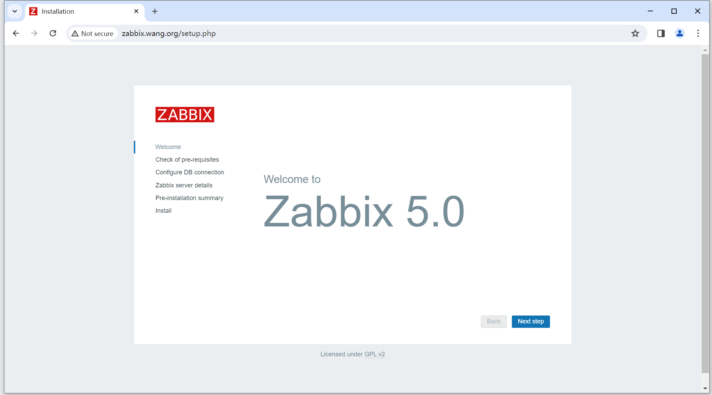
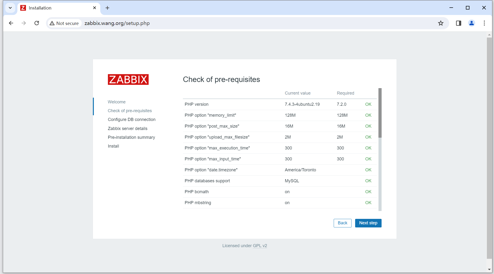
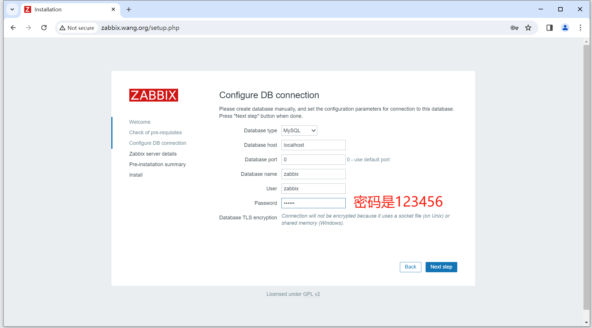
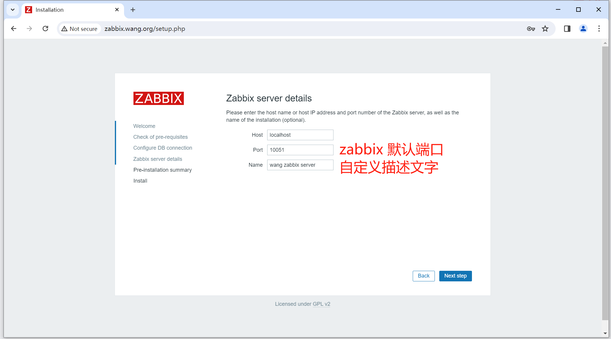
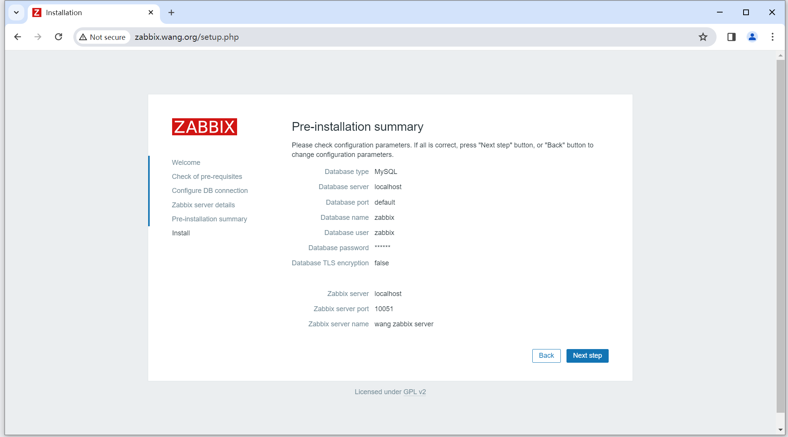
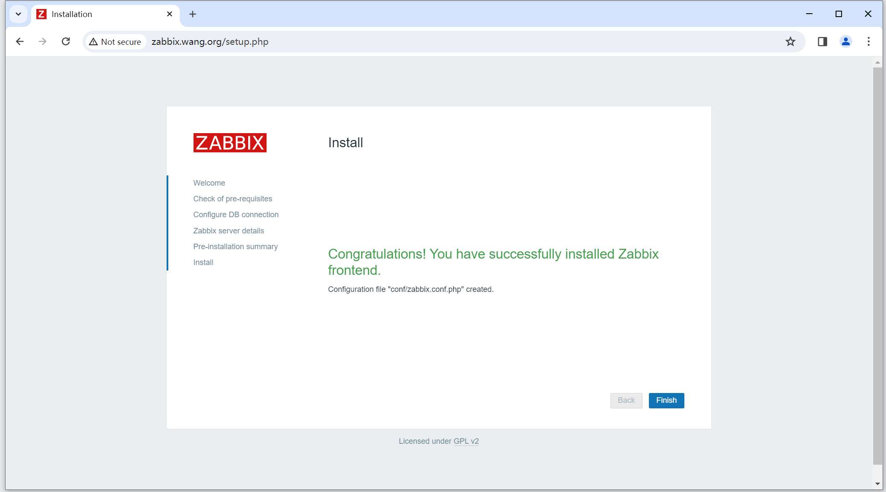
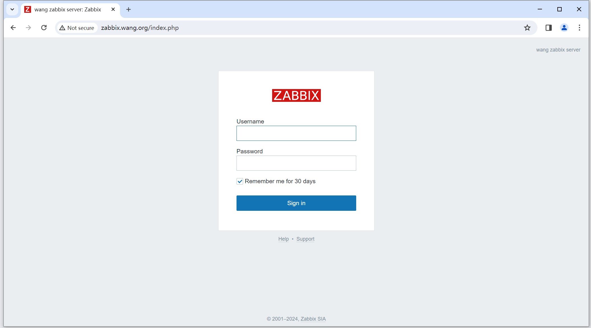
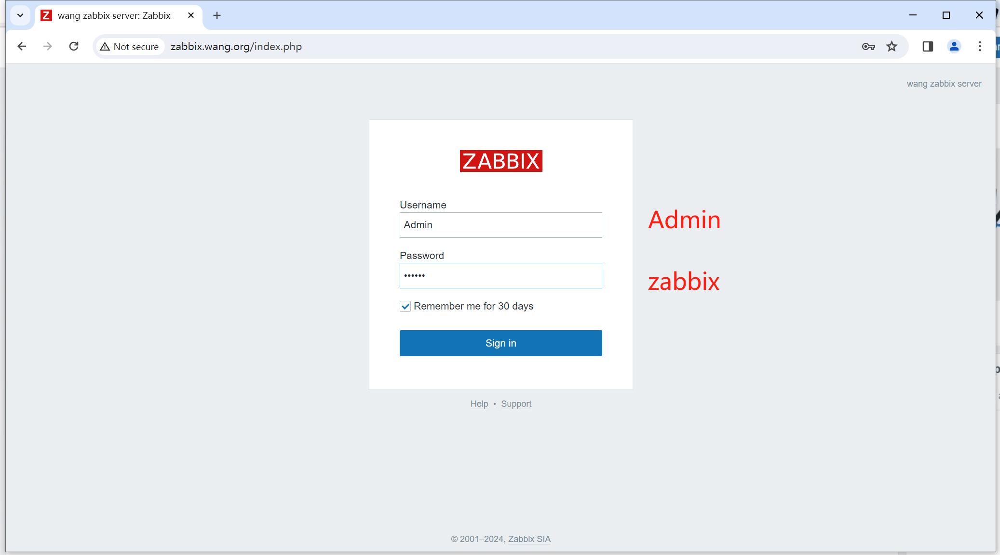
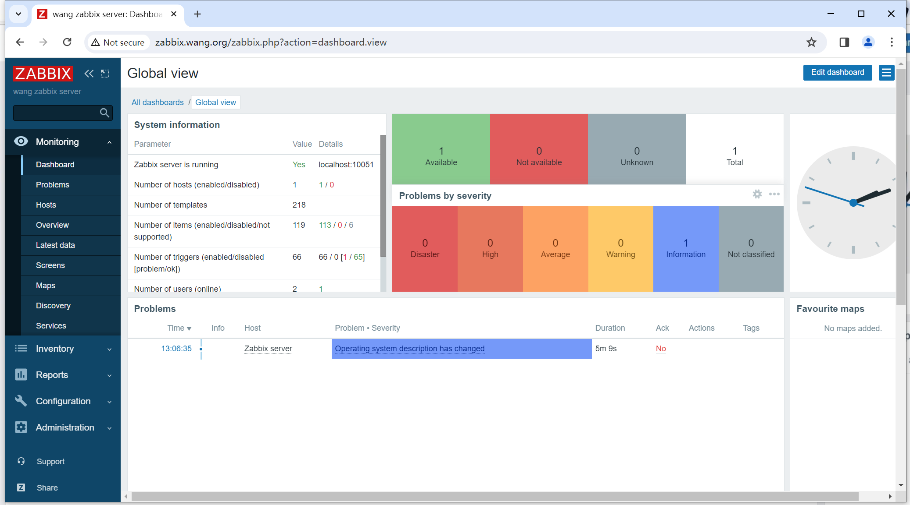

# 安装方法

+ 二进制包安装
+ 源码编译安装
+ 基于容器安装

https://www.zabbix.com/download 提供详细安装说明


举例：
LNMP + Ubuntu20.04 官方提供的安装文档
```sh
Install and configure Zabbix for your platform

a. Install Zabbix repository

# wget https://repo.zabbix.com/zabbix/5.0/ubuntu/pool/main/z/zabbix-release/zabbix-release_5.0-1+focal_all.deb
# dpkg -i zabbix-release_5.0-1+focal_all.deb
# apt update

这步的结果是生成一个repo文件，放在/et/apt/sources-list目录中。

b. 安装Zabbix server，Web前端，agent2
# apt install zabbix-server-mysql zabbix-frontend-php zabbix-nginx-conf zabbix-agent2

zabbix-agent 监控自己也需要安装agent。这里装agent2。它是基于go开发的。
项目：将zabbix 4.0 server升级成zabbix 5.0 server，将zabbix agent升级为zabbix agent2版本。

c. 创建初始数据库
Make sure you have database server up and running.

1. 在数据库主机上运行以下命令。

# mysql -uroot -p
password
mysql> create database zabbix character set utf8 collate utf8_bin;
mysql> create user zabbix@localhost identified by 'password';
mysql> grant all privileges on zabbix.* to zabbix@localhost;
mysql> set global log_bin_trust_function_creators = 1;
mysql> quit;

注意localhost，说明和zabbix服务器安装在同一台机器上。

2. 导入初始架构和数据，系统将提示您输入新创建的密码。

# zcat /usr/share/doc/zabbix-server-mysql*/create.sql.gz | mysql -uzabbix -p zabbix

3. Disable log_bin_trust_function_creators option after importing database schema.

# mysql -uroot -p
password
mysql> set global log_bin_trust_function_creators = 0;
mysql> quit;

d. 为Zabbix server配置数据库
编辑配置文件 /etc/zabbix/zabbix_server.conf

DBPassword=password

注意：这里配置简化了。如果前面数据库名不是zabbix，那这里会改动不少。

e. 为Zabbix前端配置PHP

1. 编辑配置文件 /etc/zabbix/nginx.conf uncomment and set 'listen' and 'server_name' directives.

# listen 80;
# server_name example.com;

注意：这里需要把#去掉，域名做解析。

2. 编辑配置文件 /etc/zabbix/php-fpm.conf uncomment and set the right timezone for you.

; php_value[date.timezone] = Europe/Riga

注意：时区调整为当地的。

f. 启动Zabbix server和agent进程
启动Zabbix server和agent进程，并为它们设置开机自启：

# systemctl restart zabbix-server zabbix-agent nginx php7.4-fpm
# systemctl enable zabbix-server zabbix-agent nginx php7.4-fpm

g. 配置zabbix前端
连接到新安装的Zabbix前端：http://server_ip_or_name
```

如果装apache，什么都不用改。
如果是访问域名中存在zabbix子目录，说明是apache安装的。没有zabbix子目录，就是nginx安装的。
比如：http://zabbix.wang.org/zabbix/

# 二进制包安装过程

需要部署一个DNS，目的是为被监控的机器提供DNS解析。可以使用DNS脚本来安装。

## 安装zabbix server 5.0

```sh
# 1. 更改机器名
[root@ubuntu2004:~]# hostnamectl set-hostname zabbix-server.magedu.com
[root@ubuntu2004:~]# exec bash

# 2. 配置DNS服务器，使用脚本安装
改动脚本中内容：
DOMAIN=wang.org
HOST=zabbix
HOST_IP=10.0.0.100

[root@zabbix-server:~]# bash install_dns.sh 

# 3. 安装zabbix的repo 
[root@zabbix-server:~]# wget https://repo.zabbix.com/zabbix/5.0/ubuntu/pool/main/z/zabbix-release/zabbix-release_5.0-1+focal_all.deb

[root@zabbix-server:~]# dpkg -i zabbix-release_5.0-1+focal_all.deb

[root@zabbix-server:~]# dpkg -L zabbix-release
/.
/etc
/etc/apt
/etc/apt/sources.list.d
/etc/apt/sources.list.d/zabbix.list
/etc/apt/trusted.gpg.d
/etc/apt/trusted.gpg.d/zabbix-official-repo.gpg
/usr
/usr/share
/usr/share/doc
/usr/share/doc/zabbix-release
/usr/share/doc/zabbix-release/README.Debian
/usr/share/doc/zabbix-release/changelog.Debian
/usr/share/doc/zabbix-release/copyright

[root@zabbix-server:~]# cat /etc/apt/sources.list.d/zabbix.list
deb http://repo.zabbix.com/zabbix/5.0/ubuntu focal main
deb-src http://repo.zabbix.com/zabbix/5.0/ubuntu focal main

# 4. 安装Zabbix server，Web前端，agent2
[root@zabbix-server:~]# apt update

[root@zabbix-server:~]# apt install zabbix-server-mysql zabbix-frontend-php zabbix-nginx-conf zabbix-agent2

# 5. 安装MySQL
[root@zabbix-server:~]# apt -y install mysql-server

# 6. 配置数据库（交互式）
[root@zabbix-server:~]# cat << EOF | mysql
create database zabbix character set utf8 collate utf8_bin;
create user zabbix@localhost identified by '123456';
grant all privileges on zabbix.* to zabbix@localhost;
set global log_bin_trust_function_creators = 1;
EOF

# 7. 初始化数据库
[root@zabbix-server:~]# zcat /usr/share/doc/zabbix-server-mysql*/create.sql.gz | mysql -uzabbix -p123456 zabbix

# 8. 导入数据架构后，更改
[root@zabbix-server:~]# mysql -uroot -p

mysql> set global log_bin_trust_function_creators = 0;
mysql> quit;

# 9. 为Zabbix server配置数据库
[root@zabbix-server:~]# vim /etc/zabbix/zabbix_server.conf
[root@zabbix-server:~]# sed -i.bak '/# DBPassword/a DBPassword=123456' /etc/zabbix/zabbix_server.conf

# 10. 为Zabbix前端配置PHP
[root@zabbix-server:~]# sed -i.bak '/^server/a\        listen 80;\n        server_name zabbix.wang.org;' /etc/zabbix/nginx.conf

注意：目前apache服务启动了。需要后面disable。

# 11. 更改时区
[root@zabbix-server:~]# sed -i '/date.timezone/c php_value[date.timezone] = America/Toronto' /etc/zabbix/php-fpm.conf

# 12. 启动服务
[root@zabbix-server:~]# systemctl restart zabbix-server zabbix-agent2 nginx php7.4-fpm
Job for nginx.service failed because the control process exited with error code.
See "systemctl status nginx.service" and "journalctl -xe" for details.

注意：报错的原因是nginx启动不了，因为apache服务器占用了80端口。
[root@zabbix-server:~]# cat /var/log/syslog

# 13. 停掉apache2
[root@zabbix-server:~]# systemctl disable --now apache2

# 14. 重新启动服务（注意：这里的官方文档是有问题的）
[root@zabbix-server:~]# systemctl restart zabbix-server zabbix-agent2 nginx php7.4-fpm

# 15. 设置为开机自启动
[root@zabbix-server:~]# systemctl is-enabled zabbix-server zabbix-agent2 nginx php7.4-fpm
disabled
enabled
enabled
enabled

[root@zabbix-server:~]# systemctl enable zabbix-server
```

## 初始化设置（图形）



















## 安装中文包

```sh
[root@zabbix-server:~]# apt -y install language-pack-zh-hans

[root@zabbix-server:~]# systemctl restart zabbix-server zabbix-agent2 nginx php7.4-fpm
```

## 处理字体
汉化不彻底。Windows字体是有版权的。
把windows字体手工拷贝到zabbix中。

```sh
[root@zabbix-server:~]# find /usr/share/zabbix/ -name "font*"
/usr/share/zabbix/assets/fonts
/usr/share/zabbix/fonts

[root@zabbix-server:~]# ls /usr/share/zabbix/assets/fonts
graphfont.ttf

到Windows中找喜欢的字体，拷贝进来，改为graphfont.ttf，就可以解决
```

##  监听端口
+ agent2监听10050
+ server端监听10051
+ 数据库监听3306
+ nginx和PHP 监听 80，没有9000是通过socket文件。
+ DNS监听的是53端口


# 源码编译安装

+ 官方文档
+ 通过脚本

# 通过容器安装


# 安装agent

使用脚本在被监控机器上安装
install_zabbix_agent2_5.0.sh

```sh
#!/bin/bash

ZABBIX_SERVER=10.0.0.100
ZABBIX_VER=5.0
URL="https://mirror.tuna.tsinghua.edu.cn/zabbix"

. /etc/os-release

color () {
    RES_COL=60
    MOVE_TO_COL="echo -en \\033[${RES_COL}G"
    SETCOLOR_SUCCESS="echo -en \\033[1;32m"
    SETCOLOR_FAILURE="echo -en \\033[1;31m"
    SETCOLOR_WARNING="echo -en \\033[1;33m"
    SETCOLOR_NORMAL="echo -en \E[0m"
    echo -n "$1" && $MOVE_TO_COL
    echo -n "["
    if [ $2 = "success" -o $2 = "0" ] ;then
        ${SETCOLOR_SUCCESS}
        echo -n $"  OK  "    
    elif [ $2 = "failure" -o $2 = "1"  ] ;then 
        ${SETCOLOR_FAILURE}
        echo -n $"FAILED"
    else
        ${SETCOLOR_WARNING}
        echo -n $"WARNING"
    fi
    ${SETCOLOR_NORMAL}
    echo -n "]"
    echo 
}

install_zabbix_agent2() {
    if [ $ID = "centos" -o $ID = "rocky" ];then
	     VERSION_ID=`echo $VERSION_ID|awk -F. '{print $1}'` 
         rpm -Uvh $URL/zabbix/${ZABBIX_VER}/rhel/${VERSION_ID}/x86_64/zabbix-release-${ZABBIX_VER}-1.el${VERSION_ID}.noarch.rpm
        if [ $? -eq 0 ];then
            color "YUM仓库准备完成" 0
        else
            color "YUM仓库配置失败,退出" 1
            exit
        fi
        sed -i 's#repo.zabbix.com#mirror.tuna.tsinghua.edu.cn/zabbix#' /etc/yum.repos.d/zabbix.repo
        yum -y install zabbix-agent2
    else 
        wget $URL/zabbix/${ZABBIX_VER}/ubuntu/pool/main/z/zabbix-release/zabbix-release_${ZABBIX_VER}-1+bionic_all.deb
        if [ $? -eq 0 ];then
            color "APT仓库准备完成" 0
        else
            color "APT仓库配置失败,退出" 1
            exit
        fi
        dpkg -i zabbix-release_${ZABBIX_VER}-1+bionic_all.deb
        sed -i 's#repo.zabbix.com#mirror.tuna.tsinghua.edu.cn/zabbix#'   /etc/apt/sources.list.d/zabbix.list
        apt update
        apt -y install zabbix-agent2
    fi
}

config_zabbix_agent2 (){ 
    sed -i -e "/^Server=127.0.0.1/c Server=$ZABBIX_SERVER"  -e "/^Hostname=Zabbix server/c Hostname=`hostname -I`"  /etc/zabbix/zabbix_agent2.conf
}

start_zabbix_agent2 () {
    systemctl enable zabbix-agent2.service
    systemctl restart zabbix-agent2.service
    systemctl is-active zabbix-agent2.service
    if [ $?  -eq 0 ];then  
        echo "-------------------------------------------------------------------"
        color "Zabbix Agent 安装完成!" 0
    else
        color "Zabbix Agent 安装失败" 1
        exit
    fi
}

install_zabbix_agent2
config_zabbix_agent2
start_zabbix_agent2

```

```sh
[root@rocky8 ~]# bash install_zabbix_agent2_5.0.sh

```

目前只是agent同意server去监控，还需要服务端主动添加被监控端。