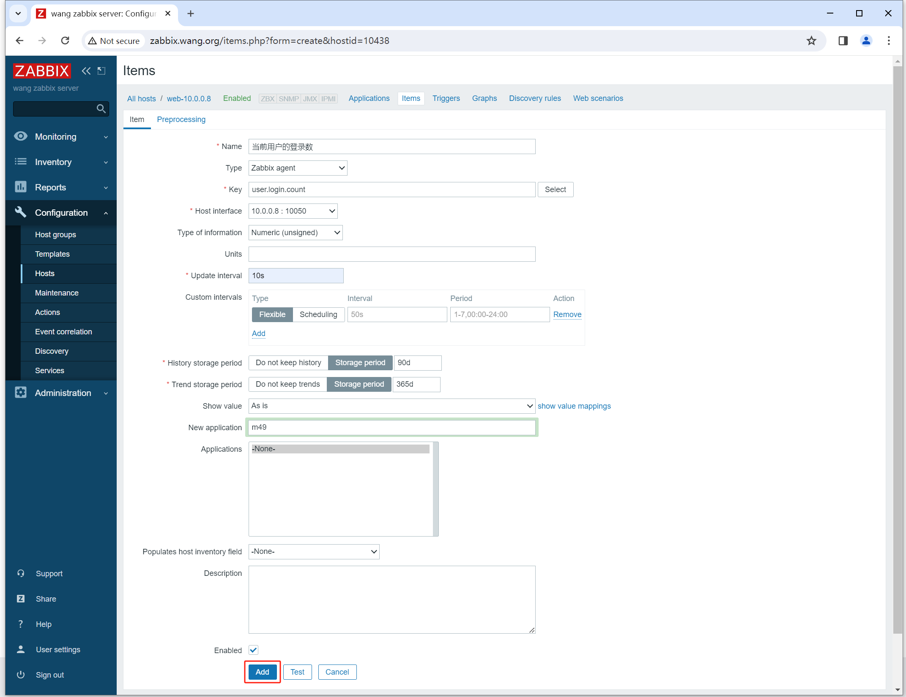
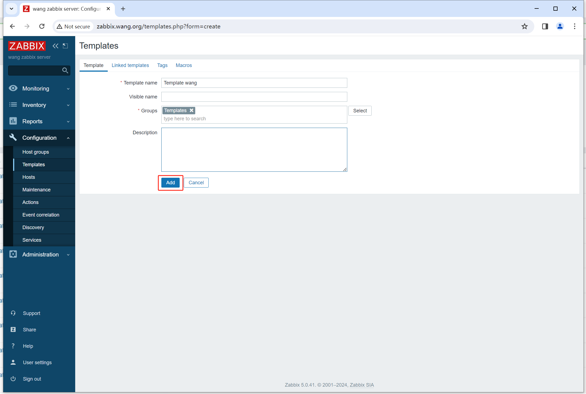

# 自定义监控项

1. 被控端添加监控项 /etc/zabbix/_agent2.d/xxx.conf UserParameter=key,命令（只要执行命令拿到值就可）
    + 需要重启服务
2. 服务器端测试 zabbix_get -s 主机 -k key
3. web 创建模板
4. web 在模板添加监控项
5. web 模板关联至主机
6. 观察数据和图形

核心是如何写命令

# 实例1：自定义监控项

1. agent上配置

```sh
# 配置监控项
[root@rocky8 ~]# vim /etc/zabbix/zabbix_agent2.d/user_login_count.conf
UserParameter=user.login.count,who|wc -l

# 测试
[root@rocky8 ~]# zabbix_agent2 -t user.login.count
user.login.count                              [s|2]

# 重启agent2服务
[root@rocky8 ~]# systemctl restart zabbix-agent2.service

# 服务器端可以获取该自定义监控项
[root@zabbix-server:~]# zabbix_get -s 10.0.0.8 -k user.login.count
2
```

2. 服务器端配置（图）





# 实例2：自定义监控项

```sh
[root@rocky8 ~]# vim /etc/zabbix/zabbix_agent2.d/test.conf
UserParameter=test[*],echo $1

[root@rocky8 ~]# zabbix_agent2 -t test[abc]
test[abc]                                     [s|abc]
[root@rocky8 ~]# zabbix_agent2 -t test[xyz]
test[xyz]                                     [s|xyz]

[root@rocky8 ~]# vim /etc/zabbix/zabbix_agent2.d/test.conf
UserParameter=test[*],echo $1 $2

[root@rocky8 ~]# zabbix_agent2 -t test[xyz,123]
test[xyz,123]                                 [s|xyz 123]

# test开头[参数] 表示key的通配符
```


# 实例3：自定义监控项和模板 -- tcp连接

自定义监控项支持加参数

1. 在agent上配置自定义监控项

```sh
[root@rocky8 ~]# vim /etc/zabbix/zabbix_agent2.d/tcp.state.conf
UserParameter=tcp.state[*],netstat -nat | grep -c $1

# 测试
[root@rocky8 ~]# zabbix_agent2 -t tcp.state[ESTABLISHED]
tcp.state[ESTABLISHED]                        [s|26]

[root@rocky8 ~]# zabbix_agent2 -t tcp.state[LISTEN]
tcp.state[LISTEN]                             [s|10]

# 重启服务
[root@rocky8 ~]# systemctl restart zabbix-agent2.service

# 服务器端测试
[root@zabbix-server:~]# zabbix_get -s 10.0.0.8 -k tcp.state[LISTEN]
10

```

2. 在服务器端配置自定义模板，然后添加自定义监控项





# 模板附加功能：

## 导出导入模板

+ 导出xml模板
+ 在其他的zabbix服务器上导入

## 模板兼容性

模板和zabbix的版本有关，模板并不兼容
4.0 --> 4.2 

解决方法：
1. 测试机安装zabbix 3.0
2. 测试机导入模板3.0
3. 将测试机升级zabbix3.0 --> zabbix4.0
4. 导出模板
5. 在zabbix4.0服务器上再导入模板

# 实例4：自定义监控项


[root@rocky8 ~]# free | awk 'NR==2{print $3/$2*100}'
34.747


[root@rocky8 ~]# free | awk 'NR==2{print (100-$3/$2*100)}'
65.2267


UserParameter=mem_use_percent,free | awk 'NR==2{print $3/$2*100}'
UserParameter=mem_unuse_percent,free | awk 'NR==2{print (100-$3/$2*100)}'

web界面添加到模板
克隆第二个项


# 监控项的值映射

名字：tcp监听端口80
官方带有的监控项
net.tcp.listern[80]

管理 一般 界面设置 值映射
创建值映射：tcp 端口状态
0 down
1 up

查看值：tcp 端口状态